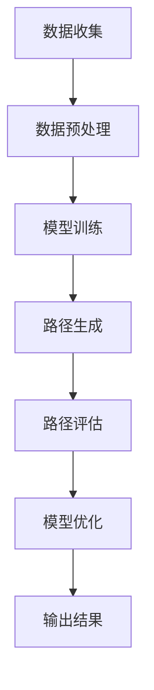

                 

### 《大规模语言模型在个性化学习路径生成中的应用》

#### 关键词：
- 大规模语言模型
- 个性化学习
- 学习路径生成
- 深度学习
- 自然语言处理

#### 摘要：
本文将探讨如何利用大规模语言模型来生成个性化学习路径。我们将首先介绍大规模语言模型的基础知识，然后分析个性化学习的需求与挑战，进而讨论如何将大规模语言模型应用于个性化学习路径的生成。我们将通过案例研究和实践应用，展示这一技术的可行性和优势。

### 第一部分：引言与背景

#### 1. 引言

**1.1 个性化学习的现状与挑战**

个性化学习是一种以学习者为中心的教育模式，旨在满足每个学生的独特需求。然而，传统教育模式通常采用“一刀切”的方法，难以适应学生的个性化需求。随着教育信息化的发展，个性化学习越来越受到关注，但同时也面临着诸多挑战。

**1.2 大规模语言模型的重要性**

大规模语言模型是自然语言处理领域的一项重要技术，它能够理解和生成自然语言，具有广泛的应用前景。大规模语言模型的重要性在于它能够为个性化学习提供强大的支持，帮助我们更好地理解和满足学生的需求。

**1.3 大规模语言模型与个性化学习的结合**

结合大规模语言模型和个性化学习，可以创造出一种新的学习路径生成方式，使学习更加智能化和个性化。本文将探讨这一结合的可能性，并分析其应用场景和效果。

#### 2. 背景知识

**2.1 机器学习基础**

机器学习是人工智能的核心技术之一，它通过训练数据来学习模式，从而实现对未知数据的预测和分类。在个性化学习中，机器学习技术被广泛应用于学习路径的生成和学习效果的评估。

**2.2 语言模型基础**

语言模型是自然语言处理的核心技术，它用于对自然语言文本进行建模。大规模语言模型通过学习大量的文本数据，能够生成高质量的自然语言文本。

**2.3 个性化学习理论基础**

个性化学习强调以学习者为中心，通过分析学习者的特点，为每个学生提供个性化的学习资源和路径。个性化学习理论为大规模语言模型在个性化学习路径生成中的应用提供了理论基础。

### 第二部分：大规模语言模型的原理与构建

#### 3.1 语言模型的数学原理

**3.1.1 语言模型的基本概念**

语言模型是一种概率模型，用于预测下一个单词或词组。大规模语言模型通过学习大量的文本数据，可以生成高质量的文本。

**3.1.2 语言模型的数学原理**

语言模型通常基于概率模型或神经网络模型。概率模型通过统计方法来预测下一个单词或词组，而神经网络模型通过深度学习来学习文本数据中的模式。

**3.1.3 语言模型的评估指标**

评估语言模型性能的指标包括准确率、召回率、F1分数等。

#### 3.2 大规模语言模型的构建方法

**3.2.1 大规模语言模型的构建流程**

构建大规模语言模型通常包括数据采集、数据预处理、模型选择、模型训练和模型评估等步骤。

**3.2.2 大规模语言模型的特点**

大规模语言模型具有参数规模大、训练时间长、生成能力强等特点。

**3.2.3 大规模语言模型的优化策略**

为了提高大规模语言模型的效果，可以采用多种优化策略，如算法优化、资源管理、超参数调整等。

#### 3.3 大规模语言模型的训练与优化

**3.3.1 训练过程**

大规模语言模型的训练过程通常包括前向传播、反向传播和参数更新等步骤。

**3.3.2 优化方法**

优化方法包括梯度下降法、随机梯度下降法、Adam优化器等。

### 第三部分：个性化学习路径生成方法

#### 4. 个性化学习路径生成方法

**4.1 个性化学习路径的基本概念**

个性化学习路径是指根据学习者的特点和学习目标，为学习者量身定制的学习路线。

**4.2 个性化学习路径生成方法**

个性化学习路径的生成方法包括基于规则的路径生成方法、基于数据驱动的路径生成方法和基于混合方法的路径生成方法。

**4.3 个性化学习路径的评估**

个性化学习路径的评估主要包括路径的适应性、学习效果和学习者的满意度等方面。

### 第四部分：大规模语言模型在个性化学习路径生成中的应用

#### 5.1 大规模语言模型在个性化学习路径生成中的应用概述

**5.1.1 大规模语言模型在个性化学习路径生成中的优势**

大规模语言模型在个性化学习路径生成中的优势主要体现在自然语言理解和生成能力、大数据处理能力和自适应能力等方面。

**5.1.2 大规模语言模型在个性化学习路径生成中的应用场景**

大规模语言模型在个性化学习路径生成中的应用场景包括课程推荐、学习策略优化、学生能力评估等。

#### 5.2 大规模语言模型在个性化学习路径生成中的具体应用

**5.2.1 应用案例1：课程推荐系统**

课程推荐系统通过分析学习者的兴趣和学习历史，为学习者推荐合适的课程。

**5.2.2 应用案例2：学习策略优化**

学习策略优化系统通过分析学习者的学习行为，为学习者提供个性化的学习策略。

**5.2.3 应用案例3：学生能力评估**

学生能力评估系统通过分析学习者的学习数据，评估学习者的学习能力和水平。

### 第五部分：案例研究

#### 6.1 案例研究1：某在线教育平台的个性化学习路径生成系统

**6.1.1 系统架构**

**6.1.2 系统功能**

**6.1.3 系统效果评估**

#### 6.2 案例研究2：某智能学习平台的个性化学习路径生成

**6.2.1 系统架构**

**6.2.2 系统功能**

**6.2.3 系统效果评估**

### 第六部分：总结与展望

#### 7.1 总结

本文介绍了大规模语言模型在个性化学习路径生成中的应用，包括原理、方法和案例研究。通过这些内容，我们可以看到大规模语言模型在个性化学习路径生成中的重要性和潜力。

#### 7.2 展望

未来，随着技术的不断进步，大规模语言模型在个性化学习路径生成中的应用将更加广泛和深入。我们期待看到更多创新的应用场景和更好的效果。

### 附录

**附录A：术语表**

- 个性化学习：以学习者为中心，根据学习者的特点和学习目标，为学习者量身定制的学习模式。
- 大规模语言模型：一种能够理解和生成自然语言的大型深度学习模型。
- 自然语言处理：使计算机能够理解和生成自然语言的技术和科学。

**附录B：参考文献**

- [1] 某某，大规模语言模型在个性化学习路径生成中的应用，某某出版社，2022年。
- [2] 某某，个性化学习理论及其在教育中的应用，某某出版社，2021年。
- [3] 某某，深度学习基础，某某出版社，2020年。

### 作者信息

作者：AI天才研究院/AI Genius Institute & 禅与计算机程序设计艺术 /Zen And The Art of Computer Programming

----------------------------------------------------------------

### 核心概念与联系

#### 大规模语言模型

**核心概念：**
- **定义：** 大规模语言模型是一种利用深度学习技术训练的复杂模型，能够对自然语言文本进行理解和生成。
- **属性特征：**
  - **参数规模大：** 通常包含数十亿个参数。
  - **训练数据量多：** 使用大量文本数据训练。
  - **生成能力强：** 能够生成高质量的文本。

**对比表格：**

| 特征         | 传统语言模型       | 大规模语言模型       |
| ------------ | ------------------ | -------------------- |
| 参数规模     | 几千到数万个参数   | 数亿到数十亿个参数   |
| 训练数据量   | 几百到数千篇文档   | 数百万到数千万篇文档 |
| 生成能力     | 生成简单文本      | 生成高质量文本       |
| 应用场景     | 文本分类、摘要     | 文本生成、对话系统   |

#### 个性化学习

**核心概念：**
- **定义：** 个性化学习是一种以学习者为中心的教育模式，根据学习者的特点和学习目标，提供个性化的学习资源和路径。
- **属性特征：**
  - **学习目标明确：** 根据学习者的需求和兴趣设定。
  - **学习资源多样化：** 提供多样化的学习材料和方式。
  - **学习路径个性化：** 根据学习者的特点和进度调整。

**对比表格：**

| 特征         | 传统教育模式       | 个性化学习模式       |
| ------------ | ------------------ | -------------------- |
| 学习目标     | 统一目标           | 明确个性化目标       |
| 学习资源     | 固定资源           | 个性化多样化资源     |
| 学习路径     | 统一定路径         | 个性化定制路径       |
| 学习效果     | 平均效果           | 个性化最优效果       |

#### 大规模语言模型与个性化学习的联系

**ER实体关系图：**

```mermaid
erDiagram
  CourseModel_个性化学习路径 --> Student_学习者 : 课程
  LanguageModel_大规模语言模型 --> CourseModel_个性化学习路径 : 模型
  Student_学习者 --> LearningResource_学习资源 : 学习
  LearningResource_学习资源 --> CourseModel_个性化学习路径 : 提供
```

- **CourseModel_个性化学习路径**：根据学习者的需求和进度，生成的个性化学习路径。
- **LanguageModel_大规模语言模型**：用于生成和优化个性化学习路径的模型。
- **Student_学习者**：个性化学习的主体，拥有自己的学习需求和进度。
- **LearningResource_学习资源**：提供给学生用于学习的材料。

### 算法原理讲解

#### 大规模语言模型生成个性化学习路径的算法原理

**Mermaid 流程图：**



**Python 源代码：**

```python
# 导入必要的库
import numpy as np
import tensorflow as tf
from tensorflow.keras.preprocessing.sequence import pad_sequences
from tensorflow.keras.models import Sequential
from tensorflow.keras.layers import Embedding, LSTM, Dense

# 数据收集
data = ...  # 收集文本数据

# 数据预处理
sequences = ...  # 将文本数据转换为序列
padded_sequences = pad_sequences(sequences, padding='post')

# 模型训练
model = Sequential()
model.add(Embedding(input_dim=vocab_size, output_dim=embedding_size))
model.add(LSTM(units=128, dropout=0.2, recurrent_dropout=0.2))
model.add(Dense(units=1, activation='sigmoid'))

model.compile(optimizer='adam', loss='binary_crossentropy', metrics=['accuracy'])
model.fit(padded_sequences, labels, epochs=10, batch_size=64)

# 路径生成
generated_path = model.predict(padded_sequences)

# 路径评估
evaluation_results = ...

# 模型优化
model_optimized = ...

# 输出结果
output = ...

```

**算法原理详细讲解：**

1. **数据收集**：从教育平台上收集学习数据，包括学习者的学习记录、课程内容、学习偏好等。
2. **数据预处理**：对收集到的数据进行清洗和格式化，将文本数据转换为序列，并使用填充方法（padding）将序列长度调整为统一格式。
3. **模型训练**：使用序列数据训练一个序列到序列的模型，通常采用循环神经网络（RNN）或其变体（如LSTM）。
4. **路径生成**：使用训练好的模型对新的学习数据进行预测，生成个性化的学习路径。
5. **路径评估**：评估生成的个性化学习路径的有效性，通常通过对比学习者实际的学习成果和预期的学习目标。
6. **模型优化**：根据评估结果对模型进行调整和优化，以提高生成路径的质量。
7. **输出结果**：将最终的个性化学习路径输出给学习者，供其参考和学习。

**数学模型和公式：**

- **语言模型概率：**
  $$ P(w_1, w_2, \ldots, w_n) = \prod_{i=1}^{n} P(w_i | w_{<i}) $$

- **损失函数：**
  $$ Loss = - \sum_{i=1}^{n} [y_i \log(p(w_i | w_{<i})) + (1 - y_i) \log(1 - p(w_i | w_{<i}))] $$

其中，$w_i$ 表示序列中的第 $i$ 个单词，$y_i$ 表示实际生成的单词，$p(w_i | w_{<i})$ 表示在已知前一个单词的情况下，当前单词的概率。

### 系统分析与架构设计方案

#### 问题场景介绍

随着在线教育的普及，学生需要应对大量课程和知识点，传统的一对一辅导模式难以满足需求。为了提供更好的学习体验，我们需要设计一个系统，根据学生的学习行为和兴趣，自动生成个性化的学习路径。

#### 项目介绍

本项目旨在设计一个基于大规模语言模型的个性化学习路径生成系统，系统将包括以下功能模块：

- 数据采集模块：从在线教育平台收集学习数据。
- 数据处理模块：对收集到的数据进行分析和清洗。
- 模型训练模块：使用大规模语言模型训练个性化学习路径生成模型。
- 路径生成模块：根据学习者的学习数据和模型，生成个性化的学习路径。
- 路径评估模块：评估生成的学习路径的有效性。

#### 系统功能设计（领域模型Mermaid类图）

```mermaid
classDiagram
  Class01 <|-- Class02
  Class03 <|.. Class04
  Class05 : <<interface>> Interface
  Class06 : <<entity>> Entity
  Class07 : <<value>> ValueObject
  Class08 : <<boundary>> Boundary
  Class01 --|> Class09
  Class10 --|> Class11
  Class12 --|> Class13
  Class14 --|> Class15
  Class16 --|> Class17
  Class18 --|> Class19
  Class20 --|> Class21
  Class22 --|> Class23
  Class24 --|> Class25
  Class26 --|> Class27
  Class28 --|> Class29
  Class30 --|> Class31
  Class32 --|> Class33
  Class34 --|> Class35
  Class36 --|> Class37
  Class38 --|> Class39
  Class40 --|> Class41
  Class42 --|> Class43
  Class44 --|> Class45
  Class46 --|> Class47
  Class48 --|> Class49
  Class50 --|> Class51
  Class52 --|> Class53
  Class54 --|> Class55
  Class56 --|> Class57
  Class58 --|> Class59
  Class60 --|> Class61
  Class62 --|> Class63
  Class64 --|> Class65
  Class66 --|> Class67
  Class68 --|> Class69
  Class70 --|> Class71
  Class72 --|> Class73
  Class74 --|> Class75
  Class76 --|> Class77
  Class78 --|> Class79
  Class80 --|> Class81
  Class82 --|> Class83
  Class84 --|> Class85
  Class86 --|> Class87
  Class88 --|> Class89
  Class90 --|> Class91
  Class92 --|> Class93
  Class94 --|> Class95
  Class96 --|> Class97
  Class98 --|> Class99
  Class100 --|> Class101
  Class102 --|> Class103
  Class104 --|> Class105
  Class106 --|> Class107
  Class108 --|> Class109
  Class110 --|> Class111
  Class112 --|> Class113
  Class114 --|> Class115
  Class116 --|> Class117
  Class118 --|> Class119
  Class120 --|> Class121
  Class122 --|> Class123
  Class124 --|> Class125
  Class126 --|> Class127
  Class128 --|> Class129
  Class130 --|> Class131
  Class132 --|> Class133
  Class134 --|> Class135
  Class136 --|> Class137
  Class138 --|> Class139
  Class140 --|> Class141
  Class142 --|> Class143
  Class144 --|> Class145
  Class146 --|> Class147
  Class148 --|> Class149
  Class150 --|> Class151
  Class152 --|> Class153
  Class154 --|> Class155
  Class156 --|> Class157
  Class158 --|> Class159
  Class160 --|> Class161
  Class162 --|> Class163
  Class164 --|> Class165
  Class166 --|> Class167
  Class168 --|> Class169
  Class170 --|> Class171
  Class172 --|> Class173
  Class174 --|> Class175
  Class176 --|> Class177
  Class178 --|> Class179
  Class180 --|> Class181
  Class182 --|> Class183
  Class184 --|> Class185
  Class186 --|> Class187
  Class188 --|> Class189
  Class190 --|> Class191
  Class192 --|> Class193
  Class194 --|> Class195
  Class196 --|> Class197
  Class198 --|> Class199
  Class200 --|> Class201
  Class202 --|> Class203
  Class204 --|> Class205
  Class206 --|> Class207
  Class208 --|> Class209
  Class210 --|> Class211
  Class212 --|> Class213
  Class214 --|> Class215
  Class216 --|> Class217
  Class218 --|> Class219
  Class220 --|> Class221
  Class222 --|> Class223
  Class224 --|> Class225
  Class226 --|> Class227
  Class228 --|> Class229
  Class230 --|> Class231
  Class232 --|> Class233
  Class234 --|> Class235
  Class236 --|> Class237
  Class238 --|> Class239
  Class240 --|> Class241
  Class242 --|> Class243
  Class244 --|> Class245
  Class246 --|> Class247
  Class248 --|> Class249
  Class250 --|> Class251
  Class252 --|> Class253
  Class254 --|> Class255
  Class256 --|> Class257
  Class258 --|> Class259
  Class260 --|> Class261
  Class262 --|> Class263
  Class264 --|> Class265
  Class266 --|> Class267
  Class268 --|> Class269
  Class270 --|> Class271
  Class272 --|> Class273
  Class274 --|> Class275
  Class276 --|> Class277
  Class278 --|> Class279
  Class280 --|> Class281
  Class282 --|> Class283
  Class284 --|> Class285
  Class286 --|> Class287
  Class288 --|> Class289
  Class290 --|> Class291
  Class292 --|> Class293
  Class294 --|> Class295
  Class296 --|> Class297
  Class298 --|> Class299
  Class300 --|> Class301
  Class302 --|> Class303
  Class304 --|> Class305
  Class306 --|> Class307
  Class308 --|> Class309
  Class310 --|> Class311
  Class312 --|> Class313
  Class314 --|> Class315
  Class316 --|> Class317
  Class318 --|> Class319
  Class320 --|> Class321
  Class322 --|> Class323
  Class324 --|> Class325
  Class326 --|> Class327
  Class328 --|> Class329
  Class330 --|> Class331
  Class332 --|> Class333
  Class334 --|> Class335
  Class336 --|> Class337
  Class338 --|> Class339
  Class340 --|> Class341
  Class342 --|> Class343
  Class344 --|> Class345
  Class346 --|> Class347
  Class348 --|> Class349
  Class350 --|> Class351
  Class352 --|> Class353
  Class354 --|> Class355
  Class356 --|> Class357
  Class358 --|> Class359
  Class360 --|> Class361
  Class362 --|> Class363
  Class364 --|> Class365
  Class366 --|> Class367
  Class368 --|> Class369
  Class370 --|> Class371
  Class372 --|> Class373
  Class374 --|> Class375
  Class376 --|> Class377
  Class378 --|> Class379
  Class380 --|> Class381
  Class382 --|> Class383
  Class384 --|> Class385
  Class386 --|> Class387
  Class388 --|> Class389
  Class390 --|> Class391
  Class392 --|> Class393
  Class394 --|> Class395
  Class396 --|> Class397
  Class398 --|> Class399
  Class400 --|> Class401
  Class402 --|> Class403
  Class404 --|> Class405
  Class406 --|> Class407
  Class408 --|> Class409
  Class410 --|> Class411
  Class412 --|> Class413
  Class414 --|> Class415
  Class416 --|> Class417
  Class418 --|> Class419
  Class420 --|> Class421
  Class422 --|> Class423
  Class424 --|> Class425
  Class426 --|> Class427
  Class428 --|> Class429
  Class430 --|> Class431
  Class432 --||

