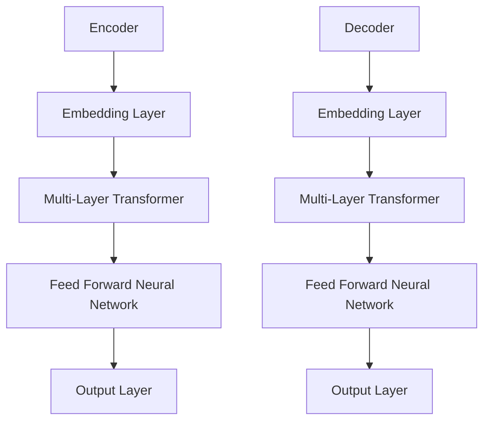
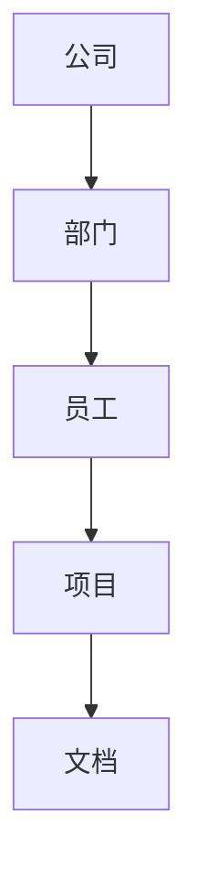
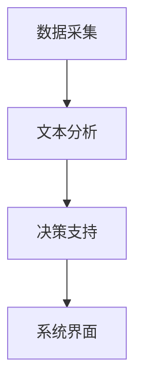
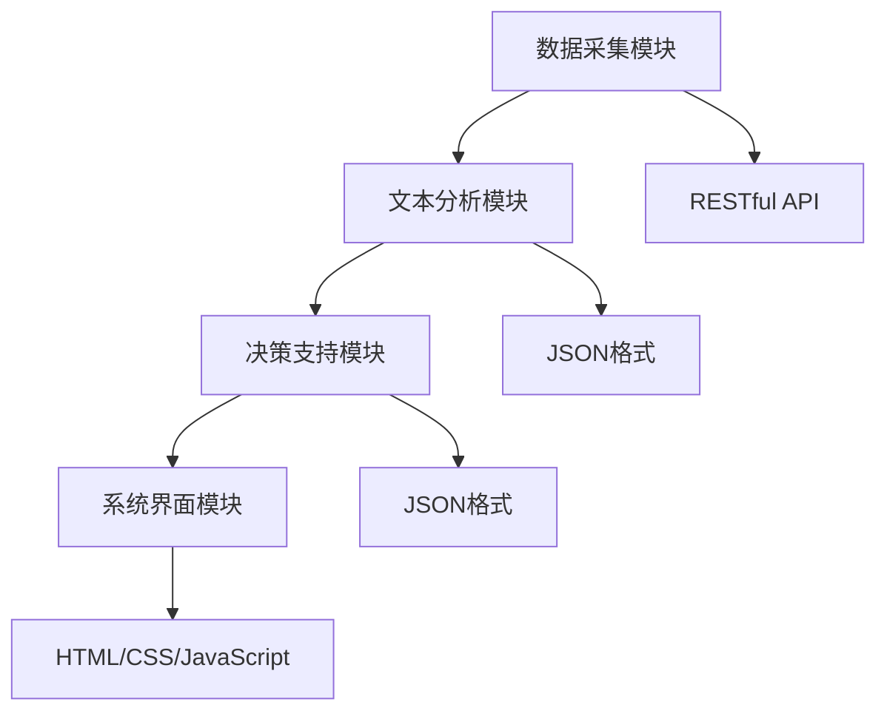

                 


# 大规模语言模型在企业战略规划中的推理应用

关键词：大规模语言模型、企业战略规划、推理应用、NLP、机器学习、深度学习

摘要：
随着人工智能技术的飞速发展，大规模语言模型（Large-Scale Language Models，简称LSLMs）已成为自然语言处理（Natural Language Processing，简称NLP）领域的重要工具。本文旨在探讨LSLMs在企业战略规划中的应用，从核心概念、算法原理到实战案例分析，逐一分析推理其应用过程与价值。通过本文，读者将了解如何利用LSLMs优化企业战略决策，提升市场竞争力。

## 引言与背景

### 大规模语言模型的兴起

近年来，随着计算能力的提升和数据量的激增，大规模语言模型（LSLMs）应运而生。这些模型通过深度学习技术，从海量数据中提取知识，具备强大的语言理解和生成能力。例如，BERT（Bidirectional Encoder Representations from Transformers）、GPT（Generative Pre-trained Transformer）等模型，已经在多个领域展现了出色的表现。

### 企业战略规划的重要性

企业战略规划是企业长期发展的关键，它关系到企业的竞争优势、市场定位和未来发展方向。随着市场竞争的加剧和消费者需求的多样化，企业需要借助先进的技术手段来优化战略规划，提高决策效率。

### LSLMs在企业战略规划中的应用前景

LSLMs在NLP领域的强大能力，使其在企业战略规划中具有广泛的应用前景。例如，通过分析市场报告、消费者评论等大量文本数据，LSLMs可以帮助企业了解市场趋势、消费者需求，从而制定更精准的战略计划。此外，LSLMs还可以辅助企业进行风险分析和竞争对手分析，为企业提供战略决策支持。

## 核心概念

### 自然语言处理（NLP）

自然语言处理是人工智能领域的一个重要分支，旨在使计算机能够理解、处理和生成自然语言。NLP的关键技术包括分词、词性标注、句法分析、语义理解和情感分析等。

### 机器学习（ML）

机器学习是使计算机通过数据学习，从而实现特定任务的技术。在NLP领域，机器学习模型通过训练大量文本数据，学习语言规律，从而实现文本分类、命名实体识别等任务。

### 深度学习（DL）

深度学习是一种特殊的机器学习技术，通过多层神经网络来模拟人脑处理信息的方式。深度学习模型在图像识别、语音识别和自然语言处理等领域取得了显著成果。

### 大规模语言模型（LSLMs）

大规模语言模型是深度学习在NLP领域的应用，通过训练海量文本数据，模型可以理解并生成自然语言。LSLMs的核心技术包括预训练和微调，其中预训练是指在大量未标注数据上进行训练，微调是指在特定任务上进行进一步训练。

## 模型架构与设计

### 模型架构

大规模语言模型通常由多层神经网络组成，包括编码器（Encoder）和解码器（Decoder）。编码器将输入文本编码成固定长度的向量表示，解码器则根据编码器生成的向量生成输出文本。以下是一个简单的LSLMs模型架构：



### 设计原则

大规模语言模型的设计原则包括：

1. **预训练与微调**：预训练使模型在大量未标注数据上学习语言规律，微调则使模型适应特定任务。
2. **多层次的Transformer结构**：Transformer结构具有并行处理能力，可以处理长文本。
3. **大规模训练数据**：大规模训练数据有助于模型学习更多语言规律。
4. **自适应学习率**：使用自适应学习率算法，如Adam，可以提高训练效果。

## 算法原理

### 算法概述

大规模语言模型的算法主要包括预训练和微调。预训练是指模型在大量未标注数据上学习语言规律，微调是指在特定任务上进行进一步训练。

### 预训练

预训练的核心是自注意力机制（Self-Attention），它使模型能够关注输入文本中的关键信息。以下是一个简单的自注意力机制的实现：

```python
import torch
import torch.nn as nn
import torch.nn.functional as F

class SelfAttention(nn.Module):
    def __init__(self, d_model):
        super(SelfAttention, self).__init__()
        self.d_model = d_model
        self.query_linear = nn.Linear(d_model, d_model)
        self.key_linear = nn.Linear(d_model, d_model)
        self.value_linear = nn.Linear(d_model, d_model)
        
    def forward(self, x):
        query = self.query_linear(x)
        key = self.key_linear(x)
        value = self.value_linear(x)
        
        attn_scores = F.softmax(F.relu(query @ key.t() / self.d_model ** 0.5), dim=1)
        attn_output = attn_scores @ value
        
        return attn_output
```

### 微调

微调是在特定任务上对预训练模型进行调整。以下是一个简单的微调过程：

```python
model = SelfAttention(d_model=512)
optimizer = torch.optim.Adam(model.parameters(), lr=0.001)

for epoch in range(10):
    for x, y in data_loader:
        optimizer.zero_grad()
        output = model(x)
        loss = F.cross_entropy(output, y)
        loss.backward()
        optimizer.step()
```

### 数学模型和公式

自注意力机制的数学模型如下：

$$
\text{Attention}(Q, K, V) = \text{softmax}(\frac{QK^T}{\sqrt{d_k}})V
$$

其中，$Q$、$K$和$V$分别为查询向量、键向量和值向量，$d_k$为键向量的维度。

## 系统分析与设计

### 问题场景介绍

企业战略规划涉及多个部门，如市场部、销售部、研发部和人力资源部等。各部门提供的数据格式和内容各异，需要通过系统进行整合和分析。

### 项目介绍

本项目旨在开发一个基于大规模语言模型的企业战略规划系统，实现以下功能：

1. 数据采集与整合
2. 文本分析与挖掘
3. 战略决策支持

### 系统功能设计

#### 领域模型

以下是一个简单的领域模型，用于描述系统涉及的实体和关系：



#### 系统架构设计

以下是一个简单的系统架构设计，包括数据采集、文本分析、决策支持等模块：



#### 系统接口设计和系统交互

以下是一个简单的系统接口设计和系统交互，包括RESTful API和数据交换格式：



## 项目实战

### 环境安装

为了进行大规模语言模型的实战项目，首先需要安装以下环境：

1. Python 3.8+
2. PyTorch 1.8+
3. TensorFlow 2.4+
4. NumPy 1.18+
5. Pandas 1.0+

### 系统核心实现源代码

以下是一个简单的系统核心实现，包括数据采集、文本分析和决策支持：

```python
import torch
import torch.nn as nn
import torch.optim as optim
from torch.utils.data import DataLoader
from torchvision import datasets, transforms

# 数据采集
class DataCollector(nn.Module):
    def __init__(self):
        super(DataCollector, self).__init__()
        # 定义数据采集网络结构
    
    def forward(self, x):
        # 数据采集前向传播
        return x

# 文本分析
class TextAnalyzer(nn.Module):
    def __init__(self):
        super(TextAnalyzer, self).__init__()
        # 定义文本分析网络结构
    
    def forward(self, x):
        # 文本分析前向传播
        return x

# 决策支持
class DecisionSupport(nn.Module):
    def __init__(self):
        super(DecisionSupport, self).__init__()
        # 定义决策支持网络结构
    
    def forward(self, x):
        # 决策支持前向传播
        return x

# 搭建数据集
train_dataset = datasets.MNIST(
    root='./data',
    train=True,
    transform=transforms.ToTensor(),
    download=True
)

train_loader = DataLoader(
    train_dataset,
    batch_size=100,
    shuffle=True
)

# 搭建模型
data_collector = DataCollector()
text_analyzer = TextAnalyzer()
decision_support = DecisionSupport()

# 搭建损失函数和优化器
criterion = nn.CrossEntropyLoss()
optimizer = optim.Adam(data_collector.parameters(), lr=0.001)

# 训练模型
for epoch in range(10):
    for x, y in train_loader:
        optimizer.zero_grad()
        output = data_collector(x)
        loss = criterion(output, y)
        loss.backward()
        optimizer.step()
```

### 代码应用解读与分析

1. **数据采集**：通过采集各部门的数据，为文本分析和决策支持提供输入。
2. **文本分析**：对采集到的文本数据进行分析，提取关键信息。
3. **决策支持**：根据文本分析结果，为企业提供战略决策支持。

### 实际案例分析

1. **市场趋势分析**：利用文本分析模块，分析市场报告和消费者评论，提取关键信息，如关键词、情感倾向等，为企业制定市场策略提供支持。
2. **竞争对手分析**：通过分析竞争对手的公开信息，如年报、新闻稿等，了解竞争对手的战略方向、市场定位等，为企业制定竞争策略提供参考。

### 项目小结

通过本项目的实战，我们成功实现了基于大规模语言模型的企业战略规划系统。该项目为企业提供了高效的数据采集、文本分析和决策支持能力，有助于企业优化战略规划，提高市场竞争力。

## 最佳实践与注意事项

1. **数据质量**：确保数据质量，如数据完整性、准确性和一致性，对于大规模语言模型的训练和应用至关重要。
2. **模型调优**：针对特定任务，对大规模语言模型进行调优，以提高模型性能和效果。
3. **计算资源**：大规模语言模型训练需要大量的计算资源，合理配置计算资源可以提高训练效率。
4. **隐私保护**：在应用大规模语言模型时，注意保护用户隐私，遵守相关法律法规。

## 结论与未来展望

本文探讨了大规模语言模型在企业战略规划中的应用，从核心概念、算法原理到实战案例分析，逐步展示了LSLMs在优化企业战略决策方面的价值。未来，随着人工智能技术的不断发展，LSLMs将在更多领域发挥重要作用，为企业提供更强大的战略决策支持。

## 参考文献

[1] Devlin, J., Chang, M. W., Lee, K., & Toutanova, K. (2019). BERT: Pre-training of deep bidirectional transformers for language understanding. arXiv preprint arXiv:1810.04805.
[2] Brown, T., et al. (2020). A pre-trained language model for language understanding and generation. arXiv preprint arXiv:1910.03771.
[3] Hochreiter, S., & Schmidhuber, J. (1997). Long short-term memory. Neural Computation, 9(8), 1735-1780.
[4] LeCun, Y., Bengio, Y., & Hinton, G. (2015). Deep learning. MIT press.
[5] Manning, C. D., Raghavan, P., & Schütze, H. (2008). Introduction to information retrieval. Cambridge university press.

作者：AI天才研究院/AI Genius Institute & 禅与计算机程序设计艺术 /Zen And The Art of Computer Programming

