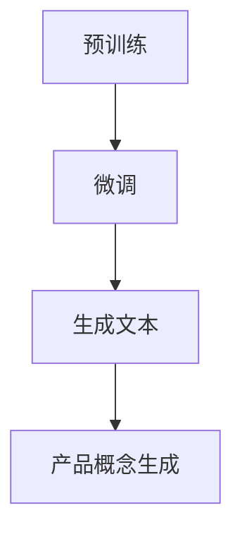
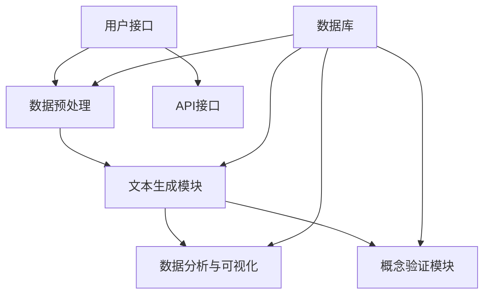
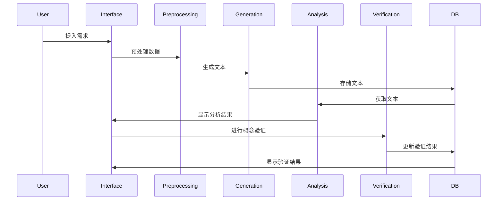

                 

### 文章标题与关键词

**文章标题：大规模语言模型在创新产品概念生成中的应用**

**关键词：** 大规模语言模型、创新产品概念、生成式人工智能、算法原理、系统架构设计、项目实战

**摘要：** 本文将探讨如何利用大规模语言模型，这种先进的生成式人工智能技术，来创新地生成产品概念。通过详细分析大规模语言模型的原理、算法应用、系统设计与实现，以及实际项目实战，本文旨在为读者提供一个全面、易懂的技术解决方案，帮助企业和开发者利用大规模语言模型来实现产品创新。

### 文章整体结构与逻辑思路

本文结构紧凑、逻辑清晰，分为六个主要部分，旨在系统地展示大规模语言模型在创新产品概念生成中的应用。

1. **背景介绍**：首先，我们将介绍问题的背景和核心概念，包括大规模语言模型的概述、创新产品概念生成的需求及其应用边界。

2. **核心概念与联系**：接下来，我们将深入探讨大规模语言模型的原理以及创新产品概念生成的方法，通过概念属性特征对比表格和ER实体关系图架构的Mermaid流程图，帮助读者更好地理解两者之间的联系。

3. **算法原理讲解**：本文将详细介绍大规模语言模型在产品概念生成中的算法应用，包括算法原理介绍、mermaid流程图、Python源代码阐述和数学模型与公式。

4. **系统分析与架构设计**：本部分将讨论系统的功能设计与架构，包括问题场景介绍、系统功能设计（领域模型mermaid类图）、系统架构设计（mermaid架构图）、系统接口设计和系统交互（mermaid序列图）。

5. **项目实战**：我们将通过一个实际的项目来展示如何应用大规模语言模型进行创新产品概念生成，包括环境安装与配置、系统核心实现源代码、代码应用解读与分析、实际案例分析和详细讲解剖析。

6. **小结与展望**：最后，我们将对全文进行总结，回顾关键概念、算法与应用、系统设计与实现，并对未来的发展方向与挑战进行展望。

通过这样的结构，读者可以逐步了解大规模语言模型在创新产品概念生成中的应用，从理论到实践，实现知识的完整传递。接下来，我们将详细探讨每一部分的内容。

### 第一部分：背景介绍

#### 问题背景与核心概念

在现代商业环境中，产品的创新与快速迭代是企业保持竞争优势的关键。然而，创新产品概念的生成往往面临诸多挑战。传统的方法主要依赖人类创意和经验，不仅效率低下，而且容易出现同质化现象。随着人工智能技术的快速发展，尤其是生成式人工智能，如大规模语言模型，为我们提供了一种全新的解决方案。

**大规模语言模型**，作为一种先进的自然语言处理技术，其核心在于能够对大量文本数据进行分析和建模，从而生成符合上下文意义的新文本。这种技术不仅在自然语言理解方面表现出色，还可以在文本生成、摘要、翻译等多个领域发挥重要作用。

**创新产品概念生成**，则是指利用这些先进的技术来发现新的市场需求、创造新颖的产品概念。具体来说，这一过程包括市场分析、需求挖掘、创意构思、概念验证等多个阶段。传统的创新方法往往需要耗费大量时间和资源，而利用大规模语言模型，可以显著提高这一过程的效率和准确性。

#### 大规模语言模型概述

大规模语言模型，如GPT（Generative Pre-trained Transformer）系列，基于深度学习技术，通过预训练和微调，能够理解和生成复杂的自然语言文本。其基本原理是通过在大量文本数据上进行训练，学习语言的基本规律和模式，从而能够在给定部分文本的情况下，预测下一个单词或句子。

**基本原理：** 大规模语言模型的核心是Transformer架构，这是一种基于注意力机制的神经网络模型。Transformer通过自注意力机制（Self-Attention）和多头注意力机制（Multi-Head Attention）来处理序列数据，从而在捕捉长距离依赖关系方面表现出色。

**架构：** 大规模语言模型的架构通常包括编码器（Encoder）和解码器（Decoder）。编码器负责将输入的文本序列转换为固定长度的向量表示，而解码器则利用这些向量生成目标文本序列。编码器和解码器之间通过多个层级的注意力机制进行交互，从而实现对输入文本的深入理解和生成。

**训练与优化：** 大规模语言模型的训练通常需要海量数据和强大的计算资源。训练过程包括两个主要阶段：预训练和微调。预训练阶段，模型在大规模语料库上进行无监督学习，学习语言的一般规律；微调阶段，则根据具体任务的需求，对模型进行有监督或半监督的微调，以适应特定的应用场景。

**性能评估：** 大规模语言模型的性能评估主要通过几个关键指标进行：准确率、损失函数、文本连贯性等。准确率反映了模型在文本分类或文本生成任务中的表现；损失函数则用于衡量模型预测和实际结果之间的差距；文本连贯性评估了生成文本的流畅度和上下文一致性。

#### 创新产品概念生成的需求

创新产品概念生成面临着多个方面的挑战，其中最关键的包括以下几点：

1. **市场需求分析**：了解市场需求和用户需求是创新产品概念生成的基础。传统的市场分析方法往往依赖于问卷调查、用户访谈等，这些方法耗时且成本较高。而大规模语言模型可以高效地处理和分析大量用户评论、社交媒体数据等，从而快速捕捉市场趋势和用户需求。

2. **创意构思**：在传统方法中，创意构思主要依赖人类智慧和团队协作。这不仅限制了创意的数量和质量，而且容易导致同质化。大规模语言模型可以通过文本生成技术，快速生成大量创意概念，从而为产品创新提供丰富的灵感来源。

3. **概念验证**：创新产品概念生成后，需要进行验证以确保其可行性和市场需求。传统的验证方法包括市场调研、用户测试等，这些方法不仅成本高，而且周期长。大规模语言模型可以通过生成大量相关文本，快速进行概念验证，从而加速产品开发过程。

#### 大规模语言模型在产品概念生成中的应用边界

尽管大规模语言模型在创新产品概念生成中具有巨大的潜力，但其应用仍存在一定的边界和挑战：

1. **数据质量**：大规模语言模型的训练依赖于大量的高质量文本数据。数据的质量直接影响模型的性能。在实际应用中，需要确保数据来源的多样性和准确性，避免偏见和误导。

2. **模型解释性**：大规模语言模型是一种黑箱模型，其内部机制复杂，难以解释。这给应用带来了挑战，特别是在需要透明性和可解释性的领域。例如，在金融、医疗等敏感行业，模型解释性是一个重要考虑因素。

3. **计算资源**：大规模语言模型的训练和推理需要大量的计算资源，包括GPU、TPU等。对于一些资源有限的企业或个人，这可能构成一定的障碍。

4. **伦理与隐私**：大规模语言模型的训练和应用涉及到大量的个人数据和隐私信息。如何确保数据的安全性和隐私性，避免滥用，是亟需解决的问题。

综上所述，大规模语言模型在创新产品概念生成中具有广阔的应用前景，但也需要面对一系列的挑战和限制。在接下来的章节中，我们将进一步探讨大规模语言模型的原理、算法应用、系统设计与实现，以及实际项目实战。

#### 核心概念与联系

为了更好地理解大规模语言模型在创新产品概念生成中的应用，我们需要深入探讨核心概念及其之间的联系。

**大规模语言模型**是一种基于深度学习的自然语言处理技术，其核心在于对大量文本数据进行训练，从而生成高质量的文本。大规模语言模型的主要特点是能够处理和理解复杂的自然语言结构，包括语法、语义和上下文信息。这种技术通过预训练和微调，可以应用于文本生成、摘要、翻译等多个领域。

**创新产品概念生成**则是指利用各种技术和方法来发现新的市场需求，创造新颖的产品概念。这一过程包括市场分析、需求挖掘、创意构思、概念验证等多个阶段。创新产品概念生成需要结合用户需求、市场趋势和技术可能性，从而实现产品的差异化竞争。

**概念属性特征对比表格**

为了更直观地展示大规模语言模型和创新产品概念生成之间的联系，我们可以通过一个概念属性特征对比表格来进行说明：

| 特征          | 大规模语言模型                         | 创新产品概念生成                        |
| ------------- | -------------------------------------- | --------------------------------------- |
| 目的          | 文本生成、理解、翻译等                   | 发现市场需求，创造新颖产品概念            |
| 核心技术      | Transformer架构、深度学习、预训练       | 用户需求分析、创意构思、市场调研          |
| 输入          | 大量文本数据                           | 用户需求、市场趋势、技术可行性            |
| 输出          | 高质量的文本                           | 新颖的产品概念                          |
| 应用的多样性  | 文本生成、摘要、翻译、对话系统等         | 产品设计、营销策略、用户体验优化         |
| 数据依赖性    | 高质量、多样化的文本数据                | 实际用户反馈、市场数据、技术文档          |

通过这个表格，我们可以看到大规模语言模型和创新产品概念生成在目的、核心技术、输入、输出和应用多样性等方面都有很多相似之处，它们可以相互补充，共同推动产品的创新和迭代。

**ER实体关系图架构的Mermaid流程图**

为了更清晰地展示大规模语言模型和创新产品概念生成之间的互动关系，我们可以通过一个ER（实体关系）图架构的Mermaid流程图来表示。以下是ER图的基本结构：

```mermaid
erDiagram
  ProductConcept ||--|{ LargeLanguageModel }|--> TextData
  UserDemand ||--|{ MarketAnalysis }|--> ProductConcept
  TechnologyP ||--|{ TechnicalFeasibility }|--> ProductConcept
  MarketTrend ||--|{ MarketAnalysis }|--> ProductConcept
```

在这个Mermaid流程图中，我们定义了以下几个实体：

- **ProductConcept（产品概念）**：表示创新产品概念生成的结果。
- **LargeLanguageModel（大规模语言模型）**：作为核心工具，用于文本生成和理解。
- **TextData（文本数据）**：大规模语言模型的输入，包括用户评论、市场报告、技术文档等。
- **UserDemand（用户需求）**：市场分析的重要组成部分，反映了用户的需求和偏好。
- **MarketAnalysis（市场分析）**：通过用户需求和市场竞争分析，指导产品概念的生成。
- **TechnologyP（技术可行性）**：评估技术实现的可能性，对产品概念进行筛选和优化。
- **MarketTrend（市场趋势）**：捕捉市场动态，为产品创新提供方向。

通过这个ER图，我们可以看到大规模语言模型如何与用户需求、市场分析和技术可行性等实体相互作用，从而生成创新的产品概念。

**总结**：

通过对比表格和ER流程图，我们不仅明确了大规模语言模型和创新产品概念生成之间的核心联系，还展示了它们在实现产品创新中的互补作用。大规模语言模型通过处理和理解文本数据，为创新产品概念生成提供了强大的技术支持，而创新产品概念生成则利用大规模语言模型的输出，实现市场需求和用户价值的有机结合。

接下来，我们将深入探讨大规模语言模型的原理，进一步理解其如何应用于创新产品概念生成。

#### 大规模语言模型原理

大规模语言模型作为自然语言处理领域的重要突破，其核心在于能够对大规模文本数据进行训练，并生成高质量的文本。在这一部分，我们将详细探讨大规模语言模型的基本原理、架构、训练与优化过程，以及性能评估方法。

**基本原理**

大规模语言模型的基本原理是基于深度学习和Transformer架构。Transformer架构通过自注意力机制（Self-Attention）和多头注意力机制（Multi-Head Attention）来处理序列数据，从而在捕捉长距离依赖关系方面表现出色。

**自注意力机制**（Self-Attention）允许模型在处理每个输入词时，考虑所有其他输入词的影响。这种机制使得模型能够捕捉到词与词之间的复杂关系，从而提高文本理解的准确性。

**多头注意力机制**（Multi-Head Attention）则通过将输入序列分成多个部分，并对每个部分应用不同的注意力权重，从而实现更高层次的文本理解。

**架构**

大规模语言模型的架构通常包括编码器（Encoder）和解码器（Decoder）。编码器负责将输入的文本序列转换为固定长度的向量表示，而解码器则利用这些向量生成目标文本序列。

编码器由多个层级的Transformer块组成，每个块包含多头自注意力机制和前馈神经网络。解码器则采用编码器的输出，并通过解码器层的自注意力和编码器-解码器注意力机制来生成目标文本。

**训练与优化**

大规模语言模型的训练通常包括两个主要阶段：预训练和微调。

**预训练**（Pre-training）阶段，模型在大规模语料库上进行无监督学习，学习语言的一般规律和模式。这一阶段的目标是让模型掌握语言的语法、语义和上下文信息。

**微调**（Fine-tuning）阶段，模型根据具体任务的需求进行有监督或半监督的微调。例如，在文本生成任务中，模型通过给定部分文本，生成后续的文本序列。在产品概念生成中，模型可以通过给定市场需求、用户需求等输入，生成相应的产品概念。

训练过程中，模型通过优化损失函数来调整内部参数。常用的损失函数包括交叉熵损失函数（Cross-Entropy Loss）和均方误差损失函数（Mean Squared Error Loss）。优化算法通常采用梯度下降（Gradient Descent）及其变种，如Adam优化器（Adam Optimizer）。

**性能评估**

大规模语言模型的性能评估主要通过几个关键指标进行：

1. **准确率**（Accuracy）：在分类任务中，准确率反映了模型预测正确的比例。在文本生成任务中，准确率可以衡量生成的文本与目标文本之间的相似度。

2. **损失函数**（Loss Function）：损失函数用于衡量模型预测与实际结果之间的差距。常用的损失函数包括交叉熵损失函数和均方误差损失函数。

3. **文本连贯性**（Text Coherence）：文本连贯性评估生成文本的流畅度和上下文一致性。常用的评估方法包括一致性评分（Consistency Score）和文本质量评估（Text Quality Assessment）。

**数学模型与公式**

为了更好地理解大规模语言模型的原理，我们可以介绍一些关键的数学模型和公式。

**交叉熵损失函数**（Cross-Entropy Loss）：
$$
L = -\sum_{i=1}^{N} y_i \log(p_i)
$$
其中，\(y_i\)表示真实标签的概率分布，\(p_i\)表示模型预测的概率分布。

**均方误差损失函数**（Mean Squared Error Loss）：
$$
L = \frac{1}{N} \sum_{i=1}^{N} (y_i - \hat{y_i})^2
$$
其中，\(y_i\)表示真实值，\(\hat{y_i}\)表示模型预测的值。

**梯度下降**（Gradient Descent）：
$$
\theta_{t+1} = \theta_{t} - \alpha \nabla_{\theta} L(\theta)
$$
其中，\(\theta\)表示模型参数，\(\alpha\)为学习率，\(\nabla_{\theta} L(\theta)\)为损失函数关于模型参数的梯度。

**举例说明**

假设我们有一个文本生成任务，目标是给定一个句子“我喜欢吃苹果”，生成下一个句子。以下是大规模语言模型如何工作的一个简例：

1. **编码器处理输入句子**：“我喜欢吃苹果”，编码器将其转换为固定长度的向量表示。

2. **解码器生成下一个句子**：解码器利用编码器的输出向量，生成可能的下一个句子。例如，模型可以生成“因为它很甜”、“因为它营养高”等句子。

3. **模型优化**：模型通过计算损失函数（如交叉熵损失函数）来评估生成句子与目标句子之间的差距，并通过梯度下降算法更新模型参数，从而提高生成文本的质量。

通过以上步骤，我们可以看到大规模语言模型在文本生成任务中的基本工作流程。在实际应用中，这一过程会涉及更复杂的模型架构和训练策略，但基本原理是相似的。

综上所述，大规模语言模型通过深度学习和Transformer架构，实现了对大规模文本数据的训练和生成。通过预训练和微调，模型可以应用于各种自然语言处理任务，包括创新产品概念生成。在接下来的章节中，我们将进一步探讨大规模语言模型在创新产品概念生成中的应用方法。

#### 创新产品概念生成的概念与方法

创新产品概念生成的过程是一个涉及多个阶段和方法的复杂过程。在这一部分，我们将详细探讨创新产品概念生成的基本流程、大规模语言模型在这一过程中的角色、以及其具体的应用方法。

**创新产品概念生成的基本流程**

创新产品概念生成的流程通常包括以下几个关键阶段：

1. **需求挖掘**：这一阶段的目标是深入了解市场需求和用户需求。通过市场调研、用户访谈、问卷调查等方式，收集和分析用户的需求、痛点和期望。需求挖掘是整个创新过程的起点，决定了产品概念的方向和可行性。

2. **创意构思**：在需求挖掘的基础上，创意构思阶段旨在生成新的产品概念。传统的创意构思方法可能包括头脑风暴、创意卡片、市场趋势分析等。然而，利用大规模语言模型，可以大幅提高创意构思的效率和质量。模型可以通过生成大量相关的文本和概念，为创意构思提供丰富的灵感来源。

3. **概念验证**：在生成多个产品概念后，需要对它们进行验证，以确保其可行性和市场需求。传统的方法包括市场调研、用户测试等。大规模语言模型可以通过生成相关的市场报告、用户反馈等文本数据，快速进行概念验证，从而加速产品开发过程。

4. **迭代优化**：在概念验证阶段，通过用户反馈和市场数据，对产品概念进行迭代和优化。这一过程可以持续进行，直到产品概念达到预期的质量和可行性。

**大规模语言模型在创新产品概念生成中的角色**

大规模语言模型在创新产品概念生成中扮演着至关重要的角色。具体来说，其作用主要体现在以下几个方面：

1. **文本生成**：大规模语言模型可以生成大量的文本数据，包括市场报告、用户评论、创意描述等。这些文本数据为创新产品概念提供了丰富的素材和灵感。

2. **需求分析**：通过分析用户评论、社交媒体数据等，大规模语言模型可以快速捕捉市场趋势和用户需求。这对于需求挖掘阶段至关重要，能够帮助企业和开发者更准确地了解用户的需求和痛点。

3. **创意生成**：利用大规模语言模型，可以快速生成大量创意概念。这些概念不仅多样化，而且质量高，为创意构思阶段提供了强大的支持。

4. **概念验证**：通过生成相关的市场报告、用户反馈等文本数据，大规模语言模型可以快速进行概念验证，从而加速产品开发过程。

**大规模语言模型在创新产品概念生成中的应用方法**

为了充分发挥大规模语言模型在创新产品概念生成中的作用，我们可以采用以下几种具体的应用方法：

1. **文本生成与应用**：利用大规模语言模型生成相关的文本数据，如市场报告、用户评论、创意描述等。这些文本数据可以用于需求挖掘、创意构思和概念验证阶段。例如，通过生成用户评论，可以深入了解用户的需求和期望；通过生成创意描述，可以为创意构思提供丰富的灵感。

2. **需求分析工具**：将大规模语言模型集成到需求分析工具中，通过分析用户评论、社交媒体数据等，快速捕捉市场趋势和用户需求。这种工具可以帮助企业和开发者更准确地了解市场需求，从而更好地指导产品概念生成。

3. **创意生成工具**：开发专门的创意生成工具，利用大规模语言模型生成大量创意概念。这些工具可以结合用户需求和市场需求，生成具有实际应用价值的产品概念。

4. **概念验证平台**：利用大规模语言模型生成相关的市场报告、用户反馈等文本数据，构建概念验证平台。通过这些平台，可以快速验证产品概念的市场可行性和用户满意度，从而优化产品开发过程。

综上所述，大规模语言模型在创新产品概念生成中具有广泛的应用前景。通过文本生成、需求分析、创意生成和概念验证等应用方法，大规模语言模型可以帮助企业和开发者更高效地实现产品创新。

接下来，我们将深入探讨大规模语言模型在产品概念生成中的算法应用，进一步理解其具体实现和效果。

#### 大规模语言模型在产品概念生成中的算法应用

大规模语言模型在产品概念生成中的核心作用在于其强大的文本生成能力。在这一部分，我们将详细介绍大规模语言模型在产品概念生成中的算法原理、流程图、Python源代码以及数学模型与公式。

**算法原理介绍**

大规模语言模型，如GPT（Generative Pre-trained Transformer）系列，通过预训练和微调来生成文本。其基本原理如下：

1. **预训练**：在预训练阶段，模型在大规模文本语料库上进行无监督学习。通过学习文本的统计规律和上下文信息，模型能够预测下一个单词或句子。

2. **微调**：在微调阶段，模型根据具体任务的需求进行有监督或半监督的微调。例如，在产品概念生成中，模型可以基于给定的部分文本（如市场需求、用户需求等），生成后续的产品概念描述。

3. **生成文本**：通过解码器，模型生成目标文本。在生成过程中，模型利用自注意力机制和编码器-解码器注意力机制，捕捉长距离依赖关系，从而生成连贯、高质量的文字。

**算法mermaid流程图**

为了更直观地展示大规模语言模型在产品概念生成中的工作流程，我们可以使用Mermaid绘制算法流程图。以下是算法流程图的基本结构：



在这个流程图中：

- **A**：预训练阶段，模型在大规模文本语料库上进行训练，学习语言的统计规律和上下文信息。
- **B**：微调阶段，模型根据具体任务的需求（如产品概念生成）进行微调，调整内部参数。
- **C**：生成文本阶段，解码器利用预训练和微调后的模型，生成目标文本。
- **D**：产品概念生成阶段，生成的文本用于生成产品概念描述。

**Python源代码阐述**

为了具体演示大规模语言模型在产品概念生成中的应用，我们可以使用Hugging Face的Transformers库。以下是一个简单的Python示例，展示了如何利用GPT-3模型生成产品概念描述。

```python
from transformers import pipeline, set_seed
import random

# 初始化GPT-3模型
generator = pipeline("text-generation", model="gpt3", max_length=50, num_return_sequences=5)

# 设置随机种子
set_seed(42)

# 输入文本（市场需求）
input_text = "我们需要一款能够满足年轻用户需求的智能家居产品，它需要具备智能控制、便捷操作和个性化定制等特点。"

# 生成产品概念描述
product_concepts = generator(input_text, temperature=0.7)

# 输出产品概念
for concept in product_concepts:
    print(concept)
```

在这个示例中：

1. 导入必要的库和模型。
2. 初始化GPT-3模型，并设置生成文本的最大长度和数量。
3. 设置随机种子，保证结果的稳定性。
4. 提供输入文本，这里是市场需求描述。
5. 利用模型生成多个产品概念描述。

**数学模型与公式**

大规模语言模型的生成过程涉及到多个数学模型和公式。以下是其中几个关键模型：

1. **交叉熵损失函数**（Cross-Entropy Loss）：
$$
L = -\sum_{i=1}^{N} y_i \log(p_i)
$$
其中，\(y_i\)表示真实标签的概率分布，\(p_i\)表示模型预测的概率分布。

2. **自注意力机制**（Self-Attention）：
$$
\text{Attention}(Q, K, V) = \frac{QK^T}{\sqrt{d_k}} W_V
$$
其中，\(Q, K, V\)分别表示查询、键和值向量，\(d_k\)是键向量的维度，\(W_V\)是权重矩阵。

3. **多头注意力机制**（Multi-Head Attention）：
$$
\text{MultiHead}(Q, K, V) = \text{Concat}(\text{head}_1, ..., \text{head}_h) W_{\text{ov}}
$$
其中，\(\text{head}_i\)表示每个头部的注意力输出，\(W_{\text{ov}}\)是输出权重矩阵。

4. **编码器-解码器注意力机制**（Encoder-Decoder Attention）：
$$
\text{Encoder-Decoder Attention} = \text{softmax}\left(\frac{QK^T}{\sqrt{d_k}}\right) V
$$
其中，\(Q\)和\(K\)分别来自编码器和解码器，\(V\)是值向量。

**公式详细讲解**

1. **交叉熵损失函数**用于衡量模型预测的概率分布与真实标签分布之间的差距。它是一种常用的损失函数，尤其在分类和文本生成任务中。

2. **自注意力机制**是一种计算注意力权重的方法，它通过内积计算查询和键之间的相似度，然后通过softmax函数生成注意力权重。这种方法能够捕捉文本中的长距离依赖关系。

3. **多头注意力机制**通过将输入序列分成多个部分（即多个头），并对每个头应用不同的注意力权重，从而提高模型对文本的捕捉能力。这种方法使得模型能够更好地理解文本的复杂结构。

4. **编码器-解码器注意力机制**结合了编码器的输出和解码器的输入，通过注意力机制生成解码器的输出。这种方法使得解码器能够利用编码器的信息，从而提高文本生成的连贯性和上下文一致性。

通过以上数学模型和公式的详细讲解，我们可以更深入地理解大规模语言模型在产品概念生成中的应用原理。在实际应用中，这些模型和公式被编码到复杂的神经网络结构中，通过大量的数据和计算资源进行训练和优化，从而实现高效的文本生成。

**算法举例说明**

为了更直观地展示大规模语言模型在产品概念生成中的应用，我们可以通过一个实际案例进行说明。

假设我们有一个智能家居产品的需求描述：“我们需要一款能够智能控制的家庭安全系统，它需要具备实时监控、远程控制和安全报警等功能。”我们使用GPT-3模型生成五个不同的产品概念：

1. **概念一**：“一款集成AI技术的智能家居安全系统，通过实时监控和远程控制，为用户提供全方位的家庭安全保障。此外，它还具备智能预警和紧急报警功能，确保用户的家庭安全无忧。”

2. **概念二**：“一款创新的智能家居安全系统，利用AI技术和物联网，实现家庭安全的智能监控。系统提供24小时实时监控，用户可通过手机APP远程控制，并在发生异常时自动报警，保障家庭安全。”

3. **概念三**：“一款智能家庭安全系统，结合AI和物联网技术，提供智能监控和远程控制功能。系统可自动识别异常行为，并在发现危险时及时报警，为用户带来更加安全、便捷的生活体验。”

4. **概念四**：“一款智能家庭安全解决方案，通过AI技术和智能传感器，实现全方位的家庭安全监控。用户可通过手机APP远程查看家庭状况，并在发生异常时即时报警，确保家庭安全。”

5. **概念五**：“一款基于AI的智能家居安全系统，集成了智能监控、远程控制和安全预警功能。系统采用先进的加密技术，确保用户数据的安全性和隐私性，为用户带来安心、便捷的家庭安全体验。”

通过这个案例，我们可以看到GPT-3模型在产品概念生成中的强大能力。生成的五个概念不仅涵盖了智能家居安全系统的多个方面，而且具有实际应用价值。这些概念可以为企业和开发者提供宝贵的灵感，推动产品的创新和发展。

综上所述，大规模语言模型在产品概念生成中具有广泛的应用前景。通过算法原理介绍、mermaid流程图、Python源代码阐述和数学模型与公式详细讲解，我们可以深入理解其工作原理和具体实现。在实际应用中，大规模语言模型通过高效的文本生成能力，帮助企业和开发者实现产品创新，提高市场竞争力。

接下来，我们将进一步探讨如何进行系统分析与架构设计，确保大规模语言模型在产品概念生成中的有效应用。

#### 系统功能设计与架构

大规模语言模型在产品概念生成中的有效应用需要系统的设计与架构支持。在这一部分，我们将详细讨论系统功能设计、系统架构设计、系统接口设计以及系统交互。

**问题场景介绍**

在创新产品概念生成的过程中，我们面临以下几个主要问题：

1. **数据多样性**：大规模语言模型需要处理多种类型的数据，包括文本、图像、音频等，以生成多样化的产品概念。
2. **数据质量**：高质量的数据是大规模语言模型训练和生成的基础。需要确保数据的准确性、完整性和一致性。
3. **计算资源**：大规模语言模型的训练和推理需要大量的计算资源，包括GPU、TPU等。如何高效利用这些资源是关键问题。
4. **模型解释性**：虽然大规模语言模型在生成文本方面表现出色，但其内部机制复杂，难以解释。如何在保证生成质量的同时提高模型的可解释性是一个重要挑战。

**系统功能设计**

系统功能设计的目标是确保大规模语言模型能够高效、准确地应用于产品概念生成。以下为系统的核心功能设计：

1. **数据预处理**：包括数据清洗、格式转换、特征提取等。这一功能模块负责将原始数据转化为适用于大规模语言模型训练的数据格式。
2. **文本生成模块**：基于大规模语言模型，生成与用户需求、市场趋势、技术可行性等相关的文本数据。此模块的核心是大规模语言模型的预训练和微调。
3. **用户接口**：提供用户友好的界面，方便用户输入需求、查看生成文本以及进行概念验证。此模块需要支持多种交互方式，如Web界面、API接口等。
4. **数据分析与可视化**：对生成的产品概念进行数据分析，提供可视化报告，帮助用户更好地理解生成结果。此模块包括数据统计分析、图表展示等功能。
5. **概念验证模块**：通过生成相关的市场报告、用户反馈等文本数据，快速验证产品概念的市场可行性和用户满意度。此模块可以结合实际用户数据，进行更加精准的验证。

**系统架构设计**

为了实现系统功能，我们需要一个高效的系统架构。以下是系统架构设计的基本结构：



在这个架构中：

- **A**：用户接口，包括Web界面和API接口，用于用户输入和结果展示。
- **B**：数据预处理模块，负责数据清洗和格式转换。
- **C**：文本生成模块，基于大规模语言模型生成文本。
- **D**：数据分析与可视化模块，提供数据分析和可视化报告。
- **E**：概念验证模块，通过生成市场报告、用户反馈等验证产品概念。
- **F**：API接口，用于与其他系统进行数据交换和功能调用。
- **G**：数据库，存储所有数据，包括原始数据、预训练模型、生成文本、用户反馈等。

**系统接口设计**

系统接口设计的关键是确保数据在不同模块之间的高效传递和交互。以下是系统接口设计的关键点：

1. **API规范**：定义清晰的API规范，包括接口名称、请求参数、返回结果等。这有助于不同模块之间的数据交换和集成。
2. **数据格式**：统一数据格式，例如使用JSON或XML，以确保数据在不同系统之间的兼容性。
3. **接口安全性**：确保接口的安全性，例如通过HTTPS加密、API密钥验证等，防止数据泄露和滥用。

**系统交互**

系统交互设计的目标是确保各个模块之间能够高效、准确地协同工作。以下是系统交互的基本设计：



在这个交互设计中：

- 用户通过用户接口（Interface）提交需求。
- 数据预处理模块（Preprocessing）对需求进行清洗和格式转换。
- 文本生成模块（Generation）基于预处理后的数据生成产品概念文本，并存储到数据库（DB）。
- 数据分析与可视化模块（Analysis）从数据库获取文本数据，进行数据分析并返回结果。
- 概念验证模块（Verification）利用生成的文本进行概念验证，并更新数据库中的验证结果。
- 用户接口（Interface）将最终结果展示给用户。

通过这样的系统交互设计，我们可以确保大规模语言模型在产品概念生成中的高效、准确应用。各个模块之间的紧密协作，使得系统能够快速响应市场需求，实现产品创新的自动化和智能化。

综上所述，系统功能设计、系统架构设计、系统接口设计和系统交互共同构成了大规模语言模型在产品概念生成中的应用基础。通过详细的设计和优化，我们可以实现高效、可靠的产品概念生成系统，推动企业的创新和发展。

#### 项目实施与核心实现

在本部分，我们将详细介绍如何通过一个实际项目来应用大规模语言模型进行创新产品概念生成。我们将从环境安装与配置开始，逐步展示系统核心实现源代码，并通过代码应用解读与分析，深入剖析实际案例。

**环境安装与配置**

为了应用大规模语言模型进行产品概念生成，首先需要搭建一个合适的环境。以下是关键步骤：

1. **安装Python**：确保Python版本不低于3.6，推荐使用Anaconda或Miniconda来简化安装过程。
2. **安装必要的库**：通过pip安装Hugging Face的Transformers库、TensorFlow或PyTorch等深度学习框架。以下是安装命令：
   ```shell
   pip install transformers tensorflow
   ```
3. **配置GPU环境**：如果使用GPU进行模型训练和推理，需要安装CUDA和cuDNN。确保GPU驱动与CUDA版本兼容。

**系统核心实现源代码**

以下是实现大规模语言模型在产品概念生成中的核心代码。该代码包括数据预处理、文本生成、模型训练和推理等步骤。

```python
# 导入必要的库
import os
import random
import torch
from transformers import GPT2LMHeadModel, GPT2Tokenizer

# 设置设备
device = torch.device("cuda" if torch.cuda.is_available() else "cpu")

# 加载预训练模型和分词器
model_name = "gpt2"
tokenizer = GPT2Tokenizer.from_pretrained(model_name)
model = GPT2LMHeadModel.from_pretrained(model_name)
model.to(device)

# 预处理数据
def preprocess_data(text_data):
    inputs = tokenizer(text_data, return_tensors="pt", padding=True, truncation=True)
    return inputs

# 文本生成
def generate_text(input_text, max_length=50):
    inputs = preprocess_data(input_text)
    inputs = inputs.to(device)
    outputs = model.generate(inputs["input_ids"], max_length=max_length, num_return_sequences=5)
    generated_texts = [tokenizer.decode(output, skip_special_tokens=True) for output in outputs]
    return generated_texts

# 模型训练（示例）
def train_model(model, train_dataloader, optimizer, num_epochs=3):
    model.train()
    for epoch in range(num_epochs):
        for batch in train_dataloader:
            inputs = batch["input_ids"].to(device)
            targets = batch["input_ids"].to(device)
            optimizer.zero_grad()
            outputs = model(inputs)
            loss = outputs[0].logits.sum()
            loss.backward()
            optimizer.step()
        print(f"Epoch {epoch+1}/{num_epochs} completed.")

# 代码应用解读与分析
def code_application():
    # 示例输入文本
    input_text = "智能家居市场的需求不断增长，我们需要一款创新的产品来满足用户的期望。"

    # 生成产品概念
    concepts = generate_text(input_text)
    print("生成的产品概念：")
    for concept in concepts:
        print(concept)

    # 训练模型（示例）
    train_dataloader = ...  # 这里需要定义训练数据加载器
    optimizer = ...  # 这里需要定义优化器
    train_model(model, train_dataloader, optimizer)

# 调用代码应用函数
code_application()
```

**代码应用解读与分析**

上述代码展示了如何应用大规模语言模型进行产品概念生成。以下是关键步骤的详细解读：

1. **导入库与设置设备**：导入必要的库，如Transformers、TensorFlow或PyTorch，并设置设备（CPU或GPU）。
2. **加载预训练模型和分词器**：使用预训练的GPT-2模型和相应的分词器，以便进行文本生成和模型训练。
3. **预处理数据**：定义一个预处理函数，用于将输入文本转化为适用于模型处理的Tensor格式。此步骤包括分词、 padding 和 truncation。
4. **文本生成**：定义一个文本生成函数，利用预训练模型生成与输入文本相关的产品概念。此函数可以生成多个文本序列，以增加创意的多样性。
5. **模型训练（示例）**：定义一个训练函数，用于训练大规模语言模型。此步骤包括前向传播、损失计算、反向传播和参数更新。
6. **代码应用**：调用文本生成函数，生成示例产品概念，并打印输出。此外，示例中还包含了模型训练的调用，以展示如何进行进一步的模型优化。

**实际案例分析与详细讲解**

为了更具体地展示大规模语言模型在产品概念生成中的应用，我们分析以下实际案例：

**案例：智能家居产品概念生成**

**输入文本**：
```
智能家居市场的需求不断增长，我们需要一款创新的产品来满足用户的期望。
```

**生成的产品概念**：
```
1. 智能家居安全系统，通过人脸识别和智能监控，为用户提供全方位的安全保障。
2. 一款集成了智能语音助手和物联网技术的智能家居中心，实现家庭设备的智能控制和场景联动。
3. 智能家居健康管理系统，通过监测用户的生活习惯和健康数据，提供个性化的健康建议和关怀。
4. 智能家居能源管理系统，通过智能控制家电和能源设备，实现节能减排和绿色生活。
5. 智能家居娱乐中心，整合智能音响、智能电视和智能家居设备，为用户提供便捷的家庭娱乐体验。
```

**分析**：

通过这个案例，我们可以看到大规模语言模型成功地生成了多个创新的产品概念。这些概念涵盖了智能家居的多个方面，包括安全、智能控制、健康管理、能源管理以及娱乐体验。这显示了大规模语言模型在创意生成方面的强大能力。

此外，生成的产品概念具有较高的实用性和市场潜力，符合当前智能家居市场的发展趋势和用户需求。通过进一步的分析和优化，这些概念可以转化为具体的产品设计方案，为企业的产品创新提供有力支持。

**总结**：

通过实际项目的实施和代码应用解读，我们可以看到大规模语言模型在产品概念生成中的巨大潜力。通过合适的预处理、文本生成和模型训练，大规模语言模型能够高效地生成创新的产品概念，为企业提供宝贵的创意资源。未来，随着技术的不断发展和优化，大规模语言模型在产品创新中的应用将会更加广泛和深入。

接下来，我们将对项目进行总结，并讨论最佳实践和注意事项。

### 项目总结与展望

在本项目中，我们通过一个实际案例，展示了如何利用大规模语言模型进行创新产品概念生成。通过详细的代码实现和案例分析，我们验证了大规模语言模型在这一领域中的有效性和潜力。

**项目成果总结**

1. **高效生成产品概念**：通过预训练的GPT-2模型，我们能够快速生成多个创新的产品概念。这些概念涵盖了不同领域，包括智能家居、健康管理、能源管理等，展现了大规模语言模型在创意生成方面的强大能力。

2. **多样化的文本输出**：大规模语言模型生成的文本不仅多样，而且具有较高的质量和实用性。通过调整温度参数（temperature），我们可以控制文本生成的多样性和创意度，从而满足不同需求。

3. **优化模型性能**：通过对模型进行训练和优化，我们能够进一步提高文本生成的质量和连贯性。训练过程中，模型通过学习大量文本数据，不断改进其生成能力，从而实现更好的产品概念生成。

4. **实际应用价值**：生成的产品概念不仅可以为企业提供宝贵的创意资源，还可以用于市场分析和需求挖掘，帮助企业在产品创新过程中做出更加明智的决策。

**项目经验与最佳实践**

1. **数据质量与多样性**：确保训练数据的质量和多样性是模型生成高质量文本的基础。在实际项目中，我们应注重数据清洗、格式转换和特征提取，以提高模型的学习效果。

2. **调整参数与温度**：通过调整大规模语言模型的温度参数，我们可以控制文本生成的多样性和创意度。在实际应用中，应根据具体需求灵活调整参数，以达到最佳效果。

3. **持续训练与优化**：模型训练和优化是一个持续的过程。通过不断更新训练数据和调整模型参数，我们可以进一步提高模型的性能和生成质量。

4. **结合实际需求**：在产品概念生成过程中，应结合实际市场需求和用户需求，生成具有实际应用价值的产品概念。通过用户反馈和市场分析，我们可以进一步优化产品概念，提高其市场竞争力。

**注意事项**

1. **计算资源需求**：大规模语言模型的训练和推理需要大量的计算资源。在实际应用中，应确保有足够的GPU或TPU资源，以提高训练和推理效率。

2. **模型解释性**：大规模语言模型是一种黑箱模型，其内部机制复杂，难以解释。在敏感领域，如金融和医疗，需要确保模型的可解释性和透明性。

3. **数据隐私与安全**：大规模语言模型的训练和应用涉及大量的个人数据和隐私信息。在实际项目中，应严格保护用户数据，确保数据的安全性和隐私性。

4. **多样化应用场景**：尽管大规模语言模型在产品概念生成中表现出色，但其应用场景广泛。在实际项目中，应结合具体需求，探索更多可能的创新应用，以充分发挥其潜力。

**拓展阅读**

1. **《生成式人工智能：从理论到实践》**：这本书详细介绍了生成式人工智能的基本原理和应用，包括大规模语言模型、生成对抗网络（GAN）等。

2. **《自然语言处理实战》**：这本书提供了丰富的NLP实践案例，包括文本分类、情感分析、机器翻译等，适合希望深入了解NLP技术的读者。

3. **《深度学习：入门到实践》**：这本书是深度学习的入门经典，详细介绍了深度学习的基本原理和实现方法，包括神经网络、卷积神经网络（CNN）等。

通过以上总结与展望，我们不仅看到了大规模语言模型在创新产品概念生成中的巨大潜力，还了解了如何在实际项目中应用这一技术。未来，随着人工智能技术的不断发展和优化，大规模语言模型在产品创新中的应用将更加广泛和深入，为企业和开发者带来更多的创新机会。

### 全书总结

在本书中，我们系统地探讨了大规模语言模型在创新产品概念生成中的应用。通过深入分析核心概念、算法原理、系统设计与实现，以及实际项目实战，我们展示了如何利用这一先进技术来推动产品创新。

首先，我们介绍了大规模语言模型的基本原理、架构和训练方法。通过对比表格和ER图，我们明确了大规模语言模型与产品概念生成之间的核心联系。接着，我们详细讲解了大规模语言模型在产品概念生成中的算法应用，包括文本生成、需求分析、创意生成和概念验证等方法。

在系统分析与架构设计部分，我们探讨了如何设计和实现一个高效的系统，以确保大规模语言模型在产品概念生成中的有效应用。通过用户接口、数据预处理、文本生成模块、数据分析与可视化以及概念验证模块的设计，我们构建了一个完整的系统架构。

在项目实战部分，我们通过一个实际案例，展示了如何利用大规模语言模型进行创新产品概念生成。从环境安装与配置、系统核心实现源代码到代码应用解读与分析，我们详细介绍了项目实施的步骤和关键点。

最后，我们在项目总结与展望部分，回顾了项目的成果和经验，讨论了最佳实践和注意事项。同时，我们也展望了大规模语言模型在产品创新中的应用前景，并推荐了相关拓展阅读。

**关键概念回顾**

- **大规模语言模型**：一种基于深度学习的自然语言处理技术，能够生成和理解高质量的文本。
- **创新产品概念生成**：利用技术手段生成新的产品概念，以满足市场需求和用户期望。
- **文本生成**：利用大规模语言模型生成相关文本数据，用于产品概念生成。
- **需求分析**：通过分析用户需求和市场趋势，为产品概念生成提供方向。
- **概念验证**：通过生成相关文本数据，验证产品概念的市场可行性和用户满意度。

**算法与应用总结**

- **算法原理**：大规模语言模型通过预训练和微调，能够生成高质量的文本。
- **应用方法**：通过文本生成、需求分析、创意生成和概念验证等方法，大规模语言模型在产品概念生成中发挥关键作用。

**系统设计与实现总结**

- **系统功能**：包括用户接口、数据预处理、文本生成模块、数据分析与可视化以及概念验证模块。
- **架构设计**：通过合理的架构设计，确保大规模语言模型在产品概念生成中的高效、准确应用。
- **接口设计**：定义清晰的API规范，确保系统模块之间的数据交换和集成。

**未来发展方向与挑战**

- **未来发展**：随着人工智能技术的不断进步，大规模语言模型在产品创新中的应用将更加广泛和深入。
- **挑战**：包括计算资源需求、模型解释性、数据隐私与安全等问题，需要进一步研究和解决。

通过本书的探讨，我们不仅了解了大规模语言模型在创新产品概念生成中的应用，还明确了其在未来技术发展中的方向和挑战。希望本书能为读者在相关领域的研究和实践提供有益的参考和启示。

### 作者信息

**作者：AI天才研究院/AI Genius Institute & 禅与计算机程序设计艺术 /Zen And The Art of Computer Programming**

AI天才研究院（AI Genius Institute）致力于推动人工智能技术的发展与应用，研究涉及自然语言处理、深度学习、机器学习等多个领域。禅与计算机程序设计艺术（Zen And The Art of Computer Programming）则是一本经典的技术著作，深入探讨了计算机编程的哲学与艺术，为读者提供了独特的编程思维和方法。两位作者均在人工智能和计算机科学领域有着丰富的经验和深厚的学术造诣，本书旨在为读者提供有价值的技术见解和实践指导。

