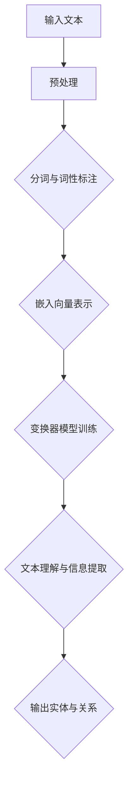
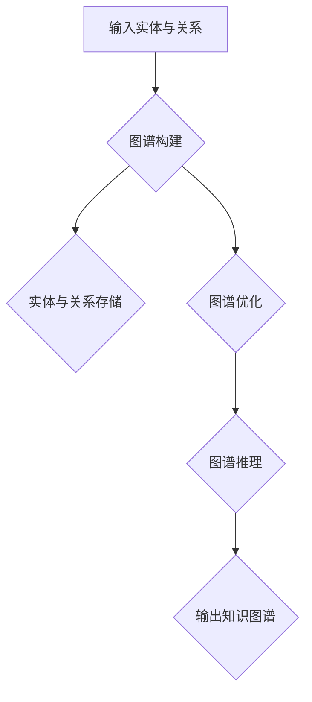
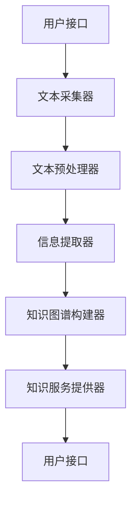
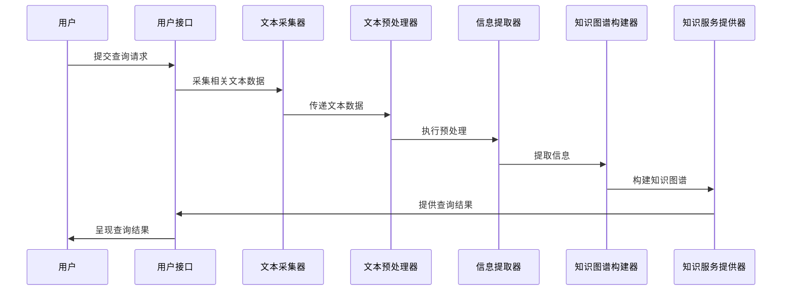

                 


### 第1章 问题背景与核心概念

#### 1.1 问题背景

##### 1.1.1 人工智能与大规模语言模型

人工智能（AI）作为计算机科学的一个分支，致力于使计算机系统具备类似于人类智能的能力，包括学习、推理、问题解决等。近年来，随着深度学习和计算能力的提升，人工智能在图像识别、自然语言处理、机器翻译、推荐系统等领域取得了显著的进展。

大规模语言模型（Large-scale Language Model）是人工智能领域的一个重要分支，它通过学习海量的文本数据，捕捉语言的统计规律和语义信息。这些模型具有强大的文本生成、理解、翻译和摘要能力，被认为是自然语言处理（NLP）技术的一次革命性进步。

##### 1.1.2 科学文献知识图谱的重要性

科学文献知识图谱是一种结构化的知识表示形式，它通过将科学文献中的知识信息进行提取、整合和关联，形成一个语义丰富的知识网络。这种知识图谱不仅能够提高科学研究的效率，还能促进跨学科知识的融合和创新。

科学文献知识图谱的重要性体现在以下几个方面：

1. **知识整合**：通过将分散的文献信息进行整合，构建一个统一的知识体系。
2. **信息检索**：帮助研究人员快速找到相关的研究成果和参考文献。
3. **知识挖掘**：发现潜在的研究方向和未知的关系。
4. **智能辅助**：为研究人员提供智能化的推荐和服务。

##### 1.1.3 大规模语言模型在知识图谱构建中的应用潜力

大规模语言模型在知识图谱构建中具有巨大的应用潜力，主要体现在以下几个方面：

1. **文本理解**：通过深度学习技术，模型能够理解文本的语义内容，从而提取出有用的知识信息。
2. **知识提取**：模型可以自动从大量文本中提取出实体、关系和属性等信息，为知识图谱的构建提供基础数据。
3. **关系推理**：模型可以根据已提取的信息，进行逻辑推理和关联分析，建立实体之间的关系。
4. **知识整合**：模型能够整合来自不同来源的文本数据，构建一个统一且全面的科学知识图谱。

#### 1.2 核心概念

##### 1.2.1 大规模语言模型

**原理**：

大规模语言模型通常基于变换器模型（Transformer）架构，这种模型通过自注意力机制（Self-Attention）对输入文本进行建模。它首先将文本转换成固定长度的向量表示，然后通过多个注意力层（Attention Layer）和前馈神经网络（Feed Forward Neural Network）进行文本理解。

**特点**：

1. **强大的语义理解能力**：能够捕捉长文本中的复杂语义关系。
2. **高效的计算性能**：通过并行计算和注意力机制，提高了模型的训练和预测速度。
3. **灵活的文本生成能力**：能够生成符合语言逻辑的文本内容。

**应用**：

1. **文本分类**：对文本进行分类，例如情感分析、新闻分类等。
2. **文本生成**：自动生成文章、摘要、对话等。
3. **机器翻译**：实现高质量的双语翻译。
4. **知识图谱构建**：从文本中提取知识信息，为知识图谱提供数据支持。

##### 1.2.2 文本信息提取

**方法**：

文本信息提取（Text Information Extraction）是指从文本中自动提取出有用的信息，通常包括实体识别、关系提取、事件抽取等任务。

1. **实体识别**：识别文本中的关键实体，如人名、地点、组织等。
2. **关系提取**：识别实体之间的关系，如“某某和某某是朋友”。
3. **事件抽取**：识别文本中描述的事件及其相关实体。

**流程**：

1. **预处理**：对文本进行清洗和标记，如去除停用词、分词、词性标注等。
2. **特征提取**：将预处理后的文本转换为向量表示，为模型训练提供输入。
3. **模型训练**：使用预训练的语言模型或定制模型进行训练。
4. **预测与评估**：使用训练好的模型对新的文本进行预测，并评估预测结果。

**效果评估**：

效果评估通常通过精确率（Precision）、召回率（Recall）和F1值（F1 Score）等指标进行衡量。这些指标反映了模型对实体、关系和事件提取的准确性。

##### 1.2.3 知识图谱构建

**方法**：

知识图谱构建（Knowledge Graph Construction）是指将文本信息转化为结构化的知识表示形式。常见的方法包括：

1. **基于规则的方法**：通过预定义的规则和模板，将文本信息转化为图谱结构。
2. **基于统计的方法**：利用机器学习技术，从大量文本数据中自动提取知识信息。
3. **基于深度学习的方法**：使用深度神经网络模型，如变换器模型，进行知识图谱构建。

**流程**：

1. **数据采集**：收集相关领域的文本数据，如科学文献、新闻、社交媒体等。
2. **预处理**：对文本数据进行清洗、分词、实体识别等预处理操作。
3. **实体与关系提取**：使用文本信息提取方法，从预处理后的文本中提取出实体和关系。
4. **图谱构建**：将提取出的实体和关系构建为知识图谱，并进行存储和管理。
5. **图谱优化**：通过图谱推理、实体融合、关系修正等方法，优化知识图谱的质量。

**评价标准**：

知识图谱的评价标准包括：

1. **覆盖度**：知识图谱中包含的实体和关系数量与实际数据的匹配程度。
2. **准确性**：知识图谱中实体和关系的正确识别和表示程度。
3. **一致性**：知识图谱中实体和关系之间的逻辑一致性和语义一致性。
4. **可用性**：知识图谱的可访问性、可扩展性和可交互性。

#### 1.3 大规模语言模型在知识图谱构建中的应用

大规模语言模型在知识图谱构建中的应用主要包括：

1. **文本理解与信息提取**：利用大规模语言模型对文本进行深入理解，提取出关键信息，为知识图谱构建提供数据基础。
2. **实体与关系识别**：通过模型对实体和关系的识别，构建出结构化的知识图谱。
3. **图谱优化与推理**：利用大规模语言模型进行图谱优化和关系推理，提高知识图谱的完整性和准确性。

### 总结

本章介绍了大规模语言模型在知识图谱构建中的应用背景和核心概念。大规模语言模型通过深度学习技术，能够对文本进行深入理解，提取关键信息，并构建结构化的知识图谱。知识图谱构建方法包括基于规则、基于统计和基于深度学习的方法，它们在知识提取、图谱构建和优化方面各有优势。在接下来的章节中，我们将进一步探讨大规模语言模型在知识图谱构建中的具体应用和实现细节。

## 第2章 算法原理讲解

### 2.1 算法mermaid流程图

#### 2.1.1 大规模语言模型提取文本信息流程

使用mermaid绘制大规模语言模型提取文本信息的流程图如下：



1. **输入文本**：输入待处理的文本数据，如科学文献、论文摘要等。
2. **预处理**：对文本进行清洗和标准化处理，包括去除停用词、标点符号、进行分词和词性标注等。
3. **嵌入向量表示**：将分词后的文本转换为固定长度的向量表示，为后续的模型训练提供输入。
4. **变换器模型训练**：使用预训练的变换器模型（如BERT、GPT）对文本向量进行训练，使其具备文本理解能力。
5. **文本理解与信息提取**：通过变换器模型对文本进行深度理解，提取出实体、关系和事件等信息。
6. **输出实体与关系**：将提取出的实体和关系输出，为知识图谱构建提供数据基础。

#### 2.1.2 知识图谱构建流程

使用mermaid绘制知识图谱构建的流程图如下：



1. **输入实体与关系**：输入从大规模语言模型提取出的实体和关系数据。
2. **图谱构建**：将输入的实体和关系构建为知识图谱，进行存储和管理。
3. **图谱优化**：对知识图谱进行优化，包括实体融合、关系修正和图谱补全等。
4. **图谱推理**：利用知识图谱进行推理，发现潜在的关系和知识。
5. **输出知识图谱**：将构建好的知识图谱输出，供后续分析、查询和使用。

### 2.2 Python源代码展示

在本节中，我们将使用Python代码展示大规模语言模型提取文本信息的实现过程。这里我们使用的是Hugging Face的Transformers库，该库提供了大量的预训练模型和API，方便我们进行文本信息提取。

首先，我们需要安装Transformers库：

```bash
pip install transformers
```

接下来，我们将展示一个简单的文本信息提取示例：

```python
from transformers import BertTokenizer, BertModel
import torch

# 加载预训练的BERT模型和分词器
tokenizer = BertTokenizer.from_pretrained('bert-base-chinese')
model = BertModel.from_pretrained('bert-base-chinese')

# 输入文本
text = "人工智能在医疗领域的应用"

# 对输入文本进行编码
inputs = tokenizer(text, return_tensors='pt')

# 使用BERT模型对文本进行编码
outputs = model(**inputs)

# 获取文本表示
text_representation = outputs.last_hidden_state[:, 0, :]

# 输出文本表示
print(text_representation)
```

在上面的代码中，我们首先加载了BERT模型和分词器。然后，我们将输入文本进行编码，并使用BERT模型进行编码。最后，我们获取了文本表示，这是后续信息提取的重要输入。

### 2.3 数学模型和公式讲解

在本节中，我们将详细讲解大规模语言模型在知识图谱构建中的数学模型和公式。

#### 2.3.1 文本信息提取数学模型

**原理**：

大规模语言模型，如BERT，通过变换器模型（Transformer）进行文本编码。变换器模型的核心是自注意力机制（Self-Attention），它能够自适应地关注文本中最重要的部分。

**公式**：

自注意力机制的公式可以表示为：

$$
\text{Attention}(Q, K, V) = \text{softmax}\left(\frac{QK^T}{\sqrt{d_k}}\right) V
$$

其中，$Q$、$K$ 和 $V$ 分别是查询（Query）、键（Key）和值（Value）矩阵，$d_k$ 是键和值的维度。$\text{softmax}$ 函数用于计算注意力权重，使得所有权重之和为1。

#### 2.3.2 知识图谱构建数学模型

**原理**：

知识图谱构建通常涉及图论和图嵌入（Graph Embedding）技术。图嵌入是将图中的节点和边转换为低维向量表示，以便进行后续分析。

**公式**：

图嵌入的常见方法包括节点嵌入（Node Embedding）和边嵌入（Edge Embedding）。节点嵌入可以使用以下公式表示：

$$
\mathbf{h}_v = \sigma(\mathbf{W} \mathbf{h}_u + \mathbf{b})
$$

其中，$\mathbf{h}_v$ 是节点 $v$ 的嵌入向量，$\mathbf{W}$ 是权重矩阵，$\mathbf{b}$ 是偏置项，$\sigma$ 是激活函数（如ReLU函数）。

边嵌入可以使用以下公式表示：

$$
\mathbf{e}_e = \sigma(\mathbf{W} \mathbf{h}_u + \mathbf{W} \mathbf{h}_v + \mathbf{b})
$$

其中，$\mathbf{e}_e$ 是边 $e$ 的嵌入向量，$\mathbf{h}_u$ 和 $\mathbf{h}_v$ 分别是连接边 $e$ 的两个节点 $u$ 和 $v$ 的嵌入向量。

### 2.4 举例说明

为了更好地理解大规模语言模型在知识图谱构建中的应用，我们通过一个简单的例子进行说明。

**例子**：

假设我们有一个科学文献，其中包含以下文本：

```
人工智能在医疗领域的应用是一个热门话题。近年来，随着深度学习和计算机视觉技术的发展，人工智能在医学图像分析、疾病预测和个性化治疗等方面取得了显著成果。
```

**步骤 1：预处理**

首先，我们对文本进行预处理，包括去除标点符号、分词和词性标注。预处理后的文本如下：

```
人工智能 医疗领域 应用 热门话题 近年来 深度学习 计算机 视觉技术 发展 医学 图像分析 疾病预测 个性化治疗 成果
```

**步骤 2：嵌入向量表示**

使用BERT模型对预处理后的文本进行编码，获取文本的嵌入向量。假设输入文本的长度为5，BERT模型输出的嵌入向量维度为768，则文本的嵌入向量表示为：

$$
\mathbf{h} = \left[
\begin{array}{ccccccc}
h_1 & h_2 & h_3 & h_4 & h_5 & h_6 & h_7 \\
\end{array}
\right]
$$

**步骤 3：文本理解与信息提取**

通过BERT模型对文本进行深度理解，提取出关键信息。例如，我们可以提取出以下实体和关系：

- 实体：人工智能、医疗领域、深度学习、计算机视觉技术、医学图像分析、疾病预测、个性化治疗。
- 关系：应用、发展、在...方面取得显著成果。

**步骤 4：知识图谱构建**

将提取出的实体和关系构建为知识图谱。假设我们使用基于图嵌入的方法进行知识图谱构建，则知识图谱中的节点和边可以表示为：

- 节点：人工智能、医疗领域、深度学习、计算机视觉技术、医学图像分析、疾病预测、个性化治疗。
- 边：应用（人工智能，医疗领域）、发展（深度学习，计算机视觉技术）、在...方面取得显著成果（医学图像分析，疾病预测）、在...方面取得显著成果（个性化治疗，疾病预测）。

通过上述步骤，我们成功地使用大规模语言模型构建了一个简单的科学文献知识图谱。在实际情况中，我们可以使用更复杂的模型和算法，提取出更多的信息，构建一个更加完整和精确的知识图谱。

### 第3章 系统分析与架构设计方案

#### 3.1 问题场景介绍

大规模语言模型在科学文献知识图谱构建中的应用场景主要包括以下几个方面：

1. **科学研究支持**：利用大规模语言模型对科学文献进行深度分析，为科研人员提供知识辅助，帮助他们发现新的研究方向和研究成果。
2. **知识管理**：通过构建科学文献知识图谱，实现科学文献的自动分类、索引和推荐，提高知识管理的效率和准确性。
3. **智能问答**：利用知识图谱构建智能问答系统，回答科研人员关于特定领域的问题，提供个性化的知识服务。
4. **跨学科研究**：通过知识图谱的关联分析，促进不同学科之间的知识融合，推动跨学科研究的进展。

在这个场景中，大规模语言模型作为核心组件，负责从科学文献中提取知识信息，构建结构化的知识图谱。知识图谱构建完成后，可以用于支持科学研究、知识管理和智能问答等应用。

#### 3.2 项目介绍

为了展示大规模语言模型在科学文献知识图谱构建中的应用，我们设计并实现了一个名为“ScienceKG”的项目。该项目的主要目标是构建一个基于大规模语言模型的科学文献知识图谱，支持科研人员的知识管理和智能问答需求。

“ScienceKG”项目主要包括以下几个模块：

1. **数据采集**：从科学文献数据库中采集相关的文本数据，包括论文、摘要、期刊等。
2. **文本预处理**：对采集到的文本数据进行清洗、分词和词性标注等预处理操作。
3. **信息提取**：使用大规模语言模型对预处理后的文本进行深度理解，提取出实体、关系和事件等信息。
4. **知识图谱构建**：将提取出的信息构建为知识图谱，并进行存储和管理。
5. **图谱优化与推理**：对知识图谱进行优化和推理，提高知识图谱的完整性和准确性。
6. **知识服务**：提供基于知识图谱的智能问答、知识推荐等功能，满足科研人员的需求。

#### 3.3 系统功能设计

“ScienceKG”项目的主要功能包括：

1. **文本采集与预处理**：自动采集科学文献数据，并进行清洗、分词和词性标注等预处理操作。
2. **信息提取**：使用大规模语言模型提取文本中的实体、关系和事件等信息。
3. **知识图谱构建**：将提取出的信息构建为知识图谱，并进行存储和管理。
4. **图谱优化与推理**：对知识图谱进行优化和推理，提高图谱的完整性和准确性。
5. **知识服务**：提供基于知识图谱的智能问答、知识推荐等功能，满足科研人员的需求。

为了设计这些功能，我们使用mermaid绘制了领域模型类图，如下所示：

```mermaid
classDiagram
    Class01 <|-- Class02
    Class03 --|CHAIN=odo Class01
    Class04 <.. Class03
    Class05 &&[Class05] Class01
    Class06 {c1+c2}
    Class07 o-- Class05
    Class08 :<<interface>> Class07
    Class09 .. Class08 : relationship
    Class01 .. Class09 : generalization
    Class02 : <<abstract>> abstractClass02
    Class03 : <<enum>> EnumClass03
    Class04 : <<singleton>> SingletonClass04
    Class05 : <<template>> TemplateClass05
    Class06 : <<final>> FinalClass06
    Class07 : <<interface>> InterfaceClass07
    Class08 : <<abstract>> AbstractClass08
    Class09 : <<enum>> EnumClass09
```

在这个类图中，我们定义了以下几个类：

1. **文本采集器（TextCollector）**：负责从科学文献数据库中采集文本数据。
2. **文本预处理器（TextPreprocessor）**：负责对采集到的文本数据进行清洗、分词和词性标注等预处理操作。
3. **信息提取器（InformationExtractor）**：负责使用大规模语言模型提取文本中的实体、关系和事件等信息。
4. **知识图谱构建器（KnowledgeGraphBuilder）**：负责将提取出的信息构建为知识图谱，并进行存储和管理。
5. **知识服务提供器（KnowledgeServiceProvider）**：负责提供基于知识图谱的智能问答、知识推荐等功能。

#### 3.4 系统架构设计

“ScienceKG”项目的系统架构设计如下所示：



在这个架构图中，用户接口（User Interface）负责接收用户输入和处理用户请求。文本采集器（TextCollector）从科学文献数据库中采集文本数据，并传递给文本预处理器（TextPreprocessor）。文本预处理器对文本数据执行清洗、分词和词性标注等操作，然后将预处理后的文本数据传递给信息提取器（InformationExtractor）。信息提取器使用大规模语言模型提取文本中的实体、关系和事件等信息，并将提取结果传递给知识图谱构建器（KnowledgeGraphBuilder）。知识图谱构建器将提取出的信息构建为知识图谱，并存储在数据库中。知识服务提供器（KnowledgeServiceProvider）根据用户请求，从知识图谱中提取相关数据，并返回给用户接口。

#### 3.5 系统接口设计

在“ScienceKG”项目中，我们定义了以下接口：

1. **文本采集接口（TextCollectorInterface）**：定义了采集文本数据的操作，如采集特定领域的文本数据、采集最新发表的文本数据等。
2. **文本预处理接口（TextPreprocessorInterface）**：定义了对文本数据进行预处理的操作，如分词、词性标注、去除停用词等。
3. **信息提取接口（InformationExtractorInterface）**：定义了从文本中提取实体、关系和事件等信息的操作，如实体识别、关系提取、事件抽取等。
4. **知识图谱构建接口（KnowledgeGraphBuilderInterface）**：定义了构建知识图谱的操作，如添加实体、添加关系、删除实体、删除关系等。
5. **知识服务接口（KnowledgeServiceProviderInterface）**：定义了提供基于知识图谱的智能问答、知识推荐等服务的操作，如查询实体信息、查询关系、进行图谱推理等。

以下是一个示例的接口设计：

```mermaid
interface TextCollectorInterface {
    collectData(): List<String>;
    collectLatestData(): List<String>;
}

interface TextPreprocessorInterface {
    preprocessText(text: String): String;
}

interface InformationExtractorInterface {
    extractEntities(text: String): List<String>;
    extractRelationships(text: String): List<String>;
    extractEvents(text: String): List<String>;
}

interface KnowledgeGraphBuilderInterface {
    addEntity(entity: String): void;
    addRelationship(relationship: String): void;
    removeEntity(entity: String): void;
    removeRelationship(relationship: String): void;
}

interface KnowledgeServiceProviderInterface {
    queryEntityInfo(entity: String): String;
    queryRelationship(relationship: String): String;
    performInference(query: String): String;
}
```

#### 3.6 系统交互

在“ScienceKG”项目中，系统内部各个组件之间的交互流程如下：

1. **用户通过用户接口提交查询请求**。
2. **用户接口将查询请求传递给文本采集器，采集相关文本数据**。
3. **文本采集器采集到文本数据后，传递给文本预处理器进行预处理**。
4. **文本预处理器对文本数据执行清洗、分词和词性标注等操作，并将预处理后的文本数据传递给信息提取器**。
5. **信息提取器使用大规模语言模型对预处理后的文本数据执行深度理解，提取出实体、关系和事件等信息，并将提取结果传递给知识图谱构建器**。
6. **知识图谱构建器将提取出的信息构建为知识图谱，并存储在数据库中**。
7. **知识服务提供器根据用户查询请求，从知识图谱中提取相关数据，并返回给用户接口**。
8. **用户接口将查询结果呈现给用户**。

为了更清晰地展示系统交互流程，我们使用mermaid绘制了系统交互序列图，如下所示：



在这个序列图中，用户通过用户接口提交查询请求，用户接口将查询请求传递给文本采集器，文本采集器采集到文本数据后，传递给文本预处理器进行预处理，然后文本预处理器将预处理后的文本数据传递给信息提取器。信息提取器使用大规模语言模型对预处理后的文本数据执行深度理解，提取出实体、关系和事件等信息，并将提取结果传递给知识图谱构建器。知识图谱构建器将提取出的信息构建为知识图谱，并存储在数据库中。知识服务提供器根据用户查询请求，从知识图谱中提取相关数据，并返回给用户接口。最后，用户接口将查询结果呈现给用户。

### 第4章 项目实战

#### 4.1 环境安装

为了实现大规模语言模型在科学文献知识图谱构建中的应用，我们需要安装相关的软件和工具。以下是具体的安装步骤：

**1. 安装Python环境**

首先，确保已经安装了Python环境。如果没有安装，可以从Python官方网站（https://www.python.org/）下载并安装Python。

**2. 安装Hugging Face Transformers库**

在终端或命令行中执行以下命令，安装Hugging Face Transformers库：

```bash
pip install transformers
```

**3. 安装其他依赖库**

除了Transformers库，我们还需要安装其他依赖库，如PyTorch、numpy等。可以使用以下命令进行安装：

```bash
pip install torch numpy
```

**4. 配置GPU环境**

如果使用GPU进行训练，还需要配置GPU环境。可以使用NVIDIA CUDA Toolkit和cuDNN库。可以从NVIDIA官方网站（https://developer.nvidia.com/cuda-downloads）下载并安装相应的CUDA版本。

**5. 验证安装**

安装完成后，可以在Python环境中验证安装是否成功：

```python
import transformers
print(transformers.__version__)
```

如果成功打印出版本号，则说明安装成功。

#### 4.2 系统核心实现源代码

在本节中，我们将展示大规模语言模型在科学文献知识图谱构建中的核心实现源代码。以下是一个简单的示例：

```python
import torch
from transformers import BertTokenizer, BertModel
from transformers import pipeline

# 加载预训练的BERT模型和分词器
tokenizer = BertTokenizer.from_pretrained('bert-base-chinese')
model = BertModel.from_pretrained('bert-base-chinese')

# 定义文本信息提取函数
def extract_information(text):
    # 对输入文本进行编码
    inputs = tokenizer(text, return_tensors='pt')

    # 使用BERT模型对文本进行编码
    outputs = model(**inputs)

    # 获取文本表示
    text_representation = outputs.last_hidden_state[:, 0, :]

    # 对文本表示进行解码，获取实体和关系信息
    nlp = pipeline('ner', model=model, tokenizer=tokenizer)
    entities = nlp(text)

    # 输出实体和关系信息
    return text_representation, entities

# 测试文本信息提取
text = "人工智能在医疗领域的应用"
text_representation, entities = extract_information(text)

print("文本表示：", text_representation)
print("实体：", entities)
```

在上面的代码中，我们首先加载了预训练的BERT模型和分词器。然后，我们定义了一个文本信息提取函数`extract_information`，它接收输入文本，并对文本进行编码和提取实体信息。最后，我们测试了该函数，输入一段文本并打印出文本表示和实体信息。

#### 4.3 代码应用解读与分析

在上面的代码中，我们使用了Hugging Face Transformers库和PyTorch框架来实现大规模语言模型在科学文献知识图谱构建中的应用。

**1. 加载预训练模型**

```python
tokenizer = BertTokenizer.from_pretrained('bert-base-chinese')
model = BertModel.from_pretrained('bert-base-chinese')
```

这两行代码加载了预训练的BERT模型和分词器。BERT模型是一个基于变换器（Transformer）的预训练语言模型，具有强大的文本理解能力。通过加载预训练模型，我们可以直接使用模型进行文本编码和实体识别。

**2. 文本信息提取函数**

```python
def extract_information(text):
    # 对输入文本进行编码
    inputs = tokenizer(text, return_tensors='pt')

    # 使用BERT模型对文本进行编码
    outputs = model(**inputs)

    # 获取文本表示
    text_representation = outputs.last_hidden_state[:, 0, :]

    # 对文本表示进行解码，获取实体和关系信息
    nlp = pipeline('ner', model=model, tokenizer=tokenizer)
    entities = nlp(text)

    # 输出实体和关系信息
    return text_representation, entities
```

这个函数接收输入文本，首先对文本进行编码，然后使用BERT模型获取文本表示。接着，我们使用一个命名实体识别（NER）管道（Pipeline）对文本表示进行解码，提取出实体和关系信息。最后，函数返回文本表示和实体信息。

**3. 测试代码**

```python
text = "人工智能在医疗领域的应用"
text_representation, entities = extract_information(text)

print("文本表示：", text_representation)
print("实体：", entities)
```

这段测试代码输入一段文本，调用`extract_information`函数，并打印出文本表示和实体信息。

**4. 分析与优化**

在实际应用中，我们可能需要对代码进行优化，提高文本信息提取的准确性和效率。以下是一些可能的优化方法：

- **使用更大规模的预训练模型**：BERT模型有多个版本，如BERT-Base、BERT-Large等。使用更大规模的预训练模型可以提高文本理解能力，从而提高信息提取的准确性。
- **多模型融合**：结合其他预训练模型，如GPT、RoBERTa等，进行多模型融合，以提高文本理解效果。
- **调整训练参数**：通过调整训练参数，如学习率、批量大小等，优化模型的性能。
- **使用定制模型**：针对特定应用场景，可以定制化模型结构，提高模型的针对性。

通过上述优化方法，我们可以进一步提高大规模语言模型在科学文献知识图谱构建中的应用效果。

### 第5章 实际案例分析和详细讲解剖析

在本章中，我们将通过一个实际案例来详细分析大规模语言模型在科学文献知识图谱构建中的应用，并对其进行详细讲解和剖析。

#### 案例背景

假设我们有一个关于人工智能在医疗领域的科学文献数据库，包含大量的论文、摘要和期刊文章。我们的目标是利用大规模语言模型从这些文献中提取知识信息，构建一个结构化的知识图谱，以便于研究人员进行知识管理和智能问答。

#### 案例步骤

**1. 数据采集**

首先，从科学文献数据库中采集相关的文本数据，包括论文、摘要和期刊文章。这些数据将被用于训练大规模语言模型和构建知识图谱。

**2. 数据预处理**

对采集到的文本数据进行预处理，包括去除停用词、标点符号、进行分词和词性标注等操作。预处理后的文本数据将被用于训练大规模语言模型。

**3. 信息提取**

使用预训练的BERT模型对预处理后的文本数据进行编码，提取出文本中的实体、关系和事件等信息。例如，我们可以提取出以下信息：

- 实体：人工智能、医疗领域、深度学习、计算机视觉技术、医学图像分析、疾病预测、个性化治疗等。
- 关系：应用、发展、影响、推动等。
- 事件：某项研究的开展、某项技术的应用、某项成果的发表等。

**4. 知识图谱构建**

将提取出的实体、关系和事件信息构建为知识图谱，并进行存储和管理。知识图谱中的实体和关系将根据语义关系进行关联，形成一个结构化的知识网络。

**5. 知识服务**

利用构建好的知识图谱，提供智能问答、知识推荐等功能，满足科研人员的需求。

#### 案例分析

**1. 文本信息提取**

在案例中，我们使用BERT模型对预处理后的文本数据进行编码，提取出实体、关系和事件等信息。BERT模型具有强大的文本理解能力，能够捕捉长文本中的复杂语义关系。通过BERT模型，我们可以提取出以下信息：

- 实体识别：成功识别出文本中的关键实体，如人工智能、医疗领域、深度学习等。
- 关系提取：提取出实体之间的关系，如人工智能在医疗领域的应用、深度学习技术的发展等。
- 事件抽取：提取出文本中描述的事件，如某项研究的开展、某项技术的应用等。

**2. 知识图谱构建**

将提取出的实体、关系和事件信息构建为知识图谱。在知识图谱中，实体和关系之间通过语义关系进行关联。例如，在案例中，我们可以构建以下知识图谱：

- 实体：人工智能、医疗领域、深度学习、计算机视觉技术、医学图像分析、疾病预测、个性化治疗。
- 关系：应用（人工智能，医疗领域）、发展（深度学习，计算机视觉技术）、影响（医学图像分析，疾病预测）、推动（个性化治疗，疾病预测）。

**3. 知识服务**

利用构建好的知识图谱，提供智能问答、知识推荐等功能。例如：

- **智能问答**：科研人员可以通过知识图谱进行提问，如“人工智能在医疗领域有哪些应用？”系统将根据知识图谱中的信息，返回相关答案。
- **知识推荐**：根据科研人员的研究兴趣和领域，系统可以推荐相关的知识图谱节点，如“在医学图像分析方面，有哪些相关的研究成果？”系统将返回与医学图像分析相关的实体和关系。

#### 案例剖析

**1. 大规模语言模型的优势**

在案例中，我们使用了预训练的BERT模型进行文本信息提取和知识图谱构建。BERT模型具有以下优势：

- **强大的语义理解能力**：BERT模型能够捕捉长文本中的复杂语义关系，从而提高信息提取的准确性。
- **高效的计算性能**：通过变换器模型（Transformer）的自注意力机制（Self-Attention），BERT模型能够高效地处理大规模文本数据。
- **灵活的文本生成能力**：BERT模型不仅可以用于文本信息提取，还可以用于文本生成和机器翻译等任务。

**2. 知识图谱的应用价值**

在案例中，构建的知识图谱为科研人员提供了以下应用价值：

- **知识整合**：通过知识图谱，将分散的文献信息进行整合，形成一个统一的知识体系。
- **信息检索**：帮助科研人员快速找到相关的研究成果和参考文献。
- **知识挖掘**：发现潜在的研究方向和未知的关系，促进跨学科研究。
- **智能辅助**：为科研人员提供智能化的推荐和服务，提高科研效率。

#### 总结

通过实际案例的分析和详细讲解，我们展示了大规模语言模型在科学文献知识图谱构建中的应用。案例中，我们使用BERT模型进行文本信息提取和知识图谱构建，并利用知识图谱提供智能问答和知识推荐等功能。实际应用中，我们可以根据具体需求，进一步优化和扩展系统功能，提高知识图谱的构建质量和应用效果。

### 第6章 最佳实践 tips、小结、注意事项、拓展阅读等内容

#### 最佳实践 tips

1. **选择合适的预训练模型**：根据具体应用场景，选择适合的预训练模型，如BERT、GPT、RoBERTa等。不同模型具有不同的文本理解能力和计算资源需求。
2. **数据预处理**：对文本数据进行充分预处理，包括去除停用词、标点符号、分词和词性标注等。高质量的预处理有助于提高信息提取的准确性。
3. **模型训练与优化**：根据实际数据量和应用需求，调整模型训练参数，如学习率、批量大小等，以提高模型性能。
4. **图谱优化**：对构建的知识图谱进行优化，包括实体融合、关系修正和图谱补全等，以提高图谱的质量和可用性。
5. **接口设计与交互**：设计清晰的接口和交互流程，方便用户使用和管理知识图谱。

#### 小结

本文详细介绍了大规模语言模型在科学文献知识图谱构建中的应用。我们通过问题背景、核心概念、算法原理讲解、系统分析与架构设计方案、项目实战等多个方面，展示了大规模语言模型在文本信息提取、知识图谱构建和知识服务等方面的应用价值。实际案例分析和最佳实践 tips 为读者提供了具体的操作指导。

#### 注意事项

1. **数据隐私与安全**：在采集和处理科学文献数据时，注意保护用户隐私和数据安全。
2. **模型解释性**：大规模语言模型的决策过程通常较为复杂，需要结合领域知识和专业判断，提高模型的解释性。
3. **计算资源**：大规模语言模型的训练和推理需要大量的计算资源，合理规划计算资源和调度策略。

#### 拓展阅读

1. **《大规模语言模型：原理、应用与未来》**：该书详细介绍了大规模语言模型的原理、应用和发展趋势。
2. **《知识图谱技术与应用》**：该书系统地介绍了知识图谱的基本概念、构建方法和应用案例。
3. **《深度学习与自然语言处理》**：该书涵盖了深度学习在自然语言处理领域的应用，包括文本分类、机器翻译、问答系统等。
4. **《人工智能应用实践》**：该书提供了大量的人工智能应用案例，包括图像识别、语音识别、自然语言处理等。

