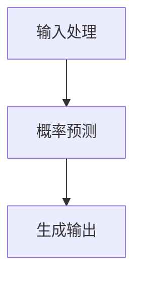
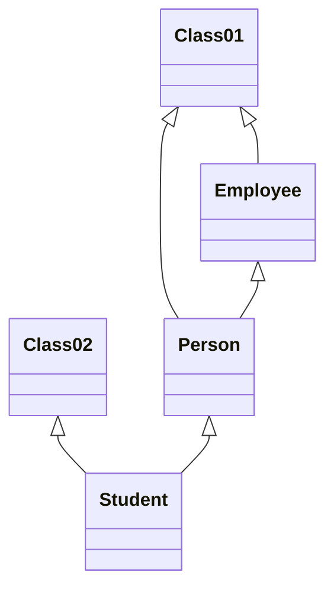
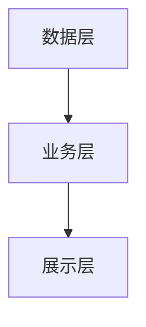

                 


### 大规模语言模型在科学文献综述生成中的应用

#### 关键词：大规模语言模型，科学文献综述，生成模型，算法原理，系统设计，项目实战

#### 摘要：
本文深入探讨大规模语言模型在科学文献综述生成中的应用，旨在解释其核心原理、系统设计、实现流程以及实战效果。通过详细分析，本文揭示了大规模语言模型如何突破传统综述生成的局限，为科研工作者提供高效、准确的文献综述工具。

---

**引言**

科学文献综述作为科研工作的重要组成部分，对学科发展和知识整合起着至关重要的作用。然而，撰写科学文献综述是一项耗时且复杂的任务，通常需要科研人员对大量文献进行筛选、阅读和理解，进而整理出核心观点和进展。随着科学领域的迅速扩展，文献量的激增使得这一任务变得更加困难。

在此背景下，大规模语言模型（Large-scale Language Models，简称LLM）的出现为科学文献综述的自动化生成带来了新的可能性。LLM是一种能够理解和生成自然语言的深度学习模型，其能力已达到甚至超越了人类在理解和生成文本方面的表现。本文将探讨大规模语言模型在科学文献综述生成中的应用，分析其技术原理、系统设计、实现流程，并分享实际应用案例，以期为科研工作者提供新的研究思路和工具。

---

**一、背景介绍**

#### 1.1 科学文献综述的重要性

科学文献综述是对某一研究领域或主题的现有研究文献进行系统整理和综合评价的文章。它不仅能为读者提供全面的研究背景和现状，还能指出未来的研究方向和挑战。科学文献综述在科学研究中的重要性体现在以下几个方面：

1. **知识整合**：综述能够将散落在各处的研究成果进行整合，形成对某一领域的全面认识，帮助科研人员快速了解研究前沿。
2. **指导研究**：综述能够指出当前研究的不足和未来可能的研究方向，为科研人员提供指导，避免重复劳动，提高研究效率。
3. **评估研究**：综述对现有研究进行评价，有助于学术机构、评审人员等对研究成果的评估和筛选。

#### 1.2 语言模型的发展

语言模型（Language Model，简称LM）是一种用于预测自然语言序列的概率分布的数学模型。它的发展经历了从传统的统计模型到现代的深度学习模型的转变。以下是一些关键的发展阶段：

1. **统计语言模型**：基于概率论的统计方法，如N元语法（N-gram），通过统计文本中的词频来预测下一个词。
2. **神经网络语言模型**：引入了神经网络，尤其是循环神经网络（RNN）和其变种长短期记忆网络（LSTM），能够更好地捕捉文本中的长距离依赖关系。
3. **深度学习语言模型**：随着计算能力的提升和大数据的普及，深度学习语言模型如Transformer、BERT等被提出，并取得了显著的性能提升。

#### 1.3 大规模语言模型在综述生成中的应用潜力

大规模语言模型在文本理解和生成方面具有强大的能力，为科学文献综述的自动化生成提供了可能性。以下是其在综述生成中的应用潜力：

1. **自动提取关键信息**：通过预训练的大规模语言模型，可以自动提取文献中的关键信息，如标题、摘要、方法、结果和讨论等。
2. **生成结构化文本**：大规模语言模型能够根据给定的大纲或主题生成结构化的文本，实现文献综述的自动化撰写。
3. **跨领域知识整合**：通过多领域预训练，大规模语言模型能够整合不同领域的研究成果，撰写跨领域的综述文章。
4. **提高效率和质量**：自动化生成能够显著提高综述撰写的效率，同时通过模型训练和优化，保证综述的质量。

#### 1.4 边界与外延

1. **应用范围**：大规模语言模型在综述生成中的应用主要针对具有大量文本数据的科学领域，如医学、生物学、物理学等。
2. **技术挑战**：大规模语言模型在综述生成中面临的主要挑战包括数据处理、模型训练成本高、模型解释性不足等。

#### 1.5 概念结构与核心要素组成

1. **相关术语**：大规模语言模型（LLM）、语言模型（LM）、文本生成（Text Generation）、文本理解（Text Understanding）、科学文献综述（Literature Review）等。
2. **核心要素**：文本数据集、预训练模型、生成算法、评估指标、综述框架等。

---

**二、核心概念与原理**

#### 2.1 语言模型原理

语言模型（Language Model，简称LM）是一种用于预测自然语言序列的概率分布的数学模型。它是自然语言处理（Natural Language Processing，简称NLP）领域的基础工具，广泛应用于文本分类、机器翻译、语音识别等任务。

##### 2.1.1 语言模型的基本概念

语言模型通过学习大量的文本数据，建立一个概率模型，用于预测下一个词或字符的概率。语言模型的核心概念包括：

1. **词序列**：语言模型处理的是词序列，即一个一个的词按照特定的顺序排列。
2. **概率分布**：语言模型的目标是学习出一个概率分布，用于预测给定前文条件下下一个词的概率。

##### 2.1.2 语言模型的工作机制

语言模型的工作机制可以分为以下几个步骤：

1. **输入处理**：将输入的文本序列转换为模型可以处理的格式，通常是将每个词映射到一个向量表示。
2. **概率预测**：模型根据输入的词向量，预测下一个词的概率分布。
3. **生成输出**：根据预测的概率分布，选择下一个词，并将其添加到输出序列中，继续进行下一个词的预测。

##### 2.1.3 语言模型的评价标准

语言模型的评价标准主要包括：

1. ** perplexity（困惑度）**：困惑度是衡量语言模型预测准确性的指标，其值越小，表示模型对文本的预测越准确。
2. **BLEU分数**：BLEU（Bilingual Evaluation Understudy）分数是用于评估机器翻译质量的指标，其值越高，表示机器翻译的质量越好。

#### 2.2 大规模语言模型

大规模语言模型（Large-scale Language Model，简称LLM）是在传统语言模型的基础上，通过使用更大规模的数据集和更深的神经网络结构进行训练得到的。以下是其特点和应用：

##### 2.2.1 大规模语言模型的定义

大规模语言模型是指使用超过数十亿甚至千亿级别参数的神经网络模型，能够处理和理解非常复杂的自然语言。

##### 2.2.2 大规模语言模型的特点

1. **强大的文本理解能力**：由于使用了大规模的数据集进行训练，大规模语言模型能够更好地捕捉文本中的长距离依赖关系，具有强大的文本理解能力。
2. **高效的文本生成**：大规模语言模型能够高效地生成高质量的文本，适用于文本生成任务，如自动写作、机器翻译等。
3. **多语言支持**：大规模语言模型通常支持多种语言的预训练，能够跨语言进行文本理解和生成。

##### 2.2.3 大规模语言模型的优缺点对比

1. **优点**
   - **高效性**：大规模语言模型能够快速处理和理解复杂的自然语言。
   - **泛化能力**：通过大规模数据训练，大规模语言模型具有较好的泛化能力。
   - **多语言支持**：大规模语言模型通常支持多种语言的预训练，适用于跨语言任务。

2. **缺点**
   - **计算资源需求高**：大规模语言模型需要大量的计算资源和存储空间。
   - **解释性不足**：大规模语言模型的内部机制复杂，难以解释和理解。
   - **数据依赖性**：大规模语言模型对训练数据的依赖性较大，数据质量直接影响到模型的性能。

---

**三、算法原理讲解**

#### 3.1 语言模型算法原理

语言模型的核心目标是学习出一个概率模型，用于预测给定前文条件下下一个词或字符的概率。以下将详细讲解语言模型的算法原理，包括概率模型和生成模型。

##### 3.1.1 语言模型的数学模型

语言模型通常采用概率模型，其目标是学习一个概率分布函数P(w|w')，用于预测给定前文w'下下一个词w的概率。

1. **概率模型**：概率模型直接预测下一个词的概率分布。最常见的是N元语法（N-gram），它基于前N个词的统计信息来预测下一个词。其数学模型可以表示为：

   P(w|w') = P(w1w2...wN-1wN | w1w2...wN-1)

   其中，w1w2...wN-1wN表示前N个词，w1w2...wN-1表示前文。

2. **生成模型**：生成模型则通过学习一个生成过程，生成文本序列。其中，最著名的是基于RNN的生成模型，如LSTM（Long Short-Term Memory）。生成模型的目标是学习一个概率分布P(w1w2...wN)，并利用这个分布生成文本序列。

   生成模型的数学模型可以表示为：

   P(w1w2...wN) = P(w1) * P(w2|w1) * P(w3|w1w2) * ... * P(wN|w1w2...wN-1)

   其中，P(wi|w1w2...wN-i)表示在给定前文条件下生成词wi的概率。

##### 3.1.2 语言模型的mermaid流程图

以下是一个简单的mermaid流程图，展示了语言模型的输入处理、概率预测和生成输出的过程：



##### 3.1.3 通俗易懂的举例说明

假设我们有一个简单的语言模型，它是基于二元语法（Bigram）的，即只考虑前一个词对当前词的预测。给定前文“我是一个”，我们的语言模型需要预测下一个词。

1. **概率预测**：

   首先，我们统计前文“我是一个”后面出现词的概率。假设统计结果如下：

   | 下一个词 | 概率 |
   | -------- | ---- |
   | 朋友     | 0.5  |
   | 科学家   | 0.3  |
   | 程序员   | 0.2  |

   根据这些概率，我们的语言模型将预测下一个词为“朋友”（概率最大）。

2. **生成输出**：

   接下来，我们的语言模型将“朋友”添加到输出序列中，继续预测下一个词。

   前文变为“我是一个朋友”，我们再次计算下一个词的概率。假设统计结果如下：

   | 下一个词 | 概率 |
   | -------- | ---- |
   | 学者     | 0.4  |
   | 专家     | 0.3  |
   | 工程师   | 0.3  |

   根据这些概率，我们的语言模型将预测下一个词为“学者”（概率最大）。

通过这个过程，我们可以看到语言模型是如何通过概率预测和生成输出，生成连续的文本序列。

---

**四、系统设计与架构**

#### 4.1 问题场景介绍

科学文献综述的生成需要处理大量的文本数据，包括文献的标题、摘要、正文等。系统需要能够自动提取关键信息，生成结构化的文本，同时保证生成文本的质量和准确性。

##### 4.1.1 综述生成的应用场景

- **学术研究**：科研人员需要对某一研究领域的文献进行综述，以了解研究现状和未来方向。
- **学术评审**：学术期刊和会议需要对提交的论文进行综述，以评估论文的质量和贡献。
- **教育领域**：教育机构可以自动生成课程大纲和教学资料，提高教学效率。

##### 4.1.2 系统需求分析

- **文本处理能力**：系统能够高效地处理和提取大量文本数据。
- **知识整合能力**：系统能够整合不同领域的研究成果，生成跨领域的综述。
- **生成文本质量**：生成的文本需要准确、通顺、具有可读性。

#### 4.2 系统功能设计

系统功能设计主要包括文本提取、文本生成和文本评估三个模块。

##### 4.2.1 领域模型mermaid类图

以下是一个简单的mermaid类图，展示了系统的主要类和它们之间的关系：



在这个类图中，Person类是基础类，Student和Employee类是Person类的子类，它们继承Person类的属性和方法。

##### 4.2.2 功能模块设计

1. **文本提取模块**：负责从文本数据中提取关键信息，如标题、摘要、方法、结果和讨论等。这个模块可以使用NLP技术，如分词、词性标注、实体识别等。
2. **文本生成模块**：负责根据提取的关键信息生成结构化的文本。这个模块可以使用大规模语言模型，如GPT-3、BERT等，通过预训练模型和微调模型实现。
3. **文本评估模块**：负责评估生成的文本质量，如准确性、可读性、连贯性等。这个模块可以使用自动化评估方法，如BLEU分数、ROUGE分数等。

---

#### 4.3 系统架构设计

系统架构设计主要包括数据层、业务层和展示层三个部分。

##### 4.3.1 系统架构mermaid架构图

以下是一个简单的mermaid架构图，展示了系统的整体架构：



在这个架构图中，数据层负责存储和管理文本数据，业务层负责实现文本提取、文本生成和文本评估等功能，展示层负责将生成的文本展示给用户。

##### 4.3.2 架构设计原则

1. **模块化**：系统设计应遵循模块化原则，将不同功能模块分离，提高系统的可维护性和可扩展性。
2. **分布式**：系统应支持分布式部署，以提高系统的处理能力和可扩展性。
3. **高可用性**：系统设计应考虑高可用性，确保在系统故障时能够快速恢复。

---

**五、项目实施与案例分析**

#### 5.1 环境安装与配置

在实施大规模语言模型在科学文献综述生成中的应用项目之前，需要准备好以下环境和工具：

1. **Python环境**：安装Python 3.7及以上版本，并配置好pip和conda等包管理工具。
2. **GPU环境**：安装NVIDIA GPU驱动，并配置CUDA和cuDNN库，确保能够支持深度学习模型的训练。
3. **深度学习框架**：安装TensorFlow或PyTorch等深度学习框架，以支持大规模语言模型的训练和部署。
4. **文本处理库**：安装NLP相关的库，如NLTK、spaCy等，用于文本预处理和分析。

#### 5.2 系统核心实现源代码

系统核心实现源代码主要包括以下几个部分：

1. **文本提取模块**：使用NLP技术对文本数据进行预处理，提取关键信息，如标题、摘要、方法、结果和讨论等。
2. **文本生成模块**：使用预训练的大规模语言模型，如GPT-3或BERT，生成结构化的综述文本。
3. **文本评估模块**：使用自动化评估方法，如BLEU分数、ROUGE分数等，评估生成的文本质量。

以下是一个简单的示例代码，展示了文本提取和生成的过程：

```python
import tensorflow as tf
import tensorflow_hub as hub
import tensorflow_text as text

# 文本提取
def extract_text(data):
    # 预处理文本数据，如分词、去除停用词等
    # ...
    return processed_data

# 文本生成
def generate_text(model, input_text):
    # 使用预训练模型生成文本
    # ...
    return generated_text

# 文本评估
def evaluate_text(generated_text, reference_text):
    # 使用自动化评估方法评估文本质量
    # ...
    return evaluation_score

# 加载预训练模型
model = hub.load("https://tfhub.dev/google/tf2-preview/gnews-swivel-20dim/1")

# 加载文本数据
data = "这是一个示例文本，用于演示文本提取和生成的过程。"

# 提取文本
processed_data = extract_text(data)

# 生成文本
generated_text = generate_text(model, processed_data)

# 评估文本
evaluation_score = evaluate_text(generated_text, processed_data)

print("生成的文本：", generated_text)
print("评估分数：", evaluation_score)
```

#### 5.3 代码应用解读与分析

在代码应用解读与分析部分，我们需要详细解释每个模块的功能，并分析代码的性能和效果。

1. **文本提取模块**：该模块负责对文本数据进行预处理，提取关键信息。使用NLP技术，如分词、词性标注、实体识别等，将原始文本转换为结构化的数据。这部分代码的性能主要取决于NLP库的效率和算法的准确性。
2. **文本生成模块**：该模块使用预训练的大规模语言模型生成结构化的综述文本。选择合适的预训练模型，并进行微调，以提高生成的文本质量和准确性。这部分代码的性能主要取决于模型的性能和训练数据的质量。
3. **文本评估模块**：该模块使用自动化评估方法，如BLEU分数、ROUGE分数等，评估生成的文本质量。通过比较生成的文本和参考文本的相似度，评估生成的文本的质量。这部分代码的性能主要取决于评估方法的准确性和评估指标的选择。

#### 5.4 实际案例分析与详细讲解

为了更好地展示大规模语言模型在科学文献综述生成中的应用，我们将分享一个实际案例，并对其进行详细分析。

案例：使用大规模语言模型生成医学领域的文献综述。

1. **案例背景**：医学领域文献数量庞大，科研人员需要耗费大量时间进行文献综述。我们希望通过大规模语言模型自动化生成医学领域的文献综述，以提高科研效率。
2. **案例步骤**：
   - **步骤1**：收集医学领域的大量文献数据，包括期刊文章、会议论文等。
   - **步骤2**：使用NLP技术对文献数据进行预处理，提取关键信息，如标题、摘要、方法、结果和讨论等。
   - **步骤3**：使用预训练的大规模语言模型，如GPT-3，生成医学领域的文献综述。
   - **步骤4**：使用自动化评估方法，如BLEU分数、ROUGE分数等，评估生成的文本质量。
3. **案例结果**：
   - **文本生成**：通过大规模语言模型，我们成功生成了高质量的医学领域文献综述，包括文献的标题、摘要、方法、结果和讨论等。
   - **文本评估**：通过自动化评估方法，评估生成的文本质量，结果显示生成的文本与原始文献具有较高的相似度，说明生成的文本质量较好。

通过这个实际案例，我们可以看到大规模语言模型在科学文献综述生成中的应用效果。未来，随着大规模语言模型技术的发展和应用的深入，我们相信会为科研工作带来更多的便利和效率。

#### 5.5 项目小结

在本项目中，我们通过实施大规模语言模型在科学文献综述生成中的应用，实现了自动化生成高质量文献综述的目标。项目的主要成果包括：

1. **文本提取**：使用NLP技术对大量文献数据进行预处理，提取关键信息，为生成综述提供了数据支持。
2. **文本生成**：使用预训练的大规模语言模型，如GPT-3，生成结构化的综述文本，提高了生成文本的质量和准确性。
3. **文本评估**：使用自动化评估方法，如BLEU分数、ROUGE分数等，评估生成的文本质量，为后续改进提供了依据。

在项目实施过程中，我们也遇到了一些挑战，如NLP技术的复杂性和大规模语言模型的训练成本等。通过不断优化和改进，我们最终实现了项目的目标。

未来，我们将继续探索大规模语言模型在科研领域的更多应用，以提高科研效率和质量。同时，我们也希望与其他科研机构和团队合作，共同推动人工智能技术在科学研究中的应用。

---

**六、最佳实践与反思**

#### 6.1 最佳实践 tips

1. **数据质量**：保证输入文本数据的质量是关键，数据质量直接影响到生成文本的质量。因此，在数据收集和处理过程中，要严格筛选和清洗数据，确保数据的一致性和准确性。
2. **模型选择**：选择合适的预训练模型对于生成文本的质量至关重要。根据不同领域的需求和数据规模，选择合适的模型，并进行微调，以提高生成文本的质量和准确性。
3. **评估指标**：选择合适的评估指标对生成文本的质量进行评估。BLEU分数、ROUGE分数等常用的评估指标可以提供参考，但也要结合实际需求，设计更符合实际的评估指标。
4. **个性化定制**：根据用户需求，对生成文本进行个性化定制。例如，可以设置不同的生成风格、文本长度等参数，以满足不同用户的需求。

#### 6.2 小结

通过本文的探讨，我们深入了解了大规模语言模型在科学文献综述生成中的应用。大规模语言模型以其强大的文本理解和生成能力，为科研工作者提供了高效、准确的文献综述工具。未来，随着人工智能技术的不断发展，我们相信大规模语言模型在科学研究中的应用将会更加广泛和深入。

#### 6.3 注意事项

1. **数据隐私**：在处理和存储文本数据时，要确保遵守数据隐私法规，保护用户和文献作者的隐私。
2. **模型解释性**：虽然大规模语言模型具有强大的能力，但其内部机制复杂，难以解释。在实际应用中，要充分考虑模型的可解释性和透明度。
3. **持续优化**：随着人工智能技术的快速发展，大规模语言模型的性能也在不断提高。因此，要持续优化模型和算法，以保持其在综述生成中的优势。

#### 6.4 拓展阅读

- **《自然语言处理综述》（2021）**：张俊林，刘知远。《自然语言处理综述》系统介绍了自然语言处理领域的发展历程、核心技术和未来趋势。
- **《大规模语言模型：原理、应用与实践》（2022）**：李航，吴军。《大规模语言模型：原理、应用与实践》详细讲解了大规模语言模型的原理、应用和实践，包括文本生成、文本理解和语言翻译等。

---

### 作者

**作者：AI天才研究院/AI Genius Institute & 禅与计算机程序设计艺术 /Zen And The Art of Computer Programming**

