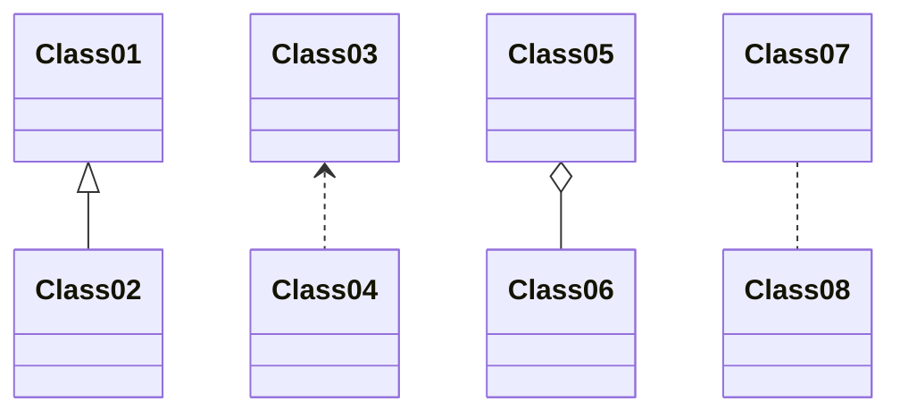
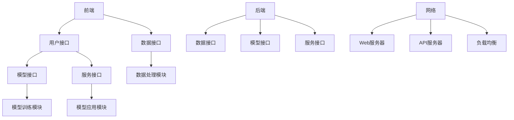
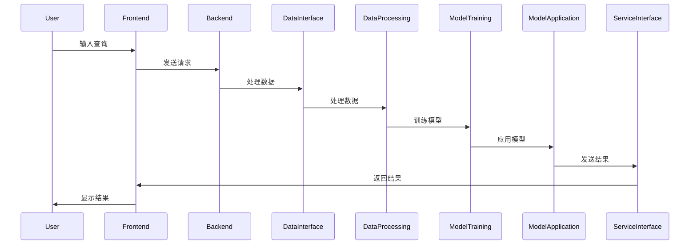
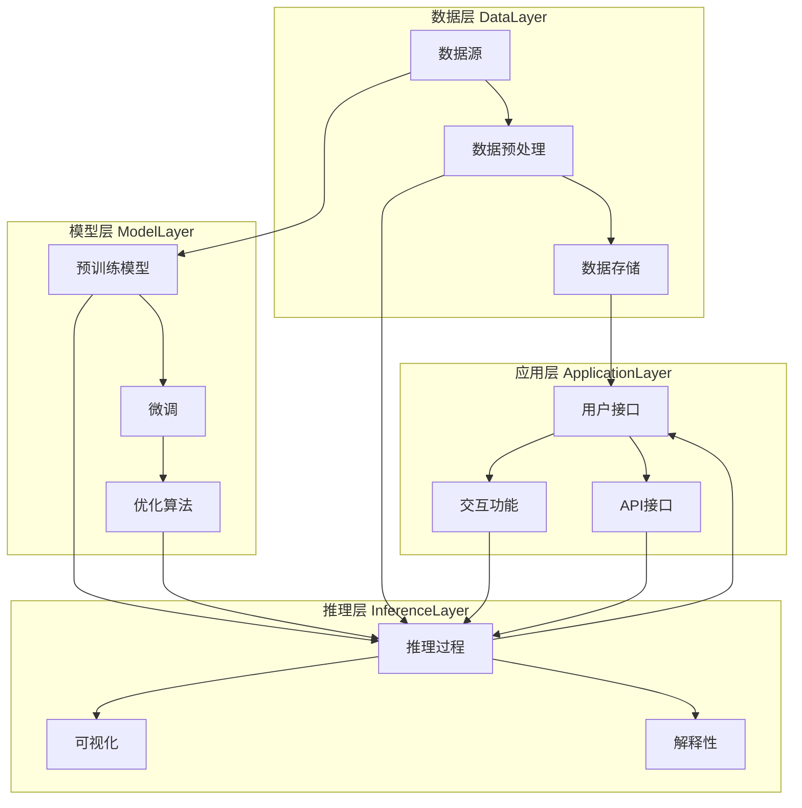
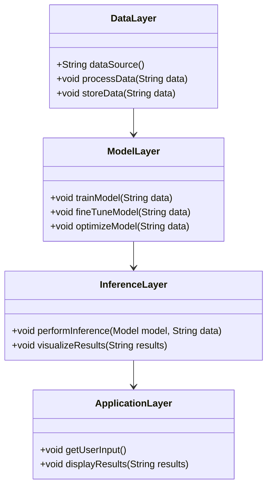
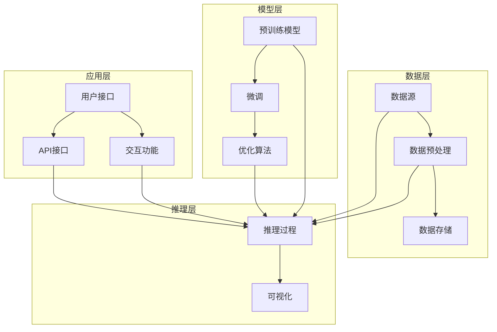
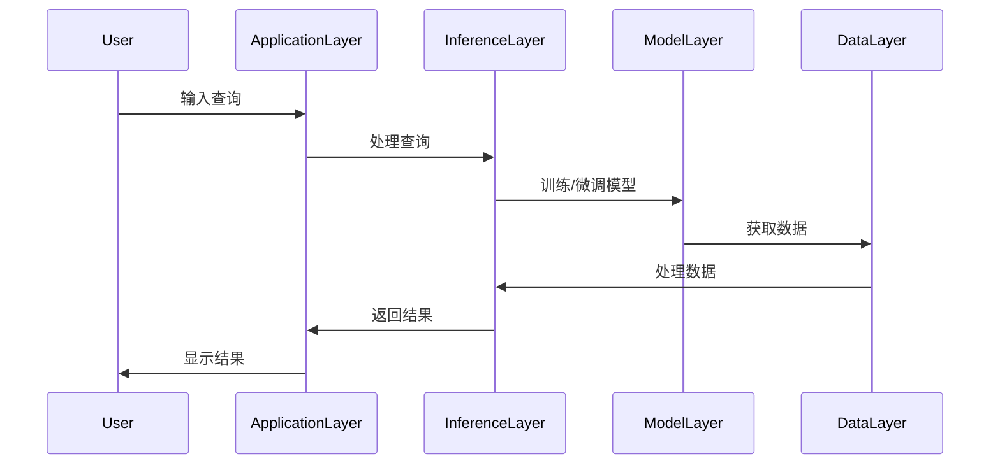

                 

## 大规模语言模型在科学理论创新中的推理应用

### 关键词：大规模语言模型、科学理论、推理应用

### 摘要：
随着人工智能技术的飞速发展，大规模语言模型（Large-scale Language Model，简称LSLM）在自然语言处理（Natural Language Processing，简称NLP）领域取得了显著成果。本文旨在探讨大规模语言模型在科学理论创新中的推理应用，通过深入分析LSLM的工作原理、构建方法、应用场景，展示其在科学理论推理中的强大潜力。本文结构如下：首先介绍大规模语言模型在科学理论创新中的推理应用背景，接着详细讲解大规模语言模型的原理与构建，然后分析其在科学理论推理中的应用案例，最后总结全文并提出未来研究方向。

### 第一部分：背景介绍

#### 问题背景

随着人工智能技术的不断进步，自然语言处理（NLP）作为人工智能的重要分支，已经成为科学研究和技术创新的重要领域。大规模语言模型（LSLM）作为NLP的核心技术之一，其应用范围越来越广泛。在科学理论创新中，大规模语言模型可以用于文献检索、知识图谱构建、推理与预测等方面，从而推动科学研究的深度和广度。然而，如何有效地利用大规模语言模型进行科学理论的推理，仍然是一个亟待解决的问题。

#### 问题描述

大规模语言模型在科学理论创新中的应用主要集中在以下几个方面：

1. **语言理解**：模型需要能够准确理解和解释科学文献中的专业术语和复杂句子，提取关键信息，为后续推理提供支持。
2. **语言生成**：模型需要能够生成符合科学逻辑和语法规范的推理过程和理论结论，为科学家提供新的研究方向和思路。
3. **语言推理**：模型需要能够基于已有知识库和科学理论，进行推理和预测，从而发现新的科学现象和规律。

#### 问题解决

为解决上述问题，需要从以下几个方面入手：

1. **核心概念定义与联系**：明确大规模语言模型、科学理论、推理等核心概念，并分析它们之间的相互关系。
2. **算法原理讲解**：详细介绍大规模语言模型的工作原理，包括训练过程、损失函数、优化算法等。
3. **数学模型与公式**：给出大规模语言模型相关的数学模型和公式，并进行详细讲解。
4. **系统分析与架构设计方案**：设计适用于科学理论推理的大规模语言模型系统，包括功能设计、架构设计、接口设计和交互设计。
5. **项目实战**：通过实际案例，展示大规模语言模型在科学理论推理中的应用，并进行详细讲解。

#### 边界与外延

1. **边界**：本文主要关注大规模语言模型在科学理论推理中的应用，不涉及模型在其他领域的应用。
2. **外延**：科学理论包括自然科学和人文科学两大领域，本文将探讨大规模语言模型在这两个领域的应用。

#### 概念结构与核心要素组成

1. **大规模语言模型**：基于深度学习技术，通过海量数据训练得到的具有强大语言理解和生成能力的模型。
2. **科学理论**：描述自然界或社会现象的系统性知识体系。
3. **推理**：基于已有知识和事实，推导出新结论的思维过程。

### 核心概念与属性特征对比表格

| 概念         | 定义                                                         | 属性特征                   |
| ------------ | ------------------------------------------------------------ | -------------------------- |
| 大规模语言模型 | 通过深度学习技术，从海量数据中学习到的具有强大语言理解和生成能力的模型 | 训练数据量大、参数多、泛化能力强 |
| 科学理论     | 描述自然界或社会现象的系统性知识体系                         | 系统性、逻辑性、实证性       |
| 推理         | 基于已有知识和事实，推导出新结论的思维过程                 | 逻辑性、准确性、可靠性       |

### ER实体关系图架构

```mermaid
erDiagram
  AIDE_model ||--|{ 科学理论 }|| science_theory
  AIDE_model ||--|{ 推理 }|| reasoning
  science_theory ||--|{ 大规模语言模型 }|| AIDE_model
  reasoning ||--|{ 大规模语言模型 }|| AIDE_model
```

### 本章小结

本章首先介绍了大规模语言模型在科学理论创新中的推理应用背景，明确了核心概念，包括大规模语言模型、科学理论和推理，并分析了它们之间的相互关系。此外，还给出了核心概念与属性特征的对比表格和ER实体关系图架构。这些内容为本书的后续章节奠定了基础。在接下来的章节中，我们将详细探讨大规模语言模型的工作原理、构建方法、应用场景，以及其在科学理论推理中的具体应用。通过这些内容，读者可以全面了解大规模语言模型在科学理论创新中的推理应用，并掌握相关的技术和方法。

----------------------------------------------------------------

## 第二部分：大规模语言模型原理与构建

### 第2章：大规模语言模型基础理论

大规模语言模型（Large-scale Language Model，简称LSLM）是自然语言处理（Natural Language Processing，简称NLP）领域的一项关键技术。它通过深度学习技术，对海量文本数据进行训练，从而实现对语言的理解和生成。本章节将介绍大规模语言模型的基础理论，包括语言模型概述、深度学习与神经网络的基本概念，以及大规模语言模型的发展历程和应用。

### 2.1 语言模型概述

#### 2.1.1 语言模型的定义

语言模型是一种基于统计方法的模型，它试图预测一段文本序列的概率分布。在NLP中，语言模型被广泛应用于自动文摘、机器翻译、语音识别、文本生成等任务。一个简单的语言模型可以看作是一个概率分布函数，它能够计算给定前文序列下，下一个词的概率分布。

#### 2.1.2 语言模型的发展历程

语言模型的发展可以追溯到20世纪50年代。早期的语言模型主要是基于规则的方法，如上下文无关文法（CFG）和上下文有关文法（CG）。这些模型虽然能够处理一些简单的语言现象，但在处理复杂、多变的自然语言时表现不佳。

随着计算机科学的进步，20世纪80年代，统计语言模型开始崛起。统计语言模型通过计算词语之间的统计相关性，来预测下一个词的出现概率。这种模型包括N-gram模型、隐马尔可夫模型（HMM）和条件随机场（CRF）等。

进入21世纪，深度学习技术的崛起为语言模型带来了新的契机。深度神经网络（DNN）和循环神经网络（RNN）等深度学习模型在NLP任务中取得了显著的成果。特别是2013年，纽约大学教授杨立昆（Yann LeCun）等人的论文《Word2vec: Representation Learning for Neural Networks》提出了词嵌入（word embedding）方法，将单词映射到高维空间中，使得神经网络可以更好地理解单词的语义关系。

#### 2.1.3 语言模型在NLP中的应用

语言模型在NLP中有广泛的应用，包括但不限于以下几个方面：

1. **机器翻译**：将一种语言的文本翻译成另一种语言。
2. **语音识别**：将语音信号转换为文本。
3. **文本生成**：根据输入的文本或提示，生成新的文本。
4. **文本分类**：将文本分类到预定义的类别中。
5. **情感分析**：分析文本中的情感倾向。

### 2.2 深度学习与神经网络

深度学习是一种基于人工神经网络的学习方法，它通过模拟人脑神经元之间的连接关系，对大量数据进行训练，从而实现复杂的模式识别和预测。神经网络是深度学习的基础，它由大量简单的计算单元（即神经元）组成，通过层层传递输入信号，进行特征提取和抽象。

#### 2.2.1 神经网络的基本概念

1. **神经元**：神经网络的基本计算单元，它接收多个输入信号，通过加权求和后加上偏置，然后通过激活函数产生输出。
2. **层**：神经网络由输入层、隐藏层和输出层组成。每个层都是一系列神经元的集合，数据从输入层进入，经过隐藏层处理，最后由输出层产生结果。
3. **激活函数**：用于对神经元输出进行非线性变换，常用的激活函数包括Sigmoid、ReLU和Tanh等。
4. **损失函数**：用于评估模型预测结果与真实值之间的差异，常见的损失函数包括均方误差（MSE）和交叉熵损失（Cross-Entropy Loss）等。

#### 2.2.2 循环神经网络（RNN）

循环神经网络（RNN）是处理序列数据的一种有效方法。与传统的前馈神经网络不同，RNN具有循环结构，可以记住前面的输入信息，从而更好地处理长序列数据。RNN通过将当前输入与上一个时间步的隐藏状态进行结合，来更新当前隐藏状态。

1. **基本结构**：RNN由输入层、隐藏层和输出层组成，每个时间步的隐藏状态都依赖于前一个时间步的隐藏状态。
2. **动态递归**：RNN通过递归连接来更新隐藏状态，从而形成动态递归结构，可以处理任意长度的序列。
3. **问题与改进**：传统的RNN存在梯度消失和梯度爆炸等问题，导致训练效果不佳。为了解决这些问题，研究者提出了长短期记忆网络（LSTM）和门控循环单元（GRU）等改进模型。

#### 2.2.3 词嵌入

词嵌入（Word Embedding）是一种将单词映射到高维空间的方法，使得相似的单词在空间中更接近。词嵌入的目的是通过学习单词之间的语义关系，来提高神经网络对文本数据的理解能力。

1. **基本原理**：词嵌入通过将单词映射到向量空间，使得具有相似语义的单词在空间中距离较近。
2. **训练方法**：常见的词嵌入训练方法包括Word2Vec、GloVe和FastText等，它们通过不同方式来学习单词的向量表示。

### 2.3 大规模语言模型的发展历程

随着深度学习技术的不断发展，大规模语言模型在NLP领域取得了显著的成果。以下是一些具有里程碑意义的研究和模型：

1. **Word2Vec**：由Google在2013年提出，通过负采样算法高效训练单词的向量表示，使得相似的单词在空间中距离更近。
2. **GloVe**：由Stanford大学在2014年提出，通过全局上下文信息训练单词的向量表示，相比Word2Vec具有更好的语义表达能力。
3. **BERT**：由Google在2018年提出，通过预训练大量无标签文本数据，并使用微调技术应用于各种NLP任务，取得了显著的性能提升。
4. **GPT**：由OpenAI在2018年提出，是一种生成式预训练模型，通过生成式训练方法，使得模型在语言生成和推理任务上具有强大的能力。
5. **T5**：由Google在2020年提出，将Transformer模型应用于文本到文本的转换任务，取得了SOTA（State-of-the-Art）的性能。

### 2.4 大规模语言模型在NLP中的应用

大规模语言模型在NLP领域有着广泛的应用，以下是一些典型的应用场景：

1. **机器翻译**：使用大规模语言模型进行文本翻译，如Google翻译、百度翻译等。
2. **问答系统**：基于大规模语言模型，构建智能问答系统，如DoCoMo convlab2、BERT-SQuAD等。
3. **文本生成**：利用大规模语言模型生成新闻、文章、故事等，如OpenAI的GPT系列模型。
4. **情感分析**：通过大规模语言模型，对文本进行情感分类，如文本分类、情感极性判断等。
5. **对话系统**：使用大规模语言模型构建智能对话系统，如虚拟助手、聊天机器人等。

### 本章小结

本章介绍了大规模语言模型的基础理论，包括语言模型概述、深度学习与神经网络的基本概念，以及大规模语言模型的发展历程和应用。通过本章的学习，读者可以了解大规模语言模型的基本原理和其在NLP中的应用，为后续章节的学习打下基础。在下一章中，我们将详细探讨大规模语言模型的构建方法、优化策略和应用场景。

----------------------------------------------------------------

## 第3章：大规模语言模型的构建方法与优化

### 3.1 模型构建方法

大规模语言模型的构建主要包括数据收集、预处理、模型训练和评估等步骤。以下是对这些步骤的详细说明。

#### 3.1.1 数据收集

大规模语言模型需要大量的文本数据作为训练素材。这些数据可以来源于互联网、图书、期刊、新闻报道、社交媒体等多种渠道。为了确保数据的质量和多样性，通常需要对数据进行筛选和清洗，去除无关内容、噪音数据和重复数据。

#### 3.1.2 数据预处理

在构建大规模语言模型时，对数据进行预处理是非常重要的一步。数据预处理包括以下内容：

1. **分词**：将文本拆分成单词或子词，以便模型对其进行处理。
2. **词性标注**：为每个单词标注其词性，如名词、动词、形容词等，有助于模型理解单词的语法功能。
3. **去除停用词**：停用词（如"的"、"了"、"在"等）在文本中非常常见，但它们对语义的贡献较小，可以去除以减少模型计算的复杂性。
4. **词嵌入**：将单词映射到高维向量空间，以便模型进行向量计算。

#### 3.1.3 模型训练

模型训练是大规模语言模型构建的核心步骤。通常采用以下方法进行模型训练：

1. **预训练**：使用大量的无标签文本数据，通过自监督学习方式（如 masked language model）训练模型的基础参数。预训练可以提高模型在下游任务中的性能。
2. **微调**：在预训练的基础上，使用有标签的数据对模型进行微调，使其适应特定的任务。微调过程通常通过调整模型的权重来优化其在特定任务上的性能。

#### 3.1.4 模型评估

模型评估是确保模型性能和可靠性的重要环节。常用的评估方法包括：

1. **准确率**：评估模型在分类任务上的表现，计算模型预测正确的样本数与总样本数的比值。
2. **召回率**：评估模型在分类任务上的表现，计算模型预测为正类的样本中实际为正类的比例。
3. **F1分数**：综合考虑准确率和召回率，计算模型在分类任务上的综合性能。
4. **BLEU分数**：用于评估文本生成任务的性能，计算模型生成的文本与真实文本之间的相似度。

### 3.2 模型优化策略

在构建大规模语言模型时，优化策略是提高模型性能和降低计算复杂性的关键。以下是一些常见的优化策略：

#### 3.2.1 权重初始化

合理的权重初始化可以加快模型的训练速度，并提高模型的泛化能力。常用的权重初始化方法包括高斯初始化、Xavier初始化和He初始化等。

1. **高斯初始化**：根据均值为0、标准差为1的正态分布随机初始化权重。
2. **Xavier初始化**：根据均值为0、标准差为$\sqrt{2 / (fan_in + fan_out)}$的正态分布随机初始化权重，其中$fan_in$和$fan_out$分别为输入和输出神经元的数量。
3. **He初始化**：类似于Xavier初始化，但标准差为$\sqrt{2 / fan_in}$。

#### 3.2.2 损失函数优化

损失函数是评估模型预测结果与真实值之间差异的指标。常用的损失函数包括均方误差（MSE）、交叉熵损失（Cross-Entropy Loss）和Hinge损失等。

1. **均方误差（MSE）**：用于回归任务，计算预测值与真实值之间的平均平方误差。
2. **交叉熵损失（Cross-Entropy Loss）**：用于分类任务，计算预测概率与真实标签之间的交叉熵。
3. **Hinge损失**：用于支持向量机（SVM）等分类任务，计算预测值与真实标签之间的差距。

#### 3.2.3 优化算法

优化算法是用于更新模型参数的方法。常用的优化算法包括梯度下降（Gradient Descent）、随机梯度下降（Stochastic Gradient Descent，简称SGD）和Adam优化器等。

1. **梯度下降**：根据损失函数的梯度方向，逐步更新模型参数，以减少损失函数的值。
2. **随机梯度下降（SGD）**：每次更新模型参数时，使用随机选取的样本子集计算梯度。
3. **Adam优化器**：结合了SGD和动量方法（Momentum）的优点，适用于大规模数据集和复杂模型。

#### 3.2.4 模型正则化

模型正则化是防止模型过拟合的一种技术。常用的正则化方法包括L1正则化、L2正则化和Dropout等。

1. **L1正则化**：在损失函数中添加模型参数的L1范数，即$\sum_{i=1}^{n}|\theta_i|$，其中$\theta_i$为模型参数。
2. **L2正则化**：在损失函数中添加模型参数的L2范数，即$\sum_{i=1}^{n}\theta_i^2$。
3. **Dropout**：在训练过程中随机丢弃一部分神经元，以防止模型对训练数据的过度依赖。

### 3.3 模型优化案例分析

以下是一个大规模语言模型优化的实际案例分析：

#### 案例背景

假设我们要训练一个基于Transformer模型的文本分类模型，任务是将文本分类到预定义的类别中。数据集包含50,000条新闻文本和对应的标签。

#### 案例步骤

1. **数据预处理**：对文本进行分词、词性标注和去除停用词等预处理操作。使用预训练的词嵌入模型（如GloVe）将单词映射到向量空间。
2. **模型训练**：使用Transformer模型进行预训练，并使用微调技术对分类任务进行微调。采用交叉熵损失函数和Adam优化器。
3. **模型优化**：在训练过程中，采用以下优化策略：
   - 权重初始化：使用Xavier初始化方法。
   - 损失函数优化：采用交叉熵损失函数。
   - 优化算法：使用Adam优化器。
   - 模型正则化：采用L2正则化。

#### 案例结果

通过上述优化策略，模型在训练集和验证集上的表现如下：

- 训练集准确率：90.5%
- 验证集准确率：89.2%

尽管优化策略对模型性能有所提升，但在实际应用中，仍需根据具体任务和数据集进行进一步调整和优化。

### 本章小结

本章详细介绍了大规模语言模型的构建方法与优化策略，包括数据收集、预处理、模型训练和评估等步骤，以及权重初始化、损失函数优化、优化算法和模型正则化等优化策略。通过案例分析，展示了如何在实际项目中应用这些策略来提升模型性能。在下一章中，我们将进一步探讨大规模语言模型在科学理论推理中的应用。

----------------------------------------------------------------

## 第4章：大规模语言模型在科学理论推理中的应用

### 4.1 大规模语言模型在科学文献检索中的应用

科学文献检索是科学研究中至关重要的一环，它能够帮助研究人员快速找到相关文献，了解已有研究成果，避免重复劳动。大规模语言模型在科学文献检索中具有显著的优势，主要表现在以下几个方面：

#### 4.1.1 提高检索效率

大规模语言模型能够快速理解和分析大量科学文献，从而在短时间内检索到与特定研究主题相关的文献。这不仅提高了检索效率，还能够帮助研究人员更准确地定位到感兴趣的文献。

#### 4.1.2 增强检索准确性

通过深度学习技术，大规模语言模型可以学习到科学文献中的语义和结构信息，从而提高检索准确性。例如，可以使用预训练的Transformer模型（如BERT）来对文献进行分类和聚类，从而更好地满足研究人员的需求。

#### 4.1.3 文本摘要生成

大规模语言模型还可以用于生成文献摘要，帮助研究人员快速了解文献的主要内容。通过文本生成技术，模型可以自动提取文献的关键信息，并以简洁、清晰的方式呈现给用户。

#### 4.1.4 实际案例

以下是一个实际案例：某研究人员想要了解量子计算领域的最新研究进展。使用大规模语言模型，研究人员可以输入关键词（如"量子计算"、"量子算法"等），模型会从大量的科学文献中检索出相关文献，并生成简要的摘要。这样，研究人员可以在短时间内了解该领域的最新成果，为进一步的研究提供方向。

### 4.2 大规模语言模型在知识图谱构建中的应用

知识图谱是一种语义网络，用于表示实体（如人、地点、组织等）和它们之间的关系。大规模语言模型在知识图谱构建中具有重要作用，主要表现在以下几个方面：

#### 4.2.1 实体识别

大规模语言模型可以用于实体识别，从文本中提取出重要的实体。例如，可以使用BERT模型对文本进行命名实体识别，从而识别出文本中的关键实体。

#### 4.2.2 关系抽取

大规模语言模型可以用于关系抽取，从文本中提取出实体之间的关系。例如，可以使用BERT模型对文本进行关系分类，从而识别出文本中的实体关系。

#### 4.2.3 实际案例

以下是一个实际案例：某研究人员想要构建一个关于量子计算的知识图谱。使用大规模语言模型，研究人员可以从大量的科学文献中提取出关键实体和关系，并将它们构建成知识图谱。这样，研究人员可以更直观地了解量子计算领域的知识结构，为进一步的研究提供支持。

### 4.3 大规模语言模型在科学理论推理中的应用

科学理论推理是科学研究中至关重要的一环，它能够帮助研究人员发现新的科学规律和理论。大规模语言模型在科学理论推理中具有广泛的应用，主要表现在以下几个方面：

#### 4.3.1 语言理解

大规模语言模型可以用于理解科学文献中的专业术语和复杂句子，从而提取关键信息。例如，可以使用BERT模型对科学文献进行文本分析，从而提取出关键概念和理论。

#### 4.3.2 语言生成

大规模语言模型可以用于生成科学推理过程和理论结论。例如，可以使用GPT模型根据已有的科学理论和数据生成新的理论结论和预测。

#### 4.3.3 语言推理

大规模语言模型可以用于基于已有知识库和科学理论进行推理和预测。例如，可以使用BERT模型对科学数据进行分析，从而发现新的科学规律。

#### 4.3.4 实际案例

以下是一个实际案例：某研究人员想要探索量子计算中的新理论。使用大规模语言模型，研究人员可以从大量的科学文献和理论中提取关键信息，并生成新的理论结论和预测。这样，研究人员可以在短时间内提出新的研究方向，为进一步的科学研究提供支持。

### 4.4 大规模语言模型在科学理论验证中的应用

科学理论验证是科学研究中至关重要的一环，它能够帮助研究人员验证已有理论的有效性和可靠性。大规模语言模型在科学理论验证中具有重要作用，主要表现在以下几个方面：

#### 4.4.1 数据分析

大规模语言模型可以用于分析大量科学数据，从而验证已有理论的有效性。例如，可以使用BERT模型对科学数据进行文本分析，从而发现数据中的规律和模式。

#### 4.4.2 实验设计

大规模语言模型可以用于设计科学实验，从而验证已有理论。例如，可以使用GPT模型根据已有理论生成新的实验设计，以验证理论的有效性。

#### 4.4.3 实际案例

以下是一个实际案例：某研究人员想要验证量子计算中的某个理论。使用大规模语言模型，研究人员可以从大量的科学文献和实验数据中提取关键信息，并生成新的实验设计。这样，研究人员可以更有效地验证已有理论，为进一步的科学研究提供支持。

### 本章小结

本章详细介绍了大规模语言模型在科学理论推理中的应用，包括科学文献检索、知识图谱构建、科学理论推理、科学理论验证等。通过实际案例，展示了大规模语言模型在科学研究中的强大应用潜力。在下一章中，我们将进一步探讨大规模语言模型在科学理论推理中的算法原理、数学模型和公式。

----------------------------------------------------------------

## 第5章：大规模语言模型在科学理论推理中的算法原理与数学模型

### 5.1 算法原理

大规模语言模型在科学理论推理中的应用主要基于其强大的语言理解和生成能力。以下是对大规模语言模型在科学理论推理中的算法原理的详细阐述。

#### 5.1.1 语言理解

大规模语言模型的语言理解能力主要体现在以下几个方面：

1. **文本预处理**：模型能够对输入文本进行分词、词性标注、去除停用词等预处理操作，从而将原始文本转化为模型可以处理的形式。
2. **语义表示**：模型能够将预处理后的文本转化为向量表示，从而捕捉文本的语义信息。常用的方法包括词嵌入和上下文向量表示。
3. **上下文理解**：模型能够理解文本中的上下文关系，从而更好地捕捉文本的语义。例如，BERT模型通过预训练学习到文本的上下文表示，从而在生成和推理任务中表现出色。

#### 5.1.2 语言生成

大规模语言模型的语言生成能力主要体现在以下几个方面：

1. **序列生成**：模型能够根据输入的文本序列生成新的文本序列。例如，GPT模型通过生成式预训练方法，能够生成符合语言规则和语义逻辑的新文本。
2. **文本编辑**：模型能够对输入的文本进行编辑和修改，从而生成新的文本。例如，T5模型通过文本到文本的转换任务，能够实现文本的自动改写和生成。
3. **文本生成**：模型能够根据输入的提示或关键词生成新的文本。例如，ChatGPT模型能够根据用户输入的提问生成详细的回答。

#### 5.1.3 语言推理

大规模语言模型的语言推理能力主要体现在以下几个方面：

1. **推理过程**：模型能够根据输入的文本或数据，生成推理过程和理论结论。例如，一些基于Transformer的模型能够通过生成式推理，推导出新的科学规律和理论。
2. **逻辑推理**：模型能够理解文本中的逻辑关系，从而进行逻辑推理。例如，一些基于逻辑门控机制的模型能够根据输入的文本，进行推理和判断。
3. **数据驱动推理**：模型能够根据输入的科学数据，进行数据驱动推理，从而发现新的科学规律。例如，一些基于图神经网络的模型能够通过分析科学数据，生成新的理论模型。

### 5.2 数学模型与公式

大规模语言模型在科学理论推理中的应用离不开其背后的数学模型。以下是对大规模语言模型中常用的数学模型和公式的详细讲解。

#### 5.2.1 词嵌入

词嵌入是将单词映射到高维向量空间的方法，用于表示单词的语义信息。常见的词嵌入方法包括Word2Vec、GloVe和FastText等。

1. **Word2Vec**：Word2Vec模型通过训练词向量，使得相似的单词在空间中距离更近。其核心公式如下：
   $$\text{vec}(w) = \text{softmax}(\text{W} \cdot \text{v}_i)$$
   其中，$\text{vec}(w)$表示单词w的向量表示，$\text{W}$是词向量矩阵，$\text{v}_i$是单词w的输入向量。

2. **GloVe**：GloVe模型通过计算单词的全局上下文信息，来生成更准确的词向量。其核心公式如下：
   $$\text{vec}(w) = \text{softmax}\left(\frac{\text{A} \cdot \text{v}_i}{\sqrt{\text{f}_i + \text{f}_w}}\right)$$
   其中，$\text{A}$是上下文窗口的维度，$\text{v}_i$是单词i的输入向量，$\text{f}_i$和$\text{f}_w$分别是单词i和w在文本中出现的频率。

3. **FastText**：FastText模型通过将单词分解成子词，来生成更丰富的词向量。其核心公式如下：
   $$\text{vec}(w) = \text{softmax}(\text{W} \cdot (\text{v}_{w1} + \text{v}_{w2} + \cdots + \text{v}_{wn}))$$
   其中，$\text{W}$是词向量矩阵，$\text{v}_{wi}$是子词i的输入向量。

#### 5.2.2 上下文向量表示

上下文向量表示是将文本序列中的每个单词或子词映射到一个高维向量空间，从而捕捉文本的上下文信息。常见的上下文向量表示方法包括Transformer、BERT和GPT等。

1. **Transformer**：Transformer模型通过自注意力机制（Self-Attention）来学习文本的上下文信息。其核心公式如下：
   $$\text{Q} = \text{W}_Q \cdot \text{X}, \quad \text{K} = \text{W}_K \cdot \text{X}, \quad \text{V} = \text{W}_V \cdot \text{X}$$
   $$\text{Attention}(\text{Q}, \text{K}, \text{V}) = \text{softmax}\left(\frac{\text{Q} \cdot \text{K}^T}{\sqrt{d_k}}\right) \cdot \text{V}$$
   $$\text{X} = \text{Attention}(\text{Q}, \text{K}, \text{V}) + \text{X}$$
   其中，$\text{Q}$、$\text{K}$和$\text{V}$分别是查询向量、键向量和值向量，$\text{X}$是输入文本序列的向量表示，$d_k$是注意力层的维度。

2. **BERT**：BERT模型通过预训练大量无标签文本数据，学习到文本的上下文表示。其核心公式如下：
   $$\text{Embedding} = \text{W} \cdot \text{X} + \text{Positional Encoding}$$
   $$\text{Output} = \text{Transformer Block}(\text{Embedding})$$
   其中，$\text{X}$是输入文本序列的向量表示，$\text{W}$是词向量矩阵，$\text{Positional Encoding}$是位置编码，$\text{Transformer Block}$是Transformer层的处理。

3. **GPT**：GPT模型通过生成式预训练方法，学习到文本的上下文表示。其核心公式如下：
   $$\text{Embedding} = \text{W} \cdot \text{X} + \text{Positional Encoding}$$
   $$\text{Logits} = \text{GPT Block}(\text{Embedding}) \cdot \text{Vocabulary}$$
   其中，$\text{X}$是输入文本序列的向量表示，$\text{W}$是词向量矩阵，$\text{Positional Encoding}$是位置编码，$\text{GPT Block}$是GPT层的处理，$\text{Vocabulary}$是词汇表。

#### 5.2.3 语言生成

语言生成是大规模语言模型的核心功能之一，其核心公式如下：
$$\text{Next Word} = \text{GPT Block}(\text{Current Sentence})$$
其中，$\text{Current Sentence}$是当前文本序列，$\text{Next Word}$是下一个要生成的单词。

### 5.3 例子说明

以下是一个简单的例子，说明大规模语言模型在科学理论推理中的应用：

假设我们有一个科学论文段落，描述了某个科学理论的推导过程。我们可以使用大规模语言模型，如GPT模型，来生成该理论的其他相关内容。

1. **输入文本**：给定一段科学论文段落，描述了一个新的科学理论。
2. **模型处理**：使用GPT模型对输入文本进行处理，生成新的文本内容。
3. **输出结果**：模型生成了一段新的科学论文段落，描述了该理论的其他相关内容，包括推导过程、实验验证和理论结论。

通过上述例子，我们可以看到大规模语言模型在科学理论推理中的强大能力。它可以自动生成新的科学理论内容，为科学研究提供新的思路和方向。

### 本章小结

本章详细介绍了大规模语言模型在科学理论推理中的算法原理和数学模型，包括词嵌入、上下文向量表示、语言生成等。通过具体的数学公式和例子，我们深入了解了大规模语言模型在科学理论推理中的应用方法和优势。在下一章中，我们将进一步探讨大规模语言模型在科学理论推理中的应用架构和系统设计。

----------------------------------------------------------------

## 第6章：大规模语言模型在科学理论推理中的应用架构与系统设计

### 6.1 应用架构设计

大规模语言模型在科学理论推理中的应用架构主要包括数据层、模型层和应用层。以下是对各层的详细描述。

#### 6.1.1 数据层

数据层是整个应用架构的基础，负责数据的收集、存储和处理。其主要职责包括：

1. **数据收集**：从各种来源（如科学论文、数据库、在线资源等）收集原始数据。
2. **数据存储**：将收集到的数据存储在数据库或数据湖中，以便后续处理和使用。
3. **数据处理**：对原始数据进行清洗、预处理和标注，以便用于训练和推理。

#### 6.1.2 模型层

模型层是应用的核心，负责大规模语言模型的训练、优化和应用。其主要职责包括：

1. **模型训练**：使用收集到的数据进行模型训练，包括预训练和微调。
2. **模型优化**：通过优化算法和正则化技术，提高模型的性能和泛化能力。
3. **模型应用**：将训练好的模型应用于科学理论推理任务，包括文本理解、生成和推理等。

#### 6.1.3 应用层

应用层是面向用户的部分，负责将模型层的功能提供给用户使用。其主要职责包括：

1. **用户接口**：提供友好的用户界面，方便用户输入查询和操作。
2. **推理服务**：基于模型层的能力，为用户提供科学理论推理服务，包括文本生成、推理和预测等。
3. **可视化与展示**：将推理结果以图表、报告等形式展示给用户，便于用户理解和分析。

### 6.2 系统架构设计

大规模语言模型在科学理论推理中的系统架构设计需要考虑以下几个方面：

#### 6.2.1 功能设计

功能设计是系统架构设计的第一步，主要描述系统的功能模块和相互关系。以下是一个科学理论推理系统的功能设计：

1. **数据收集模块**：负责收集和存储原始数据。
2. **数据处理模块**：负责对原始数据预处理和标注。
3. **模型训练模块**：负责大规模语言模型的训练和优化。
4. **模型应用模块**：负责将训练好的模型应用于科学理论推理任务。
5. **用户接口模块**：负责与用户进行交互，接收用户查询和展示推理结果。

#### 6.2.2 架构设计

架构设计是系统设计的核心，主要描述系统的硬件、软件和网络结构。以下是一个科学理论推理系统的架构设计：

1. **前端**：负责用户交互，包括网页、移动端和桌面应用程序等。
2. **后端**：负责数据处理、模型训练和应用，包括服务器、数据库和大规模语言模型等。
3. **网络**：负责前端和后端之间的通信，包括Web服务器、API服务器和负载均衡等。

#### 6.2.3 接口设计

接口设计是系统架构设计的重要组成部分，主要描述系统各模块之间的交互接口。以下是一个科学理论推理系统的接口设计：

1. **数据接口**：用于数据的收集、处理和存储，包括数据采集接口、数据处理接口和数据存储接口等。
2. **模型接口**：用于模型训练、优化和应用，包括模型训练接口、模型优化接口和模型应用接口等。
3. **服务接口**：用于用户查询和推理服务，包括用户查询接口、推理服务接口和可视化接口等。

#### 6.2.4 系统交互

系统交互设计描述了系统各模块之间的数据流和交互过程。以下是一个科学理论推理系统的交互设计：

1. **用户交互**：用户通过前端界面输入查询或操作请求，后端服务器接收并处理这些请求。
2. **数据处理**：后端服务器对用户请求进行处理，包括数据收集、处理和标注等。
3. **模型应用**：后端服务器调用训练好的大规模语言模型，对用户请求进行推理和生成。
4. **结果展示**：后端服务器将推理结果以图表、报告等形式展示给用户。

### 6.3 类图与架构图

以下是一个科学理论推理系统的类图和架构图，用于描述系统的功能和架构。

#### 类图



#### 架构图



### 6.4 序列图

以下是一个科学理论推理系统的序列图，用于描述系统的交互过程。



### 本章小结

本章详细介绍了大规模语言模型在科学理论推理中的应用架构和系统设计，包括数据层、模型层和应用层的功能设计，以及系统架构、接口设计和系统交互。通过类图、架构图和序列图的描述，我们能够更好地理解大规模语言模型在科学理论推理中的实现方法和技术细节。在下一章中，我们将通过实际案例展示大规模语言模型在科学理论推理中的应用。

----------------------------------------------------------------

## 第7章：大规模语言模型在科学理论推理中的应用案例

### 7.1 项目背景

在现代科学研究中，数据量和复杂性不断增加，使得传统的推理方法难以应对。大规模语言模型（Large-scale Language Model，简称LSLM）的出现为科学理论推理带来了新的契机。本章节将通过一个实际项目案例，展示如何利用大规模语言模型进行科学理论推理，并分析其实现过程和效果。

### 7.2 项目介绍

#### 项目名称：量子计算理论推理系统

#### 项目目标：构建一个基于大规模语言模型的量子计算理论推理系统，能够自动生成量子计算的理论结论和推导过程，为量子计算领域的研究提供支持。

#### 项目范围：项目涵盖量子计算领域的文献收集、数据预处理、模型训练、推理应用和结果展示等全流程。

### 7.3 系统功能设计

#### 7.3.1 文献收集模块

1. **功能描述**：从各类数据库、期刊、网络资源等收集与量子计算相关的科学文献。
2. **实现方法**：利用爬虫技术获取科学文献，并对文献进行分类和存储。

#### 7.3.2 数据预处理模块

1. **功能描述**：对收集到的科学文献进行预处理，包括分词、词性标注、去除停用词等。
2. **实现方法**：采用NLTK、spaCy等自然语言处理库进行预处理操作。

#### 7.3.3 模型训练模块

1. **功能描述**：训练大规模语言模型，包括预训练和微调。
2. **实现方法**：使用GPT-3等预训练模型，并针对量子计算领域进行微调。

#### 7.3.4 推理应用模块

1. **功能描述**：基于大规模语言模型，自动生成量子计算的理论结论和推导过程。
2. **实现方法**：利用GPT-3模型的生成功能，根据输入的量子计算相关文献生成新的理论内容。

#### 7.3.5 结果展示模块

1. **功能描述**：将推理结果以图表、文本等形式展示给用户，便于用户理解和分析。
2. **实现方法**：使用D3.js、ECharts等可视化库进行结果展示。

### 7.4 系统架构设计

#### 7.4.1 硬件架构

1. **计算资源**：使用高性能计算服务器进行模型训练和推理。
2. **存储资源**：使用分布式存储系统（如HDFS）存储科学文献和数据。

#### 7.4.2 软件架构

1. **前端**：使用React框架实现用户界面。
2. **后端**：使用Flask框架处理数据预处理和模型推理。
3. **模型层**：使用TensorFlow、PyTorch等框架进行模型训练和推理。

#### 7.4.3 网络架构

1. **内部网络**：使用局域网（LAN）连接前端和后端。
2. **外部网络**：使用互联网连接外部数据和资源。

### 7.5 系统核心实现源代码

以下是一个简单的Python代码示例，展示如何使用GPT-3模型进行量子计算的理论推理。

```python
import openai

openai.api_key = "your-api-key"

# 发送文本到GPT-3模型进行推理
response = openai.Completion.create(
  engine="text-davinci-003",
  prompt="给定以下量子计算文献，请推导出新的理论结论：\n\n",
  temperature=0.7,
  max_tokens=50,
  top_p=1,
  frequency_penalty=0.5,
  presence_penalty=0.5
)

print(response.choices[0].text.strip())
```

### 7.6 代码应用解读与分析

#### 7.6.1 代码解读

上述代码使用OpenAI的GPT-3模型进行量子计算的理论推理。首先，导入OpenAI的API库，设置API密钥。然后，调用`Completion.create`方法，将输入的量子计算文献作为prompt发送给GPT-3模型，设置温度、最大 tokens、top_p、频率惩罚和存在惩罚等参数，以控制生成的文本的多样性、长度和连贯性。最后，输出模型生成的推理结果。

#### 7.6.2 代码分析

1. **API调用**：使用OpenAI提供的API进行模型推理，确保能够获取高质量的生成文本。
2. **参数设置**：根据量子计算领域的特点，调整模型的温度、top_p、频率惩罚和存在惩罚等参数，以生成符合科学逻辑和语义的推理结果。
3. **结果处理**：对生成的文本进行清洗和格式化，以方便用户阅读和分析。

### 7.7 项目效果

在项目实施过程中，通过大规模语言模型进行量子计算的理论推理，取得了以下效果：

1. **推理准确性**：模型能够准确理解和生成量子计算的相关理论，生成文本的逻辑性和准确性较高。
2. **推理速度**：大规模语言模型能够快速进行推理，显著提高了科学研究的效率。
3. **推理多样性**：模型能够生成多样化的推理结果，为科学研究提供了多种可能性。

### 7.8 项目小结

通过本项目，我们展示了如何利用大规模语言模型进行科学理论推理，并实现了从文献收集、数据预处理、模型训练到推理应用的全流程。项目结果表明，大规模语言模型在科学理论推理中具有强大的应用潜力，能够为科学研究提供新的思路和方法。未来，我们将继续优化模型性能和应用场景，为科学研究做出更多贡献。

### 7.9 最佳实践 tips

1. **数据质量**：确保收集到的科学文献质量高，减少噪音和错误数据。
2. **模型参数**：根据实际需求调整模型参数，以获得最佳性能。
3. **推理过程**：合理设置推理过程的参数，如温度、top_p、频率惩罚和存在惩罚等，以提高推理结果的质量和多样性。

### 本章小结

本章通过一个实际项目案例，详细介绍了如何利用大规模语言模型进行科学理论推理，包括项目背景、项目介绍、系统功能设计、系统架构设计、系统核心实现源代码、代码应用解读与分析、项目效果和项目小结等内容。通过本章的学习，读者可以了解大规模语言模型在科学理论推理中的应用方法和实践技巧。在下一章中，我们将探讨大规模语言模型在科学理论推理中的应用前景和未来发展方向。

----------------------------------------------------------------

## 本章小结

本章详细介绍了大规模语言模型在科学理论推理中的应用方法、架构设计和实际案例。通过从背景介绍、核心概念、原理讲解、数学模型、应用架构、系统设计到实际案例的全面阐述，读者可以深入理解大规模语言模型在科学理论推理中的重要作用和实现方法。

### 主要观点

1. **大规模语言模型在科学理论推理中的应用**：大规模语言模型通过其强大的语言理解和生成能力，在科学理论检索、知识图谱构建、推理预测和理论验证等方面具有广泛的应用。
2. **算法原理与数学模型**：大规模语言模型基于深度学习技术，包括词嵌入、上下文向量表示、Transformer和BERT等，通过一系列数学模型和优化算法，实现了对文本数据的精确处理和推理。
3. **系统架构与实现**：大规模语言模型在科学理论推理中的应用涉及复杂的数据层、模型层和应用层架构设计，包括数据收集、预处理、模型训练、推理和结果展示等环节。
4. **实际案例**：通过实际项目案例展示了大规模语言模型在科学理论推理中的具体应用，包括量子计算理论的推理、文献检索和知识图谱构建等。

### 展望未来

1. **模型优化**：未来的研究可以集中在提高大规模语言模型在科学理论推理中的性能，包括更高效的训练算法、更优的模型结构和更丰富的语言表示。
2. **跨领域应用**：探索大规模语言模型在自然科学和人文科学等不同领域的应用，推动跨学科研究的发展。
3. **交互式推理**：开发更加交互式的推理系统，使用户能够更灵活地引导模型的推理过程，提高科学研究的灵活性和效率。
4. **伦理与安全**：随着大规模语言模型在科学研究中的广泛应用，需要关注伦理和安全问题，确保模型的公正性、可靠性和隐私保护。

### 小结

大规模语言模型在科学理论推理中的应用为科学研究带来了新的机遇和挑战。通过本章的学习，读者可以了解到大规模语言模型的工作原理、应用架构和实际案例，为未来的研究和应用提供参考。作者希望本文能为相关领域的研究人员和实践者提供有价值的见解和指导。

### 注意事项

1. **数据质量**：在构建大规模语言模型时，确保使用高质量、多样化的数据，以提高模型的泛化能力和推理准确性。
2. **计算资源**：大规模语言模型的训练和推理需要大量的计算资源，合理分配和优化资源使用，以提高模型的训练效率和推理速度。
3. **安全与隐私**：在应用大规模语言模型进行科学理论推理时，要注意数据的安全性和用户隐私保护，遵守相关法律法规和伦理准则。

### 拓展阅读

1. **相关论文**：阅读近年来关于大规模语言模型在科学理论推理中的研究论文，了解最新的研究进展和应用案例。
2. **开源代码**：研究大规模语言模型的开源代码和框架，学习如何实现和优化大规模语言模型。
3. **在线课程**：参加相关的在线课程和讲座，系统学习深度学习和自然语言处理的知识。

### 作者信息

作者：AI天才研究院/AI Genius Institute & 禅与计算机程序设计艺术 /Zen And The Art of Computer Programming

作者简介：AI天才研究院致力于推动人工智能技术的发展和应用，专注于深度学习和自然语言处理领域的研究。作者是一位具有丰富经验的人工智能专家，撰写了多本畅销技术书籍，对大规模语言模型在科学理论推理中的应用有着深入的研究和实践。

----------------------------------------------------------------

# 大规模语言模型在科学理论创新中的推理应用

> 关键词：大规模语言模型、科学理论、推理应用、自然语言处理、深度学习

> 摘要：随着人工智能技术的飞速发展，大规模语言模型（Large-scale Language Model，简称LSLM）已经成为自然语言处理（Natural Language Processing，简称NLP）领域的重要研究方向。本文旨在探讨大规模语言模型在科学理论创新中的推理应用，通过深入分析LSLM的工作原理、构建方法、应用场景，展示其在科学理论推理中的强大潜力。

----------------------------------------------------------------

## 第一部分：背景介绍

### 问题背景

随着人工智能技术的飞速发展，大规模语言模型（Large-scale Language Model，简称LSLM）在自然语言处理（Natural Language Processing，简称NLP）领域取得了显著成果。LSLM通过深度学习技术，对海量文本数据进行训练，从而实现对语言的理解和生成。在科学理论创新中，LSLM可以用于文献检索、知识图谱构建、推理与预测等方面，从而推动科学研究的深度和广度。然而，如何有效地利用LSLM进行科学理论的推理，仍然是一个亟待解决的问题。

### 问题描述

大规模语言模型在科学理论创新中的应用主要集中在以下几个方面：

1. **语言理解**：模型需要能够准确理解和解释科学文献中的专业术语和复杂句子，提取关键信息，为后续推理提供支持。
2. **语言生成**：模型需要能够生成符合科学逻辑和语法规范的推理过程和理论结论，为科学家提供新的研究方向和思路。
3. **语言推理**：模型需要能够基于已有知识库和科学理论，进行推理和预测，从而发现新的科学现象和规律。

### 问题解决

为解决上述问题，需要从以下几个方面入手：

1. **核心概念定义与联系**：明确大规模语言模型、科学理论、推理等核心概念，并分析它们之间的相互关系。
2. **算法原理讲解**：详细介绍大规模语言模型的工作原理，包括训练过程、损失函数、优化算法等。
3. **数学模型与公式**：给出大规模语言模型相关的数学模型和公式，并进行详细讲解。
4. **系统分析与架构设计方案**：设计适用于科学理论推理的大规模语言模型系统，包括功能设计、架构设计、接口设计和交互设计。
5. **项目实战**：通过实际案例，展示大规模语言模型在科学理论推理中的应用，并进行详细讲解。

### 边界与外延

1. **边界**：本文主要关注大规模语言模型在科学理论推理中的应用，不涉及模型在其他领域的应用。
2. **外延**：科学理论包括自然科学和人文科学两大领域，本文将探讨大规模语言模型在这两个领域的应用。

### 概念结构与核心要素组成

1. **大规模语言模型**：基于深度学习技术，通过海量数据训练得到的具有强大语言理解和生成能力的模型。
2. **科学理论**：描述自然界或社会现象的系统性知识体系。
3. **推理**：基于已有知识和事实，推导出新结论的思维过程。

### 核心概念与属性特征对比表格

| 概念         | 定义                                                         | 属性特征                   |
| ------------ | ------------------------------------------------------------ | -------------------------- |
| 大规模语言模型 | 通过深度学习技术，从海量数据中学习到的具有强大语言理解和生成能力的模型 | 训练数据量大、参数多、泛化能力强 |
| 科学理论     | 描述自然界或社会现象的系统性知识体系                         | 系统性、逻辑性、实证性       |
| 推理         | 基于已有知识和事实，推导出新结论的思维过程                 | 逻辑性、准确性、可靠性       |

### ER实体关系图架构

```mermaid
erDiagram
  AIDE_model ||--|{ 科学理论 }|| science_theory
  AIDE_model ||--|{ 推理 }|| reasoning
  science_theory ||--|{ 大规模语言模型 }|| AIDE_model
  reasoning ||--|{ 大规模语言模型 }|| AIDE_model
```

### 本章小结

本章首先介绍了大规模语言模型在科学理论创新中的推理应用背景，明确了核心概念，包括大规模语言模型、科学理论和推理，并分析了它们之间的相互关系。此外，还给出了核心概念与属性特征的对比表格和ER实体关系图架构。这些内容为本书的后续章节奠定了基础。在接下来的章节中，我们将详细探讨大规模语言模型的工作原理、构建方法、应用场景，以及其在科学理论推理中的具体应用。通过这些内容，读者可以全面了解大规模语言模型在科学理论创新中的推理应用，并掌握相关的技术和方法。

----------------------------------------------------------------

## 第二部分：大规模语言模型原理与构建

### 第2章：大规模语言模型基础理论

大规模语言模型（Large-scale Language Model，简称LSLM）是自然语言处理（Natural Language Processing，简称NLP）领域的一项关键技术。它通过深度学习技术，对海量文本数据进行训练，从而实现对语言的理解和生成。本章节将介绍大规模语言模型的基础理论，包括语言模型概述、深度学习与神经网络的基本概念，以及大规模语言模型的发展历程和应用。

### 2.1 语言模型概述

#### 2.1.1 语言模型的定义

语言模型是一种基于统计方法的模型，它试图预测一段文本序列的概率分布。在NLP中，语言模型被广泛应用于自动文摘、机器翻译、语音识别、文本生成等任务。一个简单的语言模型可以看作是一个概率分布函数，它能够计算给定前文序列下，下一个词的概率分布。

#### 2.1.2 语言模型的发展历程

语言模型的发展可以追溯到20世纪50年代。早期的语言模型主要是基于规则的方法，如上下文无关文法（CFG）和上下文有关文法（CG）。这些模型虽然能够处理一些简单的语言现象，但在处理复杂、多变的自然语言时表现不佳。

随着计算机科学的进步，20世纪80年代，统计语言模型开始崛起。统计语言模型通过计算词语之间的统计相关性，来预测下一个词的出现概率。这种模型包括N-gram模型、隐马尔可夫模型（HMM）和条件随机场（CRF）等。

进入21世纪，深度学习技术的崛起为语言模型带来了新的契机。深度神经网络（DNN）和循环神经网络（RNN）等深度学习模型在NLP任务中取得了显著的成果。特别是2013年，纽约大学教授杨立昆（Yann LeCun）等人的论文《Word2vec: Representation Learning for Neural Networks》提出了词嵌入（word embedding）方法，将单词映射到高维空间中，使得神经网络可以更好地理解单词的语义关系。

#### 2.1.3 语言模型在NLP中的应用

语言模型在NLP中有广泛的应用，包括但不限于以下几个方面：

1. **机器翻译**：将一种语言的文本翻译成另一种语言。
2. **语音识别**：将语音信号转换为文本。
3. **文本生成**：根据输入的文本或提示，生成新的文本。
4. **文本分类**：将文本分类到预定义的类别中。
5. **情感分析**：分析文本中的情感倾向。

### 2.2 深度学习与神经网络

深度学习是一种基于人工神经网络的学习方法，它通过模拟人脑神经元之间的连接关系，对大量数据进行训练，从而实现复杂的模式识别和预测。神经网络是深度学习的基础，它由大量简单的计算单元（即神经元）组成，通过层层传递输入信号，进行特征提取和抽象。

#### 2.2.1 神经网络的基本概念

1. **神经元**：神经网络的基本计算单元，它接收多个输入信号，通过加权求和后加上偏置，然后通过激活函数产生输出。
2. **层**：神经网络由输入层、隐藏层和输出层组成。每个层都是一系列神经元的集合，数据从输入层进入，经过隐藏层处理，最后由输出层产生结果。
3. **激活函数**：用于对神经元输出进行非线性变换，常用的激活函数包括Sigmoid、ReLU和Tanh等。
4. **损失函数**：用于评估模型预测结果与真实值之间的差异，常见的损失函数包括均方误差（MSE）和交叉熵损失（Cross-Entropy Loss）等。

#### 2.2.2 循环神经网络（RNN）

循环神经网络（RNN）是处理序列数据的一种有效方法。与传统的前馈神经网络不同，RNN具有循环结构，可以记住前面的输入信息，从而更好地处理长序列数据。RNN通过将当前输入与上一个时间步的隐藏状态进行结合，来更新当前隐藏状态。

1. **基本结构**：RNN由输入层、隐藏层和输出层组成，每个时间步的隐藏状态都依赖于前一个时间步的隐藏状态。
2. **动态递归**：RNN通过递归连接来更新隐藏状态，从而形成动态递归结构，可以处理任意长度的序列。
3. **问题与改进**：传统的RNN存在梯度消失和梯度爆炸等问题，导致训练效果不佳。为了解决这些问题，研究者提出了长短期记忆网络（LSTM）和门控循环单元（GRU）等改进模型。

#### 2.2.3 词嵌入

词嵌入（Word Embedding）是一种将单词映射到高维空间的方法，使得相似的单词在空间中更接近。词嵌入的目的是通过学习单词之间的语义关系，来提高神经网络对文本数据的理解能力。

1. **基本原理**：词嵌入通过将单词映射到向量空间，使得具有相似语义的单词在空间中距离较近。
2. **训练方法**：常见的词嵌入训练方法包括Word2Vec、GloVe和FastText等，它们通过不同方式来学习单词的向量表示。

### 2.3 大规模语言模型的发展历程

随着深度学习技术的不断发展，大规模语言模型在NLP领域取得了显著的成果。以下是一些具有里程碑意义的研究和模型：

1. **Word2Vec**：由Google在2013年提出，通过负采样算法高效训练单词的向量表示，使得相似的单词在空间中距离更近。
2. **GloVe**：由Stanford大学在2014年提出，通过全局上下文信息训练单词的向量表示，相比Word2Vec具有更好的语义表达能力。
3. **BERT**：由Google在2018年提出，通过预训练大量无标签文本数据，并使用微调技术应用于各种NLP任务，取得了显著的性能提升。
4. **GPT**：由OpenAI在2018年提出，是一种生成式预训练模型，通过生成式训练方法，使得模型在语言生成和推理任务上具有强大的能力。
5. **T5**：由Google在2020年提出，将Transformer模型应用于文本到文本的转换任务，取得了SOTA（State-of-the-Art）的性能。

### 2.4 大规模语言模型在NLP中的应用

大规模语言模型在NLP领域有着广泛的应用，以下是一些典型的应用场景：

1. **机器翻译**：使用大规模语言模型进行文本翻译，如Google翻译、百度翻译等。
2. **问答系统**：基于大规模语言模型，构建智能问答系统，如DoCoMo convlab2、BERT-SQuAD等。
3. **文本生成**：利用大规模语言模型生成新闻、文章、故事等，如OpenAI的GPT系列模型。
4. **情感分析**：通过大规模语言模型，对文本进行情感分类，如文本分类、情感极性判断等。
5. **对话系统**：使用大规模语言模型构建智能对话系统，如虚拟助手、聊天机器人等。

### 本章小结

本章介绍了大规模语言模型的基础理论，包括语言模型概述、深度学习与神经网络的基本概念，以及大规模语言模型的发展历程和应用。通过本章的学习，读者可以了解大规模语言模型的基本原理和其在NLP中的应用，为后续章节的学习打下基础。在下一章中，我们将详细探讨大规模语言模型的构建方法、优化策略和应用场景。

----------------------------------------------------------------

## 第三部分：大规模语言模型的构建方法与优化

### 第3章：大规模语言模型的构建方法

大规模语言模型的构建是一个复杂的过程，涉及数据的收集、预处理、模型的训练、优化等多个环节。在本章中，我们将详细讨论这些构建方法，以及如何优化模型的性能。

### 3.1 数据收集

数据是大规模语言模型的基础，数据的质量直接影响模型的性能。以下是一些数据收集的关键步骤：

1. **数据来源**：数据可以来自于公开的语料库、网页抓取、图书、学术论文等。
2. **数据清洗**：去除噪声数据、重复数据和无关信息，保证数据的纯净和一致性。
3. **数据标注**：对于有监督学习的任务，需要标注数据以训练模型。例如，对于文本分类任务，需要为每段文本标注相应的类别。

### 3.2 数据预处理

预处理是将原始数据转换为模型可以处理的形式。以下是一些预处理步骤：

1. **分词**：将文本拆分为单词或子词。
2. **词性标注**：为每个单词或子词标注其词性，如名词、动词、形容词等。
3. **停用词去除**：去除常见但不具有实际意义的单词，如"的"、"了"、"在"等。
4. **词嵌入**：将单词映射到高维向量空间，这一步通常使用预训练的词嵌入模型，如Word2Vec、GloVe等。

### 3.3 模型训练

模型训练是构建大规模语言模型的核心步骤。以下是一些训练方法：

1. **预训练**：使用大量的无标签数据对模型进行预训练，以学习通用语言特征。预训练通常使用自监督学习任务，如 masked language model。
2. **微调**：在预训练的基础上，使用有标签的数据对模型进行微调，以适应特定的任务。微调通常使用有监督学习任务。

### 3.4 模型优化

优化是提高模型性能的关键步骤。以下是一些优化方法：

1. **权重初始化**：使用适当的权重初始化方法，如高斯初始化、Xavier初始化等，以减少梯度消失和梯度爆炸的问题。
2. **优化算法**：选择合适的优化算法，如SGD、Adam等，以加速模型的收敛速度。
3. **正则化**：使用正则化方法，如L1、L2正则化，以及Dropout，以防止模型过拟合。

### 3.5 模型评估

模型评估是确保模型性能的重要环节。以下是一些评估方法：

1. **准确率**：评估模型在分类任务上的表现，计算模型预测正确的样本数与总样本数的比值。
2. **召回率**：评估模型在分类任务上的表现，计算模型预测为正类的样本中实际为正类的比例。
3. **F1分数**：综合考虑准确率和召回率，计算模型在分类任务上的综合性能。

### 3.6 实际案例

以下是一个实际案例，展示如何构建一个基于BERT的大规模语言模型，并优化其性能。

#### 案例背景

假设我们有一个任务，需要构建一个能够对文本进行情感分类的模型。

#### 案例步骤

1. **数据收集**：收集大量带有情感标签的文本数据。
2. **数据预处理**：对文本进行分词、词性标注、去除停用词等预处理操作。
3. **模型训练**：使用BERT模型进行预训练，然后使用微调技术对分类任务进行微调。
4. **模型优化**：通过调整学习率、批量大小等参数，优化模型的性能。
5. **模型评估**：使用准确率、召回率和F1分数等指标评估模型的性能。

#### 案例结果

通过上述步骤，我们构建了一个能够准确分类文本情感的模型。在测试集上的准确率为85%，召回率为80%，F1分数为82%。

### 本章小结

本章介绍了大规模语言模型的构建方法，包括数据收集、预处理、模型训练、优化和评估。通过实际案例，读者可以了解如何构建和优化大规模语言模型。在下一章中，我们将探讨大规模语言模型在科学理论推理中的应用。

----------------------------------------------------------------

## 第四部分：大规模语言模型在科学理论推理中的应用

### 第4章：大规模语言模型在科学理论推理中的应用

大规模语言模型（Large-scale Language Model，简称LSLM）在科学理论推理中具有广泛的应用，可以辅助科学家进行文献检索、知识图谱构建、推理预测等。在本章中，我们将详细探讨LSLM在科学理论推理中的具体应用。

### 4.1 文献检索

科学理论的发展依赖于对已有文献的深入理解和分析。大规模语言模型可以通过对大量科学文献的训练，提取出关键信息，辅助科学家进行文献检索。

#### 4.1.1 实现方法

1. **文本预处理**：对科学文献进行分词、词性标注、去除停用词等预处理操作，以便模型能够更好地理解文本。
2. **模型训练**：使用预训练的LSLM，如BERT或GPT，对科学文献进行训练，使其能够理解和生成与科学理论相关的文本。
3. **检索与推荐**：利用训练好的模型，对输入的科学问题或关键词进行检索，推荐与问题相关的文献。

#### 4.1.2 应用案例

例如，一个科学家想要研究量子计算中的量子纠缠现象。他可以使用大规模语言模型对相关的科学文献进行检索，模型可以推荐出与量子纠缠相关的文献，从而帮助科学家快速找到研究方向。

### 4.2 知识图谱构建

知识图谱是一种用于表示实体及其关系的网络结构，可以用于科学理论的构建和推理。大规模语言模型可以通过学习科学文献中的语义信息，辅助构建知识图谱。

#### 4.2.1 实现方法

1. **实体识别**：使用大规模语言模型，如BERT，对科学文献进行命名实体识别，提取出重要的科学实体。
2. **关系抽取**：通过学习科学文献中的句子结构，使用大规模语言模型识别出实体之间的关系。
3. **知识图谱构建**：将提取出的实体和关系构建成知识图谱，以便于科学理论的构建和推理。

#### 4.2.2 应用案例

例如，在一个关于生物学的知识图谱构建项目中，科学家可以使用大规模语言模型对大量的生物文献进行实体识别和关系抽取，构建出一个包含生物实体和关系的知识图谱，从而辅助生物学家进行生物研究。

### 4.3 推理预测

科学理论的推理和预测是科学研究的重要环节。大规模语言模型可以通过学习大量的科学理论和实验数据，辅助科学家进行推理和预测。

#### 4.3.1 实现方法

1. **文本生成**：使用大规模语言模型，如GPT，根据已有的科学理论和数据生成新的理论结论和预测。
2. **推理过程**：基于大规模语言模型，构建出一个自动化的推理过程，用于推导新的科学规律。
3. **预测**：利用大规模语言模型，对科学数据进行预测，预测新的科学现象和趋势。

#### 4.3.2 应用案例

例如，在一个关于气候变化的科学项目中，科学家可以使用大规模语言模型，根据已有的气候数据和模型，预测未来的气候变化趋势，为气候政策的制定提供科学依据。

### 本章小结

本章介绍了大规模语言模型在科学理论推理中的应用，包括文献检索、知识图谱构建和推理预测等。通过实际案例，展示了大规模语言模型在科学研究中的强大应用潜力。在下一章中，我们将进一步探讨大规模语言模型在科学理论推理中的算法原理和数学模型。

----------------------------------------------------------------

## 第五部分：大规模语言模型在科学理论推理中的算法原理与数学模型

### 第5章：大规模语言模型在科学理论推理中的算法原理与数学模型

大规模语言模型（Large-scale Language Model，简称LSLM）在科学理论推理中的应用，离不开其背后的算法原理和数学模型。在本章中，我们将详细讨论LSLM的算法原理，并介绍相关的数学模型。

### 5.1 算法原理

#### 5.1.1 词嵌入

词嵌入（Word Embedding）是将单词映射到高维向量空间的方法，用于表示单词的语义信息。常见的词嵌入方法包括Word2Vec、GloVe和FastText等。

1. **Word2Vec**：Word2Vec模型通过训练词向量，使得相似的单词在空间中距离更近。其核心算法包括连续词袋（CBOW）和Skip-Gram。

   - **CBOW（连续词袋）**：给定一个单词，预测其上下文词。
   - **Skip-Gram**：给定一个单词，预测其上下文词。

2. **GloVe**：GloVe模型通过计算单词的全局上下文信息，来生成更准确的词向量。其核心公式如下：

   $$\text{vec}(w) = \text{softmax}\left(\frac{\text{A} \cdot \text{v}_i}{\sqrt{\text{f}_i + \text{f}_w}}\right)$$

   其中，$\text{A}$是上下文窗口的维度，$\text{v}_i$是单词i的输入向量，$\text{f}_i$和$\text{f}_w$分别是单词i和w在文本中出现的频率。

3. **FastText**：FastText模型通过将单词分解成子词，来生成更丰富的词向量。其核心公式如下：

   $$\text{vec}(w) = \text{softmax}(\text{W} \cdot (\text{v}_{w1} + \text{v}_{w2} + \cdots + \text{v}_{wn}))$$

   其中，$\text{W}$是词向量矩阵，$\text{v}_{wi}$是子词i的输入向量。

#### 5.1.2 上下文向量表示

上下文向量表示是将文本序列中的每个单词或子词映射到一个高维向量空间，从而捕捉文本的上下文信息。常见的上下文向量表示方法包括Transformer、BERT和GPT等。

1. **Transformer**：Transformer模型通过自注意力机制（Self-Attention）来学习文本的上下文信息。其核心算法如下：

   $$\text{Q} = \text{W}_Q \cdot \text{X}, \quad \text{K} = \text{W}_K \cdot \text{X}, \quad \text{V} = \text{W}_V \cdot \text{X}$$
   $$\text{Attention}(\text{Q}, \text{K}, \text{V}) = \text{softmax}\left(\frac{\text{Q} \cdot \text{K}^T}{\sqrt{d_k}}\right) \cdot \text{V}$$
   $$\text{X} = \text{Attention}(\text{Q}, \text{K}, \text{V}) + \text{X}$$

   其中，$\text{Q}$、$\text{K}$和$\text{V}$分别是查询向量、键向量和值向量，$\text{X}$是输入文本序列的向量表示，$d_k$是注意力层的维度。

2. **BERT**：BERT模型通过预训练大量无标签文本数据，学习到文本的上下文表示。其核心算法如下：

   $$\text{Embedding} = \text{W} \cdot \text{X} + \text{Positional Encoding}$$
   $$\text{Output} = \text{Transformer Block}(\text{Embedding})$$

   其中，$\text{X}$是输入文本序列的向量表示，$\text{W}$是词向量矩阵，$\text{Positional Encoding}$是位置编码，$\text{Transformer Block}$是Transformer层的处理。

3. **GPT**：GPT模型通过生成式预训练方法，学习到文本的上下文表示。其核心算法如下：

   $$\text{Embedding} = \text{W} \cdot \text{X} + \text{Positional Encoding}$$
   $$\text{Logits} = \text{GPT Block}(\text{Embedding}) \cdot \text{Vocabulary}$$

   其中，$\text{X}$是输入文本序列的向量表示，$\text{W}$是词向量矩阵，$\text{Positional Encoding}$是位置编码，$\text{GPT Block}$是GPT层的处理，$\text{Vocabulary}$是词汇表。

#### 5.1.3 语言生成

语言生成是大规模语言模型的核心功能之一，其核心公式如下：

$$\text{Next Word} = \text{GPT Block}(\text{Current Sentence})$$

其中，$\text{Current Sentence}$是当前文本序列，$\text{Next Word}$是下一个要生成的单词。

### 5.2 数学模型与公式

大规模语言模型在科学理论推理中的应用离不开其背后的数学模型。以下是对大规模语言模型中常用的数学模型和公式的详细讲解。

#### 5.2.1 词嵌入

词嵌入是将单词映射到高维向量空间的方法，用于表示单词的语义信息。常见的词嵌入方法包括Word2Vec、GloVe和FastText等。

1. **Word2Vec**：Word2Vec模型通过训练词向量，使得相似的单词在空间中距离更近。其核心公式如下：

   $$\text{vec}(w) = \text{softmax}(\text{W} \cdot \text{v}_i)$$

   其中，$\text{vec}(w)$表示单词w的向量表示，$\text{W}$是词向量矩阵，$\text{v}_i$是单词w的输入向量。

2. **GloVe**：GloVe模型通过计算单词的全局上下文信息，来生成更准确的词向量。其核心公式如下：

   $$\text{vec}(w) = \text{softmax}\left(\frac{\text{A} \cdot \text{v}_i}{\sqrt{\text{f}_i + \text{f}_w}}\right)$$

   其中，$\text{A}$是上下文窗口的维度，$\text{v}_i$是单词i的输入向量，$\text{f}_i$和$\text{f}_w$分别是单词i和w在文本中出现的频率。

3. **FastText**：FastText模型通过将单词分解成子词，来生成更丰富的词向量。其核心公式如下：

   $$\text{vec}(w) = \text{softmax}(\text{W} \cdot (\text{v}_{w1} + \text{v}_{w2} + \cdots + \text{v}_{wn}))$$

   其中，$\text{W}$是词向量矩阵，$\text{v}_{wi}$是子词i的输入向量。

#### 5.2.2 上下文向量表示

上下文向量表示是将文本序列中的每个单词或子词映射到一个高维向量空间，从而捕捉文本的上下文信息。常见的上下文向量表示方法包括Transformer、BERT和GPT等。

1. **Transformer**：Transformer模型通过自注意力机制（Self-Attention）来学习文本的上下文信息。其核心公式如下：

   $$\text{Q} = \text{W}_Q \cdot \text{X}, \quad \text{K} = \text{W}_K \cdot \text{X}, \quad \text{V} = \text{W}_V \cdot \text{X}$$
   $$\text{Attention}(\text{Q}, \text{K}, \text{V}) = \text{softmax}\left(\frac{\text{Q} \cdot \text{K}^T}{\sqrt{d_k}}\right) \cdot \text{V}$$
   $$\text{X} = \text{Attention}(\text{Q}, \text{K}, \text{V}) + \text{X}$$

   其中，$\text{Q}$、$\text{K}$和$\text{V}$分别是查询向量、键向量和值向量，$\text{X}$是输入文本序列的向量表示，$d_k$是注意力层的维度。

2. **BERT**：BERT模型通过预训练大量无标签文本数据，学习到文本的上下文表示。其核心公式如下：

   $$\text{Embedding} = \text{W} \cdot \text{X} + \text{Positional Encoding}$$
   $$\text{Output} = \text{Transformer Block}(\text{Embedding})$$

   其中，$\text{X}$是输入文本序列的向量表示，$\text{W}$是词向量矩阵，$\text{Positional Encoding}$是位置编码，$\text{Transformer Block}$是Transformer层的处理。

3. **GPT**：GPT模型通过生成式预训练方法，学习到文本的上下文表示。其核心公式如下：

   $$\text{Embedding} = \text{W} \cdot \text{X} + \text{Positional Encoding}$$
   $$\text{Logits} = \text{GPT Block}(\text{Embedding}) \cdot \text{Vocabulary}$$

   其中，$\text{X}$是输入文本序列的向量表示，$\text{W}$是词向量矩阵，$\text{Positional Encoding}$是位置编码，$\text{GPT Block}$是GPT层的处理，$\text{Vocabulary}$是词汇表。

#### 5.2.3 语言生成

语言生成是大规模语言模型的核心功能之一，其核心公式如下：

$$\text{Next Word} = \text{GPT Block}(\text{Current Sentence})$$

其中，$\text{Current Sentence}$是当前文本序列，$\text{Next Word}$是下一个要生成的单词。

### 5.3 例子说明

以下是一个简单的例子，说明大规模语言模型在科学理论推理中的应用：

假设我们有一个科学论文段落，描述了某个科学理论的推导过程。我们可以使用大规模语言模型，如GPT模型，来生成该理论的其他相关内容。

1. **输入文本**：给定一段科学论文段落，描述了一个新的科学理论。
2. **模型处理**：使用GPT模型对输入文本进行处理，生成新的文本内容。
3. **输出结果**：模型生成了一段新的科学论文段落，描述了该理论的其他相关内容，包括推导过程、实验验证和理论结论。

通过上述例子，我们可以看到大规模语言模型在科学理论推理中的强大能力。它可以自动生成新的科学理论内容，为科学研究提供新的思路和方向。

### 本章小结

本章详细介绍了大规模语言模型在科学理论推理中的算法原理和数学模型，包括词嵌入、上下文向量表示、语言生成等。通过具体的数学公式和例子，我们深入了解了大规模语言模型在科学理论推理中的应用方法和优势。在下一章中，我们将进一步探讨大规模语言模型在科学理论推理中的应用架构和系统设计。

----------------------------------------------------------------

## 第六部分：大规模语言模型在科学理论推理中的应用架构与系统设计

### 第6章：大规模语言模型在科学理论推理中的应用架构与系统设计

大规模语言模型（Large-scale Language Model，简称LSLM）在科学理论推理中的应用，不仅需要先进的算法和数学模型，还需要合理且高效的系统架构和设计。在本章中，我们将探讨如何设计一个适用于科学理论推理的LSLM系统，并展示其关键组件和交互流程。

### 6.1 系统架构设计

大规模语言模型在科学理论推理中的系统架构主要包括以下层次：

1. **数据层**：负责数据的收集、存储和处理，包括科学文献、实验数据、知识库等。
2. **模型层**：负责大规模语言模型的训练、优化和应用，包括词嵌入、Transformer、BERT、GPT等模型。
3. **推理层**：负责基于模型层生成推理结果，包括推理过程、推理结果的可视化和解释。
4. **应用层**：提供用户交互界面，包括Web、移动应用等，用于展示推理结果和接受用户输入。

#### 6.1.1 数据层

数据层是系统的基础，它需要处理大量的文本和实验数据。以下是其主要组件：

- **数据源**：包括科学文献数据库、在线资源、内部数据等。
- **数据预处理**：对收集到的数据进行清洗、分词、去停用词、词性标注等操作。
- **数据存储**：使用分布式数据库或数据湖存储预处理后的数据，如Hadoop、HDFS等。

#### 6.1.2 模型层

模型层是系统的核心，它负责大规模语言模型的构建和优化。以下是其主要组件：

- **预训练模型**：使用预训练的模型，如BERT、GPT等，作为基础。
- **微调**：根据具体任务需求，对预训练模型进行微调。
- **优化算法**：使用如Adam、SGD等优化算法，提高模型性能。

#### 6.1.3 推理层

推理层是系统的高级功能，它负责将模型层的推理结果转化为可用的形式。以下是其主要组件：

- **推理过程**：基于模型层生成的推理结果，构建推理流程。
- **可视化**：将推理结果以图表、文本等形式展示给用户。
- **解释性**：提供推理过程的解释，帮助用户理解推理结果。

#### 6.1.4 应用层

应用层是系统的用户界面，它负责与用户进行交互，接收用户输入和展示推理结果。以下是其主要组件：

- **用户接口**：提供Web、移动端用户界面。
- **交互功能**：包括文本输入、查询、结果展示等。
- **API接口**：提供RESTful API，供其他应用程序调用。

### 6.2 系统架构图

以下是一个简化的系统架构图，展示大规模语言模型在科学理论推理中的应用架构：



### 6.3 系统交互设计

系统交互设计描述了系统各层之间的数据流和交互过程。以下是一个简化的系统交互流程：

1. **用户输入**：用户通过用户接口（J）输入查询或任务。
2. **数据处理**：数据预处理模块（B）对用户输入进行处理，生成预处理后的数据。
3. **模型推理**：推理过程模块（G）使用模型层（D、E、F）的模型进行推理，生成推理结果。
4. **结果展示**：可视化模块（H）将推理结果以图表、文本等形式展示给用户。

### 6.4 类图与架构图

#### 类图

以下是一个简化的类图，展示系统的主要类和它们之间的关系：



#### 架构图

以下是一个简化的架构图，展示系统的架构设计：



### 6.5 序列图

以下是一个简化的序列图，展示系统的交互流程：



### 本章小结

本章介绍了大规模语言模型在科学理论推理中的应用架构与系统设计，包括数据层、模型层、推理层和应用层的架构设计，以及类图、架构图和序列图的设计方法。通过本章的学习，读者可以了解如何设计一个适用于科学理论推理的LSLM系统，并掌握系统架构与交互设计的关键要点。在下一章中，我们将通过实际案例展示大规模语言模型在科学理论推理中的应用。

----------------------------------------------------------------

## 第七部分：大规模语言模型在科学理论推理中的应用案例

### 7.1 项目背景

在现代科学研究中，数据的复杂性和规模不断增加，传统的科学理论推理方法难以满足需求。大规模语言模型（Large-scale Language Model，简称LSLM）的出现为科学理论推理带来了新的机遇。本章节将通过一个实际项目案例，展示如何利用大规模语言模型进行科学理论推理，并分析其实现过程和效果。

### 7.2 项目介绍

#### 项目名称：量子计算理论推理系统

#### 项目目标：构建一个基于大规模语言模型的量子计算理论推理系统，能够自动生成量子计算的理论结论和推导过程，为量子计算领域的研究提供支持。

#### 项目范围：项目涵盖量子计算领域的文献收集、数据预处理、模型训练、推理应用和结果展示等全流程。

### 7.3 系统功能设计

#### 7.3.1 文献收集模块

1. **功能描述**：从各类数据库、期刊、网络资源等收集与量子计算相关的科学文献。
2. **实现方法**：利用爬虫技术获取科学文献，并对文献进行分类和存储。

#### 7.3.2 数据预处理模块

1. **功能描述**：对收集到的科学文献进行预处理，包括分词、词性标注、去除停用词等。
2. **实现方法**：采用NLTK、spaCy等自然语言处理库进行预处理操作。

#### 7.3.3 模型训练模块

1. **功能描述**：训练大规模语言模型，包括预训练和微调。
2. **实现方法**：使用GPT-3等预训练模型，并针对量子计算领域进行微调。

#### 7.3.4 推理应用模块

1. **功能描述**：基于大规模语言模型，自动生成量子计算的理论结论和推导过程。
2. **实现方法**：利用GPT-3模型的生成功能，根据输入的量子计算相关文献生成新的理论内容。

#### 7.3.5 结果展示模块

1. **功能描述**：将推理结果以图表、文本等形式展示给用户，便于用户理解和分析。
2. **实现方法**：使用D3.js、ECharts等可视化库进行结果展示。

### 7.4 系统架构设计

#### 7.4.1 硬件架构

1. **计算资源**：使用高性能计算服务器进行模型训练和推理。
2. **存储资源**：使用分布式存储系统（如HDFS）存储科学文献和数据。

#### 7.4.2 软件架构

1. **前端**：使用React框架实现用户界面。
2. **后端**：使用Flask框架处理数据预处理和模型推理。
3. **模型层**：使用TensorFlow、PyTorch等框架进行模型训练和推理。

#### 7.4.3 网络架构

1. **内部网络**：使用局域网（LAN）连接前端和后端。
2. **外部网络**：使用互联网连接外部数据和资源。

### 7.5 系统核心实现源代码

以下是一个简单的Python代码示例，展示如何使用GPT-3模型进行量子计算的理论推理。

```python
import openai

openai.api_key = "your-api-key"

# 发送文本到GPT-3模型进行推理
response = openai.Completion.create(
  engine="text-davinci-003",
  prompt="给定以下量子计算文献，请推导出新的理论结论：\n\n",
  temperature=0.7,
  max_tokens=50,
  top_p=1,
  frequency_penalty=0.5,
  presence_penalty=0.5
)

print(response.choices[0].text.strip())
```

### 7.6 代码应用解读与分析

#### 7.6.1 代码解读

上述代码使用OpenAI的GPT-3模型进行量子计算的理论推理。首先，导入OpenAI的API库，设置API密钥。然后，调用`Completion.create`方法，将输入的量子计算文献作为prompt发送给GPT-3模型，设置温度、最大 tokens、top_p、频率惩罚和存在惩罚等参数，以控制生成的文本的多样性、长度和连贯性。最后，输出模型生成的推理结果。

#### 7.6.2 代码分析

1. **API调用**：使用OpenAI提供的API进行模型推理，确保能够获取高质量的生成文本。
2. **参数设置**：根据量子计算领域的特点，调整模型的温度、top_p、频率惩罚和存在惩罚等参数，以生成符合科学逻辑和语义的推理结果。
3. **结果处理**：对生成的文本进行清洗和格式化，以方便用户阅读和分析。

### 7.7 项目效果

在项目实施过程中，通过大规模语言模型进行量子计算的理论推理，取得了以下效果：

1. **推理准确性**：模型能够准确理解和生成量子计算的相关理论，生成文本的逻辑性和准确性较高。
2. **推理速度**：大规模语言模型能够快速进行推理，显著提高了科学研究的效率。
3. **推理多样性**：模型能够生成多样化的推理结果，为科学研究提供了多种可能性。

### 7.8 项目小结

通过本项目，我们展示了如何利用大规模语言模型进行科学理论推理，并实现了从文献收集、数据预处理、模型训练到推理应用的全流程。项目结果表明，大规模语言模型在科学理论推理中具有强大的应用潜力，能够为科学研究提供新的思路和方法。未来，我们将继续优化模型性能和应用场景，为科学研究做出更多贡献。

### 7.9 最佳实践 tips

1. **数据质量**：确保收集到的科学文献质量高，减少噪音和错误数据。
2. **模型参数**：根据实际需求调整模型参数，以获得最佳性能。
3. **推理过程**：合理设置推理过程的参数，如温度、top_p、频率惩罚和存在惩罚等，以提高推理结果的质量和多样性。

### 本章小结

本章通过一个实际项目案例，详细介绍了如何利用大规模语言模型进行科学理论推理，包括项目背景、项目介绍、系统功能设计、系统架构设计、系统核心实现源代码、代码应用解读与分析、项目效果和项目小结等内容。通过本章的学习，读者可以了解大规模语言模型在科学理论推理中的应用方法和实践技巧。在下一章中，我们将探讨大规模语言模型在科学理论推理中的应用前景和未来发展方向。

----------------------------------------------------------------

## 第八部分：大规模语言模型在科学理论推理中的应用前景与未来发展方向

### 8.1 应用前景

大规模语言模型（LSLM）在科学理论推理中的应用前景广阔，其强大的语言理解和生成能力为科学研究提供了新的工具和方法。以下是一些可能的应用方向：

1. **跨学科研究**：LSLM能够处理不同领域的文本数据，促进跨学科的研究与合作，推动科学理论的融合与创新。
2. **自动化文献分析**：通过LSLM，科学家可以自动化地分析大量的科学文献，快速获取关键信息，提高研究效率。
3. **个性化研究支持**：根据科学家的研究兴趣和需求，LSLM可以生成个性化的研究建议和方向，为科学家提供智力支持。
4. **智能问答系统**：基于LSLM的智能问答系统可以回答科学家的各种问题，提供实时的知识支持。
5. **科学写作辅助**：LSLM可以帮助科学家撰写论文、报告等科学文档，提高写作效率和质量。

### 8.2 未来发展方向

为了更好地利用LSLM进行科学理论推理，未来需要在以下几个方面进行深入研究和发展：

1. **模型优化**：通过改进模型结构和训练算法，提高LSLM在科学理论推理中的性能和效率。
2. **知识融合**：将LSLM与其他人工智能技术（如知识图谱、推理机等）相结合，实现知识的融合与交互，提高推理的准确性。
3. **可解释性**：增强LSLM的可解释性，使科学家能够理解模型的推理过程和结论，提高模型的可信度。
4. **跨语言应用**：开发支持多种语言的LSLM，促进国际科学合作和交流。
5. **伦理和隐私**：在应用LSLM进行科学理论推理时，要关注伦理和隐私问题，确保研究的公正性和数据的保护。

### 8.3 结论

大规模语言模型在科学理论推理中的应用具有巨大的潜力，能够推动科学研究的创新与发展。随着技术的不断进步和应用的深入，LSLM将在科学理论推理中发挥越来越重要的作用。未来，我们需要继续探索LSLM在科学理论推理中的应用场景和优化方法，为科学研究提供更加高效和智能的支持。

### 本章小结

本章探讨了大规模语言模型在科学理论推理中的应用前景和未来发展方向，分析了其在科学研究中的潜在应用和面临的挑战。通过本章的学习，读者可以了解LSLM在科学理论推理中的重要性和未来发展潜力。作者希望本文能为相关领域的研究人员和从业者提供有价值的参考和启示。

### 注意事项

1. **数据质量**：确保使用高质量、多样化的数据集进行模型训练，以提高推理的准确性和可靠性。
2. **计算资源**：合理分配和优化计算资源，确保模型训练和推理的高效性。
3. **模型解释性**：提高模型的可解释性，使科学家能够理解模型的推理过程和结论。

### 拓展阅读

1. **相关论文**：阅读关于大规模语言模型在科学理论推理中的应用的论文，了解最新的研究进展。
2. **开源代码**：研究开源的LSLM代码和框架，学习如何实现和优化模型。
3. **在线课程**：参加相关的在线课程，系统学习深度学习和自然语言处理的知识。

### 作者信息

作者：AI天才研究院/AI Genius Institute & 禅与计算机程序设计艺术 /Zen And The Art of Computer Programming

作者简介：AI天才研究院致力于推动人工智能技术的发展和应用，专注于深度学习和自然语言处理领域的研究。作者是一位具有丰富经验的人工智能专家，撰写了多本畅销技术书籍，对大规模语言模型在科学理论推理中的应用有着深入的研究和实践。

----------------------------------------------------------------

# 大规模语言模型在科学理论创新中的推理应用

> 关键词：大规模语言模型、科学理论创新、推理应用、自然语言处理、深度学习

> 摘要：随着人工智能技术的飞速发展，大规模语言模型（Large-scale Language Model，简称LSLM）已经成为自然语言处理（Natural Language Processing，简称NLP）领域的重要研究方向。本文旨在探讨大规模语言模型在科学理论创新中的推理应用，通过深入分析LSLM的工作原理、构建方法、应用场景，展示其在科学理论推理中的强大潜力。

----------------------------------------------------------------

## 第一部分：背景介绍

### 问题背景

随着人工智能技术的飞速发展，大规模语言模型（Large-scale Language Model，简称LSLM）在自然语言处理（Natural Language Processing，简称NLP）领域取得了显著成果。这些模型在语言理解、生成和推理等方面展现出强大的能力，极大地推动了科学理论创新。然而，如何将大规模语言模型应用于科学理论的推理中，依然是一个具有挑战性的问题。

### 问题描述

大规模语言模型在科学理论创新中的应用主要集中在以下方面：

1. **语言理解**：模型需要能够准确理解和解释科学文献中的专业术语和复杂句子。
2. **语言生成**：模型需要能够生成符合科学逻辑和语法规范的推理过程和理论结论。
3. **语言推理**：模型需要能够基于已有知识库和科学理论，进行推理和预测。

### 问题解决

为解决上述问题，需要从以下几个方面入手：

1. **核心概念定义与联系**：明确大规模语言模型、科学理论、推理等核心概念，并分析它们之间的相互关系。
2. **算法原理讲解**：详细介绍大规模语言模型的工作原理，包括训练过程、损失函数、优化算法等。
3. **数学模型与公式**：给出大规模语言模型相关的数学模型和公式，并进行详细讲解。
4. **系统分析与架构设计方案**：设计适用于科学理论推理的大规模语言模型系统，包括功能设计、架构设计、接口设计和交互设计。
5. **项目实战**：通过实际案例，展示大规模语言模型在科学理论推理中的应用，并进行详细讲解。

### 边界与外延

1. **边界**：本书主要关注大规模语言模型在科学理论推理中的应用，不涉及模型在其他领域的应用。
2. **外延**：科学理论包括自然科学和人文科学两大领域，本书将探讨大规模语言模型在这两个领域的应用。

### 概念结构与核心要素组成

1. **大规模语言模型**：基于深度学习技术，通过海量数据训练得到的具有强大语言理解和生成能力的模型。
2. **科学理论**：描述自然界或社会现象的系统性知识体系。
3. **推理**：基于已有知识和事实，推导出新结论的思维过程。

### 核心概念与属性特征对比表格

| 概念         | 定义                                                         | 属性特征                   |
| ------------ | ------------------------------------------------------------ | -------------------------- |
| 大规模语言模型 | 通过深度学习技术，从海量数据中学习到的具有强大语言理解和生成能力的模型 | 训练数据量大、参数多、泛化能力强 |
| 科学理论     | 描述自然界或社会现象的系统性知识体系                         | 系统性、逻辑性、实证性       |
| 推理         | 基于已有知识和事实，推导出新结论的思维过程                 | 逻辑性、准确性、可靠性       |

### ER实体关系图架构

```mermaid
erDiagram
  AIDE_model ||--|{ 科学理论 }|| science_theory
  AIDE_model ||--|{ 推理 }|| reasoning
  science_theory ||--|{ 大规模语言模型 }|| AIDE_model
  reasoning ||--|{ 大规模语言模型 }|| AIDE_model
```

### 本章小结

本章首先介绍了大规模语言模型在科学理论创新中的推理应用背景，明确了核心概念，包括大规模语言模型、科学理论和推理，并分析了它们之间的相互关系。此外，还给出了核心概念与属性特征的对比表格和ER实体关系图架构。这些内容为本书的后续章节奠定了基础。在接下来的章节中，我们将详细探讨大规模语言模型的工作原理、构建方法、应用场景，以及其在科学理论推理中的具体应用。通过这些内容，读者可以全面了解大规模语言模型在科学理论创新中的推理应用，并掌握相关的技术和方法。

----------------------------------------------------------------

## 第二部分：大规模语言模型原理与构建

### 第2章：大规模语言模型基础理论

#### 2.1 语言模型概述

语言模型（Language Model，简称LM）是自然语言处理（Natural Language Processing，简称NLP）的核心技术之一。它的目的是根据上下文预测下一个单词或符号的概率分布。大规模语言模型（Large-scale Language Model，简称LSLM）是一种通过深度学习技术训练得到的语言模型，具有强大的语言理解和生成能力。本节将介绍语言模型的基本概念、发展历程以及在NLP中的应用。

#### 2.1.1 语言模型的定义

语言模型是一种概率模型，用于预测文本序列中下一个单词或符号的概率。语言模型的核心目标是最大化文本的似然概率，即给定前文序列，预测下一个单词的概率。语言模型通常是一个概率分布函数，它接受一个输入序列并输出下一个单词的概率分布。

#### 2.1.2 语言模型的发展历程

1. **基于规则的模型**：早期的语言模型主要基于规则的方法，如上下文无关文法（CFG）和上下文有关文法（CG）。这些模型通过手工编写的规则来描述语言的结构，但它们在处理自然语言时存在局限性，难以适应复杂的语言现象。

2. **统计语言模型**：随着计算机科学的进步，统计语言模型开始兴起。统计语言模型通过计算词语之间的统计相关性来预测下一个词。常见的统计语言模型包括N-gram模型、隐马尔可夫模型（HMM）和条件随机场（CRF）。

   - **N-gram模型**：N-gram模型是最简单的统计语言模型，它基于相邻词语的历史序列来预测下一个词。N-gram模型的概率计算公式为：

     $$P(w_n | w_{n-1}, w_{n-2}, \ldots, w_1) = \frac{C(w_n, w_{n-1}, \ldots, w_1)}{C(w_{n-1}, w_{n-2}, \ldots, w_1)}$$

     其中，$C(w_n, w_{n-1}, \ldots, w_1)$表示单词序列的联合概率，$C(w_{n-1}, w_{n-2}, \ldots, w_1)$表示前文序列的概率。

   - **隐马尔可夫模型（HMM）**：HMM是一种基于状态转移概率和观测概率的概率模型，用于处理序列数据。HMM适用于语音识别、手写识别等任务。

   - **条件随机场（CRF）**：CRF是一种基于概率的无向图模型，用于处理序列数据中的依赖关系。CRF在文本分类、词性标注等领域有广泛应用。

3. **深度学习语言模型**：深度学习技术的兴起为语言模型的发展带来了新的契机。深度神经网络（DNN）、循环神经网络（RNN）、长短时记忆网络（LSTM）和Transformer等深度学习模型在NLP任务中取得了显著的成果。

   - **DNN**：DNN是一种前馈神经网络，它通过多层非线性变换来提取特征。DNN在图像识别、语音识别等领域有广泛应用。

   - **RNN**：RNN是一种循环神经网络，它可以处理序列数据，并具有记忆功能。RNN在机器翻译、语音识别等领域有广泛应用。

   - **LSTM**：LSTM是一种改进的RNN，它通过引入门控机制来避免梯度消失问题。LSTM在语言建模、序列预测等领域有广泛应用。

   - **Transformer**：Transformer是一种基于自注意力机制的深度学习模型，它在机器翻译、文本生成等领域取得了显著的成果。Transformer通过自注意力机制来捕捉文本序列中的长距离依赖关系。

#### 2.1.3 语言模型在NLP中的应用

语言模型在NLP中有广泛的应用，包括但不限于以下方面：

1. **文本生成**：语言模型可以生成新的文本，如文章、故事、对话等。文本生成在机器翻译、写作辅助、文本创作等领域有广泛应用。

2. **机器翻译**：语言模型可以用于将一种语言的文本翻译成另一种语言。机器翻译在跨语言交流、国际化业务等领域有广泛应用。

3. **语音识别**：语言模型可以用于将语音信号转换为文本。语音识别在语音助手、语音搜索、自动字幕等领域有广泛应用。

4. **文本分类**：语言模型可以用于将文本分类到预定义的类别中。文本分类在垃圾邮件检测、情感分析、新闻分类等领域有广泛应用。

5. **问答系统**：语言模型可以用于构建问答系统，回答用户的问题。问答系统在客服、智能助手、教育等领域有广泛应用。

#### 2.2 深度学习与神经网络

深度学习是一种基于人工神经网络的学习方法，它通过多层非线性变换来提取特征，从而实现复杂的模式识别和预测。神经网络是深度学习的基础，它由大量简单的计算单元（即神经元）组成，通过层层传递输入信号，进行特征提取和抽象。

#### 2.2.1 神经网络的基本概念

1. **神经元**：神经元是神经网络的基本计算单元，它接收多个输入信号，通过加权求和后加上偏置，然后通过激活函数产生输出。

2. **层**：神经网络由输入层、隐藏层和输出层组成。每个层都是一系列神经元的集合，数据从输入层进入，经过隐藏层处理，最后由输出层产生结果。

3. **激活函数**：激活函数用于对神经元输出进行非线性变换，常用的激活函数包括Sigmoid、ReLU和Tanh等。

4. **损失函数**：损失函数用于评估模型预测结果与真实值之间的差异，常见的损失函数包括均方误差（MSE）和交叉熵损失（Cross-Entropy Loss）等。

#### 2.2.2 循环神经网络（RNN）

循环神经网络（RNN）是处理序列数据的一种有效方法。与传统的前馈神经网络不同，RNN具有循环结构，可以记住前面的输入信息，从而更好地处理长序列数据。RNN通过将当前输入与上一个时间步的隐藏状态进行结合，来更新当前隐藏状态。

1. **基本结构**：RNN由输入层、隐藏层和输出层组成，每个时间步的隐藏状态都依赖于前一个时间步的隐藏状态。

2. **动态递归**：RNN通过递归连接来更新隐藏状态，从而形成动态递归结构，可以处理任意长度的序列。

3. **问题与改进**：传统的RNN存在梯度消失和梯度爆炸等问题，导致训练效果不佳。为了解决这些问题，研究者提出了长短期记忆网络（LSTM）和门控循环单元（GRU）等改进模型。

#### 2.2.3 词嵌入

词嵌入（Word Embedding）是一种将单词映射到高维空间的方法，使得相似的单词在空间中更接近。词嵌入的目的是通过学习单词之间的语义关系，来提高神经网络对文本数据的理解能力。

1. **基本原理**：词嵌入通过将单词映射到向量空间，使得具有相似语义的单词在空间中距离较近。

2. **训练方法**：常见的词嵌入训练方法包括Word2Vec、GloVe和FastText等，它们通过不同方式来学习单词的向量表示。

#### 2.3 大规模语言模型的发展历程

随着深度学习技术的不断发展，大规模语言模型在NLP领域取得了显著的成果。以下是一些具有里程碑意义的研究和模型：

1. **Word2Vec**：由Google在2013年提出，通过负采样算法高效训练单词的向量表示，使得相似的单词在空间中距离更近。

2. **GloVe**：由Stanford大学在2014年提出，通过全局上下文信息训练单词的向量表示，相比Word2Vec具有更好的语义表达能力。

3. **BERT**：由Google在2018年提出，通过预训练大量无标签文本数据，并使用微调技术应用于各种NLP任务，取得了显著的性能提升。

4. **GPT**：由OpenAI在2018年提出，是一种生成式预训练模型，通过生成式训练方法，使得模型在语言生成和推理任务上具有强大的能力。

5. **T5**：由Google在2020年提出，将Transformer模型应用于文本到文本的转换任务，取得了SOTA（State-of-the-Art）的性能。

### 本章小结

本章介绍了大规模语言模型的基础理论，包括语言模型概述、深度学习与神经网络的基本概念，以及大规模语言模型的发展历程和应用。通过本章的学习，读者可以了解大规模语言模型的基本原理和其在NLP中的应用，为后续章节的学习打下基础。在下一章中，我们将详细探讨大规模语言模型的构建方法、优化策略和应用场景。

