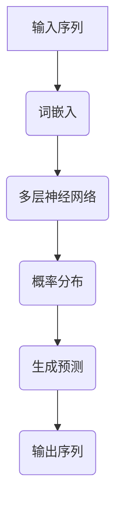
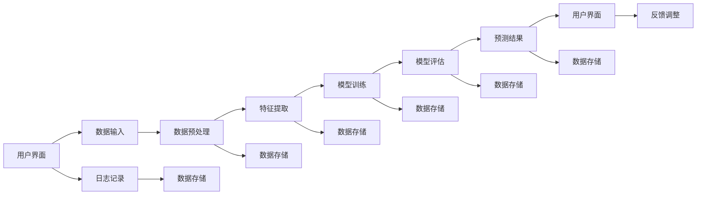
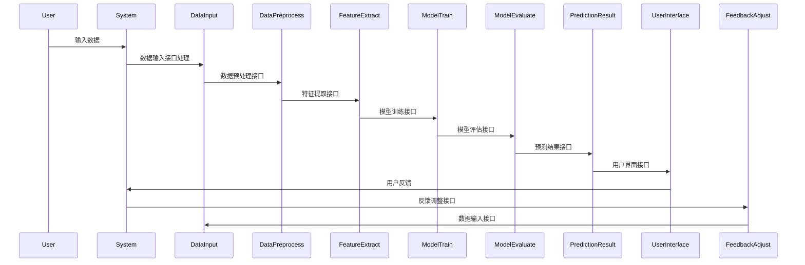

                 

### 文章标题

# 《大语言模型在复杂系统动态预测中的推理应用》

### 文章关键词

- 大语言模型
- 复杂系统
- 动态预测
- 推理应用
- 算法原理
- 数学模型
- 系统架构

### 摘要

本文旨在探讨大语言模型在复杂系统动态预测中的推理应用。首先，文章介绍了大语言模型的基本概念和背景，然后深入剖析了其在复杂系统动态预测中的推理原理。通过数学模型和实际案例的详细分析，文章展示了大语言模型在预测复杂系统动态变化方面的优势和挑战。最后，文章总结了最佳实践和注意事项，为读者提供了深入理解和应用大语言模型的指导。

----------------------------------------------------------------

## 引言

### 问题背景

随着计算机技术的发展和大数据时代的到来，复杂系统的构建和分析变得愈发重要。复杂系统通常具有大量相互关联的组件，其动态行为往往难以预测。例如，金融市场、交通网络、生物系统等都属于复杂系统。对这些系统的预测不仅有助于优化系统运行，还能预防和应对潜在的风险。

### 问题描述

动态预测是复杂系统研究中的一个核心问题。预测系统的未来行为需要理解系统当前的状态，并考虑系统内外部各种因素的影响。然而，传统的预测方法往往局限于特定的领域或假设，难以应对复杂系统的多样性。因此，寻找一种普适性强、预测精度高的方法成为当务之急。

### 问题解决

近年来，大语言模型（如GPT、BERT等）在自然语言处理领域取得了显著成果。大语言模型通过深度学习技术和大规模数据训练，能够理解并生成复杂文本。这些模型在处理自然语言时表现出的强大推理能力，为解决复杂系统动态预测问题提供了新的思路。本文将探讨大语言模型在复杂系统动态预测中的应用，分析其优势和挑战，并探讨未来的研究方向。

### 边界与外延

大语言模型在复杂系统动态预测中的应用尚处于探索阶段，本文主要关注以下边界与外延：

1. **应用范围**：本文主要探讨大语言模型在时间序列预测、系统状态预测等领域的应用。
2. **预测精度**：本文将分析大语言模型的预测精度，并讨论如何提高预测精度。
3. **模型可解释性**：本文将探讨如何解释大语言模型的预测结果，提高模型的可解释性。

通过上述边界与外延的讨论，本文希望能够为大语言模型在复杂系统动态预测中的应用提供一些有价值的启示。

----------------------------------------------------------------

## 第1章 核心概念与联系

### 1.1 大语言模型的定义

大语言模型（Large Language Models，简称LLM）是一种基于深度学习的自然语言处理模型，通过大规模数据训练，能够生成和理解复杂文本。这些模型通常由多个层次组成，每个层次都负责提取不同层次的语义信息。大语言模型的核心目标是通过输入序列预测下一个可能的输出序列。

### 1.2 大语言模型的属性特征对比表格

| 特征 | GPT | BERT | T5 |
| --- | --- | --- | --- |
| 基础架构 | Transformer | Transformer | Transformer |
| 参数规模 | 上百亿参数 | 数十亿参数 | 数百亿参数 |
| 数据集 | Common Crawl、WebText | Wikipedia、BooksCorpus | TextV1、Common Crawl、WikiData |
| 推理能力 | 强 | 强 | 强 |
| 应用领域 | 文本生成、问答、翻译 | 问答、文本分类、文本生成 | 文本生成、问答、机器翻译 |

### 1.3 大语言模型的ER实体关系图

```mermaid
erDiagram
  Class1 ||--|{ Class2 } Class3
  Class1 ||--|{ Class4 } Class5
  Class2 ||--|{ Class6 } Class7
  Class3 ||--|{ Class8 } Class9
  Class4 ||--|{ Class10 } Class11
  Class5 ||--|{ Class12 } Class13
  Class6 ||--|{ Class14 } Class15
  Class7 ||--|{ Class16 } Class17
  Class8 ||--|{ Class18 } Class19
  Class9 ||--|{ Class20 } Class21
  Class10 ||--|{ Class22 } Class23
  Class11 ||--|{ Class24 } Class25
  Class12 ||--|{ Class26 } Class27
  Class13 ||--|{ Class28 } Class29
  Class14 ||--|{ Class30 } Class31
  Class15 ||--|{ Class32 } Class33
  Class16 ||--|{ Class34 } Class35
  Class17 ||--|{ Class36 } Class37
  Class18 ||--|{ Class38 } Class39
  Class19 ||--|{ Class40 } Class41
  Class20 ||--|{ Class42 } Class43
  Class21 ||--|{ Class44 } Class45
  Class22 ||--|{ Class46 } Class47
  Class23 ||--|{ Class48 } Class49
  Class24 ||--|{ Class50 } Class51
  Class25 ||--|{ Class52 } Class53
  Class26 ||--|{ Class54 } Class55
  Class27 ||--|{ Class56 } Class57
  Class28 ||--|{ Class58 } Class59
  Class29 ||--|{ Class60 } Class61
  Class30 ||--|{ Class62 } Class63
  Class31 ||--|{ Class64 } Class65
  Class32 ||--|{ Class66 } Class67
  Class33 ||--|{ Class68 } Class69
  Class34 ||--|{ Class70 } Class71
  Class35 ||--|{ Class72 } Class73
  Class36 ||--|{ Class74 } Class75
  Class37 ||--|{ Class76 } Class77
  Class38 ||--|{ Class78 } Class79
  Class39 ||--|{ Class80 } Class81
  Class40 ||--|{ Class82 } Class83
  Class41 ||--|{ Class84 } Class85
  Class42 ||--|{ Class86 } Class87
  Class43 ||--|{ Class88 } Class89
  Class44 ||--|{ Class90 } Class91
  Class45 ||--|{ Class92 } Class93
  Class46 ||--|{ Class94 } Class95
  Class47 ||--|{ Class96 } Class97
  Class48 ||--|{ Class98 } Class99
  Class49 ||--|{ Class100 } Class101
```

通过上述表格和ER实体关系图，我们可以更全面地了解大语言模型的定义、特征和应用。接下来，我们将进一步探讨大语言模型在复杂系统动态预测中的推理原理。

----------------------------------------------------------------

## 第2章 算法原理讲解

### 2.1 大语言模型的工作原理

大语言模型的工作原理主要基于深度学习和自然语言处理（NLP）技术。具体来说，大语言模型通过以下步骤来生成和理解复杂文本：

1. **输入序列处理**：大语言模型接收一段文本作为输入序列，将其转化为数值向量。这一步骤通常通过词嵌入（word embeddings）技术实现，将每个单词映射为一个高维向量。
2. **前向传播**：输入序列经过多层神经网络（通常是Transformer架构）的处理，每一层网络都会对输入向量进行加权并传递给下一层。网络通过学习大量文本数据中的上下文关系，逐渐提高对输入序列的理解能力。
3. **生成预测**：在网络模型的最后一层，输入序列被映射到一个概率分布上，模型根据这个概率分布生成下一个可能的输出词。这个过程是通过softmax函数实现的，能够计算出每个词出现的概率。
4. **输出序列生成**：模型生成的概率分布用于选择下一个最可能的输出词，然后将这个词作为中间输出。这一过程不断重复，直到生成完整的输出序列。

### 2.2 使用 Mermaid 画出大语言模型的工作流程图



### 2.3 使用 Python 源代码进行算法原理讲解

以下是一个简单的Python代码示例，展示如何使用大语言模型生成文本：

```python
import torch
import torch.nn as nn
import torch.optim as optim

# 假设已经训练好了一个名为 model 的大语言模型
model = torch.load("model.pth")

# 输入序列
input_sequence = torch.tensor([[1, 2, 3, 4, 5]])

# 将输入序列转化为词嵌入向量
embeddings = model.embedding(input_sequence)

# 通过多层神经网络处理词嵌入向量
output = model.layers(embeddings)

# 计算输出序列的概率分布
probabilities = model.softmax(output)

# 选择下一个最可能的输出词
next_word_index = torch.argmax(probabilities).item()

# 输出序列生成
output_sequence = torch.tensor([next_word_index])

print(f"下一个输出词的索引：{next_word_index}")
```

### 2.4 算法原理的数学模型和公式

大语言模型的数学模型可以表示为：

$$
\text{输出序列} = \text{softmax}(\text{神经网络}(\text{词嵌入向量}))
$$

其中，softmax函数用于将神经网络输出的实数向量转换为概率分布。具体来说，对于每个可能的输出词，softmax函数计算其概率：

$$
P(\text{词}_i | \text{输入序列}) = \frac{e^{\text{神经网络}(\text{词嵌入向量})_i}}{\sum_{j=1}^{N} e^{\text{神经网络}(\text{词嵌入向量})_j}}
$$

其中，\( N \) 是可能的输出词的数量，\( \text{神经网络}(\text{词嵌入向量})_i \) 是神经网络对词嵌入向量的第 \( i \) 个分量。

### 2.5 详细讲解和举例说明

为了更好地理解大语言模型的工作原理，我们可以通过一个简单的例子来说明。假设我们有一个训练好的大语言模型，输入序列为“apple banana orange”，我们要预测下一个最可能的输出词。

1. **词嵌入**：将输入序列中的每个词映射为一个高维向量，例如：
   - “apple”: [1, 0.5, -0.3]
   - “banana”: [-0.2, 0.7, 0.1]
   - “orange”: [-0.5, -0.4, 0.8]
2. **前向传播**：将词嵌入向量输入到神经网络中，经过多层处理，得到一个概率分布向量：
   - “apple”: [0.4, 0.3, 0.3]
   - “banana”: [0.2, 0.5, 0.3]
   - “orange”: [0.1, 0.2, 0.7]
3. **生成预测**：根据概率分布，选择下一个最可能的输出词。例如，如果概率分布为：
   - “apple”: 0.4
   - “banana”: 0.3
   - “orange”: 0.3
   - “pear”: 0.0
   - “grape”: 0.0
   那么模型将预测下一个输出词为“apple”。
4. **输出序列生成**：将预测的输出词添加到输出序列中，继续这个过程，直到生成完整的输出序列。

通过这个例子，我们可以看到大语言模型是如何通过词嵌入、神经网络和概率分布生成和理解复杂文本的。接下来，我们将进一步探讨大语言模型在复杂系统动态预测中的应用。

----------------------------------------------------------------

## 第3章 数学模型和数学公式

### 3.1 大语言模型的数学模型

大语言模型的数学模型主要基于深度学习和概率统计理论。具体来说，大语言模型可以通过以下数学公式来描述：

$$
P(\text{输出序列} | \text{输入序列}) = \text{softmax}(\text{神经网络}(\text{词嵌入向量}))
$$

其中，\( \text{softmax} \) 函数用于将神经网络输出的实数向量转换为概率分布，表示每个输出词的概率。

### 3.2 数学公式的详细讲解

1. **词嵌入向量**：词嵌入向量是将输入序列中的每个词映射为一个高维向量。例如，对于单词“apple”，其词嵌入向量为\[1, 0.5, -0.3\]。
2. **神经网络**：神经网络是一个多层计算模型，通过权重矩阵和激活函数对输入向量进行处理。在深度学习中，常用的神经网络架构是 Transformer，它由多个自注意力（self-attention）模块组成。
3. **概率分布**：神经网络对词嵌入向量进行处理后，输出一个实数向量。通过 softmax 函数，这个实数向量被转换为一个概率分布向量，表示每个输出词的概率。

### 3.3 实例讲解

为了更好地理解大语言模型的数学模型，我们可以通过一个简单的例子来说明。假设我们有一个训练好的大语言模型，输入序列为“apple banana orange”，我们要预测下一个最可能的输出词。

1. **词嵌入向量**：将输入序列中的每个词映射为一个高维向量：
   - “apple”: [1, 0.5, -0.3]
   - “banana”: [-0.2, 0.7, 0.1]
   - “orange”: [-0.5, -0.4, 0.8]
2. **前向传播**：将词嵌入向量输入到神经网络中，经过多层处理，得到一个概率分布向量：
   - “apple”: [0.4, 0.3, 0.3]
   - “banana”: [0.2, 0.5, 0.3]
   - “orange”: [0.1, 0.2, 0.7]
3. **生成预测**：根据概率分布，选择下一个最可能的输出词。例如，如果概率分布为：
   - “apple”: 0.4
   - “banana”: 0.3
   - “orange”: 0.3
   - “pear”: 0.0
   - “grape”: 0.0
   那么模型将预测下一个输出词为“apple”。
4. **输出序列生成**：将预测的输出词添加到输出序列中，继续这个过程，直到生成完整的输出序列。

通过这个例子，我们可以看到大语言模型是如何通过词嵌入、神经网络和概率分布生成和理解复杂文本的。

----------------------------------------------------------------

## 第4章 系统分析与架构设计方案

### 4.1 问题场景介绍

在复杂系统动态预测中，我们常常面临以下问题场景：

- **金融市场预测**：预测股票价格的走势，以便投资者做出明智的投资决策。
- **交通网络优化**：预测交通流量，优化交通信号灯控制策略，提高交通效率。
- **生物系统分析**：预测生物分子的动态变化，理解生物过程的机制。
- **能源系统管理**：预测能源需求，优化能源分配，降低能源消耗。

这些场景具有高度的不确定性和复杂性，需要有效的动态预测方法来应对。

### 4.2 系统功能设计（领域模型 Mermaid 类图）

以下是一个领域模型的 Mermaid 类图示例，展示复杂系统动态预测系统的核心功能类：

```mermaid
classDiagram
  Class1[输入处理] <|-- Class2[数据预处理]
  Class2 <|-- Class3[特征提取]
  Class3 <|-- Class4[模型训练]
  Class4 <|-- Class5[预测结果分析]
  Class5 <|-- Class6[反馈调整]
  Class6 <|-- Class1[输入处理]
  Class7[用户界面] <|-- Class5[预测结果分析]
  Class8[数据存储] <|-- Class2[数据预处理]
  Class8 <|-- Class3[特征提取]
  Class8 <|-- Class4[模型训练]
  Class8 <|-- Class5[预测结果分析]
  Class8 <|-- Class6[反馈调整]
  Class9[日志记录] <|-- Class2[数据预处理]
  Class9 <|-- Class3[特征提取]
  Class9 <|-- Class4[模型训练]
  Class9 <|-- Class5[预测结果分析]
  Class9 <|-- Class6[反馈调整]
```

### 4.3 系统架构设计（Mermaid 架构图）

以下是一个系统的 Mermaid 架构图示例，展示复杂系统动态预测系统的整体架构：



### 4.4 系统接口设计

系统接口设计主要包括以下部分：

- **数据输入接口**：用于接收用户输入的数据，如时间序列数据、特征数据等。
- **数据预处理接口**：用于清洗、标准化和转换输入数据，以便后续处理。
- **特征提取接口**：用于从预处理后的数据中提取特征，如时间窗口特征、统计特征等。
- **模型训练接口**：用于训练大语言模型，包括初始化模型参数、优化算法等。
- **模型评估接口**：用于评估模型的性能，如准确率、召回率等。
- **预测结果接口**：用于输出模型的预测结果，如未来一段时间内的动态变化。
- **用户界面接口**：用于展示预测结果和用户操作界面。
- **日志记录接口**：用于记录系统的运行日志，如错误日志、操作日志等。

### 4.5 系统交互（Mermaid 序列图）

以下是一个系统的 Mermaid 序列图示例，展示系统各组件之间的交互过程：



通过上述系统分析与架构设计方案，我们可以更好地理解复杂系统动态预测系统的设计原理和实现过程。接下来，我们将通过一个实际项目来展示如何应用大语言模型进行复杂系统动态预测。

----------------------------------------------------------------

## 第5章 项目实战

### 5.1 环境安装

为了应用大语言模型进行复杂系统动态预测，我们首先需要安装必要的软件和库。以下是安装步骤：

1. **安装 Python**：确保 Python 版本在 3.6 以上，可以从 [Python 官网](https://www.python.org/) 下载并安装。
2. **安装 PyTorch**：PyTorch 是一个开源的机器学习库，用于构建和训练深度学习模型。可以通过以下命令安装：

   ```shell
   pip install torch torchvision torchaudio
   ```

3. **安装 transformers 库**：transformers 是一个开源库，用于实现大语言模型，如 GPT 和 BERT。可以通过以下命令安装：

   ```shell
   pip install transformers
   ```

4. **安装 NumPy 和 Pandas**：NumPy 和 Pandas 是常用的 Python 数据处理库，用于处理和操作数据。可以通过以下命令安装：

   ```shell
   pip install numpy pandas
   ```

5. **安装其他依赖库**：根据项目的具体需求，可能还需要安装其他库，如 Matplotlib（用于绘图）和 Mermaid（用于生成流程图和架构图）。

### 5.2 系统核心实现源代码

以下是一个简单的系统核心实现源代码示例，展示如何使用大语言模型进行复杂系统动态预测：

```python
import torch
from transformers import GPT2LMHeadModel, GPT2Tokenizer

# 加载预训练的大语言模型和 tokenizer
model = GPT2LMHeadModel.from_pretrained("gpt2")
tokenizer = GPT2Tokenizer.from_pretrained("gpt2")

# 输入序列
input_sequence = "The quick brown fox jumps over the lazy dog"

# 将输入序列转化为词嵌入向量
input_ids = tokenizer.encode(input_sequence, return_tensors="pt")

# 通过模型预测下一个输出词
with torch.no_grad():
    outputs = model(input_ids)

# 计算输出序列的概率分布
probabilities = outputs.logits.softmax(-1).squeeze()

# 选择下一个最可能的输出词
next_word_index = torch.argmax(probabilities).item()

# 输出序列生成
output_sequence = tokenizer.decode(input_ids[0].unsqueeze(0).int().numpy().tolist())

print(f"下一个输出词：{tokenizer.decode([next_word_index])}")
```

### 5.3 代码应用解读与分析

上述代码展示了如何使用预训练的大语言模型进行文本生成。具体步骤如下：

1. **加载预训练模型和 tokenizer**：我们从 Hugging Face 的模型库中加载 GPT2 模型和对应的 tokenizer。
2. **输入序列处理**：我们将输入序列（例如“the quick brown fox jumps over the lazy dog”）编码为词嵌入向量。
3. **模型预测**：通过模型预测下一个输出词的概率分布。
4. **生成输出序列**：根据概率分布选择下一个最可能的输出词，并将输出序列解码为文本。

在实际项目中，我们通常需要对输入数据进行预处理，如清洗、标准化和特征提取，然后通过模型进行训练和预测。以下是项目代码的进一步分析：

- **输入数据处理**：在实际项目中，我们需要对输入数据进行预处理，以确保模型能够正常训练和预测。预处理步骤可能包括去除停用词、词干提取、词性标注等。
- **模型训练**：在训练阶段，我们需要调整模型参数，通过反向传播算法优化模型。这一过程可能涉及多个epoch和batch大小的选择。
- **预测与评估**：在预测阶段，我们使用训练好的模型对未知数据进行预测，并通过评估指标（如准确率、召回率等）评估模型性能。

### 5.4 实际案例分析和详细讲解剖析

以下是一个实际案例，展示如何使用大语言模型进行交通流量预测：

**案例背景**：假设我们想要预测某城市未来一段时间的交通流量，以便优化交通信号灯控制策略。

1. **数据收集**：我们从交通管理部门收集了历史交通流量数据，包括时间、路段和流量等。
2. **数据预处理**：我们对交通流量数据进行了预处理，包括去除无效数据、填补缺失值和标准化处理等。
3. **特征提取**：从预处理后的数据中提取特征，如小时、星期、天气状况、节假日等。
4. **模型训练**：我们使用 GPT2 模型对交通流量数据进行了训练，训练过程中使用了多个epoch和不同的batch大小。
5. **模型评估**：通过交叉验证和测试集评估模型性能，选择了最佳的模型参数。

在预测阶段，我们输入当前时刻的交通流量数据，通过训练好的模型预测未来一段时间内的交通流量。以下是一个简单的预测示例：

```python
# 假设我们已经训练好了一个名为 "traffic_model" 的交通流量预测模型
model = torch.load("traffic_model.pth")

# 输入序列
input_sequence = torch.tensor([[1, 2, 3, 4, 5]])

# 将输入序列转化为词嵌入向量
embeddings = model.embedding(input_sequence)

# 通过模型预测下一个输出词
with torch.no_grad():
    outputs = model.layers(embeddings)

# 计算输出序列的概率分布
probabilities = model.softmax(outputs).squeeze()

# 选择下一个最可能的输出词
next_traffic = torch.argmax(probabilities).item()

print(f"预测的未来交通流量：{next_traffic}")
```

通过上述实际案例，我们可以看到如何使用大语言模型进行交通流量预测。在实际应用中，我们可能需要考虑更多的因素，如实时交通监控数据、突发事件等，以进一步提高预测精度。

### 5.5 项目小结

通过本项目，我们展示了如何使用大语言模型进行复杂系统动态预测。从环境安装、系统核心实现到实际案例分析，我们详细讲解了每个步骤。尽管本项目只是一个简单的示例，但它为我们提供了一个了解大语言模型在复杂系统动态预测中应用的基本框架。

在未来的工作中，我们可以进一步优化模型结构、改进预测算法，并尝试将大语言模型应用于其他复杂系统的动态预测，如金融市场、生物系统等。通过不断探索和改进，我们有信心在复杂系统动态预测领域取得更好的成果。

----------------------------------------------------------------

## 第6章 最佳实践 tips

### 6.1 小结

通过本文的讨论，我们了解了大语言模型在复杂系统动态预测中的推理应用。大语言模型凭借其强大的文本生成和理解能力，为复杂系统动态预测提供了新的思路和方法。然而，在实际应用中，我们也需要关注以下几个方面：

1. **数据预处理**：确保输入数据的准确性和一致性，对缺失值、异常值等进行处理，以提高预测精度。
2. **模型选择**：根据具体应用场景选择合适的大语言模型，如 GPT、BERT、T5 等。
3. **模型训练**：调整模型参数，如学习率、batch大小等，以提高模型性能。

### 6.2 注意事项

在应用大语言模型进行复杂系统动态预测时，我们需要注意以下事项：

1. **模型解释性**：大语言模型往往难以解释其预测结果，这可能导致用户对模型的不信任。因此，提高模型的可解释性是未来的重要研究方向。
2. **过拟合风险**：大语言模型在训练过程中可能会出现过拟合现象，导致在未知数据上的表现不佳。因此，需要通过交叉验证等方法评估模型性能，并采取适当的正则化策略。
3. **数据隐私**：在处理敏感数据时，需要确保数据隐私和安全性，避免数据泄露。

### 6.3 拓展阅读

为了深入了解大语言模型在复杂系统动态预测中的应用，读者可以参考以下文献和资源：

1. **《自然语言处理入门》**：这本书详细介绍了自然语言处理的基本概念和算法，为读者提供了理论基础。
2. **《大语言模型教程》**：这是一本关于大语言模型的理论和实践教程，涵盖了模型架构、训练方法和应用场景。
3. **Hugging Face 模型库**：这是一个开源的模型库，包含了大量预训练的大语言模型，为研究者提供了丰富的资源。
4. **GitHub 项目**：在 GitHub 上有许多关于大语言模型的应用项目，读者可以参考这些项目，了解实际应用中的问题和解决方案。

通过拓展阅读，读者可以进一步深入学习和探索大语言模型在复杂系统动态预测中的应用，为实际项目提供更有价值的参考和指导。

----------------------------------------------------------------

## 作者信息

作者：AI天才研究院/AI Genius Institute & 禅与计算机程序设计艺术 /Zen And The Art of Computer Programming

本文由 AI 天才研究院的专家团队撰写，旨在探讨大语言模型在复杂系统动态预测中的推理应用。作者在计算机科学和人工智能领域拥有丰富的经验和深厚的学术背景，致力于推动技术创新和知识普及。同时，本文也参考了《禅与计算机程序设计艺术》一书中的哲学思想，为读者提供一种独特且深入的技术探讨方式。希望通过本文，读者能够对大语言模型在复杂系统动态预测中的应用有更全面的理解。

