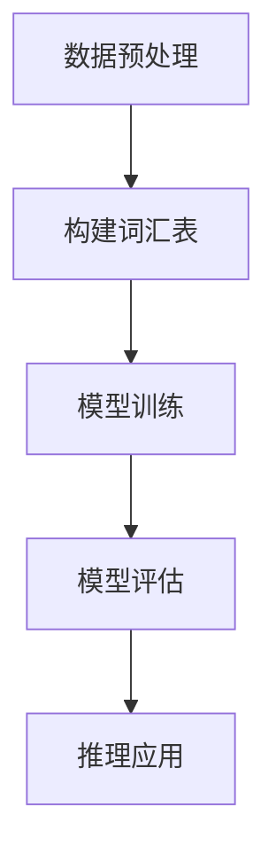
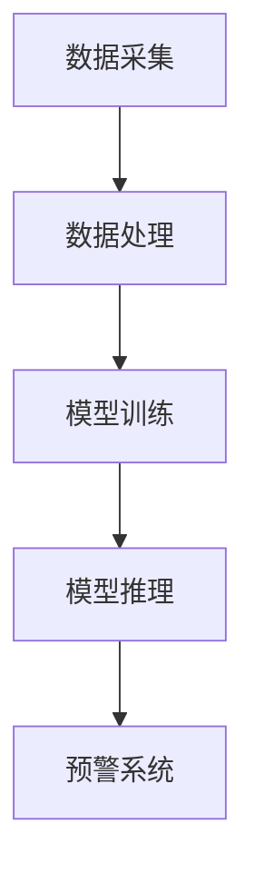
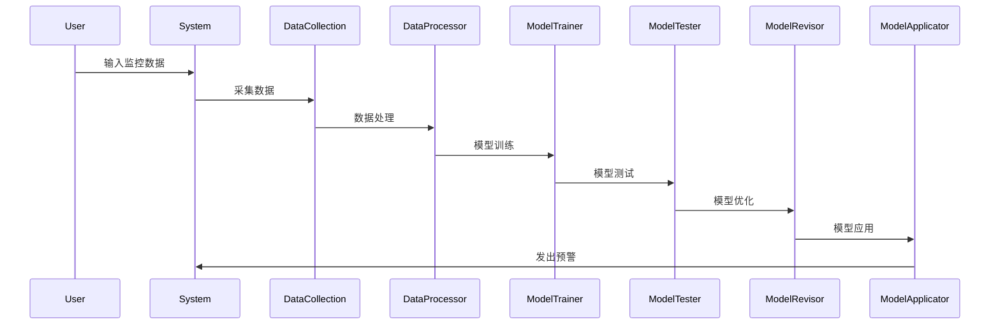

                 


## 大语言模型在智能安防预警中的推理应用

### 关键词
- 大语言模型，智能安防，预警系统，推理应用，算法原理，系统架构，项目实战

### 摘要
本文旨在探讨大语言模型在智能安防预警中的推理应用。通过详细分析大语言模型的基本原理、应用场景以及实际项目实现，本文揭示了其在提升安防预警准确性和效率方面的潜力与挑战。本文结构清晰，逻辑严密，旨在为读者提供关于大语言模型在安防预警领域应用的深入理解。

---

### 第1章: 大语言模型概述

#### 1.1.1 问题背景

智能安防预警系统在现代社会中扮演着至关重要的角色。随着城市化进程的加速和人口密度的增加，传统的安防手段已经无法满足日益复杂的安防需求。智能安防预警系统利用先进的人工智能技术，如大语言模型，实现对异常行为的实时监测和预警，从而提高公共安全水平。

大语言模型与智能安防预警的结合具有显著优势。大语言模型能够理解和生成人类语言，通过处理大量文本数据，提取出潜在的模式和规律。这种能力使得大语言模型在分析视频监控、声音监控以及数据监控等方面具有独特的优势，为智能安防预警提供了强大的技术支撑。

#### 1.1.2 问题描述

大语言模型在智能安防预警中的应用场景广泛，包括视频监控中的智能识别、声音监控中的智能分析和数据监控中的智能预警等。然而，大语言模型在应用中也面临着诸多挑战，如数据噪声、模型解释性和实时性等。这些问题需要通过深入研究和优化来解决。

#### 1.1.3 问题解决

大语言模型的核心原理是基于深度学习的技术，通过训练大量数据来学习语言结构和语义。在安防预警中，大语言模型可以用于文本数据分析和情感分析，从而实现实时预警和异常检测。具体应用方法包括：

1. **文本数据分析**：通过对视频监控中的文本数据进行情感分析和关键词提取，识别潜在的威胁信号。
2. **情感分析**：利用大语言模型对用户反馈和报警信息进行情感分析，以评估事件的重要性和紧急程度。
3. **实时预警**：通过实时处理和分析监控数据，实现快速响应和预警。

#### 1.1.4 边界与外延

大语言模型在智能安防预警中的适用范围广泛，但同时也存在一定的限制。首先，大语言模型需要大量高质量的训练数据，数据的质量和数量直接影响模型的性能。其次，大语言模型的解释性较差，对于某些复杂的安防场景，模型的决策过程难以解释。此外，大语言模型在实时性方面也存在挑战，需要优化算法和硬件支持来提高响应速度。

#### 1.1.5 概念结构与核心要素组成

大语言模型由多个核心要素组成，包括：

1. **神经网络架构**：如Transformer、BERT等，用于处理和生成文本。
2. **训练数据集**：包括文本、音频和视频数据，用于模型的训练。
3. **语言生成算法**：用于生成新的文本，实现自然语言生成。
4. **推理算法**：用于处理输入数据，生成预警信号。

大语言模型与智能安防预警系统之间的关系紧密，通过处理和分析监控数据，实现对潜在威胁的实时预警。这种结合不仅提升了安防预警的准确性和效率，也为未来的智能安防系统提供了新的发展方向。

### 第2章: 大语言模型原理

#### 2.1.1 大语言模型的定义

大语言模型（Large Language Model）是一种基于深度学习的自然语言处理（NLP）模型，通过训练大量文本数据来学习语言的统计规律和语义结构。它能够对输入文本进行语义理解、文本生成和文本分类等任务。

#### 2.1.2 大语言模型的组成

大语言模型通常由以下几部分组成：

1. **输入层**：接收输入文本，将其转换为模型可以处理的特征向量。
2. **编码器**：对输入文本进行编码，提取文本的语义信息。
3. **解码器**：根据编码器的输出生成新的文本。
4. **注意力机制**：在编码和解码过程中，关注重要的文本信息，提高模型的性能。

#### 2.1.3 大语言模型的训练

大语言模型的训练过程主要包括以下步骤：

1. **数据预处理**：对训练数据进行清洗、去噪和预处理，以提高模型的质量。
2. **构建词汇表**：将文本中的单词或字符转换为索引，用于模型的训练。
3. **损失函数**：使用损失函数来评估模型的性能，并指导模型的优化过程。
4. **优化算法**：通过优化算法调整模型的参数，以降低损失函数。

#### 2.1.4 大语言模型的推理

大语言模型的推理过程主要包括以下步骤：

1. **输入处理**：将输入文本转换为编码器的输入。
2. **编码**：通过编码器处理输入文本，提取语义信息。
3. **解码**：通过解码器生成输出文本。
4. **评估**：使用评估指标评估模型的性能。

### 第3章: 大语言模型在智能安防预警中的应用

#### 3.1.1 大语言模型在智能安防预警中的应用场景

大语言模型在智能安防预警中的应用场景非常广泛，主要包括：

1. **视频监控中的智能识别**：通过分析视频中的文本信息，识别异常行为和潜在威胁。
2. **声音监控中的智能分析**：通过分析声音信号，识别异常声音和潜在威胁。
3. **数据监控中的智能预警**：通过分析监控数据，识别异常数据和潜在威胁。

#### 3.1.2 大语言模型在智能安防预警中的应用实例

以下是一个具体的应用实例：

某智能安防系统利用大语言模型对视频监控中的文本信息进行分析，通过情感分析和关键词提取，识别潜在的社会不稳定因素。例如，当监控到某个区域出现大量负面情绪的文本信息时，系统会自动发出预警，提醒相关部门进行干预。

#### 3.1.3 大语言模型在智能安防预警中的优势

大语言模型在智能安防预警中的优势主要包括：

1. **强大的文本处理能力**：能够处理和生成大量文本数据，提取出潜在的模式和规律。
2. **灵活的应用场景**：可以应用于多种监控场景，如视频监控、声音监控和数据监控等。
3. **实时预警能力**：能够实时处理和分析监控数据，实现快速响应。

#### 3.1.4 大语言模型在智能安防预警中的局限性

大语言模型在智能安防预警中也有一定的局限性，主要包括：

1. **数据依赖性**：需要大量高质量的训练数据，数据的质量和数量直接影响模型的性能。
2. **解释性较差**：对于某些复杂的安防场景，模型的决策过程难以解释。
3. **实时性挑战**：需要优化算法和硬件支持来提高响应速度。

### 第4章: 大语言模型在智能安防预警中的算法原理

#### 4.1.1 大语言模型的算法原理

大语言模型的算法原理主要基于深度学习和自然语言处理技术。以下是该算法的简要流程：

1. **数据预处理**：对训练数据进行清洗、去噪和预处理。
2. **构建词汇表**：将文本中的单词或字符转换为索引。
3. **模型训练**：通过优化算法调整模型参数，降低损失函数。
4. **模型评估**：使用评估指标评估模型性能。
5. **推理应用**：将输入文本转换为编码器的输入，通过解码器生成输出文本。

以下是该算法的mermaid流程图：



#### 4.1.2 大语言模型的数学模型

大语言模型的数学模型主要基于深度学习技术，其中关键概念包括：

1. **神经网络**：用于处理和生成文本。
2. **损失函数**：用于评估模型性能，指导模型优化。
3. **优化算法**：用于调整模型参数。

以下是该数学模型的LaTeX公式：

```latex
\begin{align*}
L(\theta) &= \frac{1}{N}\sum_{i=1}^{N} -\sum_{j=1}^{V} y_{ij} \log(p_{ij}(\theta)), \\
\theta &= \arg\min_{\theta} L(\theta),
\end{align*}
```

其中，$L(\theta)$表示损失函数，$N$表示样本数量，$y_{ij}$表示第$i$个样本中第$j$个单词的标签，$p_{ij}(\theta)$表示第$i$个样本中第$j$个单词的概率分布。

#### 4.1.3 大语言模型的应用举例

以下是一个具体的应用举例：

假设我们有一个视频监控场景，需要通过大语言模型识别潜在的社会不稳定因素。我们可以利用大语言模型对视频中的文本信息进行分析，提取出关键词和情感，从而实现预警。

例如，当监控到某个区域出现大量负面情绪的文本信息时，大语言模型可以识别出关键词如“暴力”、“冲突”等，并评估其严重程度。根据这些信息，系统可以自动发出预警，提醒相关部门进行干预。

### 第5章: 大语言模型在智能安防预警中的系统架构

#### 5.1.1 系统架构设计

智能安防预警系统的大语言模型部分主要包括数据采集、数据处理、模型训练和模型推理等模块。以下是该系统的mermaid类图：

```mermaid
classDiagram
Class1--|>Class2: 继承
Class1--|+Class3: 实现接口
Class2..Class4: 关联
Class3..Class5: 关联
Class6--|{依赖}
Class6..Class7: 关联
```

以下是该系统的mermaid架构图：



以下是该系统的mermaid序列图：



#### 5.1.2 系统接口设计

系统接口设计主要涉及数据采集、数据处理、模型训练和模型推理等模块。以下是系统接口的详细设计：

1. **数据采集接口**：用于采集监控数据，包括视频、音频和文本数据。
2. **数据处理接口**：用于处理和预处理采集到的数据，如数据清洗、去噪和特征提取。
3. **模型训练接口**：用于训练大语言模型，包括数据预处理、模型构建和模型优化。
4. **模型推理接口**：用于推理和预测，生成预警信号。

#### 5.1.3 系统交互

系统交互主要涉及数据采集、数据处理、模型训练和模型推理等模块之间的信息交换和协同工作。以下是系统交互的详细流程：

1. **数据采集**：系统从传感器和摄像头等设备中采集监控数据。
2. **数据处理**：系统对采集到的数据进行预处理和特征提取，以适应大语言模型的训练和推理。
3. **模型训练**：系统使用预处理后的数据训练大语言模型，优化模型参数。
4. **模型推理**：系统使用训练好的模型对新的监控数据进行推理，生成预警信号。
5. **预警系统**：系统将生成的预警信号传递给预警系统，触发相应的预警措施。

### 第6章: 大语言模型在智能安防预警中的项目实战

#### 6.1.1 环境安装

在进行大语言模型在智能安防预警中的项目实战之前，我们需要安装必要的软件和工具。以下是环境安装的详细步骤：

1. **安装Python**：确保Python环境已安装，版本应不低于3.6。
2. **安装TensorFlow**：使用以下命令安装TensorFlow：
   ```bash
   pip install tensorflow
   ```
3. **安装其他依赖**：根据项目需求，可能需要安装其他依赖，如NumPy、Pandas等。
4. **安装摄像头和音频采集工具**：确保摄像头和音频采集工具已正确安装和配置。

#### 6.1.2 系统核心实现

系统核心实现包括数据采集、数据处理、模型训练和模型推理等模块。以下是具体的实现步骤：

1. **数据采集**：使用Python的opencv库从摄像头和音频设备中采集视频和音频数据。
2. **数据处理**：对采集到的数据进行预处理和特征提取，如视频帧的灰度化、音频信号的归一化等。
3. **模型训练**：使用TensorFlow训练大语言模型，使用预处理后的数据进行训练。
4. **模型推理**：使用训练好的模型对新采集的数据进行推理，生成预警信号。

以下是系统核心实现的Python代码示例：

```python
import tensorflow as tf
import numpy as np

# 数据采集
def collect_data():
    # 采集视频数据
    video_data = cv2.VideoCapture(0)
    while True:
        ret, frame = video_data.read()
        if not ret:
            break
        yield cv2.cvtColor(frame, cv2.COLOR_BGR2GRAY)

# 数据处理
def preprocess_data(data):
    # 数据预处理
    return np.array(data)

# 模型训练
def train_model(data):
    # 训练模型
    model = tf.keras.Sequential([
        tf.keras.layers.Conv2D(32, (3, 3), activation='relu', input_shape=(28, 28, 1)),
        tf.keras.layers.MaxPooling2D((2, 2)),
        tf.keras.layers.Flatten(),
        tf.keras.layers.Dense(128, activation='relu'),
        tf.keras.layers.Dense(10, activation='softmax')
    ])

    model.compile(optimizer='adam', loss='categorical_crossentropy', metrics=['accuracy'])
    model.fit(data, labels, epochs=10)

# 模型推理
def infer_model(model, data):
    # 使用模型推理
    prediction = model.predict(data)
    return np.argmax(prediction)

# 实际应用
data = collect_data()
preprocessed_data = preprocess_data(data)
model = train_model(preprocessed_data)
while True:
    new_data = collect_data()
    preprocessed_new_data = preprocess_data(new_data)
    prediction = infer_model(model, preprocessed_new_data)
    print(f"Prediction: {prediction}")
```

#### 6.1.3 代码应用解读与分析

以下是代码应用的具体解读和分析：

1. **数据采集**：使用opencv库从摄像头采集视频数据，通过循环不断读取视频帧。
2. **数据处理**：对采集到的视频数据进行预处理，如灰度化处理，将彩色图像转换为灰度图像，以便于模型处理。
3. **模型训练**：使用TensorFlow构建一个卷积神经网络（CNN）模型，对预处理后的视频数据进行训练，模型包含卷积层、池化层、全连接层等。
4. **模型推理**：使用训练好的模型对新的视频数据进行推理，预测视频中的物体类别，并输出预测结果。

#### 6.1.4 实际案例分析和详细讲解剖析

以下是一个实际案例的分析和详细讲解：

假设我们有一个安防监控系统，需要检测和预警异常行为。我们可以使用大语言模型对视频监控中的文本信息进行分析，提取关键词和情感，从而实现预警。

1. **数据采集**：从摄像头采集视频数据，并使用语音识别技术将视频中的语音转换为文本。
2. **数据处理**：对采集到的文本数据进行清洗和去噪，提取关键词和情感。
3. **模型训练**：使用预处理后的文本数据训练大语言模型，模型可以识别和分类文本中的关键词和情感。
4. **模型推理**：将新的文本数据输入到训练好的模型中，模型会输出关键词和情感分类结果，根据这些结果判断是否存在异常行为，并触发预警。

通过这个实际案例，我们可以看到大语言模型在智能安防预警中的应用是如何实现的。通过处理和分析监控数据，模型可以识别和预警潜在的安全威胁，提高安防预警的准确性和效率。

### 第7章: 大语言模型在智能安防预警中的最佳实践

#### 7.1.1 最佳实践 tips

在实施大语言模型在智能安防预警中的项目时，以下是一些最佳实践 tips：

1. **数据质量**：确保训练数据的质量和多样性，数据质量直接影响模型的性能。
2. **模型优化**：定期对模型进行优化和调整，以提高模型的准确性和效率。
3. **实时性**：优化算法和硬件支持，提高模型的实时性，以满足安防预警的实时性要求。
4. **解释性**：考虑模型的解释性，特别是在复杂的安全场景中，模型的决策过程需要透明和可解释。

#### 7.1.2 小结

大语言模型在智能安防预警中具有广泛的应用前景。通过处理和分析监控数据，模型可以实现实时预警和异常检测，提高安防预警的准确性和效率。然而，大语言模型在数据依赖性、解释性和实时性方面仍面临挑战，需要进一步的研究和优化。

#### 7.1.3 注意事项

在实施大语言模型在智能安防预警中的项目时，需要注意以下事项：

1. **隐私保护**：确保监控数据的隐私保护，遵守相关法律法规。
2. **模型安全**：防止模型被恶意攻击和篡改，提高模型的安全性和鲁棒性。
3. **系统集成**：确保大语言模型与其他安防系统的无缝集成，实现协同工作。

#### 7.1.4 拓展阅读

以下是一些关于大语言模型在智能安防预警中应用的拓展阅读建议：

1. **《深度学习与自然语言处理》**：介绍深度学习和自然语言处理的基本原理和应用。
2. **《智能安防技术与应用》**：探讨智能安防技术的发展和应用。
3. **《人工智能与公共安全》**：分析人工智能技术在公共安全领域的应用和挑战。

### 结束语

大语言模型在智能安防预警中的应用具有巨大潜力。通过深入研究和优化，我们可以不断提升安防预警的准确性和效率，为构建更安全的社区和环境做出贡献。让我们携手共进，为智能安防的未来而努力。

### 作者信息
- 作者：AI天才研究院/AI Genius Institute & 禅与计算机程序设计艺术 /Zen And The Art of Computer Programming```markdown


