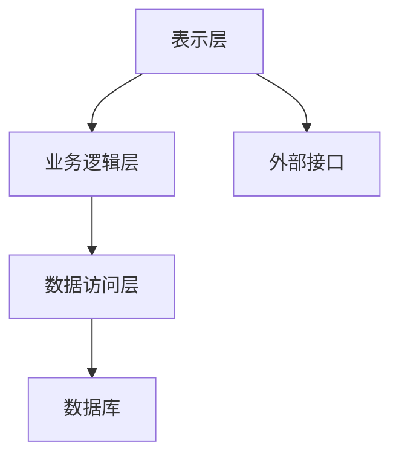

                 

# 如何写出一份优秀的系统分析文档

> 关键词：系统分析文档、结构设计、需求分析、功能设计、架构设计、接口设计、交互设计、文档评审

> 摘要：系统分析文档是软件开发过程中至关重要的一环，它不仅为开发团队提供了明确的指导，还为后续的维护和升级奠定了基础。本文旨在介绍如何撰写一份优秀的系统分析文档，通过详细剖析文档的构成要素、编写规范和最佳实践，帮助开发者提高文档的质量和可读性。

## 目录大纲

1. **第一部分：核心概念与背景介绍**
   - 第1章：问题背景与核心概念
     - 1.1.1 问题背景
     - 1.1.2 核心概念
     - 1.1.3 概念关系图
2. **第二部分：优秀系统分析文档的构成要素**
   - 第2章：系统需求分析
     - 2.1.1 需求收集
     - 2.1.2 需求分类与优先级
     - 2.1.3 需求文档编写规范
   - 第3章：系统功能设计
     - 3.1.1 功能需求分析
     - 3.1.2 功能设计与实现
     - 3.1.3 功能文档编写规范
   - 第4章：系统架构设计
     - 4.1.1 系统架构设计原则
     - 4.1.2 系统架构图
     - 4.1.3 系统模块介绍
   - 第5章：系统接口设计与交互
     - 5.1.1 系统接口设计
     - 5.1.2 系统交互设计
     - 5.1.3 系统接口文档编写规范
   - 第6章：文档评审与优化
     - 6.1.1 文档评审流程
     - 6.1.2 文档优化
3. **第三部分：最佳实践与总结**
   - 第7章：优秀系统分析文档案例分析
     - 7.1.1 案例介绍
     - 7.1.2 案例分析
     - 7.1.3 案例总结
   - 第8章：最佳实践
     - 8.1.1 实践技巧
     - 8.1.2 实践案例
   - 第9章：小结与展望
     - 9.1.1 小结
     - 9.1.2 展望

### 第一部分：核心概念与背景介绍

#### 第1章：问题背景与核心概念

##### 1.1.1 问题背景

系统分析文档是软件开发过程中的关键文档之一，它承载了项目需求、设计思路、架构方案等重要信息。随着软件项目的复杂度和规模不断扩大，系统分析文档的重要性愈发凸显。然而，在现实开发过程中，往往存在以下问题：

1. 文档编写不规范，结构混乱，难以阅读。
2. 文档更新不及时，导致开发过程中信息不对称。
3. 文档质量参差不齐，缺乏系统性的分析和设计。
4. 文档评审机制不完善，难以保证文档的准确性和完整性。

##### 1.1.2 核心概念

1. **系统分析**：系统分析是软件开发过程中的一个重要环节，旨在明确系统的功能需求、性能需求、接口需求等，为后续的设计和开发提供基础。
2. **文档**：文档是系统分析过程中产生的文本资料，包括需求文档、设计文档、接口文档等，用于记录系统分析的结果和过程。
3. **优秀的系统分析文档**：优秀的系统分析文档应具备以下特点：
   - 结构清晰，层次分明，便于阅读。
   - 内容完整，覆盖系统的各个层面。
   - 语言简练，逻辑性强，易于理解。
   - 编写规范，格式统一，便于管理和维护。

##### 1.1.3 概念关系图

```mermaid
erDiagram
    SystemAnalysis --> Document : 包含
    SystemAnalysis --> SystemRequirement : 产生
    SystemAnalysis --> SystemDesign : 支持
    SystemAnalysis --> InterfaceDesign : 支持
```

### 第二部分：优秀系统分析文档的构成要素

#### 第2章：系统需求分析

##### 2.1.1 需求收集

系统需求分析的第一步是需求收集，这包括以下几个方面：

1. **用户需求**：通过用户调研、访谈等方式，收集用户对系统的需求。
2. **功能需求**：列出系统需要实现的基本功能，如用户登录、数据查询、报告生成等。
3. **非功能需求**：包括系统的性能、安全性、可靠性等方面的要求。

##### 2.1.2 需求分类与优先级

需求可以分为功能需求和非功能需求，并根据其重要性进行优先级划分。常见的优先级划分为：

1. **高优先级**：直接影响系统核心功能的实现。
2. **中优先级**：对系统的性能和用户体验有一定影响。
3. **低优先级**：对系统的非关键部分进行优化。

##### 2.1.3 需求文档编写规范

需求文档的编写应遵循以下规范：

1. **文档格式**：采用统一的文档模板，确保格式的一致性。
2. **文档内容**：包括需求概述、需求列表、需求属性（如优先级、实现难度等）等。

#### 第3章：系统功能设计

##### 3.1.1 功能需求分析

功能需求分析是对系统所需实现的功能进行详细分析，包括：

1. **功能列表**：列出系统需要实现的所有功能。
2. **功能模块划分**：根据功能需求，将系统划分为不同的功能模块。

##### 3.1.2 功能设计与实现

功能设计与实现包括：

1. **功能流程图**：用图形化的方式描述功能的执行流程。
2. **功能实现细节**：详细描述功能的实现过程，包括算法、数据结构等。

##### 3.1.3 功能文档编写规范

功能文档的编写应遵循以下规范：

1. **文档格式**：采用统一的文档模板，确保格式的一致性。
2. **文档内容**：包括功能概述、功能流程图、功能实现细节等。

#### 第4章：系统架构设计

##### 4.1.1 系统架构设计原则

系统架构设计应遵循以下原则：

1. **分层架构**：将系统分为不同的层次，如表示层、业务逻辑层、数据访问层等。
2. **模块化设计**：将系统划分为多个模块，每个模块负责不同的功能。
3. **系统可扩展性**：设计时应考虑系统的可扩展性，以适应未来需求的变化。

##### 4.1.2 系统架构图



##### 4.1.3 系统模块介绍

系统模块的介绍应包括以下内容：

1. **数据库模块**：描述数据库的架构和设计。
2. **界面模块**：描述用户界面的设计和实现。
3. **控制模块**：描述系统控制逻辑的设计和实现。

#### 第5章：系统接口设计与交互

##### 5.1.1 系统接口设计

系统接口设计包括：

1. **接口定义**：定义系统的接口，包括接口名称、参数、返回值等。
2. **接口调用**：描述系统如何调用外部接口。

##### 5.1.2 系统交互设计

系统交互设计包括：

1. **交互流程图**：用图形化的方式描述系统的交互流程。
2. **交互细节**：详细描述系统交互的细节，包括数据传递、状态转换等。

##### 5.1.3 系统接口文档编写规范

系统接口文档的编写应遵循以下规范：

1. **文档格式**：采用统一的文档模板，确保格式的一致性。
2. **文档内容**：包括接口定义、接口调用、交互流程图等。

#### 第6章：文档评审与优化

##### 6.1.1 文档评审流程

文档评审流程包括：

1. **评审标准**：制定评审标准，确保文档的质量。
2. **评审流程**：明确评审的步骤和责任分工。

##### 6.1.2 文档优化

文档优化包括：

1. **优化方法**：采用有效的优化方法，提高文档的质量。
2. **优化实践**：总结优化实践，为后续的文档编写提供指导。

### 第三部分：最佳实践与总结

#### 第7章：优秀系统分析文档案例分析

##### 7.1.1 案例介绍

- 项目背景：某企业信息管理系统
- 系统分析文档：需求文档、设计文档、接口文档等

##### 7.1.2 案例分析

- 成功经验：需求明确、文档结构清晰、评审机制完善
- 问题与解决：及时更新文档、提高文档可读性、加强评审力度

##### 7.1.3 案例总结

- 教训与启示：注重文档编写规范、完善评审流程、提高文档质量

#### 第8章：最佳实践

##### 8.1.1 实践技巧

- 需求收集：采用多种方式收集需求，确保全面性。
- 功能设计：明确功能模块，提高可维护性。
- 系统架构：遵循设计原则，确保系统可扩展性。
- 接口设计：规范接口定义，提高系统兼容性。
- 文档评审：制定评审标准，确保文档质量。

##### 8.1.2 实践案例

- 成功案例分析：某大型电商平台的系统分析文档。
- 失败案例分析：某小型项目因文档质量低下导致的开发问题。

#### 第9章：小结与展望

##### 9.1.1 小结

- 主要内容回顾：系统分析文档的核心概念、构成要素、案例分析、最佳实践等。
- 核心要点总结：编写规范、评审机制、优化方法等。

##### 9.1.2 展望

- 未来发展趋势：自动化工具的应用、文档与代码的协同等。
- 需要关注的问题：文档更新与版本控制、文档质量评估等。

### 作者信息

- 作者：AI天才研究院/AI Genius Institute & 禅与计算机程序设计艺术 /Zen And The Art of Computer Programming

### 完整性要求

- 背景介绍：核心概念术语说明、问题背景、问题描述、问题解决、边界与外延、概念结构与核心要素组成。
- 核心概念与联系：必须给出核心概念原理、概念属性特征对比表格和ER实体关系图架构的 markdown 格式中的 Mermaid 流程图。
- 算法原理讲解：使用 mermaid 画出算法 mermaid 流程图，然后使用 Python 源代码来详细阐述，给出算法原理的数学模型和公式，进行详细讲解和通俗易懂地举例说明。
- 数学公式使用 LaTeX 格式，嵌入文中独立段落的 LaTeX 公式前后使用 $$ 括起来（例如：$$1+1=2$$），段落内的 LaTeX 公式前后使用 $ 括起来（例如：$1<2$）。
- 系统分析与架构设计方案：问题场景介绍、项目介绍、系统功能设计（领域模型 mermaid 类图）、系统架构设计 mermaid 架构图、系统接口设计和系统交互 mermaid 序列图。
- 项目实战：环境安装、系统核心实现源代码，代码应用解读与分析，实际案例分析和详细讲解剖析，项目小结。
- 最佳实践 tips、小结、注意事项、拓展阅读等内容。

