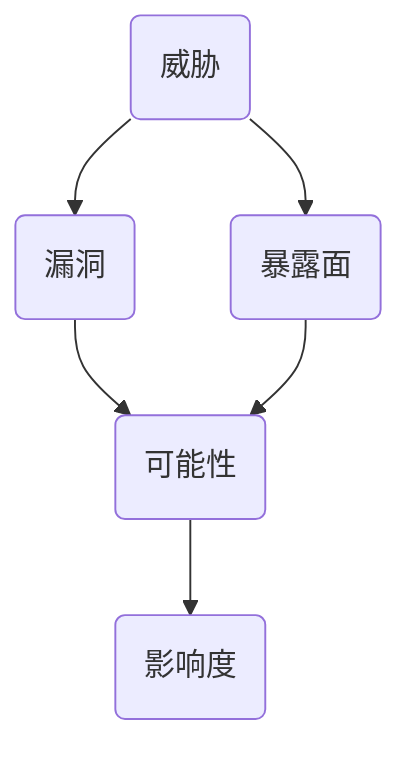

                 

### 威胁建模：系统化识别安全风险的方法

#### 关键词：安全威胁、建模方法、风险识别、信息安全、系统化

##### 摘要：

在数字化时代，信息安全已经成为每个组织关注的核心问题。威胁建模是一种系统化识别安全风险的方法，它有助于组织提前预防和应对潜在的安全威胁。本文将深入探讨威胁建模的基础知识、流程与方法，并分析常见的威胁类型与建模实践，旨在为读者提供一份全面且实用的指南。

## 第一部分：引言

### 1.1 威胁建模概述

在当今复杂的信息技术环境中，信息安全风险无处不在。威胁建模作为一种系统化、结构化的方法，可以帮助组织识别、理解和应对这些风险。它不仅有助于提高组织的整体安全水平，还能够降低潜在的安全事件带来的损失。

#### 1.1.1 问题背景

随着互联网的普及和云计算、大数据、物联网等技术的快速发展，信息系统变得更加复杂和互联互通。这不仅带来了业务创新的机遇，也增加了安全风险。传统的安全措施已经无法满足现代信息系统的需求，威胁建模成为了一种有效的补充手段。

#### 1.1.2 威胁建模的定义

威胁建模是一种分析和识别潜在安全威胁的过程，它涉及到对系统、应用程序、网络和数据的全面评估，以识别可能的安全漏洞和风险。其核心目标是提前识别和预防潜在的安全威胁，从而降低安全事件的发生概率和影响范围。

#### 1.1.3 威胁建模的重要性

威胁建模的重要性体现在以下几个方面：

1. **预防性措施**：通过提前识别潜在威胁，组织可以采取预防措施，避免安全事件的发生。
2. **风险管理**：威胁建模有助于组织更好地理解和管理安全风险，从而制定出更有效的风险管理策略。
3. **合规性**：许多行业标准和法规要求组织进行威胁建模，以确保系统的安全性和合规性。
4. **资源优化**：通过系统化地识别和评估安全风险，组织可以更合理地分配安全资源，提高投资回报率。

### 1.2 安全风险的概念与分类

在威胁建模的过程中，理解安全风险的概念和分类是非常关键的。

#### 1.2.1 安全风险的定义

安全风险是指由于安全漏洞、威胁或攻击可能导致的信息系统的机密性、完整性和可用性受到损害的可能性。它通常由三个要素组成：威胁、漏洞和影响。

#### 1.2.2 安全风险的分类

安全风险可以根据不同的维度进行分类，常见的分类方法包括：

1. **按威胁类型分类**：包括网络攻击、应用程序攻击、物理攻击和恶意软件攻击等。
2. **按行业分类**：不同行业面临的安全风险有所不同，例如金融行业主要关注资金风险，医疗行业主要关注患者隐私和数据保护。
3. **按影响程度分类**：包括高、中、低三种程度的风险，通常根据潜在损失的大小来划分。

#### 1.2.3 安全风险的影响

安全风险的影响可以分为以下几个方面：

1. **经济损失**：安全事件可能导致数据丢失、系统崩溃、业务中断等，从而带来直接的经济损失。
2. **声誉损失**：安全事件可能会损害组织的声誉，影响客户信任和业务合作。
3. **合规性处罚**：违反安全法规可能导致法律诉讼和罚款。
4. **社会影响**：在某些情况下，安全事件可能对社会产生负面影响，例如网络犯罪、恶意软件传播等。

### 1.3 威胁建模的基本原则与方法

进行威胁建模时，需要遵循一些基本原则和方法，以确保建模过程的科学性和有效性。

#### 1.3.1 威胁建模的基本原则

1. **全面性**：威胁建模应该覆盖系统的各个层面，包括硬件、软件、网络和数据等。
2. **动态性**：威胁环境是不断变化的，威胁建模应该是一个持续的过程，需要定期更新和调整。
3. **参与性**：威胁建模需要广泛的参与，包括业务人员、开发人员、安全专家等，以确保从不同角度全面识别威胁。
4. **可操作性**：威胁建模的结果应该具有可操作性，即能够转化为具体的安全措施和策略。

#### 1.3.2 威胁建模的方法

威胁建模的方法可以分为定量和定性两种：

1. **定量威胁建模**：使用数学模型和统计方法来评估威胁的可能性和影响。这种方法通常用于高风险的系统或业务。
2. **定性威胁建模**：通过分析威胁的可能性和影响，结合专家判断来评估风险。这种方法适用于大多数组织和系统。

#### 1.3.3 威胁建模的关键要素

威胁建模需要关注以下几个关键要素：

1. **威胁**：识别系统可能面临的所有威胁。
2. **漏洞**：识别系统中存在的漏洞，这些漏洞可能被威胁利用。
3. **暴露面**：评估系统中的暴露面，即可能被攻击的目标。
4. **可能性**：评估每种威胁被利用的可能性。
5. **影响度**：评估每种威胁可能造成的影响程度。

### 1.4 本书结构安排

本书将分为三个主要部分，分别介绍威胁建模的基础知识、流程与方法，以及常见威胁类型与建模实践。具体章节安排如下：

1. **第一部分：引言**：介绍威胁建模的背景、定义、重要性、概念与分类、基本原则与方法。
2. **第二部分：威胁建模的基础知识**：深入探讨威胁建模的理论基础、常见威胁类型和核心概念。
3. **第三部分：威胁建模的流程与方法**：详细介绍威胁建模的流程、工具和方法，包括定量和定性威胁建模。
4. **第四部分：常见威胁类型与建模实践**：分析常见的威胁类型，介绍实际威胁建模的实践方法和案例。

#### 1.4.1 各章节内容概述

- **引言**：介绍威胁建模的背景和重要性，定义威胁建模的基本概念，介绍本书的结构安排。
- **威胁建模的基础知识**：介绍威胁建模的理论基础，包括信息安全的基本理论、风险管理的理论基础、安全工程的理论基础，以及常见的威胁类型和核心概念。
- **威胁建模的流程与方法**：详细描述威胁建模的流程、方法和关键步骤，包括定量和定性威胁建模的方法和工具。
- **常见威胁类型与建模实践**：分析常见的威胁类型，介绍实际威胁建模的实践方法和案例，包括网络攻击、应用程序攻击、物理攻击和恶意软件攻击等。

#### 1.4.2 阅读建议与目标读者

本书的目标是为读者提供一份全面、实用的威胁建模指南。无论你是安全专业人士、开发人员还是企业决策者，只要对信息安全感兴趣，都可以从本书中受益。

- **安全专业人士**：通过本书，你可以深入了解威胁建模的方法和技术，提高你的安全分析和应对能力。
- **开发人员**：了解威胁建模的基础知识，可以帮助你更好地设计安全的系统架构，预防潜在的安全漏洞。
- **企业决策者**：了解威胁建模的重要性，可以帮助你更好地理解和管理安全风险，制定有效的安全策略。

阅读建议：

- **逐步阅读**：本书的内容涵盖了威胁建模的各个方面，建议读者按照章节顺序逐步阅读，以便更好地理解。
- **实践应用**：本书中包含了多个案例和实践方法，建议读者在阅读过程中尝试实践，加深理解。
- **持续更新**：威胁建模是一个不断发展的领域，建议读者关注最新的威胁趋势和技术，持续更新自己的知识。

通过本书的阅读，你将能够全面了解威胁建模的原理和方法，提升自己在信息安全领域的专业能力。让我们一起开始这段探索之旅吧！### 威胁建模的理论基础

在深入探讨威胁建模的具体方法和实践之前，我们需要了解其背后的理论基础。这些理论基础为我们提供了理解和应用威胁建模的科学框架，包括信息安全的基本理论、风险管理的理论基础和安全工程的理论基础。

#### 2.1 信息安全的基本理论

信息安全是一门研究保护信息免受各种威胁和攻击的学科。其核心理论包括保密性、完整性和可用性。

1. **保密性（Confidentiality）**：确保信息仅对授权用户可见，防止未经授权的访问。这通常通过加密技术实现，例如SSL/TLS协议。
2. **完整性（Integrity）**：确保信息在传输或存储过程中未被篡改，保持信息的原始状态。数字签名和哈希函数是实现完整性的常用手段。
3. **可用性（Availability）**：确保信息系统在需要时可以正常运行，不被恶意行为或故障所干扰。冗余设计和负载均衡是提高可用性的常见方法。

#### 2.2 风险管理的理论基础

风险管理是威胁建模的重要基础。它涉及到识别、评估、监控和应对潜在的风险。以下是风险管理的核心概念：

1. **风险评估（Risk Assessment）**：识别和分析潜在风险，评估其可能性和影响。风险评估通常包括定性分析和定量分析。
2. **风险识别（Risk Identification）**：识别系统可能面临的所有风险，包括内部和外部因素。
3. **风险分析（Risk Analysis）**：分析每种风险的概率和潜在影响，确定优先级。
4. **风险缓解（Risk Mitigation）**：采取措施降低风险的可能性和影响。这些措施可以包括风险转移、风险规避和风险接受。

#### 2.3 安全工程的理论基础

安全工程是将安全考虑融入到系统开发、部署和运营中的过程。其理论基础包括系统安全性和风险评估。

1. **系统安全性（System Security）**：确保系统在设计、实现和运营过程中具有足够的防御能力，能够抵御各种威胁。
2. **安全设计（Secure Design）**：在系统设计阶段，考虑潜在的安全威胁，设计安全机制和策略。
3. **安全测试（Security Testing）**：通过模拟攻击和漏洞扫描，评估系统的安全性和弱点。
4. **安全运营（Security Operations）**：在系统运营过程中，持续监控和响应安全事件，确保系统的安全状态。

#### 2.4 威胁建模与理论基础的关联

威胁建模过程紧密依赖于上述理论基础。以下是其关联：

1. **信息安全理论**：提供了威胁建模所需的保密性、完整性和可用性原则，帮助识别和分析潜在威胁。
2. **风险管理理论**：提供了威胁建模所需的评估和缓解风险的方法，确保威胁建模过程的科学性和有效性。
3. **安全工程理论**：提供了威胁建模所需的系统安全性和安全设计原则，确保威胁建模结果能够应用于实际的系统开发、部署和运营中。

通过理解这些理论基础，我们可以更全面地掌握威胁建模的核心概念和方法，为后续章节的深入探讨打下坚实的基础。

### 常见威胁类型

在威胁建模的过程中，识别和理解常见的威胁类型至关重要。不同的威胁类型可能会以不同的方式影响系统，因此我们需要对这些威胁有一个全面的了解。以下是几种常见的威胁类型及其特点。

#### 3.1 网络攻击

网络攻击是指攻击者通过网络对信息系统进行攻击，以获取未授权访问或破坏系统。常见的网络攻击类型包括：

1. **DDoS攻击（分布式拒绝服务攻击）**：攻击者通过大量伪造请求使目标系统资源耗尽，导致系统无法正常提供服务。
   - **可能性**：较高，因为网络攻击工具广泛可用。
   - **影响**：可能导致系统服务中断，影响用户体验和业务运营。

2. **SQL注入攻击**：攻击者通过输入恶意SQL语句，操纵数据库查询，可能导致数据泄露或损坏。
   - **可能性**：中等，需要找到特定的漏洞。
   - **影响**：可能导致敏感数据泄露，影响业务连续性。

3. **跨站脚本攻击（XSS）**：攻击者利用Web应用漏洞，在用户浏览器中执行恶意脚本，窃取用户会话信息或注入恶意内容。
   - **可能性**：中等，但易于检测和防范。
   - **影响**：可能导致用户会话被盗，网站被黑。

#### 3.2 应用程序攻击

应用程序攻击主要针对软件应用程序的漏洞和弱点。以下是一些常见的应用程序攻击类型：

1. **缓冲区溢出攻击**：攻击者通过输入超出缓冲区大小的数据，使程序崩溃或执行恶意代码。
   - **可能性**：较低，但非常危险。
   - **影响**：可能导致系统控制权被夺走，执行任意代码。

2. **远程代码执行（RCE）攻击**：攻击者通过利用软件漏洞，在目标系统上执行任意代码。
   - **可能性**：较高，尤其是对于老旧或不维护的软件。
   - **影响**：可能导致系统完全失控，数据被窃取或破坏。

3. **安全配置错误**：由于配置不当，应用程序可能存在安全漏洞，如默认密码、不启用安全功能等。
   - **可能性**：中等，但非常普遍。
   - **影响**：可能导致未授权访问和敏感数据泄露。

#### 3.3 物理攻击

物理攻击是指攻击者直接接触和破坏物理设备或网络设施。以下是一些常见的物理攻击类型：

1. **社会工程攻击**：攻击者通过欺骗手段获取物理访问权限，如伪装成维修人员或员工。
   - **可能性**：中等，但成功率高。
   - **影响**：可能导致物理访问控制失效，数据泄露或破坏。

2. **入侵（Hack）**：攻击者非法进入建筑物或机房，以破坏或窃取设备。
   - **可能性**：中等，但需要特定环境和条件。
   - **影响**：可能导致硬件损坏、数据丢失或业务中断。

3. **电源攻击**：攻击者通过切断或篡改电源系统，破坏设备或网络设施。
   - **可能性**：较低，但后果严重。
   - **影响**：可能导致硬件损坏、业务中断。

#### 3.4 恶意软件攻击

恶意软件是一种故意设计的软件，旨在破坏、窃取或篡改信息。以下是一些常见的恶意软件攻击类型：

1. **病毒**：一种能够自我复制的恶意软件，通过感染其他程序或文件传播。
   - **可能性**：较高，因为病毒易于编写和传播。
   - **影响**：可能导致数据损坏、系统崩溃。

2. **蠕虫**：一种无需用户交互即可传播的恶意软件，通过网络漏洞自动传播。
   - **可能性**：较高，因为蠕虫具有自我复制能力。
   - **影响**：可能导致系统资源耗尽、数据泄露。

3. **木马**：一种隐蔽的恶意软件，通常伪装成合法程序，用于窃取信息或控制系统。
   - **可能性**：中等，但非常危险。
   - **影响**：可能导致敏感数据泄露、系统被控制。

通过了解这些常见的威胁类型，我们可以更好地识别和评估系统可能面临的安全风险。接下来，我们将探讨威胁建模的核心概念，以深入理解如何系统化地识别和管理这些威胁。

### 威胁建模的核心概念

威胁建模是一个系统化、结构化的过程，涉及对系统、应用程序、网络和数据等各个层面的全面评估。要有效地进行威胁建模，我们需要关注几个核心概念：威胁、漏洞、暴露面、可能性和影响度。以下是对这些概念的详细解释和相互关系的分析。

#### 3.1.1 威胁

威胁是指可能对信息系统造成损害的实体或行为。威胁可以来自内部或外部，可能是人为的或自动化的。常见的威胁类型包括网络攻击、应用程序攻击、物理攻击和恶意软件攻击。例如，网络攻击可能包括DDoS攻击、SQL注入攻击和跨站脚本攻击；应用程序攻击可能包括缓冲区溢出攻击和远程代码执行攻击。

**威胁属性**：

1. **类型**：威胁可以分为网络攻击、应用程序攻击、物理攻击和恶意软件攻击等。
2. **来源**：威胁可以来自内部人员、外部黑客或第三方。
3. **动机**：威胁的动机可能包括财务利益、政治目的或个人报复。

#### 3.1.2 漏洞

漏洞是指系统或应用程序中的弱点，可能被攻击者利用来实现未经授权的访问或操作。漏洞可能是设计错误、实现缺陷或配置错误。常见的漏洞包括未加密的通信、默认密码和未打补丁的系统。

**漏洞属性**：

1. **类型**：漏洞可以分为设计漏洞、实现漏洞和配置漏洞。
2. **位置**：漏洞存在于系统的各个层面，包括硬件、软件、网络和数据。
3. **严重性**：漏洞的严重性取决于其被利用的难易程度和对系统的潜在影响。

#### 3.1.3 暴露面

暴露面是指系统中可能被攻击者利用的暴露点。暴露面可以是网络端口、应用程序接口（API）或用户界面。暴露面的数量和类型决定了系统被攻击的风险。

**暴露面属性**：

1. **数量**：暴露面的数量反映了系统的复杂性和潜在风险。
2. **类型**：暴露面可以分为物理暴露面、网络暴露面和应用程序暴露面。
3. **状态**：暴露面的状态可以是开放的、关闭的或部分关闭的。

#### 3.1.4 可能性

可能性是指特定威胁利用特定漏洞攻击系统的概率。可能性取决于威胁的来源、漏洞的存在状态以及系统的防护能力。

**可能性属性**：

1. **威胁来源**：威胁的来源越多样化，其可能性越高。
2. **漏洞状态**：漏洞越容易被利用，其可能性越高。
3. **防护能力**：系统的防护能力越强，威胁的可能性越低。

#### 3.1.5 影响度

影响度是指系统被攻击后可能造成的损失程度。影响度通常包括财务损失、声誉损失、业务中断和合规性处罚等。

**影响度属性**：

1. **直接损失**：包括财务损失和数据泄露。
2. **间接损失**：包括业务中断和合规性处罚。
3. **社会影响**：在某些情况下，安全事件可能对社会产生负面影响。

#### 3.1.6 威胁、漏洞、暴露面、可能性和影响度的关系

威胁、漏洞、暴露面、可能性和影响度之间存在着密切的关系。以下是一个简化的关系图：

- 威胁和漏洞之间存在直接的关联。威胁可以导致漏洞的出现或被利用。
- 漏洞和暴露面之间存在关联。漏洞存在于系统的各个层面，可能导致暴露面的形成。
- 暴露面和可能性之间存在关联。暴露面的数量和类型决定了系统被攻击的可能性。
- 可能性和影响度之间存在关联。攻击的可能性越高，其可能造成的影响度也越大。

通过理解和分析这些核心概念及其相互关系，我们可以更有效地进行威胁建模，识别和评估系统面临的安全风险。接下来，我们将讨论威胁建模的流程与方法，以深入了解如何系统地识别和管理安全风险。

### 威胁建模的流程

威胁建模是一个系统化、结构化的过程，涉及多个步骤，包括识别、分析和缓解安全风险。以下是一个典型的威胁建模流程，详细描述了每个步骤的内容和具体方法。

#### 3.2.1 威胁建模的过程

1. **规划**：
   - **目标设定**：明确威胁建模的目标，例如识别关键业务系统中的主要风险。
   - **资源分配**：确定参与威胁建模的人员、时间和预算。
   - **范围定义**：明确威胁建模的应用范围，包括系统、应用程序和网络。

2. **收集信息**：
   - **资产识别**：识别系统中的关键资产，包括数据、应用程序、硬件和网络设备。
   - **文档收集**：收集相关的系统文档、配置文件、安全策略和标准。
   - **业务流程分析**：了解业务流程和操作，以识别潜在的安全风险。

3. **识别威胁**：
   - **威胁列表**：根据收集的信息，识别可能威胁系统安全的威胁。
   - **威胁分类**：将威胁分为不同的类别，例如网络攻击、应用程序攻击和物理攻击。
   - **威胁分析**：分析每个威胁的可能性和影响，确定优先级。

4. **识别漏洞**：
   - **漏洞扫描**：使用漏洞扫描工具识别系统中的已知漏洞。
   - **代码审计**：对应用程序代码进行审计，查找潜在的安全漏洞。
   - **配置审计**：检查系统配置，查找配置错误和安全漏洞。

5. **评估暴露面**：
   - **暴露面分析**：识别系统中的暴露面，包括网络端口、应用程序接口和用户界面。
   - **暴露面评估**：评估每个暴露面的安全状态，确定其被攻击的可能性。

6. **分析可能性**：
   - **攻击路径分析**：分析攻击者可能使用的攻击路径，确定每种威胁的利用可能性。
   - **风险评估**：结合威胁和漏洞的信息，评估每种威胁的利用可能性。

7. **评估影响度**：
   - **业务影响分析**：评估每种威胁可能造成的损失，包括财务损失、业务中断和合规性处罚。
   - **影响度评估**：根据威胁的可能性和潜在影响，确定每种威胁的风险等级。

8. **制定缓解策略**：
   - **风险缓解措施**：制定具体的缓解措施，例如安全加固、漏洞修补和应急响应计划。
   - **优先级排序**：根据威胁的风险等级，确定缓解措施的优先级。

9. **实施缓解措施**：
   - **部署安全措施**：实施制定的安全措施，包括安全加固、漏洞修补和配置更改。
   - **监控和测试**：持续监控系统的安全状态，进行定期的漏洞扫描和渗透测试。

10. **文档和报告**：
    - **威胁建模文档**：记录威胁建模的过程、结果和缓解措施。
    - **安全报告**：向管理层和安全团队报告威胁建模的结果和发现。

#### 3.2.2 威胁建模的关键步骤

以下是威胁建模过程中的几个关键步骤，每个步骤都有其特定的方法和工具。

1. **识别资产**：
   - **资产清单**：创建系统中的资产清单，包括数据、应用程序、硬件和网络设备。
   - **资产重要性评估**：根据资产的重要性，评估其潜在的风险等级。

2. **识别威胁**：
   - **威胁清单**：收集和整理可能的威胁，包括网络攻击、应用程序攻击、物理攻击和恶意软件攻击。
   - **威胁分类**：将威胁分为不同的类别，以便于后续分析和处理。

3. **识别漏洞**：
   - **漏洞扫描**：使用漏洞扫描工具，如Nessus、OpenVAS等，扫描系统中的已知漏洞。
   - **代码审计**：对应用程序代码进行审计，查找潜在的安全漏洞。
   - **配置审计**：检查系统配置，查找配置错误和安全漏洞。

4. **评估暴露面**：
   - **暴露面分析**：识别系统中的暴露面，包括网络端口、应用程序接口和用户界面。
   - **暴露面评估**：评估每个暴露面的安全状态，确定其被攻击的可能性。

5. **分析可能性**：
   - **攻击路径分析**：分析攻击者可能使用的攻击路径，确定每种威胁的利用可能性。
   - **风险评估**：结合威胁和漏洞的信息，评估每种威胁的利用可能性。

6. **评估影响度**：
   - **业务影响分析**：评估每种威胁可能造成的损失，包括财务损失、业务中断和合规性处罚。
   - **影响度评估**：根据威胁的可能性和潜在影响，确定每种威胁的风险等级。

7. **制定缓解策略**：
   - **风险缓解措施**：制定具体的缓解措施，例如安全加固、漏洞修补和应急响应计划。
   - **优先级排序**：根据威胁的风险等级，确定缓解措施的优先级。

8. **实施缓解措施**：
   - **部署安全措施**：实施制定的安全措施，包括安全加固、漏洞修补和配置更改。
   - **监控和测试**：持续监控系统的安全状态，进行定期的漏洞扫描和渗透测试。

通过遵循上述流程和关键步骤，组织可以有效地进行威胁建模，识别和缓解潜在的安全风险，从而提高整体的信息安全水平。

### 威胁建模的工具

在威胁建模的过程中，使用合适的工具可以提高效率和准确性。以下是一些常用的威胁建模工具，包括其功能和特点。

#### 3.2.2.1 威胁建模软件概述

**1. **OWASP Threat Modeling Tool**
   - **功能**：OWASP Threat Modeling Tool 是一款基于Web的威胁建模工具，用于创建和评估威胁模型。
   - **特点**：易于使用，支持多种威胁建模方法，如数据流图、攻击树等。

**2. **ThreatModeler**
   - **功能**：ThreatModeler 提供了一个直观的界面，用于创建和编辑威胁模型。
   - **特点**：支持多种威胁建模方法，包括视觉建模和文档化，提供自动化的漏洞扫描和风险评估。

**3. **Security Compass**
   - **功能**：Security Compass 是一款全面的安全风险管理工具，包括威胁建模、漏洞管理和安全测试功能。
   - **特点**：支持多种威胁建模方法，包括数据驱动建模、威胁情景建模等，提供详细的风险报告。

#### 3.2.2.2 常用威胁建模工具介绍

**1. **OWASP Threat Modeler**
   - **功能**：OWASP Threat Modeler 是一款免费的开源工具，用于创建和评估威胁模型。
   - **特点**：支持生成攻击树和威胁场景，可以导出为PDF或XML格式。
   - **使用方法**：
     1. 导航到 [OWASP Threat Modeler](https://www.owasp.org/www-project-threat-modeling-tool/) 官网，下载并安装工具。
     2. 启动工具后，创建一个新的威胁模型。
     3. 添加系统组件、威胁和漏洞。
     4. 使用攻击树功能，模拟攻击路径。
     5. 评估风险，生成报告。

**2. **ThreatModeler**
   - **功能**：ThreatModeler 是一款基于云计算的威胁建模工具，提供直观的界面和丰富的功能。
   - **特点**：支持创建视觉威胁模型、自动化漏洞扫描和风险评估。
   - **使用方法**：
     1. 访问 [ThreatModeler](https://www.threatmodeler.com/) 官网，注册账号并登录。
     2. 创建一个新的项目，选择项目类型和范围。
     3. 添加系统组件、服务和应用程序。
     4. 使用威胁图表和威胁树，识别和评估潜在威胁。
     5. 执行自动化漏洞扫描，查看报告。

**3. **Security Compass**
   - **功能**：Security Compass 是一款全面的威胁建模和风险管理工具，提供从威胁建模到漏洞管理的完整解决方案。
   - **特点**：支持多种建模方法，包括数据驱动建模、威胁情景建模等，提供详细的风险报告和可视化仪表板。
   - **使用方法**：
     1. 访问 [Security Compass](https://www.securitycompass.com/) 官网，下载并安装工具。
     2. 启动工具后，创建一个新的威胁模型项目。
     3. 添加系统组件、服务和应用程序。
     4. 使用威胁情景建模，创建威胁场景和攻击路径。
     5. 进行漏洞扫描和风险评估，生成详细报告。

通过选择和使用合适的威胁建模工具，组织可以更高效地进行威胁建模，识别和缓解潜在的安全风险。这些工具不仅提供了直观的界面和丰富的功能，还通过自动化和可视化提高了建模的准确性和效率。

### 威胁建模的方法

威胁建模的方法可以分为定量威胁建模和定性威胁建模。每种方法都有其独特的原理和适用场景。

#### 3.2.3.1 定量威胁建模

**1. 原理**

定量威胁建模使用数学模型和统计方法来评估威胁的可能性和影响。这种方法通常涉及以下步骤：

- **数据收集**：收集系统相关的数据，包括威胁特征、漏洞信息、攻击路径等。
- **概率计算**：使用概率论和统计学方法计算每种威胁发生的概率。
- **影响度评估**：评估每种威胁可能造成的影响，包括财务损失、业务中断和合规性处罚。
- **风险计算**：使用风险公式计算每种威胁的风险值，风险值通常是概率和影响度的乘积。

**2. 优点**

- **精确性**：定量威胁建模能够提供精确的风险评估，有助于决策者做出准确的风险管理决策。
- **可重复性**：定量威胁建模过程标准化，可以重复使用，提高建模效率。

**3. 适用场景**

- **高风险系统**：对于高风险的系统或业务，定量威胁建模能够提供详细的风险评估。
- **复杂环境**：在复杂的信息技术环境中，定量威胁建模能够更好地理解系统的潜在风险。

**3. 缺点**

- **数据依赖性**：定量威胁建模依赖于准确的数据，数据的不准确性可能导致评估结果失真。
- **复杂度**：定量威胁建模过程相对复杂，需要专业知识和工具。

**4. 方法**

- **风险评估矩阵**：使用风险评估矩阵，将威胁发生的概率和影响度进行量化，计算风险值。
- **贝叶斯网络**：使用贝叶斯网络模型，模拟威胁发生的概率和相互关系，计算整体风险。

#### 3.2.3.2 定性威胁建模

**1. 原理**

定性威胁建模侧重于分析威胁的可能性和影响，通常不依赖于精确的数学计算。这种方法通常涉及以下步骤：

- **威胁识别**：识别系统可能面临的威胁。
- **威胁分析**：分析每种威胁的可能性和影响，确定风险等级。
- **情景模拟**：通过情景模拟，验证威胁的可行性和潜在影响。

**2. 优点**

- **直观性**：定性威胁建模更加直观，容易理解和沟通。
- **快速性**：定性威胁建模过程相对简单，可以快速完成。

**3. 适用场景**

- **低风险系统**：对于低风险的系统或业务，定性威胁建模能够快速提供风险评估。
- **初步评估**：在项目初期或风险评估的初步阶段，定性威胁建模是一个有效的工具。

**4. 缺点**

- **不精确**：定性威胁建模缺乏精确的数学计算，评估结果可能不够准确。
- **主观性**：定性威胁建模依赖于专家判断，可能存在主观偏差。

**5. 方法**

- **专家评估**：通过专家评估，确定威胁的可能性和影响度，评估风险等级。
- **威胁情景分析**：通过威胁情景分析，模拟潜在的攻击路径和影响，评估威胁的可行性和影响。

#### 3.2.3.3 组合威胁建模

**1. 原理**

组合威胁建模结合了定量威胁建模和定性威胁建模的优点，通过综合分析威胁的可能性和影响，提供更全面的评估结果。这种方法通常涉及以下步骤：

- **定量分析**：使用数学模型和统计方法进行定量分析，计算威胁的概率和影响度。
- **定性分析**：通过专家评估和情景模拟，进行定性分析，验证定量分析的结果。

**2. 优点**

- **全面性**：组合威胁建模能够提供定量和定性两方面的评估结果，更全面地理解风险。
- **准确性**：通过结合定量和定性方法，组合威胁建模能够提高评估的准确性。

**3. 适用场景**

- **中等风险系统**：对于中等风险的系统或业务，组合威胁建模是一个平衡且有效的方法。
- **跨部门合作**：在需要跨部门合作进行威胁建模时，组合威胁建模能够提供共同的理解和沟通基础。

**4. 缺点**

- **复杂度**：组合威胁建模过程相对复杂，需要更高的专业知识和协调能力。

**5. 方法**

- **多方法结合**：结合定量威胁建模和定性威胁建模的方法，综合分析威胁的可能性和影响度。
- **迭代优化**：通过迭代优化，不断调整和改进威胁模型，提高评估的准确性和全面性。

通过选择合适的威胁建模方法，组织可以更有效地识别和管理安全风险，提高整体的信息安全水平。

### 实践中的应用

为了更深入地理解威胁建模的方法，我们将通过一个具体的实战案例来展示如何进行威胁建模。在这个案例中，我们将构建一个简单的在线商店系统，并使用威胁建模的方法来识别和评估潜在的安全风险。

#### 4.1 案例背景

假设我们正在开发一个在线商店系统，该系统提供商品浏览、购买、支付和用户账户管理等功能。我们需要确保系统在开发过程中考虑到安全风险，以避免潜在的攻击和漏洞。

#### 4.2 系统概述

该在线商店系统包括以下主要组件：

1. **前端界面**：用户通过浏览器访问在线商店，进行商品浏览和购买操作。
2. **后端服务器**：处理用户请求，存储商品信息、订单数据和用户账户信息。
3. **数据库**：存储商品信息、订单数据和用户账户信息。
4. **支付网关**：处理支付请求，与银行支付系统进行交互。
5. **用户账户管理**：提供用户注册、登录、密码管理和账户信息修改等功能。

#### 4.3 威胁识别

在识别系统面临的威胁时，我们可以从以下几个方面进行分析：

1. **网络攻击**：
   - **DDoS攻击**：攻击者通过大量请求使服务器资源耗尽。
   - **SQL注入攻击**：攻击者通过输入恶意SQL语句，操纵数据库查询。
   - **跨站脚本攻击（XSS）**：攻击者通过注入恶意脚本，窃取用户会话信息。

2. **应用程序攻击**：
   - **缓冲区溢出攻击**：攻击者通过输入超出缓冲区大小的数据，使应用程序崩溃或执行恶意代码。
   - **远程代码执行（RCE）攻击**：攻击者通过利用应用程序漏洞，在服务器上执行任意代码。

3. **物理攻击**：
   - **社会工程攻击**：攻击者通过欺骗手段获取服务器访问权限。
   - **入侵攻击**：攻击者非法进入服务器机房，窃取或破坏设备。

4. **恶意软件攻击**：
   - **病毒**：攻击者通过病毒传播，感染服务器系统。
   - **木马**：攻击者通过木马窃取用户账户信息和支付信息。

#### 4.4 威胁分析

在识别威胁后，我们需要对每种威胁进行详细分析，评估其可能性和影响度。

**1. DDoS攻击**

- **可能性**：高。由于DDoS攻击工具广泛可用，攻击者容易发起此类攻击。
- **影响**：高。攻击可能导致服务器资源耗尽，业务中断，严重影响用户体验和业务运营。

**2. SQL注入攻击**

- **可能性**：中。需要找到特定的漏洞，但SQL注入漏洞广泛存在。
- **影响**：高。攻击可能导致敏感数据泄露，系统功能失效，业务中断。

**3. 跨站脚本攻击（XSS）**

- **可能性**：中。需要找到特定的漏洞，但通过社会工程手段诱导用户点击恶意链接。
- **影响**：中。攻击可能导致用户会话被盗，敏感信息泄露，但通常不会导致业务中断。

**4. 缓冲区溢出攻击**

- **可能性**：低。现代编程语言和框架提供了内存保护机制。
- **影响**：高。攻击可能导致应用程序崩溃，服务器控制权被夺走，执行任意代码。

**5. 远程代码执行（RCE）攻击**

- **可能性**：高。尤其是对于老旧或不维护的软件。
- **影响**：高。攻击可能导致服务器被完全控制，敏感数据被窃取，业务中断。

**6. 社会工程攻击**

- **可能性**：中。需要特定的环境和条件。
- **影响**：高。攻击可能导致物理访问控制失效，服务器被入侵，数据泄露。

**7. 病毒和木马**

- **可能性**：中。需要攻击者有机会上传恶意文件。
- **影响**：高。攻击可能导致服务器系统崩溃，敏感数据被窃取，业务中断。

#### 4.5 漏洞识别

在威胁分析的基础上，我们需要识别系统中可能存在的漏洞。

1. **前端漏洞**：
   - **跨站脚本攻击（XSS）**：未对用户输入进行验证和过滤。
   - **跨站请求伪造（CSRF）**：未实施 CSRF 保护措施。

2. **后端漏洞**：
   - **SQL注入攻击**：未使用参数化查询或预处理语句。
   - **缓冲区溢出攻击**：使用遗留代码或未更新的库。

3. **数据库漏洞**：
   - **未加密的数据传输**：数据在传输过程中未进行加密。
   - **默认密码**：数据库管理账户使用默认密码。

4. **支付网关漏洞**：
   - **支付信息泄露**：支付过程中未对敏感信息进行加密。

#### 4.6 暴露面分析

我们需要分析系统中的暴露面，即可能被攻击者利用的接口和端口。

1. **前端暴露面**：
   - **Web服务接口**：用户通过浏览器访问在线商店的Web服务接口。
   - **用户输入**：用户提交的商品搜索、购买和账户信息等。

2. **后端暴露面**：
   - **API接口**：内部服务和应用程序通过API接口与后端服务器通信。
   - **数据库连接**：应用程序与数据库之间的连接。

3. **支付网关暴露面**：
   - **支付接口**：与银行支付系统进行交互的支付接口。

4. **用户账户管理暴露面**：
   - **注册和登录接口**：用户进行注册和登录操作的接口。

#### 4.7 可能性分析

我们需要分析每种威胁利用特定漏洞的可能性。

- **DDoS攻击**：通过大量请求使服务器资源耗尽，可能性高。
- **SQL注入攻击**：攻击者通过恶意SQL语句，可能性中等。
- **跨站脚本攻击（XSS）**：通过社会工程手段诱导用户点击恶意链接，可能性中等。
- **缓冲区溢出攻击**：通过遗留代码或未更新的库，可能性低。
- **远程代码执行（RCE）攻击**：通过利用应用程序漏洞，可能性高。
- **社会工程攻击**：通过欺骗手段获取服务器访问权限，可能性中等。
- **病毒和木马**：通过上传恶意文件，可能性中等。

#### 4.8 影响度评估

我们需要评估每种威胁可能造成的影响。

- **DDoS攻击**：可能导致服务器资源耗尽，业务中断，影响用户体验。
- **SQL注入攻击**：可能导致敏感数据泄露，系统功能失效，业务中断。
- **跨站脚本攻击（XSS）**：可能导致用户会话被盗，敏感信息泄露。
- **缓冲区溢出攻击**：可能导致应用程序崩溃，服务器控制权被夺走。
- **远程代码执行（RCE）攻击**：可能导致服务器被完全控制，敏感数据被窃取。
- **社会工程攻击**：可能导致物理访问控制失效，服务器被入侵。
- **病毒和木马**：可能导致服务器系统崩溃，敏感数据被窃取。

#### 4.9 风险缓解措施

根据威胁建模的结果，我们可以制定相应的风险缓解措施。

1. **DDoS攻击**：
   - **部署DDoS防护设备**：使用专业的DDoS防护设备，防止大量请求造成服务器资源耗尽。
   - **负载均衡**：通过负载均衡，分散服务器请求，提高系统的响应能力。

2. **SQL注入攻击**：
   - **使用参数化查询**：采用参数化查询，避免恶意SQL语句的执行。
   - **输入验证和过滤**：对用户输入进行验证和过滤，确保输入数据的合法性。

3. **跨站脚本攻击（XSS）**：
   - **编码安全**：对用户输入进行编码，防止恶意脚本执行。
   - **浏览器安全特性**：利用浏览器的安全特性，如XSS过滤器，防止恶意脚本执行。

4. **缓冲区溢出攻击**：
   - **使用现代编程语言**：采用现代编程语言，如Java和Python，提供内存保护机制。
   - **更新库和框架**：定期更新库和框架，修复已知漏洞。

5. **远程代码执行（RCE）攻击**：
   - **代码审计**：对代码进行审计，查找潜在的安全漏洞。
   - **权限分离**：实施权限分离，限制应用程序的访问权限。

6. **社会工程攻击**：
   - **员工培训**：对员工进行安全培训，提高他们的安全意识。
   - **物理访问控制**：加强物理访问控制，防止非法访问。

7. **病毒和木马**：
   - **使用防病毒软件**：部署防病毒软件，防止恶意软件的传播。
   - **严格文件上传策略**：对上传的文件进行扫描，防止恶意文件的传入。

通过这个实战案例，我们可以看到如何使用威胁建模的方法来识别和评估在线商店系统中的安全风险。威胁建模不仅帮助我们识别了潜在的风险，还提供了具体的缓解措施，从而提高了系统的安全性。

### 威胁建模的最佳实践与注意事项

在进行威胁建模时，遵循最佳实践和注意事项是确保建模过程有效性和可靠性的关键。以下是一些威胁建模的最佳实践和注意事项：

#### 5.1 最佳实践

**1. 全员参与**

威胁建模应该是一个跨部门的合作过程，包括业务人员、开发人员、安全专家和测试人员。只有通过全员参与，才能全面识别和评估系统中的潜在风险。

**2. 定期更新**

威胁建模不是一次性的任务，而是一个持续的过程。随着技术和业务环境的变化，威胁和漏洞也会不断变化。因此，需要定期更新威胁模型，以反映最新的威胁态势。

**3. 细化风险等级**

在评估威胁的影响度时，应细化风险等级，以便更准确地反映风险的严重性。常见的风险等级包括高、中、低，同时可以进一步细分，如严重性、紧急性和紧迫性。

**4. 利用自动化工具**

使用自动化威胁建模工具可以提高建模的效率和准确性。这些工具可以自动识别漏洞、评估风险，并提供可视化的报告。

**5. 验证和测试**

威胁建模完成后，应进行验证和测试，确保建模结果的有效性。这可以通过渗透测试、模拟攻击和代码审计等方式实现。

#### 5.2 注意事项

**1. 数据准确性**

威胁建模依赖于准确的数据，包括系统资产、漏洞信息和业务流程等。数据的不准确性可能导致评估结果失真。因此，在建模过程中应确保数据的准确性。

**2. 主观判断**

威胁建模过程中可能需要专家进行主观判断。为避免主观偏差，应鼓励专家之间进行讨论和辩论，形成共识。

**3. 安全性优先**

在威胁建模时，应始终将安全性放在首位。即使某些功能或性能可能会受到一定的影响，也要确保系统的安全性。

**4. 遵守法规和标准**

在进行威胁建模时，应遵守相关的法规和标准，如ISO 27001、NIST SP 800-53等。这有助于确保建模过程合规，降低法律风险。

**5. 培训和教育**

定期对员工进行安全培训和教育工作，提高他们的安全意识和技能。这有助于提高整个组织的风险管理能力。

#### 5.3 拓展阅读

- **《威胁建模：实践与案例》**：一本详细的威胁建模指南，包括实战案例和技术细节。
- **《网络安全：设计与实现》**：一本介绍网络安全基础知识和实践方法的书籍，涵盖威胁建模的相关内容。
- **《NIST SP 800-53》**：美国国家标准与技术研究院发布的安全控制框架，提供了威胁建模的具体指导和最佳实践。

通过遵循最佳实践和注意事项，组织可以更有效地进行威胁建模，识别和缓解潜在的安全风险，从而提高整体的信息安全水平。

### 总结

本文详细介绍了威胁建模：系统化识别安全风险的方法。我们首先探讨了威胁建模的背景和重要性，然后深入分析了威胁建模的理论基础、常见威胁类型和核心概念。接着，我们介绍了威胁建模的流程、方法和工具，并通过一个实战案例展示了如何实际应用威胁建模。

通过本文，我们了解到威胁建模是一个系统化、结构化的过程，它有助于组织提前预防和应对潜在的安全威胁。威胁建模不仅可以提高信息安全水平，还能降低安全事件的发生概率和影响。

我们呼吁读者在阅读本文后，认真思考和评估自己所在组织的威胁建模现状。是否已经建立了有效的威胁建模流程？是否充分利用了威胁建模工具和方法？是否定期更新威胁模型，以反映最新的威胁态势？

为了进一步提高信息安全水平，我们建议：

1. **加强全员参与**：威胁建模需要跨部门的合作，确保业务人员、开发人员和安全专家共同参与。
2. **定期更新模型**：随着技术和业务环境的变化，定期更新威胁模型，以反映最新的威胁态势。
3. **利用自动化工具**：使用自动化威胁建模工具，提高建模的效率和准确性。
4. **进行验证和测试**：威胁建模完成后，进行验证和测试，确保建模结果的有效性。

最后，感谢您的阅读。我们希望本文能够为您的信息安全工作提供有价值的参考和指导。如果您对威胁建模有任何疑问或建议，欢迎在评论区留言，我们会在第一时间回复您。

作者：AI天才研究院/AI Genius Institute & 禅与计算机程序设计艺术 /Zen And The Art of Computer Programming

再次感谢您的关注和支持！期待与您在信息安全领域继续深入探讨。

