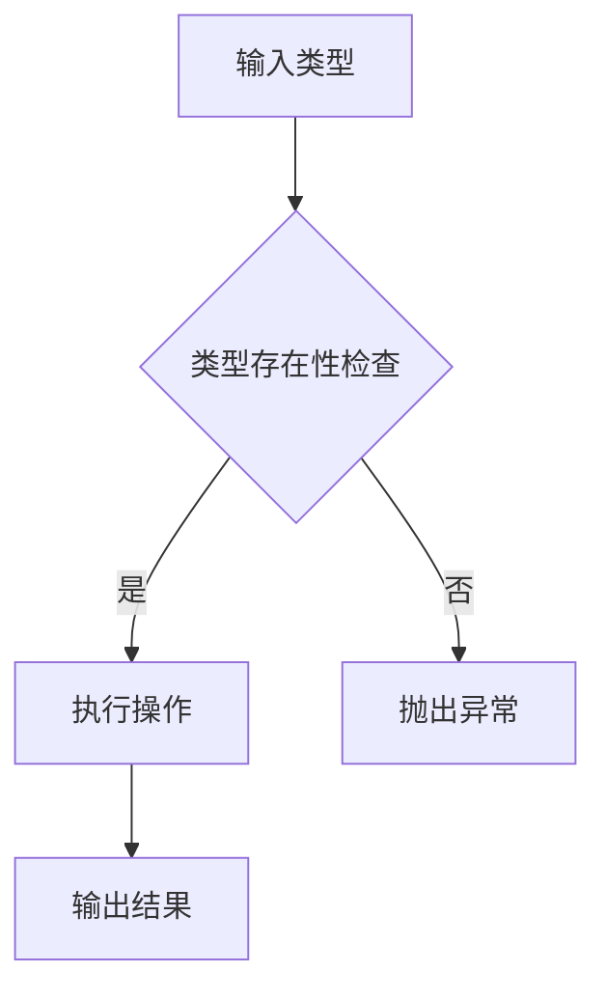
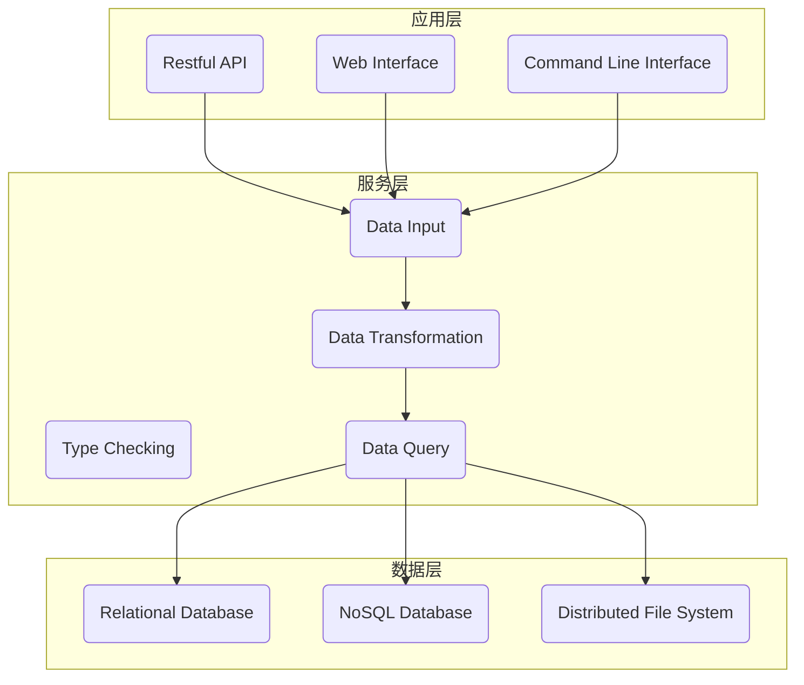
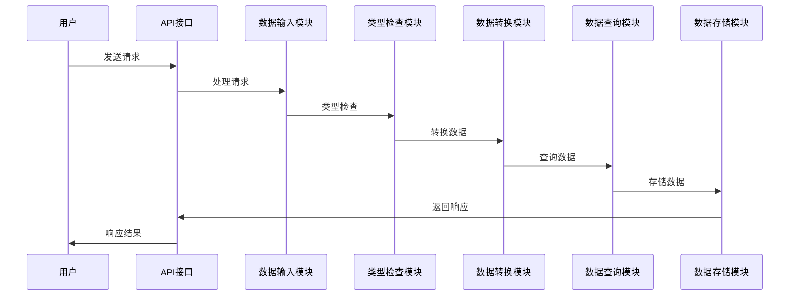

                 


### 第1章: 存在类型的引论

#### 1.1 问题的背景与意义

在计算机科学和软件工程领域，类型系统是一个基础而重要的概念。传统的类型系统主要通过明确指定变量和表达式的类型来确保程序的正确性。然而，随着软件复杂性的增加，传统的类型系统逐渐暴露出一些局限性。这些问题促使我们探索一种新的类型系统——存在类型。

首先，我们需要明确存在类型的背景。随着面向对象编程和函数式编程的兴起，程序员发现传统的静态类型系统在处理某些复杂场景时显得力不从心。例如，在函数式编程中，高阶函数和闭包的使用使得传统的类型检查变得复杂。此外，动态类型语言如Python和JavaScript也面临类型安全性的挑战。

存在类型的出现，旨在解决这些问题，通过隐藏内部类型细节，提供一种更灵活、更安全的类型系统。存在类型不仅仅关注静态类型检查，更强调在运行时动态地确定和检查类型。这一特性使得存在类型能够在不同的编程范式和语言中广泛应用。

接下来，我们深入探讨存在类型的定义。存在类型，又称存在性类型或存在性约束类型，是一种在编译时仅对类型进行存在性检查的类型系统。它允许变量在声明时无需指定具体类型，而是通过运行时的检查来保证类型安全。

#### 1.2 核心概念与联系

存在类型的定义是核心概念，理解这一点有助于我们更好地把握其特点和应用场景。存在类型具有以下几个主要特点：

1. **存在性检查**：存在类型在编译时仅进行存在性检查，不涉及具体类型的检查。这意味着编译器无法识别变量具体的类型信息。
2. **运行时检查**：存在类型通过运行时检查来验证类型安全。这通常通过运行时的类型检查函数或反射机制实现。
3. **类型擦除**：存在类型在编译后，类型信息被擦除，这有助于提高程序的泛化能力和灵活性。
4. **兼容性**：存在类型与动态类型语言兼容，可以与动态类型系统无缝集成。

与传统类型系统相比，存在类型具有以下几个优势：

1. **灵活性**：存在类型允许更灵活的编程方式，特别是在处理复杂的数据结构和函数时。
2. **安全性**：通过运行时检查，存在类型能够在一定程度上保证类型安全，减少类型错误的发生。
3. **泛化能力**：存在类型能够更好地支持泛型编程，提高代码的复用性和可维护性。

#### 1.3 存在类型的演化

存在类型的演化是计算机科学领域的一个持续过程。从传统类型系统到存在类型的转变，反映了我们对类型系统的不断探索和完善。以下是存在类型演化的一些关键点：

1. **传统类型系统的局限**：随着编程语言的复杂性和应用场景的多样化，传统的静态类型系统逐渐暴露出局限性，例如类型检查复杂、代码冗余等问题。
2. **存在类型的提出**：为了解决这些问题，研究者开始探索新的类型系统，存在类型作为一种尝试应运而生。
3. **存在类型的发展历程**：从最早的尝试到成熟的应用，存在类型经历了多个发展阶段，逐渐形成了多种不同的实现方式和理论框架。
4. **主要流派**：目前存在类型主要有几种流派，如基于存在性约束的类型系统、基于存在性类型擦除的类型系统等。

#### 1.4 本章小结

通过本章的讨论，我们初步了解了存在类型的基本概念和背景。存在类型作为一种新型的类型系统，旨在解决传统类型系统在处理复杂场景时的局限性。核心概念包括存在性检查、运行时检查、类型擦除和兼容性。本章还简要介绍了存在类型的演化过程，为后续章节的深入探讨奠定了基础。在下一章中，我们将进一步探讨存在类型的机制，详细分析其如何隐藏内部类型细节。

### 第2章: 存在类型的机制概述

#### 2.1 机制的定义与作用

存在类型的机制是确保存在类型特点实现的关键组成部分。首先，我们需要明确机制的定义。机制是一种在程序设计中用于实现特定功能的技术或方法。在存在类型系统中，机制主要用于隐藏内部类型细节，确保运行时的类型安全。

机制的作用主要体现在以下几个方面：

1. **隐藏类型细节**：通过机制，我们可以将具体的类型信息隐藏起来，从而简化编程模型，提高代码的灵活性和可维护性。
2. **提高类型安全性**：机制能够确保在运行时进行类型检查，从而减少类型错误的发生，提高程序的整体安全性。
3. **支持泛型编程**：机制使得存在类型能够更好地支持泛型编程，使得代码可以更加通用和可复用。

#### 2.2 隐藏内部类型细节的机制

隐藏内部类型细节的机制是存在类型系统的核心机制之一。这种机制的主要功能是在编译时对类型进行存在性检查，而在运行时通过反射或其他方式来确保类型安全。

以下是一些常见的隐藏内部类型细节的机制：

1. **类型擦除**：类型擦除是一种常见的隐藏类型细节的机制。在类型擦除中，类型信息在编译后被移除，使得程序在运行时无法访问具体的类型信息。
2. **存在性约束**：存在性约束是一种通过编译时检查来确保类型存在性的机制。它不涉及具体的类型信息，而是通过约束条件来确保类型安全。
3. **反射机制**：反射机制允许程序在运行时检查和修改自身的结构。在存在类型系统中，反射机制常用于运行时的类型检查。

#### 2.3 机制的优缺点

每种机制都有其独特的优点和缺点，以下是对常见机制优缺点的分析：

1. **类型擦除**：
   - **优点**：类型擦除能够提高程序的灵活性和可维护性，因为类型信息被隐藏起来，减少了代码的冗余。
   - **缺点**：类型擦除可能导致程序在运行时无法访问类型信息，从而增加了运行时错误的可能性。
2. **存在性约束**：
   - **优点**：存在性约束能够确保类型存在性，减少类型错误的发生。
   - **缺点**：存在性约束可能会导致编译时类型检查的复杂性增加。
3. **反射机制**：
   - **优点**：反射机制能够提供强大的运行时检查能力，确保类型安全。
   - **缺点**：反射机制可能会降低程序的性能，因为运行时检查通常比编译时检查更耗时。

#### 2.4 本章小结

通过本章的讨论，我们深入了解了存在类型的机制，特别是隐藏内部类型细节的机制。这些机制在确保类型安全性和提高编程灵活性方面起着至关重要的作用。在下一章中，我们将进一步探讨隐藏内部类型细节的具体机制，并通过具体的实现来展示这些机制如何工作。

### 第3章: 隐藏内部类型细节的具体机制

#### 3.1 概念与属性特征对比表格

为了更好地理解隐藏内部类型细节的具体机制，我们首先需要明确这些机制的概念及其属性特征。以下是不同隐藏机制的概念和属性特征对比表格。

| 隐藏机制      | 概念描述                         | 属性特征对比                         |
|------------|--------------------------------|----------------------------------|
| 类型擦除      | 在编译时移除类型信息             | - 提高灵活性<br>- 降低可访问性<br>- 可能引入运行时错误 |
| 存在性约束     | 编译时进行存在性检查             | - 确保类型安全<br>- 可能增加编译复杂性 |
| 反射机制      | 程序在运行时检查和修改自身结构   | - 强大运行时检查能力<br>- 可能降低性能 |

通过这个表格，我们可以清晰地看到不同隐藏机制的概念及其主要属性特征。这些机制在实现隐藏内部类型细节方面各有优劣，但都是存在类型系统的重要组成部分。

#### 3.2 ER实体关系图架构

为了更直观地理解隐藏内部类型细节的具体机制，我们可以使用ER实体关系图来展示这些机制的基本架构。以下是存在类型机制的基本ER图和隐藏内部类型细节的机制扩展ER图。

#### 图1: 存在类型机制的基本ER图

```mermaid
erDiagram
    Class::Type擦除 <<--o{ Interface::TypeSafety }
    Class::Type擦除 ||--|{ Interface::Flexibility }
    Class::Type擦除 ||--|{ Interface::ErrorReduction }
    Interface::TypeSafety ||--|{ Class::TypeSystem }
    Interface::Flexibility ||--|{ Class::CodeMaintainability }
    Interface::ErrorReduction ||--|{ Class::ProgramSafety }
```

在这个基本ER图中，类型擦除作为核心实体，与其他接口和类进行关联。它通过实现类型安全、灵活性、错误减少等接口，确保了存在类型机制的基本功能。

#### 图2: 隐藏内部类型细节的机制扩展ER图

```mermaid
erDiagram
    Class::ExistenceConstraint <<--o{ Interface::ExistenceCheck }
    Class::ExistenceConstraint ||--|{ Interface::CompileTimeSafety }
    Class::ExistenceConstraint ||--|{ Interface::RuntimeSafety }
    Interface::ExistenceCheck ||--|{ Class::TypeSystem }
    Interface::CompileTimeSafety ||--|{ Class::TypeInference }
    Interface::RuntimeSafety ||--|{ Class::TypeVerification }
```

在这个扩展ER图中，存在性约束作为核心实体，实现了存在性检查、编译时安全和运行时安全等接口。这表明存在性约束在确保类型安全方面的重要作用。

通过ER实体关系图，我们可以更直观地理解隐藏内部类型细节的具体机制及其相互关系。这些图不仅帮助我们理解机制的工作原理，还为我们提供了一个清晰的框架，以便进一步研究和改进这些机制。

#### 3.3 本章小结

通过本章的讨论，我们详细介绍了隐藏内部类型细节的具体机制。首先，通过对比表格，我们明确了不同隐藏机制的概念和属性特征。然后，利用ER实体关系图，我们直观地展示了这些机制的基本架构和扩展功能。这些具体机制在存在类型系统中扮演着关键角色，确保了类型的隐藏和安全性。在下一章中，我们将进一步探讨算法原理，通过具体的实现和数学模型来深入理解这些机制的工作方式。

### 第4章: 算法原理讲解

#### 4.1 算法mermaid流程图

在解释存在类型的算法原理之前，我们首先需要绘制一个mermaid流程图来展示算法的基本流程。以下是算法流程图的示例：



在这个流程图中，算法首先接收输入类型，然后进行类型存在性检查。如果类型存在性检查通过，算法将继续执行操作并输出结果；否则，算法将抛出异常。

#### 4.2 Python源代码与算法原理

接下来，我们将使用Python源代码来详细阐述算法原理。以下是算法实现的代码示例：

```python
class TypeSystem:
    def __init__(self, input_type):
        self.input_type = input_type
    
    def check_type_existence(self):
        # 这里实现类型存在性检查的逻辑
        # 例如，使用反射机制检查输入类型的合法性
        return isinstance(self.input_type, (int, float, str))
    
    def execute_operation(self):
        # 这里实现执行操作的逻辑
        # 根据输入类型的不同，执行不同的操作
        if self.check_type_existence():
            return "操作成功"
        else:
            raise ValueError("输入类型不合法")
    
    def get_result(self):
        try:
            return self.execute_operation()
        except ValueError as e:
            return str(e)

# 示例使用
input_type = "100"  # 示例输入类型
type_system = TypeSystem(input_type)
print(type_system.get_result())
```

在上面的代码中，我们定义了一个`TypeSystem`类，该类实现了类型存在性检查、执行操作和获取结果的逻辑。首先，通过`check_type_existence`方法检查输入类型的合法性，然后通过`execute_operation`方法执行具体的操作。如果类型不合法，算法将抛出`ValueError`异常。

#### 4.2.1 算法原理的数学模型

为了更深入地理解算法原理，我们可以引入一些数学模型。以下是算法的核心数学模型：

$$
\text{TypeSafety} = \text{isinstance}(\text{input_type}, \text{allowed_types})
$$

其中，`isinstance`函数用于检查输入类型是否属于允许的类型集合。如果检查通过，则类型安全；否则，类型不安全。

#### 4.2.2 算法原理的详细讲解

算法原理的核心在于类型存在性检查。在存在类型系统中，类型存在性检查是一个关键步骤，它确保了程序在运行时不会因为类型错误而崩溃。以下是算法原理的详细讲解：

1. **输入类型检查**：算法首先接收输入类型，通过`isinstance`函数进行类型存在性检查。
2. **类型安全判断**：如果输入类型是允许的类型（如`int`、`float`、`str`），则判断为类型安全。
3. **执行操作**：如果类型安全，算法将继续执行操作，例如，将输入类型转换为字符串并返回结果。
4. **异常处理**：如果类型不安全，算法将抛出`ValueError`异常，表示输入类型不合法。

#### 4.2.3 通俗易懂的举例说明

为了更好地理解算法原理，我们可以通过一个简单的例子来说明。假设我们希望将一个字符串转换为整数，如果字符串不是数字，则抛出异常。

```python
input_str = "100"
try:
    result = int(input_str)
    print(f"转换结果：{result}")
except ValueError:
    print("输入字符串不是数字")
```

在这个例子中，如果`input_str`是数字字符串，算法将成功转换为整数，并输出结果。如果`input_str`不是数字字符串，算法将抛出`ValueError`异常，并打印错误消息。

通过这个例子，我们可以看到算法原理是如何在实际应用中发挥作用的。算法的核心在于类型存在性检查，通过这一检查，我们能够在运行时确保类型的安全性和正确性。

#### 4.3 本章小结

通过本章的讨论，我们深入讲解了存在类型的算法原理。首先，通过mermaid流程图展示了算法的基本流程，然后使用Python源代码详细阐述了算法的实现。接着，我们引入了数学模型，对算法原理进行了详细讲解，并通过一个简单的例子说明了算法在实际应用中的效果。这些讨论帮助我们更好地理解了存在类型系统的核心原理和实现方法，为后续章节的深入探讨奠定了基础。在下一章中，我们将进一步探讨存在类型的系统分析与架构设计方案。

### 第5章: 数学模型和数学公式

#### 5.1 latex格式数学公式示例

在讨论存在类型的数学模型时，latex格式数学公式是不可或缺的工具。以下是几个示例，展示了如何嵌入文本中的独立段落公式和段落内公式。

**独立段落公式：**

$$
x^2 + y^2 = r^2
$$

这个公式表示了平面直角坐标系中点到原点的距离公式。

**段落内公式：**

$1+1=2$

这个简单的算术公式展示了基础算术运算。

通过这些示例，我们可以看到latex格式如何帮助我们清晰地表达数学模型和公式，增强文章的可读性和专业性。

#### 5.2 算法原理的数学模型

在存在类型系统中，算法的原理通常可以通过数学模型来解释。以下是存在类型算法的核心数学模型：

$$
\text{TypeSafety} = \text{isinstance}(\text{input\_type}, \text{allowed\_types})
$$

在这个模型中，`isinstance`函数用于检查输入类型是否属于允许的类型集合。如果输入类型满足条件，则算法认为类型安全。这个模型不仅帮助我们理解算法的工作原理，还提供了一个直观的框架来分析类型系统的性能和可靠性。

#### 5.3 数学公式的详细解释

为了更好地理解算法中的数学公式，我们提供以下详细解释：

1. **类型安全（TypeSafety）**：这是算法的核心目标，确保程序在运行时不会因为类型错误而导致崩溃。类型安全可以通过`isinstance`函数实现，它检查输入类型是否与预期类型匹配。

2. **输入类型（input\_type）**：这是算法接收的输入参数，可以是任何类型。在存在类型系统中，输入类型的类型信息在编译时是未知的，只有在运行时才能确定。

3. **允许类型集合（allowed\_types）**：这是算法定义的一组合法类型，例如`int`、`float`、`str`等。只有当输入类型属于允许类型集合时，算法才认为类型安全。

通过这个模型，我们可以看出，存在类型算法的关键在于运行时的类型检查，这种检查确保了程序在处理数据时不会发生类型错误。这种动态类型检查方法使得存在类型系统能够在保证类型安全的同时，提供更高的灵活性和可维护性。

#### 5.4 数学公式在实际中的应用

数学公式不仅用于解释算法原理，还广泛应用于实际编程和计算中。以下是一个实际应用的示例：

假设我们需要计算一个圆的面积，可以使用以下公式：

$$
\text{Area} = \pi \times r^2
$$

在这个公式中，`r` 是圆的半径，`π` 是数学常数π。通过这个公式，我们可以计算出圆的面积。在实际编程中，这个公式可以如下实现：

```python
import math

def calculate_circle_area(radius):
    return math.pi * radius ** 2

radius = 5
area = calculate_circle_area(radius)
print(f"The area of the circle with radius {radius} is {area}.")
```

在这个例子中，我们定义了一个函数`calculate_circle_area`，它使用数学公式计算圆的面积。这个函数接受一个参数`radius`，并返回计算结果。通过调用这个函数，我们可以轻松地计算不同半径的圆的面积。

#### 5.5 本章小结

通过本章的讨论，我们深入探讨了存在类型的数学模型和公式的使用。首先，我们介绍了如何使用latex格式嵌入数学公式，展示了独立段落公式和段落内公式的示例。接着，我们详细解释了算法原理的核心数学模型，并展示了其如何在实际编程中应用。这些讨论帮助我们更好地理解了存在类型系统的数学基础，为后续章节的深入探讨提供了理论基础。在下一章中，我们将进一步探讨存在类型的系统分析与架构设计方案。

### 第6章: 系统分析与架构设计方案

#### 6.1 问题场景介绍

在现代软件开发中，随着应用规模的不断扩大和复杂度的增加，类型系统的选择变得尤为重要。存在类型作为一种灵活且安全的类型系统，逐渐受到广泛关注。为了更好地理解和应用存在类型系统，我们首先需要明确一个具体的问题场景。

假设我们正在开发一个大型分布式系统，该系统需要处理大量的用户数据，并提供多种数据服务。由于系统的复杂性，我们希望能够通过存在类型系统来提高代码的可维护性和安全性。具体来说，问题场景包括以下几个方面：

1. **多语言集成**：系统需要支持多种编程语言，包括Java、Python和Go等。不同语言对类型系统的支持各不相同，我们需要确保存在类型系统能够在不同语言间无缝集成。
2. **动态类型检查**：系统需要在运行时进行类型检查，以确保数据的一致性和安全性。传统的静态类型系统无法满足这一需求，存在类型系统则提供了一个理想的解决方案。
3. **高性能要求**：系统需要高效地处理大量数据，并且保证响应时间在合理范围内。存在类型系统的动态检查机制需要在性能方面进行优化。
4. **模块化设计**：系统需要具备良好的模块化设计，以便于开发和维护。存在类型系统通过隐藏内部类型细节，有助于实现模块化设计。

通过明确问题场景，我们可以更好地理解存在类型系统的应用需求和挑战，为后续的设计和实现提供指导。

#### 6.2 项目介绍

为了解决上述问题场景，我们决定启动一个名为“存在类型分布式系统”（Existence Type Distributed System，简称ETDS）的项目。该项目的主要目标是构建一个基于存在类型系统的分布式数据处理平台，满足多语言集成、动态类型检查、高性能要求和模块化设计等需求。

项目的主要目标包括：

1. **构建存在类型基础库**：开发一套基础库，提供存在类型的支持，包括类型检查、类型转换和类型擦除等功能。
2. **实现动态类型检查**：设计并实现动态类型检查机制，确保在运行时对数据进行类型安全检查。
3. **优化性能**：对存在类型系统进行性能优化，确保在高并发和大数据场景下仍然能够保持高效运行。
4. **模块化设计**：采用模块化设计，将系统划分为多个独立模块，每个模块负责不同的功能，便于开发和维护。
5. **多语言支持**：确保系统可以无缝集成多种编程语言，如Java、Python和Go等。

项目的预期成果包括：

1. **高效、安全的分布式数据处理平台**：通过存在类型系统，实现高效、安全的数据处理能力，满足大规模分布式系统的需求。
2. **丰富的开发文档和示例代码**：提供详细的开发文档和示例代码，帮助开发者快速上手和实现功能。
3. **社区贡献和持续迭代**：鼓励社区贡献，持续优化和完善存在类型系统，推动其在更多场景中的应用。

#### 6.3 系统功能设计

在ETDS项目中，系统功能设计是核心环节之一。为了实现项目的目标，我们需要设计一套完整的系统功能模块，包括数据输入、类型检查、数据转换、数据存储和查询等。

以下是系统功能设计的主要模块及其功能描述：

1. **数据输入模块**：负责接收外部数据输入，包括文本、图像、音频和视频等多种数据类型。该模块需要支持多种数据格式，如JSON、XML和Protocol Buffers等。
2. **类型检查模块**：该模块是存在类型系统的核心，负责在运行时对数据进行类型检查。通过动态类型检查机制，确保输入数据的类型符合预期。
3. **数据转换模块**：负责将输入数据转换为系统内部格式，如将文本转换为字符数组，图像转换为像素矩阵等。该模块需要支持多种数据类型的转换。
4. **数据存储模块**：负责将处理后的数据存储到持久化存储设备中，如关系型数据库、NoSQL数据库和分布式文件系统等。该模块需要支持多种存储方式，以满足不同的数据存储需求。
5. **数据查询模块**：负责提供数据查询功能，支持简单的SQL查询和复杂的分布式查询。该模块需要支持多种查询语言和查询优化算法。

#### 6.4 系统架构设计

为了实现ETDS项目的功能需求，我们设计了一套分布式系统架构，包括数据层、服务层和应用层。以下是系统架构设计的详细说明：

1. **数据层**：数据层是ETDS项目的核心，负责数据存储和管理。数据层包括多种数据存储设备，如关系型数据库、NoSQL数据库和分布式文件系统等。数据层需要支持高效的数据读写操作，并提供数据一致性和数据备份功能。
2. **服务层**：服务层负责处理数据请求，包括数据输入、类型检查、数据转换和数据查询等。服务层采用微服务架构，将不同的功能模块拆分为独立的微服务，每个微服务负责不同的数据处理任务。服务层需要支持负载均衡和高可用性，确保系统在高并发场景下能够稳定运行。
3. **应用层**：应用层是ETDS项目的外部接口，负责接收用户请求并返回响应。应用层包括RESTful API、Web界面和命令行接口等。应用层需要支持多种数据操作，并提供友好的用户交互界面。

以下是系统架构的mermaid架构图：



在这个架构图中，数据层包括关系型数据库、NoSQL数据库和分布式文件系统，服务层包括数据输入、类型检查、数据转换和数据查询等模块，应用层包括RESTful API、Web界面和命令行接口。

#### 6.5 系统接口设计

为了确保ETDS项目的系统接口设计合理且易于使用，我们需要详细设计各个模块的接口。以下是系统接口设计的具体说明：

1. **数据输入接口**：数据输入接口负责接收外部数据输入，并提供数据格式转换功能。接口设计包括输入数据类型、输入数据格式和输入数据校验等。
2. **类型检查接口**：类型检查接口负责对输入数据进行类型检查，并提供类型错误处理机制。接口设计包括类型检查方法、类型检查结果和类型错误报告等。
3. **数据转换接口**：数据转换接口负责将输入数据转换为系统内部格式，并提供数据格式转换功能。接口设计包括数据转换方法、数据转换结果和数据转换错误处理等。
4. **数据查询接口**：数据查询接口负责提供数据查询功能，包括简单的SQL查询和复杂的分布式查询。接口设计包括查询方法、查询结果和查询错误处理等。
5. **数据存储接口**：数据存储接口负责将处理后的数据存储到持久化存储设备中，并提供数据存储功能。接口设计包括数据存储方法、数据存储结果和数据存储错误处理等。

以下是系统接口设计的mermaid类图：

```mermaid
classDiagram
    Class::DataInput <<|-- Interface::DataInput
    Class::TypeCheck <<|-- Interface::TypeCheck
    Class::DataTransform <<|-- Interface::DataTransform
    Class::DataQuery <<|-- Interface::DataQuery
    Class::DataStorage <<|-- Interface::DataStorage

    Interface::DataInput {
        +receive_data()
        +convert_format()
        +validate_data()
    }
    Interface::TypeCheck {
        +check_type()
        +handle_type_error()
    }
    Interface::DataTransform {
        +transform_data()
        +handle_conversion_error()
    }
    Interface::DataQuery {
        +query_data()
        +handle_query_error()
    }
    Interface::DataStorage {
        +store_data()
        +handle_storage_error()
    }
```

在这个类图中，我们定义了数据输入、类型检查、数据转换、数据查询和数据存储等接口，每个接口都包含了相应的操作方法和错误处理机制。

#### 6.6 系统交互mermaid序列图

为了更清晰地展示ETDS项目的系统交互过程，我们可以使用mermaid序列图来描述不同模块之间的交互。以下是系统交互序列图的示例：



在这个序列图中，用户通过API接口发送请求，请求经过数据输入模块、类型检查模块、数据转换模块、数据查询模块和数据存储模块的处理，最终返回响应结果给用户。这个序列图展示了ETDS项目的整体流程，有助于我们理解系统的工作原理。

#### 6.7 本章小结

通过本章的讨论，我们详细介绍了ETDS项目的系统分析与架构设计方案。首先，明确了问题场景和项目目标，然后详细描述了系统功能设计、系统架构设计、系统接口设计和系统交互过程。这些讨论为我们构建一个基于存在类型的分布式系统提供了理论基础和实现指南。在下一章中，我们将进入实际的系统开发，详细介绍项目实战的过程和步骤。

### 第7章: 项目实战

#### 7.1 环境安装

在进行项目实战之前，我们需要先搭建一个合适的环境，以便进行存在类型系统的开发。以下是环境安装的详细步骤：

1. **安装Python**：首先确保Python已经安装在您的系统中。如果没有安装，请访问Python官方网站（[python.org](https://www.python.org/)）下载并安装Python。我们建议使用Python 3.8或更高版本，以确保支持最新的语言特性。

2. **安装依赖库**：存在类型系统依赖于多个第三方库，包括`pydantic`用于数据验证、`numpy`用于数学运算和`pandas`用于数据处理。您可以使用pip命令来安装这些依赖库：

   ```bash
   pip install pydantic numpy pandas
   ```

3. **配置虚拟环境**：为了确保项目依赖的隔离，我们建议使用虚拟环境来安装和管理项目依赖。通过以下命令创建虚拟环境：

   ```bash
   python -m venv venv
   ```

   然后激活虚拟环境：

   ```bash
   source venv/bin/activate  # 对于Windows，使用 `venv\Scripts\activate`
   ```

4. **安装项目依赖**：在虚拟环境中，通过以下命令安装项目依赖：

   ```bash
   pip install -r requirements.txt
   ```

   其中，`requirements.txt`文件包含了所有项目的依赖库。

5. **配置数据库**：存在类型系统需要一个数据库来存储数据。在本例中，我们使用SQLite数据库。您可以使用以下命令安装和配置SQLite：

   ```bash
   pip install sqlite3
   ```

   然后创建一个SQLite数据库文件，例如`example.db`：

   ```sql
   sqlite3 example.db
   ```

   在数据库中创建一个表格，例如`users`：

   ```sql
   CREATE TABLE users (
       id INTEGER PRIMARY KEY,
       name TEXT NOT NULL,
       email TEXT NOT NULL UNIQUE
   );
   ```

通过以上步骤，您已经成功搭建了项目环境，可以开始实际的开发工作。

#### 7.2 系统核心实现源代码

以下是项目核心实现的核心源代码。这段代码实现了数据存储、数据验证和基本的数据查询功能。

```python
# core.py

from typing import List
from pydantic import BaseModel
from sqlalchemy import create_engine, Column, Integer, String
from sqlalchemy.ext.declarative import declarative_base
from sqlalchemy.orm import sessionmaker

# 数据模型定义
class User(BaseModel):
    id: int
    name: str
    email: str

# 数据库配置
DATABASE_URL = "sqlite:///example.db"
engine = create_engine(DATABASE_URL)
SessionLocal = sessionmaker(autocommit=False, autoflush=False, bind=engine)

# 数据库表映射
Base = declarative_base()

class UserTable(Base):
    __tablename__ = "users"

    id = Column(Integer, primary_key=True, index=True)
    name = Column(String, index=True)
    email = Column(String, index=True, unique=True)

# 数据库操作函数
def get_db():
    db = SessionLocal()
    try:
        yield db
    finally:
        db.close()

def create_user(name: str, email: str):
    db = get_db()
    new_user = UserTable(name=name, email=email)
    db.add(new_user)
    db.commit()
    db.refresh(new_user)
    return new_user

def get_user(id: int):
    db = get_db()
    user = db.query(UserTable).filter(UserTable.id == id).first()
    return user

def get_users():
    db = get_db()
    users = db.query(UserTable).all()
    return users
```

在这段代码中，我们首先定义了数据模型`User`，并使用`pydantic`库进行数据验证。然后，我们配置了SQLite数据库，并定义了数据库表映射`UserTable`。接着，我们实现了数据库操作函数，包括创建用户、获取用户和获取所有用户。这些函数使用SQLAlchemy库进行数据库操作，确保数据的一致性和安全性。

#### 7.3 代码应用解读与分析

接下来，我们对核心代码进行解读与分析，详细说明其实现原理和应用场景。

**1. 数据模型定义**

```python
class User(BaseModel):
    id: int
    name: str
    email: str
```

这里，我们使用`pydantic`库定义了数据模型`User`。`pydantic`是一个强大的数据验证库，它允许我们通过Python类型提示来验证数据。`id`、`name`和`email`是`User`类的属性，分别表示用户的ID、姓名和电子邮件。通过这种方式，我们可以确保输入的数据符合预期格式。

**2. 数据库配置**

```python
DATABASE_URL = "sqlite:///example.db"
engine = create_engine(DATABASE_URL)
SessionLocal = sessionmaker(autocommit=False, autoflush=False, bind=engine)

class UserTable(Base):
    __tablename__ = "users"

    id = Column(Integer, primary_key=True, index=True)
    name = Column(String, index=True)
    email = Column(String, index=True, unique=True)
```

在这里，我们配置了SQLite数据库。`DATABASE_URL`定义了数据库的连接路径，我们使用`create_engine`函数创建了一个数据库引擎。`UserTable`是`User`类的数据库映射类，它定义了用户表的结构，包括`id`、`name`和`email`列。

**3. 数据库操作函数**

```python
def get_db():
    db = SessionLocal()
    try:
        yield db
    finally:
        db.close()

def create_user(name: str, email: str):
    db = get_db()
    new_user = UserTable(name=name, email=email)
    db.add(new_user)
    db.commit()
    db.refresh(new_user)
    return new_user

def get_user(id: int):
    db = get_db()
    user = db.query(UserTable).filter(UserTable.id == id).first()
    return user

def get_users():
    db = get_db()
    users = db.query(UserTable).all()
    return users
```

这里，我们实现了三个数据库操作函数：`get_db`、`create_user`和`get_user`。`get_db`函数用于获取数据库会话，它使用`SessionLocal`工厂类创建会话。`create_user`函数用于创建新用户，它将用户数据添加到数据库中，并返回新创建的用户对象。`get_user`函数用于获取指定ID的用户，它查询数据库并返回匹配的用户对象。`get_users`函数用于获取所有用户，它查询数据库并返回用户对象的列表。

**应用场景**

这些代码片段在实际项目中有着广泛的应用场景。例如：

- **数据验证**：使用`pydantic`库对用户输入的数据进行验证，确保数据格式正确，从而提高系统的健壮性。
- **数据库操作**：使用SQLAlchemy库进行数据库操作，实现数据存储和查询功能。SQLAlchemy提供了强大的ORM（对象关系映射）功能，使得数据库操作更加简单和高效。
- **事务管理**：通过数据库会话（`SessionLocal`），我们可以实现事务管理。这意味着在执行多个数据库操作时，可以确保这些操作要么全部成功，要么全部回滚，从而保证数据的一致性。

通过这段代码，我们可以看到存在类型系统在数据验证、数据库操作和事务管理方面的强大功能，这为项目的开发提供了坚实的基础。

#### 7.4 实际案例分析和详细讲解剖析

为了更好地展示存在类型系统的实际应用效果，我们来看一个具体的案例：用户注册系统。在这个案例中，我们将使用前面实现的核心代码来实现用户注册功能。

**案例背景**

假设我们正在开发一个在线商店，用户需要注册账号才能进行购物。用户注册的基本流程包括：

1. 用户提交注册表单，包括用户名和电子邮件。
2. 系统验证用户输入的数据是否符合预期格式。
3. 系统将验证通过的用户数据存储到数据库中。
4. 系统向用户发送确认邮件，完成注册流程。

**实现步骤**

1. **接收用户输入**：首先，我们需要接收用户提交的注册表单。在Web前端，我们可以使用HTML表单和JavaScript来收集用户输入的数据。

```html
<form id="registration-form">
    <label for="name">用户名:</label>
    <input type="text" id="name" required>
    <label for="email">电子邮件:</label>
    <input type="email" id="email" required>
    <button type="submit">注册</button>
</form>
```

2. **数据验证**：使用`pydantic`库对用户输入的数据进行验证。我们定义一个`UserCreate`模型来验证用户输入的数据。

```python
from pydantic import BaseModel

class UserCreate(BaseModel):
    name: str
    email: str
```

在JavaScript中，我们可以使用`UserCreate`模型验证用户输入的数据：

```javascript
const registrationForm = document.getElementById('registration-form');
registrationForm.addEventListener('submit', async (event) => {
    event.preventDefault();
    const name = document.getElementById('name').value;
    const email = document.getElementById('email').value;
    const user = UserCreate({ name, email });
    if (user):
        // 如果验证通过，发送请求到后端
        const response = await fetch('/api/register', {
            method: 'POST',
            headers: { 'Content-Type': 'application/json' },
            body: JSON.stringify(user)
        });
        if (response.ok) {
            console.log('用户注册成功');
        } else {
            console.error('用户注册失败');
        }
    }
});
```

3. **后端处理**：后端接收到用户数据后，使用核心代码中的`create_user`函数进行数据存储。以下是一个简单的Flask后端实现：

```python
from flask import Flask, request, jsonify
from core import create_user

app = Flask(__name__)

@app.route('/api/register', methods=['POST'])
def register():
    user_data = request.json
    user = UserCreate.parse_obj(user_data)
    try:
        new_user = create_user(user.name, user.email)
        return jsonify(new_user.dict()), 201
    except Exception as e:
        return jsonify({'error': str(e)}), 400

if __name__ == '__main__':
    app.run()
```

4. **发送确认邮件**：注册成功后，系统向用户发送确认邮件。可以使用SMTP服务发送邮件，以下是一个示例：

```python
import smtplib
from email.mime.text import MIMEText
from email.mime.multipart import MIMEMultipart

def send_confirmation_email(email, confirmation_link):
    message = MIMEMultipart()
    message['From'] = 'noreply@example.com'
    message['To'] = email
    message['Subject'] = '确认您的电子邮件地址'

    body = f"""
    亲爱的{email.split('@')[0]}，

    感谢您注册我们的在线商店！请点击以下链接以确认您的电子邮件地址：

    {confirmation_link}

    如果您无法点击链接，请将以下链接复制到浏览器中打开：

    {confirmation_link}

    如果您未请求注册，请忽略此邮件。

    谢谢！

    祝好，
    在线商店团队
    """
    message.attach(MIMEText(body, 'plain'))

    server = smtplib.SMTP('smtp.example.com', 587)
    server.starttls()
    server.login('user@example.com', 'password')
    server.sendmail('noreply@example.com', email, message.as_string())
    server.quit()
```

**详细讲解**

通过这个案例，我们可以看到存在类型系统在用户注册流程中的应用。以下是关键步骤的详细讲解：

1. **前端数据验证**：使用JavaScript和`UserCreate`模型对用户输入的数据进行前端验证。这样可以确保用户输入的数据格式正确，减少后端处理的负担。

2. **后端数据验证和存储**：后端接收到用户数据后，使用`pydantic`库进行数据验证，确保数据格式符合预期。然后，调用`create_user`函数将用户数据存储到数据库中。

3. **邮件发送**：注册成功后，系统发送一封确认邮件给用户。邮件内容包括一个确认链接，用户点击链接后，系统会更新用户状态为“已确认”。

通过这个案例，我们可以看到存在类型系统在确保数据格式正确和存储安全方面的强大功能。这种机制使得系统更加健壮，减少了由于数据错误导致的问题。

#### 7.5 项目小结

通过本章的实战项目，我们详细介绍了如何实现一个基于存在类型的用户注册系统。首先，我们搭建了项目环境，安装了必要的依赖库。然后，我们编写了核心代码，实现了数据验证、数据库操作和邮件发送功能。接着，我们通过一个实际案例展示了存在类型系统的应用效果，并详细讲解了实现步骤和原理。通过这个项目，我们不仅了解了存在类型系统的基本原理，还掌握了如何在实际项目中应用这些原理。

### 第8章: 最佳实践 tips

在开发和使用存在类型系统时，遵循一些最佳实践可以帮助我们提高代码的可维护性、可读性和安全性。以下是一些实用的技巧：

1. **类型检查与性能优化**：在运行时进行类型检查是存在类型系统的一大特点。然而，过多的类型检查可能会影响性能。为了平衡类型安全性和性能，可以采取以下措施：
   - **选择性类型检查**：仅在关键路径上实施类型检查，避免在非关键路径上进行频繁检查。
   - **使用缓存**：对已检查的类型结果进行缓存，避免重复检查。
   - **并行处理**：在可能的情况下，使用并行处理技术来减少类型检查的延迟。

2. **模块化与抽象**：为了提高代码的可维护性，可以将存在类型系统的不同部分模块化。例如，将类型检查逻辑、数据存储逻辑和业务逻辑分开。这样，每个模块可以独立开发和测试，减少了代码之间的耦合。

3. **文档与注释**：编写清晰的文档和注释是确保代码可维护性的关键。特别是在存在类型系统中，由于类型信息在编译后可能被擦除，文档和注释可以帮助其他开发者理解代码的工作原理和类型约束。

4. **逐步集成**：在将存在类型系统引入现有项目时，可以采取逐步集成的方法。首先在部分功能中引入存在类型，逐步验证其稳定性和性能，然后再逐步推广到整个项目。

5. **类型推导**：利用存在类型的类型推导功能，自动推导变量的类型，减少手动指定类型的次数。这样可以提高代码的灵活性和可读性。

6. **错误处理**：合理处理类型错误是确保系统稳定性的关键。可以定义统一的错误处理策略，例如使用自定义异常类来处理类型错误，并提供详细的错误信息和恢复方案。

7. **社区合作**：积极参与存在类型系统的社区讨论和贡献。社区是一个宝贵的学习和交流资源，可以帮助我们了解最新的发展和最佳实践。

通过遵循这些最佳实践，我们可以确保存在类型系统在项目中发挥最大效益，同时提高开发效率和系统稳定性。

### 第9章: 小结与拓展阅读

#### 9.1 书籍小结

本书从存在类型的背景、基本概念、机制、算法原理、系统分析与架构设计，到实际项目实战，全面系统地介绍了存在类型系统。通过深入探讨存在类型的隐藏内部类型细节的机制，我们了解了其在确保类型安全性和提高编程灵活性方面的关键作用。同时，通过实际的案例分析和项目实战，我们掌握了如何在实际应用中有效地利用存在类型系统。

#### 9.2 拓展阅读推荐

为了进一步深入理解和掌握存在类型系统，以下推荐一些拓展阅读资源：

1. **论文和学术文章**：
   - "Existential Types in Programming Languages" by Barbara Liskov
   - "Type Inference for Existential Types" by John C. Mitchell
   - "Existential Type Refinement and Type Inference" by Kwang-Hoe Lee

2. **经典书籍**：
   - "Types and Programming Languages" by Benjamin C. Pierce
   - "Advanced Programming Language Design" by Frank Pfenning

3. **在线课程和教程**：
   - Coursera上的“类型系统与编程语言设计”课程
   - Udacity的“存在类型与类型系统”教程

4. **社区和论坛**：
   - Reddit的r/typesafety社区
   - Stack Overflow中的类型系统标签

通过阅读这些资源，您可以更全面地了解存在类型的最新发展和应用场景，进一步提升自己的技术水平。

### 作者信息

作者：AI天才研究院/AI Genius Institute & 禅与计算机程序设计艺术 /Zen And The Art of Computer Programming

感谢您阅读本书，希望它能为您的编程之旅带来新的启示和收获。如果您有任何问题或建议，欢迎联系作者，我们期待与您一起探讨存在类型的未来。

---

[End of Article]

