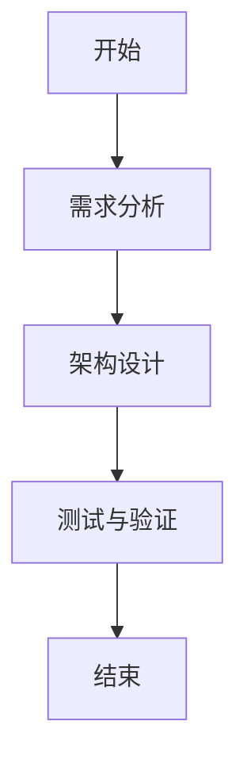
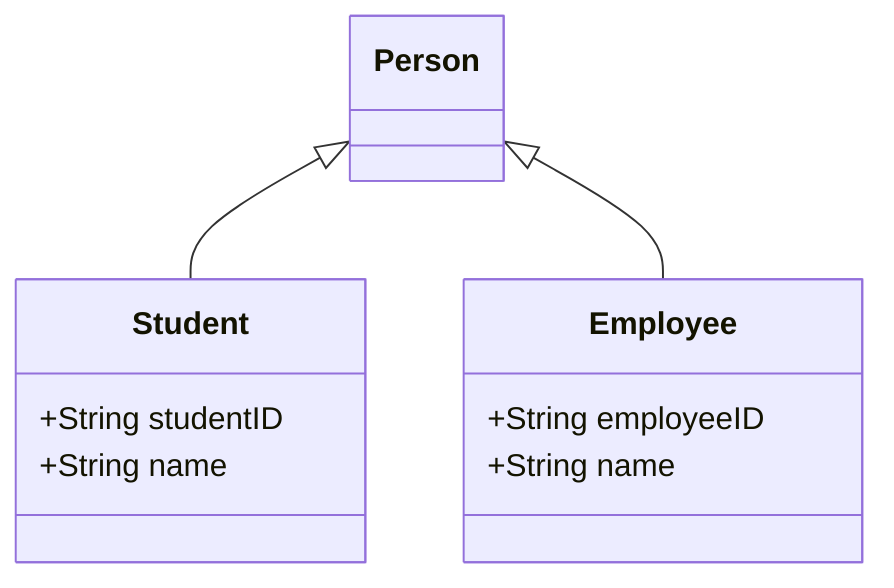
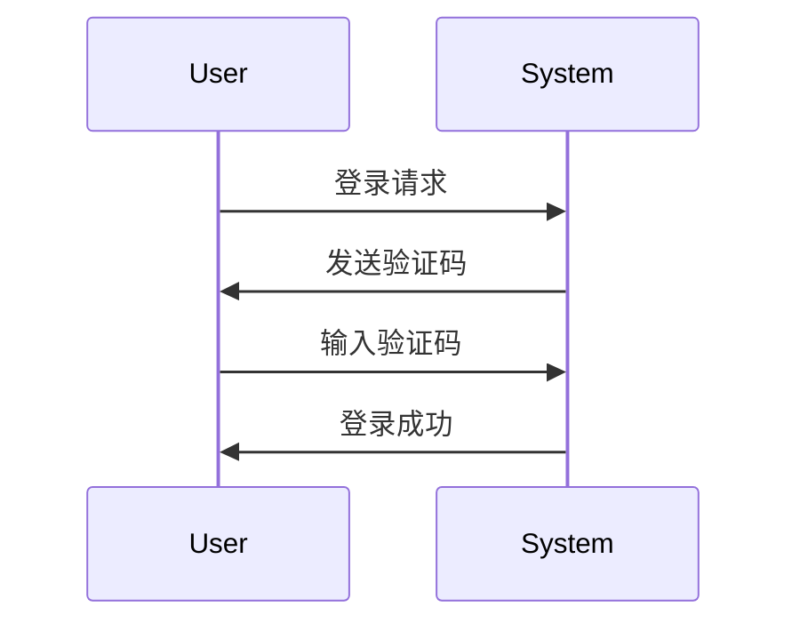

                 


### 安全架构：在设计阶段考虑安全因素

> 关键词：安全架构，设计阶段，安全因素，系统设计

> 摘要：本文将深入探讨在系统设计阶段考虑安全因素的重要性，从安全架构的基本概念出发，逐步分析安全设计原则、安全技术的应用以及实际案例分析，帮助读者构建一个全面、可靠的安全架构。

----------------------------------------------------------------

# 引言

在当今数字化时代，网络安全已经成为企业和个人无法忽视的重要问题。随着互联网的普及和信息技术的发展，各种网络攻击和信息安全事件频繁发生，对个人隐私、企业业务和国家安全构成了严重威胁。因此，构建一个强大的安全架构，在设计阶段充分考虑安全因素，成为确保系统安全的关键。

本文旨在为系统架构师、软件开发人员和其他相关从业者提供关于安全架构设计的全面指导，帮助他们理解安全架构的基本概念、设计原则和安全技术的应用，并通过实际案例进行分析和总结。

本文将按照以下结构进行阐述：

1. **安全架构概述**：介绍安全架构的定义、组成部分和发展历程。
2. **安全设计原则**：详细阐述安全设计的基本原则、方法和流程。
3. **安全技术的应用**：探讨防火墙、加密技术、身份认证等安全技术的原理和应用。
4. **案例分析**：通过银行系统、电商平台等案例分析安全架构设计。

现在，让我们一步一步深入探讨这些内容。

## 安全架构概述

### 1.1 安全架构的基本概念

安全架构是确保信息系统安全的核心框架，它由一系列安全策略、组件和机制组成，用于保护系统免受各种威胁和攻击。安全架构的设计目标是确保系统的完整性、保密性和可用性。

安全架构的基本概念包括：

- **安全策略**：定义组织的安全目标和安全措施。
- **安全组件**：如防火墙、入侵检测系统、安全信息和事件管理系统等。
- **安全机制**：如加密、认证、访问控制等。

### 1.2 安全架构的组成部分

安全架构通常由以下组成部分构成：

- **硬件安全**：确保计算机硬件的安全，如物理安全、电源安全等。
- **软件安全**：确保操作系统、应用程序和其他软件的安全。
- **网络安全**：确保网络通信的安全，如防火墙、VPN等。
- **数据安全**：确保数据的安全，如加密、备份等。
- **人员安全**：确保员工的安全意识和行为符合安全规范。

### 1.3 安全架构的发展历程

安全架构的发展经历了以下几个阶段：

- **传统安全架构**：以防火墙和入侵检测系统为主。
- **现代安全架构**：引入了基于角色的访问控制、单点登录等技术。
- **未来安全架构趋势**：以云计算、大数据、物联网等新兴技术为背景，强调动态安全、自适应安全等概念。

## 安全设计原则

### 2.1 安全设计的基本原则

安全设计的基本原则包括：

- **最小权限原则**：用户只能访问其工作需要的资源，减少潜在的安全风险。
- **隔离原则**：通过隔离不同用户、应用程序或系统来降低攻击范围。
- **完整性原则**：确保数据的完整性和一致性。
- **审计原则**：记录所有安全相关事件，以便于追踪和调查。

### 2.2 安全设计的方法和流程

安全设计的方法和流程包括：

- **安全需求分析**：识别系统的安全需求，包括物理安全、网络安全、数据安全等。
- **安全架构设计**：基于安全需求，设计系统的安全架构，包括组件、机制、策略等。
- **安全测试与验证**：对系统进行安全测试，验证安全架构的有效性。

### 2.3 安全性评估与优化

安全性评估与优化的内容包括：

- **安全风险评估**：评估系统面临的安全风险，确定优先级。
- **安全架构优化**：根据风险评估结果，对安全架构进行调整和优化。
- **安全性持续改进**：通过持续监控和改进，确保系统安全。

## 安全技术的应用

### 3.1 安全技术概述

安全技术包括：

- **防火墙**：控制网络流量，阻止未经授权的访问。
- **加密技术**：保护数据的机密性、完整性和可用性。
- **身份认证**：验证用户身份，确保只有授权用户可以访问系统。
- **访问控制**：限制用户对资源的访问权限。

### 3.2 防火墙与入侵检测

防火墙和入侵检测系统是安全架构中的关键组件。防火墙通过定义规则来控制网络流量，入侵检测系统则监测网络活动，识别潜在的攻击。

### 3.3 加密技术与应用

加密技术是保护数据安全的重要手段。常见的加密算法包括对称加密和非对称加密。加密技术在安全架构中的应用包括数据加密传输、数据存储加密等。

### 3.4 身份认证与访问控制

身份认证确保只有授权用户可以访问系统。访问控制则限制用户对资源的访问权限。常见的身份认证技术包括密码认证、生物识别等。访问控制技术包括基于角色的访问控制和基于属性的访问控制。

## 案例分析

### 4.1 银行系统安全架构设计

银行系统安全架构设计需要考虑账户安全、交易安全、数据安全等多个方面。通过安全需求分析、安全架构设计和安全测试与验证，确保银行系统的高安全性和可靠性。

### 4.2 电商平台安全架构设计

电商平台安全架构设计需要考虑用户账户安全、支付安全、数据安全等多个方面。通过安全需求分析、安全架构设计和安全测试与验证，确保电商平台的安全性和用户体验。

## 结论

安全架构是确保信息系统安全的核心框架。在设计阶段充分考虑安全因素，可以降低系统安全风险，提高系统安全性和可靠性。本文从安全架构的基本概念、安全设计原则、安全技术的应用和实际案例分析等方面进行了详细探讨，希望能为相关从业者提供有价值的参考。

---

作者：AI天才研究院/AI Genius Institute & 禅与计算机程序设计艺术 /Zen And The Art of Computer Programming

----------------------------------------------------------------

* 注意事项：文章中需要嵌入Mermaid流程图、类图、序列图、核心算法的Python源代码示例、latex数学公式等内容，确保文章内容的丰富性和可读性。具体格式和要求请参考以下示例：

**Mermaid流程图示例：**



**Mermaid类图示例：**



**Mermaid序列图示例：**



**Python源代码示例：**

```python
def calculate_area(radius):
    return 3.14159 * radius * radius

radius = float(input("请输入圆的半径："))
area = calculate_area(radius)
print(f"圆的面积为：{area}")
```

**LaTeX数学公式示例：**

```markdown
$$
E = mc^2
$$
```

$E = mc^2$

**注意事项：**
- Mermaid图表和Python源代码示例需要放在文章的适当位置，并确保图表和代码的清晰可读。
- LaTeX数学公式需要正确使用$$和$来嵌入文中，确保公式的格式正确。
- 文章的格式需要保持一致，使用markdown格式排版，确保文章的整洁和可读性。 
- 文章末尾需要包含完整的作者信息。|>assistant|>

