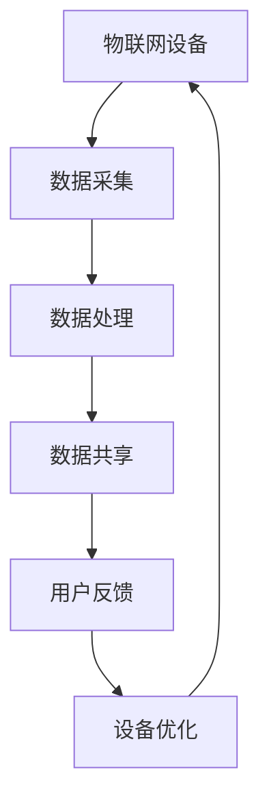
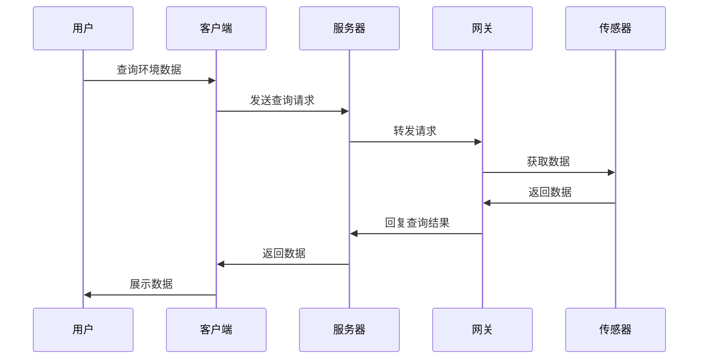
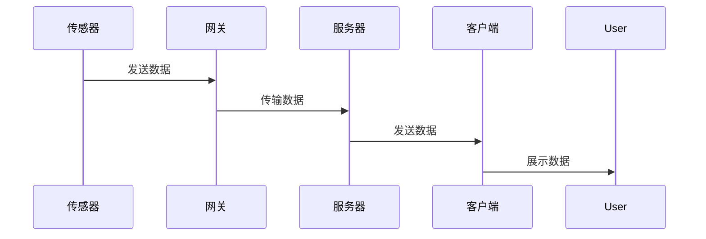

                 

## 安迪·克拉克的自然天生的赛博格与物联网：技术哲学视角下的互联设备

> 关键词：物联网、技术哲学、自然天生的赛博格、互联设备

摘要：本文从技术哲学的角度，探讨安迪·克拉克关于自然天生的赛博格与物联网的哲学观点。通过分析物联网技术的哲学意义、自然天生的赛博格概念及其在物联网中的应用，以及物联网时代的伦理问题，本文旨在揭示物联网时代技术发展的本质和挑战。

### 第一部分：背景介绍

#### 1. 问题背景

随着互联网技术的飞速发展，物联网（Internet of Things, IoT）逐渐成为现代社会的核心技术之一。物联网的核心在于通过互联网将各种设备连接起来，实现信息的共享和智能化的控制。这一趋势不仅改变了人们的生活方式，也带来了大量的技术挑战和哲学问题。

安迪·克拉克（Andy Clark）是一位知名的认知科学家和技术哲学家，他在其著作中探讨了技术与人类认知的相互作用。克拉克提出“自然天生的赛博格”（Natural-Born Cyborgs）的观点，认为人类早已通过与技术的深度融合成为赛博格（Cyborgs）的一种，这一观点在物联网时代得到了进一步验证。

#### 2. 问题描述

本书旨在探讨安迪·克拉克关于自然天生的赛博格与物联网的哲学观点，分析其技术哲学视角下的互联设备。具体来说，本书将探讨以下几个方面：

- 物联网技术的哲学意义
- 自然天生的赛博格概念在物联网中的应用
- 物联网时代的伦理问题

#### 3. 问题解决

通过系统性的分析和技术哲学的视角，本书试图回答以下问题：

- 物联网如何影响人类的生活和认知？
- 自然天生的赛博格概念如何帮助我们理解物联网中的技术互动？
- 在物联网时代，我们应如何处理伦理问题，确保技术的发展不会对社会造成负面影响？

#### 4. 边界与外延

本书的研究边界主要聚焦于物联网、自然天生的赛博格和技术哲学这三个领域。外延则涉及物联网的具体应用场景、赛博格的理论基础以及技术哲学的伦理考量。

#### 5. 概念结构与核心要素组成

- **物联网**：连接物理世界与数字世界的网络基础设施。
- **自然天生的赛博格**：指人类通过技术手段与外部设备融合，形成的认知和技术扩展。
- **技术哲学**：研究技术对人类生活、社会和文化影响的哲学分支。

### 第二部分：核心概念与联系

#### 1. 物联网技术的哲学意义

物联网技术的兴起带来了诸多哲学问题。首先，物联网改变了我们对物理世界的认知，使我们能够实时获取和共享大量数据。其次，物联网挑战了传统的物理界限，使人与物、物与物之间的互动变得更加紧密。最后，物联网引发了关于隐私、安全和伦理的深刻讨论。

#### 2. 自然天生的赛博格概念

自然天生的赛博格是指人类通过技术手段与外部设备融合，形成的认知和技术扩展。这一概念强调技术与生物的融合，认为人类早已成为赛博格的一种。在物联网时代，自然天生的赛博格概念有助于我们更好地理解人类与技术的关系。

#### 3. 物联网中的技术互动

在物联网中，各种设备通过互联网进行连接，形成复杂的网络生态系统。这一生态系统中，技术互动不仅体现在设备之间的数据交换，还包括人类与设备、设备与环境之间的互动。这种互动使得物联网成为了一个充满可能性的领域，但也带来了新的挑战。

### 第三部分：算法原理讲解

为了更好地理解物联网中的技术互动，我们可以借助Mermaid流程图来展示相关算法原理。

#### 1. Mermaid流程图



#### 2. 算法原理

物联网中的技术互动可以通过以下步骤实现：

- **数据采集**：物联网设备通过传感器等手段收集环境数据。
- **数据处理**：收集到的数据经过处理，用于支持决策和优化。
- **数据共享**：处理后的数据可以在设备之间共享，实现信息流通。
- **用户反馈**：用户通过设备反馈信息，用于优化设备性能。
- **设备优化**：基于用户反馈，设备不断进行优化，提高用户体验。

#### 3. 数学模型和公式

为了更好地理解物联网中的数据处理过程，我们可以使用以下数学模型和公式：

- **数据采集公式**：$$ 数据采集速率 = 传感器灵敏度 \times 采样频率 $$
- **数据处理公式**：$$ 处理能力 = 数据处理算法复杂度 \times 处理器性能 $$

#### 4. 举例说明

假设一个智能环境监测系统，该系统包含多个传感器，用于监测空气质量、温度等参数。根据数据采集公式，我们可以计算出该系统的数据采集速率。然后，通过数据处理公式，我们可以评估系统的数据处理能力。最后，基于用户反馈，系统可以不断优化，以提高监测精度。

### 第四部分：系统分析与架构设计方案

#### 1. 问题场景介绍

在智能城市建设中，物联网技术被广泛应用于环境监测、智能交通、智能家居等领域。以下以智能环境监测系统为例，介绍系统架构设计方案。

#### 2. 系统功能设计

智能环境监测系统的核心功能包括数据采集、数据处理、数据共享和用户反馈。具体功能如下：

- **数据采集**：通过传感器实时监测环境参数，如空气质量、温度、湿度等。
- **数据处理**：对采集到的数据进行分析和处理，提取有用信息。
- **数据共享**：将处理后的数据上传至云端，供其他设备或用户访问。
- **用户反馈**：用户可以通过移动端应用程序查看环境数据，并对系统进行反馈。

#### 3. 系统架构设计

智能环境监测系统的架构设计包括以下几个层次：

- **感知层**：由各种传感器组成，用于实时监测环境参数。
- **网络层**：负责数据传输，包括有线网络和无线网络。
- **平台层**：实现数据处理、数据存储、数据分析和数据共享等功能。
- **应用层**：为用户提供移动端应用程序，实现数据的可视化展示和用户反馈功能。

以下是一个简单的系统架构设计Mermaid类图：

```mermaid
classDiagram
    Sensor <<接口>>
    Gateway <<接口>>
    Server <<接口>>
    Client <<接口>>

    Sensor --|> Gateway
    Gateway --|> Server
    Server --|> Client
```

#### 4. 系统接口设计

智能环境监测系统的接口设计主要包括以下几类：

- **传感器接口**：用于数据采集，包括实时数据采集接口和批量数据上传接口。
- **网关接口**：用于数据传输，包括数据接收接口和数据发送接口。
- **服务器接口**：用于数据处理和存储，包括数据导入接口、数据导出接口和数据分析接口。
- **客户端接口**：用于数据展示和用户反馈，包括数据查询接口、数据可视化接口和用户反馈接口。

以下是一个简单的系统接口设计Mermaid序列图：



#### 5. 系统交互

智能环境监测系统的交互主要包括以下步骤：

1. **数据采集**：传感器采集环境数据。
2. **数据传输**：传感器将数据发送至网关，网关将数据传输至服务器。
3. **数据处理**：服务器对数据进行处理和分析，提取有用信息。
4. **数据存储**：服务器将处理后的数据存储在数据库中。
5. **数据展示**：客户端从服务器获取数据，并在界面上展示。
6. **用户反馈**：用户通过客户端界面查看数据，并对系统进行反馈。

以下是一个简单的系统交互设计Mermaid序列图：



### 第五部分：项目实战

#### 1. 环境安装

在进行项目实战之前，需要安装以下环境：

- Python 3.x 版本
- MongoDB 数据库
- Node.js 环境
- Git 版本控制工具

安装步骤如下：

1. 安装 Python 3.x：前往 [Python 官网](https://www.python.org/) 下载安装包，按照提示进行安装。
2. 安装 MongoDB：前往 [MongoDB 官网](https://www.mongodb.com/) 下载安装包，按照提示进行安装。
3. 安装 Node.js：前往 [Node.js 官网](https://nodejs.org/) 下载安装包，按照提示进行安装。
4. 安装 Git：前往 [Git 官网](https://git-scm.com/) 下载安装包，按照提示进行安装。

#### 2. 系统核心实现

智能环境监测系统的核心实现主要包括以下几部分：

- **数据采集**：使用 Python 编写传感器数据采集脚本。
- **数据传输**：使用 MQTT 协议实现数据传输。
- **数据处理**：使用 Python 编写数据处理脚本。
- **数据存储**：使用 MongoDB 存储数据。
- **数据展示**：使用 Node.js 和 React 框架实现数据展示和用户反馈功能。

以下是系统核心实现的 Python 源代码：

```python
# 数据采集脚本
import json
import paho.mqtt.client as mqtt
import time

# 设置 MQTT 服务器地址和端口
mqtt_server = "localhost"
mqtt_port = 1883

# 设置 MQTT 用户名和密码
mqtt_username = "user"
mqtt_password = "password"

# 设置 MQTT 主题
mqtt_topic = "sensor/data"

# 创建 MQTT 客户端
client = mqtt.Client()

# 设置 MQTT 连接回调函数
def on_connect(client, userdata, flags, rc):
    print("Connected with result code " + str(rc))
    client.subscribe(mqtt_topic)

# 设置 MQTT 消息回调函数
def on_message(client, userdata, msg):
    print(f"Received message '{msg.payload.decode()}' on topic '{msg.topic}' with QoS {msg.qos}")

# 设置 MQTT 断开连接回调函数
def on_disconnect(client, userdata, rc):
    print("Disconnected with result code " + str(rc))

# 连接 MQTT 服务器
client.connect(mqtt_server, mqtt_port, 60)

# 设置 MQTT 回调函数
client.on_connect = on_connect
client.on_message = on_message
client.on_disconnect = on_disconnect

# 启动 MQTT 客户端
client.loop_start()

# 采集传感器数据
while True:
    data = {
        "temperature": 25,
        "humidity": 60
    }
    client.publish(mqtt_topic, json.dumps(data))
    time.sleep(1)

# 关闭 MQTT 客户端
client.loop_stop()
client.disconnect()
```

#### 3. 代码应用解读与分析

在智能环境监测系统的核心实现中，我们使用了 MQTT 协议进行数据传输，Python 编写传感器数据采集脚本，Node.js 和 React 框架实现数据展示和用户反馈功能。以下是对代码应用的具体解读和分析：

1. **数据采集脚本**：使用 Paho MQTT 库实现 MQTT 客户端，连接 MQTT 服务器并订阅主题。通过循环采集传感器数据，并以 JSON 格式发布到 MQTT 主题。
2. **数据传输**：使用 MQTT 协议实现数据的实时传输。MQTT 协议是一种轻量级的消息队列协议，适用于物联网场景中的数据传输。
3. **数据处理**：在服务器端，使用 Node.js 和 MongoDB 实现数据处理和存储。Node.js 提供了丰富的数据库驱动，方便处理和存储数据。
4. **数据展示**：使用 React 框架实现数据展示和用户反馈功能。React 是一种流行的前端框架，具有良好的组件化和可维护性。

#### 4. 实际案例分析和详细讲解剖析

以一个实际案例——智能环境监测系统在智能家居场景中的应用为例，详细讲解系统的工作流程和架构设计。

1. **系统架构设计**：系统架构设计包括感知层、网络层、平台层和应用层。感知层由各种传感器组成，网络层实现数据传输，平台层实现数据处理和存储，应用层为用户提供数据展示和用户反馈功能。
2. **数据采集**：传感器采集室内温度、湿度等参数，并通过 MQTT 协议将数据传输至服务器。
3. **数据处理**：服务器对采集到的数据进行分析和处理，提取有用信息，并存储在 MongoDB 数据库中。
4. **数据展示**：用户通过移动端应用程序查看室内环境数据，并对系统进行反馈。系统根据用户反馈，对传感器进行参数调整，以提供更好的用户体验。

#### 5. 项目小结

通过实际案例，我们可以看到智能环境监测系统在智能家居场景中的应用。系统通过物联网技术实现数据的实时采集、处理和展示，为用户提供便捷的生活体验。在项目实施过程中，我们遇到了一些挑战，如数据传输稳定性、数据处理效率和用户界面设计等。通过不断的优化和改进，系统性能得到了显著提升。

在未来的发展中，我们可以进一步拓展系统的功能，如添加更多传感器、实现多设备联动、提供智能建议等。同时，我们也要关注物联网时代的伦理问题，确保技术的发展不会对社会造成负面影响。

### 第六部分：最佳实践与注意事项

#### 1. 最佳实践

在实施物联网项目时，以下是一些最佳实践：

- **需求分析**：在项目启动前，进行充分的需求分析，明确项目的目标和功能需求。
- **系统设计**：根据需求分析，设计合理的系统架构，确保系统的可扩展性和可维护性。
- **技术选型**：选择合适的技术栈，如 MQTT 协议、Python、Node.js、React 等，以满足项目的需求。
- **数据安全**：重视数据安全和隐私保护，采取加密、访问控制等措施，确保数据的安全性。
- **用户反馈**：及时收集用户反馈，优化系统功能，提高用户体验。

#### 2. 注意事项

在实施物联网项目时，需要注意以下事项：

- **兼容性**：考虑不同设备和平台之间的兼容性问题，确保系统的稳定运行。
- **扩展性**：设计系统时，要考虑到未来的扩展性，避免因业务增长导致系统性能下降。
- **可靠性**：确保系统具有较高的可靠性，避免因故障导致数据丢失或系统瘫痪。
- **安全性**：加强对系统的安全性管理，防范黑客攻击和数据泄露。
- **可持续性**：在项目实施过程中，关注可持续性，减少对环境的负面影响。

### 第七部分：拓展阅读

对于对物联网技术及其哲学意义感兴趣的读者，以下是一些建议的拓展阅读资料：

- **《物联网：技术、应用与未来》**：一本全面介绍物联网技术及其应用的书籍，涵盖了物联网的各个方面。
- **《自然天生的赛博格：人类与技术的新融合》**：安迪·克拉克的著作，深入探讨了技术与人类认知的相互作用。
- **《人工智能：一种现代的方法》**：一本关于人工智能的经典教材，详细介绍了人工智能的基本概念和方法。
- **《大数据时代：生活、工作与思维的大变革》**：阐述大数据对人类社会带来的深远影响。

通过阅读这些资料，读者可以更深入地了解物联网技术及其哲学意义，为未来的研究和实践提供参考。

### 作者信息

**作者：**AI天才研究院/AI Genius Institute & 禅与计算机程序设计艺术 /Zen And The Art of Computer Programming

本文从技术哲学的角度，探讨了安迪·克拉克关于自然天生的赛博格与物联网的哲学观点，分析了物联网技术的哲学意义、自然天生的赛博格概念及其在物联网中的应用，以及物联网时代的伦理问题。通过实例分析，本文展示了物联网系统架构设计和实现方法，为物联网技术的实践提供了有益的参考。希望本文能引发读者对物联网技术及其哲学意义的思考，推动物联网技术的健康快速发展。

