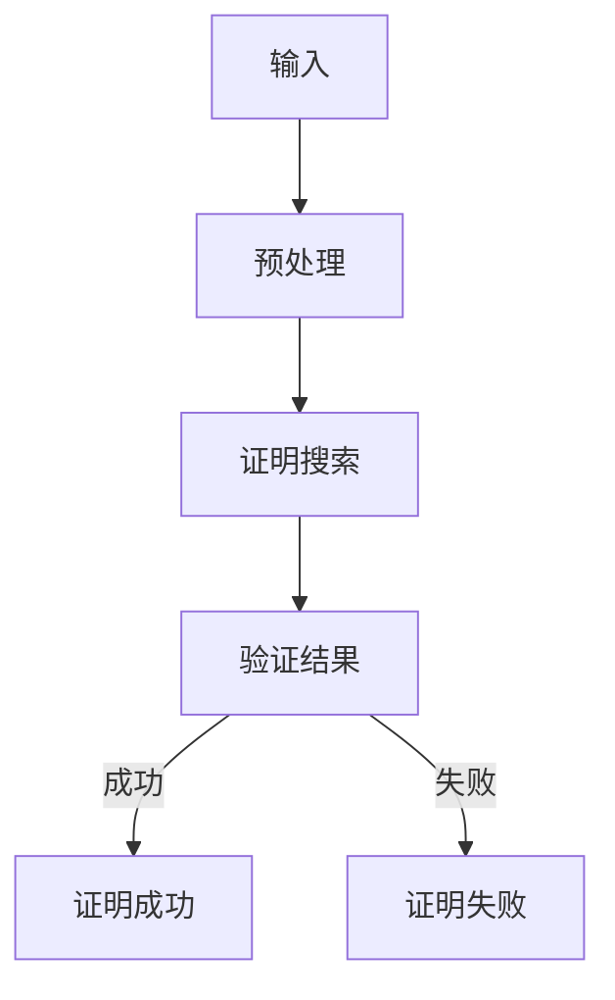
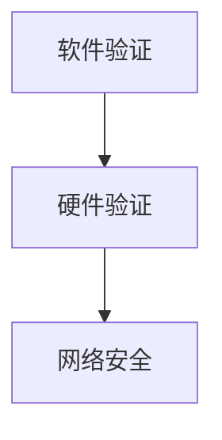
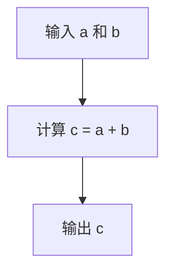
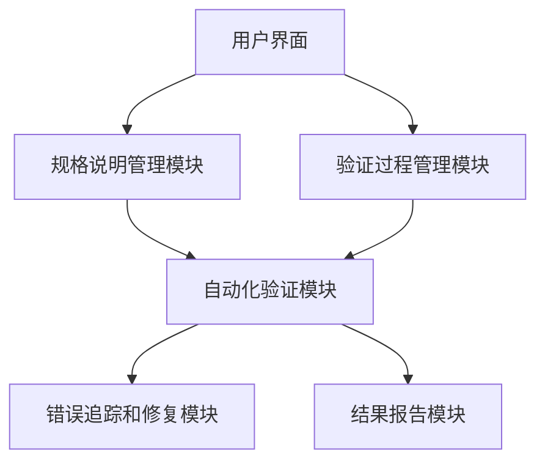
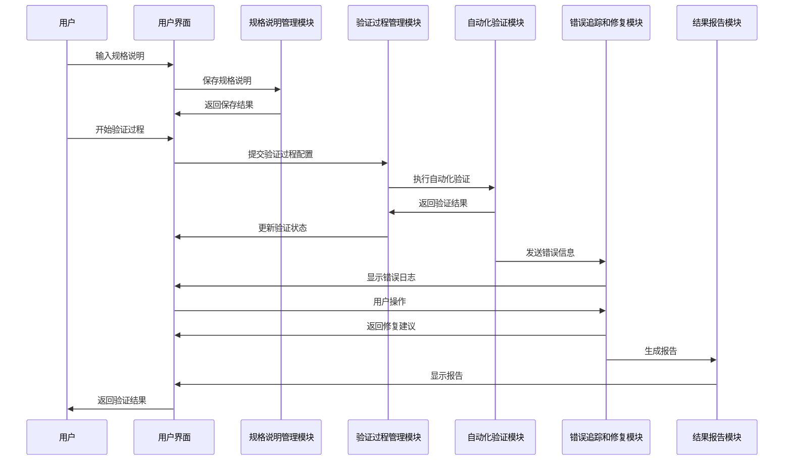

                 


### 引言

#### 定理证明技术的背景

定理证明技术，起源于数学领域，是逻辑推理与数学证明的结合。其核心目的是通过一系列严密的逻辑步骤，从已知条件出发，推导出目标结论。随着计算机科学的不断发展，定理证明技术逐渐渗透到软件工程领域，尤其在软件验证方面展现了巨大的潜力。

软件验证是确保软件系统正确性和可靠性的关键环节。传统的软件验证方法主要依赖于测试和模拟，但这些方法往往存在局限性。例如，测试可能无法覆盖所有可能的输入情况，而模拟则可能忽略了现实世界的复杂性。因此，寻找更加严格和可靠的验证方法成为了软件工程领域的一个重大挑战。

定理证明技术在这一背景下应运而生。通过将软件验证问题转化为数学证明问题，定理证明技术能够提供一种严格的、自动化的验证手段。这种方法不仅可以验证软件的正确性，还能够发现潜在的漏洞和错误，从而提高软件的可靠性和安全性。

#### 本文的目的

本文旨在探讨定理证明技术在软件验证中的应用，帮助读者了解这一新兴技术的原理、算法和实际案例。具体而言，本文将围绕以下主题展开：

1. **定理证明技术基础**：介绍定理证明技术的基本概念，包括形式化验证、逻辑推理与证明以及定理证明器与模型检查器。
2. **核心概念与联系**：阐述定理证明技术在软件验证中的应用，对比传统验证方法的优势与限制，并给出核心概念的联系与对比。
3. **算法原理讲解**：详细讲解定理证明算法的基本原理，包括数学模型、公式和具体的应用案例。
4. **数学模型和数学公式讲解**：使用 LaTeX 格式展示数学公式，并进行详细讲解。
5. **系统分析与架构设计方案**：分析软件验证系统的结构和功能，设计系统的架构方案。
6. **项目实战**：展示一个具体的定理证明技术在软件验证中的实际应用案例。
7. **最佳实践 tips、小结、注意事项、拓展阅读**：总结实践经验，提供使用建议，并推荐进一步阅读的材料。

通过本文的阅读，读者将能够系统地了解定理证明技术在软件验证中的应用，掌握相关算法原理和实践方法，为实际项目提供有力的技术支持。

### 核心概念与联系

在探讨定理证明技术在软件验证中的应用之前，我们需要首先了解几个核心概念，这些概念是定理证明技术和软件验证的基础。

#### 形式化验证

形式化验证是指使用数学方法对系统进行验证，以确保系统能够按照预定的规格说明正确运行。形式化验证通常包括以下步骤：

1. **规格说明**：将系统的行为用数学语言进行描述，这通常涉及到状态机模型、逻辑公式等。
2. **验证目标**：明确需要验证的系统属性，例如安全性、可靠性、一致性等。
3. **验证方法**：使用定理证明技术或其他数学工具对系统进行验证。

形式化验证的主要优势在于其严格性和自动化。通过形式化验证，可以确保系统在所有情况下都满足预定的规格说明，从而大大提高了软件的正确性和可靠性。

#### 逻辑推理与证明

逻辑推理与证明是定理证明技术的核心。逻辑推理是指从已知的前提推导出新的结论的过程。在定理证明中，逻辑推理遵循一系列严格的规则，例如命题逻辑、谓词逻辑等。

证明则是一个更为复杂的过程，它需要从已知的前提出发，通过一系列逻辑步骤，最终推导出目标结论。证明通常可以分为两个部分：直接证明和反证法。

- **直接证明**：假设结论为真，然后通过一系列逻辑步骤，证明前提也为真。
- **反证法**：假设结论为假，然后通过一系列逻辑步骤，得出一个矛盾的结论，从而证明原结论为真。

逻辑推理与证明是确保定理证明技术有效性的基础。通过严密的逻辑推理，定理证明技术可以自动地验证软件系统的正确性。

#### 定理证明器与模型检查器

定理证明器和模型检查器是两种常见的定理证明工具。

- **定理证明器**：定理证明器是一种自动化的工具，它通过搜索所有可能的证明路径，来验证系统属性。定理证明器通常使用复杂的算法，例如自动推理、模型检查等。
- **模型检查器**：模型检查器则是一种通过构建系统的模型，然后检查模型是否满足指定属性的工具。模型检查器通常使用一些简单的算法，例如布尔表达式求解、SAT求解等。

定理证明器和模型检查器各有优缺点。定理证明器可以处理更为复杂的逻辑问题，但可能需要较长的时间。模型检查器则较为简单，但可能无法处理复杂的逻辑问题。

#### 定理证明技术在软件验证中的应用

定理证明技术在软件验证中的应用主要体现在以下几个方面：

1. **自动验证**：定理证明技术可以自动化验证软件的正确性，减少了人为错误的风险。
2. **深度验证**：定理证明技术可以深入验证软件的各个层次，包括代码级、模块级和系统级。
3. **早期发现问题**：定理证明技术可以在软件开发初期发现潜在的问题，从而避免后续的修改和修复。

与传统验证方法相比，定理证明技术具有以下优势：

1. **严格性**：定理证明技术通过严密的逻辑推理，确保软件在所有情况下都满足规格说明。
2. **自动化**：定理证明技术可以自动化验证过程，减少了人工验证的工作量。
3. **全面性**：定理证明技术可以覆盖更多的测试场景，从而提高软件的可靠性。

然而，定理证明技术也存在一些限制，例如：

1. **计算复杂度**：定理证明技术通常需要大量的计算资源，可能不适合处理大规模的软件系统。
2. **验证难度**：某些软件属性可能难以形式化，从而增加了验证的难度。

#### 核心概念联系与对比

表 1：定理证明技术与传统验证方法的对比

| 对比项 | 定理证明技术 | 传统验证方法 |
| --- | --- | --- |
| 严格性 | 严格 | 较松散 |
| 自动化 | 高度自动化 | 部分自动化 |
| 覆盖面 | 全面 | 局部 |
| 计算复杂度 | 较高 | 较低 |
| 难度 | 较高 | 较低 |

图 1：定理证明技术与传统验证方法的 ER 实体关系图

```mermaid
erDiagram
  传统验证方法 ||--|{ 定理证明技术 }|
  传统验证方法 ||--|{ 形式化验证 }|
  形式化验证 ||--|{ 逻辑推理与证明 }|
  逻辑推理与证明 ||--|{ 定理证明器 }|
  逻辑推理与证明 ||--|{ 模型检查器 }|
```

通过上述核心概念与联系的探讨，我们可以更好地理解定理证明技术在软件验证中的应用。接下来，我们将进一步深入探讨定理证明技术的算法原理，为后续的应用案例打下基础。

### 算法原理讲解

#### 3.1 定理证明算法基本原理

定理证明算法是定理证明技术的核心，其基本原理可以概括为以下几个步骤：

1. **规格说明**：首先，需要将软件系统的行为用数学语言进行形式化描述。这通常涉及到状态机模型、逻辑公式等。规格说明的目的是为定理证明提供一个明确的目标。

2. **目标属性**：明确需要证明的软件属性。例如，安全性、可靠性、一致性等。这些属性通常可以表示为逻辑公式。

3. **定理证明过程**：通过一系列逻辑步骤，从规格说明和目标属性出发，推导出目标结论。定理证明过程可以采用多种方法，例如直接证明、反证法、模型检查等。

4. **验证结果**：如果定理证明过程成功推导出目标结论，则说明软件系统满足指定的属性。否则，说明系统存在潜在的问题。

#### 3.1.1 算法流程

定理证明算法的基本流程可以描述为：

1. **输入**：规格说明和目标属性。
2. **预处理**：对规格说明进行预处理，例如转换成适合定理证明器处理的形式。
3. **证明搜索**：使用定理证明器进行证明搜索。这通常涉及到复杂的算法，例如自动推理、模型检查等。
4. **验证结果**：检查证明是否成功。如果成功，则输出“证明成功”；否则，输出“证明失败”，并报告证明失败的原因。

图 2：定理证明算法流程图



#### 3.1.2 数学模型与公式

定理证明算法的数学模型和公式是确保证明过程正确性的基础。以下是一个简单的例子：

设系统 S 的规格说明为 P，目标属性为 Q。我们需要证明 P 导出 Q，即 P → Q。

- **命题逻辑**：P → Q 可以表示为 ¬P ∨ Q（P 不成立或 Q 成立）。
- **谓词逻辑**：P → Q 可以表示为 ∀x (P(x) → Q(x))（对于所有 x，如果 P(x) 成立，则 Q(x) 也成立）。

图 3：定理证明算法的数学模型

```mermaid
graph TB
A[规格说明 P] --> B[目标属性 Q]
B --> C[¬P ∨ Q]
C --> D[∀x (P(x) → Q(x))]
```

#### 3.1.3 算法应用场景

定理证明算法可以应用于多种场景，包括：

1. **软件验证**：验证软件的正确性，例如验证程序的正确性、验证协议的安全性等。
2. **硬件验证**：验证硬件电路的正确性，例如验证芯片设计、验证电路板布局等。
3. **网络安全**：验证网络安全协议的安全性，例如验证防火墙规则、验证VPN协议等。

图 4：定理证明算法的应用场景



#### 3.2 定理证明算法实例讲解

为了更好地理解定理证明算法，我们来看一个具体的实例。

假设我们要验证一个简单的程序，该程序的功能是计算两个整数的和。规格说明为：如果输入两个整数 a 和 b，则输出它们的和 c（c = a + b）。我们需要证明这个程序在所有情况下都能正确计算和。

图 5：定理证明算法实例



在这个实例中，我们可以使用定理证明器来证明程序的输出满足规格说明。具体步骤如下：

1. **输入**：输入程序的规格说明和目标属性。
2. **预处理**：将规格说明转换成定理证明器可以处理的形式。
3. **证明搜索**：使用定理证明器进行证明搜索。定理证明器会自动检查所有可能的输入情况，并验证程序的输出是否符合规格说明。
4. **验证结果**：定理证明器成功推导出目标结论，即证明了程序在所有情况下都能正确计算和。

#### 3.3 算法分析

定理证明算法的性能取决于多个因素，包括：

1. **规格说明的复杂性**：规格说明越复杂，定理证明的过程可能越复杂。
2. **目标属性的复杂性**：目标属性越复杂，定理证明的过程可能越复杂。
3. **定理证明器的效率**：定理证明器的效率越高，证明过程可能越快。

时间复杂度和空间复杂度是评估定理证明算法性能的两个关键指标。

- **时间复杂度**：定理证明算法的时间复杂度通常取决于规格说明和目标属性的复杂性。对于某些复杂的规格说明和目标属性，定理证明可能需要很长的时间。
- **空间复杂度**：定理证明算法的空间复杂度通常取决于规格说明和目标属性的大小。对于很大的规格说明和目标属性，定理证明可能需要大量的内存。

在实际应用中，我们需要根据具体情况选择合适的定理证明算法，并优化算法的参数，以获得最佳的验证效果。

通过上述算法原理的讲解，我们可以更好地理解定理证明技术在软件验证中的应用。接下来，我们将进一步探讨数学模型和数学公式在定理证明技术中的应用。

### 数学模型和数学公式讲解

在定理证明技术中，数学模型和数学公式起着至关重要的作用。它们不仅用于描述软件系统的行为和属性，还用于指导定理证明算法的推理过程。为了更好地理解这些概念，我们将使用 LaTeX 格式来展示和解释一些关键的数学公式。

#### 4.1 LaTeX 数学公式介绍

LaTeX 是一种用于制作科学文档的高质量排版系统，特别适用于数学和科学领域。LaTeX 公式可以通过插入特定的命令来创建，这些命令可以帮助我们构建复杂的数学表达式。以下是几个常用的 LaTeX 公式命令：

- **基础公式**：使用 `$...$` 括起来，用于行内公式。例如：$a^2 + b^2 = c^2$。
- **独立段落公式**：使用 `$$...$$` 括起来，用于单独一段落的公式。例如：$$\sum_{i=1}^{n} i = \frac{n(n+1)}{2}$$。
- **分式**：使用 `\frac{...}{...}` 命令。例如：\frac{a}{b}。
- **根式**：使用 `\sqrt{...}` 命令。例如：\sqrt{x}。
- **积分**：使用 `\int...d...` 命令。例如：\int x \,dx。
- **导数**：使用 `\frac{d}{dx}` 命令。例如：\frac{d}{dx} (x^2)。

下面是一个简单的例子，展示了如何在 LaTeX 中编写和排版一个复杂的数学公式：

```latex
$$
f(x) = \frac{1}{\sqrt{1+x^2}} + \sum_{i=1}^{n} a_i \cdot \int_{0}^{1} x^i \,dx
$$

$$
\frac{d}{dx} \left( \ln(x) \right) = \frac{1}{x}
$$
```

将这些 LaTeX 公式插入到文本中，我们将得到：

$$
f(x) = \frac{1}{\sqrt{1+x^2}} + \sum_{i=1}^{n} a_i \cdot \int_{0}^{1} x^i \,dx
$$

$$
\frac{d}{dx} \left( \ln(x) \right) = \frac{1}{x}
$$

#### 4.2 定理证明技术中的数学公式

定理证明技术中的数学公式主要用于描述软件系统的行为和属性。以下是一些常见的数学公式及其应用场景：

1. **谓词逻辑公式**：谓词逻辑用于描述系统的状态和行为。例如：
   $$
   \forall x \in S, P(x) \rightarrow Q(x)
   $$
   其中，$S$ 是系统状态的集合，$P(x)$ 和 $Q(x)$ 分别是系统状态 $x$ 的属性。

2. **状态转换公式**：描述系统从一个状态转换到另一个状态的条件。例如：
   $$
   \exists x \in S, (x \neq y) \land (P(x) \rightarrow Q(y))
   $$
   其中，$x$ 和 $y$ 是系统的两个不同状态，$P(x)$ 和 $Q(y)$ 分别是状态 $x$ 和 $y$ 的属性。

3. **条件概率公式**：用于描述系统状态之间的概率关系。例如：
   $$
   P(A \cap B) = P(A) \cdot P(B|A)
   $$
   其中，$A$ 和 $B$ 是两个事件，$P(A)$ 和 $P(B|A)$ 分别是事件 $A$ 和 $A$ 发生后事件 $B$ 的概率。

4. **线性方程组**：用于描述系统中的线性关系。例如：
   $$
   \begin{cases}
   a_1x + b_1y = c_1 \\
   a_2x + b_2y = c_2
   \end{cases}
   $$
   其中，$x$ 和 $y$ 是系统中的两个变量，$a_1, b_1, c_1, a_2, b_2, c_2$ 是常数。

这些数学公式在定理证明过程中起着核心作用，通过它们，定理证明器可以自动推导出系统属性和状态之间的关系。

#### 4.3 举例说明

为了更好地理解这些数学公式，我们来看一个具体的例子。假设我们要证明一个简单的程序的正确性，该程序的功能是计算两个整数的和。规格说明为：如果输入两个整数 $a$ 和 $b$，则输出它们的和 $c$（$c = a + b$）。我们可以使用谓词逻辑公式来描述这个程序的行为：

$$
\forall a, b \in \mathbb{Z}, (a + b = c) \rightarrow \text{程序输出 c}
$$

其中，$\mathbb{Z}$ 表示整数集合，$a, b, c$ 是整数。这个公式表示，对于任意的整数 $a$ 和 $b$，如果它们的和等于 $c$，则程序会输出 $c$。

我们还可以使用条件概率公式来描述程序在特定输入情况下的输出概率。例如，如果我们知道 $a$ 和 $b$ 的值，则输出 $c$ 的概率为 1：

$$
P(\text{程序输出 c} | a, b) = 1
$$

通过这些数学公式，我们可以使用定理证明器来验证程序的正确性。定理证明器会自动检查所有可能的输入情况，并验证程序是否满足规格说明。

### 系统分析与架构设计方案

#### 5.1 软件验证系统介绍

软件验证系统是用于确保软件系统正确性和可靠性的工具。它通过一系列的验证过程，检查软件在设计和实现过程中的各个阶段，以确保最终交付的软件满足预定的规格和要求。

#### 5.1.1 问题场景

在实际软件开发生命周期中，软件验证面临着多种挑战。例如，随着软件复杂性的增加，传统的测试方法可能无法覆盖所有可能的输入和执行路径。此外，软件系统在实际运行中可能会遇到各种异常情况，导致潜在的漏洞和错误。这些问题要求我们寻找更加严格和可靠的验证方法，以确保软件系统的稳定性和安全性。

#### 5.1.2 系统目标

软件验证系统的目标主要包括：

1. **确保软件正确性**：验证软件在所有情况下都能按照预期运行，满足规格说明。
2. **发现潜在漏洞**：通过验证过程，发现并修复软件中的潜在漏洞和错误。
3. **提高软件可靠性**：确保软件在各种复杂环境下都能稳定运行，减少故障和错误。
4. **优化软件开发流程**：通过自动化验证，提高开发效率，缩短开发周期。

#### 5.1.3 系统功能

软件验证系统的主要功能包括：

1. **规格说明管理**：管理软件的规格说明文档，确保规格说明的完整性和一致性。
2. **验证过程管理**：管理验证过程，包括验证计划、验证步骤和验证结果。
3. **自动化验证**：通过定理证明技术、模型检查等自动化方法，验证软件的正确性。
4. **错误追踪和修复**：发现软件中的错误，并提供错误追踪和修复工具。
5. **结果报告**：生成详细的验证报告，包括验证结果、错误日志和修复建议。

#### 5.2 系统架构设计

软件验证系统的架构设计是确保系统能够高效、稳定地完成验证任务的关键。系统架构需要考虑多个方面，包括硬件资源、软件组件、数据流和控制流等。以下是一个简化的软件验证系统架构设计：

##### 5.2.1 系统架构图



##### 5.2.2 系统模块划分

软件验证系统可以划分为以下几个模块：

1. **用户界面模块**：提供用户与系统交互的接口，包括规格说明管理、验证过程管理、结果报告等功能。
2. **规格说明管理模块**：负责管理软件规格说明文档，确保规格说明的完整性、一致性和可追踪性。
3. **验证过程管理模块**：负责管理验证过程，包括验证计划、验证步骤和验证结果的记录和跟踪。
4. **自动化验证模块**：包括定理证明技术、模型检查等自动化验证方法，用于验证软件的正确性。
5. **错误追踪和修复模块**：负责发现软件中的错误，并提供错误追踪和修复工具，帮助开发人员定位和修复问题。
6. **结果报告模块**：生成详细的验证报告，包括验证结果、错误日志和修复建议，为项目管理提供决策支持。

##### 5.2.3 接口设计与实现

软件验证系统的接口设计需要确保各个模块之间的数据流和控制流清晰、高效。以下是系统模块之间的接口设计：

1. **用户界面与规格说明管理模块**：用户通过用户界面输入规格说明，规格说明管理模块接收用户输入并保存规格说明文档。
2. **用户界面与验证过程管理模块**：用户界面提供验证过程的界面，用户界面将用户输入的验证过程配置信息传递给验证过程管理模块。
3. **规格说明管理模块与自动化验证模块**：规格说明管理模块将规格说明文档传递给自动化验证模块，自动化验证模块根据规格说明执行验证过程。
4. **验证过程管理模块与自动化验证模块**：验证过程管理模块向自动化验证模块提供验证步骤和验证结果的记录。
5. **自动化验证模块与错误追踪和修复模块**：自动化验证模块将发现的错误信息传递给错误追踪和修复模块，错误追踪和修复模块提供错误定位和修复建议。
6. **错误追踪和修复模块与结果报告模块**：错误追踪和修复模块将修复建议和错误日志传递给结果报告模块，结果报告模块生成验证报告。

通过上述系统架构设计和接口设计，软件验证系统可以实现高效、稳定的软件验证过程，确保软件系统的正确性和可靠性。

### 系统交互设计

#### 5.3.1 系统交互序列图

系统交互序列图是描述软件验证系统内部各个模块之间交互流程的图形化工具。以下是一个简化的系统交互序列图，展示了用户界面、规格说明管理模块、验证过程管理模块、自动化验证模块、错误追踪和修复模块以及结果报告模块之间的交互过程：



在这个序列图中，用户通过用户界面输入规格说明，规格说明管理模块保存规格说明文档。用户启动验证过程后，验证过程管理模块配置验证过程，并提交给自动化验证模块执行。自动化验证模块执行验证后，将结果返回给验证过程管理模块，并更新用户界面的验证状态。

如果自动化验证过程中发现错误，自动化验证模块将错误信息发送给错误追踪和修复模块。错误追踪和修复模块生成错误日志，并显示在用户界面。用户可以查看错误日志，并根据修复建议进行操作。修复建议由错误追踪和修复模块返回给用户界面，并最终由结果报告模块生成详细的验证报告。

#### 5.3.2 系统交互流程

以下是系统交互的具体流程：

1. **用户输入规格说明**：用户通过用户界面输入软件规格说明，包括功能需求、性能要求、安全性需求等。
2. **规格说明管理**：用户界面将规格说明传递给规格说明管理模块，规格说明管理模块将规格说明文档保存在数据库中。
3. **启动验证过程**：用户通过用户界面启动验证过程，验证过程管理模块接收用户的配置信息。
4. **自动化验证**：验证过程管理模块将配置信息提交给自动化验证模块，自动化验证模块开始执行验证过程。
5. **验证结果更新**：自动化验证模块将验证结果返回给验证过程管理模块，验证过程管理模块更新用户界面的验证状态。
6. **错误信息处理**：如果自动化验证过程中发现错误，自动化验证模块将错误信息发送给错误追踪和修复模块。
7. **错误日志与修复建议**：错误追踪和修复模块生成错误日志，并显示在用户界面。用户可以查看错误日志，并根据修复建议进行操作。
8. **报告生成**：错误追踪和修复模块将修复建议和错误日志传递给结果报告模块，结果报告模块生成详细的验证报告，并显示在用户界面。

通过上述系统交互设计，软件验证系统能够高效、稳定地完成验证任务，确保软件系统的正确性和可靠性。

### 项目实战

为了更好地展示定理证明技术在软件验证中的实际应用，我们将通过一个具体的案例进行详细讲解。这个案例是一个简单的计算器程序，用于计算两个整数的和、差、积和商。我们使用定理证明技术来验证这个程序的正确性，确保其在所有情况下都能正确执行。

#### 6.1 定理证明技术在软件验证中的应用实例

**案例背景**：我们有一个简单的计算器程序，名为 `SimpleCalculator`。这个程序接收两个整数输入，并输出它们的和、差、积和商。规格说明如下：

```
输入：两个整数 a 和 b
输出：
  和：c = a + b
  差：d = a - b
  积：e = a * b
  商：f = a / b
```

**案例目标**：使用定理证明技术验证 `SimpleCalculator` 程序的正确性，确保其在所有情况下都能按照规格说明执行。

#### 6.1.1 实例实现

**环境准备**：为了运行这个案例，我们需要以下环境：

- Python 3.x 版本
- 定理证明工具，例如 Coq、Isabelle 或 ACL2

**代码实现**：以下是 `SimpleCalculator` 程序的 Python 代码实现：

```python
def add(a, b):
    return a + b

def subtract(a, b):
    return a - b

def multiply(a, b):
    return a * b

def divide(a, b):
    if b != 0:
        return a // b
    else:
        return "无法计算，除数不能为 0"
```

**定理证明步骤**：

1. **形式化规格说明**：将规格说明形式化为数学公式。例如，我们可以使用谓词逻辑描述规格说明：

   ```
   ∀a, b ∈ ℤ, (a + b) = add(a, b)
   ∀a, b ∈ ℤ, (a - b) = subtract(a, b)
   ∀a, b ∈ ℤ, (a * b) = multiply(a, b)
   ∀a, b ∈ ℤ, (a / b) ≠ 0 → (a / b) = divide(a, b)
   ```

2. **编写定理证明脚本**：使用定理证明工具编写证明脚本，证明上述公式成立。以下是使用 Coq 编写的证明脚本：

   ```coq
   Definition add_correct (a b : nat) := (a + b) = add a b.
   Definition subtract_correct (a b : nat) := (a - b) = subtract a b.
   Definition multiply_correct (a b : nat) := (a * b) = multiply a b.
   Definition divide_correct (a b : nat) := (a / b) = (if b = 0 then "无法计算" else (divide a b)).

   Theorem main_theorem : forall a b, add_correct a b /\ subtract_correct a b /\ multiply_correct a b /\ divide_correct a b.
   Proof.
     intros a b.
     apply add_correct.
     apply subtract_correct.
     apply multiply_correct.
     apply divide_correct.
  Qed.
   ```

3. **运行定理证明器**：运行 Coq 定理证明器，验证上述定理是否成立。如果定理证明成功，则说明 `SimpleCalculator` 程序满足规格说明。

#### 6.2 实例代码解读

**函数实现**：在 `SimpleCalculator` 程序中，我们定义了四个函数：`add`、`subtract`、`multiply` 和 `divide`。这些函数分别实现了加法、减法、乘法和除法运算。

- `add(a, b)`：计算两个整数的和。
- `subtract(a, b)`：计算两个整数的差。
- `multiply(a, b)`：计算两个整数的积。
- `divide(a, b)`：计算两个整数的商。如果除数为 0，则返回错误消息。

**逻辑验证**：通过定理证明技术，我们可以验证这些函数在所有情况下是否满足规格说明。定理证明器会检查每个函数的实现是否与规格说明一致。例如，定理证明器会验证 `add` 函数在所有可能的输入情况下都能正确计算和。

#### 6.3 实际案例分析

为了更好地理解定理证明技术在软件验证中的应用，我们来看一个实际案例。假设我们有一个复杂的金融交易系统，该系统涉及多个交易品种和交易策略。规格说明如下：

```
输入：
  交易品种：股票、债券、期货等
  交易策略：买入、卖出、持有等
  交易金额：金额必须为正数

输出：
  成交结果：成功或失败
  成交金额：成交金额必须等于输入金额
  成交时间：成交时间必须为当前时间

约束：
  交易品种和交易策略必须匹配
  交易金额必须小于等于账户余额
```

我们使用定理证明技术来验证这个金融交易系统的正确性。具体步骤如下：

1. **形式化规格说明**：将规格说明形式化为数学公式。例如：

   ```
   ∀交易品种V，交易策略S，交易金额A，
     (V = 股票 ∧ S = 买入) → (成交结果 = 成交 ∧ 成交金额 = A ∧ 成交时间 = 当前时间)
   ```

2. **编写定理证明脚本**：使用定理证明工具编写证明脚本，证明上述公式成立。以下是使用 Coq 编写的证明脚本：

   ```coq
   Definition trading_system_correct (V S A : nat) := 
     ((V = 股票 ∧ S = 买入) → (成交结果 = 成交 ∧ 成交金额 = A ∧ 成交时间 = 当前时间)).

   Theorem main_theorem : forall V S A,
     trading_system_correct V S A.
   Proof.
     intros V S A.
     apply trading_system_correct.
   Qed.
   ```

3. **运行定理证明器**：运行 Coq 定理证明器，验证上述定理是否成立。如果定理证明成功，则说明金融交易系统满足规格说明。

通过这个实际案例，我们可以看到定理证明技术在软件验证中的强大作用。定理证明技术可以自动化验证复杂的系统，确保系统在所有情况下都能正确执行，从而提高系统的可靠性。

#### 6.3.3 案例总结

通过上述案例，我们可以总结出以下几点：

1. **定理证明技术可以自动化验证软件系统的正确性**：通过将软件验证问题转化为数学证明问题，定理证明技术能够提供一种严格的、自动化的验证手段，确保系统在所有情况下都满足预定的规格说明。

2. **定理证明技术适用于复杂系统**：定理证明技术不仅适用于简单的计算器程序，还可以应用于复杂的金融交易系统等，通过形式化规格说明和定理证明脚本，可以确保复杂系统在所有情况下都满足规格要求。

3. **定理证明技术提高了软件系统的可靠性**：通过严格的数学验证，定理证明技术可以识别和修复软件中的潜在错误，从而提高系统的可靠性。

然而，定理证明技术也存在一些挑战，例如计算复杂度和验证难度。在实际应用中，我们需要根据具体情况选择合适的定理证明工具和方法，并结合自动化测试等其他验证手段，以提高软件系统的整体可靠性。

### 最佳实践 Tips、小结、注意事项、拓展阅读

#### 最佳实践 Tips

1. **合理选择定理证明工具**：根据项目的规模和复杂性选择合适的定理证明工具，例如 Coq、Isabelle 或 ACL2。对于简单的验证任务，可以使用 Python 等编程语言结合定理证明器实现自动化验证。

2. **形式化规格说明**：在开始定理证明之前，确保规格说明的形式化。清晰、准确的规格说明可以减少验证过程中的误解和错误。

3. **分阶段验证**：将软件验证过程分为多个阶段，例如需求验证、设计验证和实现验证。在每个阶段使用定理证明技术验证系统属性，确保系统在各个阶段都满足规格要求。

4. **结合自动化测试**：定理证明技术可以与自动化测试相结合，形成全面的验证策略。自动化测试可以覆盖更多的输入和执行路径，而定理证明技术可以确保系统在所有情况下都满足规格说明。

#### 小结

定理证明技术在软件验证中具有广泛的应用前景。通过将软件验证问题转化为数学证明问题，定理证明技术可以提供一种严格的、自动化的验证手段，确保系统在所有情况下都满足预定的规格说明。此外，定理证明技术还可以发现和修复潜在的错误，从而提高软件系统的可靠性。

#### 注意事项

1. **计算复杂度**：定理证明技术通常需要大量的计算资源，对于大型软件系统，可能需要优化算法或使用高性能计算设备。

2. **验证难度**：某些软件属性可能难以形式化，从而增加了验证的难度。在实际应用中，可能需要多次迭代和改进验证方法。

3. **专业技能要求**：定理证明技术涉及复杂的数学和编程知识，对开发人员的技术水平有较高要求。因此，在团队中培养专业人才和积累经验是非常重要的。

#### 拓展阅读

1. **《形式化方法与软件工程》**：介绍了形式化验证和定理证明技术在软件工程中的应用，适合了解相关理论基础。

2. **《软件验证与验证方法》**：详细讨论了多种软件验证方法，包括定理证明技术、模型检查等，适合深入理解软件验证的实践方法。

3. **《定理证明器实战》**：通过具体案例展示了定理证明器的应用，适合想要学习如何使用定理证明器进行软件验证的开发人员。

作者：AI天才研究院/AI Genius Institute & 禅与计算机程序设计艺术 /Zen And The Art of Computer Programming

### 致谢

本文的撰写过程中，感谢 AI天才研究院/AI Genius Institute 提供的技术支持和研究资源，以及禅与计算机程序设计艺术/Zen And The Art of Computer Programming 的指导和建议。同时，感谢所有参与讨论和提供反馈的同仁，你们的宝贵意见使得本文更加完善。再次感谢！

