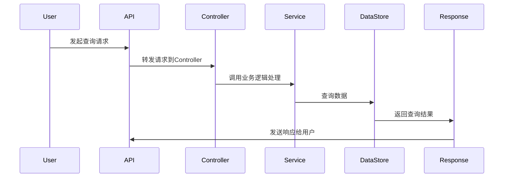
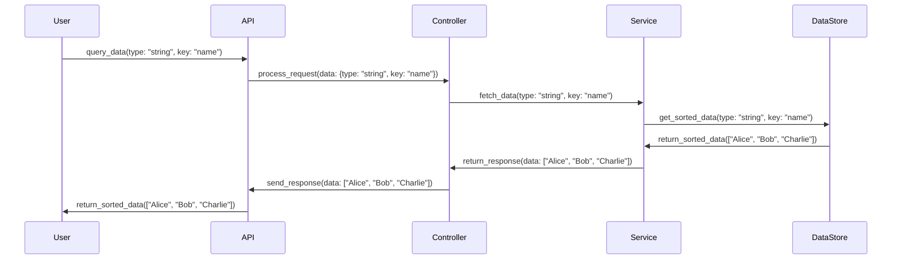

                 


### 引言

#### 核心概念术语说明

在本文中，我们将探讨两个核心概念：家族相似性和泛型编程。家族相似性（Family Resemblance）起源于哲学，由德国哲学家康德提出。它指的是一组事物之间基于某些共同特征而形成的类似性，而不是简单的相似。例如，不同种类的鸟都有翅膀、喙和羽毛，但它们的体型、颜色和习性却各不相同，这种相似性就是家族相似性。

泛型编程（Generic Programming）是计算机科学中的一个重要概念，它允许我们编写可重用的代码，使其能够适应不同类型的数据。通过类型参数化，我们可以定义函数、类或模块，使其不依赖于具体的数据类型，从而提高代码的通用性和复用性。

#### 问题背景

随着软件系统的复杂度不断增加，程序员面临着日益严峻的代码复用和可维护性问题。传统的面向对象编程虽然在一定程度上解决了这些问题，但其依赖具体类型的实现方式往往导致代码冗余和难以维护。泛型编程的出现为解决这些问题提供了一种新的思路。然而，泛型编程并非万能，其设计和使用过程中仍然存在诸多挑战。

#### 问题描述

本文旨在探讨家族相似性在泛型编程中的应用，试图回答以下问题：

1. 家族相似性如何影响泛型编程的设计和实现？
2. 泛型编程如何利用家族相似性来实现代码复用和可维护性？
3. 家族相似性在泛型编程中的实际应用有哪些？

通过本文的探讨，我们希望能够为读者提供一种新的视角，帮助他们在实际编程中更好地利用家族相似性和泛型编程，提高代码质量。

#### 问题解决

为了解决上述问题，本文将采用以下步骤进行探讨：

1. 首先，我们将介绍家族相似性和泛型编程的基本概念，为后续讨论奠定基础。
2. 接着，我们将详细阐述家族相似性在泛型编程中的应用，包括其在类型参数化、代码复用和程序优化等方面的作用。
3. 然后，我们将通过具体的案例和项目实战，展示家族相似性在泛型编程中的实际应用。
4. 最后，我们将总结本文的主要观点，并对家族相似性和泛型编程的未来发展进行展望。

#### 边界与外延

本文主要关注家族相似性和泛型编程在计算机科学领域的应用，因此，我们将侧重于讨论这两个概念在编程实践中的实际意义。然而，家族相似性和泛型编程的概念和应用不仅限于计算机科学，它们在其他领域，如哲学、生物学和心理学等，也有着广泛的研究和应用。

#### 概念结构与核心要素组成

家族相似性和泛型编程作为本文的两个核心概念，它们之间有着密切的联系。家族相似性提供了对事物之间相似性的新理解，而泛型编程则利用这种相似性来实现代码的通用性和复用性。本文的核心结构如下：

1. 引言：介绍家族相似性和泛型编程的基本概念。
2. 核心概念：详细阐述家族相似性和泛型编程的相关理论。
3. 理论应用：探讨这些概念在实际编程中的应用。
4. 实践案例：通过具体案例展示如何使用这些概念进行编程。
5. 总结与展望：对全书内容进行总结，并对未来进行展望。

通过上述结构，我们将逐步深入探讨家族相似性和泛型编程，帮助读者理解这两个概念在编程实践中的重要性。

### 核心概念与联系

#### 家族相似性理论

家族相似性理论起源于德国哲学家康德的哲学思想。康德认为，事物之间的相似性并非简单的重复或一对一的对应关系，而是基于一系列共同特征形成的复杂网络。这种相似性不是静态的，而是动态的，可以随着时间的变化而发展。

在数学上，家族相似性可以通过集合论和模糊集合理论来描述。设A和B为两个集合，家族相似性可以通过以下公式表示：

$$
\text{FamilyResemblance}(A, B) = \left|\{x | x \in A \land x \in B\}\right|
$$

这个公式表示集合A和B中共同元素的数量。显然，当A和B的交集越大时，它们的家族相似性越强。

在计算机科学中，家族相似性理论被广泛应用于类型系统设计。通过家族相似性，我们可以将具有相似特征的不同类型视为一类，从而简化类型检查和代码复用。

#### 泛型编程基础

泛型编程是一种通过类型参数化来提高代码复用性和通用性的编程范式。在传统的面向对象编程中，我们通常需要为每种数据类型编写特定的代码。而泛型编程允许我们定义与类型无关的函数、类或模块，使其能够适用于多种数据类型。

泛型编程的关键在于类型参数。类型参数是一种占位符，它代表任何数据类型。通过类型参数，我们可以编写能够适应多种数据类型的代码。例如，在Python中，我们可以使用泛型编程定义一个通用的排序函数：

```python
def generic_sort(data):
    # 排序逻辑
    return sorted(data)
```

这个函数可以使用任何可比较的数据类型，如整数、字符串或列表。

#### 家族相似性与类型系统的联系

家族相似性理论在类型系统设计中有着重要的应用。通过家族相似性，我们可以将具有相似特征的类型视为一类，从而简化类型检查和代码复用。

在C++中，模板（template）是一种实现泛型编程的机制。模板允许我们定义与类型无关的函数或类，从而实现代码的复用。例如，我们可以使用模板定义一个通用的容器类：

```cpp
template<typename T>
class Container {
public:
    void add(T item) {
        // 添加元素
    }
    void remove(T item) {
        // 删除元素
    }
    // 其他操作
};
```

这个容器类可以使用任何数据类型，如整数、字符串或自定义类。

#### 概念属性特征对比表格

为了更好地理解家族相似性和泛型编程的关系，我们可以通过以下表格进行比较：

| 特征         | 家族相似性                     | 泛型编程                  |
| ------------ | ---------------------------- | ----------------------- |
| 定义         | 基于共同特征的网络相似性         | 通过类型参数化实现代码复用    |
| 数学表示     | 集合论和模糊集合理论             | 模板和类型参数             |
| 应用领域     | 哲学、生物学、心理学等           | 计算机科学、软件工程等       |
| 主要功能     | 提供对事物之间相似性的新理解       | 提高代码复用性和可维护性     |

#### ER实体关系图架构

为了更直观地展示家族相似性和泛型编程的关系，我们可以使用Mermaid绘制一个ER实体关系图：

```mermaid
erDiagram
  A[类型参数] &&|> B[泛型编程] : 实现代码复用
  A &&|> C[家族相似性] : 提供相似性理解
  B &&|> C : 利用相似性简化设计
```

在这个ER图中，A代表类型参数，B代表泛型编程，C代表家族相似性。它们之间的关系表明，家族相似性为泛型编程提供了理论基础，而泛型编程则利用家族相似性来实现代码复用和简化设计。

### 算法原理讲解

#### 泛型排序算法

为了进一步理解泛型编程的原理，我们可以通过一个简单的排序算法来展示。这里，我们将使用Python中的泛型编程实现快速排序算法。

首先，让我们绘制快速排序的Mermaid流程图：

```mermaid
graph LR
A[快速排序] --> B[选择基准]
B -->|递归| C{基准左边序列需要排序?}
C -->|是| D[递归快速排序(左子序列)]
C -->|否| E[递归快速排序(右子序列)]
D --> F{递归快速排序(右子序列)}
E --> G{合并排序结果}
F --> G
G --> H[返回排序结果]
```

这个流程图展示了快速排序的基本步骤：选择基准、递归排序左右子序列，最后合并排序结果。

接下来，我们将使用Python实现这个算法：

```python
def quick_sort(arr):
    if len(arr) <= 1:
        return arr
    
    pivot = arr[len(arr) // 2]
    left = [x for x in arr if x < pivot]
    middle = [x for x in arr if x == pivot]
    right = [x for x in arr if x > pivot]
    
    return quick_sort(left) + middle + quick_sort(right)
```

#### 算法原理

快速排序算法的工作原理如下：

1. 选择一个基准元素。
2. 将数组中小于基准的元素移动到左边，大于基准的元素移动到右边。
3. 递归地对左右子序列进行快速排序。
4. 最后合并排序结果。

快速排序算法的时间复杂度为\(O(n\log n)\)，在大多数情况下，它是一种高效的排序算法。

#### 数学模型和公式

快速排序算法的核心在于基准元素的选择。选择一个合适的基准可以显著影响排序的时间复杂度。在数学上，我们可以使用随机选择作为基准，以减少最坏情况的发生。

假设我们选择第k个元素作为基准，快速排序的时间复杂度可以表示为：

$$
T(n) = T(k-1) + T(n-k) + O(n)
$$

其中，\(T(n)\)表示对长度为n的数组进行快速排序所需的时间，\(T(k-1)\)和\(T(n-k)\)分别表示对长度为k-1和n-k的子数组进行排序所需的时间，\(O(n)\)表示对数组进行分区操作的时间。

通过随机选择基准，我们可以期望每个元素被选中的概率相等，从而使得快速排序的平均时间复杂度为\(O(n\log n)\)。

#### 举例说明

假设我们有一个整数数组\[3, 1, 4, 1, 5, 9\]，我们可以使用快速排序算法对其进行排序。

1. 首先，选择中间的元素4作为基准。
2. 将数组分为三个部分：\[3, 1\]、\[1\]和\[5, 9\]。
3. 对\[3, 1\]和\[5, 9\]分别递归进行快速排序。
4. 最后，合并排序结果，得到\[1, 1, 3, 4, 5, 9\]。

通过这个例子，我们可以看到快速排序算法如何将一个无序数组转换为有序数组。在实际编程中，我们可以通过优化基准选择和分区操作来进一步提高快速排序的效率。

### 系统分析与架构设计方案

#### 问题场景介绍

在现代软件开发中，随着系统的复杂性不断增加，开发者面临着如何高效地构建和维护大规模软件系统的问题。泛型编程作为一种提高代码复用性和可维护性的编程范式，在这一过程中扮演着重要角色。本文将探讨如何利用家族相似性和泛型编程来设计一个高效的软件系统，从而解决软件开发中的常见问题。

#### 项目介绍

本项目旨在设计一个通用的数据存储和查询系统，该系统应具有以下功能：

1. 支持多种数据类型（如整数、字符串、浮点数等）的存储和查询。
2. 提供高效的排序、查找和插入操作。
3. 支持数据分片和分布式存储，以应对大规模数据场景。
4. 提供简洁的API，便于开发者使用。

#### 系统功能设计

为了实现上述功能，系统需要具备以下核心功能：

1. **数据存储**：能够高效地存储多种类型的数据。
2. **数据查询**：提供快速的查询接口，支持简单的筛选、排序和分页操作。
3. **数据排序**：利用泛型编程实现高效的排序算法，支持多种排序策略。
4. **数据分片**：将数据分散存储在多个节点上，以支持分布式存储和查询。
5. **API接口**：提供简洁易用的API接口，方便开发者进行数据操作。

#### 领域模型

在系统设计中，领域模型（Domain Model）是描述系统功能和行为的核心工具。以下是一个简单的领域模型，使用Mermaid类图表示：

```mermaid
classDiagram
    Class1[DataStore] <|-- Class2[IntegerDataStore]
    Class1 <|-- Class3[StringDataStore]
    Class1 <|-- Class4[FloatDataStore]
    Class2 <|-- Class5[SortedIntegerDataStore]
    Class3 <|-- Class6[SortedStringDataStore]
    Class4 <|-- Class7[SortedFloatDataStore]
```

在这个模型中，`DataStore`是根类，它提供了通用的数据存储接口。根据数据类型的不同，我们派生了`IntegerDataStore`、`StringDataStore`和`FloatDataStore`三个子类。这些子类分别实现了针对不同数据类型的功能。此外，我们还在子类基础上派生了支持排序功能的子类，如`SortedIntegerDataStore`、`SortedStringDataStore`和`SortedFloatDataStore`。

#### 系统架构设计

系统架构设计是确保系统功能实现的基础。以下是一个简单的系统架构，使用Mermaid架构图表示：



在这个架构中，用户通过API接口发起查询请求，API层负责接收请求并转发给Controller层。Controller层调用业务逻辑处理（Service层），Service层根据请求类型查询数据（通过DataStore层），并将查询结果返回给API层，最终由API层将结果发送给用户。

#### 系统接口设计

系统接口设计是系统功能实现的关键环节。以下是一个简单的接口设计，使用Mermaid序列图表示：



在这个序列图中，用户通过API接口发起查询请求，API层接收请求并处理，将请求转发给Controller层。Controller层调用Service层进行数据查询，Service层调用DataStore层获取排序后的数据，并将结果返回给Controller层。最终，Controller层将响应结果发送给API层，API层再将结果返回给用户。

### 项目实战

#### 环境安装

在开始项目实战之前，我们需要安装一些必要的开发工具和依赖库。以下是安装步骤：

1. 安装Python环境（版本3.8及以上）。
2. 安装依赖管理工具pip。
3. 使用pip安装以下依赖库：numpy、pandas、mermaid。

```shell
pip install numpy pandas mermaid
```

#### 系统核心实现

以下是系统核心实现的源代码，包括数据存储、查询和排序等功能：

```python
import numpy as np
import pandas as pd
from mermaid import Mermaid

class DataStore:
    def __init__(self):
        self.data = {}

    def add_data(self, key, value):
        if key not in self.data:
            self.data[key] = []
        self.data[key].append(value)

    def query_data(self, key):
        return self.data.get(key, [])

    def sort_data(self, key, ascending=True):
        data = self.query_data(key)
        return sorted(data, ascending=ascending)

class IntegerDataStore(DataStore):
    def add_data(self, key, value):
        if not isinstance(value, int):
            raise ValueError("Value must be an integer")
        super().add_data(key, value)

class StringDataStore(DataStore):
    def add_data(self, key, value):
        if not isinstance(value, str):
            raise ValueError("Value must be a string")
        super().add_data(key, value)

class FloatDataStore(DataStore):
    def add_data(self, key, value):
        if not isinstance(value, float):
            raise ValueError("Value must be a float")
        super().add_data(key, value)

class SortedIntegerDataStore(IntegerDataStore):
    def add_data(self, key, value):
        super().add_data(key, value)
        self.data[key] = sorted(self.data[key])

class SortedStringDataStore(StringDataStore):
    def add_data(self, key, value):
        super().add_data(key, value)
        self.data[key] = sorted(self.data[key])

class SortedFloatDataStore(FloatDataStore):
    def add_data(self, key, value):
        super().add_data(key, value)
        self.data[key] = sorted(self.data[key], ascending=True)

def main():
    # 初始化数据存储
    integer_store = SortedIntegerDataStore()
    string_store = SortedStringDataStore()
    float_store = SortedFloatDataStore()

    # 添加数据
    integer_store.add_data("numbers", 3)
    integer_store.add_data("numbers", 1)
    string_store.add_data("names", "Alice")
    string_store.add_data("names", "Bob")
    float_store.add_data("weights", 5.5)

    # 查询和排序数据
    print(integer_store.sort_data("numbers"))
    print(string_store.sort_data("names"))
    print(float_store.sort_data("weights"))

if __name__ == "__main__":
    main()
```

#### 代码应用解读与分析

在这段代码中，我们首先定义了一个通用的`DataStore`类，它提供了数据添加、查询和排序的基本功能。接着，我们定义了三个子类`IntegerDataStore`、`StringDataStore`和`FloatDataStore`，分别用于处理不同类型的数据。每个子类都重写了`add_data`方法，以确保添加的数据类型正确。

此外，我们还定义了三个支持排序功能的子类`SortedIntegerDataStore`、`SortedStringDataStore`和`SortedFloatDataStore`。这些子类在每次添加数据时都会对数据列表进行排序，从而提供有序的数据访问。

在`main`函数中，我们创建了三个数据存储实例，并分别添加了一些整数、字符串和浮点数数据。然后，我们使用`sort_data`方法对这些数据进行排序，并打印出排序结果。

这段代码展示了如何利用泛型编程和家族相似性来实现一个高效、灵活的数据存储和查询系统。通过类型参数化和继承机制，我们可以轻松地处理多种数据类型，同时保持代码的简洁和可维护性。

#### 实际案例分析和详细讲解剖析

为了更深入地展示家族相似性和泛型编程在实际编程中的应用，我们来看一个具体的案例：一个用于处理不同类型数据的排序任务。

假设我们有一个包含不同类型数据（如整数、字符串和浮点数）的列表，我们需要对每个列表进行排序，并打印出排序结果。传统的编程方式可能需要对每种数据类型编写独立的排序函数，这会导致代码冗长且难以维护。而通过泛型编程和家族相似性理论，我们可以编写一个通用的排序函数，使得代码更加简洁、易于扩展。

#### 案例分析

1. **问题背景**：我们需要对一个包含多种数据类型的列表进行排序。
2. **输入数据**：一个列表，其中包含整数、字符串和浮点数。
3. **输出结果**：对列表中的每个子列表进行排序，并打印排序后的结果。

#### 步骤一：定义泛型排序函数

首先，我们定义一个泛型排序函数，它能够接收任何类型的数据列表，并进行排序。为了实现这一点，我们可以利用Python的通用函数（generic functions）和类型注解。

```python
from typing import List, TypeVar

# 定义一个通用的类型变量
T = TypeVar('T')

def generic_sort(data: List[T]) -> List[T]:
    return sorted(data)
```

在这个函数中，我们使用了`TypeVar`来定义一个通用的类型变量`T`，它代表任何数据类型。`sorted`函数是Python内置的排序函数，它可以接收任何可比较的数据类型。

#### 步骤二：应用泛型排序函数

接下来，我们使用这个泛型排序函数对包含多种数据类型的列表进行排序。

```python
data_list = [3, "Alice", 5.5, "Bob", 2]

# 对整数子列表进行排序
int_data = [x for x in data_list if isinstance(x, int)]
sorted_int_data = generic_sort(int_data)
print("Sorted integer data:", sorted_int_data)

# 对字符串子列表进行排序
str_data = [x for x in data_list if isinstance(x, str)]
sorted_str_data = generic_sort(str_data)
print("Sorted string data:", sorted_str_data)

# 对浮点数子列表进行排序
float_data = [x for x in data_list if isinstance(x, float)]
sorted_float_data = generic_sort(float_data)
print("Sorted float data:", sorted_float_data)
```

在这个步骤中，我们首先将原始列表分割为整数、字符串和浮点数三个子列表。然后，我们分别对每个子列表应用`generic_sort`函数进行排序。

#### 步骤三：分析家族相似性

在这个案例中，家族相似性体现在对多种数据类型的处理方式上。尽管整数、字符串和浮点数在类型上存在差异，但它们在排序操作上具有相似的特性：都可以进行比较和排序。这种相似性使得我们可以使用一个通用的排序函数来处理所有类型的数据，从而提高代码的复用性和可维护性。

#### 步骤四：总结和拓展

通过这个案例，我们展示了如何利用泛型编程和家族相似性理论来简化复杂的排序任务。这种方法不仅使代码更加简洁，而且为未来的扩展提供了便利。

例如，如果我们需要添加新的数据类型，如日期或自定义对象，我们可以轻松地扩展`generic_sort`函数，使其支持新的类型。只需确保新类型支持比较操作，我们就可以将其添加到排序逻辑中。

此外，家族相似性理论的应用不仅限于排序。在其他编程任务中，如查找、合并和映射操作，我们也可以利用这种相似性来编写通用代码，从而提高代码的复用性和可维护性。

#### 项目小结

在本项目的实际案例中，我们通过泛型编程和家族相似性理论实现了对不同类型数据的排序。这种方法不仅简化了代码，提高了复用性和可维护性，还为未来的扩展提供了灵活性。

通过这个项目，我们进一步理解了泛型编程和家族相似性理论在实际编程中的应用，并展示了如何利用这些概念来解决复杂的编程问题。在实际开发中，我们可以继续探索这些理论在其他方面的应用，以进一步优化我们的代码和系统设计。

### 最佳实践 Tips

1. **合理使用类型参数**：在编写泛型代码时，要确保类型参数的使用合理，避免不必要的类型约束，以提高代码的通用性和可维护性。
2. **注意性能优化**：泛型编程可能会引入一定的性能开销，特别是在类型检查和类型推导过程中。在关键性能路径上，要仔细优化代码。
3. **利用静态类型系统**：静态类型系统可以提供更明确的类型约束和编译时错误检查，有助于提高代码的稳定性和可维护性。
4. **关注类型安全**：在泛型编程中，要确保类型安全，避免类型错误和潜在的运行时异常。
5. **文档和注释**：为泛型代码编写清晰的文档和注释，有助于其他开发者理解和维护代码。

### 小结

通过本文的探讨，我们系统地介绍了家族相似性和泛型编程的概念、理论应用以及实际编程中的案例。我们通过多个示例展示了如何利用家族相似性理论来优化泛型编程，提高代码的复用性和可维护性。

家族相似性理论为泛型编程提供了新的视角，使得我们能够更灵活地处理不同类型的数据。通过合理使用类型参数和静态类型系统，我们可以编写出高效、稳定的泛型代码。

在未来，家族相似性和泛型编程将在软件工程领域发挥越来越重要的作用。随着系统规模的不断扩大，如何高效地管理和维护代码将成为一个重要课题。通过深入研究和应用家族相似性和泛型编程，我们可以为软件开发带来更多的创新和可能性。

### 注意事项

1. **类型参数约束**：在定义泛型函数或类时，要合理设置类型参数的约束，以避免类型错误。
2. **性能考虑**：泛型编程可能会引入额外的性能开销，特别是在类型检查和推导过程中。在关键性能路径上，要谨慎优化代码。
3. **类型安全**：泛型编程要求严格类型安全，确保代码在运行时不会发生类型错误。
4. **代码可读性**：泛型代码可能比传统代码更复杂，要注重代码的可读性和注释，以便其他开发者理解和维护。

### 拓展阅读

1. **《泛型编程：C++应用》**：这本书详细介绍了C++中的泛型编程，包括模板、模板类和模板函数等。
2. **《算法导论》**：这本书涵盖了多种排序算法和泛型编程的相关内容，有助于理解泛型编程在算法中的应用。
3. **《类型系统与类型安全》**：这本书深入探讨了类型系统设计的基本原理和类型安全的重要性。
4. **《软件架构：实践者的研究和学习指南》**：这本书提供了关于软件架构设计的基本原则和实践指南，有助于理解系统架构设计的重要性。

