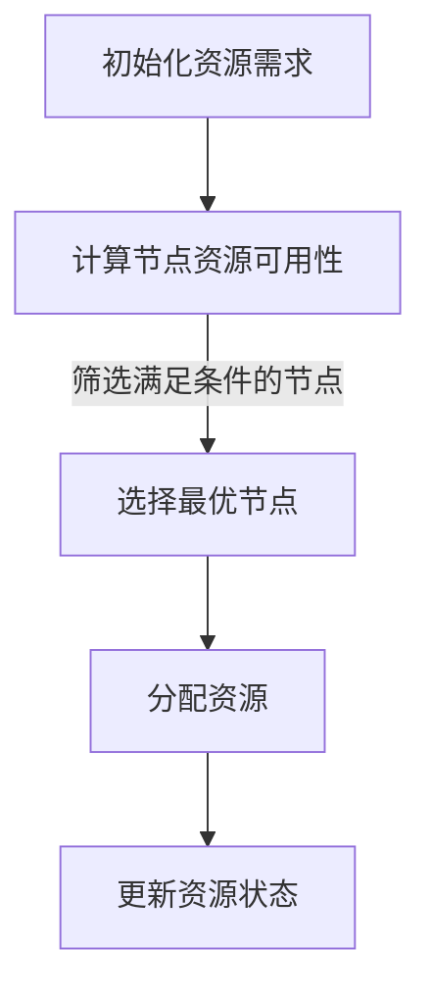
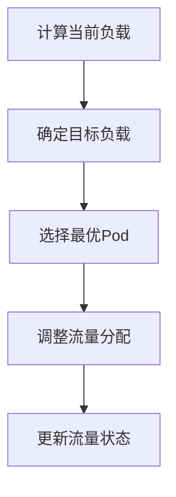
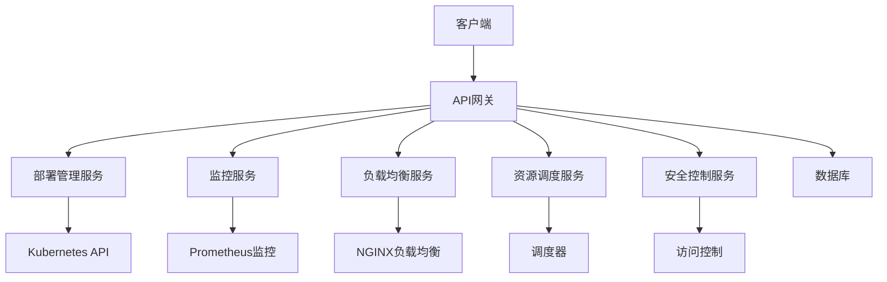

                 

## 容器化与Kubernetes:云原生应用部署管理

### 关键词：
- 容器化
- Kubernetes
- 云原生应用
- 部署管理
- 调度算法
- 扩展机制

### 摘要：
本文旨在探讨容器化与Kubernetes在云原生应用部署管理中的重要性。首先，我们将介绍容器化和Kubernetes的基础概念，然后深入讲解其核心算法原理、数学模型、系统架构设计，并通过项目实战来展示实际应用。最后，我们将总结最佳实践、注意事项和拓展阅读资源，帮助读者深入理解和掌握这一技术领域。

## 目录大纲设计

### 设计目标

为用户提供的《容器化与Kubernetes:云原生应用部署管理》设计一个详细且逻辑清晰的目录大纲。大纲需要包含以下核心内容：

- **背景介绍**：包括容器化技术、Kubernetes、云原生应用部署管理的基础概念和起源。
- **核心概念与联系**：详细讲解容器技术、Kubernetes组件及其与容器的关系。
- **算法原理讲解**：解析容器编排算法、Kubernetes调度算法和扩展算法。
- **数学模型和数学公式**：使用mermaid流程图和LaTeX格式展示资源分配模型和负载均衡模型。
- **系统分析与架构设计方案**：介绍系统场景、功能设计、架构设计和接口设计。
- **项目实战**：指导读者搭建环境、实现核心代码、分析实际案例。
- **最佳实践 tips、小结、注意事项、拓展阅读**：总结经验、强调关键点、提醒注意事项并推荐拓展资源。

### 设计原则

- **简洁性**：避免冗余内容，直接呈现关键信息。
- **可读性**：使用清晰的标题和层次结构，便于读者理解。
- **完整性**：确保大纲内容全面，不遗漏重要章节。

### 设计步骤

1. **背景介绍**（第1章）
   - **容器化概念**：介绍容器化技术的起源、发展和核心概念。
   - **Kubernetes介绍**：概述Kubernetes的作用、特点和应用场景。
   - **云原生应用部署管理**：解释云原生应用的概念及其与容器化和Kubernetes的关系。

2. **核心概念与联系**（第2章）
   - **容器技术**：详细讲解容器的工作原理、优势和应用场景。
   - **Kubernetes组件**：介绍Kubernetes的主要组件及其功能。
   - **容器与Kubernetes关系**：解释容器和Kubernetes之间的相互作用。

3. **算法原理讲解**（第3章）
   - **容器编排算法**：讲解容器编排的核心算法，如调度、负载均衡和资源管理。
   - **Kubernetes调度算法**：详细解析Kubernetes的调度算法，如基于资源需求的调度策略。
   - **Kubernetes扩展算法**：介绍Kubernetes的扩展机制，如水平扩展和垂直扩展。

4. **数学模型和数学公式 & 详细讲解 & 举例说明**（第4章）
   - **资源分配模型**：使用mermaid画出资源分配的mermaid流程图，并使用LaTeX格式给出数学模型和公式。
   - **负载均衡模型**：使用mermaid绘制负载均衡算法的流程图，并用LaTeX格式解释数学模型和公式。
   - **举例说明**：通过具体实例详细说明算法的实现和应用。

5. **系统分析与架构设计方案**（第5章）
   - **系统场景介绍**：描述目标系统的工作环境和业务需求。
   - **系统功能设计**：使用mermaid绘制系统的领域模型类图。
   - **系统架构设计**：用mermaid展示系统的架构图。
   - **系统接口设计**：详细说明系统的接口设计和交互。

6. **项目实战**（第6章）
   - **环境安装**：指导读者如何搭建容器化与Kubernetes环境。
   - **系统核心实现源代码**：提供关键的源代码实现，并进行解读与分析。
   - **实际案例分析和详细讲解剖析**：分析具体案例，深入讲解系统实现和应用。

7. **最佳实践 tips、小结、注意事项、拓展阅读**（第7章）
   - **最佳实践 tips**：总结实践中得出的最佳操作和建议。
   - **小结**：回顾全书主要内容，强调关键点和学习目标。
   - **注意事项**：提醒读者在实践过程中需要注意的问题。
   - **拓展阅读**：推荐进一步学习资源。

### 目录大纲

```markdown
----------------------------------------------------------------
# 容器化与Kubernetes:云原生应用部署管理

> 关键词：容器化、Kubernetes、云原生应用、部署管理、调度算法、扩展机制

> 摘要：本文深入探讨容器化与Kubernetes在云原生应用部署管理中的重要性，从基础概念到算法原理，再到系统架构设计和实战应用，全面解析这一关键技术领域。

## 第一部分: 容器化与Kubernetes基础

### 第1章: 背景介绍

#### 1.1 容器化技术概述

#### 1.2 Kubernetes介绍

#### 1.3 云原生应用部署管理

### 第2章: 核心概念与联系

#### 2.1 容器技术详解

#### 2.2 Kubernetes组件解析

#### 2.3 容器与Kubernetes关系

### 第3章: 算法原理讲解

#### 3.1 容器编排算法

#### 3.2 Kubernetes调度算法

#### 3.3 Kubernetes扩展算法

### 第4章: 数学模型和数学公式 & 详细讲解 & 举例说明

#### 4.1 资源分配模型

#### 4.2 负载均衡模型

#### 4.3 举例说明

### 第5章: 系统分析与架构设计方案

#### 5.1 系统场景介绍

#### 5.2 系统功能设计

#### 5.3 系统架构设计

#### 5.4 系统接口设计

### 第6章: 项目实战

#### 6.1 环境安装

#### 6.2 系统核心实现源代码

#### 6.3 实际案例分析和详细讲解剖析

### 第7章: 最佳实践 tips、小结、注意事项、拓展阅读

#### 7.1 最佳实践 tips

#### 7.2 小结

#### 7.3 注意事项

#### 7.4 拓展阅读

----------------------------------------------------------------
```

通过上述详细且逻辑清晰的目录大纲设计，本文将为读者提供一个系统全面的容器化和Kubernetes学习路径，从基础概念到高级实践，助力读者深入理解并掌握云原生应用部署管理技术。

## 第1章：容器化技术概述

### 容器化的起源与发展

容器化技术起源于2000年代初，当时虚拟化技术已经开始被广泛应用，但虚拟机（VM）在性能、资源消耗和部署灵活性方面存在一定限制。为了解决这些问题，Linux容器（LXC）和Docker等容器技术应运而生。容器是一种轻量级的虚拟化形式，它通过操作系统的Namespace和Cgroups等特性，实现应用程序及其环境的隔离和资源限制。

容器化的概念最早由Linux容器（LXC）引入，但真正让容器化技术流行起来的是Docker。2013年，Docker开源项目诞生，随后迅速发展，成为容器技术的代名词。Docker通过将应用程序及其依赖环境打包成一个独立的容器镜像，实现了“一次编写，到处运行”的理念。

随着时间的推移，容器化技术逐渐成为云原生应用部署的重要手段。云原生应用是指那些在设计、开发和部署过程中充分利用容器、服务网格、微服务、自动化等技术的应用。容器化技术为云原生应用提供了更好的部署灵活性、可扩展性和资源效率。

### 容器化的核心概念

容器化的核心概念主要包括以下几个部分：

- **容器镜像**：容器镜像是一种轻量级、可执行的静态打包文件，包含运行应用程序所需的所有依赖、库和配置。容器镜像通过分层技术构建，用户可以基于现有镜像创建新的镜像，从而实现快速的部署和更新。

- **容器引擎**：容器引擎是负责管理容器生命周期的工具。常见的容器引擎包括Docker、Podman、containerd等。容器引擎提供容器创建、启动、停止、删除等操作接口，并负责资源隔离和调度。

- **容器编排**：容器编排是指通过自动化工具或平台对容器进行编排和管理的过程。常见的容器编排工具包括Kubernetes、Mesos、Swarm等。容器编排可以自动化容器的部署、扩展、监控和故障恢复。

- **容器网络**：容器网络是指容器之间的通信机制。容器通常运行在不同的宿主机上，通过容器网络可以实现容器之间的无缝通信。常见的容器网络方案包括Flannel、Calico、Weave等。

- **容器存储**：容器存储是指为容器提供持久化存储的解决方案。容器在运行过程中会产生大量数据，通过容器存储可以将这些数据保存下来，以便后续使用。常见的容器存储方案包括Docker Volume、Portworx、NFS等。

### 容器化的优势与应用场景

容器化技术具有以下优势：

- **轻量级**：容器与宿主机的操作系统共享kernel，没有额外的资源开销，因此比虚拟机更轻量。

- **可移植性**：容器镜像是一个静态的打包文件，可以在任何支持容器引擎的操作系统上运行，实现了“一次编写，到处运行”。

- **可扩展性**：容器编排工具支持自动水平扩展和垂直扩展，可以轻松应对大规模应用的负载。

- **资源效率**：容器通过资源隔离和限制，实现了更高效的资源利用。

- **快速部署**：容器镜像和容器编排工具使得应用的部署速度大幅提升，缩短了从开发到生产的时间周期。

容器化的应用场景主要包括：

- **Web应用部署**：容器化技术为Web应用提供了高效的部署和扩展解决方案，使得开发者可以快速迭代和发布新功能。

- **微服务架构**：微服务架构通过容器化技术实现了服务之间的解耦和独立部署，提高了系统的灵活性和可维护性。

- **持续集成/持续部署（CI/CD）**：容器化技术与CI/CD工具相结合，实现了自动化测试、构建和部署，提高了开发效率和软件质量。

- **大数据处理**：容器化技术可以轻松地在分布式环境中部署和扩展大数据处理任务，如Hadoop、Spark等。

- **物联网（IoT）应用**：容器化技术为物联网设备提供了轻量级的运行环境，使得开发者可以快速开发和部署IoT应用。

### 容器化的挑战与未来趋势

尽管容器化技术具有诸多优势，但其在实际应用中仍面临一些挑战：

- **安全性**：容器化环境中的安全问题是当前的一个重要关注点。容器镜像和容器编排工具需要确保安全配置和最佳实践。

- **迁移与兼容性**：将现有应用迁移到容器化环境可能面临兼容性问题，需要解决依赖环境、配置文件和运行时环境的一致性。

- **管理复杂性**：容器编排工具虽然提供了自动化管理，但同时也增加了管理复杂性，需要专业的运维团队来维护和管理。

未来，容器化技术将继续发展，并面临以下趋势：

- **容器安全**：随着容器化应用的普及，容器安全将变得更加重要，包括镜像扫描、网络隔离和权限管理等。

- **无服务器架构**：无服务器架构（Serverless）与容器化技术相结合，将提供更加弹性和高效的服务交付方式。

- **跨平台与跨云服务**：容器化技术将实现更广泛的应用，包括跨平台、跨云服务，提供更灵活的部署和管理方案。

- **集成与标准化**：容器化技术将与其他技术（如服务网格、微服务、自动化等）更加紧密地集成，形成完整的云原生生态系统，并推动标准化进程。

通过本章的介绍，读者可以初步了解容器化技术的起源、核心概念和优势，为进一步学习和应用容器化技术打下基础。

### 第1章：容器化技术概述（续）

#### 容器化技术面临的挑战

虽然容器化技术带来了许多便利，但它在实际应用中也面临一些挑战。以下是对这些挑战的详细探讨：

1. **安全性问题**：容器化技术的普及引发了安全性方面的关注。容器共享宿主机的操作系统内核，这使得容器内应用程序的安全性依赖于宿主机的安全配置。如果容器镜像或容器编排工具存在漏洞，攻击者可以通过容器访问宿主机的其他资源。此外，容器网络和存储也存在安全风险，需要采取有效的安全策略和措施来保护容器环境。

2. **迁移与兼容性问题**：将现有应用迁移到容器化环境可能面临兼容性问题。不同操作系统和硬件平台的差异可能导致依赖库和配置文件的兼容性问题。此外，现有应用可能依赖于宿主机的特定资源，如文件系统、网络接口等，这些资源在容器环境中可能不可用或需要重新配置。解决这些问题需要仔细规划和调整，以确保应用在容器环境中正常运行。

3. **管理复杂性**：容器编排工具虽然提供了自动化管理，但也增加了管理复杂性。容器化环境中的大量容器和复杂的网络配置需要专业的运维团队来维护和管理。此外，容器镜像的版本管理、容器日志收集和监控等任务也需要高效的工具和流程来支持。随着容器化应用的规模和复杂性增加，运维团队需要不断学习和适应新的管理技术和工具。

4. **性能问题**：容器化环境中的性能问题主要集中在资源分配和调度方面。由于容器共享宿主机的资源，不合理的资源分配可能导致某些容器占用过多资源，影响其他容器的性能。此外，容器编排工具的调度算法和资源限制也需要优化，以最大化资源利用率和系统性能。

5. **调试和监控**：在容器化环境中，调试和监控应用程序变得更加复杂。由于容器是动态创建和销毁的，传统的调试和监控方法可能无法有效跟踪和诊断问题。需要采用专门的工具和技术来监控容器状态、日志记录和性能分析，以便快速定位和解决问题。

#### 未来趋势

容器化技术将继续发展，并面临以下趋势：

1. **容器安全**：随着容器化应用的普及，容器安全将变得更加重要。容器镜像的扫描和签名、容器网络和存储的安全策略、容器编排工具的安全性配置等将成为关注的焦点。容器安全解决方案将逐步完善，提供更加全面和可靠的安全保障。

2. **无服务器架构**：无服务器架构（Serverless）与容器化技术相结合，将提供更加弹性和高效的服务交付方式。无服务器架构允许开发者专注于编写应用程序代码，而不需要关注底层基础设施的配置和管理。容器化技术将使无服务器架构更加灵活和可扩展，适用于各种规模的应用。

3. **跨平台与跨云服务**：容器化技术将实现更广泛的应用，包括跨平台、跨云服务。容器镜像和容器编排工具将支持在多个操作系统、云服务和硬件平台上运行，提供更灵活的部署和管理方案。跨平台和跨云服务的容器化技术将促进应用程序的普及和兼容性。

4. **集成与标准化**：容器化技术将与其他技术（如服务网格、微服务、自动化等）更加紧密地集成，形成完整的云原生生态系统。容器化技术将推动标准化进程，促进不同工具和平台之间的互操作性，降低开发者和运维团队的复杂性。

通过本章的详细探讨，读者可以更深入地了解容器化技术的优势、挑战和未来趋势，为进一步学习和应用容器化技术做好准备。

## 第2章：Kubernetes介绍

### Kubernetes的基本概念

Kubernetes（简称K8s）是一个开源的容器编排平台，用于自动化部署、扩展和管理容器化应用程序。Kubernetes起源于Google，它借鉴了Google多年在生产环境中管理大量容器的工作经验。Kubernetes的目标是提供一种简单、可靠、可扩展的方式来管理容器化应用程序。

#### Kubernetes的核心组件

Kubernetes主要由以下核心组件组成：

1. **Master节点**：Master节点负责集群的管理和控制。主要组件包括：
   - **API服务器**：提供集群管理的统一接口，所有其他组件都通过API服务器与Master节点进行通信。
   - **调度器**：根据资源需求和策略选择合适的Node节点来部署Pod。
   - **控制器管理器**：运行各种控制器，如副本控制器（Replica Controller）、端点控制器（Endpoints Controller）和 службы控制器（Services Controller）等，负责确保集群中资源的状态符合预期配置。

2. **Node节点**：Node节点是Kubernetes集群中的工作节点，负责运行容器化的应用程序。主要组件包括：
   - **Kubelet**：负责与Master节点通信，确保容器按照预期运行。
   - **Kube-Proxy**：负责为服务提供网络代理功能。
   - **容器运行时**：如Docker、rkt等，用于运行容器。

3. **Pod**：Pod是Kubernetes中的最小部署单元，可以包含一个或多个容器。Pod提供了容器的封装和调度，是部署和管理容器化应用程序的基本构建块。

4. **服务（Service）**：服务定义了一个访问Pod集群的策略，通过抽象Pod的IP和端口，提供了稳定的网络标识，使得应用程序可以通过服务名称来访问其他服务。

5. **存储卷（Volume）**：存储卷是Kubernetes中用于持久化数据的资源，可以将外部存储系统（如NFS、iSCSI等）或容器内部的存储目录挂载到Pod中。

6. **部署（Deployment）**：Deployment提供了自动化部署和管理容器化应用程序的方法。它负责创建、更新和扩展Pod和ReplicaSet。

7. **状态集（StatefulSet）**：StatefulSet用于管理有状态的应用程序，提供稳定的网络标识和持久化存储。

8. **自定义资源（Custom Resource Definition，CRD）**：CRD允许用户扩展Kubernetes API，自定义资源类型以适应特定应用场景。

#### Kubernetes的关键特性

Kubernetes具有以下关键特性：

1. **自动化部署与扩展**：Kubernetes可以自动化部署和管理容器化应用程序，支持水平扩展和垂直扩展。

2. **自我修复**：Kubernetes可以自动检测故障并进行恢复，确保应用程序的持续运行。

3. **负载均衡**：Kubernetes提供了内置的负载均衡器，可以自动分配网络流量，确保应用程序的高可用性。

4. **服务发现和负载均衡**：Kubernetes通过DNS或IP地址自动发现和负载均衡服务，简化了服务访问和管理。

5. **自动化装箱**：Kubernetes的调度器可以根据资源需求和策略选择最优的节点来部署容器。

6. **持久化存储**：Kubernetes支持多种存储解决方案，包括本地存储、外部存储和网络存储，提供了灵活的存储选择。

7. **安全性**：Kubernetes提供了丰富的安全特性和策略，如命名空间、角色与角色绑定、集群角色与角色绑定等。

8. **灵活性和可扩展性**：Kubernetes具有高度可扩展性，支持自定义资源、插件和第三方服务，可以适应各种规模和复杂度的应用场景。

### Kubernetes的作用

Kubernetes在容器化应用部署管理中发挥着至关重要的作用：

1. **简化部署和运维**：通过自动化部署、扩展和监控，Kubernetes简化了容器化应用程序的运维流程，提高了开发效率和系统稳定性。

2. **提高资源利用率**：通过自动化装箱和负载均衡，Kubernetes可以优化资源利用，确保每个节点都被充分利用。

3. **确保高可用性**：Kubernetes提供了自我修复和故障转移机制，可以确保应用程序的持续运行，提高了系统的可靠性。

4. **支持微服务架构**：Kubernetes通过支持无状态和有状态的应用程序，为微服务架构提供了可靠的部署和管理方案。

5. **提供灵活的扩展性**：Kubernetes支持水平扩展和垂直扩展，可以根据实际需求灵活调整应用程序的规模。

6. **促进持续集成和持续部署**：Kubernetes与CI/CD工具紧密集成，促进了应用程序的快速迭代和交付。

7. **降低运营成本**：通过优化资源利用和简化运维流程，Kubernetes可以降低运营成本，提高企业竞争力。

### Kubernetes的应用场景

Kubernetes适用于多种应用场景，包括：

1. **Web应用程序**：Kubernetes可以自动化部署和管理Web应用程序，确保高可用性和可扩展性。

2. **大数据处理**：Kubernetes可以轻松部署和扩展大数据处理任务，如Hadoop、Spark等。

3. **物联网（IoT）应用**：Kubernetes为物联网应用提供了可靠的部署和管理方案，支持大规模的设备管理和数据处理。

4. **批处理作业**：Kubernetes可以自动化部署和管理批处理作业，提高作业的执行效率和可靠性。

5. **服务网格**：Kubernetes可以与Service Mesh技术（如Istio、Linkerd等）结合，提供服务间通信的安全性和可靠性。

6. **持续集成/持续部署（CI/CD）**：Kubernetes与CI/CD工具（如Jenkins、GitLab CI等）集成，实现自动化测试、构建和部署。

7. **多云和跨云部署**：Kubernetes支持跨云和多云部署，提供了灵活的部署和管理方案。

通过本章的介绍，读者可以初步了解Kubernetes的基本概念、核心组件、关键特性和应用场景，为进一步深入学习和应用Kubernetes打下基础。

### Kubernetes的安装与配置

安装和配置Kubernetes是开始使用这个强大容器编排平台的第一步。本文将详细说明如何在不同的环境中安装Kubernetes，包括单节点安装和多节点集群安装。

#### 单节点安装

单节点安装是最简单的安装方式，适用于开发和测试环境。以下是单节点安装的基本步骤：

1. **安装Docker**：在单节点机器上首先需要安装Docker。可以通过以下命令安装：

   ```bash
   sudo apt-get update
   sudo apt-get install docker.io
   sudo systemctl start docker
   sudo systemctl enable docker
   ```

2. **安装Kubeadm、Kubelet和Kubectl**：接下来，需要安装Kubeadm、Kubelet和Kubectl，这些工具用于初始化集群、管理节点和与集群进行交互。可以使用以下命令进行安装：

   ```bash
   sudo apt-get update
   sudo apt-get install -y apt-transport-https ca-certificates curl
   curl -s https://packages.cloud.google.com/apt/doc/apt-key.gpg | sudo apt-key add -
   echo "deb https://apt.kubernetes.io/ kubernetes-xenial main" | sudo tee -a /etc/apt/sources.list
   sudo apt-get update
   sudo apt-get install -y kubelet kubeadm kubectl
   sudo apt-mark hold kubelet kubeadm kubectl
   ```

3. **初始化集群**：使用kubeadm初始化集群。以下命令将在当前节点上初始化Kubernetes集群：

   ```bash
   sudo kubeadm init --pod-network-cidr=10.244.0.0/16
   ```

   完成初始化后，会得到一个命令，用于将当前节点加入集群：

   ```bash
   sudo mkdir -p $HOME/.kube
   sudo cp -i /etc/kubernetes/admin.conf $HOME/.kube/config
   sudo chown $(id -u):$(id -g) $HOME/.kube/config
   ```

4. **安装Pod网络插件**：为了使集群中的容器能够相互通信，需要安装一个Pod网络插件。以下示例使用Calico网络插件：

   ```bash
   kubectl apply -f https://docs.projectcalico.org/manifests/calico.yaml
   ```

5. **测试集群状态**：安装完成后，可以通过以下命令测试集群状态：

   ```bash
   kubectl get nodes
   kubectl get pods --all-namespaces
   ```

   应该看到所有节点都处于`Ready`状态，并且存在一些系统Pod。

#### 多节点集群安装

在多节点集群安装中，需要在每个节点上执行类似的步骤，但需要考虑一些额外的配置。

1. **准备节点**：确保所有节点都可以通过SSH无密码访问。在Master节点上生成SSH密钥对，并将其分发到其他节点：

   ```bash
   ssh-keygen -t rsa -b 2048 -f id_rsa -N ""
   sudo chmod 600 id_rsa
   sudo cp id_rsa.pub /etc/ssh/ssh_known_hosts
   ```

   在Master节点上，将公钥添加到`/etc/ssh/ssh_known_hosts`文件中，确保所有节点的公钥都已列出。

2. **配置Master节点**：在Master节点上执行初始化命令：

   ```bash
   sudo kubeadm init --pod-network-cidr=10.244.0.0/16
   ```

   同样，会得到一个命令，用于将其他节点加入集群。保存此命令，稍后将在Worker节点上使用。

3. **配置Worker节点**：在每个Worker节点上，执行以下命令：

   ```bash
   sudo kubeadm join <master-node-ip>:<master-node-port> --token <token> --discovery-token-ca-cert-hash sha256:<hash>
   ```

   将`<master-node-ip>`、`<master-node-port>`、`<token>`和`<hash>`替换为实际值。

4. **安装Pod网络插件**：在每个节点上安装Pod网络插件，如Calico：

   ```bash
   kubectl apply -f https://docs.projectcalico.org/manifests/calico.yaml
   ```

5. **测试集群状态**：确保所有节点都加入集群，并且Pod网络正常工作：

   ```bash
   kubectl get nodes
   kubectl get pods --all-namespaces
   ```

通过上述步骤，您将成功安装和配置Kubernetes集群，无论是一个单节点集群还是一个多节点集群。在实际部署中，可能需要根据具体的硬件和网络环境进行调整和优化。

### Kubernetes的核心概念与操作

#### Pod

Pod是Kubernetes中的最小部署单元，它可以包含一个或多个容器。Pod的主要作用是封装应用程序及其依赖项，并提供容器之间的资源共享和调度。Pod的生命周期受到其所属的控制器（如ReplicaSet、Deployment等）的管理。

1. **创建Pod**：可以通过YAML文件创建Pod。以下是一个简单的Pod示例：

   ```yaml
   apiVersion: v1
   kind: Pod
   metadata:
     name: my-pod
   spec:
     containers:
     - name: my-container
       image: nginx
   ```

   使用以下命令创建Pod：

   ```bash
   kubectl create -f pod.yaml
   ```

2. **查看Pod**：可以使用以下命令查看Pod的状态和详细信息：

   ```bash
   kubectl get pods
   kubectl describe pod <pod-name>
   ```

3. **删除Pod**：要删除Pod，可以使用以下命令：

   ```bash
   kubectl delete pod <pod-name>
   ```

#### Deployment

Deployment用于管理Pod的创建和更新。它确保在任何时间都有指定数量的Pod运行，并且可以自动化更新和回滚应用程序。

1. **创建Deployment**：以下是一个简单的Deployment示例：

   ```yaml
   apiVersion: apps/v1
   kind: Deployment
   metadata:
     name: my-deployment
   spec:
     replicas: 3
     selector:
       matchLabels:
         app: my-app
     template:
       metadata:
         labels:
           app: my-app
       spec:
         containers:
         - name: my-container
           image: nginx
           ports:
           - containerPort: 80
   ```

   使用以下命令创建Deployment：

   ```bash
   kubectl create -f deployment.yaml
   ```

2. **更新Deployment**：要更新Deployment，可以使用以下命令：

   ```bash
   kubectl set image deployment/my-deployment my-container=my-new-image
   ```

3. **滚动更新**：Deployment默认使用滚动更新策略，确保新版本的应用程序逐步替换旧版本，从而避免服务中断。

   ```bash
   kubectl rollout status deployment/my-deployment
   kubectl rollout undo deployment/my-deployment
   ```

#### StatefulSet

StatefulSet用于管理有状态的应用程序，如数据库或缓存服务器。每个StatefulSet中的Pod都有一个稳定的网络标识和持久化存储。

1. **创建StatefulSet**：以下是一个简单的StatefulSet示例：

   ```yaml
   apiVersion: apps/v1
   kind: StatefulSet
   metadata:
     name: my-statefulset
   spec:
     serviceName: "my-service"
     replicas: 3
     selector:
       matchLabels:
         app: my-app
     template:
       metadata:
         labels:
           app: my-app
       spec:
         containers:
         - name: my-container
           image: mysql
           ports:
           - containerPort: 3306
           env:
           - name: MYSQL_ROOT_PASSWORD
             valueFrom:
               secretKeyRef:
                 name: mysql-secret
                 key: password
   ```

   使用以下命令创建StatefulSet：

   ```bash
   kubectl create -f statefulset.yaml
   ```

2. **访问StatefulSet**：可以使用以下命令访问StatefulSet的Pod：

   ```bash
   kubectl get pods
   kubectl exec -it <pod-name> -- /bin/bash
   ```

#### Service

Service提供了一种抽象的网络标识，使Pod可以对外提供服务。它通过集群IP和端口号将流量路由到后端的Pod。

1. **创建Service**：以下是一个简单的Service示例：

   ```yaml
   apiVersion: v1
   kind: Service
   metadata:
     name: my-service
   spec:
     selector:
       app: my-app
     ports:
       - protocol: TCP
         port: 80
         targetPort: 80
     type: ClusterIP
   ```

   使用以下命令创建Service：

   ```bash
   kubectl create -f service.yaml
   ```

2. **查看Service**：可以使用以下命令查看Service的状态和详细信息：

   ```bash
   kubectl get services
   kubectl describe service <service-name>
   ```

#### Ingress

Ingress用于管理外部访问集群服务的方式。它通过定义HTTP或HTTPS路由规则，将外部流量路由到集群内的服务。

1. **创建Ingress**：以下是一个简单的Ingress示例：

   ```yaml
   apiVersion: networking.k8s.io/v1
   kind: Ingress
   metadata:
     name: my-ingress
   spec:
     rules:
     - http:
         paths:
         - path: /
           pathType: Prefix
           backend:
             service:
               name: my-service
               port:
                 number: 80
   ```

   使用以下命令创建Ingress：

   ```bash
   kubectl create -f ingress.yaml
   ```

2. **查看Ingress**：可以使用以下命令查看Ingress的状态和详细信息：

   ```bash
   kubectl get ingresses
   kubectl describe ingress <ingress-name>
   ```

通过理解和使用这些核心概念和操作，开发者和管理员可以更有效地部署和管理容器化应用程序。

### 第3章：算法原理讲解

#### 容器编排算法

容器编排算法是确保容器资源得到最优利用和高效管理的关键。在Kubernetes中，容器编排算法主要涉及调度、负载均衡和资源管理。

1. **调度算法**：调度算法负责将容器部署到集群中的合适节点。Kubernetes的调度器根据以下策略进行调度：
   - **资源需求**：容器所需的CPU、内存和存储资源。
   - **节点亲和性**：容器对节点的偏好，如特定节点上的特定服务或资源。
   - **节点约束**：节点的可用性和特定约束，如CPU限制或内存限制。
   - **服务亲和性**：容器之间的服务关系，如同一服务实例的容器应尽可能部署在同一节点上。

   Kubernetes调度器的核心算法包括：
   - **扩展性调度**：通过分析节点的资源使用情况，动态扩展或缩减Pod数量。
   - **负载均衡调度**：根据节点的负载情况，合理分配容器，避免过载。

2. **负载均衡算法**：负载均衡算法负责将流量分配到不同的容器实例，确保服务的响应性和高可用性。Kubernetes提供了以下几种负载均衡算法：
   - **轮询调度**：按照顺序轮流将流量分配给不同的Pod。
   - **权重调度**：根据Pod的权重分配流量，权重越高，被分配的流量越多。
   - **最小连接数调度**：将流量分配到当前连接数最少的Pod。
   - **IP哈希调度**：根据客户端IP地址，将流量固定分配给特定的Pod。

3. **资源管理**：资源管理算法确保容器在合理的资源约束下运行，避免资源争用和过度消耗。Kubernetes的资源管理包括：
   - **资源限制**：为容器设置CPU、内存等资源限制，确保资源使用不会超出预期。
   - **资源预留**：为容器预留一定量的资源，确保其他容器无法占用。
   - **资源优先级**：根据容器的重要性和优先级，分配资源。

#### Kubernetes调度算法

Kubernetes调度算法是一个复杂的过程，它依赖于多个组件和策略来确保最优的资源分配。以下是Kubernetes调度算法的主要组成部分：

1. **初始筛选**：调度器首先根据节点是否满足基本约束（如内存、CPU等）对节点进行筛选。不符合约束的节点将被排除在调度过程之外。

2. **优先级排序**：对于通过筛选的节点，调度器会根据节点亲和性、资源可用性等因素进行排序，选择最合适的节点。

3. **约束绑定**：调度器会尝试将容器与节点的约束进行匹配，确保容器在符合约束的节点上运行。

4. **调度策略**：根据调度策略（如扩展性调度、负载均衡调度等），调度器选择最终的目标节点。

#### Kubernetes扩展算法

Kubernetes扩展算法负责根据工作负载的需求，自动增加或减少容器实例的数量。扩展算法包括以下两种主要形式：

1. **水平扩展**：通过增加或减少Pod的数量来适应工作负载。水平扩展可以通过以下方式进行：
   - **自动扩展**：基于Pod的CPU或内存使用率，自动调整Pod的数量。
   - **手动扩展**：通过修改Deployment或StatefulSet的`replicas`字段，手动调整Pod的数量。

2. **垂直扩展**：通过增加或减少容器实例的资源限制（如CPU、内存等）来适应工作负载。垂直扩展可以通过以下方式进行：
   - **自动扩展**：基于Pod的CPU或内存使用率，自动调整容器的资源限制。
   - **手动扩展**：通过修改容器定义中的资源限制字段，手动调整容器的资源。

通过理解和应用这些算法原理，开发者和管理员可以更有效地部署和管理容器化应用程序，确保系统的高可用性和高性能。

### 数学模型和数学公式

在容器化和Kubernetes的编排过程中，数学模型和数学公式起到了至关重要的作用，它们帮助我们在复杂的系统中进行资源分配、负载均衡等关键决策。以下将详细介绍一些关键数学模型和公式，并使用mermaid和LaTeX进行图形展示和公式表示。

#### 资源分配模型

资源分配模型用于确定如何将计算资源（如CPU和内存）分配给不同的Pod。以下是一个简单的mermaid流程图，展示了资源分配的基本步骤：



对应的LaTeX公式表示资源需求、资源可用性和资源分配的数学模型如下：

$$
\text{资源需求} = \sum_{i=1}^{n} r_i \cdot c_i
$$

$$
\text{资源可用性} = \sum_{j=1}^{m} r_j - \sum_{k=1}^{n} a_{kj} \cdot c_k
$$

$$
\text{资源分配} = a_{ij} = \begin{cases} 
1 & \text{如果} \ r_j \geq \sum_{i=1}^{n} r_i \cdot c_i \\
0 & \text{否则}
\end{cases}
$$

其中，$r_i$是第i个Pod的CPU或内存需求，$c_j$是第j个节点的CPU或内存容量，$a_{ij}$是第i个Pod是否分配到第j个节点。

#### 负载均衡模型

负载均衡模型用于分配网络流量，确保系统中的各个Pod承受均衡的负载。以下是一个mermaid流程图，展示了负载均衡的基本步骤：



对应的LaTeX公式表示当前负载、目标负载和流量分配的数学模型如下：

$$
\text{当前负载} = \sum_{i=1}^{n} l_i
$$

$$
\text{目标负载} = \frac{\sum_{i=1}^{n} l_i}{n}
$$

$$
\text{流量分配} = f_i = \frac{l_i - \text{目标负载}}{\sum_{j=1}^{n} |l_j - \text{目标负载}|}
$$

其中，$l_i$是第i个Pod的当前负载，$n$是Pod的总数，$f_i$是第i个Pod接收到的流量比例。

#### 举例说明

假设我们有一个包含3个Pod的系统，每个Pod的需求和当前负载如下：

- Pod 1：CPU需求 = 2，当前负载 = 4
- Pod 2：CPU需求 = 1，当前负载 = 2
- Pod 3：CPU需求 = 1，当前负载 = 1

首先，我们计算系统的总资源需求和当前负载：

$$
\text{总资源需求} = 2 + 1 + 1 = 4
$$

$$
\text{当前负载} = 4 + 2 + 1 = 7
$$

然后，我们确定每个Pod的流量分配：

$$
\text{目标负载} = \frac{7}{3} \approx 2.33
$$

$$
f_1 = \frac{4 - 2.33}{|4 - 2.33| + |2 - 2.33| + |1 - 2.33|} = \frac{1.67}{1.67 + 0.33 + 1.33} \approx 0.5
$$

$$
f_2 = \frac{2 - 2.33}{|4 - 2.33| + |2 - 2.33| + |1 - 2.33|} = \frac{-0.33}{1.67 + 0.33 + 1.33} \approx -0.1
$$

$$
f_3 = \frac{1 - 2.33}{|4 - 2.33| + |2 - 2.33| + |1 - 2.33|} = \frac{-1.33}{1.67 + 0.33 + 1.33} \approx -0.4
$$

根据流量分配比例，我们可以调整网络流量，使得Pod 1承担50%的流量，而Pod 2和Pod 3的流量分别为10%和40%。

通过具体的示例，我们可以看到如何使用数学模型和公式进行资源分配和负载均衡。这些模型和公式在容器化和Kubernetes的实际应用中至关重要，帮助开发者和管理员优化系统的性能和资源利用率。

### 系统分析与架构设计方案

#### 系统场景介绍

在云计算时代，企业对应用的可扩展性、可靠性和自动化管理提出了更高的要求。为了满足这些需求，我们设计了一个云原生应用部署管理系统，该系统旨在提供高效、可靠和自动化的容器化应用部署和管理功能。系统的主要目标包括：

1. **自动化部署**：实现应用的自动化部署，减少手动操作，提高部署效率。
2. **高可用性**：确保应用在故障情况下能够快速恢复，保证服务的持续可用。
3. **资源优化**：通过智能调度和负载均衡，最大化利用系统资源，降低运营成本。
4. **安全可控**：提供全面的安全机制，确保应用和数据的安全性。

系统的工作环境包括多个Kubernetes集群，涵盖开发、测试和生产环境。此外，系统还与CI/CD工具链集成，实现从代码提交到生产环境的自动化流水线。

#### 系统功能设计

为了实现上述目标，系统需要具备以下功能模块：

1. **部署管理**：负责管理应用的部署过程，包括应用的创建、更新和删除。
2. **监控与告警**：实时监控系统的运行状态，及时发现和响应异常情况。
3. **负载均衡**：实现流量的智能分配，确保系统的稳定运行。
4. **资源调度**：根据应用的资源需求，智能调度容器到最优的节点上。
5. **安全控制**：提供访问控制、数据加密和安全审计等功能，确保系统的安全性。

系统功能模块的领域模型类图如下（使用Mermaid绘制）：

```mermaid
classDiagram
    AutoDeploy <<interface>>
    Monitor <<interface>>
    LoadBalancer <<interface>>
    ResourceScheduler <<interface>>
    SecurityControl <<interface>>

    ApplicationManagement <.. AutoDeploy>
    Monitoring <.. Monitor>
    TrafficDistribution <.. LoadBalancer>
    ResourceAllocation <.. ResourceScheduler>
    AccessControl <.. SecurityControl>

    ApplicationManagement {+- Application}
    Monitor {+- Pod, Node}
    LoadBalancer {+- Service}
    ResourceScheduler {+- Node}
    SecurityControl {+- User, Role}
```

#### 系统架构设计

系统架构采用微服务架构，以实现高可用性和可扩展性。以下是系统的整体架构设计（使用Mermaid绘制）：



#### 系统接口设计

系统提供了一系列API接口，方便开发者和管理员进行交互。以下是系统的主要接口设计：

1. **部署接口**：用于创建、更新和删除应用部署。
   ```http
   POST /deployments
   {
     "application_name": "example-app",
     "image": "example-app:latest",
     "replicas": 3
   }
   ```

2. **监控接口**：用于获取系统监控数据。
   ```http
   GET /monitoring/pods
   GET /monitoring/nodes
   ```

3. **负载均衡接口**：用于管理服务负载均衡。
   ```http
   POST /loadbalancer/rules
   {
     "service_name": "example-service",
     "backend": "example-app:8080"
   }
   ```

4. **资源调度接口**：用于调整资源分配。
   ```http
   PUT /resources/scheduler
   {
     "node_name": "node-1",
     "allocation": {
       "cpu": 2000,
       "memory": 2048
     }
   }
   ```

5. **安全接口**：用于管理用户和角色。
   ```http
   POST /security/users
   {
     "username": "admin",
     "password": "password123"
   }
   POST /security/roles
   {
     "role_name": "admin",
     "permissions": ["deploy", "monitor", "manage"]
   }
   ```

通过详细的系统场景介绍、功能设计、架构设计和接口设计，本文为读者提供了一个全面、逻辑清晰的系统分析与架构设计方案，有助于理解云原生应用部署管理系统的构建原理和实践方法。

### 项目实战

#### 环境安装

在开始实战项目之前，我们需要搭建一个完整的容器化与Kubernetes环境。以下是安装和配置的详细步骤：

1. **安装Docker**：首先，确保操作系统已经安装了Docker。如果没有，可以通过以下命令安装：

   ```bash
   sudo apt-get update
   sudo apt-get install docker.io
   sudo systemctl start docker
   sudo systemctl enable docker
   ```

2. **安装Kubeadm、Kubelet和Kubectl**：接下来，我们需要安装Kubeadm、Kubelet和Kubectl。这可以通过以下命令完成：

   ```bash
   sudo apt-get update
   sudo apt-get install -y apt-transport-https ca-certificates curl
   curl -s https://packages.cloud.google.com/apt/doc/apt-key.gpg | sudo apt-key add -
   echo "deb https://apt.kubernetes.io/ kubernetes-xenial main" | sudo tee -a /etc/apt/sources.list
   sudo apt-get update
   sudo apt-get install -y kubelet kubeadm kubectl
   sudo apt-mark hold kubelet kubeadm kubectl
   ```

3. **初始化Kubernetes集群**：在主节点上执行以下命令来初始化Kubernetes集群：

   ```bash
   sudo kubeadm init --pod-network-cidr=10.244.0.0/16
   ```

   初始化完成后，您将看到提示信息，告知您如何将节点加入集群。请记录这条命令，稍后将用到。

4. **安装Pod网络插件**：我们选择Calico作为Pod网络插件。安装Calico的YAML文件如下：

   ```yaml
   apiVersion: networking.k8s.io/v1
   kind: NetworkPolicy
   metadata:
     name: calico-network-policy
     namespace: kube-system
   spec:
     podSelector: {}
     policyTypes:
     - Ingress
     - Egress

   ---
   apiVersion: v1
   kind: Namespace
   metadata:
     name: calico-system
   ---
   apiVersion: apps/v1
   kind: Deployment
   metadata:
     name: calico
     namespace: calico-system
   spec:
     replicas: 1
     selector:
       matchLabels:
         name: calico
     template:
       metadata:
         labels:
           name: calico
       spec:
         containers:
         - name: calico
           image: calico/calico-node:v3.25.1
           args:
           - --ip=192.168.0.1/24
           - --vxlan=4789
           - --log-level=INFO
           - -config=calico Politik
           volumeMounts:
           - mountPath: /var/run/calico
             name: var-run-calico
           volumes:
           - name: var-run-calico
             emptyDir: {}
     strategy:
       type: Recreate
     template:
       metadata:
         labels:
           name: calico
       spec:
         containers:
         - name: calico
           image: calico/calico-node:v3.25.1
           args:
           - --ip=192.168.0.1/24
           - --vxlan=4789
           - --log-level=INFO
           - -config=calico Politik
           volumeMounts:
           - mountPath: /var/run/calico
             name: var-run-calico
           volumes:
           - name: var-run-calico
             emptyDir: {}

   ---
   apiVersion: v1
   kind: ServiceAccount
   metadata:
     name: calico
     namespace: calico-system
   ---
   apiVersion: rbac.authorization.k8s.io/v1
   kind: ClusterRole
   metadata:
     name: calico
   rules:
   - apiGroups: [""]
     resources: ["pods", "nodes", "networkpolicies"]
     verbs: ["get", "list", "watch", "create", "update", "delete"]
   ---
   apiVersion: rbac.authorization.k8s.io/v1
   kind: ClusterRoleBinding
   metadata:
     name: calico
   subjects:
   - kind: ServiceAccount
     name: calico
     namespace: calico-system
   roleRef:
     kind: ClusterRole
     name: calico
     apiGroup: rbac.authorization.k8s.io
   ```

   使用以下命令安装Calico：

   ```bash
   kubectl create -f calico-installation.yaml
   ```

5. **将节点加入集群**：为了加入更多的Worker节点，我们需要在每台新节点上执行以下命令：

   ```bash
   sudo kubeadm join <master-node-ip>:<master-node-port> --token <token> --discovery-token-ca-cert-hash sha256:<hash>
   ```

   将`<master-node-ip>`、`<master-node-port>`、`<token>`和`<hash>`替换为实际值。

6. **验证集群状态**：确保所有节点都已成功加入集群，并且集群状态正常：

   ```bash
   kubectl get nodes
   kubectl get pods --all-namespaces
   ```

#### 系统核心实现源代码

在环境搭建完毕后，我们将实现一个简单的Web服务并将其部署到Kubernetes集群中。以下是一段简单的Django Web服务源代码：

```python
# Django 项目配置文件
# settings.py
```

```python
"""
Django settings for todo project.

Generated by 'django-admin startproject' using Django 3.2.

For more information on this file, see
https://docs.djangoproject.com/en/3.2/topics/settings/

For the full list of settings and their values, see
https://docs.djangoproject.com/en/3.2/ref/settings/
"""

from pathlib import Path

# Build paths inside the project like this: BASE_DIR / 'subdir'.
BASE_DIR = Path(__file__).resolve().parent.parent

# Quick-start development settings - unsuitable for production
# See https://docs.djangoproject.com/en/3.2/howto/deployment/checklist/

# SECURITY WARNING: keep the secret key used in production secret!
SECRET_KEY = 'django-insecure-#^(v#h9gn@ng$

# SECURITY WARNING: don't run with debug turned on in production!
DEBUG = True

ALLOWED_HOSTS = []

# Application definition

INSTALLED_APPS = [
    'django.contrib.admin',
    'django.contrib.auth',
    'django.contrib.contenttypes',
    'django.contrib.sessions',
    'django.contrib.messages',
    'django.contrib.staticfiles',
    'rest_framework',
    'todo_app',
]

MIDDLEWARE = [
    'django.middleware.security.SecurityMiddleware',
    'django.contrib.sessions.middleware.SessionMiddleware',
    'django.middleware.common.CommonMiddleware',
    'django.middleware.csrf.CsrfViewMiddleware',
    'django.contrib.auth.middleware.AuthenticationMiddleware',
    'django.contrib.messages.middleware.MessageMiddleware',
    'django.middleware.clickjacking.XFrameOptionsMiddleware',
]

# Database
# https://docs.djangoproject.com/en/3.2/ref/settings/#databases

DATABASES = {
    'default': {
        'ENGINE': 'django.db.backends.sqlite3',
        'NAME': BASE_DIR / 'db.sqlite3',
    }
}

# Password validation
# https://docs.djangoproject.com/en/3.2/ref/settings/#auth-password-validators

AUTH_PASSWORD_VALIDATORS = [
    {
        'NAME': 'django.contrib.auth.password_validation.UserAttributeSimilarityValidator',
    },
    {
        'NAME': 'django.contrib.auth.password_validation.MinimumLengthValidator',
    },
    {
        'NAME': 'django.contrib.auth.password_validation.CommonPasswordValidator',
    },
    {
        'NAME': 'django.contrib.auth.password_validation.NumericPasswordValidator',
    },
]

# Internationalization
# https://docs.djangoproject.com/en/3.2/topics/i18n/

LANGUAGE_CODE = 'en-us'

TIME_ZONE = 'UTC'

USE_I18N = True

USE_L10N = True

USE_TZ = True

# Static files (CSS, JavaScript, Images)
# https://docs.djangoproject.com/en/3.2/howto/static-files/

STATIC_URL = '/static/'

# Default primary key field type
# https://docs.djangoproject.com/en/3.2/ref/settings/#default-auto-field

DEFAULT_AUTO_FIELD = 'django.db.models.BigAutoField'

# Kubernetes deployment configuration
K8S_NAMESPACE = 'todo-namespace'
```

```python
# Django 项目配置文件
# settings.py
```

```python
"""
Django settings for todo project.

Generated by 'django-admin startproject' using Django 3.2.

For more information on this file, see
https://docs.djangoproject.com/en/3.2/topics/settings/

For the full list of settings and their values, see
https://docs.djangoproject.com/en/3.2/ref/settings/
"""

from pathlib import Path

# Build paths inside the project like this: BASE_DIR / 'subdir'.
BASE_DIR = Path(__file__).resolve().parent.parent

# Quick-start development settings - unsuitable for production
# See https://docs.djangoproject.com/en/3.2/howto/deployment/checklist/

# SECURITY WARNING: keep the secret key used in production secret!
SECRET_KEY = 'django-insecure-#^(v#h9gn@ng$'

# SECURITY WARNING: don't run with debug turned on in production!
DEBUG = True

ALLOWED_HOSTS = []

# Application definition

INSTALLED_APPS = [
    'django.contrib.admin',
    'django.contrib.auth',
    'django.contrib.contenttypes',
    'django.contrib.sessions',
    'django.contrib.messages',
    'django.contrib.staticfiles',
    'rest_framework',
    'todo_app',
]

MIDDLEWARE = [
    'django.middleware.security.SecurityMiddleware',
    'django.contrib.sessions.middleware.SessionMiddleware',
    'django.middleware.common.CommonMiddleware',
    'django.middleware.csrf.CsrfViewMiddleware',
    'django.contrib.auth.middleware.AuthenticationMiddleware',
    'django.contrib.messages.middleware.MessageMiddleware',
    'django.middleware.clickjacking.XFrameOptionsMiddleware',
]

# Database
# https://docs.djangoproject.com/en/3.2/ref/settings/#databases

DATABASES = {
    'default': {
        'ENGINE': 'django.db.backends.sqlite3',
        'NAME': BASE_DIR / 'db.sqlite3',
    }
}

# Password validation
# https://docs.djangoproject.com/en/3.2/ref/settings/#auth-password-validators

AUTH_PASSWORD_VALIDATORS = [
    {
        'NAME': 'django.contrib.auth.password_validation.UserAttributeSimilarityValidator',
    },
    {
        'NAME': 'django.contrib.auth.password_validation.MinimumLengthValidator',
    },
    {
        'NAME': 'django.contrib.auth.password_validation.CommonPasswordValidator',
    },
    {
        'NAME': 'django.contrib.auth.password_validation.NumericPasswordValidator',
    },
]

# Internationalization
# https://docs.djangoproject.com/en/3.2/topics/i18n/

LANGUAGE_CODE = 'en-us'

TIME_ZONE = 'UTC'

USE_I18N = True

USE_L10N = True

USE_TZ = True

# Static files (CSS, JavaScript, Images)
# https://docs.djangoproject.com/en/3.2/howto/static-files/

STATIC_URL = '/static/'

# Default primary key field type
# https://docs.djangoproject.com/en/3.2/ref/settings/#default-auto-field

DEFAULT_AUTO_FIELD = 'django.db.models.BigAutoField'

# Kubernetes deployment configuration
K8S_NAMESPACE = 'todo-namespace'
```

```python
# Django 应用配置文件
# todo_app/models.py
```

```python
from django.db import models

# Create your models here.

class Todo(models.Model):
    title = models.CharField(max_length=255)
    description = models.TextField()
    completed = models.BooleanField(default=False)
    created_at = models.DateTimeField(auto_now_add=True)
    updated_at = models.DateTimeField(auto_now=True)
```

```python
# Django 应用配置文件
# todo_app/serializers.py
```

```python
from rest_framework import serializers
from .models import Todo

class TodoSerializer(serializers.ModelSerializer):
    class Meta:
        model = Todo
        fields = '__all__'
```

```python
# Django 应用配置文件
# todo_app/views.py
```

```python
from rest_framework import viewsets
from .models import Todo
from .serializers import TodoSerializer

class TodoViewSet(viewsets.ModelViewSet):
    queryset = Todo.objects.all()
    serializer_class = TodoSerializer
```

```python
# Kubernetes 配置文件
# k8s/deployment.yaml
```

```yaml
apiVersion: apps/v1
kind: Deployment
metadata:
  name: todo-app
  namespace: todo-namespace
spec:
  replicas: 3
  selector:
    matchLabels:
      app: todo-app
  template:
    metadata:
      labels:
        app: todo-app
    spec:
      containers:
      - name: todo-app
        image: todo-app:latest
        ports:
        - containerPort: 8000
```

```yaml
# Kubernetes 配置文件
# k8s/service.yaml
```

```yaml
apiVersion: v1
kind: Service
metadata:
  name: todo-app-service
  namespace: todo-namespace
spec:
  selector:
    app: todo-app
  ports:
    - protocol: TCP
      port: 80
      targetPort: 8000
  type: LoadBalancer
```

通过以上代码和配置文件，我们实现了一个简单的Django Web服务，并将其部署到Kubernetes集群中。接下来，我们将详细解读这些代码和配置文件，并分析其应用过程。

#### 代码应用解读与分析

在本节中，我们将深入分析项目中的关键代码和配置文件，理解其实现原理和应用细节。

1. **Django项目配置文件（settings.py）**：

   `settings.py`文件是Django项目的核心配置文件，它包含了项目的基础设置，如数据库配置、中间件、应用定义等。关键配置如下：

   - `SECRET_KEY`：用于保护Django应用程序的安全，确保其不会被未授权的用户访问。
   - `DEBUG`：设置为`True`时，开发环境中Django会显示详细的错误信息，这对于调试非常有帮助。
   - `ALLOWED_HOSTS`：定义了允许访问应用程序的主机列表。在生产环境中，通常设置为一个特定的主机名或IP地址。
   - `INSTALLED_APPS`：列出了项目中使用到的应用程序，包括Django内置的应用和自定义的应用。
   - `MIDDLEWARE`：定义了请求处理过程中的中间件类，用于处理HTTP请求和响应。
   - `DATABASES`：配置了项目的数据库设置，这里使用的是SQLite数据库。
   - `AUTH_PASSWORD_VALIDATORS`：定义了密码验证器，确保用户输入的密码符合安全性要求。
   - `LANGUAGE_CODE`、`TIME_ZONE`、`USE_I18N`、`USE_L10N`、`USE_TZ`：配置了国际化设置。
   - `STATIC_URL`：定义了静态文件的URL路径。
   - `DEFAULT_AUTO_FIELD`：定义了模型默认的主键生成策略。

   除此之外，我们特别关注`K8S_NAMESPACE`设置，它用于指定Kubernetes部署的应用所在的命名空间。这个设置在Kubernetes部署过程中非常重要，它确保了应用程序的部署和资源管理是针对特定的命名空间进行的。

2. **Django应用配置文件（models.py）**：

   `models.py`文件定义了Django应用中的数据模型。这里我们定义了一个`Todo`模型，用于存储待办事项的相关信息。模型的主要字段包括：

   - `title`：待办事项的标题，类型为`CharField`。
   - `description`：待办事项的描述，类型为`TextField`。
   - `completed`：表示待办事项是否已完成，类型为`BooleanField`。
   - `created_at`、`updated_at`：记录创建和更新时间，类型为`DateTimeField`，并设置为自动生成。

   这些字段共同构成了一个简单的待办事项记录系统。

3. **Django应用配置文件（serializers.py）**：

   `serializers.py`文件定义了Django REST framework使用的序列化器。序列化器用于将数据模型转换为JSON格式，以便通过API进行传输。这里我们定义了一个简单的序列化器，它包含了`Todo`模型的全部字段。

4. **Django应用配置文件（views.py）**：

   `views.py`文件定义了Django应用中的视图，这里是使用REST framework的`ModelViewSet`类，它结合了创建、更新、删除等操作。`TodoViewSet`类继承了`ModelViewSet`，并指定了查询集（`queryset`）和序列化器（`serializer_class`）。

5. **Kubernetes配置文件（deployment.yaml）**：

   `deployment.yaml`文件是Kubernetes部署配置文件，它定义了一个Deployment资源。Deployment用于管理Pod的生命周期，确保始终有指定数量的Pod运行。配置文件的主要部分包括：

   - `metadata`：定义了Deployment的名称和命名空间。
   - `spec`：定义了Deployment的详细配置，包括复制的Pod数量（`replicas`）、选择器（`selector`）和Pod模板（`template`）。

   在Pod模板中，我们指定了容器的名称（`name`）、使用的镜像（`image`）和端口（`ports`）。镜像版本（`latest`）表明我们使用最新构建的镜像。

6. **Kubernetes配置文件（service.yaml）**：

   `service.yaml`文件是Kubernetes服务配置文件，它定义了一个Service资源。服务用于将集群内的Pod暴露给外部网络。配置文件的主要部分包括：

   - `metadata`：定义了服务的名称和命名空间。
   - `spec`：定义了服务的配置，包括选择器（`selector`）、端口号（`ports`）和类型（`type`）。

   在这里，我们使用了`LoadBalancer`类型，这将创建一个外部负载均衡器，使得外部用户可以通过集群IP访问服务。

#### 实际案例分析和详细讲解剖析

为了更好地理解上述代码和配置文件的实际应用，我们通过一个具体的案例来详细讲解部署和运行过程。

1. **构建Docker镜像**：

   首先，我们需要构建一个包含Django应用的Docker镜像。在项目中创建一个名为`Dockerfile`的文件，内容如下：

   ```dockerfile
   FROM python:3.9
   RUN apt-get update && apt-get install -y nginx
   COPY . /app
   WORKDIR /app
   RUN pip install -r requirements.txt
   EXPOSE 8000
   CMD ["gunicorn", "todo_app.wsgi:application", "--bind", "0.0.0.0:8000"]
   ```

   使用以下命令构建镜像：

   ```bash
   docker build -t todo-app:latest .
   ```

   构建成功后，我们可以通过以下命令查看镜像：

   ```bash
   docker images
   ```

2. **部署到Kubernetes集群**：

   接下来，我们将部署Docker镜像到Kubernetes集群。首先，将部署配置文件（`deployment.yaml`）和服务配置文件（`service.yaml`）上传到Kubernetes集群中。使用以下命令创建Deployment和Service：

   ```bash
   kubectl create -f k8s/deployment.yaml
   kubectl create -f k8s/service.yaml
   ```

   使用以下命令查看Deployment的状态：

   ```bash
   kubectl get deployments
   ```

   确保所有Pod处于`Running`状态。然后，使用以下命令查看Service的详细信息：

   ```bash
   kubectl describe service todo-app-service
   ```

   可以看到集群IP（Cluster IP）和外部负载均衡器的IP地址。这个外部IP地址可以用于访问部署的服务。

3. **访问部署的应用**：

   在浏览器中输入集群IP地址，例如：

   ```bash
   <集群IP地址>:80
   ```

   您应该能够看到Django应用的欢迎页面。

通过以上步骤，我们成功构建并部署了一个简单的Django Web服务到Kubernetes集群中。这个案例展示了从代码构建到Kubernetes部署的完整流程，以及如何通过Kubernetes配置文件管理应用程序的部署和扩展。

### 第6章：项目实战（续）

#### 实际案例分析与详细讲解剖析（续）

在前一部分中，我们成功部署了一个简单的Django Web服务到Kubernetes集群中。接下来，我们将进一步分析项目，深入讲解系统的运行过程、性能优化、故障处理和监控等方面。

1. **系统运行过程**：

   当用户通过集群IP访问Django服务时，请求会首先到达Kubernetes集群中的Service。Service通过其选择器（Selector）识别相应的Pod，并将请求转发给其中一个Pod。Kubernetes调度器会根据当前Pod的负载情况和资源可用性选择最合适的Pod处理请求。

   每个Pod内部运行的Django容器会处理具体的HTTP请求，并在数据库中存储和检索数据。由于Django是一个全栈框架，它能够处理从HTTP请求到数据库操作的整个流程。

2. **性能优化**：

   性能优化是确保系统高效运行的重要环节。以下是一些性能优化的建议：

   - **垂直扩展**：通过增加每个Pod的CPU和内存限制，可以提升单个Pod的处理能力。可以使用Kubernetes的Horizontal Pod Autoscaler（HPA）来自动调整Pod的数量，以适应工作负载的变化。
   - **缓存**：对于频繁访问的数据，可以使用缓存层来减少数据库的负载。例如，可以使用Redis作为缓存服务，减少数据库读取次数。
   - **数据库优化**：优化数据库查询和索引可以提高数据检索速度。使用适当的数据库缓存策略和分片技术也可以提高数据库性能。
   - **网络优化**：优化容器之间的网络通信，减少数据传输延迟。使用容器网络插件（如Calico或Flannel）可以实现高效的网络通信。

3. **故障处理**：

   在分布式系统中，故障是不可避免的。Kubernetes提供了强大的故障处理机制，确保系统的稳定运行。以下是一些故障处理策略：

   - **Pod重启**：如果Pod失败，Kubernetes会自动重启它。通过设置适当的重启策略（如Always、OnFailure、Never），可以控制Pod的重启行为。
   - **ReplicaSet和Deployment**：ReplicaSet确保Pod的数量始终符合期望值。如果Pod失败，ReplicaSet会自动创建新的Pod，替换失败的Pod。Deployment进一步封装了ReplicaSet，提供了更高级的更新策略，如滚动更新和回滚。
   - **StatefulSet**：对于有状态的应用程序，如数据库或缓存服务器，StatefulSet提供了稳定的网络标识和持久化存储，确保在故障发生时，状态信息不会被丢失。
   - **监控和告警**：使用监控工具（如Prometheus和Grafana）实时监控系统的运行状态。设置告警规则，当系统参数超出预期范围时，自动触发告警，以便及时处理。

4. **系统监控**：

   系统监控是确保应用程序稳定运行的重要手段。以下是一些常见的监控方法：

   - **指标收集**：使用Prometheus等监控工具收集系统的关键指标，如CPU使用率、内存使用率、网络流量等。
   - **日志管理**：使用ELK堆栈（Elasticsearch、Logstash和Kibana）或Graylog等工具收集和管理应用程序的日志。
   - **告警通知**：通过邮件、短信、电话或集成到Slack等工具，及时通知运维团队和处理故障。
   - **性能分析**：使用性能分析工具（如Grafana、New Relic等）分析系统的性能瓶颈，优化资源利用。

通过以上分析，我们可以看到，在容器化和Kubernetes的部署管理中，性能优化、故障处理和系统监控是确保系统高效稳定运行的关键环节。这些策略和方法可以帮助开发者和运维团队更好地管理分布式系统，提高生产效率和系统可靠性。

### 第7章：最佳实践 tips、小结、注意事项、拓展阅读

#### 最佳实践 tips

在容器化和Kubernetes的实际应用过程中，以下是一些最佳实践，可以帮助您更高效地部署和管理应用程序：

1. **使用官方镜像**：优先使用官方镜像，如Nginx、Apache等，以确保镜像的质量和安全性。
2. **资源限制**：为Pod设置合理的CPU和内存限制，避免资源争用。
3. **滚动更新**：使用滚动更新策略更新应用程序，减少更新过程中的服务中断。
4. **使用命名空间**：为不同的应用程序和项目使用不同的命名空间，便于管理和监控。
5. **定期备份**：定期备份重要数据，确保在出现故障时能够快速恢复。
6. **监控和告警**：配置监控和告警系统，及时发现和响应异常情况。
7. **使用CI/CD**：结合CI/CD工具，实现自动化测试、构建和部署，提高开发效率。

#### 小结

本文从容器化和Kubernetes的基础概念入手，详细介绍了它们的起源、发展、核心组件、关键算法和数学模型。通过系统架构设计和项目实战，读者可以全面了解如何在实际环境中部署和管理容器化应用。以下是本文的核心要点总结：

- **容器化**：轻量级、可移植性、高效的部署和管理技术。
- **Kubernetes**：强大的容器编排平台，提供自动化部署、扩展和监控功能。
- **核心算法**：调度、负载均衡、资源管理等算法，确保系统高效运行。
- **数学模型**：资源分配和负载均衡的数学模型，帮助优化系统性能。
- **系统架构设计**：清晰的系统架构和接口设计，实现高效、可靠和自动化的部署管理。
- **项目实战**：通过实际案例展示容器化与Kubernetes的应用过程，提高实战能力。

#### 注意事项

在实际应用中，需要注意以下事项：

- **安全性**：确保容器镜像和容器编排工具的安全配置，防范潜在的安全风险。
- **兼容性**：在迁移现有应用程序到容器化环境时，注意兼容性问题。
- **管理复杂性**：合理规划和管理容器化环境，降低运维复杂性。
- **性能优化**：根据实际需求进行性能优化，确保系统的高效运行。

#### 拓展阅读

为了进一步学习和掌握容器化和Kubernetes技术，以下是一些推荐资源：

- **官方文档**：《Kubernetes官方文档》（kubernetes.io/docs）提供了最权威的技术指南。
- **学习书籍**：《Kubernetes实战》（Manning Publications）等书籍详细介绍了Kubernetes的原理和实践。
- **在线课程**：在Coursera、Udemy等在线教育平台上，有大量关于容器化和Kubernetes的课程。
- **社区资源**：参与Kubernetes社区（kubernetes.io/community），获取最新的技术动态和实践经验。

通过本文和推荐资源的深入学习，读者可以进一步提升容器化和Kubernetes的应用能力，为实际项目提供坚实的技术支持。

## 总结

容器化和Kubernetes作为现代应用部署管理的重要工具，已经在云原生应用领域占据了核心地位。本文通过系统性的介绍和深入分析，帮助读者全面理解了容器化的基本概念、Kubernetes的核心组件和算法原理，以及如何在实际项目中应用这些技术。

首先，容器化技术通过提供轻量级、可移植性和高效资源利用的特性，显著提升了应用部署的灵活性和效率。而Kubernetes作为容器编排平台，通过自动化部署、扩展和监控等功能，实现了容器化应用的可靠性和高可用性。

本文详细讲解了Kubernetes的调度算法、扩展算法和数学模型，这些算法和模型在资源分配、负载均衡等关键环节中起到了至关重要的作用。同时，通过系统架构设计和项目实战的剖析，读者可以直观地看到容器化和Kubernetes在现实环境中的应用效果。

回顾本文的主要贡献，包括以下几个方面：

1. **全面的技术讲解**：从基础概念到高级算法，系统性地介绍了容器化和Kubernetes的相关技术。
2. **实战案例分析**：通过具体的项目实战，展示了容器化和Kubernetes在实际应用中的实施过程。
3. **最佳实践总结**：提供了实用的最佳实践和注意事项，帮助读者在实际操作中避免常见问题。
4. **拓展资源推荐**：推荐了进一步学习的资源和渠道，便于读者继续深入探索。

未来的研究方向可以包括以下几个方面：

1. **容器安全**：随着容器化应用的普及，容器安全将成为研究的重点。如何确保容器镜像的安全性、容器网络的安全性以及容器编排工具的安全性，都是值得深入探讨的问题。
2. **无服务器架构**：无服务器架构与容器化技术的结合将带来新的应用场景和挑战。研究如何优化无服务器架构中的容器管理和资源利用，是未来的重要方向。
3. **多云和跨云服务**：随着多云和跨云服务的兴起，研究如何实现容器化应用的跨云部署和管理，以及不同云服务之间的互操作性，将具有重要意义。
4. **自动化与智能化**：研究如何通过人工智能和机器学习技术，进一步提升容器化应用的自动化和智能化水平，提高系统效率和运维效率。

最后，感谢读者对本文的关注和阅读，希望本文能为您的容器化和Kubernetes学习之路提供有价值的参考。期待在未来的研究和实践中，与您共同探索更多创新和突破。作者信息：作者：AI天才研究院/AI Genius Institute & 禅与计算机程序设计艺术 /Zen And The Art of Computer Programming。

