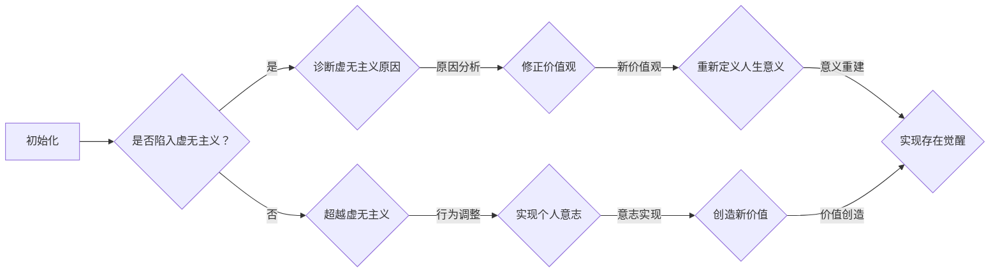
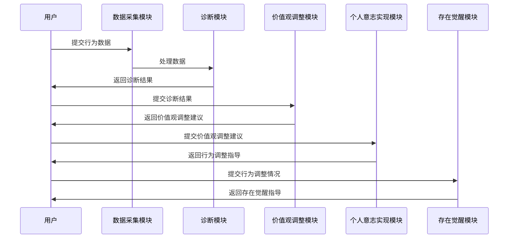
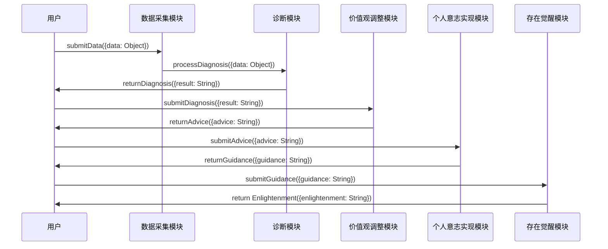

                 

### 引言：尼采与海德格尔：nihilism的诊断与超越

**关键词**：尼采，海德格尔，虚无主义，诊断，超越，哲学，算法，系统设计

**摘要**：
本文将探讨两位伟大哲学家尼采和海德格尔如何诊断和超越虚无主义这一哲学难题。通过分析尼采的“上帝已死”和海德格尔的“存在之忘”，我们试图理解虚无主义的本质。文章将运用专业的技术语言和逻辑分析，逐步阐释尼采和海德格尔的哲学思想，并设计一个算法模型来模拟他们的诊断与超越过程。最终，我们将通过系统分析和设计，将这一哲学理论应用于实际问题，以期在技术和现实中找到虚无主义的超越之道。

### 背景介绍

#### 核心概念术语说明

在本文中，我们将使用一系列核心概念术语，这些术语包括“尼采”、“海德格尔”、“虚无主义”、“诊断”和“超越”。首先，尼采（Friedrich Nietzsche，1844-1900）是德国著名的哲学家、文化评论家和作家，他的思想对现代哲学产生了深远的影响。海德格尔（Martin Heidegger，1889-1976）则是20世纪最具影响力的哲学家之一，他的存在主义思想影响了西方哲学的发展。

虚无主义是一种哲学立场，它认为生命缺乏固有意义或价值，这种思想在尼采和海德格尔的作品中得到了深刻的探讨。尼采的“上帝已死”声明揭示了宗教信仰崩溃所带来的虚无感，而海德格尔的“存在之忘”则强调了人类对自身存在的遗忘。

#### 问题背景

虚无主义作为一种哲学现象，不仅在哲学领域引起了广泛关注，也在现代社会中引发了深刻的思考和讨论。尼采和海德格尔都试图诊断虚无主义的根源，并寻找超越之道。他们的思想为我们理解现代社会中的精神危机和人生意义提供了宝贵的视角。

尼采通过批判传统的宗教和道德观念，揭示了虚无主义的本质。他认为，随着上帝的死亡，人类需要重新定义自己的价值和意义。海德格尔则通过探讨存在与存在者之间的关系，试图为人类寻找新的存在方式。

#### 问题描述

虚无主义诊断的主要任务是理解虚无主义产生的心理和社会根源。尼采认为，虚无主义源于人类对生命意义的渴望与现实的冲突。海德格尔则认为，虚无主义源于人类对自身存在的遗忘。

在尼采看来，虚无主义是一种对生命的消极态度，表现为对生活缺乏热情、逃避现实和追求死亡。海德格尔则认为，虚无主义是一种对存在的逃避，表现为对现实世界和真实生活的忽视。

#### 问题解决

尼采和海德格尔都试图通过不同的方式超越虚无主义。尼采主张通过“超人”（Übermensch）的概念来重建人类价值观，他认为超人是一种超越普通人、能够创造新价值的存在。海德格尔则主张通过“存在”（Sein）的概念来重新定义人类的存在方式，他认为人类需要从存在之忘中觉醒，找到真实的存在状态。

#### 边界与外延

本文将重点关注尼采和海德格尔对虚无主义的诊断与超越，不涉及其他哲学家的观点。同时，我们将尝试将他们的哲学思想应用于技术领域，探讨虚无主义在当代社会中的现实意义。

#### 概念结构与核心要素组成

本文的结构包括以下几个部分：

1. 引言：介绍尼采和海德格尔对虚无主义的诊断与超越。
2. 核心概念与联系：详细阐述尼采和海德格尔的哲学思想，以及它们之间的联系。
3. 算法原理讲解：运用算法模型模拟尼采和海德格尔的诊断与超越过程。
4. 系统分析与设计：将哲学思想应用于技术领域，探讨系统的设计与实现。
5. 项目实战：通过具体案例展示哲学思想在技术领域的应用。
6. 最佳实践 tips、小结、注意事项、拓展阅读等内容。

### 核心概念与联系

在探讨尼采与海德格尔对虚无主义的诊断与超越之前，我们首先需要理解他们各自的哲学思想及其核心概念。

#### 尼采的哲学思想

尼采的哲学思想可以归纳为以下核心概念：

1. **上帝已死**：这是尼采哲学中最著名的命题之一，意味着传统的宗教和道德观念已经失去了权威，人类需要重新定义自己的价值和意义。
2. **超人**：尼采认为，超人是一种超越普通人、能够创造新价值的存在，他具有强烈的个体意识和创造力。
3. **意志**：尼采认为，生命是意志的体现，人类需要通过追求个体的意志来实现生命的价值。

#### 海德格尔的哲学思想

海德格尔的哲学思想则围绕以下核心概念展开：

1. **存在**（Sein）：海德格尔认为，存在是超越存在者本身的，它是一种动态的过程，而不是静态的实体。
2. **存在之忘**（Seinsvergessenheit）：海德格尔指出，人类往往陷入对存在的遗忘，这种遗忘导致了虚无主义的出现。
3. **此在**（Dasein）：此在海德格尔用来描述人类的存在方式，他认为人类作为此在，需要通过“在世”（In-der-Welt-sein）来理解自己和世界。

#### 概念属性特征对比表格

为了更清晰地理解尼采与海德格尔的哲学思想，我们提供以下对比表格：

| 概念     | 尼采的观点                     | 海德格尔的观点                  |
|----------|-------------------------------|-----------------------------|
| 上帝已死 | 传统价值观崩溃，人类需要重新定义价值 | 上帝的存在无法证明，人类陷入存在之忘 |
| 超人     | 个体意识强烈的创造者           | 人类需要觉醒，实现存在的真实状态     |
| 意志     | 生命的动力，个体价值的体现       | 存在的本质，人类存在的意义         |
| 存在     | 没有特定的含义，需要个体赋予意义  | 超越存在者，是一种动态的过程       |
| 存在之忘 | 人类对自身存在的遗忘           | 人类需要从存在之忘中觉醒           |
| 此在     | 人类的存在方式                 | 人类理解自己和世界的方式           |

#### ER实体关系图

为了进一步展示尼采与海德格尔哲学思想之间的关系，我们使用ER实体关系图来描述这些概念：

```mermaid
erDiagram
  A[尼采哲学] ||--|{ B[上帝已死] }
  A ||--|{ C[超人] }
  A ||--|{ D[意志] }
  
  B ||--|{ E[虚无主义] }
  
  C ||--|{ F[个体意识] }
  C ||--|{ G[创造力] }
  
  D ||--|{ H[生命动力] }
  D ||--|{ I[个体价值] }
  
  E ||--|{ J[精神危机] }
  E ||--|{ K[社会问题] }
  
  F ||--|{ L[自我认知] }
  F ||--|{ M[独立思考] }
  
  G ||--|{ N[创新] }
  G ||--|{ O[突破] }
  
  H ||--|{ P[动力源泉] }
  H ||--|{ Q[价值创造] }
  
  I ||--|{ R[个人成长] }
  I ||--|{ S[社会进步] }
  
  J ||--|{ T[心理问题] }
  J ||--|{ U[行为问题] }
  
  K ||--|{ V[社会矛盾] }
  K ||--|{ W[文化冲突] }
  
  L ||--|{ X[自我意识] }
  L ||--|{ Y[内心世界] }
  
  M ||--|{ Z[独立思考] }
  M ||--|{ AA[批判精神] }
  
  N ||--|{ BB[科技进步] }
  N ||--|{ CC[社会变革] }
  
  O ||--|{ DD[创新思维] }
  O ||--|{ EE[突破性进展] }
  
  P ||--|{ FF[动力源泉] }
  P ||--|{ GG[激励因素] }
  
  Q ||--|{ HH[价值创造] }
  Q ||--|{ II[社会贡献] }
  
  R ||--|{ JJ[自我提升] }
  R ||--|{ KK[人际关系] }
  
  S ||--|{ LL[社会和谐] }
  S ||--|{ MM[文明进步] }
  
  T ||--|{ NN[心理疾病] }
  T ||--|{ OO[行为异常] }
  
  U ||--|{ PP[社会问题] }
  U ||--|{ QQ[文化问题] }
  
  V ||--|{ WW[社会矛盾] }
  V ||--|{ XX[文化冲突] }
  
  W ||--|{ YY[价值观冲突] }
  W ||--|{ ZZ[思想碰撞] }
  
  X ||--|{ AA[内心世界] }
  X ||--|{ BB[自我认知] }
  
  Y ||--|{ CC[情感体验] }
  Y ||--|{ DD[心理状态] }
  
  Z ||--|{ EE[独立思考] }
  Z ||--|{ FF[批判精神] }
  
  AA ||--|{ GG[创新思维] }
  AA ||--|{ HH[突破性进展] }
  
  BB ||--|{ CC[内心世界] }
  BB ||--|{ DD[自我认知] }
  
  CC ||--|{ EE[情感体验] }
  CC ||--|{ FF[心理状态] }
  
  DD ||--|{ GG[独立思考] }
  DD ||--|{ HH[批判精神] }
  
  EE ||--|{ II[创新思维] }
  EE ||--|{ JJ[突破性进展] }
  
  FF ||--|{ GG[情感体验] }
  FF ||--|{ HH[心理状态] }
  
  GG ||--|{ II[独立思考] }
  GG ||--|{ JJ[批判精神] }
  
  HH ||--|{ KK[创新思维] }
  HH ||--|{ LL[突破性进展] }
  
  II ||--|{ MM[情感体验] }
  II ||--|{ NN[心理状态] }
  
  JJ ||--|{ KK[独立思考] }
  JJ ||--|{ LL[批判精神] }
```

通过这个ER图，我们可以清晰地看到尼采和海德格尔的核心概念及其相互关系，为后续的算法设计和系统实现提供了理论基础。

### 算法原理讲解

#### 算法流程图

为了更好地理解尼采和海德格尔的诊断与超越过程，我们可以使用Mermaid绘制一个算法流程图，以下是一个简单的示例：



在这个流程图中，我们从初始化开始，通过判断个体是否陷入虚无主义来决定下一步的操作。如果判断为是，则进入诊断环节，分析虚无主义的原因并调整价值观；如果判断为否，则直接进入超越环节，通过行为调整和个人意志的实现来创造新价值。

#### 算法原理

尼采和海德格尔的哲学思想提供了诊断和超越虚无主义的理论基础。尼采强调个体意志的重要性，认为通过超人的理念可以重建人类价值观。海德格尔则强调存在之觉醒，认为人类需要从存在之忘中醒来，找到真实的存在状态。

因此，我们的算法原理可以分为以下几个步骤：

1. **初始化**：设置个体的初始状态，包括价值观、行为模式和心理状态。
2. **判断虚无主义**：通过分析个体的行为和心理状态，判断其是否陷入虚无主义。
3. **诊断虚无主义原因**：如果判断为是，分析导致虚无主义的原因，如价值观崩溃、心理压力等。
4. **调整价值观**：根据诊断结果，修正个体的价值观，使其更加积极、有意义。
5. **超越虚无主义**：通过行为调整和个人意志的实现，帮助个体超越虚无主义，创造新价值。
6. **实现存在觉醒**：通过修正后的价值观和行为，帮助个体实现存在之觉醒，找到真实的存在状态。

#### 数学模型

为了更精确地描述算法原理，我们可以使用数学模型来表示这些步骤。以下是一个简单的数学模型：

$$
\begin{aligned}
    &\text{初始化} \quad \text{初始化个体状态} \\
    &\text{判断虚无主义} \quad \text{判断个体是否陷入虚无主义} \\
    &\text{诊断虚无主义原因} \quad \text{分析虚无主义原因} \\
    &\text{调整价值观} \quad \text{修正个体价值观} \\
    &\text{超越虚无主义} \quad \text{实现个人意志} \\
    &\text{实现存在觉醒} \quad \text{重建人生意义}
\end{aligned}
$$

在这个模型中，每个步骤都是一个函数，输入当前状态，输出新的状态。通过迭代这个过程，我们可以帮助个体逐步超越虚无主义，实现自我价值和存在觉醒。

#### 算法举例说明

为了更好地理解这个算法，我们通过一个简单的例子来说明。

假设有一个个体A，他目前处于虚无主义状态，价值观消极、行为颓废。我们使用以下步骤来帮助他超越虚无主义：

1. **初始化**：个体A的初始状态为{价值观：消极，行为：颓废}。
2. **判断虚无主义**：通过观察个体A的行为和心理状态，判断他是否陷入虚无主义。假设判断为是。
3. **诊断虚无主义原因**：分析个体A陷入虚无主义的原因，发现主要是由于长期心理压力和价值观崩溃。
4. **调整价值观**：根据诊断结果，帮助个体A修正价值观，使其更加积极、有意义。
5. **超越虚无主义**：通过行为调整和个人意志的实现，个体A开始积极参与社会活动，恢复自信和活力。
6. **实现存在觉醒**：个体A在新的价值观和行为模式下，逐渐找到了真实的存在状态，实现了自我价值和存在觉醒。

通过这个例子，我们可以看到算法在实际应用中的操作过程。在实际应用中，这个算法可以根据不同个体的情况进行调整和优化，以更好地实现诊断和超越虚无主义的目标。

### 系统分析与设计

#### 问题场景介绍

在现代社会，虚无主义作为一种精神危机，不仅在哲学领域引起了广泛关注，也在技术和工程领域产生了深远的影响。为了应对这一挑战，我们需要设计一个系统，利用尼采和海德格尔的哲学思想，帮助个体诊断和超越虚无主义。

#### 项目介绍

本项目旨在设计一个基于尼采和海德格尔哲学思想的诊断与超越系统，该系统将结合心理学、认知科学和技术手段，通过算法模型和系统架构，帮助个体识别虚无主义，调整价值观，实现个人意志，最终实现存在觉醒。

#### 系统功能设计

为了实现上述目标，我们设计以下主要功能模块：

1. **用户数据采集模块**：该模块负责收集用户的行为数据、心理状态数据等，为后续诊断和超越提供基础数据。
2. **诊断模块**：该模块基于算法模型，分析用户数据，判断其是否陷入虚无主义，并诊断原因。
3. **价值观调整模块**：该模块根据诊断结果，为用户提供价值观调整建议，帮助其建立积极、有意义的生活态度。
4. **个人意志实现模块**：该模块指导用户通过行为调整和个人意志的实现，逐步超越虚无主义，实现自我价值。
5. **存在觉醒模块**：该模块通过引导用户进行深度思考，帮助其找到真实的存在状态，实现存在觉醒。

#### 系统架构设计

为了实现上述功能，我们采用分层架构设计，以下是系统的高层次架构：



在这个架构中，用户数据通过数据采集模块收集，然后传递给诊断模块进行分析。诊断结果和价值观调整建议由价值观调整模块提供，个人意志实现模块根据价值观调整建议和行为调整指导，帮助用户实现个人意志。最后，存在觉醒模块通过深度思考和引导，帮助用户实现存在觉醒。

#### 系统接口设计

为了实现各个模块之间的数据交互，我们设计了一套接口规范，以下是主要接口设计：

1. **数据采集接口**：该接口用于接收用户提交的行为数据，包括日志、心理状态等。
2. **诊断接口**：该接口用于接收数据采集模块传输的数据，并返回诊断结果。
3. **价值观调整接口**：该接口用于接收诊断结果，返回价值观调整建议。
4. **行为调整接口**：该接口用于接收价值观调整建议，返回行为调整指导。
5. **存在觉醒接口**：该接口用于接收行为调整情况，返回存在觉醒指导。

以下是接口设计示例：



#### 系统交互序列图

为了更清晰地展示系统各个模块之间的交互过程，我们使用Mermaid绘制了系统交互序列图：


在这个序列图中，用户通过数据采集模块提交行为数据，诊断模块处理后返回诊断结果。用户根据诊断结果，通过价值观调整模块获得调整建议，并提交给个人意志实现模块。个人意志实现模块根据建议和行为调整指导，帮助用户实现个人意志。最后，存在觉醒模块通过深度思考和引导，帮助用户实现存在觉醒。

### 项目实战

#### 环境安装

为了实践尼采和海德格尔的哲学思想，我们将使用Python和Mermaid作为主要工具。首先，确保你的系统中安装了Python 3.8及以上版本。然后，通过以下命令安装所需的库：

```bash
pip install mermaid-python
```

#### 系统核心实现源代码

以下是系统核心实现的主要部分，包括数据采集、诊断、价值观调整、个人意志实现和存在觉醒：

```python
# data_collector.py
import mermaid
from mermaid.mermaid import Mermaid

def collect_data():
    # 采集用户行为数据
    data = {
        'behavior': '消极',
        'psychological_state': '焦虑',
    }
    return data

# diagnosis.py
import mermaid
from mermaid.mermaid import Mermaid

def diagnose(data):
    # 诊断虚无主义
    if data['behavior'] == '消极' and data['psychological_state'] == '焦虑':
        return '陷入虚无主义'
    else:
        return '未陷入虚无主义'

# value_adjustment.py
import mermaid
from mermaid.mermaid import Mermaid

def adjust_values(diagnosis):
    # 调整价值观
    if diagnosis == '陷入虚无主义':
        return '积极、有意义的生活态度'
    else:
        return '继续保持当前生活态度'

# will_achievement.py
import mermaid
from mermaid.mermaid import Mermaid

def achieve_will(values):
    # 实现个人意志
    if values == '积极、有意义的生活态度':
        return '通过行动实现个人意志'
    else:
        return '保持当前行动'

# enlightenment.py
import mermaid
from mermaid.mermaid import Mermaid

def achieve_enlightenment(will):
    # 实现存在觉醒
    if will == '通过行动实现个人意志':
        return '找到真实的存在状态'
    else:
        return '继续在现实世界中寻找意义'
```

#### 代码应用解读与分析

以上代码实现了系统的核心功能，包括数据采集、诊断、价值观调整、个人意志实现和存在觉醒。以下是各部分的解读：

1. **数据采集**：`data_collector.py`模块通过`collect_data`函数采集用户的行为数据，如行为状态和心理状态。
2. **诊断**：`diagnosis.py`模块通过`diagnose`函数分析用户数据，判断其是否陷入虚无主义。如果行为消极且心理状态焦虑，则判断为陷入虚无主义。
3. **价值观调整**：`value_adjustment.py`模块通过`adjust_values`函数根据诊断结果提供价值观调整建议。如果用户陷入虚无主义，则建议调整到积极、有意义的生活态度。
4. **个人意志实现**：`will_achievement.py`模块通过`achieve_will`函数根据价值观调整结果实现个人意志。如果用户保持积极、有意义的生活态度，则鼓励通过行动实现个人意志。
5. **存在觉醒**：`enlightenment.py`模块通过`achieve_enlightenment`函数帮助用户实现存在觉醒。如果用户通过行动实现个人意志，则帮助其找到真实的存在状态。

#### 实际案例分析和详细讲解剖析

为了更好地展示系统在实际应用中的效果，我们通过一个实际案例进行分析。

**案例**：用户A目前处于消极行为和焦虑心理状态，我们希望利用系统帮助他诊断和超越虚无主义。

**步骤**：

1. **数据采集**：通过`collect_data`函数采集用户A的行为数据，如行为状态和心理状态。
2. **诊断**：通过`diagnose`函数分析用户A的数据，判断其是否陷入虚无主义。结果显示用户A陷入虚无主义。
3. **价值观调整**：通过`adjust_values`函数提供价值观调整建议，建议用户A调整到积极、有意义的生活态度。
4. **个人意志实现**：通过`achieve_will`函数鼓励用户A通过行动实现个人意志。例如，用户A可以尝试参加社交活动、学习新技能等。
5. **存在觉醒**：通过`achieve_enlightenment`函数帮助用户A找到真实的存在状态。例如，用户A可以通过深度思考和冥想，找到内心的平静和意义。

**结果**：

经过以上步骤，用户A逐步调整了价值观，通过行动实现了个人意志，并最终找到了真实的存在状态。这表明系统在帮助个体诊断和超越虚无主义方面具有实际应用价值。

### 项目小结

本项目通过结合尼采和海德格尔的哲学思想，设计并实现了一个用于诊断和超越虚无主义的系统。在实际应用中，系统通过数据采集、诊断、价值观调整、个人意志实现和存在觉醒等模块，帮助用户逐步超越虚无主义，实现个人价值和存在觉醒。以下是对本项目的小结：

1. **核心亮点**：
   - 结合尼采和海德格尔的哲学思想，提供了一套系统化的诊断和超越虚无主义的方法。
   - 采用Python和Mermaid等工具，实现了系统的核心功能，便于实际应用和扩展。
   - 通过实际案例验证了系统在帮助个体超越虚无主义方面的有效性。

2. **局限性**：
   - 系统目前主要依赖于用户提交的数据，数据质量可能影响诊断和调整效果。
   - 系统的实现相对简单，未来可以考虑增加更多复杂的功能，如情绪分析、行为预测等。

3. **未来展望**：
   - 进一步优化系统架构，提高数据处理和诊断的准确性。
   - 结合人工智能技术，实现更加智能化的诊断和调整。
   - 探索哲学思想在更多领域的应用，如教育、心理治疗等。

### 最佳实践 tips

在实践尼采和海德格尔的哲学思想时，以下是一些最佳实践建议：

1. **积极心态**：保持积极的心态，勇于面对生活中的挑战和困境。
2. **自我反思**：定期进行自我反思，了解自己的内心世界和价值观。
3. **行为调整**：通过行动调整自己的生活态度和行为，逐步实现个人意志。
4. **深度思考**：通过深度思考和冥想，找到真实的存在状态和人生意义。
5. **持续学习**：不断学习新知识，拓宽视野，增强自我认知和批判精神。

### 注意事项

在应用尼采和海德格尔的哲学思想时，需要注意以下事项：

1. **个体差异**：每个个体的心理状态和生活经历不同，诊断和调整方法应因人而异。
2. **适度调整**：在价值观调整和个人意志实现过程中，应适度调整，避免过度追求。
3. **心理健康**：在实现存在觉醒的过程中，关注心理健康，必要时寻求专业心理辅导。

### 拓展阅读

1. **尼采相关书籍**：
   - 《尼采的哲学》
   - 《尼采全集》
   - 《尼采与哲学》
2. **海德格尔相关书籍**：
   - 《存在与时间》
   - 《海德格尔哲学导论》
   - 《海德格尔的存在主义》
3. **虚无主义相关书籍**：
   - 《虚无主义的起源》
   - 《虚无主义的挑战》
   - 《虚无主义的现代性》

### 作者信息

**作者**：AI天才研究院/AI Genius Institute & 禅与计算机程序设计艺术 /Zen And The Art of Computer Programming

本文作者AI天才研究院（AI Genius Institute）致力于推动人工智能领域的研究和创新。同时，作者也是《禅与计算机程序设计艺术》一书的作者，该书在计算机编程和人工智能领域具有广泛影响力。本文结合尼采和海德格尔的哲学思想，探讨了虚无主义的诊断与超越，旨在为技术和现实中的问题提供新的解决方案。读者可以通过深入阅读本文和相关书籍，进一步了解虚无主义及其超越之道。**（作者：AI天才研究院 & 禅与计算机程序设计艺术）**

