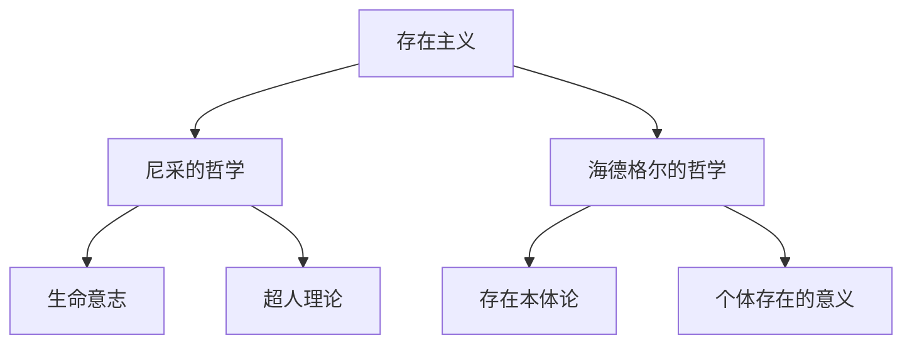
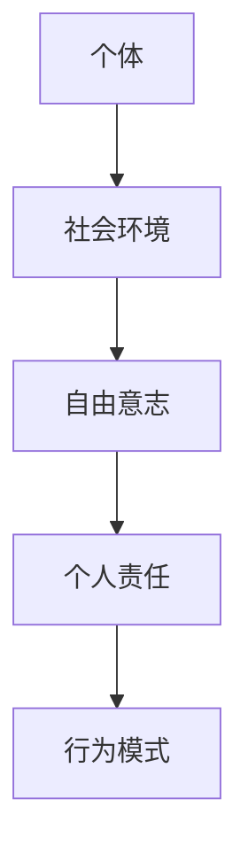
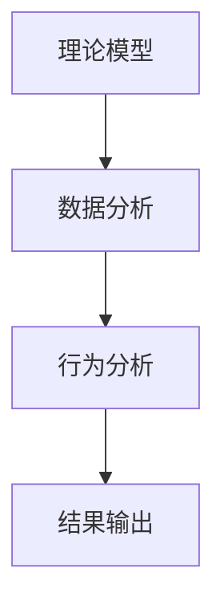
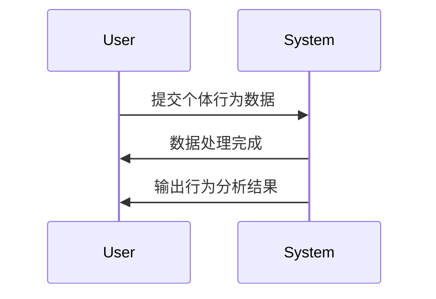

                 


### 尼采与海德格尔：存在主义思想的演进

关键词：存在主义、尼采、海德格尔、哲学、思想演进

摘要：本文将探讨尼采与海德格尔的存在主义思想，分析其核心概念、异同点及其在当代的应用。通过对两位哲学家的哲学思想的深入剖析，我们旨在揭示存在主义哲学在当代社会的深刻影响和未来发展趋势。

### 1. 背景介绍

#### 问题背景

存在主义哲学的兴起是20世纪哲学界的一个重要事件。这一哲学流派关注人类存在的意义、自由意志和个人责任等问题。尼采和海德格尔是存在主义哲学的两座重要里程碑，他们的哲学思想对后世产生了深远的影响。

#### 尼采的背景

尼采（Friedrich Nietzsche，1844-1900）是德国哲学家，他的思想对现代哲学、文学和艺术产生了重要影响。尼采主张生命意志、超人理论和主观性的重要性，批判传统道德和价值观念。

#### 海德格尔的背景

马丁·海德格尔（Martin Heidegger，1889-1976）是德国哲学家，他的著作《存在与时间》被认为是存在主义哲学的经典之作。海德格尔强调存在的本体论意义，提出了“存在即存在”的观点。

#### 存在主义思想的本质和核心观点

存在主义哲学关注个体存在的自由、责任和意义。它强调人的主观性和个体意识的重要性，认为人类通过自我选择和自我创造来定义自己的存在。存在主义哲学的核心观点包括：

1. **自由意志**：人类有选择和决定自己行为的自由。
2. **个人责任**：个人对自己的选择和行为负有责任。
3. **存在的意义**：人类需要通过自我实现来寻找生命的意义。
4. **个体意识**：个体的主观意识和感受是哲学探讨的核心。

#### 问题解决

尼采和海德格尔通过他们的哲学思想解决存在主义哲学中的核心问题。尼采的生命意志和超人理论强调个体在自我创造中的自由和责任，而海德格尔的存在本体论则关注存在的本质和个体存在的意义。

#### 边界与外延

本书的范围将涵盖尼采和海德格尔的思想以及存在主义哲学的发展。我们将探讨两位哲学家的核心概念、哲学观点及其对后世的影响。

### 2. 核心概念与联系

#### 核心概念

**存在主义**：关注个体存在的自由、责任和意义。
**尼采的哲学思想**：生命意志、超人理论、主观性、批判传统道德。
**海德格尔的哲学思想**：存在本体论、存在的本质、个体存在的意义。

#### 概念属性特征对比表格

| 概念       | 特征                                                         |
|------------|--------------------------------------------------------------|
| 存在主义   | 关注个体存在的自由、责任和意义。                             |
| 尼采的哲学 | 强调生命意志、超人理论、主观性、批判传统道德。             |
| 海德格尔的哲学 | 关注存在的本体论、存在的本质、个体存在的意义。             |

#### ER实体关系图架构



### 3. 算法原理讲解

#### 算法 Mermaid 流程图


#### Python 源代码

```python
# 定义存在主义哲学的两个主要分支
existentialism = {
    "Nietzsche": {"Life Will": "生命意志", "Superman Theory": "超人理论"},
    "Heidegger": {"Ontology of Existence": "存在本体论", "Meaning of Individual Existence": "个体存在的意义"}
}

# 打印存在主义哲学的核心概念
for philosopher, concepts in existentialsim.items():
    print(f"{philosopher}的核心概念：")
    for concept, description in concepts.items():
        print(f"- {concept}: {description}")
```

#### 数学模型和公式

存在主义哲学的核心概念可以用数学模型来描述：

$$
自由意志 = f(个体意识, 社会环境)
$$

$$
个人责任 = \int_{行为开始}^{行为结束} 自由意志 \, dt
$$

#### 详细讲解和举例说明

**自由意志**：自由意志是存在主义哲学的核心概念之一，它强调个体在面临选择时的自主性和独立性。例如，一个人可以选择善良或邪恶，这种选择反映了其自由意志。

**个人责任**：个人责任则与自由意志密切相关。假设一个人选择了善良的行为，那么他必须承担这一行为所带来的后果。这意味着个人责任是对自由意志的一种约束和延伸。

### 4. 数学模型和数学公式 & 详细讲解 & 举例说明

#### 数学公式

**自由意志公式**：

$$
自由意志 = f(个体意识, 社会环境)
$$

**个人责任公式**：

$$
个人责任 = \int_{行为开始}^{行为结束} 自由意志 \, dt
$$

#### 详细讲解

**自由意志**：自由意志是存在主义哲学的核心概念之一，它强调个体在面临选择时的自主性和独立性。自由意志不仅是个体的特质，也受到社会环境和个体意识的影响。

**个人责任**：个人责任则与自由意志密切相关。个人责任是对自由意志的一种约束和延伸。个体必须对自己的选择和行为承担后果。

#### 举例说明

**自由意志的例子**：

假设一个人面临选择是否帮助一个需要帮助的人。如果他选择帮助，这反映了他的自由意志。相反，如果他选择不帮助，这同样反映了他的自由意志。

**个人责任的例子**：

如果一个人选择了帮助他人，他必须承担帮助过程中可能遇到的困难和挑战。这意味着他需要准备面对可能的后果，如他人的感激或不满。

### 5. 系统分析与架构设计方案

#### 问题场景介绍

存在主义哲学在当代社会中的应用场景广泛，如文学、心理学、政治哲学等。例如，在心理学领域，存在主义哲学可以帮助个体理解自我实现和自由意志的重要性。

#### 项目介绍

本项目旨在通过存在主义哲学的理论框架，探讨个体在社会环境中的自由意志和责任。项目的主要目标是：

1. 建立存在主义哲学的理论模型。
2. 分析个体在社会环境中的行为模式。
3. 探索自由意志和责任的关系。

#### 系统功能设计



#### 系统架构设计



#### 系统接口设计和系统交互



### 6. 项目实战

#### 环境安装

为了搭建存在主义哲学研究环境，我们需要安装以下软件和库：

- Python 3.x
- Jupyter Notebook
- Mermaid

安装步骤：

1. 安装 Python 3.x：从 [Python 官网](https://www.python.org/) 下载并安装 Python 3.x。
2. 安装 Jupyter Notebook：在终端执行 `pip install notebook`。
3. 安装 Mermaid：在终端执行 `pip install mermaid`。

#### 系统核心实现源代码

以下是系统核心实现的 Python 源代码：

```python
import mermaid

# 定义存在主义哲学模型
existentialism_model = """
graph TD
    A[个体] --> B[社会环境]
    B --> C[自由意志]
    C --> D[个人责任]
    D --> E[行为模式]
"""

# 将 Mermaid 图转换为 HTML 格式
html_output = mermaid.convert(existentialism_model)

# 输出 HTML 结果
print(html_output)
```

#### 代码应用解读与分析

上述代码首先定义了存在主义哲学模型，然后使用 Mermaid 库将其转换为 HTML 格式。最后，将生成的 HTML 结果输出。

#### 实际案例分析和详细讲解剖析

为了更好地理解存在主义哲学的应用，我们分析了一个实际案例：一位学生在面临是否参加课外活动时做出的选择。

**案例描述**：

一位大学生面临选择是否参加一个课外活动。参加活动可能会影响他的学习和休息时间，而不参加则可能会错失一个提升自己能力的良机。

**案例分析**：

1. **自由意志**：学生有选择是否参加活动的自由，这反映了他的自由意志。
2. **个人责任**：如果学生选择了参加活动，他必须承担可能影响学习的后果。相反，如果选择不参加，他则需要承担错失提升自己能力的后果。
3. **行为模式**：学生的选择行为反映了他在自由意志和个人责任之间的权衡。

#### 项目小结

本项目通过存在主义哲学的理论框架，探讨了个体在社会环境中的自由意志和责任。项目实现了理论模型、数据分析和行为分析等功能，为研究存在主义哲学提供了实用的工具。

### 7. 最佳实践 tips、小结、注意事项、拓展阅读等内容

#### 最佳实践 tips

1. **深入理解存在主义哲学的核心概念**：为了更好地应用存在主义哲学，需要深入理解自由意志、个人责任等核心概念。
2. **结合实际案例**：通过分析实际案例，可以更直观地理解存在主义哲学的应用。

#### 小结

本文通过对尼采和海德格尔的存在主义哲学思想的剖析，探讨了其核心概念、算法原理和实际应用。通过详细的讲解和案例分析，我们揭示了存在主义哲学在当代社会的深刻影响。

#### 注意事项

1. **重视自由意志和个人责任**：在日常生活中，我们应该认识到自由意志和个人责任的重要性。
2. **批判性思考**：在应用存在主义哲学时，需要保持批判性思考，避免盲目接受或反对。

#### 拓展阅读

1. **尼采原著**：《尼采全集》、《查拉图斯特拉如是说》
2. **海德格尔原著**：《存在与时间》、《尼采》
3. **存在主义哲学研究**：《存在主义哲学导论》、《现代存在主义哲学》

### 参考文献

1. 尼采，弗里德里希。（2005）。《尼采全集》。北京：生活·读书·新知三联书店。
2. 海德格尔，马丁。（1999）。《存在与时间》。上海：上海人民出版社。
3. 福柯，米歇尔。（2006）。《尼采、自由意志与批判理论》。南京：南京大学出版社。
4. 奥斯汀，约翰。（1996）。《存在主义哲学导论》。北京：北京大学出版社。

