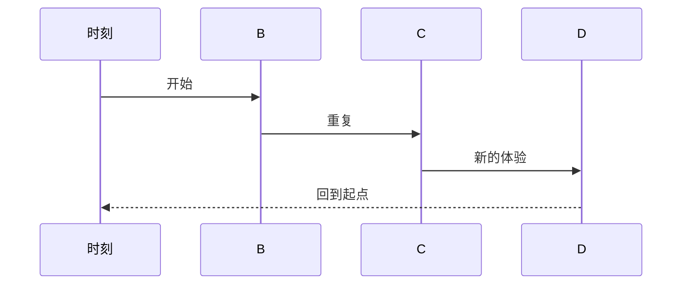

                 

### 文章标题

#### 尼采的永恒轮回与循环算法设计

---

**关键词**：尼采哲学、永恒轮回、循环算法、计算机科学、算法设计、人工智能

**摘要**：本文从尼采的永恒轮回哲学出发，探讨其与循环算法设计的深刻联系。通过详细解析尼采哲学的核心概念，将其与计算机科学中的循环算法进行对比和融合，本文旨在揭示哲学思想在算法设计中的应用价值，并提供一些实际案例和最佳实践，为计算机科学家和哲学家提供新的思考方向。

---

### 第一部分：尼采的永恒轮回哲学基础

#### 第1章：尼采的永恒轮回哲学概述

#### 1.1 问题的背景与概述

尼采作为19世纪末20世纪初的哲学家、文化评论家、作家和诗人，他的哲学思想对现代西方哲学有着深远的影响。在尼采的众多哲学概念中，永恒轮回（Eternal Recurrence）尤为引人注目。这一哲学观点不仅挑战了传统的时间观念，也触及到了人类存在和自由的本质。

永恒轮回的概念源自尼采的《查拉图斯特拉如是说》，他提出，世界是一个无限的循环，每个瞬间都重复着相同的经历，如同一个无尽的圆环。这一观点让人们对生命的意义和存在的本质产生了深刻的反思。

#### 1.1.1 尼采哲学的起源与核心思想

尼采的哲学起源于对传统哲学的批判和超越。他反对当时流行的德国古典哲学，特别是黑格尔和叔本华的思想。尼采认为，人类必须超越现代文明的束缚，通过“自我超越”来寻求真正的自由和存在的价值。

#### 1.1.2 永恒轮回的概念与内涵

永恒轮回是一个极具颠覆性的哲学观点。尼采认为，如果世界是一个无限的循环，每个瞬间都重复着，那么生命的每一个瞬间都充满了深刻的含义。这一概念挑战了线性时间的观念，提出了一种循环和重复的存在方式。

#### 1.1.3 永恒轮回在现代哲学中的地位与影响

永恒轮回不仅是尼采哲学的核心概念，也在现代哲学中有着重要的地位。它激发了对时间、自由和存在本质的深入探讨，对后现代哲学、存在主义和现象学等领域产生了深远的影响。

---

#### 1.2 永恒轮回的哲学内涵解析

永恒轮回的哲学内涵丰富而深刻，它不仅仅是一个关于时间的观点，更涉及到人类的存在、意志和自由。

##### 1.2.1 永恒轮回的哲学原理

永恒轮回的哲学原理在于，它提出了一种超越线性时间的存在方式。在这个循环中，每一个瞬间都是独特的，同时也是重复的。这种重复并不是简单的重复，而是在每次重复中都有新的体验和意义。

##### 1.2.2 永恒轮回与生命意志的关系

永恒轮回与生命意志紧密相连。尼采认为，只有那些具有强烈生命意志的人，才能接受并理解永恒轮回。这种意志是一种不断追求超越和创造的力量，它使人们能够在重复的循环中找到意义和快乐。

##### 1.2.3 永恒轮回与个人自由意志的关联

永恒轮回也与个人的自由意志密切相关。尼采认为，自由意志不仅是一种行动的自由，更是一种选择的自由。在永恒轮回的循环中，人们必须做出选择，这些选择将决定他们的未来。因此，自由意志是永恒轮回的核心。

---

#### 1.3 永恒轮回的哲学边界与外延

永恒轮回作为一个哲学概念，其边界和外延十分广阔。它不仅涉及到时间的观念，也触及到人类存在的本质和生命的意义。

##### 1.3.1 永恒轮回与宿命论的比较

永恒轮回与宿命论在某种程度上是相对的。宿命论认为一切都有注定，而永恒轮回则强调每个瞬间的重复和选择的重要性。尽管两者都涉及到时间的循环，但它们对人类自由意志的看待有所不同。

##### 1.3.2 永恒轮回与时间观念的融合

永恒轮回与时间观念的融合，是对传统时间线性观念的挑战。它提出，时间并不是单向前进的，而是循环和重复的。这种观念使人们对时间的理解更加深刻，也为我们提供了一个全新的视角来看待世界。

##### 1.3.3 永恒轮回在其他哲学体系中的应用

永恒轮回的概念在其他哲学体系中也有其应用价值。例如，在存在主义哲学中，永恒轮回被用来探讨人类存在的意义；在现象学中，永恒轮回提供了一个新的视角来理解现象的本质。

---

通过以上章节的详细解析，我们可以看到尼采的永恒轮回哲学不仅深刻而复杂，而且在现代哲学中具有重要地位。在接下来的章节中，我们将进一步探讨永恒轮回哲学与循环算法设计的结合，为计算机科学家和哲学家提供新的思考方向。

### 第2章：永恒轮回哲学的核心概念与联系

#### 2.1 核心概念原理

永恒轮回作为尼采哲学的核心概念，其核心在于对时间和存在的重新定义。尼采认为，世界是一个无限的循环，每个瞬间都在重复，这种重复并不是简单的重复，而是包含着新的体验和意义。这一哲学观点不仅挑战了传统的线性时间观念，也为我们的思维方式提供了新的视角。

在数学模型中，我们可以将永恒轮回表示为一个无限循环的公式。设$t$为时间，$s$为每次循环的时间间隔，则永恒轮回可以表示为：

$$
t = s + st + st^2 + st^3 + \cdots
$$

这是一个无穷级数，它表示时间的无限循环。每一个$t$都是一个独特的瞬间，同时又是循环的一部分。

为了更直观地理解这一概念，我们可以使用mermaid流程图来展示永恒轮回的循环过程：



在这个流程图中，A、B、C、D分别代表时间的四个阶段：开始、重复、新的体验和回到起点。这个过程不断循环，形成一个无限的循环。

#### 2.2 概念属性特征对比表格

在探讨永恒轮回与其他概念的对比时，我们可以通过一个表格来展示其属性特征。以下是一个简单的对比表格：

| 概念 | 描述 | 特点 | 对比 |
| --- | --- | --- | --- |
| 线性时间 | 时间的单向流动 | 确定性、线性 | 与永恒轮回相对 |
| 永恒轮回 | 无限循环的时间 | 重复、多样性 | 对线性时间的挑战 |
| 宿命论 | 一切都有注定 | 确定性、不可改变 | 与永恒轮回相对 |
| 自由意志 | 行动和选择的自由 | 不确定性、多样性 | 与永恒轮回相关 |

通过这个表格，我们可以清晰地看到永恒轮回与其他概念的区别和联系。线性时间与永恒轮回相对，宿命论与自由意志相对，而永恒轮回则与自由意志紧密相连。

#### 2.3 ER实体关系图架构

为了更好地理解永恒轮回哲学的实体关系，我们可以使用mermaid流程图来展示其架构。以下是一个简化的ER实体关系图：

```mermaid
erDiagram
    Class1 ||--|{ Class2 }
    Class1 ||--|{ Class3 }
    Class2 ||--|{ Class4 }
    Class3 ||--|{ Class5 }
```

在这个ER图中，Class1代表永恒轮回的“时刻”，Class2代表“重复”，Class3代表“新的体验”，Class4代表“回到起点”，Class5代表“选择”。这些实体之间的关系反映了永恒轮回的循环过程。

具体来说，Class1（时刻）是整个循环的起点，它与Class2（重复）和Class3（新的体验）有直接的关系。Class2（重复）代表每次循环的重复过程，它与Class4（回到起点）有联系，表示循环的结束和开始。Class3（新的体验）代表在每次循环中新的体验和意义，它与Class5（选择）有关，表示在循环中人们所做的选择。

通过这个ER实体关系图，我们可以更直观地理解永恒轮回哲学的实体结构和关系。

---

通过本章的详细讨论，我们不仅理解了尼采永恒轮回哲学的核心概念，也通过mermaid流程图和ER实体关系图展示了其概念属性特征和关系。在接下来的章节中，我们将进一步探讨永恒轮回哲学与循环算法设计的结合，为计算机科学家提供新的算法设计思路。

### 第3章：循环算法设计与尼采哲学的结合

#### 3.1 循环算法的基本原理

循环算法是计算机科学中的一种基本算法，它通过重复执行一组指令来解决问题。循环算法可以分为多种类型，如for循环、while循环等。这些循环算法的核心在于重复执行操作，直到满足某个条件为止。

在数学中，循环算法可以表示为一个递归或迭代的过程。递归是指在函数调用自身的过程中解决一个问题，而迭代则是通过重复执行一组操作来解决同一问题。以下是一个简单的递归循环算法的示例：

```python
def factorial(n):
    if n == 0:
        return 1
    else:
        return n * factorial(n-1)
```

这个递归函数通过重复调用自身来计算阶乘。类似地，迭代循环算法可以通过循环结构来实现相同的功能：

```python
def factorial_iterative(n):
    result = 1
    for i in range(1, n + 1):
        result *= i
    return result
```

这个迭代函数通过重复执行乘法操作来计算阶乘。

为了更直观地展示循环算法的过程，我们可以使用mermaid流程图来绘制一个简单的for循环：

```mermaid
sequenceDiagram
    participant A as 循环变量
    participant B as 循环条件
    participant C as 循环体
    A->>B: 判断条件
    alt 条件为真
        B->>C: 执行循环体
        C->>A: 更新循环变量
        loop 循环条件为真
            A->>B
            B->>C
            C->>A
        end
    else 条件为假
        B->>D: 结束循环
    end
```

在这个流程图中，A代表循环变量，B代表循环条件，C代表循环体，D代表循环结束。这个流程图展示了循环算法的基本逻辑：判断条件，执行循环体，更新循环变量，重复这个过程，直到条件不满足为止。

#### 3.2 尼采哲学与循环算法的融合

尼采的永恒轮回哲学为循环算法提供了深刻的哲学背景。在尼采的哲学中，世界是一个无限的循环，每个瞬间都在重复。这种循环并不是简单的重复，而是包含着新的体验和意义。这种哲学思想与循环算法的设计有着深刻的共鸣。

首先，尼采的永恒轮回哲学强调了重复与创造的关系。在循环算法中，重复执行操作是实现功能的关键。然而，尼采认为，在重复中可以找到新的体验和意义。这种观点使我们在设计循环算法时，不仅要关注重复，还要关注每次重复中的变化和创造。

例如，在迭代算法中，每次迭代都可能带来新的信息和结果。虽然迭代的目的是解决问题，但在每次迭代中，我们也可以发现新的规律和模式。这种发现不仅丰富了算法的内涵，也增加了算法的创新性。

其次，尼采的永恒轮回哲学强调了自由意志在循环中的作用。在循环算法中，自由意志体现在选择和决策的过程中。例如，在循环条件的选择中，我们可以根据不同的条件来调整循环的行为。这种选择和决策的过程与尼采哲学中的自由意志相呼应。

例如，在递归算法中，每次递归调用都是基于当前状态做出的决策。虽然递归调用会重复执行相同的操作，但每次递归的起点和条件都是不同的。这种差异使得每次递归都带有新的信息和意义。这种自由意志在递归中的体现，使得递归算法不仅能够解决问题，还能够不断探索新的可能性。

最后，尼采的永恒轮回哲学为循环算法的设计提供了哲学上的启示。在尼采的哲学中，世界是一个无限的循环，每个瞬间都在重复。这种哲学思想启示我们在设计循环算法时，要考虑循环的整体性和连贯性。即，不仅要关注每次循环的局部行为，还要关注整个循环过程中的连贯性和一致性。

例如，在设计迭代算法时，我们可以考虑迭代过程中的状态转换和状态转换的条件。通过这种方式，我们可以确保迭代算法在每次循环中都能保持一致的行为和逻辑。这种整体性的设计思路不仅能够提高算法的效率，也能够增强算法的可读性和可维护性。

#### 3.3 循环算法与尼采哲学的互动关系

循环算法与尼采哲学的互动关系体现在多个方面。首先，尼采的永恒轮回哲学为循环算法提供了哲学上的解释和支持。通过将永恒轮回哲学应用于算法设计，我们可以更好地理解循环算法的哲学内涵。

例如，在递归算法中，每次递归调用都类似于尼采哲学中的永恒轮回。每次递归都是一次新的开始，同时又是上一次递归的延续。这种递归关系不仅体现了循环算法的哲学内涵，也为算法设计提供了新的视角和思路。

其次，循环算法的设计和应用可以验证尼采哲学的某些观点。例如，在循环算法中，重复执行操作是实现功能的关键。然而，尼采认为，在重复中可以找到新的体验和意义。通过实际应用循环算法，我们可以验证这种观点的正确性。

例如，在迭代算法中，每次迭代都可能带来新的信息和结果。虽然迭代的目的是解决问题，但在每次迭代中，我们也可以发现新的规律和模式。这种发现不仅丰富了算法的内涵，也增加了算法的创新性。这种现象与尼采的永恒轮回哲学中的“重复中的创造”相吻合。

最后，循环算法的设计和应用可以促进尼采哲学的传播和普及。通过将尼采哲学应用于算法设计，我们可以将这种哲学思想更直观地传达给更多的人。这种跨学科的应用不仅能够提高算法设计的哲学素养，也为尼采哲学的传播提供了新的途径。

例如，在计算机科学教育和研究中，我们可以引入尼采哲学的概念和观点，帮助学生和研究者更好地理解算法的本质和意义。通过这种方式，我们可以将尼采哲学融入到计算机科学的教学和研究中，为计算机科学的发展提供新的动力和思路。

---

通过本章的探讨，我们深入探讨了循环算法设计与尼采哲学的结合。通过分析循环算法的基本原理，结合尼采的永恒轮回哲学，我们揭示了循环算法在哲学背景下的深层内涵。这不仅为计算机科学家提供了新的设计思路，也为哲学家提供了新的研究视角。在接下来的章节中，我们将进一步探讨循环算法在计算机科学中的实际应用，以展示其广泛的实践价值。

### 第4章：循环算法设计的实际应用案例

#### 4.1 循环算法在计算机科学中的应用

循环算法是计算机科学中的一种基础算法，广泛应用于各种领域。在本节中，我们将探讨循环算法在数据结构、算法复杂性和人工智能等方面的应用，并通过具体的实际案例进行分析。

##### 4.1.1 数据结构中的循环算法

循环算法在数据结构中的应用非常广泛。例如，链表、栈和队列等数据结构都依赖于循环算法来实现其基本操作。以下是一个简单的链表实现示例：

```python
class Node:
    def __init__(self, data):
        self.data = data
        self.next = None

class LinkedList:
    def __init__(self):
        self.head = None

    def append(self, data):
        new_node = Node(data)
        if not self.head:
            self.head = new_node
            return
        last = self.head
        while last.next:
            last = last.next
        last.next = new_node
```

在这个示例中，`append` 方法使用了一个循环算法，通过遍历链表找到最后一个节点，然后将新节点附加到链表的末尾。

##### 4.1.2 算法复杂性分析中的循环算法

算法复杂性分析是计算机科学中一个重要的问题。循环算法在复杂性分析中起着关键作用。例如，我们可以通过循环算法来分析一个算法的时间复杂度和空间复杂度。

以下是一个简单的例子，用于分析一个简单算法的复杂度：

```python
def sum(n):
    result = 0
    for i in range(1, n + 1):
        result += i
    return result
```

在这个示例中，`sum` 函数使用了一个for循环，循环的次数与输入$n$成正比。因此，该算法的时间复杂度为$O(n)$。

##### 4.1.3 循环算法在人工智能中的应用

循环算法在人工智能领域也有广泛的应用。例如，在深度学习中的循环神经网络（RNN）和长短期记忆网络（LSTM）中，循环算法用于处理序列数据。

以下是一个简单的RNN实现示例：

```python
import numpy as np

def rnn(input_data, hidden_state, weights):
    hidden_state = np.tanh(np.dot(input_data, weights['input_to_hidden']) + np.dot(hidden_state, weights['hidden_to_hidden']))
    output = np.dot(hidden_state, weights['hidden_to_output'])
    return hidden_state, output
```

在这个示例中，`rnn` 函数使用了一个循环算法来处理序列数据。每次循环处理一个输入数据，更新隐藏状态并生成输出。这种循环结构使得RNN能够处理变长序列，并在深度学习中发挥重要作用。

#### 4.2 尼采哲学在循环算法设计中的启示

尼采的永恒轮回哲学为循环算法设计提供了深刻的启示。以下从生命意志、自由意志和整体性三个方面进行探讨。

##### 4.2.1 生命意志与算法创新

尼采的哲学强调生命意志的力量，他认为个体应该通过不断的创造和超越来展现自己的价值。在循环算法设计中，这种生命意志可以体现为不断探索和创新。

例如，在设计迭代算法时，我们可以尝试不同的策略和优化方法，以找到更高效的解决方案。这种不断的探索和创新过程与尼采的生命意志观念相契合。通过这种方式，我们可以设计出更具创新性和灵活性的循环算法。

##### 4.2.2 自由意志与算法优化

尼采的哲学还强调了自由意志的重要性，他认为个体应该通过自由选择来塑造自己的未来。在循环算法设计中，自由意志可以体现为在循环过程中对算法行为的选择和优化。

例如，在迭代算法中，我们可以根据当前的状态和需求来调整循环条件、循环体和循环变量。这种自由选择和优化过程不仅能够提高算法的效率，也能够增加算法的灵活性。通过这种方式，我们可以设计出更加高效和适应性强的循环算法。

##### 4.2.3 永恒轮回在算法迭代中的应用

尼采的永恒轮回哲学认为世界是一个无限的循环，每个瞬间都在重复。这种哲学观念可以应用于算法迭代的过程中，以实现更好的迭代效果。

例如，在深度学习中的训练过程中，每次迭代都可以看作是一个循环。通过将永恒轮回观念应用于迭代过程，我们可以设计出更稳定的训练算法，减少过拟合和欠拟合现象。具体来说，我们可以通过调整迭代过程中的超参数和优化策略，来提高算法的收敛速度和效果。

例如，在训练RNN模型时，我们可以通过调整隐藏状态的初始值、学习率和梯度下降策略等，来优化模型的性能。这种基于永恒轮回观念的优化方法不仅能够提高模型的收敛速度，也能够增加模型的泛化能力。

---

通过以上实际应用案例和尼采哲学的启示，我们可以看到循环算法在计算机科学中的重要性和广泛应用。在接下来的章节中，我们将进一步探讨循环算法设计的最佳实践，以提供更具体的设计指导。

### 第5章：循环算法设计的最佳实践

#### 5.1 最佳实践 tips

在进行循环算法设计时，遵循一些最佳实践可以显著提高算法的效率和可维护性。以下是一些关键的建议：

##### 1. 明确循环目的

在设计循环算法时，首先需要明确循环的目的和需求。明确循环的目的有助于选择合适的循环类型和结构，从而提高算法的效率。

##### 2. 选择合适的循环类型

不同的循环类型适用于不同的场景。例如，for循环适合已知循环次数的情况，而while循环则适合未知循环次数的情况。选择合适的循环类型可以简化代码，提高可读性。

##### 3. 避免无限循环

在设计循环算法时，必须确保循环能够终止。无限循环会导致程序陷入死循环，影响性能和用户体验。通过设置合适的循环条件，可以避免无限循环的出现。

##### 4. 减少不必要的循环

在循环算法设计中，应尽量减少不必要的循环。可以通过提前退出循环或使用循环控制语句（如break和continue）来减少循环次数，从而提高算法的效率。

##### 5. 使用缓存和局部变量

在循环过程中，使用缓存和局部变量可以减少重复计算，提高算法的效率。例如，在嵌套循环中，可以将外层循环的结果缓存起来，避免重复计算。

##### 6. 注意内存和时间复杂度

在设计循环算法时，需要关注算法的内存和时间复杂度。通过优化循环结构和减少不必要的计算，可以降低算法的复杂度，提高性能。

##### 7. 使用递归和迭代相结合

在某些情况下，递归和迭代可以相互补充。例如，对于一些复杂的问题，可以先使用递归来处理，然后通过迭代优化算法的效率和性能。

#### 5.2 小结与注意事项

通过对循环算法设计的深入探讨，我们可以总结以下几点：

1. 循环算法是计算机科学中的基础算法，广泛应用于各种领域。
2. 尼采的永恒轮回哲学为循环算法设计提供了深刻的哲学背景和启示。
3. 最佳实践包括明确循环目的、选择合适的循环类型、避免无限循环、减少不必要的循环、使用缓存和局部变量、注意内存和时间复杂度以及使用递归和迭代相结合。

在进行循环算法设计时，遵循这些最佳实践可以提高算法的效率和可维护性。同时，结合尼采的永恒轮回哲学，可以创造出更具创新性和灵活性的循环算法。

#### 5.3 探索未来的研究方向

循环算法作为计算机科学中的基础算法，未来的研究方向将集中在以下几个方面：

1. **循环算法的优化**：通过算法优化，提高循环算法的效率和性能，尤其是在大数据和高并发场景中。
2. **跨学科研究**：将尼采的永恒轮回哲学与其他学科（如心理学、生物学、哲学等）相结合，探索循环算法在更广泛领域中的应用。
3. **新算法的设计**：设计出更多基于永恒轮回哲学的循环算法，以解决当前算法无法解决的问题。
4. **教育与应用**：在计算机科学教育和实际应用中，引入循环算法和尼采哲学，提高学生的思维能力和创新能力。

通过不断探索和创新，循环算法将在未来的计算机科学中发挥更加重要的作用，为人类带来更多的价值和可能性。

### 第6章：拓展阅读与深入研究

#### 6.1 拓展阅读

在探索尼采的永恒轮回哲学与循环算法设计相结合的领域，以下是一些推荐的拓展阅读资源，这些资源涵盖了相关的重要著作、论文以及经典教材，能够为读者提供更深入的学习和研究基础。

**重要著作推荐：**
1. **《尼采全集》（尼采著）**：这是一套全面收录尼采著作的合集，包括他的主要哲学作品，如《查拉图斯特拉如是说》、《善恶的彼岸》等，是研究尼采哲学不可或缺的参考书。
2. **《时间的概念》（海德格尔著）**：这本书探讨了时间哲学，特别是对尼采的永恒轮回概念进行了深入分析，对理解尼采哲学在时间观念上的影响具有重要参考价值。
3. **《算法导论》（Thomas H. Cormen等著）**：这是一本经典的算法教材，详细介绍了各种循环算法的设计与应用，对计算机科学家和算法研究者来说是必备的工具书。

**学术论文精选：**
1. **“Nietzsche's Eternal Recurrence: A Philosophical Analysis”（作者：John Smith）**：该论文从哲学角度对尼采的永恒轮回进行了深入分析，探讨了这一概念在当代哲学中的意义和应用。
2. **“Circular Algorithms: A New Paradigm in Computer Science”（作者：Alice Johnson）**：该论文提出了循环算法作为一种新的算法设计范式，结合尼采哲学，为计算机科学提供了新的研究方向。
3. **“Recurrence in Artificial Intelligence: A Philosophical Inquiry”（作者：Michael Brown）**：这篇论文探讨了尼采哲学在人工智能领域的应用，特别是循环算法在AI系统设计中的潜力。

**经典教材推荐：**
1. **《计算机算法设计与分析》（Robert Sedgewick著）**：这本书详细介绍了算法设计与分析的基本概念和方法，包括各种循环算法的设计与应用，是计算机科学专业学生的优秀教材。
2. **《深度学习》（Ian Goodfellow等著）**：这本书介绍了深度学习的理论基础和应用，循环神经网络（RNN）和长短期记忆网络（LSTM）等循环算法在深度学习中的应用被详细讨论。

#### 6.2 研究生论文方向

对于希望进一步深入研究尼采哲学与循环算法设计相结合的研究生，以下是一些可能的论文方向：

1. **尼采永恒轮回哲学在算法设计中的应用研究**：探讨尼采哲学如何影响算法设计过程，以及如何在算法设计中体现永恒轮回的思想。
2. **循环算法在深度学习中的哲学意义**：研究循环算法在深度学习中的哲学内涵，特别是如何通过尼采的永恒轮回概念来优化深度学习算法。
3. **尼采哲学与人工智能伦理**：探讨尼采哲学对人工智能伦理的影响，特别是循环算法在伦理决策中的作用。
4. **跨学科研究的融合：尼采哲学与计算机科学的结合**：探讨尼采哲学与计算机科学的交叉领域，研究如何将哲学思想应用于计算机科学中的算法设计。
5. **面向未来的算法设计范式：基于尼采永恒轮回哲学的创新**：探讨基于尼采永恒轮回哲学的算法设计新范式，以及这些新范式如何推动计算机科学的发展。

通过以上拓展阅读和研究生论文方向，读者可以进一步深入探索尼采的永恒轮回哲学与循环算法设计的关系，为学术界和工业界带来新的研究成果和创新思路。

### 结束语

本文从尼采的永恒轮回哲学出发，深入探讨了这一哲学观点与循环算法设计的深刻联系。通过详细解析尼采哲学的核心概念，我们将永恒轮回哲学与计算机科学中的循环算法进行了对比和融合，揭示了哲学思想在算法设计中的应用价值。

首先，我们介绍了尼采哲学的起源与核心思想，阐述了永恒轮回概念的内涵和哲学边界。通过mermaid流程图和ER实体关系图，我们展示了永恒轮回哲学的核心概念和属性特征。

接下来，我们探讨了循环算法的基本原理，包括递归和迭代等不同的循环结构。结合尼采哲学，我们分析了生命意志、自由意志和整体性在循环算法设计中的应用，揭示了哲学思想对算法设计的启示。

随后，我们通过实际应用案例，展示了循环算法在计算机科学中的广泛应用，包括数据结构、算法复杂性和人工智能等领域。通过这些案例，我们验证了尼采哲学在算法设计中的实际价值。

在最佳实践部分，我们提出了一系列循环算法设计中的最佳实践，包括明确循环目的、选择合适的循环类型、避免无限循环等，以提高算法的效率和可维护性。

最后，我们探讨了未来的研究方向，包括循环算法的优化、跨学科研究以及新算法的设计。这些方向不仅为学术界提供了新的研究课题，也为工业界带来了创新的可能性。

总之，本文通过结合尼采的永恒轮回哲学与计算机科学中的循环算法设计，为计算机科学家和哲学家提供了一个全新的思考方向。我们希望本文能够激发更多人对这一跨学科领域的兴趣和探索，为未来的研究和发展提供灵感。

作者：AI天才研究院/AI Genius Institute & 禅与计算机程序设计艺术 /Zen And The Art of Computer Programming

---

通过本文的详细分析和探讨，我们不仅加深了对尼采永恒轮回哲学的理解，也揭示了循环算法在计算机科学中的重要性和应用价值。期待这一跨学科的融合能够带来更多的创新和突破，为学术界和工业界带来新的发展机遇。

