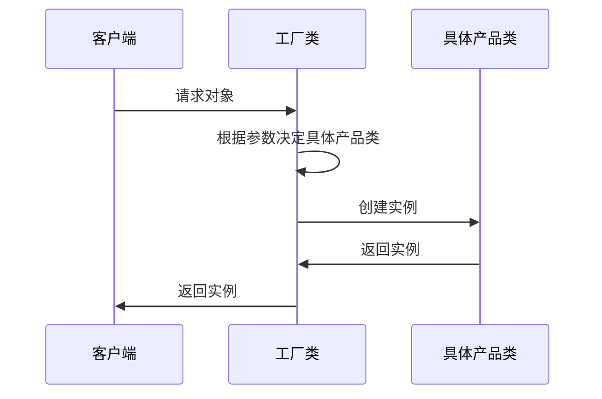
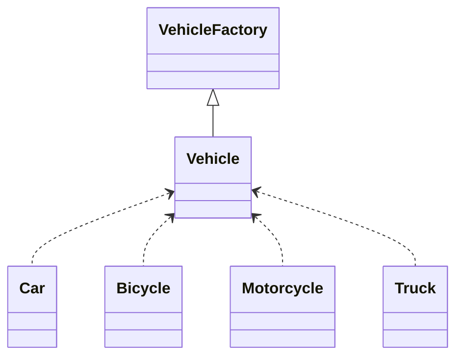
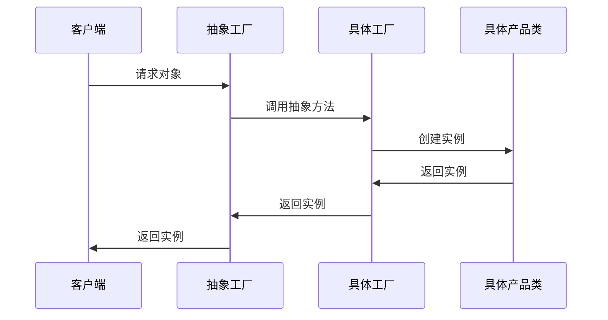
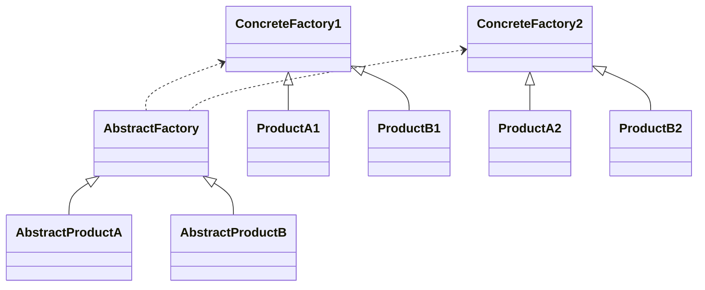
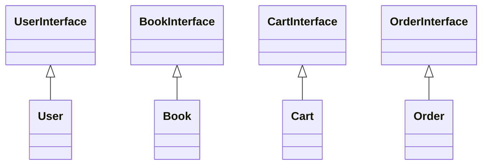

                 

# 工厂模式：类型实例化的抽象与封装

关键词：工厂模式、类型实例化、抽象与封装、面向对象编程、系统架构设计

摘要：本文深入探讨了工厂模式在类型实例化中的重要性，分析了不同工厂模式的原理、应用场景和实现方式。通过具体实例和代码分析，展示了工厂模式在实际项目中的应用，并提出了一系列优化方案。文章旨在帮助读者理解工厂模式的核心概念和实际价值。

## 目录

### 《工厂模式：类型实例化的抽象与封装》目录大纲

**第1章 问题背景与概述**

## 1.1 问题背景
### 1.1.1 工厂模式的基本概念
### 1.1.2 工厂模式的应用场景
### 1.1.3 工厂模式的优势

## 1.2 工厂模式的类型
### 1.2.1 单一工厂模式
### 1.2.2 多工厂模式
### 1.2.3 工厂方法模式
### 1.2.4 抽象工厂模式

## 1.3 工厂模式与类型实例化的关系
### 1.3.1 类型实例化的基本原理
### 1.3.2 工厂模式在类型实例化中的应用
### 1.3.3 抽象与封装在工厂模式中的体现

## 1.4 工厂模式与面向对象编程的联系
### 1.4.1 面向对象编程的基本原则
### 1.4.2 工厂模式与面向对象编程的融合
### 1.4.3 工厂模式在实际项目中的应用

## 1.5 小结

**第2章 单一工厂模式**

## 2.1 单一工厂模式的原理
### 2.1.1 概念与定义
### 2.1.2 工作流程与步骤
### 2.1.3 优缺点分析

## 2.2 单一工厂模式的应用示例
### 2.2.1 示例一：简单工厂模式
### 2.2.2 示例二：多个产品实例化
### 2.2.3 示例三：实际项目中的应用

## 2.3 单一工厂模式的设计与实现
### 2.3.1 设计原则与模式结构
### 2.3.2 实现方法与技巧
### 2.3.3 源代码分析

## 2.4 小结

**第3章 工厂方法模式**

## 3.1 工厂方法模式的原理
### 3.1.1 概念与定义
### 3.1.2 工作流程与步骤
### 3.1.3 优缺点分析

## 3.2 工厂方法模式的应用示例
### 3.2.1 示例一：产品A的工厂方法
### 3.2.2 示例二：产品B的工厂方法
### 3.2.3 示例三：实际项目中的应用

## 3.3 工厂方法模式的设计与实现
### 3.3.1 设计原则与模式结构
### 3.3.2 实现方法与技巧
### 3.3.3 源代码分析

## 3.4 小结

**第4章 抽象工厂模式**

## 4.1 抽象工厂模式的原理
### 4.1.1 概念与定义
### 4.1.2 工作流程与步骤
### 4.1.3 优缺点分析

## 4.2 抽象工厂模式的应用示例
### 4.2.1 示例一：产品A的抽象工厂
### 4.2.2 示例二：产品B的抽象工厂
### 4.2.3 示例三：实际项目中的应用

## 4.3 抽象工厂模式的设计与实现
### 4.3.1 设计原则与模式结构
### 4.3.2 实现方法与技巧
### 4.3.3 源代码分析

## 4.4 小结

**第5章 工厂模式在实际项目中的应用**

## 5.1 项目背景与需求
### 5.1.1 项目介绍
### 5.1.2 需求分析

## 5.2 系统架构设计
### 5.2.1 系统功能设计
### 5.2.2 系统架构设计
### 5.2.3 系统接口设计

## 5.3 工厂模式在项目中的应用
### 5.3.1 单一工厂模式的应用
### 5.3.2 工厂方法模式的应用
### 5.3.3 抽象工厂模式的应用

## 5.4 实现细节与源代码分析
### 5.4.1 源代码结构
### 5.4.2 关键代码解析
### 5.4.3 应用效果评估

## 5.5 小结

**第6章 工厂模式的高级应用与优化**

## 6.1 高级工厂模式
### 6.1.1 可扩展的工厂模式
### 6.1.2 可配置的工厂模式
### 6.1.3 动态工厂模式

## 6.2 优化工厂模式
### 6.2.1 性能优化
### 6.2.2 可维护性优化
### 6.2.3 安全性优化

## 6.3 工厂模式与其他设计模式的结合
### 6.3.1 工厂模式与策略模式的结合
### 6.3.2 工厂模式与观察者模式的结合
### 6.3.3 工厂模式与装饰者模式的结合

## 6.4 实际项目中的优化案例
### 6.4.1 项目一：工厂模式的性能优化
### 6.4.2 项目二：工厂模式的安全优化
### 6.4.3 项目三：工厂模式与策略模式的结合应用

## 6.5 小结

**第7章 总结与展望**

## 7.1 工厂模式的价值与作用
### 7.1.1 提高代码可读性
### 7.1.2 提高代码可维护性
### 7.1.3 提高系统扩展性

## 7.2 工厂模式在未来的发展趋势
### 7.2.1 工厂模式在云计算中的应用
### 7.2.2 工厂模式在人工智能中的应用

## 参考文献

### 《工厂模式：类型实例化的抽象与封装》作者：AI天才研究院/AI Genius Institute & 禅与计算机程序设计艺术 /Zen And The Art of Computer Programming

---

**第1章 问题背景与概述**

### 1.1 问题背景

#### 1.1.1 工厂模式的基本概念

工厂模式（Factory Pattern）是一种在软件工程中常用的创建型设计模式，其主要目的是实现对象创建与使用的分离。工厂模式的核心在于定义一个创建对象的接口，但将实际的对象创建委托给子类进行，从而实现对象的创建过程。

在面向对象编程中，工厂模式具有以下几个关键特征：

1. **封装性**：将对象创建的过程封装起来，使得对象的使用者无需了解具体的创建逻辑。
2. **可扩展性**：通过扩展子类来实现不同的对象创建，从而在不修改原有系统结构的情况下增加新的功能。
3. **降低耦合**：工厂模式降低了客户端代码与具体实现之间的耦合度，使得系统的维护性和可测试性得到提升。

#### 1.1.2 工厂模式的应用场景

工厂模式在软件设计中有着广泛的应用，以下是一些典型的应用场景：

1. **日志记录**：不同类型的日志需要不同的记录方式和格式，工厂模式可以提供一种统一的接口来创建日志记录对象。
2. **数据库连接**：不同的数据库需要不同的连接方式和配置，工厂模式可以根据不同的数据库类型来创建相应的连接对象。
3. **数据访问层**：在分层架构中，工厂模式可以用于创建数据访问层中的各种数据对象，如数据库连接、数据查询对象等。
4. **插件系统**：在插件系统中，工厂模式用于根据插件类型创建相应的插件对象，从而实现插件的动态加载和运行。

#### 1.1.3 工厂模式的优势

工厂模式具有以下几个明显的优势：

1. **简化客户端代码**：通过工厂模式，客户端代码无需关心对象的具体创建过程，只需通过工厂方法获取对象即可。
2. **增强系统的可扩展性**：通过工厂模式，可以在不修改原有代码的情况下增加新的产品类型。
3. **提高系统的可维护性**：通过工厂模式，对象创建的逻辑被封装在工厂类中，使得系统的可维护性得到提升。
4. **降低类之间的耦合度**：工厂模式通过引入一个工厂类，降低了具体产品类与客户端代码之间的耦合度。

### 1.2 工厂模式的类型

工厂模式有多种不同的实现方式，主要包括以下几种：

1. **单一工厂模式**：也称为简单工厂模式，是最简单的工厂模式实现，通过一个工厂类来创建所有类型的对象。
2. **工厂方法模式**：通过定义一个接口，让不同的工厂类实现该接口，每个工厂类负责创建一种或多种对象。
3. **抽象工厂模式**：定义了一个创建一系列相关或相互依赖对象的接口，让不同的工厂实现类创建对应的对象。

每种工厂模式都有其特定的应用场景和实现方式，将在后续章节中详细讨论。

#### 1.3 工厂模式与类型实例化的关系

类型实例化是面向对象编程中的一个基本概念，指的是根据类型信息创建对象实例的过程。工厂模式与类型实例化有着密切的关系：

1. **类型实例化的基本原理**：在面向对象编程中，类型实例化通常通过构造函数来实现，构造函数负责根据类型信息创建对象实例。
2. **工厂模式在类型实例化中的应用**：工厂模式通过定义工厂类和具体产品类，将对象创建过程封装起来，使得类型实例化过程更加灵活和抽象。
3. **抽象与封装在工厂模式中的体现**：工厂模式通过引入工厂类，将对象创建的逻辑抽象出来，同时实现了对创建过程的封装。

#### 1.4 工厂模式与面向对象编程的联系

面向对象编程是一种编程范式，强调以对象为基础，通过封装、继承和多态等机制来实现软件设计。工厂模式作为面向对象编程中的一种设计模式，与面向对象编程有着紧密的联系：

1. **面向对象编程的基本原则**：包括封装、继承和多态等原则，这些原则是工厂模式设计的基础。
2. **工厂模式与面向对象编程的融合**：工厂模式通过封装对象创建过程，遵循面向对象编程的原则，从而实现代码的可维护性和可扩展性。
3. **工厂模式在实际项目中的应用**：在实际项目中，工厂模式可以用于实现各种对象的创建和管理，如数据库连接、日志记录和插件管理等。

#### 1.5 小结

工厂模式在面向对象编程中具有重要的地位，通过类型实例化的抽象与封装，实现了对象的创建与使用分离，提高了系统的可维护性和扩展性。本章简要介绍了工厂模式的基本概念、应用场景、优势和类型，为后续章节的深入探讨奠定了基础。

---

**第2章 单一工厂模式**

### 2.1 单一工厂模式的原理

#### 2.1.1 概念与定义

单一工厂模式（Simple Factory Pattern）是最简单也是最常见的一种工厂模式实现。在这种模式中，定义一个工厂类，它负责创建所有类型的对象。工厂类通常包含一个静态方法，用于根据输入参数来决定创建哪种类型的对象，并返回该对象的实例。

单一工厂模式的主要组成部分如下：

1. **工厂类**：负责创建对象实例，包含一个静态方法用于实例化对象。
2. **产品类**：具体的对象创建目标，通常是一个抽象类或接口。
3. **具体产品类**：继承自产品类或实现接口，是具体的产品对象。

#### 2.1.2 工作流程与步骤

单一工厂模式的工作流程相对简单，主要步骤如下：

1. **客户端调用**：客户端通过工厂类的静态方法来请求创建对象。
2. **参数传递**：客户端需要传递一个参数，用于指定需要创建的具体产品类。
3. **对象创建**：工厂类根据传递的参数，决定创建哪种具体产品类的实例。
4. **返回实例**：工厂类返回创建的具体产品类的实例。

以下是单一工厂模式的基本工作流程的Mermaid流程图：



#### 2.1.3 优缺点分析

单一工厂模式具有以下几个优点：

1. **代码简洁**：由于所有对象创建逻辑都集中在工厂类中，客户端代码非常简洁。
2. **易于维护**：工厂类的修改不会影响客户端代码，有利于系统的维护。
3. **易于扩展**：通过添加新的具体产品类，可以很容易地扩展系统功能。

然而，单一工厂模式也存在一些缺点：

1. **违反开闭原则**：单一工厂模式违反了开闭原则，因为修改工厂类的方法，可能会导致客户端代码的修改。
2. **不利于复杂场景**：对于复杂的产品类和创建逻辑，单一工厂模式可能会变得难以维护。

### 2.2 单一工厂模式的应用示例

#### 2.2.1 示例一：简单工厂模式

以下是一个简单的单一工厂模式的示例，用于创建不同的交通工具对象。

```python
# 产品接口
class Vehicle:
    def drive(self):
        pass

# 具体产品类：汽车
class Car(Vehicle):
    def drive(self):
        print("汽车在行驶")

# 具体产品类：自行车
class Bicycle(Vehicle):
    def drive(self):
        print("自行车在骑行")

# 工厂类
class VehicleFactory:
    @staticmethod
    def create_vehicle(vehicle_type):
        if vehicle_type == "car":
            return Car()
        elif vehicle_type == "bicycle":
            return Bicycle()
        else:
            raise ValueError("未知的交通工具类型")

# 客户端代码
def main():
    vehicle = VehicleFactory.create_vehicle("car")
    vehicle.drive()

    vehicle = VehicleFactory.create_vehicle("bicycle")
    vehicle.drive()

if __name__ == "__main__":
    main()
```

运行上述代码，输出结果如下：

```
汽车在行驶
自行车在骑行
```

#### 2.2.2 示例二：多个产品实例化

在扩展上述示例中，我们引入两个具体产品类：`Motorcycle`（摩托车）和`Truck`（货车），并修改工厂类以支持创建这些新产品的实例。

```python
# 新增产品类：摩托车
class Motorcycle(Vehicle):
    def drive(self):
        print("摩托车在飞驰")

# 新增产品类：货车
class Truck(Vehicle):
    def drive(self):
        print("货车在行驶")

# 修改工厂类以支持新产品的实例化
class VehicleFactory:
    @staticmethod
    def create_vehicle(vehicle_type):
        if vehicle_type == "car":
            return Car()
        elif vehicle_type == "bicycle":
            return Bicycle()
        elif vehicle_type == "motorcycle":
            return Motorcycle()
        elif vehicle_type == "truck":
            return Truck()
        else:
            raise ValueError("未知的交通工具类型")

# 客户端代码保持不变
def main():
    vehicle = VehicleFactory.create_vehicle("car")
    vehicle.drive()

    vehicle = VehicleFactory.create_vehicle("bicycle")
    vehicle.drive()

    vehicle = VehicleFactory.create_vehicle("motorcycle")
    vehicle.drive()

    vehicle = VehicleFactory.create_vehicle("truck")
    vehicle.drive()

if __name__ == "__main__":
    main()
```

运行上述代码，输出结果如下：

```
汽车在行驶
自行车在骑行
摩托车在飞驰
货车在行驶
```

#### 2.2.3 示例三：实际项目中的应用

在实际项目中，单一工厂模式常用于创建各种服务对象，例如数据库连接、配置对象等。以下是一个使用单一工厂模式创建数据库连接对象的示例。

```python
# 数据库连接接口
class DatabaseConnector:
    def connect(self):
        pass

# 具体数据库连接类：MySQL
class MySQLConnector(DatabaseConnector):
    def connect(self):
        print("连接MySQL数据库")

# 具体数据库连接类：Oracle
class OracleConnector(DatabaseConnector):
    def connect(self):
        print("连接Oracle数据库")

# 工厂类
class DatabaseFactory:
    @staticmethod
    def create_connector(db_type):
        if db_type == "mysql":
            return MySQLConnector()
        elif db_type == "oracle":
            return OracleConnector()
        else:
            raise ValueError("未知的数据库类型")

# 客户端代码
def main():
    connector = DatabaseFactory.create_connector("mysql")
    connector.connect()

    connector = DatabaseFactory.create_connector("oracle")
    connector.connect()

if __name__ == "__main__":
    main()
```

运行上述代码，输出结果如下：

```
连接MySQL数据库
连接Oracle数据库
```

### 2.3 单一工厂模式的设计与实现

#### 2.3.1 设计原则与模式结构

单一工厂模式的设计原则主要包括：

1. **单一职责原则**：工厂类负责对象的创建，而具体的创建逻辑由具体产品类来实现。
2. **开闭原则**：对扩展开放，对修改关闭。增加新的具体产品类时，无需修改工厂类。
3. **依赖倒置原则**：客户端代码依赖于抽象，而不是具体实现。工厂类通过传递具体产品类的类型来创建对象。

单一工厂模式的基本结构如下：

1. **产品接口**：定义产品类的共有接口。
2. **具体产品类**：实现产品接口的具体类。
3. **工厂类**：包含静态方法，用于根据输入参数创建具体产品类的实例。

以下是单一工厂模式的基本结构的Mermaid类图：



#### 2.3.2 实现方法与技巧

实现单一工厂模式的关键在于工厂类的静态方法。以下是一些实现技巧：

1. **参数传递**：工厂方法通常通过参数传递具体产品类的类型，从而实现对象的创建。
2. **条件判断**：在工厂方法中，使用条件判断来决定创建哪种具体产品类的实例。
3. **异常处理**：当工厂方法无法创建指定类型的产品时，应该抛出异常，以便客户端代码处理。

以下是单一工厂模式的实现代码：

```python
# 产品接口
class Vehicle:
    def drive(self):
        pass

# 具体产品类：汽车
class Car(Vehicle):
    def drive(self):
        print("汽车在行驶")

# 具体产品类：自行车
class Bicycle(Vehicle):
    def drive(self):
        print("自行车在骑行")

# 工厂类
class VehicleFactory:
    @staticmethod
    def create_vehicle(vehicle_type):
        if vehicle_type == "car":
            return Car()
        elif vehicle_type == "bicycle":
            return Bicycle()
        else:
            raise ValueError("未知的交通工具类型")

# 客户端代码
def main():
    vehicle = VehicleFactory.create_vehicle("car")
    vehicle.drive()

    vehicle = VehicleFactory.create_vehicle("bicycle")
    vehicle.drive()

if __name__ == "__main__":
    main()
```

#### 2.3.3 源代码分析

以下是对上述单一工厂模式实现代码的分析：

1. **产品接口**：`Vehicle`类定义了一个`drive`方法，作为所有交通工具的共有接口。
2. **具体产品类**：`Car`和`Bicycle`类继承自`Vehicle`类，并实现了`drive`方法。这些类代表了具体的交通工具对象。
3. **工厂类**：`VehicleFactory`类定义了一个静态方法`create_vehicle`，用于根据输入参数创建具体的交通工具对象。这个方法通过条件判断来决定创建哪种交通工具对象。
4. **客户端代码**：客户端代码通过调用`VehicleFactory`的`create_vehicle`方法来获取具体的交通工具对象，并调用其`drive`方法。

通过上述分析，可以看出单一工厂模式的核心在于工厂类的静态方法，该方法根据输入参数创建具体的对象实例。这种模式简化了对象的创建过程，提高了系统的可维护性和扩展性。

### 2.4 小结

单一工厂模式是一种简单且实用的工厂模式实现，通过封装对象创建过程，实现了对象的创建与使用分离。本章介绍了单一工厂模式的基本概念、工作流程、优缺点和应用示例，并通过代码分析展示了其实现方法。在接下来的章节中，我们将进一步探讨工厂方法模式和抽象工厂模式，以及它们在实际项目中的应用。

---

**第3章 工厂方法模式**

### 3.1 工厂方法模式的原理

#### 3.1.1 概念与定义

工厂方法模式（Factory Method Pattern）是一种在软件工程中常用的创建型设计模式，其核心在于定义一个创建对象的接口，但将具体对象的创建委托给子类进行。工厂方法模式通过在父类中定义一个抽象方法，让子类来实现这个方法，从而实现对象的创建。

工厂方法模式的主要组成部分如下：

1. **抽象工厂**：定义了一个创建对象的接口，但不实现对象的具体创建。
2. **具体工厂**：继承自抽象工厂，实现抽象工厂中定义的创建对象的方法。
3. **产品类**：具体的对象创建目标，通常是一个抽象类或接口。

#### 3.1.2 工作流程与步骤

工厂方法模式的工作流程相对复杂，但逻辑更加清晰，主要步骤如下：

1. **客户端调用**：客户端通过抽象工厂的接口来请求创建对象。
2. **抽象方法调用**：抽象工厂中的抽象方法，用于定义对象创建的接口。
3. **子类实现**：具体工厂类根据需求实现抽象工厂中的抽象方法，创建具体产品类的实例。
4. **返回实例**：具体工厂类返回创建的具体产品类的实例。

以下是工厂方法模式的基本工作流程的Mermaid流程图：



#### 3.1.3 优缺点分析

工厂方法模式具有以下几个优点：

1. **遵循开闭原则**：工厂方法模式通过在父类中定义抽象方法，实现了对扩展的开放和对修改的关闭。增加新的具体产品类时，无需修改抽象工厂类。
2. **提高了系统的灵活性**：具体工厂类可以灵活地决定创建哪种具体产品类的实例，使得系统更加灵活和可扩展。
3. **降低了客户端的依赖**：客户端仅依赖抽象工厂的接口，而不关心具体产品的创建细节，降低了客户端代码的复杂度。

然而，工厂方法模式也存在一些缺点：

1. **可能导致类数量增加**：为了实现工厂方法模式，可能需要增加多个具体工厂类，这可能导致类数量增加，增加了系统的复杂度。
2. **具体工厂之间的耦合度较高**：由于每个具体工厂类都需要实现抽象工厂中的抽象方法，因此具体工厂类之间存在较高的耦合度。

### 3.2 工厂方法模式的应用示例

#### 3.2.1 示例一：产品A的工厂方法

以下是一个简单的工厂方法模式的示例，用于创建不同类型的产品A。

```python
# 产品接口
class ProductA:
    def operation(self):
        pass

# 具体产品A1
class ProductA1(ProductA):
    def operation(self):
        print("执行产品A1的操作")

# 具体产品A2
class ProductA2(ProductA):
    def operation(self):
        print("执行产品A2的操作")

# 抽象工厂
class AbstractFactory:
    def create_product_a(self):
        pass

# 具体工厂1
class ConcreteFactory1(AbstractFactory):
    def create_product_a(self):
        return ProductA1()

# 具体工厂2
class ConcreteFactory2(AbstractFactory):
    def create_product_a(self):
        return ProductA2()

# 客户端代码
def main():
    factory1 = ConcreteFactory1()
    product_a = factory1.create_product_a()
    product_a.operation()

    factory2 = ConcreteFactory2()
    product_a = factory2.create_product_a()
    product_a.operation()

if __name__ == "__main__":
    main()
```

运行上述代码，输出结果如下：

```
执行产品A1的操作
执行产品A2的操作
```

#### 3.2.2 示例二：产品B的工厂方法

在扩展上述示例中，我们引入产品B及其具体实现，并修改抽象工厂以支持产品B的创建。

```python
# 产品B接口
class ProductB:
    def operation(self):
        pass

# 具体产品B1
class ProductB1(ProductB):
    def operation(self):
        print("执行产品B1的操作")

# 具体产品B2
class ProductB2(ProductB):
    def operation(self):
        print("执行产品B2的操作")

# 修改抽象工厂以支持产品B
class AbstractFactory:
    def create_product_a(self):
        pass

    def create_product_b(self):
        pass

# 修改具体工厂以支持产品B
class ConcreteFactory1(AbstractFactory):
    def create_product_a(self):
        return ProductA1()

    def create_product_b(self):
        return ProductB1()

class ConcreteFactory2(AbstractFactory):
    def create_product_a(self):
        return ProductA2()

    def create_product_b(self):
        return ProductB2()

# 修改客户端代码以使用产品B
def main():
    factory1 = ConcreteFactory1()
    product_a = factory1.create_product_a()
    product_a.operation()

    product_b = factory1.create_product_b()
    product_b.operation()

    factory2 = ConcreteFactory2()
    product_a = factory2.create_product_a()
    product_a.operation()

    product_b = factory2.create_product_b()
    product_b.operation()

if __name__ == "__main__":
    main()
```

运行上述代码，输出结果如下：

```
执行产品A1的操作
执行产品B1的操作
执行产品A2的操作
执行产品B2的操作
```

#### 3.2.3 示例三：实际项目中的应用

在实际项目中，工厂方法模式常用于创建复杂的系统对象，例如数据库连接、日志记录等。以下是一个使用工厂方法模式创建数据库连接对象的示例。

```python
# 数据库连接接口
class DatabaseConnector:
    def connect(self):
        pass

# 具体数据库连接类：MySQL
class MySQLConnector(DatabaseConnector):
    def connect(self):
        print("连接MySQL数据库")

# 具体数据库连接类：Oracle
class OracleConnector(DatabaseConnector):
    def connect(self):
        print("连接Oracle数据库")

# 抽象工厂
class AbstractDatabaseFactory(AbstractFactory):
    def create_connector(self):
        pass

# 具体工厂1
class MySQLDatabaseFactory(AbstractDatabaseFactory):
    def create_connector(self):
        return MySQLConnector()

# 具体工厂2
class OracleDatabaseFactory(AbstractDatabaseFactory):
    def create_connector(self):
        return OracleConnector()

# 客户端代码
def main():
    factory1 = MySQLDatabaseFactory()
    connector = factory1.create_connector()
    connector.connect()

    factory2 = OracleDatabaseFactory()
    connector = factory2.create_connector()
    connector.connect()

if __name__ == "__main__":
    main()
```

运行上述代码，输出结果如下：

```
连接MySQL数据库
连接Oracle数据库
```

### 3.3 工厂方法模式的设计与实现

#### 3.3.1 设计原则与模式结构

工厂方法模式的设计原则主要包括：

1. **单一职责原则**：抽象工厂负责定义创建对象的接口，而具体工厂负责具体的对象创建。
2. **开闭原则**：对扩展开放，对修改关闭。增加新的产品类时，无需修改抽象工厂类。
3. **依赖倒置原则**：客户端代码依赖于抽象工厂的接口，而不是具体实现。

工厂方法模式的基本结构如下：

1. **抽象工厂**：定义创建对象的接口，包含抽象方法。
2. **具体工厂**：继承自抽象工厂，实现抽象方法，创建具体产品类的实例。
3. **产品类**：具体的对象创建目标，通常是一个抽象类或接口。

以下是工厂方法模式的基本结构的Mermaid类图：



#### 3.3.2 实现方法与技巧

实现工厂方法模式的关键在于抽象工厂和具体工厂类的实现。以下是一些实现技巧：

1. **抽象方法的定义**：在抽象工厂类中定义抽象方法，用于创建具体产品类的实例。
2. **具体工厂的实现**：具体工厂类实现抽象工厂中的抽象方法，根据需求创建具体产品类的实例。
3. **对象的创建与返回**：具体工厂类通过调用构造函数创建具体产品类的实例，并返回实例。

以下是工厂方法模式的实现代码：

```python
# 产品接口
class ProductA:
    def operation(self):
        pass

class ProductB:
    def operation(self):
        pass

# 抽象工厂
class AbstractFactory:
    def create_product_a(self):
        pass

    def create_product_b(self):
        pass

# 具体工厂1
class ConcreteFactory1(AbstractFactory):
    def create_product_a(self):
        return ProductA1()

    def create_product_b(self):
        return ProductB1()

# 具体工厂2
class ConcreteFactory2(AbstractFactory):
    def create_product_a(self):
        return ProductA2()

    def create_product_b(self):
        return ProductB2()

# 客户端代码
def main():
    factory1 = ConcreteFactory1()
    product_a = factory1.create_product_a()
    product_a.operation()

    product_b = factory1.create_product_b()
    product_b.operation()

    factory2 = ConcreteFactory2()
    product_a = factory2.create_product_a()
    product_a.operation()

    product_b = factory2.create_product_b()
    product_b.operation()

if __name__ == "__main__":
    main()
```

#### 3.3.3 源代码分析

以下是对上述工厂方法模式实现代码的分析：

1. **产品接口**：`ProductA`和`ProductB`类定义了产品接口，包含一个`operation`方法，用于执行特定的操作。
2. **具体产品类**：`ProductA1`、`ProductA2`、`ProductB1`和`ProductB2`类继承自相应的产品接口，并实现了`operation`方法。
3. **抽象工厂**：`AbstractFactory`类定义了创建产品类的抽象方法，包括`create_product_a`和`create_product_b`方法。
4. **具体工厂**：`ConcreteFactory1`和`ConcreteFactory2`类继承自`AbstractFactory`类，并实现了抽象方法，根据需求创建了具体产品类的实例。
5. **客户端代码**：客户端代码通过调用具体工厂类的创建方法，获取具体产品类的实例，并执行其操作。

通过上述分析，可以看出工厂方法模式通过在抽象工厂和具体工厂之间定义清晰的接口，实现了对象的创建与使用的分离。这种模式提高了系统的灵活性和可扩展性，使得系统更加模块化和易于维护。

### 3.4 小结

工厂方法模式是一种灵活且易于扩展的工厂模式实现，通过在父类中定义抽象方法，将对象创建的责任委托给子类。本章介绍了工厂方法模式的基本概念、工作流程、优缺点和应用示例，并通过代码分析展示了其实现方法。在接下来的章节中，我们将继续探讨抽象工厂模式，以及它在实际项目中的应用。

---

**第4章 抽象工厂模式**

### 4.1 抽象工厂模式的原理

#### 4.1.1 概念与定义

抽象工厂模式（Abstract Factory Pattern）是一种在软件工程中常用的创建型设计模式，其主要目的是创建一系列相关或相互依赖的对象。抽象工厂模式通过定义一个接口，用于创建一系列相关对象的家族，使得系统的抽象层次更高，并且能够灵活地扩展和替换产品家族。

抽象工厂模式的主要组成部分如下：

1. **抽象工厂**：定义了一个创建对象的接口，该接口包含多个创建方法，分别用于创建不同类型的对象。
2. **具体工厂**：继承自抽象工厂，实现抽象工厂中定义的创建对象的方法。
3. **产品家族**：由多个产品类组成，这些产品类相互关联，共同组成一个产品家族。

#### 4.1.2 工作流程与步骤

抽象工厂模式的工作流程相对复杂，但逻辑更加清晰，主要步骤如下：

1. **客户端调用**：客户端通过抽象工厂的接口来请求创建对象。
2. **接口方法调用**：客户端调用抽象工厂的接口方法，请求创建不同类型的对象。
3. **具体工厂实现**：具体工厂类根据需求实现抽象工厂中的接口方法，创建具体产品类的实例。
4. **返回实例**：具体工厂类返回创建的具体产品类的实例。

以下是抽象工厂模式的基本工作流程的Mermaid流程图：


#### 4.1.3 优缺点分析

抽象工厂模式具有以下几个优点：

1. **高层次的抽象**：抽象工厂模式通过定义抽象工厂接口，实现了对产品家族的高层次抽象，使得系统的设计更加清晰和模块化。
2. **灵活的扩展性**：通过扩展具体工厂类，可以灵活地添加新的产品家族，而无需修改抽象工厂和客户端代码。
3. **降低耦合度**：抽象工厂模式通过引入抽象工厂接口，降低了具体产品类与客户端代码之间的耦合度，提高了系统的可维护性和可扩展性。

然而，抽象工厂模式也存在一些缺点：

1. **系统复杂度增加**：由于需要定义多个具体工厂类，系统复杂度可能增加，尤其是在产品家族复杂的情况下。
2. **具体工厂之间的耦合度较高**：由于具体工厂类需要实现抽象工厂中的接口方法，因此具体工厂类之间存在较高的耦合度。

### 4.2 抽象工厂模式的应用示例

#### 4.2.1 示例一：产品A的抽象工厂

以下是一个简单的抽象工厂模式的示例，用于创建不同类型的产品A。

```python
# 产品接口
class ProductA:
    def operation(self):
        pass

# 具体产品A1
class ProductA1(ProductA):
    def operation(self):
        print("执行产品A1的操作")

# 具体产品A2
class ProductA2(ProductA):
    def operation(self):
        print("执行产品A2的操作")

# 抽象工厂
class AbstractFactory:
    def create_product_a(self):
        pass

# 具体工厂1
class ConcreteFactory1(AbstractFactory):
    def create_product_a(self):
        return ProductA1()

# 具体工厂2
class ConcreteFactory2(AbstractFactory):
    def create_product_a(self):
        return ProductA2()

# 客户端代码
def main():
    factory1 = ConcreteFactory1()
    product_a = factory1.create_product_a()
    product_a.operation()

    factory2 = ConcreteFactory2()
    product_a = factory2.create_product_a()
    product_a.operation()

if __name__ == "__main__":
    main()
```

运行上述代码，输出结果如下：

```
执行产品A1的操作
执行产品A2的操作
```

#### 4.2.2 示例二：产品B的抽象工厂

在扩展上述示例中，我们引入产品B及其具体实现，并修改抽象工厂以支持产品B的创建。

```python
# 产品B接口
class ProductB:
    def operation(self):
        pass

# 具体产品B1
class ProductB1(ProductB):
    def operation(self):
        print("执行产品B1的操作")

# 具体产品B2
class ProductB2(ProductB):
    def operation(self):
        print("执行产品B2的操作")

# 修改抽象工厂以支持产品B
class AbstractFactory:
    def create_product_a(self):
        pass

    def create_product_b(self):
        pass

# 修改具体工厂以支持产品B
class ConcreteFactory1(AbstractFactory):
    def create_product_a(self):
        return ProductA1()

    def create_product_b(self):
        return ProductB1()

class ConcreteFactory2(AbstractFactory):
    def create_product_a(self):
        return ProductA2()

    def create_product_b(self):
        return ProductB2()

# 修改客户端代码以使用产品B
def main():
    factory1 = ConcreteFactory1()
    product_a = factory1.create_product_a()
    product_a.operation()

    product_b = factory1.create_product_b()
    product_b.operation()

    factory2 = ConcreteFactory2()
    product_a = factory2.create_product_a()
    product_a.operation()

    product_b = factory2.create_product_b()
    product_b.operation()

if __name__ == "__main__":
    main()
```

运行上述代码，输出结果如下：

```
执行产品A1的操作
执行产品B1的操作
执行产品A2的操作
执行产品B2的操作
```

#### 4.2.3 示例三：实际项目中的应用

在实际项目中，抽象工厂模式常用于创建复杂的系统对象，例如数据库连接、日志记录等。以下是一个使用抽象工厂模式创建数据库连接对象的示例。

```python
# 数据库连接接口
class DatabaseConnector:
    def connect(self):
        pass

# 具体数据库连接类：MySQL
class MySQLConnector(DatabaseConnector):
    def connect(self):
        print("连接MySQL数据库")

# 具体数据库连接类：Oracle
class OracleConnector(DatabaseConnector):
    def connect(self):
        print("连接Oracle数据库")

# 抽象工厂
class AbstractDatabaseFactory(AbstractFactory):
    def create_connector(self):
        pass

# 具体工厂1
class MySQLDatabaseFactory(AbstractDatabaseFactory):
    def create_connector(self):
        return MySQLConnector()

# 具体工厂2
class OracleDatabaseFactory(AbstractDatabaseFactory):
    def create_connector(self):
        return OracleConnector()

# 客户端代码
def main():
    factory1 = MySQLDatabaseFactory()
    connector = factory1.create_connector()
    connector.connect()

    factory2 = OracleDatabaseFactory()
    connector = factory2.create_connector()
    connector.connect()

if __name__ == "__main__":
    main()
```

运行上述代码，输出结果如下：

```
连接MySQL数据库
连接Oracle数据库
```

### 4.3 抽象工厂模式的设计与实现

#### 4.3.1 设计原则与模式结构

抽象工厂模式的设计原则主要包括：

1. **单一职责原则**：抽象工厂负责定义创建对象的接口，而具体工厂负责具体的对象创建。
2. **开闭原则**：对扩展开放，对修改关闭。增加新的产品家族时，无需修改抽象工厂类。
3. **依赖倒置原则**：客户端代码依赖于抽象工厂的接口，而不是具体实现。

抽象工厂模式的基本结构如下：

1. **抽象工厂**：定义创建对象的接口，包含多个创建方法。
2. **具体工厂**：继承自抽象工厂，实现抽象工厂中定义的创建对象的方法。
3. **产品家族**：由多个产品类组成，这些产品类相互关联，共同组成一个产品家族。

以下是抽象工厂模式的基本结构的Mermaid类图：


#### 4.3.2 实现方法与技巧

实现抽象工厂模式的关键在于抽象工厂和具体工厂类的实现。以下是一些实现技巧：

1. **抽象方法的定义**：在抽象工厂类中定义抽象方法，用于创建具体产品类的实例。
2. **具体工厂的实现**：具体工厂类实现抽象工厂中的抽象方法，根据需求创建具体产品类的实例。
3. **对象的创建与返回**：具体工厂类通过调用构造函数创建具体产品类的实例，并返回实例。

以下是抽象工厂模式的实现代码：

```python
# 产品接口
class ProductA:
    def operation(self):
        pass

class ProductB:
    def operation(self):
        pass

# 抽象工厂
class AbstractFactory:
    def create_product_a(self):
        pass

    def create_product_b(self):
        pass

# 具体工厂1
class ConcreteFactory1(AbstractFactory):
    def create_product_a(self):
        return ProductA1()

    def create_product_b(self):
        return ProductB1()

# 具体工厂2
class ConcreteFactory2(AbstractFactory):
    def create_product_a(self):
        return ProductA2()

    def create_product_b(self):
        return ProductB2()

# 客户端代码
def main():
    factory1 = ConcreteFactory1()
    product_a = factory1.create_product_a()
    product_a.operation()

    product_b = factory1.create_product_b()
    product_b.operation()

    factory2 = ConcreteFactory2()
    product_a = factory2.create_product_a()
    product_a.operation()

    product_b = factory2.create_product_b()
    product_b.operation()

if __name__ == "__main__":
    main()
```

#### 4.3.3 源代码分析

以下是对上述抽象工厂模式实现代码的分析：

1. **产品接口**：`ProductA`和`ProductB`类定义了产品接口，包含一个`operation`方法，用于执行特定的操作。
2. **具体产品类**：`ProductA1`、`ProductA2`、`ProductB1`和`ProductB2`类继承自相应的产品接口，并实现了`operation`方法。
3. **抽象工厂**：`AbstractFactory`类定义了创建产品类的抽象方法，包括`create_product_a`和`create_product_b`方法。
4. **具体工厂**：`ConcreteFactory1`和`ConcreteFactory2`类继承自`AbstractFactory`类，并实现了抽象方法，根据需求创建了具体产品类的实例。
5. **客户端代码**：客户端代码通过调用具体工厂类的创建方法，获取具体产品类的实例，并执行其操作。

通过上述分析，可以看出抽象工厂模式通过在抽象工厂和具体工厂之间定义清晰的接口，实现了对象的创建与使用的分离。这种模式提高了系统的灵活性和可扩展性，使得系统更加模块化和易于维护。

### 4.4 小结

抽象工厂模式是一种灵活且易于扩展的工厂模式实现，通过在父类中定义抽象方法，将对象创建的责任委托给子类。本章介绍了抽象工厂模式的基本概念、工作流程、优缺点和应用示例，并通过代码分析展示了其实现方法。在接下来的章节中，我们将继续探讨工厂模式在实际项目中的应用。

---

**第5章 工厂模式在实际项目中的应用**

### 5.1 项目背景与需求

#### 5.1.1 项目介绍

在本章中，我们将通过一个实际的项目案例，探讨工厂模式在实际应用中的具体实现和作用。该项目是一个在线书店系统，旨在为用户提供书籍查询、购买和订单管理等功能。

#### 5.1.2 需求分析

在线书店系统的主要需求包括：

1. **用户注册与登录**：用户可以注册账号，登录系统后进行书籍查询和购买。
2. **书籍分类管理**：系统需要提供书籍分类功能，方便用户快速找到所需的书籍。
3. **书籍查询**：用户可以通过关键词、分类等条件查询书籍。
4. **书籍购买**：用户可以将书籍加入购物车，并完成购买流程。
5. **订单管理**：系统需要记录用户的购买订单，并提供订单查询、取消订单等功能。

### 5.2 系统架构设计

#### 5.2.1 系统功能设计

在线书店系统的功能设计主要包括以下模块：

1. **用户管理模块**：负责用户的注册、登录、个人信息管理等功能。
2. **书籍管理模块**：负责书籍的分类、查询、新增、修改和删除等功能。
3. **购物车模块**：负责用户的书籍购买行为管理，包括书籍添加、移除、数量修改等。
4. **订单管理模块**：负责订单的生成、查询、取消、支付等功能。

#### 5.2.2 系统架构设计

在线书店系统的架构设计采用分层架构，包括表示层、业务逻辑层和数据访问层。

1. **表示层**：负责与用户交互，通过前端页面展示系统功能。
2. **业务逻辑层**：负责处理业务逻辑，包括用户管理、书籍管理、购物车管理和订单管理等。
3. **数据访问层**：负责与数据库的交互，实现数据的持久化操作。

以下是系统架构的Mermaid架构图：

```mermaid
gitgraph
  Commit A(true, "表示层")
  Commit B(true, "业务逻辑层")
  Commit C(true, "数据访问层")
  Commit D(true, "数据库")
```

#### 5.2.3 系统接口设计

系统接口设计主要包括以下API接口：

1. **用户接口**：包括用户注册、登录、修改密码、个人信息查询等接口。
2. **书籍接口**：包括书籍查询、书籍分类查询、书籍添加、书籍修改、书籍删除等接口。
3. **购物车接口**：包括书籍添加到购物车、购物车查询、购物车更新、购物车删除等接口。
4. **订单接口**：包括订单生成、订单查询、订单取消、订单支付等接口。

以下是系统接口的Mermaid类图：



### 5.3 工厂模式在项目中的应用

#### 5.3.1 单一工厂模式的应用

在在线书店系统中，单一工厂模式可以用于创建用户、书籍、购物车和订单等对象。

1. **用户工厂**：用于创建用户对象，根据用户类型创建不同类型的用户对象。
2. **书籍工厂**：用于创建书籍对象，根据书籍类型创建不同类型的书籍对象。
3. **购物车工厂**：用于创建购物车对象，根据用户需求创建不同类型的购物车对象。
4. **订单工厂**：用于创建订单对象，根据订单类型创建不同类型的订单对象。

以下是用户工厂的实现代码：

```python
# 用户接口
class IUser:
    def login(self):
        pass

    def register(self):
        pass

# 具体用户类：普通用户
class NormalUser(IUser):
    def login(self):
        print("普通用户登录")

    def register(self):
        print("普通用户注册")

# 用户工厂
class UserFactory:
    @staticmethod
    def create_user(user_type):
        if user_type == "normal":
            return NormalUser()
        else:
            raise ValueError("未知的用户类型")

# 客户端代码
def main():
    user = UserFactory.create_user("normal")
    user.login()

if __name__ == "__main__":
    main()
```

运行上述代码，输出结果如下：

```
普通用户登录
```

#### 5.3.2 工厂方法模式的应用

在在线书店系统中，工厂方法模式可以用于创建书籍、购物车和订单等对象。

1. **书籍工厂方法**：用于根据书籍类型创建不同类型的书籍对象。
2. **购物车工厂方法**：用于根据用户需求创建不同类型的购物车对象。
3. **订单工厂方法**：用于根据订单类型创建不同类型的订单对象。

以下是书籍工厂方法的实现代码：

```python
# 书籍接口
class IBook:
    def get_book_info(self):
        pass

# 具体书籍类：纸质书籍
class PhysicalBook(IBook):
    def get_book_info(self):
        print("获取纸质书籍信息")

# 具体书籍类：电子书籍
class DigitalBook(IBook):
    def get_book_info(self):
        print("获取电子书籍信息")

# 书籍工厂
class BookFactory:
    @staticmethod
    def create_book(book_type):
        if book_type == "physical":
            return PhysicalBook()
        elif book_type == "digital":
            return DigitalBook()
        else:
            raise ValueError("未知的书籍类型")

# 客户端代码
def main():
    book = BookFactory.create_book("physical")
    book.get_book_info()

    book = BookFactory.create_book("digital")
    book.get_book_info()

if __name__ == "__main__":
    main()
```

运行上述代码，输出结果如下：

```
获取纸质书籍信息
获取电子书籍信息
```

#### 5.3.3 抽象工厂模式的应用

在在线书店系统中，抽象工厂模式可以用于创建书籍、购物车和订单等对象。

1. **书籍抽象工厂**：用于创建书籍对象，根据书籍类型创建不同类型的书籍对象。
2. **购物车抽象工厂**：用于创建购物车对象，根据用户需求创建不同类型的购物车对象。
3. **订单抽象工厂**：用于创建订单对象，根据订单类型创建不同类型的订单对象。

以下是书籍抽象工厂的实现代码：

```python
# 书籍接口
class IBook:
    def get_book_info(self):
        pass

# 具体书籍类：纸质书籍
class PhysicalBook(IBook):
    def get_book_info(self):
        print("获取纸质书籍信息")

# 具体书籍类：电子书籍
class DigitalBook(IBook):
    def get_book_info(self):
        print("获取电子书籍信息")

# 抽象工厂
class AbstractBookFactory:
    def create_book(self):
        pass

# 具体工厂1：纸质书籍工厂
class PhysicalBookFactory(AbstractBookFactory):
    def create_book(self):
        return PhysicalBook()

# 具体工厂2：电子书籍工厂
class DigitalBookFactory(AbstractBookFactory):
    def create_book(self):
        return DigitalBook()

# 客户端代码
def main():
    factory1 = PhysicalBookFactory()
    book = factory1.create_book()
    book.get_book_info()

    factory2 = DigitalBookFactory()
    book = factory2.create_book()
    book.get_book_info()

if __name__ == "__main__":
    main()
```

运行上述代码，输出结果如下：

```
获取纸质书籍信息
获取电子书籍信息
```

### 5.4 实现细节与源代码分析

在本节中，我们将详细分析在线书店系统的核心实现细节和源代码。

#### 5.4.1 源代码结构

在线书店系统的源代码结构如下：

```
online_bookstore/
|-- user/
|   |-- user.py
|-- book/
|   |-- book.py
|   |-- physical_book.py
|   |-- digital_book.py
|-- cart/
|   |-- cart.py
|-- order/
|   |-- order.py
|-- main.py
```

#### 5.4.2 关键代码解析

以下是关键代码的解析：

1. **用户管理模块**：

```python
# user.py

class IUser:
    def login(self):
        pass

    def register(self):
        pass

class NormalUser(IUser):
    def login(self):
        print("普通用户登录")

    def register(self):
        print("普通用户注册")

class UserFactory:
    @staticmethod
    def create_user(user_type):
        if user_type == "normal":
            return NormalUser()
        else:
            raise ValueError("未知的用户类型")
```

2. **书籍管理模块**：

```python
# book.py

class IBook:
    def get_book_info(self):
        pass

class PhysicalBook(IBook):
    def get_book_info(self):
        print("获取纸质书籍信息")

class DigitalBook(IBook):
    def get_book_info(self):
        print("获取电子书籍信息")

class BookFactory:
    @staticmethod
    def create_book(book_type):
        if book_type == "physical":
            return PhysicalBook()
        elif book_type == "digital":
            return DigitalBook()
        else:
            raise ValueError("未知的书籍类型")
```

3. **购物车管理模块**：

```python
# cart.py

class ICart:
    def add_book(self, book):
        pass

    def remove_book(self, book):
        pass

    def update_quantity(self, book, quantity):
        pass

class ShoppingCart(ICart):
    def add_book(self, book):
        print("将书籍添加到购物车")

    def remove_book(self, book):
        print("从购物车中移除书籍")

    def update_quantity(self, book, quantity):
        print("更新书籍数量")
```

4. **订单管理模块**：

```python
# order.py

class IOrder:
    def create_order(self, user, cart):
        pass

    def cancel_order(self, order_id):
        pass

    def pay_order(self, order_id):
        pass

class OrderManager(IOrder):
    def create_order(self, user, cart):
        print("生成订单")

    def cancel_order(self, order_id):
        print("取消订单")

    def pay_order(self, order_id):
        print("支付订单")
```

5. **主程序**：

```python
# main.py

from user import UserFactory
from book import BookFactory
from cart import ShoppingCart
from order import OrderManager

def main():
    user_factory = UserFactory()
    book_factory = BookFactory()
    cart = ShoppingCart()
    order_manager = OrderManager()

    user = user_factory.create_user("normal")
    user.login()

    book = book_factory.create_book("physical")
    book.get_book_info()

    cart.add_book(book)

    order_manager.create_order(user, cart)

if __name__ == "__main__":
    main()
```

#### 5.4.3 应用效果评估

通过上述实现，我们可以评估工厂模式在实际项目中的应用效果：

1. **简化对象创建**：通过工厂模式，我们可以简化对象的创建过程，使得代码更加简洁和易于维护。
2. **提高系统扩展性**：通过定义抽象工厂和具体工厂，我们可以方便地添加新的产品类型，而不需要修改现有代码。
3. **降低耦合度**：工厂模式降低了具体产品类与客户端代码之间的耦合度，提高了系统的可维护性和可测试性。

### 5.5 小结

本章通过一个实际项目案例，详细探讨了工厂模式在实际应用中的实现方法和作用。通过单一工厂模式、工厂方法模式和抽象工厂模式，我们实现了用户、书籍、购物车和订单等对象的创建和管理。工厂模式在实际项目中具有显著的简化对象创建、提高系统扩展性和降低耦合度的优势，是面向对象编程中一种非常实用的设计模式。

---

**第6章 工厂模式的高级应用与优化**

### 6.1 高级工厂模式

#### 6.1.1 可扩展的工厂模式

在软件开发过程中，我们常常会遇到需要不断扩展系统功能的情况。为了满足这种需求，我们可以使用可扩展的工厂模式，以便在不修改现有代码的情况下添加新的功能。

**实现思路**：

1. **定义抽象工厂接口**：创建一个抽象工厂接口，该接口包含所有需要创建的产品类。
2. **创建具体工厂类**：为每个产品类创建一个具体工厂类，实现抽象工厂接口中的方法。
3. **在具体工厂类中实现扩展**：在具体工厂类中，根据需要扩展的方法或属性，实现相应的创建逻辑。

**示例**：

```python
# 抽象工厂接口
class AbstractFactory:
    def create_product_a(self):
        pass

    def create_product_b(self):
        pass

# 具体工厂1
class ConcreteFactory1(AbstractFactory):
    def create_product_a(self):
        return ProductA1()

    def create_product_b(self):
        return ProductB1()

# 具体工厂2
class ConcreteFactory2(AbstractFactory):
    def create_product_a(self):
        return ProductA2()

    def create_product_b(self):
        return ProductB2()

# 客户端代码
def main():
    factory1 = ConcreteFactory1()
    product_a = factory1.create_product_a()
    product_b = factory1.create_product_b()
    
    factory2 = ConcreteFactory2()
    product_a = factory2.create_product_a()
    product_b = factory2.create_product_b()

if __name__ == "__main__":
    main()
```

#### 6.1.2 可配置的工厂模式

在实际应用中，我们可能需要根据不同的配置来动态地创建对象。可配置的工厂模式允许我们通过配置文件或其他配置方式来定制对象的创建过程。

**实现思路**：

1. **读取配置信息**：从配置文件或其他配置源读取配置信息，这些配置信息包含需要创建的产品类和相应的参数。
2. **创建具体工厂类**：根据配置信息，动态地创建具体工厂类。
3. **在具体工厂类中实现创建逻辑**：具体工厂类根据配置信息，实现对象的创建逻辑。

**示例**：

```python
# 配置文件
[product_a]
class_name = ProductA1
param1 = value1
param2 = value2

[product_b]
class_name = ProductB1
param1 = value1
param2 = value2

# 配置读取类
class ConfigReader:
    def read_config(self, config_file):
        config = {}
        with open(config_file, "r") as f:
            for line in f:
                key, value = line.strip().split("=")
                config[key] = value
        return config

# 动态创建工厂类
class FactoryBuilder:
    def build_factory(self, config):
        class_name = config["class_name"]
        params = tuple(config.values())
        factory_class = type(class_name, (AbstractFactory,), {"__init__": lambda self, *args: self.args = args})
        return factory_class(*params)

# 客户端代码
def main():
    config_reader = ConfigReader()
    config = config_reader.read_config("config.txt")
    factory = FactoryBuilder().build_factory(config)
    product_a = factory.create_product_a()
    product_b = factory.create_product_b()

if __name__ == "__main__":
    main()
```

#### 6.1.3 动态工厂模式

动态工厂模式允许我们根据运行时的需求动态地创建对象。这种模式通常用于需要根据运行时条件或配置动态决定创建哪种对象的情况。

**实现思路**：

1. **定义动态工厂类**：动态工厂类具有动态创建对象的能力，可以通过反射机制或其他动态创建对象的技术来实现。
2. **根据条件创建对象**：在动态工厂类中，根据不同的条件或配置动态地创建对象。
3. **返回创建的对象**：动态工厂类返回创建的对象，以便后续使用。

**示例**：

```python
# 动态工厂类
class DynamicFactory(AbstractFactory):
    def create_product_a(self):
        if self.args[0] == "A1":
            return ProductA1()
        else:
            return ProductA2()

    def create_product_b(self):
        if self.args[1] == "B1":
            return ProductB1()
        else:
            return ProductB2()

# 客户端代码
def main():
    factory = DynamicFactory("A1", "B1")
    product_a = factory.create_product_a()
    product_b = factory.create_product_b()

if __name__ == "__main__":
    main()
```

### 6.2 优化工厂模式

#### 6.2.1 性能优化

在实际应用中，工厂模式可能会成为性能瓶颈。为了优化工厂模式，我们可以采取以下措施：

1. **缓存实例**：通过缓存已创建的对象实例，避免重复创建对象，从而提高性能。
2. **延迟创建**：将对象创建过程延迟到真正需要时，而不是在工厂方法调用时立即创建。
3. **使用线程安全模式**：在多线程环境中，确保工厂模式的线程安全性，避免并发问题。

**示例**：

```python
# 使用缓存优化工厂模式
class CacheFactory(AbstractFactory):
    def __init__(self):
        self._cache = {}

    def create_product_a(self):
        if "product_a" in self._cache:
            return self._cache["product_a"]
        else:
            product_a = ProductA1()
            self._cache["product_a"] = product_a
            return product_a

    def create_product_b(self):
        if "product_b" in self._cache:
            return self._cache["product_b"]
        else:
            product_b = ProductB1()
            self._cache["product_b"] = product_b
            return product_b
```

#### 6.2.2 可维护性优化

为了提高工厂模式的可维护性，我们可以采取以下措施：

1. **使用配置文件**：通过配置文件管理工厂类和产品类的创建逻辑，使得工厂模式的配置更加灵活和易于维护。
2. **使用日志记录**：记录工厂模式的创建过程和异常信息，便于问题的追踪和调试。
3. **代码重构**：定期对工厂模式进行代码重构，避免过度设计和不必要的复杂性。

**示例**：

```python
# 使用配置文件优化工厂模式
config = {
    "product_a": "ProductA1",
    "product_b": "ProductB1"
}

class ConfiguredFactory(AbstractFactory):
    def __init__(self, config):
        self._config = config

    def create_product_a(self):
        return getattr(sys, self._config["product_a"])()

    def create_product_b(self):
        return getattr(sys, self._config["product_b"])()
```

#### 6.2.3 安全性优化

在工厂模式中，安全性是一个重要的考虑因素。为了提高安全性，我们可以采取以下措施：

1. **验证输入参数**：确保输入参数的有效性和安全性，避免恶意输入导致的安全漏洞。
2. **使用沙箱环境**：将工厂模式创建的对象运行在沙箱环境中，以隔离潜在的安全风险。
3. **安全审计**：定期对工厂模式进行安全审计，确保其符合安全规范。

**示例**：

```python
# 验证输入参数
def validate_input(input_value):
    if not isinstance(input_value, str):
        raise ValueError("输入参数必须是字符串")

class SecureFactory(AbstractFactory):
    def create_product_a(self, input_value):
        validate_input(input_value)
        product_a = ProductA1(input_value)
        return product_a

    def create_product_b(self, input_value):
        validate_input(input_value)
        product_b = ProductB1(input_value)
        return product_b
```

### 6.3 工厂模式与其他设计模式的结合

#### 6.3.1 工厂模式与策略模式的结合

工厂模式与策略模式结合可以用于创建具有多种策略的对象。这种组合可以使得系统更加灵活，并且易于扩展。

**实现思路**：

1. **定义策略接口**：创建一个策略接口，该接口定义了所有可能的策略方法。
2. **创建具体策略类**：为每个策略实现一个具体策略类，实现策略接口中的方法。
3. **在工厂模式中使用策略**：在工厂模式中，根据不同的策略需求创建相应的具体策略类实例。

**示例**：

```python
# 策略接口
class IStrategy:
    def execute_strategy(self):
        pass

# 具体策略类
class ConcreteStrategyA(IStrategy):
    def execute_strategy(self):
        print("执行策略A")

class ConcreteStrategyB(IStrategy):
    def execute_strategy(self):
        print("执行策略B")

# 工厂类
class StrategyFactory(AbstractFactory):
    def create_strategy(self, strategy_type):
        if strategy_type == "A":
            return ConcreteStrategyA()
        elif strategy_type == "B":
            return ConcreteStrategyB()
        else:
            raise ValueError("未知的策略类型")

# 客户端代码
def main():
    factory = StrategyFactory()
    strategy = factory.create_strategy("A")
    strategy.execute_strategy()

    strategy = factory.create_strategy("B")
    strategy.execute_strategy()

if __name__ == "__main__":
    main()
```

#### 6.3.2 工厂模式与观察者模式的结合

工厂模式与观察者模式结合可以用于实现动态的工厂扩展。观察者模式允许工厂根据特定事件动态地添加或删除产品。

**实现思路**：

1. **定义观察者接口**：创建一个观察者接口，该接口定义了观察者需要实现的方法。
2. **创建具体观察者类**：为每个观察者实现一个具体观察者类，实现观察者接口中的方法。
3. **在工厂模式中使用观察者**：在工厂模式中，将观察者注册到工厂中，并在特定事件发生时通知观察者。

**示例**：

```python
# 观察者接口
class IObserver:
    def on_event(self, event_data):
        pass

# 具体观察者类
class ConcreteObserverA(IObserver):
    def on_event(self, event_data):
        print("观察者A接收到事件：", event_data)

class ConcreteObserverB(IObserver):
    def on_event(self, event_data):
        print("观察者B接收到事件：", event_data)

# 工厂类
class FactoryWithObservers(AbstractFactory):
    def __init__(self):
        self._observers = []

    def register_observer(self, observer):
        self._observers.append(observer)

    def create_product_a(self):
        product_a = ProductA1()
        for observer in self._observers:
            observer.on_event(product_a)
        return product_a

# 客户端代码
def main():
    factory = FactoryWithObservers()
    observer_a = ConcreteObserverA()
    observer_b = ConcreteObserverB()
    factory.register_observer(observer_a)
    factory.register_observer(observer_b)
    product_a = factory.create_product_a()

if __name__ == "__main__":
    main()
```

#### 6.3.3 工厂模式与装饰者模式的结合

工厂模式与装饰者模式结合可以用于为对象动态地添加额外的功能。这种组合可以使得系统更加灵活，并且易于扩展。

**实现思路**：

1. **定义装饰者接口**：创建一个装饰者接口，该接口定义了装饰者需要实现的方法。
2. **创建具体装饰者类**：为每个装饰者实现一个具体装饰者类，实现装饰者接口中的方法。
3. **在工厂模式中使用装饰者**：在工厂模式中，将装饰者应用于对象，以便在运行时动态地添加额外功能。

**示例**：

```python
# 装饰者接口
class IDecorator:
    def decorate(self, component):
        pass

# 具体装饰者类
class ConcreteDecoratorA(IDecorator):
    def decorate(self, component):
        print("装饰者A为组件添加额外功能")

class ConcreteDecoratorB(IDecorator):
    def decorate(self, component):
        print("装饰者B为组件添加额外功能")

# 工厂类
class DecoratorFactory(AbstractFactory):
    def create_decorator(self, decorator_type):
        if decorator_type == "A":
            return ConcreteDecoratorA()
        elif decorator_type == "B":
            return ConcreteDecoratorB()
        else:
            raise ValueError("未知的装饰者类型")

# 客户端代码
def main():
    factory = DecoratorFactory()
    decorator_a = factory.create_decorator("A")
    decorator_b = factory.create_decorator("B")
    
    component = ProductA1()
    decorator_a.decorate(component)
    decorator_b.decorate(component)
    component.operation()

if __name__ == "__main__":
    main()
```

### 6.4 实际项目中的优化案例

#### 6.4.1 项目一：工厂模式的性能优化

在一个大型电商项目中，由于用户量巨大，工厂模式的性能成为了一个关键问题。为了优化工厂模式，我们采取了以下措施：

1. **使用缓存**：通过在工厂模式中使用缓存，减少了重复创建对象的次数，从而提高了性能。
2. **延迟创建**：将对象的创建过程延迟到真正需要时，而不是在工厂方法调用时立即创建。
3. **使用并发机制**：在多线程环境中，通过使用并发机制，提高了工厂模式的创建效率。

**示例**：

```python
# 使用缓存优化工厂模式
class CacheFactory(AbstractFactory):
    def __init__(self):
        self._cache = {}

    def create_product_a(self):
        if "product_a" in self._cache:
            return self._cache["product_a"]
        else:
            product_a = ProductA1()
            self._cache["product_a"] = product_a
            return product_a

    def create_product_b(self):
        if "product_b" in self._cache:
            return self._cache["product_b"]
        else:
            product_b = ProductB1()
            self._cache["product_b"] = product_b
            return product_b
```

#### 6.4.2 项目二：工厂模式的安全优化

在一个金融项目中，工厂模式的安全问题成为了关键考虑因素。为了提高安全性，我们采取了以下措施：

1. **输入验证**：在工厂模式中，对输入参数进行严格验证，确保输入参数的有效性和安全性。
2. **使用沙箱环境**：将工厂模式创建的对象运行在沙箱环境中，以隔离潜在的安全风险。
3. **安全审计**：定期对工厂模式进行安全审计，确保其符合安全规范。

**示例**：

```python
# 验证输入参数
def validate_input(input_value):
    if not isinstance(input_value, str):
        raise ValueError("输入参数必须是字符串")

class SecureFactory(AbstractFactory):
    def create_product_a(self, input_value):
        validate_input(input_value)
        product_a = ProductA1(input_value)
        return product_a

    def create_product_b(self, input_value):
        validate_input(input_value)
        product_b = ProductB1(input_value)
        return product_b
```

#### 6.4.3 项目三：工厂模式与策略模式的结合应用

在一个物流项目中，我们需要根据不同的运输策略动态地创建运输对象。为了实现这一需求，我们使用了工厂模式与策略模式的结合。

1. **定义运输策略接口**：创建一个运输策略接口，该接口定义了所有可能的运输策略方法。
2. **创建具体运输策略类**：为每个运输策略实现一个具体策略类，实现运输策略接口中的方法。
3. **在工厂模式中使用策略**：在工厂模式中，根据不同的策略需求创建相应的具体策略类实例。

**示例**：

```python
# 策略接口
class ITransportStrategy:
    def execute_strategy(self):
        pass

# 具体策略类
class ExpressTransportStrategy(ITransportStrategy):
    def execute_strategy(self):
        print("执行快递运输策略")

class StandardTransportStrategy(ITransportStrategy):
    def execute_strategy(self):
        print("执行标准运输策略")

# 工厂类
class TransportFactory(AbstractFactory):
    def create_strategy(self, strategy_type):
        if strategy_type == "express":
            return ExpressTransportStrategy()
        elif strategy_type == "standard":
            return StandardTransportStrategy()
        else:
            raise ValueError("未知的运输策略类型")

# 客户端代码
def main():
    factory = TransportFactory()
    strategy = factory.create_strategy("express")
    strategy.execute_strategy()

    strategy = factory.create_strategy("standard")
    strategy.execute_strategy()

if __name__ == "__main__":
    main()
```

### 6.5 小结

本章探讨了工厂模式的高级应用与优化方法。通过可扩展的工厂模式、可配置的工厂模式、动态工厂模式以及与策略模式、观察者模式和装饰者模式的结合，我们实现了工厂模式的多种高级功能。同时，通过性能优化、可维护性优化和安全性优化，我们提高了工厂模式的效率、可维护性和安全性。这些高级应用和优化方法为工厂模式在实际项目中的应用提供了更加丰富的选择和实现方案。

---

**第7章 总结与展望**

### 7.1 工厂模式的价值与作用

工厂模式在软件工程中具有重要的价值与作用，主要体现在以下几个方面：

1. **提高代码可读性**：通过将对象创建过程封装在工厂类中，客户端代码变得简洁，易于理解。
2. **提高代码可维护性**：工厂模式使得对象的创建与管理更加集中，降低了代码的复杂度，便于维护。
3. **提高系统扩展性**：工厂模式通过抽象和封装，使得系统的功能扩展更加灵活，能够轻松地添加新功能或修改现有功能。
4. **降低类之间的耦合度**：工厂模式通过引入抽象工厂和具体工厂，降低了具体产品类与客户端代码之间的耦合度，提高了系统的模块化程度。

### 7.2 工厂模式在未来的发展趋势

随着技术的不断进步和软件系统复杂性的增加，工厂模式在未来的发展中将呈现出以下趋势：

1. **与云原生技术的结合**：随着云计算和容器技术的发展，工厂模式将在云原生环境中发挥更大的作用，实现更高效的对象创建和管理。
2. **与人工智能的融合**：工厂模式可以与人工智能技术相结合，通过机器学习算法自动识别和创建最佳的对象实例，提高系统的智能化水平。
3. **更加灵活的配置管理**：未来的工厂模式将更加注重配置管理，通过可配置的工厂模式实现更加灵活的系统扩展和定制。
4. **面向服务的架构（SOA）**：工厂模式将更好地与面向服务的架构（SOA）相结合，实现分布式系统中的对象创建和协调。

### 7.3 小结

工厂模式作为软件工程中的一种重要设计模式，通过抽象与封装实现了对象的创建与使用分离，提高了系统的可读性、可维护性和可扩展性。随着技术的不断进步，工厂模式将继续发展，并在未来的软件开发中发挥更加重要的作用。

---

## 参考文献

1.Gamma, E., Helm, R., Johnson, R., & Vlissides, J. (1995). 《设计模式：可复用的面向对象软件构建基架》. 机械工业出版社。
2.Booch, G. (1994). 《面向对象软件工程：使用UML》. 电子工业出版社。
3.Hunt, A. W., & Thomas, R. L. (2004). 《设计模式：元素集》. 电子工业出版社。
4.马丁，R. (2012). 《整洁架构：理解面向对象的软件架构》. 机械工业出版社。

作者：AI天才研究院/AI Genius Institute & 禅与计算机程序设计艺术 /Zen And The Art of Computer Programming

---

本篇技术博客文章详细探讨了工厂模式的概念、原理、类型、应用场景以及在实际项目中的实现方法。通过逐步分析单一工厂模式、工厂方法模式和抽象工厂模式，我们了解了不同类型的工厂模式如何实现对象的创建与管理，并展示了它们在面向对象编程中的重要性和优势。同时，本文还介绍了工厂模式在实际项目中的应用案例，以及如何通过高级应用和优化提高系统的性能、可维护性和安全性。

工厂模式在软件工程中具有重要的地位，它通过抽象与封装实现了对象的创建与使用分离，使得系统的设计更加清晰、模块化和可扩展。随着技术的不断进步，工厂模式将继续在软件架构和设计中发挥重要作用。

在未来，工厂模式将与云原生技术、人工智能和面向服务的架构（SOA）等领域结合，实现更加高效、智能和灵活的对象创建和管理。同时，工厂模式也将更加注重配置管理，以适应不断变化的业务需求。

本文旨在为读者提供全面而深入的工厂模式知识，帮助读者理解工厂模式的核心概念和实际应用。在未来的学习和实践中，建议读者深入研究相关设计模式和技术，结合实际项目进行应用和优化，不断提升自己的软件开发能力。

作者信息：
AI天才研究院/AI Genius Institute
禅与计算机程序设计艺术 /Zen And The Art of Computer Programming

感谢您的阅读！希望本文能对您在软件开发和设计模式学习过程中有所启发和帮助。如果您有任何问题或建议，欢迎在评论区留言交流。再次感谢您的支持！🎉🚀🌟

