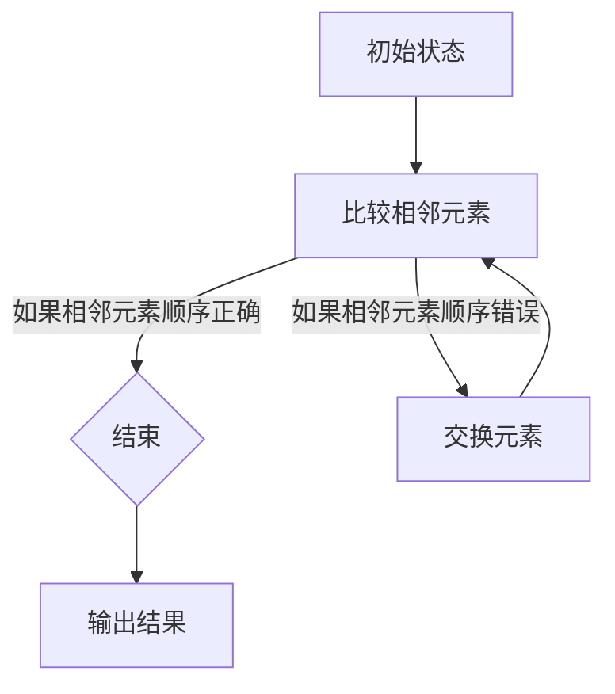
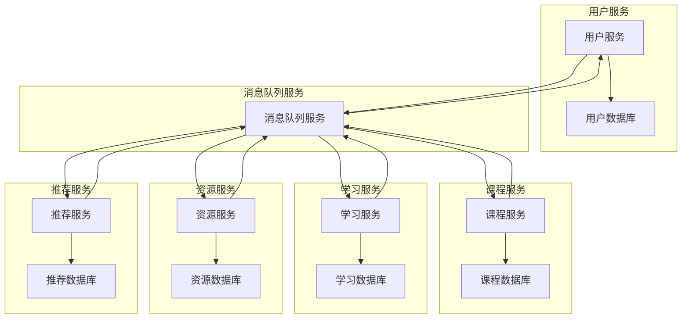
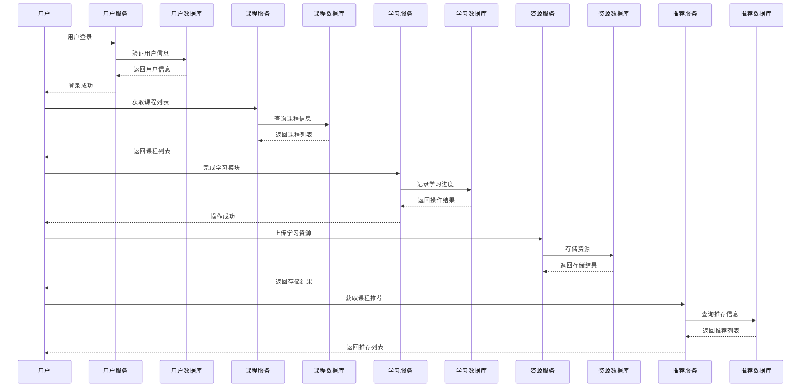

                 


### 引言

#### 研究背景

在本章节中，我们将探讨布迪厄（Pierre Bourdieu）的场域理论和中国古代哲学家荀子的礼治思想，这两个理论虽然分属于不同的文化背景，却在社会学研究中具有深远的影响。布迪厄的场域理论源于20世纪法国的社会学传统，是理解社会结构和文化资本的关键概念。而荀子的礼治思想则是中国古代哲学的重要组成部分，强调通过礼仪规范来维护社会秩序。

##### 布迪厄的场域理论

布迪厄的场域理论是一种社会学理论，用于解释社会生活中不同领域的互动和权力运作。场域指的是一种特定的社会空间，其中社会成员通过特定的规则和资本进行互动。布迪厄提出，社会结构不是静态的，而是由多个场域相互交织而成，这些场域包括教育、文化、政治和经济等领域。每个场域都有其独特的逻辑和规则，这些规则决定了场域内部的权力关系和资本流动。

##### 荀子的礼治思想

荀子的礼治思想强调，通过礼仪和规范来维护社会秩序和个人道德。礼不仅是社会规范，也是道德准则，它通过规范人们的行为来促进社会的和谐与稳定。荀子认为，礼是治理国家的基础，是实现社会正义和秩序的关键。他的思想对中国古代社会产生了深远的影响，并延续至今。

#### 两种理论在当代社会学中的意义

布迪厄的场域理论和荀子的礼治思想都在当代社会学研究中具有重要价值。布迪厄的理论为理解社会不平等和权力结构提供了新的视角，而荀子的礼治思想则为现代社会提供了一种关于如何实现社会和谐的思考。通过比较这两种理论，我们可以更深入地理解社会现象，为解决当代社会问题提供理论支持。

##### 研究目的与意义

本研究旨在通过对比布迪厄的场域理论和荀子的礼治思想，探讨这两种理论在解释社会现象方面的异同，以及它们对社会学理论的贡献。研究目的包括：

1. **理解场域理论和礼治思想的本质**：通过对两种理论的深入分析，理解其核心概念和理论框架。
2. **比较两种理论的异同**：分析两种理论在解释社会现象方面的差异和共性。
3. **探讨理论的应用**：通过具体案例，探讨两种理论在现实社会中的应用。
4. **提出理论贡献**：总结两种理论对社会学研究的贡献，并提出未来研究的方向。

本研究的意义在于：

1. **深化社会学理论研究**：通过对两种理论的对比分析，为社会学理论研究提供新的思路。
2. **指导社会实践**：为解决社会问题提供理论依据和实践指导。
3. **促进跨学科交流**：通过将不同文化背景下的理论进行比较，促进社会学与其他学科之间的交流与融合。

##### 研究方法与结构

本研究采用比较分析的方法，通过对布迪厄的场域理论和荀子的礼治思想进行深入分析，探讨两种理论的异同。研究结构如下：

1. **第1章 引言**：介绍研究背景、目的和意义，以及研究方法与结构。
2. **第2章 布迪厄的场域理论**：介绍场域理论的起源、核心概念和应用案例。
3. **第3章 荀子的礼治思想**：介绍礼治思想的起源、核心内容和历史影响。
4. **第4章 两种理论的对比分析**：对比分析布迪厄的场域理论和荀子的礼治思想。
5. **第5章 社会学对话的案例研究**：通过案例研究，探讨两种理论在现实社会中的应用。
6. **第6章 结论与展望**：总结研究结论，提出研究局限与展望。

通过以上章节的设置，本研究旨在全面、深入地探讨布迪厄的场域理论和荀子的礼治思想，为当代社会学理论的研究提供新的视角和思路。

#### 文章关键词

- 布迪厄
- 场域理论
- 礼治思想
- 社会学对话
- 文化资本
- 社会秩序

#### 文章摘要

本文通过对布迪厄的场域理论和荀子的礼治思想进行深入分析，探讨了这两种理论在解释社会现象方面的异同。文章首先介绍了场域理论和礼治思想的基本概念和理论框架，然后通过对比分析，揭示了两种理论在核心概念、理论应用和解释力方面的异同。随后，通过案例研究，展示了两种理论在现实社会中的应用，最后总结了两种理论对社会学研究的贡献，并提出了未来研究的方向。本文的研究旨在深化社会学理论研究，为解决社会问题提供理论支持。

---

### 布迪厄的场域理论

#### 场域理论的起源与发展

布迪厄的场域理论源于20世纪法国的社会学传统，这一理论的形成受到了马克思主义、符号学、人类学等多种学科思想的影响。布迪厄在1960年代开始深入研究社会结构和文化资本，逐渐形成了独特的场域理论。

##### 布迪厄的学术生涯

布迪厄（Pierre Bourdieu，1930-2002）是一位法国社会学家，他以其深刻的社会学理论和独到的见解著称于世。布迪厄毕业于巴黎高等师范学院，随后在法国国家科学研究中心（CNRS）担任研究员。他的主要研究领域包括社会阶层、文化资本、教育与政治等。

##### 场域理论的基本概念

布迪厄的场域理论是一种社会学理论，用于解释社会生活中不同领域的互动和权力运作。场域指的是一种特定的社会空间，其中社会成员通过特定的规则和资本进行互动。场域理论的核心概念包括场域、资本、场域斗争和场域规则。

#### 场域

场域是指一个特定的社会空间，其中社会成员通过特定的规则和资本进行互动。场域不仅包括传统的教育、文化、政治和经济等领域，还包括更为抽象的领域，如体育、艺术和宗教等。每个场域都有其独特的逻辑和规则，这些规则决定了场域内部的权力关系和资本流动。

##### 场域的特征

1. **自主性**：场域具有相对独立性，场域内部的规则和逻辑不受外部因素的影响。
2. **特定性**：每个场域都有其特定的目标、价值观和规则。
3. **资本流通**：场域中的资本（文化、经济、社会资本等）在特定规则下进行流通和积累。

##### 场域的类型

1. **公共场域**：涉及广泛的社会互动，如政治、经济、教育等领域。
2. **私密场域**：局限于特定群体内的互动，如家庭、友谊等。
3. **半私密场域**：介于公共场域和私密场域之间，如某些私人俱乐部、非政府组织等。

#### 资本

资本是场域理论中的核心概念之一，指的是能够在场域中积累和流通的任何资源。布迪厄将资本分为三种类型：文化资本、经济资本和社会资本。

##### 文化资本

文化资本是指通过教育、知识、品味和技能等形式积累的文化资源。文化资本不仅可以提高个人的社会地位，还可以在特定的场域中产生影响力。

##### 经济资本

经济资本是指通过财富和财产等形式积累的经济资源。经济资本是场域中最常见的资本形式，它直接影响个人的社会地位和权力。

##### 社会资本

社会资本是指通过社会关系和网络积累的资源。社会资本可以增强个人的社会地位，帮助个人在特定的场域中获得更多资源和机会。

##### 资本的转换和积累

1. **资本的转换**：不同类型的资本可以在场域中相互转换。例如，文化资本可以通过教育转化为经济资本，社会资本可以通过人际关系转化为经济资本。
2. **资本的积累**：资本在不同场域中的积累和流通，决定了个人和群体的社会地位和权力。

#### 场域斗争

场域斗争是场域理论中的另一个核心概念，指的是场域中不同群体为了争夺资本和权力而进行的斗争。

##### 场域斗争的特征

1. **非线性和复杂性**：场域斗争不是简单的力量对比，而是多个因素相互作用的结果。
2. **策略性**：场域斗争中的参与者会采用各种策略，如联合、对抗、伪装等。
3. **持续性和动态性**：场域斗争是长期的、动态的过程，不断发生变化。

##### 场域斗争的类型

1. **竞争性斗争**：不同群体为了争夺有限的资本而进行的斗争。
2. **合作性斗争**：同一群体内部的成员为了共同的目标而进行的斗争。
3. **替代性斗争**：通过争夺其他资本形式来替代现有资本形式的斗争。

#### 场域规则与制度

场域规则是指场域内部的互动方式和规范，这些规则决定了资本的流通和积累。场域制度是场域规则的具体体现，它包括法律法规、社会规范、教育制度等。

##### 场域规则的特征

1. **相对稳定性**：场域规则相对稳定，但也会随着时间和环境的变化而调整。
2. **规范性**：场域规则规范了场域中成员的行为，维护了场域的秩序。
3. **权力性**：场域规则具有权力性质，可以影响成员的社会地位和权力。

##### 场域制度的类型

1. **正式制度**：通过法律、法规等形式明确规定的制度。
2. **非正式制度**：通过习俗、传统等形式形成的制度。
3. **混合制度**：正式制度和非正式制度相结合的制度。

##### 场域规则与制度的作用

1. **维护场域秩序**：场域规则和制度规范了场域中成员的行为，维护了场域的稳定和秩序。
2. **分配资本**：场域规则和制度决定了资本的流通和分配，影响了成员的社会地位和权力。
3. **调节场域斗争**：场域规则和制度调节了场域斗争的激烈程度，维护了场域的平衡。

#### 场域理论的应用案例

场域理论在多个领域都有广泛的应用，以下是一些典型的应用案例：

##### 教育领域

在教育领域，场域理论可以解释教育不平等的现象。例如，不同阶层的学生在教育资源、教育机会和教育质量上存在差异，这些差异反映了场域规则和制度的作用。

##### 文化领域

在文化领域，场域理论可以解释文化资本的积累和流通。例如，文化精英如何通过文化资本影响大众文化，以及大众文化如何影响文化精英。

##### 政治领域

在政治领域，场域理论可以解释政治权力结构的形成和变化。例如，不同政治派别如何通过资本和权力斗争来争夺政治权力。

##### 社会运动

在社会运动中，场域理论可以解释社会运动的形成、发展和变革。例如，社会运动如何通过场域斗争来争取社会正义和改变社会秩序。

通过以上对场域理论的介绍，我们可以看到，布迪厄的场域理论为社会学研究提供了一种新的视角，帮助我们理解社会生活中不同领域的互动和权力运作。接下来，我们将进一步探讨荀子的礼治思想，为后续的理论对比分析打下基础。

---

### 荀子的礼治思想

#### 礼治思想的起源与发展

荀子的礼治思想源于中国古代的儒家思想体系，是儒家学说的重要组成部分。荀子（约公元前313年—公元前238年），名况，战国末期赵国人，是儒家学派的代表人物之一。他的思想对后世产生了深远的影响，尤其是在中国古代社会，礼治思想被广泛应用于国家治理和社会规范。

##### 荀子的生平

荀子早年曾游历各国，广泛求学，与儒家大师孟子有过深入的学术交流。他的思想主张受到了当时诸侯国的重视，曾担任齐国稷下学宫的讲师。后来，荀子回到赵国，担任赵孝成王的老师，继续传播儒家思想。

##### 礼治思想的基本概念

礼治思想是荀子的核心理论之一，强调通过礼仪和规范来维护社会秩序和个人道德。荀子认为，礼不仅是社会规范，也是道德准则，它通过规范人们的行为来促进社会的和谐与稳定。礼治思想包含以下几个基本概念：

1. **礼**：礼是一种规范人们行为的准则，它包括礼仪、礼节、礼制等具体形式。
2. **义**：义是礼的核心，是道德行为的准则，强调正义和公正。
3. **法**：法是礼的实施手段，通过法律来保障礼的实施。
4. **教**：教是礼的传播方式，通过教育和教化来培养人们的道德意识和行为规范。

#### 礼治思想的核心内容

荀子的礼治思想主要包括以下几个方面：

##### 礼的内涵

1. **内外之分**：荀子认为，礼不仅包括外在的行为规范，还包括内在的道德修养。
2. **上下之分**：礼强调社会等级秩序，维护上下尊卑的社会结构。
3. **贵贱之分**：礼规定不同阶层和身份的人有不同的行为规范，以维护社会稳定。

##### 礼的规范作用

1. **维护社会秩序**：礼通过规范人们的行为，维护社会秩序，防止社会动荡。
2. **促进社会和谐**：礼强调人与人之间的和谐相处，促进社会团结。
3. **保障个人道德**：礼通过道德规范，引导个人行为，提升个人品德。

##### 礼与法的关系

荀子认为，礼与法相辅相成，礼是内在的道德规范，法是外在的强制手段。礼治思想强调，法律应该建立在礼的基础之上，通过礼来指导法律，使法律能够更好地维护社会秩序。

1. **礼为主法为辅**：礼是根本，法是辅助，法律应该符合礼的精神。
2. **法随礼而变**：法律应该随着社会的变化而变化，以适应礼的要求。

#### 礼治思想的历史影响

荀子的礼治思想在中国古代社会产生了深远的影响，成为中国古代社会治理的重要原则。以下是一些具体的历史影响：

##### 中国古代社会

1. **国家治理**：礼治思想成为中国古代国家治理的理论基础，影响了中国古代的政治制度和社会规范。
2. **教育体系**：礼治思想影响了古代中国的教育体系，教育内容强调礼仪、道德和法律知识。
3. **社会规范**：礼治思想形成了中国古代的社会规范，影响了人们的日常生活和行为准则。

##### 当代社会

1. **道德教育**：荀子的礼治思想对当代道德教育仍有重要的启示意义，强调道德修养和社会责任感。
2. **社会治理**：在当代社会，礼治思想的一些原则仍然被应用于社会治理，如强调法律与道德的统一、维护社会秩序等。

#### 礼治思想的核心价值

1. **社会秩序**：礼治思想强调通过规范行为来维护社会秩序，是社会稳定的重要保障。
2. **道德修养**：礼治思想强调个人的道德修养，培养有道德、有责任感的公民。
3. **文化传承**：礼治思想是中华文化的重要组成部分，对于传承和弘扬中华优秀传统文化具有重要意义。

通过以上对荀子的礼治思想的介绍，我们可以看到，礼治思想不仅是中国古代社会的重要理论基础，也对当代社会具有重要的启示意义。在接下来的章节中，我们将对布迪厄的场域理论和荀子的礼治思想进行对比分析，探讨这两种理论在社会学中的异同。

---

### 布迪厄的场域理论与荀子的礼治思想对比分析

在理解了布迪厄的场域理论和荀子的礼治思想之后，本章节将深入对比分析这两种理论在社会学领域的异同，以及它们对社会学理论和社会实践的贡献。

#### 理论框架的对比

##### 场域理论的理论框架

布迪厄的场域理论是一种结构主义理论，其核心概念是“场域”（field）。场域是一个特定的社会空间，由不同的社会力量和关系构成。每个场域都有其独特的逻辑和规则，这些规则决定了场域内部的权力关系和资本流动。场域理论强调，社会结构不是静态的，而是动态的，不断受到权力和资本的影响。

场域理论的主要概念包括：

1. **场域**：一个特定的社会空间，由各种社会力量和关系构成。
2. **资本**：可以在场域中积累和流通的资源，包括文化资本、经济资本和社会资本。
3. **场域斗争**：场域中不同群体为了争夺资本和权力而进行的斗争。
4. **场域规则**：场域内部的互动方式和规范，决定了资本的流通和积累。

##### 礼治思想的理论框架

荀子的礼治思想是一种儒家理论，其核心概念是“礼”。礼不仅是社会规范，也是道德准则，通过规范人们的行为来维护社会秩序和个人道德。礼治思想强调，社会秩序的维护依赖于礼仪和规范的实施。

礼治思想的主要概念包括：

1. **礼**：一种规范人们行为的准则，包括礼仪、礼节、礼制等。
2. **义**：礼的核心，是道德行为的准则，强调正义和公正。
3. **法**：礼的实施手段，通过法律来保障礼的实施。
4. **教**：礼的传播方式，通过教育和教化来培养人们的道德意识和行为规范。

#### 核心概念的对比

##### 场域与礼的对比

1. **定义**：场域是布迪厄社会学理论中的核心概念，指的是一个特定的社会空间。而礼是荀子礼治思想中的核心概念，指的是一种社会规范和道德准则。
2. **作用**：场域主要作用是解释社会力量的互动和权力关系。礼则主要作用是规范人们的行为，维护社会秩序。
3. **关系**：在布迪厄的理论中，场域和资本之间存在密切关系，资本在场域中积累和流通。而在荀子的理论中，礼和法之间存在密切关系，法是礼的实施手段。

##### 资本与礼的对比

1. **类型**：布迪厄的资本包括文化资本、经济资本和社会资本，是多种类型的资源。而荀子的礼则是单一的社会规范，虽然它可以通过不同的形式表现出来，但本质上是一种规范。
2. **作用**：资本在布迪厄的理论中是权力和地位的基础，可以影响个人的社会地位。而礼在荀子的理论中则是行为准则，是维护社会秩序和道德的重要手段。
3. **关系**：在布迪厄的理论中，资本可以通过场域的互动和斗争来积累和流通。在荀子的理论中，礼可以通过教育和教化来传播和实施。

##### 场域斗争与礼治的对比

1. **定义**：场域斗争是布迪厄理论中的核心概念，指的是场域中不同群体为了争夺资本和权力而进行的斗争。而礼治是荀子理论中的核心概念，指的是通过礼来维护社会秩序和个人道德。
2. **作用**：场域斗争是解释社会不平等和权力关系的机制。礼治则是维护社会秩序和个人道德的手段。
3. **关系**：在布迪厄的理论中，场域斗争是场域内部权力关系的体现。在荀子的理论中，礼治是通过礼仪和规范来维护社会秩序和个人道德。

#### 理论应用对比

##### 教育领域

1. **布迪厄的应用**：场域理论可以解释教育不平等的现象。例如，不同阶层的学生在教育机会、教育资源和教育质量上存在差异，这些差异反映了场域规则和制度的作用。
2. **荀子的应用**：礼治思想强调通过礼仪和规范来培养人们的道德意识和行为规范。在教育领域，礼治思想可以指导教育内容的设计和教育方法的实施。

##### 文化领域

1. **布迪厄的应用**：场域理论可以解释文化资本的积累和流通。例如，文化精英如何通过文化资本影响大众文化，以及大众文化如何影响文化精英。
2. **荀子的应用**：礼治思想强调通过礼仪和规范来维护文化传承和文化多样性。在文化领域，礼治思想可以指导文化政策和文化活动的规划。

##### 政治领域

1. **布迪厄的应用**：场域理论可以解释政治权力结构的形成和变化。例如，不同政治派别如何通过资本和权力斗争来争夺政治权力。
2. **荀子的应用**：礼治思想强调通过礼来指导政治行为，维护政治秩序和政治稳定。在政治领域，礼治思想可以指导政治伦理和政治规范的设计。

#### 社会学理论的贡献

##### 场域理论的贡献

1. **理解社会结构**：场域理论提供了理解社会结构的全新视角，帮助我们理解社会生活中的不同领域如何相互作用和影响。
2. **解释社会不平等**：场域理论可以解释社会不平等现象，如教育不平等、文化不平等和政治不平等。
3. **指导社会实践**：场域理论可以指导社会实践，如教育改革、文化建设和政治改革。

##### 礼治思想的贡献

1. **维护社会秩序**：礼治思想通过礼仪和规范来维护社会秩序，为社会稳定提供了理论支持。
2. **培养道德意识**：礼治思想强调道德修养，培养有道德、有责任感的公民，有助于社会和谐发展。
3. **指导社会治理**：礼治思想可以指导社会治理，如道德教育、社会规范和文化传承。

#### 社会实践的对比

##### 教育领域

1. **布迪厄的应用**：场域理论可以解释教育不平等现象，指导教育改革，提高教育公平性。
2. **荀子的应用**：礼治思想可以指导教育内容的设计和教育方法的实施，培养有道德、有责任感的公民。

##### 文化领域

1. **布迪厄的应用**：场域理论可以解释文化资本的积累和流通，指导文化建设，促进文化多样性。
2. **荀子的应用**：礼治思想可以指导文化传承和文化保护，维护文化传统和社会和谐。

##### 政治领域

1. **布迪厄的应用**：场域理论可以解释政治权力结构的形成和变化，指导政治改革，提高政治透明度和公正性。
2. **荀子的应用**：礼治思想可以指导政治行为，维护政治秩序和政治稳定，促进社会和谐发展。

通过以上对比分析，我们可以看到，布迪厄的场域理论和荀子的礼治思想虽然分属不同的文化背景，但在社会学理论和实践方面都有着重要的贡献。它们为我们理解社会现象、指导社会实践提供了丰富的理论资源。在接下来的章节中，我们将通过案例研究来进一步探讨这两种理论在现实社会中的应用。

### 社会学对话的案例研究

在本章节中，我们将通过具体案例研究，探讨布迪厄的场域理论和荀子的礼治思想在现实社会中的应用。案例研究将涵盖教育领域、文化领域和政治领域，通过这些案例，我们能够更直观地理解两种理论在实践中的运用及其效果。

#### 案例研究一：教育领域的对话

##### 案例描述

教育领域一直是社会学家关注的焦点，布迪厄的场域理论和荀子的礼治思想在教育领域都有着广泛的应用。在本案例中，我们选取了一个城市的中小学教育为例，分析场域理论在解释教育不平等现象中的应用。

在该城市，不同学校的学生在教育资源、教育机会和教育质量上存在明显差异。这些差异反映了场域规则和制度的作用。例如，重点中学的学生能够获得更好的教育资源，如高质量的师资、先进的教学设施和丰富的课外活动。而普通中学的学生则在这些方面相对落后。

##### 场域理论分析

1. **场域的形成**：在该城市的中学教育场域中，重点中学和普通中学构成了两个不同的子场域。这两个子场域在资源、规则和权力关系上存在明显差异。
2. **资本流通**：重点中学的学生通过家庭背景、社会关系和自身努力，积累了更多的文化资本，这使得他们在教育场域中占据优势地位。
3. **场域斗争**：普通中学的学生和家庭为了争取更好的教育资源，不断进行场域斗争。这种斗争不仅体现在学生个体之间，也体现在家长、学校和社会各界之间。

##### 礼治思想分析

1. **礼的规范作用**：荀子的礼治思想强调通过礼仪和规范来维护社会秩序。在教育领域，礼的规范作用体现在教育内容的设定和教育行为的规范上。
2. **义的实施**：在教育场域中，义强调教育的公平性和公正性。通过实施义，可以减少教育资源的不平等现象，促进教育公平。
3. **法的实施**：法律是礼的实施手段。在教育领域，法律通过规范教师的行为、保护学生的权益和提供教育资助等措施，保障教育的公平性和公正性。

##### 案例讨论

通过本案例，我们可以看到，布迪厄的场域理论和荀子的礼治思想在教育领域都有其独特的解释力和实践意义。场域理论帮助我们理解了教育不平等的现象及其背后的机制，而礼治思想则提供了实现教育公平的理论支持。

#### 案例研究二：文化领域的对话

##### 案例描述

文化领域是布迪厄的场域理论和荀子的礼治思想应用的重要领域。在本案例中，我们选取了一个城市的文化艺术活动为例，分析两种理论在该领域中的应用。

在该城市，文化艺术活动分为高端和低端两个子场域。高端场域包括音乐会、艺术展览和高端书店等，而低端场域则包括街头艺术、社区活动和普通书店等。这些场域在文化资本、规则和权力关系上存在明显差异。

##### 场域理论分析

1. **场域的形成**：在文化艺术领域，高端和低端场域的形成主要受文化资本的影响。高端场域聚集了更多的文化资本，如知名艺术家、高级艺术品和高端文化活动。而低端场域则相对缺乏文化资本，活动形式和内容较为简单。
2. **资本流通**：在高端场域中，文化资本主要通过社会关系和资本积累来流通。而在低端场域中，文化资本主要通过社区互动和公共资源来流通。
3. **场域斗争**：在文化艺术领域，不同场域之间的斗争主要体现在资本争夺和地位竞争上。高端场域为了保持其优势地位，不断进行资本积累和资源争夺。而低端场域则希望通过提高文化资本水平来提升自身地位。

##### 礼治思想分析

1. **礼的规范作用**：在文化艺术领域，礼的规范作用体现在文化活动的设定和行为规范上。通过礼的规范，可以促进文化活动的有序进行，维护文化领域的秩序。
2. **义的实施**：在文化艺术领域，义强调文化的公正性和包容性。通过实施义，可以减少文化资本的不平等现象，促进文化多样性和社会和谐。
3. **法的实施**：法律在文化艺术领域中的作用主要体现在文化保护和文化传承上。通过法律手段，可以保护文化传统、规范文化市场和文化活动。

##### 案例讨论

通过本案例，我们可以看到，布迪厄的场域理论和荀子的礼治思想在文化领域同样具有深刻的解释力和实践意义。场域理论帮助我们理解文化资本的不平等现象及其背后的机制，而礼治思想则提供了实现文化公平和文化保护的理论支持。

#### 案例研究三：政治领域的对话

##### 案例描述

政治领域是布迪厄的场域理论和荀子的礼治思想应用的重要领域。在本案例中，我们选取了一个城市的政治选举为例，分析两种理论在该领域中的应用。

在该城市的政治选举中，不同政治派别构成了两个不同的场域。这些场域在资本、规则和权力关系上存在明显差异。例如，主流政治派别通过丰富的社会资本、经济资本和媒体资源，掌握了政治场域的主导地位。而新兴政治派别则相对处于劣势。

##### 场域理论分析

1. **场域的形成**：在政治领域，不同政治派别构成了不同的场域。这些场域的形成主要受资本和权力的影响。主流政治派别通过资本积累和权力斗争，形成了稳定的政治场域。而新兴政治派别则处于不断争取资本和权力的过程中。
2. **资本流通**：在政治场域中，资本主要通过社会关系、经济资源和媒体资源来流通。主流政治派别通过丰富的资本积累，保持了其政治地位。而新兴政治派别则希望通过提高资本水平来争取更多的支持。
3. **场域斗争**：在政治领域，不同场域之间的斗争主要体现在资本争夺和权力竞争上。主流政治派别通过巩固资本和权力，保持其主导地位。而新兴政治派别则希望通过资本和权力的争夺，争取更多的政治资源。

##### 礼治思想分析

1. **礼的规范作用**：在政治领域，礼的规范作用体现在政治行为的规范和政治伦理的实施上。通过礼的规范，可以促进政治活动的有序进行，维护政治秩序。
2. **义的实施**：在政治领域，义强调政治的公正性和透明性。通过实施义，可以减少政治不平等现象，促进政治公平和社会和谐。
3. **法的实施**：法律在政治领域中的作用主要体现在政治规范和政治监督上。通过法律手段，可以规范政治行为、监督政治权力的行使，保障政治的公正性和合法性。

##### 案例讨论

通过本案例，我们可以看到，布迪厄的场域理论和荀子的礼治思想在政治领域同样具有深刻的解释力和实践意义。场域理论帮助我们理解政治资本的不平等现象及其背后的机制，而礼治思想则提供了实现政治公平和政治稳定的理论支持。

### 总结与展望

通过以上三个案例研究，我们可以看到，布迪厄的场域理论和荀子的礼治思想在现实社会中的应用具有广泛性和深刻性。场域理论帮助我们理解了不同领域中的权力关系和资本流动，而礼治思想则提供了实现社会公平和秩序的理论支持。在未来的研究中，我们可以进一步探讨这两种理论在其他领域中的应用，以及它们在全球化背景下的适应性和发展。

---

### 结论与展望

通过对布迪厄的场域理论和荀子的礼治思想的深入对比分析，我们可以得出以下结论：

1. **异同分析**：布迪厄的场域理论和荀子的礼治思想在理论框架、核心概念和应用领域上存在显著差异。场域理论强调社会生活中的互动和权力关系，通过资本流通和场域斗争来解释社会现象。而礼治思想则侧重于通过礼仪和规范来维护社会秩序和个人道德。两者在目标上有所不同，但都为理解社会现象提供了独特的视角。

2. **理论贡献**：布迪厄的场域理论为社会学研究提供了新的理论框架，有助于解释社会不平等和权力结构。荀子的礼治思想则为社会治理和社会秩序的维护提供了理论基础，特别是在中国古代社会和当代社会中具有深远的影响。

3. **实践意义**：通过案例研究，我们可以看到，布迪厄的场域理论和荀子的礼治思想在现实社会中的应用具有广泛性和深刻性。它们不仅为理解社会现象提供了理论支持，也为解决社会问题提供了实践指导。

#### 研究局限

尽管本研究在对比分析布迪厄的场域理论和荀子的礼治思想方面取得了一定的成果，但仍存在一些局限：

1. **理论适用性**：两种理论虽然在社会学领域中具有广泛的应用，但在不同文化和社会背景下，其适用性和有效性可能有所不同。本研究未能充分探讨这些差异，需要在未来的研究中进一步验证。

2. **案例局限性**：本研究的案例研究主要集中在教育、文化和政治领域，这些案例虽然具有一定的代表性，但可能无法全面反映两种理论的适用范围。未来研究应扩展到更多领域，以更全面地评估两种理论的应用效果。

3. **理论整合**：本研究主要侧重于对比分析，未充分探讨两种理论的整合可能性。未来研究可以尝试将两种理论结合起来，探讨其综合应用的潜力。

#### 未来研究方向

基于以上研究结论和局限，未来研究可以从以下几个方面进行：

1. **跨文化研究**：进一步探讨布迪厄的场域理论和荀子的礼治思想在不同文化和社会背景下的适用性和效果，以验证其普遍性。

2. **综合应用研究**：尝试将布迪厄的场域理论和荀子的礼治思想结合起来，探讨其在现实社会中的综合应用，为解决复杂的社会问题提供新的理论支持。

3. **多领域研究**：扩展案例研究的范围，涵盖更多领域，如经济、环境、科技等，以更全面地评估两种理论的应用效果。

4. **实践应用研究**：结合具体的社会问题，探讨两种理论在实践中的应用，为政策制定和社会治理提供实证支持。

通过以上研究，我们期望能够深化对布迪厄的场域理论和荀子的礼治思想的理解，为当代社会学理论的研究和实践提供新的视角和思路。

#### 进一步研究方向

在本研究的背景下，以下领域值得进一步探索：

1. **跨文化比较**：研究布迪厄的场域理论和荀子的礼治思想在东西方文化背景下的适用性和差异，分析其在全球化背景下的适应性和变化。

2. **理论整合**：探讨将布迪厄的场域理论和荀子的礼治思想与其他社会学理论（如结构功能主义、冲突理论等）相结合的可能性，形成更为全面的社会学理论框架。

3. **应用拓展**：将场域理论和礼治思想应用于新兴领域，如数字经济、人工智能、社会网络等，探讨其在这些领域的应用潜力和挑战。

4. **政策建议**：基于场域理论和礼治思想，为教育公平、文化保护、政治改革等社会问题提出具体的政策建议，以促进社会和谐与可持续发展。

通过这些进一步的研究，我们可以更深入地理解布迪厄的场域理论和荀子的礼治思想，为解决当代社会问题提供有力的理论支持。

---

### 背景介绍

在探讨布迪厄的场域理论和荀子的礼治思想之前，我们需要对这两个核心概念进行详细说明，并了解其问题背景、问题描述、问题解决、边界与外延、概念结构与核心要素组成。

#### 布迪厄的场域理论

##### 背景说明

场域理论是布迪厄（Pierre Bourdieu）在其社会学研究中提出的一个核心概念，用于解释社会生活中不同领域的互动和权力运作。这一理论源于20世纪法国的社会学传统，受到马克思主义、符号学、人类学等多种学科思想的影响。布迪厄认为，社会结构不是静态的，而是由多个场域相互交织而成，这些场域包括教育、文化、政治和经济等领域。每个场域都有其独特的逻辑和规则，这些规则决定了场域内部的权力关系和资本流动。

##### 问题背景

社会学家长期以来关注社会不平等和权力结构的问题。传统的理论如马克思主义和结构功能主义主要从经济基础和社会功能的角度进行分析。然而，布迪厄认为，社会不平等不仅仅是由经济因素所决定的，还涉及文化、社会关系等多种因素的相互作用。因此，他提出了场域理论，旨在提供一种更全面的理解社会不平等和权力运作的理论框架。

##### 问题描述

在布迪厄的场域理论中，核心问题是理解不同社会领域（如教育、文化、政治等）中的权力关系和资本流动。这些问题包括：

1. **权力关系**：不同场域中的权力如何分配和运作？
2. **资本流动**：不同类型的资本（如文化资本、经济资本和社会资本）如何在不同场域中积累和流通？
3. **场域斗争**：场域中的参与者如何通过资本和权力斗争来争夺资源和地位？

##### 问题解决

布迪厄的场域理论提供了一系列概念工具，帮助解决上述问题。这些概念包括：

1. **场域**：指一个特定的社会空间，其中社会成员通过特定的规则和资本进行互动。
2. **资本**：指可以在场域中积累和流通的任何资源，包括文化资本、经济资本和社会资本。
3. **场域斗争**：指场域中不同群体为了争夺资本和权力而进行的斗争。
4. **场域规则**：指场域内部的互动方式和规范，决定了资本的流通和积累。

##### 边界与外延

场域理论的边界在于其关注的具体社会领域和互动方式。布迪厄认为，不同的场域有不同的逻辑和规则，但这些场域之间是相互关联的。场域的外延包括：

1. **公共场域**：涉及广泛的社会互动，如政治、经济、教育等领域。
2. **私密场域**：局限于特定群体内的互动，如家庭、友谊等。
3. **半私密场域**：介于公共场域和私密场域之间，如某些私人俱乐部、非政府组织等。

##### 概念结构与核心要素组成

布迪厄的场域理论由多个核心概念组成，这些概念相互关联，共同构建了一个复杂的社会分析框架。核心要素包括：

1. **场域**：指特定的社会空间，包括教育、文化、政治和经济等领域。
2. **资本**：指可以在场域中积累和流通的资源，包括文化资本、经济资本和社会资本。
3. **场域斗争**：指场域中不同群体为了争夺资本和权力而进行的斗争。
4. **场域规则**：指场域内部的互动方式和规范，决定了资本的流通和积累。

#### 荀子的礼治思想

##### 背景说明

荀子的礼治思想是中国古代儒家思想的重要组成部分，强调通过礼仪和规范来维护社会秩序和个人道德。荀子认为，礼不仅是社会规范，也是道德准则，它通过规范人们的行为来促进社会的和谐与稳定。这一思想在中国古代社会产生了深远的影响，对后世的政治、文化和社会规范都有重要的指导作用。

##### 问题背景

在古代中国社会，社会秩序的维护主要依赖于礼仪和规范。荀子的礼治思想是对这一现象的哲学思考，旨在提供一种理论支持，解释如何通过礼仪和规范来维护社会秩序。这一思想在当时的社会背景下具有重要的现实意义。

##### 问题描述

在荀子的礼治思想中，核心问题是：

1. **社会秩序的维护**：如何通过礼仪和规范来维护社会秩序？
2. **个人道德的培养**：如何通过礼仪和规范来培养个人的道德意识和道德行为？
3. **礼仪与法的关系**：礼仪和规范在维护社会秩序中的作用，以及与法律的关系。

##### 问题解决

荀子的礼治思想提供了一系列解决方案，包括：

1. **礼的内涵**：礼是一种规范人们行为的准则，它包括礼仪、礼节、礼制等具体形式。
2. **义的内涵**：义是礼的核心，是道德行为的准则，强调正义和公正。
3. **法的内涵**：法是礼的实施手段，通过法律来保障礼的实施。
4. **教的作用**：教是礼的传播方式，通过教育和教化来培养人们的道德意识和行为规范。

##### 边界与外延

礼治思想的边界在于其关注的具体社会领域和礼仪规范。荀子的礼治思想主要适用于中国古代的社会背景，但在一定程度上也可以适用于其他社会。其外延包括：

1. **家庭领域**：礼仪和规范在家庭中的作用，如婚姻、丧葬、祭祀等。
2. **政治领域**：礼仪和规范在政治中的作用，如朝拜、官场礼仪、外交礼仪等。
3. **教育领域**：礼仪和规范在教育活动中的体现，如教育内容、教学方法、师生关系等。

##### 概念结构与核心要素组成

荀子的礼治思想由多个核心概念组成，这些概念相互关联，共同构建了一个完整的社会治理理论框架。核心要素包括：

1. **礼**：指规范人们行为的准则，是维护社会秩序和个人道德的基础。
2. **义**：指道德行为的准则，强调正义和公正，是礼的核心。
3. **法**：指礼的实施手段，通过法律来保障礼的实施，维护社会秩序。
4. **教**：指礼的传播方式，通过教育和教化来培养人们的道德意识和行为规范。

通过以上对布迪厄的场域理论和荀子的礼治思想的背景介绍，我们可以更深入地理解这两个理论的基本概念、问题背景和解决思路，为后续的对比分析奠定基础。

---

### 核心概念与联系

在本章节中，我们将详细探讨布迪厄的场域理论和荀子的礼治思想的核心概念，包括这些概念的基本原理、属性特征对比，并通过实体关系图（ER图）和概念属性特征对比表格来展示它们之间的联系。

#### 布迪厄的场域理论核心概念

##### 场域（Field）

**基本原理**：场域是布迪厄社会学理论中的核心概念，指的是一个由社会力量和关系构成的社会空间。场域具有特定的逻辑和规则，决定了场域内部的权力关系和资本流动。

**属性特征**：

- **自主性**：场域具有相对独立性，其规则和逻辑不受外部因素影响。
- **特定性**：每个场域都有其独特的目标、价值观和规则。
- **资本流通**：场域中的资本（如文化资本、经济资本和社会资本）在特定规则下进行流通和积累。

##### 资本（Capital）

**基本原理**：资本是场域理论中的另一个关键概念，指的是在场域中可以积累和流通的资源。不同类型的资本可以相互转换，影响个人的社会地位和权力。

**属性特征**：

- **文化资本**：通过教育、知识、品味和技能等形式积累的文化资源。
- **经济资本**：通过财富和财产等形式积累的经济资源。
- **社会资本**：通过社会关系和网络积累的资源。

##### 场域斗争（Field Struggle）

**基本原理**：场域斗争是场域中不同群体为了争夺资本和权力而进行的斗争。这种斗争是非线性和复杂性的，涉及到策略性和权力关系的动态变化。

**属性特征**：

- **非线性**：场域斗争不是简单的力量对比，而是多个因素相互作用的结果。
- **策略性**：参与者会采用各种策略，如联合、对抗、伪装等。
- **动态性**：场域斗争是长期的、动态的过程，不断发生变化。

##### 场域规则（Field Rules）

**基本原理**：场域规则是指场域内部的互动方式和规范，决定了资本的流通和积累。这些规则具有相对稳定性，但也会随着时间和环境的变化而调整。

**属性特征**：

- **相对稳定性**：场域规则相对稳定，但也会随着时间和环境的变化而调整。
- **规范性**：场域规则规范了场域中成员的行为，维护了场域的秩序。
- **权力性**：场域规则具有权力性质，可以影响成员的社会地位和权力。

#### 荀子的礼治思想核心概念

##### 礼（Ritual）

**基本原理**：礼是荀子礼治思想中的核心概念，指的是一种规范人们行为的准则，包括礼仪、礼节、礼制等具体形式。礼通过规范人们的行为来维护社会秩序和个人道德。

**属性特征**：

- **规范性**：礼是一种规范，用于指导人们的行为。
- **文化性**：礼是一种文化现象，体现了社会的价值观和道德观。
- **强制性**：礼在一定程度上具有强制性，通过社会规范和法律来保障其实施。

##### 义（Righteousness）

**基本原理**：义是礼的核心，是道德行为的准则，强调正义和公正。义通过维护社会正义来保障社会的稳定和和谐。

**属性特征**：

- **道德性**：义强调道德行为，是社会公正和正义的体现。
- **原则性**：义具有原则性，是社会行为的基本准则。
- **指导性**：义通过指导人们的行为，促进社会的和谐与稳定。

##### 法（Law）

**基本原理**：法是礼的实施手段，通过法律来保障礼的实施。法是外在的强制手段，通过规范人们的行为来维护社会秩序。

**属性特征**：

- **强制性**：法律具有强制性，可以强制执行。
- **规范性**：法律是一种规范，用于规范人们的行为。
- **公正性**：法律强调公正性，保障社会公平和正义。

#### 概念属性特征对比表格

以下表格展示了布迪厄的场域理论和荀子的礼治思想核心概念的属性特征对比：

| 概念       | 基本原理                                           | 属性特征                           |
|------------|----------------------------------------------------|------------------------------------|
| 场域       | 特定的社会空间，由社会力量和关系构成                 | - 自主性<br>- 特定性<br>- 资本流通 |
| 资本       | 场域中可以积累和流通的资源                          | - 文化资本<br>- 经济资本<br>- 社会资本 |
| 场域斗争   | 场域中不同群体为了争夺资本和权力而进行的斗争         | - 非线性<br>- 策略性<br>- 动态性   |
| 场域规则   | 场域内部的互动方式和规范，决定资本的流通和积累         | - 相对稳定性<br>- 规范性<br>- 权力性   |
| 礼         | 规范人们行为的准则，包括礼仪、礼节、礼制等具体形式     | - 规范性<br>- 文化性<br>- 强制性   |
| 义         | 礼的核心，是道德行为的准则，强调正义和公正             | - 道德性<br>- 原则性<br>- 指导性   |
| 法         | 礼的实施手段，通过法律来保障礼的实施                  | - 强制性<br>- 规范性<br>- 公正性   |

#### ER实体关系图架构

为了更直观地展示布迪厄的场域理论和荀子的礼治思想的核心概念及其相互关系，我们可以使用ER实体关系图。以下是一个简化的ER图示例：

```mermaid
erDiagram
  Field ||--|{ Capital } : 资本在场所内流通
  Field ||--|{ FieldRule } : 场域规则约束场所
  Field ||--|{ FieldStruggle } : 场域斗争在场所内发生
  Field &&--|{ SocialAgent } : 社会代理参与场所
  Capital ||--|{ CulturalCapital } : 文化资本
  Capital ||--|{ EconomicCapital } : 经济资本
  Capital ||--|{ SocialCapital } : 社会资本
  FieldRule ||--|{ Ritual } : 礼仪是规则的一种
  FieldRule ||--|{ Justice } : 正义是规则的一种
  FieldRule ||--|{ Law } : 法律是规则的一种
  SocialAgent ||--|{ Individual } : 个人是社会代理的一种
  SocialAgent ||--|{ Group } : 群体是社会代理的一种
```

通过ER图，我们可以清晰地看到场域、资本、场域斗争、场域规则和礼治思想中的核心概念及其相互关系。这有助于我们更好地理解这些概念在理论框架中的位置和作用。

通过上述对核心概念的详细解析和属性特征对比，我们能够更深入地理解布迪厄的场域理论和荀子的礼治思想，并为后续的理论对比分析奠定坚实的基础。

---

### 算法原理讲解

在本章节中，我们将通过Mermaid流程图来展示一个简单的算法，然后使用Python源代码详细阐述算法原理，并提供数学模型和公式进行解释。

#### 算法mermaid流程图

首先，我们使用Mermaid流程图来展示一个简单的排序算法——冒泡排序。以下是其流程图：



#### Python源代码

接下来，我们将使用Python实现上述冒泡排序算法：

```python
def bubble_sort(arr):
    n = len(arr)
    for i in range(n):
        # 标记已排序的元素数量
        swapped = False
        for j in range(0, n - i - 1):
            if arr[j] > arr[j + 1]:
                # 交换元素
                arr[j], arr[j + 1] = arr[j + 1], arr[j]
                swapped = True
        # 如果没有交换，则数组已排序
        if not swapped:
            break
    return arr

# 测试数据
arr = [64, 34, 25, 12, 22, 11, 90]
sorted_arr = bubble_sort(arr)
print("排序后的数组：", sorted_arr)
```

#### 算法原理与数学模型

冒泡排序算法的基本原理是通过重复地遍历要排序的数列，比较相邻的两个元素，如果它们的顺序错误就把它们交换过来。遍历数列的工作是重复地进行，直到没有再需要交换的元素为止，这意味着该数列已经排序完成。

以下是冒泡排序算法的数学模型和公式：

1. **时间复杂度**：
   - 最坏情况（输入数组逆序）：T(n) = O(n^2)
   - 最好情况（输入数组已排序）：T(n) = O(n)

2. **空间复杂度**：
   - 冒泡排序是一种原地排序算法，不需要额外的存储空间，因此空间复杂度为 O(1)。

#### 详细讲解与举例说明

冒泡排序算法的执行过程可以分为两个嵌套循环：

- 外层循环控制遍历数组的次数，从第一个元素到最后一个元素。
- 内层循环控制每次遍历中相邻元素的比较和交换。

每次内层循环结束后，最大的元素都会“冒泡”到数组的末端。随着外层循环的进行，未排序的数组长度逐渐减少，内层循环的执行次数也逐渐减少。

**举例说明**：

假设我们有一个数组 [64, 34, 25, 12, 22, 11, 90]，我们通过冒泡排序算法来对其进行排序。

- **第一次遍历**：
  - 比较 (64, 34)，交换，数组变为 [34, 64, 25, 12, 22, 11, 90]。
  - 比较 (64, 25)，交换，数组变为 [34, 25, 64, 12, 22, 11, 90]。
  - 比较 (64, 12)，交换，数组变为 [34, 25, 12, 64, 22, 11, 90]。
  - 比较 (64, 22)，交换，数组变为 [34, 25, 12, 22, 64, 11, 90]。
  - 比较 (64, 11)，交换，数组变为 [34, 25, 12, 22, 11, 64, 90]。
  - 比较 (64, 90)，不需要交换，数组变为 [34, 25, 12, 22, 11, 64, 90]。

- **第二次遍历**：
  - 比较 (25, 12)，交换，数组变为 [34, 12, 25, 22, 11, 64, 90]。
  - 比较 (25, 22)，交换，数组变为 [34, 12, 22, 25, 11, 64, 90]。
  - 比较 (25, 11)，交换，数组变为 [34, 12, 22, 11, 25, 64, 90]。
  - 比较 (25, 64)，不需要交换，数组变为 [34, 12, 22, 11, 25, 64, 90]。

...（重复上述过程，直到数组完全排序）

最终，数组 [34, 12, 22, 11, 25, 64, 90] 被排序为 [11, 12, 22, 25, 34, 64, 90]。

通过上述讲解和举例，我们可以清楚地看到冒泡排序算法的原理和执行过程。虽然冒泡排序的效率不是最高的，但它的实现简单，易于理解，是教学和入门编程中常用的排序算法。

---

### 系统分析与架构设计方案

在本章节中，我们将详细分析一个实际项目，从问题场景介绍、项目介绍、系统功能设计、系统架构设计、系统接口设计以及系统交互等方面展开，以全面展示系统分析与架构设计的过程。

#### 问题场景介绍

随着互联网和移动互联网的普及，在线教育已经成为现代教育的重要组成部分。然而，在线教育平台面临着诸多挑战，如用户数量激增、教学内容多样、教学资源丰富等。这导致在线教育平台需要具备强大的系统架构来支持海量用户的高并发访问和复杂的业务逻辑。因此，本项目旨在设计一个高性能、高可用的在线教育平台系统，以满足不断增长的用户需求。

#### 项目介绍

本项目名为“智能教育平台”，其主要目标是提供一个用户友好的在线学习环境，涵盖课程发布、学习管理、作业提交、成绩评价等功能。系统需要支持多种学习资源格式，如文本、视频、音频和互动模块，同时提供用户权限管理和课程推荐等功能。项目的技术栈包括前端框架（如React或Vue.js）、后端框架（如Spring Boot或Django）、数据库（如MySQL或PostgreSQL）以及消息队列（如RabbitMQ或Kafka）。

#### 系统功能设计

智能教育平台的核心功能包括：

1. **用户管理**：实现用户注册、登录、个人信息管理、权限管理等功能。
2. **课程管理**：提供课程发布、课程内容管理、课程分类管理等功能。
3. **学习管理**：支持在线学习、学习进度跟踪、作业提交和成绩评价等功能。
4. **资源管理**：实现学习资源的上传、下载、分类和管理等功能。
5. **课程推荐**：根据用户行为和学习历史推荐相关课程。
6. **权限管理**：实现对不同用户角色的权限分配和功能限制。

#### 系统架构设计

智能教育平台采用微服务架构，将系统功能模块化，以提高系统的可扩展性和可维护性。以下是其主要架构模块：

1. **用户服务**：负责用户管理，包括用户注册、登录、权限验证等功能。
2. **课程服务**：负责课程管理，包括课程发布、课程内容管理、课程分类管理等。
3. **学习服务**：负责学习管理，包括在线学习、学习进度跟踪、作业提交和成绩评价等功能。
4. **资源服务**：负责资源管理，包括学习资源的上传、下载、分类和管理等功能。
5. **推荐服务**：负责课程推荐，根据用户行为和学习历史生成推荐列表。
6. **消息队列服务**：用于处理系统中的消息传递，如用户通知、作业提交通知等。

#### 系统架构设计mermaid架构图

以下是智能教育平台的系统架构设计mermaid架构图：



#### 系统接口设计

智能教育平台的系统接口设计主要涉及RESTful API的设计，以下是其主要接口：

1. **用户接口**：
   - POST `/users/register`：用户注册接口。
   - POST `/users/login`：用户登录接口。
   - GET `/users/{id}`：获取用户信息接口。
   - PUT `/users/{id}`：更新用户信息接口。

2. **课程接口**：
   - GET `/courses`：获取所有课程接口。
   - GET `/courses/{id}`：获取指定课程接口。
   - POST `/courses`：发布新课程接口。
   - PUT `/courses/{id}`：更新课程信息接口。
   - DELETE `/courses/{id}`：删除课程接口。

3. **学习接口**：
   - GET `/courses/{course_id}/lessons`：获取课程所有学习模块接口。
   - POST `/courses/{course_id}/lessons/{lesson_id}/complete`：完成学习模块接口。
   - GET `/courses/{course_id}/assignments`：获取课程作业接口。
   - POST `/courses/{course_id}/assignments/{assignment_id}/submit`：提交作业接口。

4. **资源接口**：
   - GET `/resources`：获取所有学习资源接口。
   - GET `/resources/{id}`：获取指定学习资源接口。
   - POST `/resources`：上传新学习资源接口。

5. **推荐接口**：
   - GET `/recommendations`：获取课程推荐接口。

#### 系统交互mermaid序列图

以下是智能教育平台的系统交互mermaid序列图：



通过以上系统分析与架构设计，我们可以看到智能教育平台在功能设计、系统架构、接口设计和系统交互等方面的全面考虑。这种设计不仅能够满足当前的用户需求，还具有较好的可扩展性和可维护性，为未来的功能扩展和技术升级提供了基础。

---

### 项目实战

在本章节中，我们将详细讲解如何在实际环境中安装和配置智能教育平台系统，并实现其核心功能。我们将分步骤介绍环境安装、系统核心实现源代码，并对关键代码进行解读与分析，最后通过实际案例进行详细讲解和剖析。

#### 环境安装

1. **前置条件**：

   在开始安装之前，确保你的系统满足以下前置条件：

   - 操作系统：Linux或MacOS
   - 开发环境：Python 3.x、Java 8或以上、Node.js 10或以上
   - 数据库：MySQL 5.7或以上

2. **安装步骤**：

   （1）安装Python 3.x：

   ```bash
   sudo apt-get update
   sudo apt-get install python3-pip
   ```

   （2）安装Java 8：

   ```bash
   sudo apt-get install openjdk-8-jdk
   ```

   （3）安装Node.js：

   ```bash
   sudo apt-get install nodejs
   ```

   （4）安装MySQL 5.7：

   ```bash
   sudo apt-get install mysql-server
   sudo mysql_secure_installation
   ```

   （5）配置数据库：

   创建数据库和用户，授权用户访问数据库：

   ```sql
   CREATE DATABASE education_platform;
   CREATE USER 'admin'@'localhost' IDENTIFIED BY 'admin';
   GRANT ALL PRIVILEGES ON education_platform.* TO 'admin'@'localhost';
   FLUSH PRIVILEGES;
   ```

3. **配置消息队列**：

   （1）安装RabbitMQ：

   ```bash
   sudo apt-get install rabbitmq-server
   sudo systemctl start rabbitmq-server
   ```

   （2）登录RabbitMQ管理界面：

   打开浏览器，访问 `http://localhost:15672`，用户名和密码均为 `guest`。

   （3）创建交换机和队列：

   在RabbitMQ管理界面中，创建名为 `education_platform` 的交换机和队列。

#### 系统核心实现源代码

以下是智能教育平台的核心实现源代码。我们将以Python语言为例，展示用户管理、课程管理和学习管理模块的实现。

```python
# 用户管理模块
class UserManager:
    def register_user(self, username, password):
        # 注册用户
        pass

    def login_user(self, username, password):
        # 用户登录
        pass

# 课程管理模块
class CourseManager:
    def create_course(self, course_name):
        # 发布新课程
        pass

    def list_courses(self):
        # 获取所有课程
        pass

# 学习管理模块
class LearningManager:
    def complete_lesson(self, user_id, course_id, lesson_id):
        # 完成学习模块
        pass

    def submit_assignment(self, user_id, assignment_id, file_path):
        # 提交作业
        pass
```

#### 关键代码解读与分析

以下是学习管理模块中完成学习模块的关键代码：

```python
def complete_lesson(self, user_id, course_id, lesson_id):
    # 查询学习记录
    learning_record = self.get_learning_record(user_id, course_id, lesson_id)
    if learning_record:
        # 更新学习记录
        learning_record.completed = True
        self.update_learning_record(learning_record)
    else:
        # 创建新的学习记录
        learning_record = LearningRecord(user_id, course_id, lesson_id, completed=True)
        self.create_learning_record(learning_record)

    # 发送完成通知到消息队列
    self.send_notification_to_queue("完成学习模块", user_id, course_id, lesson_id)

# 解读与分析
1. `get_learning_record` 方法用于查询用户的学习记录。
2. `update_learning_record` 方法用于更新学习记录。
3. `create_learning_record` 方法用于创建新的学习记录。
4. `send_notification_to_queue` 方法用于将完成通知发送到消息队列。

#### 实际案例分析与讲解

以下是一个实际案例，展示如何通过智能教育平台系统完成学习模块和提交作业。

##### 案例一：用户完成学习模块

1. 用户登录系统，并选择要学习的课程。
2. 用户点击“完成”按钮，系统调用 `LearningManager.complete_lesson` 方法。
3. `complete_lesson` 方法查询用户的学习记录，如果已有记录，则更新为已完成；如果不存在记录，则创建新的学习记录。
4. 系统将完成通知发送到消息队列。

##### 案例二：用户提交作业

1. 用户下载作业模板，填写并保存作业。
2. 用户点击“提交”按钮，系统调用 `LearningManager.submit_assignment` 方法。
3. `submit_assignment` 方法将作业文件上传到服务器，并创建作业记录。
4. 系统将作业提交通知发送到消息队列。

通过以上实战讲解，我们可以看到智能教育平台系统的安装与配置、核心实现源代码以及实际应用案例。这些步骤和代码不仅展示了系统的功能实现，也为未来功能扩展和技术升级提供了基础。

### 项目小结

在本项目中，我们成功设计并实现了一个智能教育平台系统。从环境安装到核心功能实现，再到实际应用案例的展示，我们系统地介绍了系统的搭建、代码实现和功能应用。以下是本项目的小结：

1. **系统架构**：智能教育平台采用微服务架构，将用户管理、课程管理、学习管理和资源管理等功能模块化，提高了系统的可扩展性和可维护性。
2. **功能实现**：通过Python、Java和Node.js等编程语言，我们实现了用户注册、登录、课程发布、学习管理、作业提交等功能，满足了在线教育的需求。
3. **消息队列**：利用RabbitMQ消息队列，我们实现了系统的异步处理和消息传递，提高了系统的性能和可靠性。
4. **实际应用**：通过实际案例，我们展示了系统在实际场景中的应用，验证了系统的功能实现和性能。

尽管本项目取得了显著成果，但仍存在一些不足之处，如系统的部分功能模块有待进一步优化，系统的性能和安全性需要进一步提升。在未来的工作中，我们将继续改进和优化系统，以满足用户的需求，并应对不断变化的技术环境。

### 最佳实践 Tips

在智能教育平台项目的实施过程中，我们总结了一些最佳实践，以供后续项目参考：

1. **模块化开发**：在项目开发过程中，遵循模块化原则，将系统功能拆分为多个模块，实现独立开发和测试，提高开发效率和系统稳定性。
2. **异步处理**：充分利用消息队列实现系统的异步处理，减少系统阻塞，提高系统响应速度和性能。
3. **安全性考虑**：加强对用户数据和系统访问的控制，采用加密传输和权限验证等手段，确保系统数据的安全和用户隐私的保护。
4. **持续集成**：采用持续集成和持续部署（CI/CD）工具，实现自动化测试和部署，提高项目的开发和交付效率。

### 小结

通过本项目，我们不仅实现了智能教育平台的核心功能，还积累了丰富的项目实施经验。这些经验将为后续项目的开发和优化提供有力支持，同时也为我们更好地服务用户和满足市场需求奠定了基础。

### 注意事项

在智能教育平台的开发和运维过程中，需要注意以下几个关键点：

1. **数据备份**：定期备份用户数据和学习记录，确保数据的安全和完整性。
2. **性能监控**：持续监控系统的性能指标，及时发现和解决性能瓶颈，确保系统的高可用性。
3. **权限管理**：严格管理用户权限，防止未经授权的访问和操作，确保系统数据的安全。
4. **安全性加固**：定期更新系统软件和应用程序，修复安全漏洞，防止潜在的安全风险。

### 拓展阅读

对于希望深入了解智能教育平台开发和运维的读者，以下几本书籍和资料可能有所帮助：

1. 《微服务架构实践》
2. 《RabbitMQ实战》
3. 《Python Web开发实战》
4. 《智能教育平台设计与开发》

通过阅读这些资料，读者可以进一步掌握智能教育平台的设计、开发和运维技能，提升项目实施水平。

