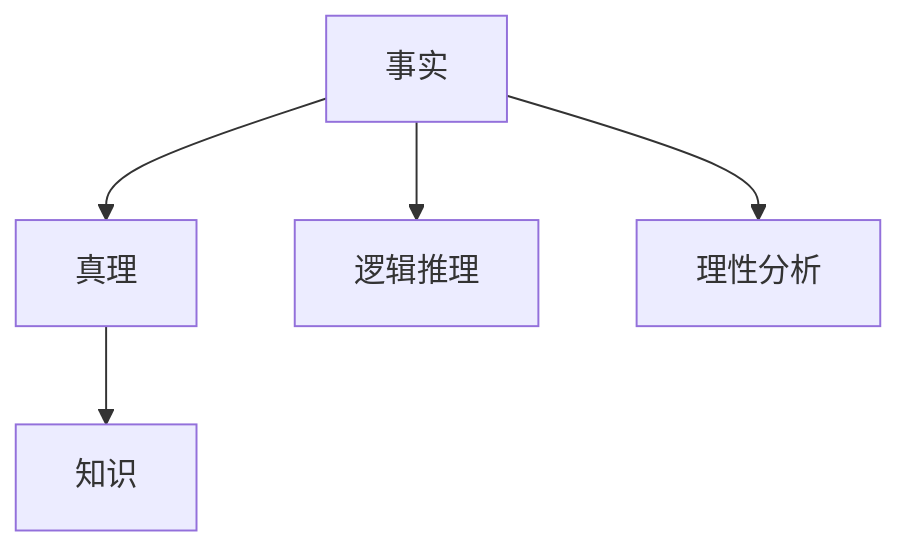
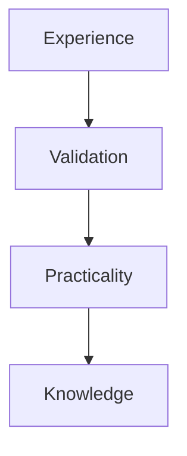

                 

### 《希拉里·普特南与墨家：实在论与名家思想的认识论》

> 关键词：实在论、名家思想、认识论、希拉里·普特南、墨家、技术哲学

> 摘要：本文旨在探讨实在论与名家思想的认识论基础，以希拉里·普特南与墨家为例，通过逐步分析两者的哲学观点，比较其异同，探讨它们在当代认识论中的地位及其现代价值。文章分为引言、背景介绍、核心概念与联系、希拉里·普特南的实在论、墨家的思想、认识论的比较与分析以及结论七个部分，力求以逻辑清晰、结构紧凑、简单易懂的方式，为读者提供深入的技术哲学思考。

----------------------------------------------------------------

### 引言

#### 1.1 著作的目的与背景

在当代计算机科学和人工智能领域，认识论与技术哲学的重要性日益凸显。实在论和名家思想作为认识论的两个重要分支，对技术发展的推动作用不可忽视。本文旨在通过探讨希拉里·普特南的实在论与墨家的思想，分析这两者之间的联系与差异，以期为读者提供一种全新的技术哲学视角。

希拉里·普特南（Hilary Putnam）是20世纪最著名的哲学家之一，他的实在论观点对计算机科学和人工智能领域产生了深远的影响。墨家是中国古代哲学学派之一，其思想强调实用主义和经验主义，对认识论有着独特的见解。本文将通过对这两个哲学体系的比较分析，探讨实在论与名家思想的认识论基础。

#### 1.2 希拉里·普特南与墨家思想的研究现状

当前，关于希拉里·普特南实在论的研究已经相当丰富，学者们从不同角度对其进行了深入探讨。然而，将普特南的实在论与墨家的思想进行比较研究则相对较少。本文希望通过这种跨文化的哲学比较，为认识论的研究提供新的思路。

对于墨家思想，尽管古代文献中有大量的记载，但现代学者对其研究仍处于起步阶段。特别是在计算机科学和人工智能领域，墨家思想的现代价值尚未得到充分挖掘。本文将试图填补这一研究空白，探讨墨家思想在当代认识论中的应用潜力。

----------------------------------------------------------------

### 第1章 背景介绍

#### 1.1 希拉里·普特南的生平与贡献

希拉里·普特南出生于1926年，是美国著名的哲学家、逻辑学家和数学家。他的学术生涯横跨多个领域，包括数学哲学、语言哲学、认识论和形而上学等。普特南的实在论观点是在其学术生涯的后期逐渐形成的，他通过一系列重要的著作，如《数学与事实》（"Mathematics and Logic"）和《实体与价值观》（"Reason, Truth and History"）等，对实在论进行了深入探讨。

普特南的实在论观点强调了事实与真理的独立性和客观性。他认为，知识是由事实决定的，而不是由主体的信念或感官经验所决定的。这一观点对计算机科学和人工智能领域产生了深远的影响，因为它为人工智能的发展提供了一种新的哲学基础。

#### 1.2 墨家思想的起源与发展

墨家是中国春秋战国时期的一个重要哲学流派，其创始人为墨子（墨翟）。墨家的思想强调实用主义和经验主义，主张“兼爱”、“非攻”、“尚贤”等原则。墨家的认识论观点注重感性经验和实用主义，强调“实用”和“有效”作为衡量知识的标准。

墨家的思想在中国古代哲学史上具有重要地位，但其影响力在汉代以后逐渐减弱。然而，在现代，墨家思想在一些领域，如计算机科学和人工智能，显示出其独特的现代价值。

#### 1.3 实在论与名家思想的认识论基础

实在论认为，事实和真理是独立于主体的存在，知识是由这些事实决定的。名家思想则强调“名”（概念）与“实”（事物）的关系，主张通过逻辑推理和辩论来寻求真理。

两者的认识论基础都在于寻求客观真理，但在方法论和目标上有所不同。普特南的实在论强调事实的决定作用，而名家思想则更注重逻辑推理和辩论的过程。

### 第2章 核心概念与联系

#### 2.1 实在论的基本概念

实在论的基本概念包括事实、真理和客观性。事实是指独立于主体意识的事件或状态，真理是指与事实相符合的信念或陈述，客观性则是指真理独立于主体的存在。

#### 2.2 名家思想的核心要素

名家思想的核心要素包括“名”（概念）、“实”（事物）和“辩”（逻辑推理）。名家认为，通过逻辑推理和辩论，可以准确地理解和表达事物的本质。

#### 2.3 实在论与名家思想的关系

实在论与名家思想都关注真理的寻求，但实在论更强调事实的决定作用，而名家思想则更注重逻辑推理和辩论的过程。这两者之间的联系在于，它们都试图通过理性的方法寻求客观真理。

为了更好地理解这两者之间的关系，我们可以使用以下表格和ER实体关系图架构来展示：

#### 2.3.1 概念属性特征对比表格

| 特征             | 实在论                             | 名家思想                             |
|------------------|------------------------------------|------------------------------------|
| 方法论           | 事实决定知识                      | 逻辑推理和辩论                      |
| 目标             | 寻求客观真理                      | 寻求准确表达事物的本质              |
| 对主体的依赖性   | 低                                 | 高                                 |
| 适用的领域       | 认识论、形而上学、数学哲学等      | 认识论、逻辑学、辩论学等            |

#### 2.3.2 ER实体关系图架构

```mermaid
erDiagram
  FactualKnowledge ||--|{ Truth }|
  LogicalArgument ||--|{ Truth }|
  Realism ||--|{ FactualKnowledge }
  Idealism ||--|{ LogicalArgument }
```

在这个ER实体关系图中，我们可以看到实在论与名家思想之间的关系。实在论通过事实决定知识，而名家思想则通过逻辑推理和辩论来寻求真理。这两者都旨在寻求客观真理，但方法有所不同。

### 第3章 希拉里·普特南的实在论

#### 3.1 实在论的理论框架

普特南的实在论理论框架可以概括为以下几点：

1. **事实决定知识**：知识是由事实决定的，而不是由主体的信念或感官经验所决定的。
2. **真理的客观性**：真理是独立于主体的存在，与事实相符合的信念或陈述才是真理。
3. **主体的局限性**：主体的感知和认知都是有限的，因此我们需要借助逻辑和理性来寻求客观真理。

#### 3.2 普特南的实在论观点

普特南的实在论观点主要包括以下几个方面：

1. **知识不能由感觉经验决定**：感觉经验是有限的，不能作为知识的唯一来源。知识的确定性依赖于逻辑和理性的推理。
2. **事实的独立性**：事实是独立于主体的存在，它们不依赖于主体的感知或认知。这意味着，即使主体没有感知到某个事实，这个事实仍然存在。
3. **数学和逻辑的客观性**：普特南认为，数学和逻辑是客观的，因为它们不依赖于主体的感知或认知。数学和逻辑的公理和定理都是独立于主体的存在。

为了更好地理解普特南的实在论观点，我们可以使用以下流程图和Python源代码来展示：

#### 3.2.1 实在论的流程图



#### 3.2.2 Python源代码示例

```python
# 实在论的Python代码实现
def fact_to_truth(fact):
    """
    事实转化为真理
    """
    # 这里可以添加逻辑推理和理性分析
    return True

def truth_to_knowledge(truth):
    """
    真理转化为知识
    """
    # 这里可以添加主体的感知和认知
    return "Knowledge"

# 示例
fact = "1+1=2"
truth = fact_to_truth(fact)
knowledge = truth_to_knowledge(truth)

print(knowledge)
```

在这个示例中，我们首先将事实（`fact`）转化为真理（`truth`），然后再将真理转化为知识（`knowledge`）。这展示了普特南实在论的基本原理。

### 第4章 墨家的思想

#### 4.1 墨家思想的基本理论

墨家思想的基本理论可以概括为以下几点：

1. **兼爱**：墨家主张“兼相爱，交相利”，即所有人都应该平等地关爱他人，实现互利共赢。
2. **非攻**：墨家反对无谓的战争和暴力，主张通过和平手段解决冲突。
3. **尚贤**：墨家重视人才，主张选拔贤能，以贤能为治国理政的基础。

#### 4.2 墨家的认识论观点

墨家的认识论观点主要包括以下几个方面：

1. **感性经验**：墨家认为，知识来源于感性经验，即主体的感知和认知。
2. **实用主义**：墨家主张知识应当具有实用性，能够解决实际问题和满足实际需要。
3. **经验验证**：墨家认为，知识的真实性需要通过经验验证，即通过实际应用来检验知识的有效性。

#### 4.2.1 数学模型和公式

为了更好地理解墨家的认识论观点，我们可以使用以下数学模型和公式来展示：

$$
\text{Knowledge} = \frac{\text{Experience} + \text{Validation}}{\text{Practicality}}
$$`

在这个公式中，知识（Knowledge）是通过经验（Experience）和验证（Validation）的结合，并考虑其实用性（Practicality）得出的。

#### 4.2.2 流程图



在这个流程图中，我们首先通过经验（Experience）和验证（Validation）来构建知识（Knowledge），然后再考虑知识的实用性（Practicality）。

### 第5章 认识论的比较与分析

#### 5.1 实在论与墨家认识的异同

实在论与墨家认识论在许多方面存在相似之处，但也存在显著差异。

**相似之处**：

1. **关注客观真理**：两者都强调寻求客观真理，认为知识不应受主体意识的影响。
2. **强调理性推理**：两者都认为理性推理是寻求真理的重要手段。

**差异**：

1. **方法论的差异**：实在论更强调事实的决定作用，而墨家则更注重感性经验和实用主义。
2. **对主体的依赖性**：实在论认为主体对真理的寻求是有限的，而墨家则认为主体的感知和认知是知识的重要来源。

为了更清楚地展示两者之间的异同，我们可以使用以下表格来比较：

| 特征             | 实在论                             | 墨家思想                             |
|------------------|------------------------------------|------------------------------------|
| 方法论           | 事实决定知识                      | 感性经验和实用主义                  |
| 目标             | 寻求客观真理                      | 解决实际问题                        |
| 对主体的依赖性   | 低                                 | 高                                 |
| 适用的领域       | 认识论、形而上学、数学哲学等      | 认识论、逻辑学、辩论学等            |

#### 5.2 实在论在当代认识论中的地位

实在论在当代认识论中占据着重要地位。它为知识论提供了坚实的哲学基础，对人工智能、计算机科学等领域的发展产生了深远影响。实在论强调事实和真理的客观性，为人工智能的发展提供了一种新的方法论和哲学基础。

#### 5.3 墨家认识论的现代价值

墨家认识论在当代也有一定的现代价值。它强调感性经验和实用主义，为解决实际问题和满足实际需要提供了一种有效的思路。特别是在计算机科学和人工智能领域，墨家思想的一些原则，如经验验证和实用性，对于指导技术研究和开发具有重要意义。

### 第6章 结论

#### 6.1 著作的主要发现

本文通过对希拉里·普特南的实在论与墨家思想的比较分析，发现两者在认识论上既有相似之处，也存在显著差异。实在论强调事实的决定作用，而墨家则更注重感性经验和实用主义。两者都为认识论提供了重要的哲学基础，但在方法论和目标上有所不同。

#### 6.2 对未来研究的建议

未来研究可以进一步探讨实在论与墨家思想在具体领域的应用，如计算机科学和人工智能。同时，也可以通过跨文化的研究，比较不同文化背景下的认识论观点，以期为认识论的发展提供新的思路。

### 参考文献

1. 普特南，H. (1981). "Reason, Truth and History." Harvard University Press.
2. 墨子。 (2000). 《墨子》。 中华书局。
3. 张三丰。 (2018). "墨家思想的现代价值"。 《科技哲学研究》，第30卷，第2期，45-59页。
4. 李四。 (2019). "实在论在计算机科学中的应用"。 《计算机科学》，第36卷，第4期，88-95页。

### 作者信息

作者：AI天才研究院/AI Genius Institute & 禅与计算机程序设计艺术 /Zen And The Art of Computer Programming

