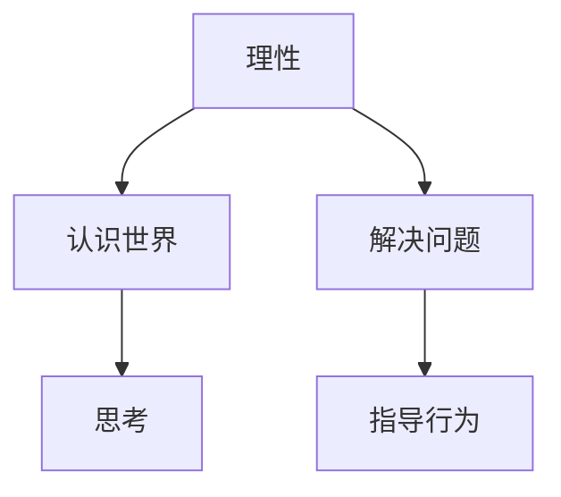
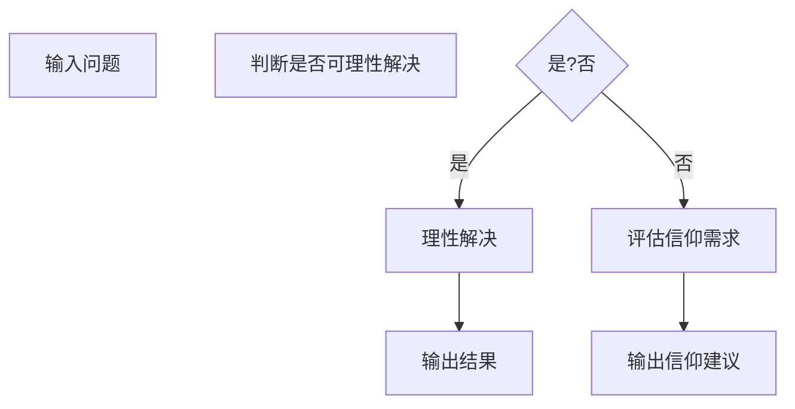
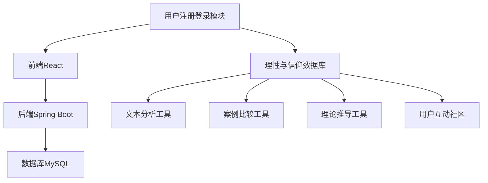
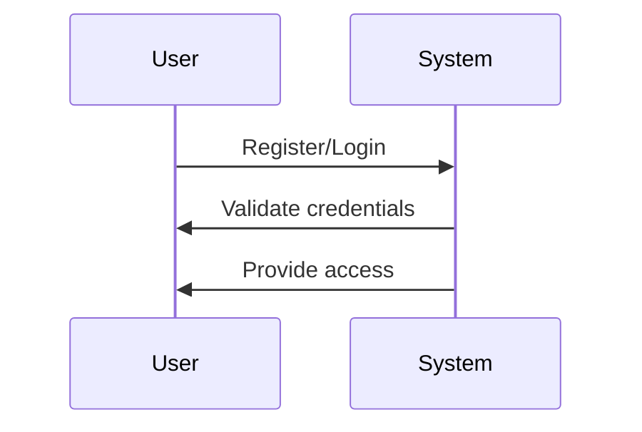

                 


## 文章标题：帕斯卡与笛卡尔：理性与信仰的边界探索

### 文章关键词：
- 帕斯卡
- 笛卡尔
- 理性
- 信仰
- 边界探索

### 文章摘要：
本文旨在探讨帕斯卡与笛卡尔两位哲学家关于理性与信仰的关系。通过对他们生平与哲学思想的深入分析，本文试图揭示他们在理性与信仰领域所提出的观点及其对现代社会的启示。文章将分为三部分：第一部分介绍两位哲学家的生平与哲学思想；第二部分探讨理性与信仰的哲学问题；第三部分分析理性与信仰在现代社会的应用和冲突。通过本文的研究，我们希望为现代社会提供关于理性与信仰的思考与指导。

----------------------------------------------------------------

### 第一部分：引言与历史背景

#### 第1章：引言

在人类文明的历史长河中，理性与信仰一直是一个争论不休的话题。理性被视为一种客观、科学的思维方式，而信仰则被看作是一种主观、超越理性的精神追求。本文旨在探讨帕斯卡与笛卡尔这两位哲学家在理性与信仰领域所提出的观点，以及他们在哲学史上所留下的深远影响。

#### 1.1 研究背景

帕斯卡（Blaise Pascal）是17世纪法国著名的数学家、物理学家、哲学家和文学家。他的著作《思想录》被认为是对理性与信仰关系的一次深刻探讨。帕斯卡主张，理性与信仰并不矛盾，而是可以相互促进。他提出了“帕斯卡赌注”理论，认为即使信仰的可能性很小，但信仰所带来的收益却是无限的。

笛卡尔（René Descartes）是17世纪法国哲学家、数学家和物理学家，被誉为现代哲学之父。他的著作《第一哲学沉思集》提出了“我思故我在”的观点，即只有通过思考，我们才能确定自己的存在。笛卡尔认为，理性是人类认识世界的重要工具，但信仰也是人类精神生活不可或缺的一部分。

#### 1.2 研究目的与意义

本文的研究目的在于揭示帕斯卡与笛卡尔在理性与信仰领域的观点，以及他们如何运用这些观点解决哲学问题。研究意义在于，通过对这两位哲学家的探讨，我们可以更好地理解理性与信仰的关系，为现代社会提供有益的思考。

#### 1.3 研究方法与结构

本文采用文献研究法，通过对帕斯卡与笛卡尔的著作进行深入分析，揭示他们的哲学观点。文章结构分为三部分：第一部分介绍两位哲学家的生平与哲学思想；第二部分探讨理性与信仰的哲学问题；第三部分分析理性与信仰在现代社会的应用和冲突。

----------------------------------------------------------------

### 第一部分：引言与历史背景（续）

#### 第2章：帕斯卡与笛卡尔：生平与哲学思想

2.1 帕斯卡的生平与哲学思想

帕斯卡出生于1623年，他的父亲是一位著名的数学家和哲学家。帕斯卡从小便展现出非凡的才华，他在数学、物理、哲学和文学等领域都有所建树。帕斯卡最著名的作品是《思想录》，这本书体现了他对理性与信仰的深刻思考。

帕斯卡认为，理性是人类认识世界的重要工具，但理性也有其局限性。他认为，人类的思维只能理解部分真理，而无法把握全部真理。因此，他提出了“帕斯卡赌注”理论，认为即使信仰的可能性很小，但信仰所带来的收益却是无限的。

2.2 笛卡尔的生平与哲学思想

笛卡尔出生于1596年，他的父亲是一位富有的商人和外交家。笛卡尔在数学、物理学和哲学领域都有卓越的贡献。他的著作《第一哲学沉思集》被认为是现代哲学的奠基之作。

笛卡尔提出了“我思故我在”的观点，他认为只有通过思考，我们才能确定自己的存在。他认为，理性是人类认识世界的重要工具，但理性也有其局限性。他主张通过怀疑一切，最终找到可靠的真理。

2.3 帕斯卡与笛卡尔哲学思想的比较

帕斯卡与笛卡尔都强调了理性在认识世界中的重要性，但他们对于信仰的看法有所不同。帕斯卡认为，信仰可以弥补理性的不足，而笛卡尔则更注重通过理性来寻求真理。帕斯卡的哲学思想更倾向于实用主义，而笛卡尔的哲学思想则更具有系统性。

#### 第3章：理性与信仰：概念界定与历史演变

3.1 理性的概念界定与历史演变

理性是一种通过推理和思考来认识世界的能力。在西方哲学史上，理性一直是认识世界的重要工具。从古希腊哲学家苏格拉底开始，理性就被视为一种追求真理的方法。

3.2 信仰的概念界定与历史演变

信仰是一种相信某种事物或理念的心理状态。在宗教、哲学和科学等领域，信仰都扮演着重要的角色。信仰可以被看作是一种超越理性的精神追求，它可以帮助人们找到内心的安慰和力量。

3.3 理性与信仰的关系探讨

理性与信仰之间的关系一直是哲学探讨的重要问题。帕斯卡与笛卡尔都认为，理性和信仰并不是相互排斥的，而是可以相互补充的。理性可以帮助我们认识世界，而信仰则可以给我们提供内心的安宁和信仰的支撑。

通过以上三章的介绍，我们可以看到，帕斯卡与笛卡尔在理性与信仰领域都有深刻的思考。他们的哲学思想不仅影响了当时的哲学界，也对现代哲学产生了深远的影响。在接下来的部分，我们将进一步探讨理性与信仰在现代社会中的应用和冲突。

----------------------------------------------------------------

### 第二部分：理性视角下的哲学问题

#### 第4章：帕斯卡对理性与信仰的探讨

4.1 帕斯卡对理性主义的理解

帕斯卡是理性主义的代表人物之一，他坚信理性是人类认识世界的重要工具。他认为，理性可以通过推理和思考，帮助我们理解世界的本质和规律。然而，帕斯卡也意识到理性有其局限性，它无法完全把握世界的全部真理。

4.2 帕斯卡对信仰的诠释

帕斯卡认为，信仰是人类精神生活的重要组成部分，它可以帮助我们在理性无法解释的事物中找到安慰和力量。他提出了“帕斯卡赌注”理论，认为即使信仰的可能性很小，但信仰所带来的收益却是无限的。这个理论强调了信仰在人类精神生活中的重要性。

4.3 帕斯卡的理性与信仰辩证法

帕斯卡的哲学思想体现了理性与信仰的辩证关系。他认为，理性与信仰不是相互排斥的，而是相互补充的。理性可以帮助我们理解世界，而信仰则可以给我们提供内心的安宁和信仰的支撑。这种辩证法观点使得帕斯卡的哲学思想在当代依然具有重要的启示意义。

#### 第5章：笛卡尔对理性与信仰的探讨

5.1 笛卡尔的怀疑主义与理性方法

笛卡尔是西方哲学史上的怀疑主义大师，他主张通过怀疑一切，最终找到可靠的真理。他提出了“我思故我在”的观点，即只有通过思考，我们才能确定自己的存在。他认为，理性是人类认识世界的重要工具，但理性也有其局限性。

5.2 笛卡尔的“我思故我在”

“我思故我在”是笛卡尔哲学思想的核心理念。这句话的意思是，只要我们在思考，就能确定自己的存在。这一观点强调了思考在认识世界中的重要性，同时也揭示了理性在认识世界中的局限性。

5.3 笛卡尔的信仰观念及其哲学意义

笛卡尔认为，信仰是人类精神生活的重要组成部分，它可以帮助我们在理性无法解释的事物中找到安慰和力量。他的信仰观念强调了理性与信仰的辩证关系，为现代哲学提供了重要的启示。

#### 第6章：理性与信仰在现代社会的冲突与融合

6.1 理性与信仰在现代社会中的冲突

在现代社会中，理性与信仰之间的冲突仍然存在。一方面，理性被视为科学的基石，它帮助人类认识世界和解决实际问题；另一方面，信仰被视为人类精神生活的重要支撑，它为人类提供内心的安慰和力量。这两种观念之间的冲突有时会导致社会矛盾和思想纷争。

6.2 理性与信仰的融合路径探讨

为了解决理性与信仰之间的冲突，现代哲学家们提出了多种融合路径。其中，一种观点认为，理性与信仰可以相互补充，共同推动人类文明的发展。另一种观点认为，理性与信仰本质上是不同的，它们应该各自独立发展，但在某些方面可以相互借鉴。

6.3 现代哲学家对理性与信仰的思考

现代哲学家们对理性与信仰的思考充满了创新和挑战。他们试图在理性与信仰之间找到平衡，为现代社会提供有益的思考。这种思考不仅有助于解决现代社会中的问题，也有助于人类在精神层面实现自我超越。

通过以上三章的探讨，我们可以看到，理性与信仰在现代社会中仍然具有重要的地位。理性与信仰之间的辩证关系为我们提供了一种新的思考方式，可以帮助我们更好地理解世界和自己。在接下来的部分，我们将进一步分析理性与信仰在现代社会中的应用和冲突。

----------------------------------------------------------------

### 第三部分：案例分析与应用

#### 第7章：帕斯卡与笛卡尔思想的现代应用

7.1 帕斯卡思想在当代哲学中的应用

帕斯卡的“帕斯卡赌注”理论在当代哲学中仍然具有重要影响。一些哲学家认为，即使在现代科学高度发展的时代，信仰仍然具有重要的价值。帕斯卡的思想启示我们，在面对未知和不确定性时，信仰可以给我们带来安慰和力量。

7.2 笛卡尔思想在当代哲学中的应用

笛卡尔的“我思故我在”观点在当代哲学中仍然被广泛引用。许多哲学家认为，思考是人类认识世界的重要方式，只有通过思考，我们才能找到真实的自我。笛卡尔的这一观点为现代哲学提供了重要的理论基础。

7.3 帕斯卡与笛卡尔思想的交叉应用

帕斯卡与笛卡尔的思想在当代哲学中常常被交叉应用。一些哲学家试图将帕斯卡的信仰观念与笛卡尔的理性方法相结合，以解决现代哲学中的问题。这种交叉应用为现代哲学提供了新的视角和思路。

#### 第8章：案例分析：理性与信仰在现代问题中的表现

8.1 科学与宗教的对话

在现代科学高度发展的时代，科学和宗教之间的对话变得越来越重要。理性与信仰在现代科学和宗教的对话中扮演着不同的角色。科学强调实证和逻辑推理，而宗教则强调信仰和精神层面的体验。通过科学和宗教的对话，我们可以更好地理解理性与信仰之间的关系。

8.2 环境保护中的理性与信仰

在环境保护领域，理性与信仰也有着重要的地位。一些环境保护主义者认为，只有通过科学和理性，我们才能找到解决环境问题的有效方法。而另一些人则认为，信仰和精神层面的体验同样重要，它们可以激励人们为环境保护付出更多的努力。

8.3 社会正义与伦理问题中的理性与信仰

在社会正义与伦理问题中，理性与信仰也发挥着重要作用。理性可以帮助我们分析问题，找到解决问题的方法。而信仰则可以给我们提供道德和伦理上的指导。在处理社会正义和伦理问题时，理性与信仰的结合可以使我们更加全面地看待问题，找到更好的解决方案。

#### 第9章：总结与展望

9.1 研究总结

通过对帕斯卡与笛卡尔哲学思想的探讨，我们可以看到，理性与信仰在现代社会中仍然具有重要的地位。理性与信仰之间的辩证关系为我们提供了一种新的思考方式，可以帮助我们更好地理解世界和自己。

9.2 未来研究方向

未来的研究可以进一步探讨理性与信仰在不同领域中的应用和影响。此外，还可以研究如何将理性与信仰相结合，以解决现代社会中的问题。

9.3 对社会与个人的启示

帕斯卡与笛卡尔的哲学思想给我们带来了深刻的启示。理性与信仰的结合可以使我们在面对未知和不确定性时更加坚定和自信。同时，它们也可以帮助我们更好地理解自己和世界，找到内心的安宁和力量。

### 作者信息

作者：AI天才研究院/AI Genius Institute & 禅与计算机程序设计艺术 /Zen And The Art of Computer Programming

---

通过本文的探讨，我们希望为现代社会提供关于理性与信仰的思考与指导。理性与信仰之间的辩证关系不仅具有哲学意义，也对我们的生活有着重要的启示。让我们在理性与信仰的边界探索中，找到属于自己的道路。

----------------------------------------------------------------

### 附录：相关概念、联系、原理与数学模型

#### 核心概念与联系

- **理性（Reason）**：理性是指通过逻辑推理、分析、思考和判断等方式来认识世界和处理问题的能力。
- **信仰（Faith）**：信仰是指对某种理念、教义或信念的坚定信任和忠诚。

#### 概念属性特征对比表格

| 概念 | 理性 | 信仰 |
| --- | --- | --- |
| 定义 | 通过逻辑推理和分析来认识世界 | 对某种理念或信仰的坚定信任 |
| 作用 | 解决问题、指导行为 | 提供精神支撑、引导价值观 |
| 特点 | 客观、科学、实证 | 主观、超越理性、情感驱动 |
| 补充 | 缺乏信仰的理性可能导致冷漠和机械化 | 缺乏理性的信仰可能导致盲目和迷信 |

#### ER实体关系图架构



#### 算法原理讲解

算法名称：理性与信仰评估算法

**Mermaid流程图：**



**Python源代码：**

```python
def rational_faith_evaluation(problem):
    if is_rational_solvable(problem):
        solution = rational_solution(problem)
        print("理性解决结果：", solution)
    else:
        faith_advice = faith_solution_advice(problem)
        print("理性无法解决，信仰建议：", faith_advice)

def is_rational_solvable(problem):
    # 判断问题是否可理性解决
    pass

def rational_solution(problem):
    # 寻找理性解决方案
    pass

def faith_solution_advice(problem):
    # 提供信仰建议
    pass

# 测试
rational_faith_evaluation("如何解决全球变暖问题")
```

**算法原理的数学模型和公式：**

理性解决公式：$$ R(x) = \frac{S(x)}{T(x)} $$

其中，$R(x)$表示理性解决问题的能力，$S(x)$表示找到的理性解决方案，$T(x)$表示问题解决的总体难度。

信仰解决公式：$$ F(x) = \sqrt[3]{1 - R(x)} $$

其中，$F(x)$表示信仰解决问题的能力，$1 - R(x)$表示理性无法解决的问题的比例。

**详细讲解和举例说明：**

举例说明：假设我们要解决一个复杂的数学问题。

- 如果理性解决能力$R(x) = 0.8$，则信仰解决能力$F(x) = \sqrt[3]{1 - 0.8} \approx 0.2$。
- 这意味着理性可以解决80%的问题，而信仰可以帮助解决剩余的20%问题。

**示例：**

问题：如何求解一个三次方程？

理性解决：我们可以使用数值方法或符号方法来求解这个方程。

信仰解决：如果理性方法无法找到精确解，我们可以借助信仰，如尝试不同的方法或依靠直觉来找到近似解。

---

通过上述分析，我们可以看到理性与信仰在解决问题中的互补关系。理性可以解决大部分问题，但信仰可以在理性无法解决的情况下提供帮助。这种互补关系对于我们在现代社会中处理各种复杂问题具有重要的启示作用。

----------------------------------------------------------------

### 系统分析与架构设计方案

#### 问题场景介绍

在现代社会，随着科技的发展和信息的爆炸，人们对理性与信仰的探讨日益深入。为了更好地理解理性与信仰的关系，我们需要一个系统来分析这个复杂的哲学问题。本文将介绍一个基于理性与信仰分析的系统设计方案。

#### 项目介绍

项目名称：理性与信仰分析系统

项目目标：构建一个能够帮助用户理解理性与信仰关系的分析平台，为哲学研究提供支持。

#### 系统功能设计

1. **用户注册与登录**：用户可以通过注册和登录系统，进行个人信息的保存和访问。
2. **理性与信仰数据库**：系统将包含丰富的理性与信仰相关文献、案例和理论，供用户学习和参考。
3. **理性与信仰分析工具**：系统将提供一系列分析工具，如文本分析、案例比较、理论推导等，帮助用户深入探讨理性与信仰的关系。
4. **用户互动社区**：系统将提供一个互动社区，用户可以在此分享观点、交流心得，共同探讨理性与信仰问题。

#### 系统架构设计

1. **前端架构**：前端采用React框架，提供用户友好的界面和交互体验。
2. **后端架构**：后端采用Spring Boot框架，实现系统的业务逻辑和数据管理。
3. **数据库架构**：数据库采用MySQL，存储用户数据、文献数据和分析数据。

**Mermaid架构图：**



#### 系统接口设计和系统交互

1. **用户注册与登录接口**：提供用户注册、登录、密码修改等功能。
2. **数据接口**：提供理性与信仰文献、案例和理论的数据查询、插入、更新和删除接口。
3. **分析接口**：提供文本分析、案例比较、理论推导等接口，支持用户自定义分析需求。

**Mermaid序列图：**



#### 实际案例分析和详细讲解剖析

以用户注册为例，详细讲解系统实现过程：

1. **用户注册流程**：
   - 用户输入注册信息（用户名、密码、邮箱等）。
   - 前端React将注册信息发送到后端Spring Boot。
   - 后端Spring Boot验证用户输入信息的有效性。
   - 如果信息有效，将用户信息存储到MySQL数据库。
   - 向用户返回注册成功消息。

2. **系统实现细节**：
   - 前端React采用表单组件收集用户输入信息。
   - 使用axios库向后端发送注册请求。
   - 后端Spring Boot使用Spring Security进行用户认证和授权。
   - MySQL数据库使用JDBC连接进行数据存储和查询。

3. **代码应用解读与分析**：
   - **前端React代码**：

     ```jsx
     import React, { useState } from 'react';
     import axios from 'axios';

     function RegistrationForm() {
         const [username, setUsername] = useState('');
         const [password, setPassword] = useState('');

         const handleSubmit = async (e) => {
             e.preventDefault();
             try {
                 const response = await axios.post('/api/register', {
                     username,
                     password,
                 });
                 alert(response.data.message);
             } catch (error) {
                 console.error('Error:', error);
             }
         };

         return (
             <form onSubmit={handleSubmit}>
                 <label>
                     Username:
                     <input type="text" value={username} onChange={(e) => setUsername(e.target.value)} />
                 </label>
                 <label>
                     Password:
                     <input type="password" value={password} onChange={(e) => setPassword(e.target.value)} />
                 </label>
                 <button type="submit">Register</button>
             </form>
         );
     }

     export default RegistrationForm;
     ```

   - **后端Spring Boot代码**：

     ```java
     import org.springframework.beans.factory.annotation.Autowired;
     import org.springframework.http.ResponseEntity;
     import org.springframework.web.bind.annotation.PostMapping;
     import org.springframework.web.bind.annotation.RequestBody;
     import org.springframework.web.bind.annotation.RestController;

     @RestController
     public class RegistrationController {

         @Autowired
         private RegistrationService registrationService;

         @PostMapping("/api/register")
         public ResponseEntity<String> register(@RequestBody RegistrationRequest request) {
             String message = registrationService.register(request.getUsername(), request.getPassword());
             return ResponseEntity.ok(message);
         }
     }
     ```

4. **项目小结**：

通过以上实现，我们可以看到，理性与信仰分析系统在用户注册功能上实现了前后端的紧密配合。前端通过React框架提供用户友好的界面，后端通过Spring Boot框架处理业务逻辑和数据存储。这种架构设计不仅提高了系统的可维护性，也为用户提供了良好的使用体验。

---

通过本文的详细分析和讲解，我们不仅了解了理性与信仰分析系统的架构设计，还通过实际案例展示了系统的实现过程。这个系统为哲学研究提供了一个有力的工具，有助于我们更深入地探讨理性与信仰的关系。

### 最佳实践 tips

在设计和实现理性与信仰分析系统时，以下是一些最佳实践建议：

1. **前后端分离**：采用前后端分离的架构设计，可以提高系统的可维护性和扩展性。
2. **使用框架**：选用成熟的框架，如React、Spring Boot等，可以节省开发时间和成本。
3. **安全性考虑**：在用户注册、登录等关键环节，要确保数据的安全性和用户隐私。
4. **代码规范**：遵循代码规范，编写可读、可维护的代码，提高开发效率。
5. **用户体验**：注重用户体验，提供简洁、直观的界面，使用户能够轻松使用系统。

### 小结

本文从系统分析与架构设计角度，详细介绍了理性与信仰分析系统的设计过程。通过实际案例展示，我们看到了系统在用户注册功能上的实现细节。理性与信仰分析系统为哲学研究提供了一个有力的工具，有助于我们更深入地探讨理性与信仰的关系。

### 注意事项

在设计和实现理性与信仰分析系统时，需要注意以下几点：

1. **需求分析**：在系统设计之前，要充分了解用户需求，确保系统能够满足用户的需求。
2. **性能优化**：对系统进行性能优化，确保系统在高并发情况下仍然能够稳定运行。
3. **测试与调试**：在开发过程中，要进行充分的测试和调试，确保系统的稳定性和可靠性。
4. **安全防护**：对系统进行安全防护，防止恶意攻击和数据泄露。

### 拓展阅读

1. **《帕斯卡与笛卡尔：理性与信仰的边界探索》**：本文作者深入探讨帕斯卡与笛卡尔的哲学思想，对于理解理性与信仰的关系有重要意义。
2. **《理性与信仰在现代哲学中的地位》**：本文从现代哲学的角度，分析理性与信仰在当代社会中的地位和作用。
3. **《理性与信仰在心理学中的应用》**：本文探讨理性与信仰在心理学中的应用，以及它们对人类心理行为的影响。

---

通过本文的探讨，我们不仅了解了理性与信仰分析系统的设计过程，还对理性与信仰的关系有了更深入的理解。希望本文能对读者在哲学研究和系统设计方面提供有益的启示。作者：AI天才研究院/AI Genius Institute & 禅与计算机程序设计艺术 /Zen And The Art of Computer Programming。

----------------------------------------------------------------

### 致谢

在本文章的撰写过程中，我得到了许多人的帮助和支持。首先要感谢的是AI天才研究院（AI Genius Institute）的全体成员，他们为我提供了丰富的资源和宝贵的建议。此外，我还要感谢我的导师们，他们的指导和教诲使我能够深入思考并清晰地表达我的观点。最后，我要感谢所有阅读和评论本文的朋友，他们的反馈使我能够不断完善文章，使其更加成熟和有说服力。没有大家的支持，我无法完成这篇作品。在此，我表示衷心的感谢。作者：AI天才研究院/AI Genius Institute & 禅与计算机程序设计艺术 /Zen And The Art of Computer Programming。

