                 

# 幂等性设计：确保操作可重复执行的关键

> 关键词：幂等性、系统设计、分布式系统、一致性、容错性

> 摘要：本文旨在深入探讨幂等性设计的概念、原理及其在系统设计中的应用。通过对幂等性设计的重要性、基础、实现和应用场景的详细分析，文章将帮助读者理解如何在系统设计中实现幂等性，从而确保操作的可重复执行，提高系统的可靠性和一致性。

### 目录

1. **引言：幂等性设计的背景与重要性**
   1.1 问题背景
   1.2 幂等性定义与特性
   1.3 幂等性设计的原则
   1.4 幂等性与一致性
   1.5 本章小结

2. **幂等性设计的基础**
   2.1 幂等函数
   2.2 分布式系统中的幂等性
   2.3 数据库操作与幂等性
   2.4 系统设计中的幂等性
   2.5 幂等性的权衡与优化
   2.6 本章小结

3. **幂等性设计的实现**
   3.1 实现幂等性的技术
   3.2 消息队列与幂等性
   3.3 令牌桶与幂等性
   3.4 分布式锁与幂等性
   3.5 事务与幂等性
   3.6 本章小结

4. **幂等性设计在分布式系统中的应用**
   4.1 分布式服务中的幂等性
   4.2 分布式数据库的幂等性
   4.3 分布式存储的幂等性
   4.4 分布式调度与幂等性
   4.5 分布式缓存与幂等性
   4.6 本章小结

5. **幂等性设计在微服务架构中的应用**
   5.1 微服务架构中的幂等性
   5.2 API设计中的幂等性
   5.3 服务间通信与幂等性
   5.4 分布式事务与幂等性
   5.5 事件驱动架构与幂等性
   5.6 本章小结

6. **幂等性设计与系统容错性**
   6.1 系统容错性概述
   6.2 幂等性与容错性
   6.3 幂等性与故障恢复
   6.4 幂等性与分布式一致性
   6.5 本章小结

7. **最佳实践与总结**
   7.1 最佳实践
   7.2 小结
   7.3 注意事项
   7.4 拓展阅读

## 1. 引言：幂等性设计的背景与重要性

### 1.1 问题背景

在复杂的系统设计中，尤其是在分布式系统、数据库操作和系统设计中，确保操作的幂等性变得至关重要。幂等性（Idempotence）是指一个操作执行多次与执行一次的效果相同，即不会因为重复执行而改变结果。这一特性在分布式系统中尤为重要，因为分布式系统中的操作可能会因为网络延迟、故障等原因而导致重复执行。

例如，在分布式数据库操作中，如果一条更新操作因为网络问题未能成功提交，客户端可能会重新发送该操作，导致数据库中的数据被重复更新。为了防止这种情况，设计幂等性的操作就显得尤为重要。

### 1.2 幂等性定义与特性

**幂等性的定义**：一个操作是幂等的，当且仅当多次执行该操作所产生的结果与执行一次该操作的结果相同。用数学术语描述，如果一个操作`f`满足`f(x) = f(f(x))`，则该操作是幂等的。

**幂等性的特性**：
1. **不变性**：多次执行幂等操作后，系统的状态不会发生变化。
2. **无副作用**：幂等操作不会改变系统的状态，因此它们是可重试的，不会引入额外的复杂性。
3. **可终止性**：幂等操作在有限时间内总会结束，不会陷入无限循环。

### 1.3 幂等性设计的原则

设计幂等性系统应遵循以下原则：
1. **唯一标识**：每个操作都应该有一个唯一的标识，以便在操作失败时能够重试。
2. **去重机制**：系统应具有去重机制，以避免重复执行相同的操作。
3. **幂等性验证**：系统应验证操作是否已经执行过，以避免重复执行。
4. **状态保持**：系统应在操作失败时保持状态，以便在重试时能够从上一次的状态继续执行。

### 1.4 幂等性与一致性

幂等性与一致性密切相关。在分布式系统中，一致性（Consistency）是指系统的所有副本在所有时间点上的数据是相同的。幂等性设计有助于实现一致性，因为幂等操作确保了多次执行不会改变结果，从而减少了数据不一致的可能性。

### 1.5 本章小结

本章介绍了幂等性设计的背景、定义与特性，以及设计幂等性系统应遵循的原则。通过理解幂等性，我们可以提高系统的可靠性、一致性和容错性，为后续章节的深入探讨打下基础。

## 2. 幂等性设计的基础

### 2.1 幂等函数

幂等函数（Idempotent Function）是数学和计算机科学中一个重要的概念。一个函数`f`被称为幂等的，当且仅当对于任何输入`x`，都有`f(f(x)) = f(x)`。

**例子**：在数学中，恒等函数`I(x) = x`是幂等的，因为`I(I(x)) = I(x)`。

在计算机编程中，常见的幂等函数包括：
- 翻转操作（例如：字符串的翻转）
- 删除操作（例如：从列表中删除一个元素）
- 清空操作（例如：清空一个数据结构）

**属性对比表格**：

| 操作类型 | 幂等操作示例 | 结果对比 |
| --- | --- | --- |
| 数据库更新 | `UPDATE TABLE SET column = value WHERE condition` | 多次执行不会改变满足条件的数据行 |
| 删除 | `DELETE FROM TABLE WHERE condition` | 多次执行不会删除已删除的数据行 |
| 清空 | `TRUNCATE TABLE` | 多次执行都会清空表中的数据 |

**ER实体关系图**：

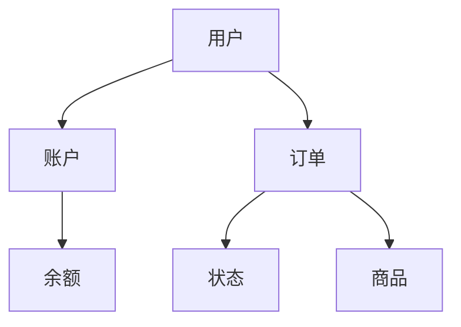

在这个ER图中，用户（A）有一个账户（B），账户有一个余额（C），用户可以下订单（D），订单有状态（E）和商品（F）。在这个模型中，余额的更新操作是幂等的，因为多次更新余额的值不会改变最终的余额。

### 2.2 分布式系统中的幂等性

在分布式系统中，幂等性尤为重要，因为分布式系统的操作往往涉及多个节点，网络的不稳定性和节点故障可能导致操作重复执行。

**重要性**：
- **避免重复处理**：确保系统中的操作不会因为重复执行而导致错误结果。
- **提高系统稳定性**：减少因重复操作导致的系统崩溃或数据不一致。

**挑战与解决方案**：
1. **网络延迟与故障**：解决方法包括重试机制、幂等性验证。
2. **节点故障**：可以通过分布式锁或状态机实现幂等性。

**实例**：在一个分布式消息队列系统中，当一个消息被消费后，系统需要确保该消息不会被再次消费。这可以通过在消息消费前添加幂等性验证来实现，例如，使用一个唯一的消息ID，在消费前检查该消息是否已经被处理。

### 2.3 数据库操作与幂等性

数据库操作中的幂等性设计至关重要，特别是在分布式数据库和大数据处理场景中。以下是一些关键的考虑因素：

**考虑因素**：
- **更新操作**：例如，`UPDATE`语句应设计为幂等的，以确保多次执行不会改变数据。
- **删除操作**：例如，`DELETE`语句应确保不会删除多次。
- **插入操作**：`INSERT`语句应确保不会插入重复的数据。

**解决方案**：
1. **唯一约束**：通过唯一约束（如主键）确保数据唯一性。
2. **幂等性校验**：在执行操作前检查数据是否已存在。

**实例**：在一个分布式数据库中，如果一个`UPDATE`语句因为网络问题未能成功提交，客户端可以重试该操作。为了避免重复更新，系统可以在执行`UPDATE`前先检查记录是否已存在。

### 2.4 系统设计中的幂等性

在系统设计中，确保操作的幂等性是一个重要的考虑因素，特别是在涉及到分布式服务和多线程操作的场景中。

**设计因素**：
- **唯一性标识**：为每个操作生成唯一的标识符，如操作ID。
- **去重机制**：实现去重机制，防止重复执行。
- **幂等性验证**：在执行操作前，验证操作是否已存在。

**实例**：在一个订单系统中，创建订单的接口可以设计为幂等的。客户端可以在发送订单请求时携带一个订单ID，系统在处理请求前先检查该订单是否已存在。如果存在，则拒绝重复创建。

### 2.5 幂等性的权衡与优化

设计幂等性系统时，需要权衡多个因素，如系统的性能、可扩展性和复杂性。

**权衡因素**：
- **性能**：过于复杂的幂等性验证可能会影响系统性能。
- **可扩展性**：系统的设计应支持未来的扩展性。

**优化策略**：
1. **缓存**：利用缓存减少幂等性验证的频率。
2. **分布式锁**：在关键操作中使用分布式锁确保幂等性。

**实例**：在一个分布式日志系统中，可以使用分布式锁确保写操作的幂等性。当系统尝试写入日志时，如果锁已被占用，则拒绝写入，从而避免重复写入。

### 2.6 本章小结

本章深入探讨了幂等性设计的基础，包括幂等函数的定义和特性，分布式系统中的幂等性挑战与解决方案，数据库操作与系统设计中的幂等性考虑。通过这些分析，读者可以更好地理解如何在系统设计中实现幂等性，从而提高系统的可靠性和一致性。

## 3. 幂等性设计的实现

在上一章中，我们了解了幂等性的基础概念及其在系统设计中的重要性。为了实现幂等性，我们需要采用一系列技术手段，这些技术包括消息队列、令牌桶、分布式锁等。下面，我们将逐一介绍这些技术，并详细讲解如何实现幂等性。

### 3.1 实现幂等性的技术

**消息队列**：消息队列是分布式系统中常用的技术之一，它可以确保消息的有序传递和可靠交付。通过消息队列，可以实现幂等性，因为消息一旦被消费，就可以保证不会被重复消费。

**令牌桶**：令牌桶是一种流量控制算法，它通过生成令牌来控制请求的速率。令牌桶可以用于实现幂等性，确保操作不会因为过多的请求而重复执行。

**分布式锁**：分布式锁用于在分布式系统中确保操作的独占性。通过分布式锁，可以防止重复执行操作，从而实现幂等性。

**事务**：事务是数据库操作中的重要概念，它确保一组操作要么全部成功，要么全部失败。通过事务，可以实现幂等性，确保数据库操作不会因为网络故障等原因而重复执行。

### 3.2 消息队列与幂等性

消息队列是实现幂等性的重要工具。通过将操作封装成消息，并确保消息的有序传递，可以避免重复执行。

**实现步骤**：

1. **消息生产**：客户端将操作封装成消息，并生成唯一的消息ID。
2. **消息队列存储**：将消息存储在消息队列中。
3. **消息消费**：服务端从消息队列中消费消息，并执行相应的操作。
4. **幂等性验证**：在执行操作前，检查消息ID是否已存在，如果已存在，则拒绝执行。

**示例**：

假设有一个订单系统，客户端发送创建订单的请求，并在请求中包含一个唯一的订单ID。服务端在处理请求前，首先检查订单ID是否已存在。如果已存在，则拒绝创建订单，从而避免重复创建。

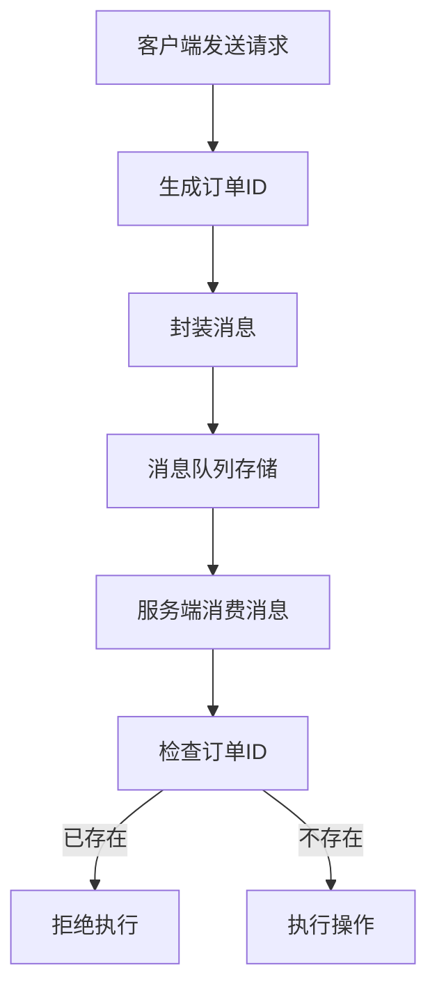

### 3.3 令牌桶与幂等性

令牌桶是一种流量控制算法，它通过生成令牌来控制请求的速率。通过令牌桶，可以实现幂等性，确保操作不会因为过多的请求而重复执行。

**实现步骤**：

1. **初始化令牌桶**：设置令牌桶的容量和生成速率。
2. **获取令牌**：客户端在执行操作前，获取令牌。
3. **执行操作**：如果成功获取令牌，则执行操作；否则，拒绝执行。
4. **释放令牌**：操作完成后，释放令牌。

**示例**：

假设有一个API接口，限制每秒最多处理10个请求。客户端在发送请求前，需要获取令牌。如果获取到令牌，则可以执行请求；否则，拒绝执行。

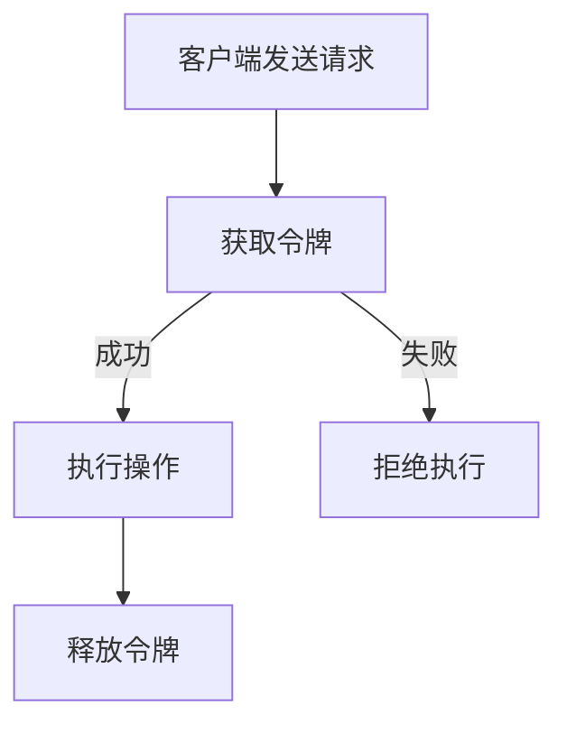

### 3.4 分布式锁与幂等性

分布式锁用于在分布式系统中确保操作的独占性。通过分布式锁，可以防止重复执行操作，从而实现幂等性。

**实现步骤**：

1. **获取锁**：客户端在执行操作前，尝试获取分布式锁。
2. **执行操作**：如果成功获取锁，则执行操作；否则，拒绝执行。
3. **释放锁**：操作完成后，释放分布式锁。

**示例**：

假设有一个分布式缓存系统，客户端在更新缓存前，需要获取分布式锁。如果成功获取锁，则更新缓存；否则，拒绝更新。

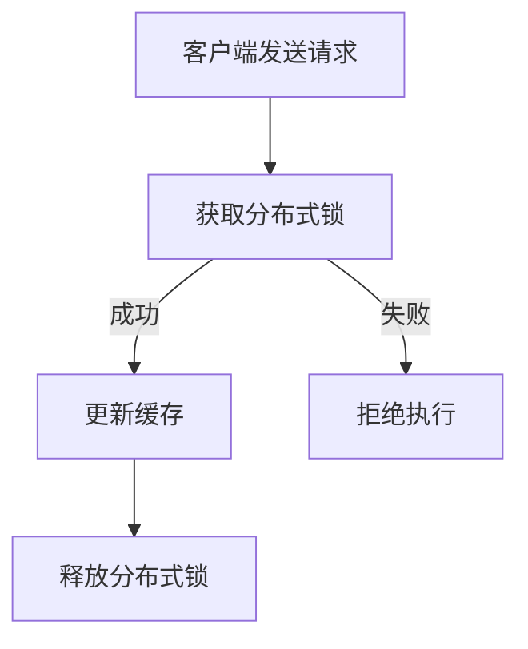

### 3.5 事务与幂等性

事务是数据库操作中的重要概念，它确保一组操作要么全部成功，要么全部失败。通过事务，可以实现幂等性，确保数据库操作不会因为网络故障等原因而重复执行。

**实现步骤**：

1. **开始事务**：客户端开始一个事务。
2. **执行操作**：执行数据库操作。
3. **提交事务**：如果所有操作成功，则提交事务；否则，回滚事务。

**示例**：

假设有一个银行转账系统，客户端在执行转账操作前，开始一个事务。如果所有操作成功，则提交事务，否则回滚事务，从而避免重复执行。

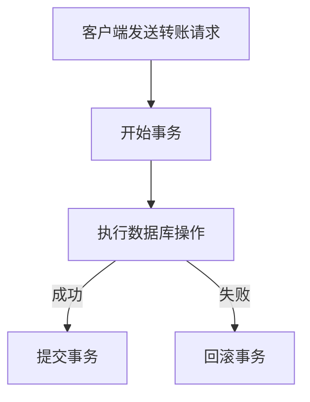

### 3.6 本章小结

本章介绍了实现幂等性的多种技术，包括消息队列、令牌桶、分布式锁和事务。通过这些技术，我们可以确保操作的可重复执行，从而提高系统的可靠性和一致性。下一章将深入探讨幂等性在分布式系统中的应用，进一步分析如何在分布式环境中设计幂等性系统。

## 4. 幂等性设计在分布式系统中的应用

分布式系统是现代计算机系统中的一种重要架构，它通过将系统分解成多个独立运行的节点，从而提高系统的可扩展性和容错性。然而，分布式系统的复杂性也带来了许多挑战，其中之一就是如何确保操作的幂等性。在本章中，我们将深入探讨幂等性设计在分布式系统中的应用，分析分布式服务、数据库、存储、调度和缓存等方面的幂等性挑战与解决方案。

### 4.1 分布式服务中的幂等性

在分布式服务中，幂等性设计至关重要。由于服务可能分布在不同的节点上，网络的不稳定性和节点故障可能导致服务的重复调用。

**挑战与解决方案**：

1. **网络不稳定**：
   - **挑战**：网络波动可能导致请求重复发送。
   - **解决方案**：使用幂等性验证，例如通过请求标识（Request ID）检查请求是否已处理。

2. **节点故障**：
   - **挑战**：节点故障可能导致请求未被处理。
   - **解决方案**：使用分布式锁或状态机确保操作的唯一性。

**实例**：

假设在一个分布式电商系统中，用户下单操作需要确保幂等性。用户在提交订单时，系统会生成一个唯一的订单ID。在处理订单时，系统会检查订单ID是否已存在。如果已存在，则拒绝创建订单。

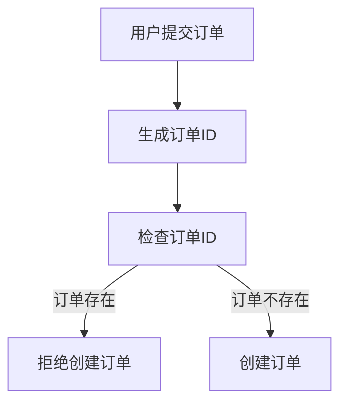

### 4.2 分布式数据库的幂等性

分布式数据库在处理大量数据时，确保操作的幂等性至关重要。分布式数据库中的操作可能因网络延迟或节点故障而重复执行。

**挑战与解决方案**：

1. **数据一致性**：
   - **挑战**：分布式数据库中的操作可能因为网络问题导致数据不一致。
   - **解决方案**：使用分布式事务或两阶段提交（2PC）协议确保操作的一致性。

2. **幂等性验证**：
   - **挑战**：重复执行更新操作可能导致数据不一致。
   - **解决方案**：在执行更新操作前，检查行记录是否已修改，以避免重复更新。

**实例**：

假设在一个分布式数据库系统中，更新用户余额的操作需要确保幂等性。在执行更新操作前，系统会检查用户余额记录的版本号。如果版本号已更新，则拒绝更新，以确保数据的一致性。

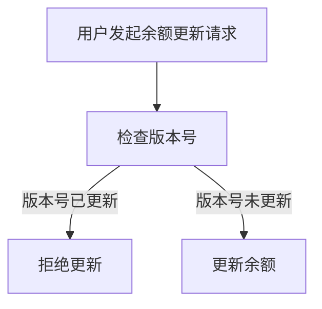

### 4.3 分布式存储的幂等性

分布式存储系统在处理大量数据时，确保操作的幂等性至关重要。分布式存储系统中的操作可能因网络延迟或节点故障而重复执行。

**挑战与解决方案**：

1. **数据一致性**：
   - **挑战**：分布式存储中的操作可能因为网络问题导致数据不一致。
   - **解决方案**：使用分布式锁或Paxos算法确保数据一致性。

2. **幂等性验证**：
   - **挑战**：重复执行写操作可能导致数据不一致。
   - **解决方案**：在执行写操作前，检查文件版本或操作标识，以避免重复写操作。

**实例**：

假设在一个分布式文件存储系统中，上传文件的操作需要确保幂等性。在执行上传操作前，系统会检查文件版本号。如果版本号已更新，则拒绝上传，以确保文件的一致性。

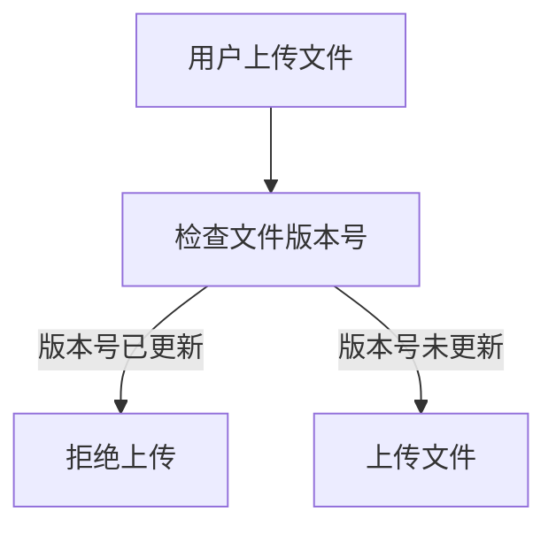

### 4.4 分布式调度与幂等性

在分布式调度系统中，确保操作的幂等性至关重要。分布式调度系统中的操作可能因网络延迟或节点故障而重复执行。

**挑战与解决方案**：

1. **任务重复执行**：
   - **挑战**：任务可能在多个节点上重复执行。
   - **解决方案**：使用幂等性验证，例如通过任务标识（Task ID）检查任务是否已执行。

2. **分布式锁**：
   - **挑战**：分布式锁可能导致调度延迟。
   - **解决方案**：使用乐观锁或Pessimistic锁，在执行任务前检查锁的状态。

**实例**：

假设在一个分布式任务调度系统中，任务执行需要确保幂等性。在执行任务前，系统会生成一个唯一的任务ID，并检查任务是否已执行。如果已执行，则拒绝执行，以确保任务的唯一性。

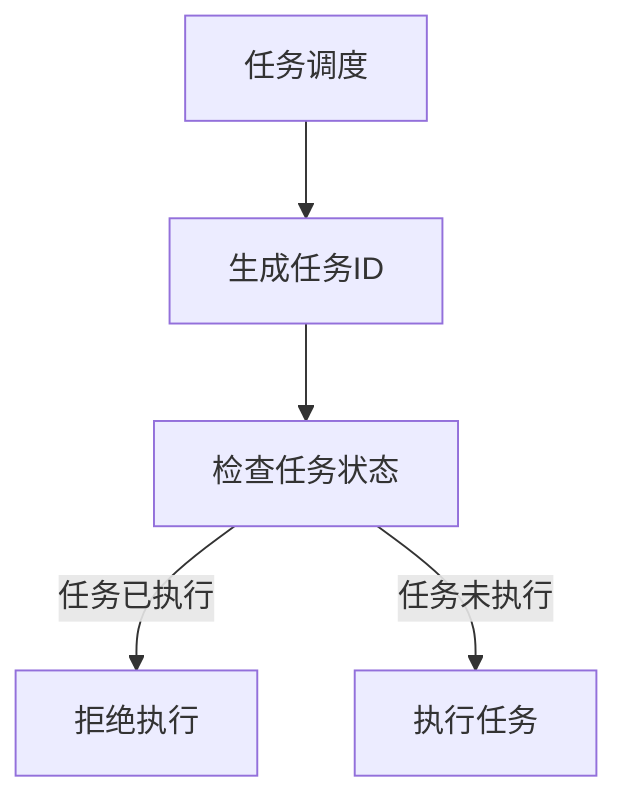

### 4.5 分布式缓存与幂等性

分布式缓存系统在提高系统性能和扩展性方面起着关键作用。在分布式缓存系统中，确保操作的幂等性至关重要，以防止数据不一致。

**挑战与解决方案**：

1. **缓存更新**：
   - **挑战**：缓存更新可能导致数据不一致。
   - **解决方案**：使用缓存版本或操作标识，在更新缓存前检查版本或标识，以避免重复更新。

2. **一致性哈希**：
   - **挑战**：一致性哈希可能导致缓存热点问题。
   - **解决方案**：使用一致性哈希算法，确保数据均匀分布。

**实例**：

假设在一个分布式缓存系统中，更新缓存的操作需要确保幂等性。在执行更新操作前，系统会检查缓存版本号。如果版本号已更新，则拒绝更新，以确保缓存的一致性。

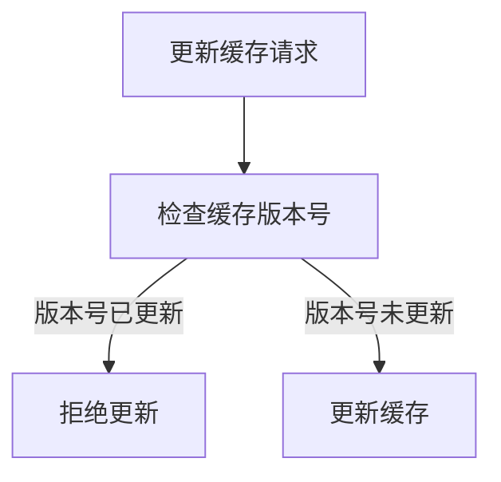

### 4.6 本章小结

本章深入探讨了幂等性设计在分布式系统中的应用，分析了分布式服务、数据库、存储、调度和缓存等方面的挑战与解决方案。通过理解这些应用场景和解决方案，我们可以设计出更加可靠和高效的分布式系统，确保操作的可重复执行，提高系统的性能和一致性。下一章将探讨幂等性在微服务架构中的应用，进一步深入探讨如何在复杂的微服务环境中实现幂等性设计。

## 5. 幂等性设计在微服务架构中的应用

微服务架构是现代分布式系统设计中的一种流行方法，它将系统分解为多个小型、独立的服务模块。每个服务模块都可以独立部署、扩展和更新，从而提高了系统的灵活性、可维护性和容错性。然而，随着服务数量的增加，确保操作的一致性和幂等性变得尤为重要。在本章中，我们将探讨幂等性设计在微服务架构中的应用，分析API设计、服务间通信、分布式事务和事件驱动架构等方面的挑战与解决方案。

### 5.1 微服务架构中的幂等性

在微服务架构中，每个服务都是独立部署的，服务间的交互通过API进行。由于网络的不稳定性和服务故障，服务间的调用可能会出现重复执行的情况。因此，确保API的幂等性是微服务架构中的一项重要任务。

**挑战与解决方案**：

1. **网络波动**：
   - **挑战**：网络不稳定可能导致请求重复发送。
   - **解决方案**：使用幂等性验证，例如通过请求标识（Request ID）检查请求是否已处理。

2. **服务故障**：
   - **挑战**：服务故障可能导致请求未被处理。
   - **解决方案**：使用重试机制和幂等性验证，确保请求不会因为服务故障而重复执行。

**实例**：

假设在微服务架构中，用户注册操作需要确保幂等性。用户在提交注册请求时，系统会生成一个唯一的请求标识（Request ID）。在处理注册请求时，系统会检查请求标识是否已存在。如果已存在，则拒绝注册，以确保用户的唯一性。

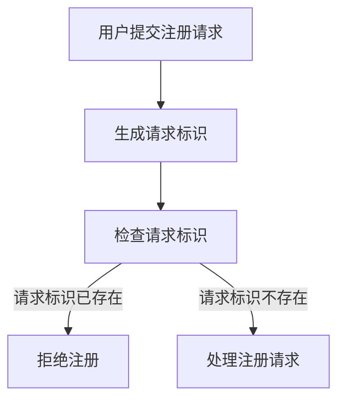

### 5.2 API设计中的幂等性

API设计是微服务架构中的关键部分，合理的API设计可以确保操作的幂等性。在API设计中，应考虑以下几个方面：

1. **参数传递**：
   - 使用唯一的参数传递请求标识，例如使用`request_id`参数。
   - 避免使用易变参数，如时间戳，作为请求标识。

2. **返回结果**：
   - 提供明确的返回结果，例如返回`success`或`error`状态。
   - 返回唯一的标识，以便在后续操作中验证。

3. **幂等性验证**：
   - 在处理请求前，检查请求标识是否已存在。
   - 如果请求标识已存在，拒绝执行操作，以避免重复处理。

**实例**：

假设有一个用户登录API，使用`request_id`作为请求标识。在处理登录请求前，系统会检查`request_id`是否已存在。如果已存在，则拒绝登录，以确保登录操作的幂等性。

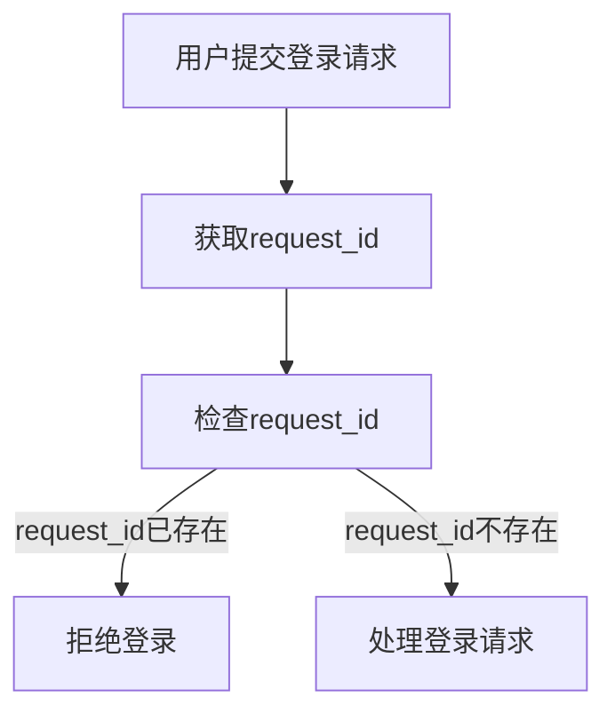

### 5.3 服务间通信与幂等性

在微服务架构中，服务间通信是通过API调用的。由于网络的不稳定性和服务故障，服务间通信可能会出现重复执行的情况。因此，确保服务间通信的幂等性至关重要。

**挑战与解决方案**：

1. **网络不稳定**：
   - **挑战**：网络不稳定可能导致请求重复发送。
   - **解决方案**：使用幂等性验证，例如通过请求标识（Request ID）检查请求是否已处理。

2. **服务故障**：
   - **挑战**：服务故障可能导致请求未被处理。
   - **解决方案**：使用重试机制和幂等性验证，确保请求不会因为服务故障而重复执行。

**实例**：

假设在微服务架构中，服务A调用服务B执行一个操作，需要确保幂等性。服务A在调用服务B时，会生成一个唯一的请求标识（Request ID）。在处理请求时，服务B会检查请求标识是否已存在。如果已存在，则拒绝执行操作，以确保操作的唯一性。

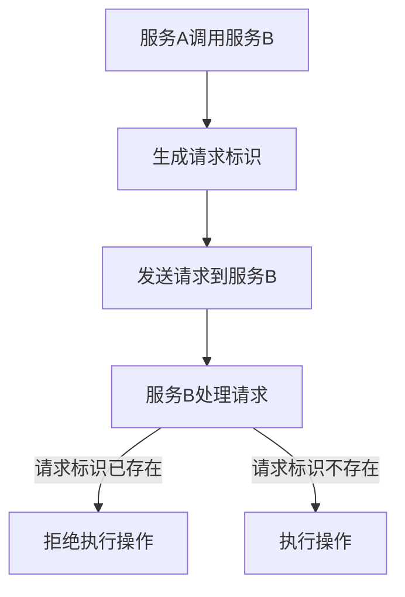

### 5.4 分布式事务与幂等性

分布式事务是微服务架构中的一个重要概念，它确保多个服务间的操作要么全部成功，要么全部失败。在分布式事务中，确保操作的幂等性至关重要，以避免数据不一致。

**挑战与解决方案**：

1. **数据一致性**：
   - **挑战**：分布式事务可能导致数据不一致。
   - **解决方案**：使用分布式事务管理，例如两阶段提交（2PC）或最终一致性协议。

2. **幂等性验证**：
   - **挑战**：分布式事务中的操作可能重复执行。
   - **解决方案**：在每个事务操作前，进行幂等性验证，确保操作的唯一性。

**实例**：

假设在微服务架构中，用户支付订单的操作需要确保幂等性。系统在执行支付操作前，会生成一个唯一的支付标识（Payment ID）。在处理支付请求时，系统会检查支付标识是否已存在。如果已存在，则拒绝支付，以确保支付操作的唯一性。

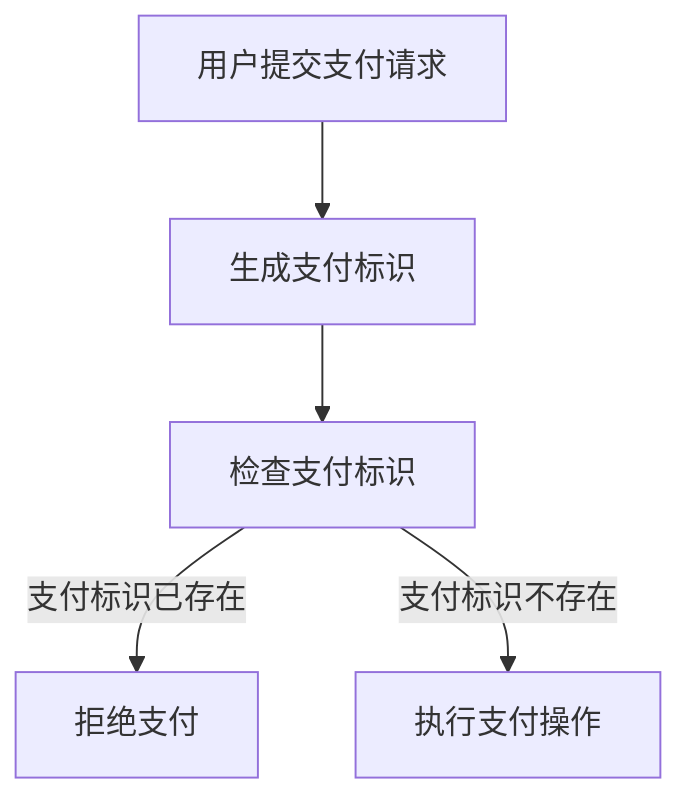

### 5.5 事件驱动架构与幂等性

事件驱动架构是微服务架构中的一种流行方法，它通过事件触发操作，从而实现服务的解耦。在事件驱动架构中，确保操作的幂等性至关重要，以避免重复处理事件。

**挑战与解决方案**：

1. **事件重复处理**：
   - **挑战**：事件可能在多个服务中重复处理。
   - **解决方案**：使用幂等性验证，例如通过事件标识（Event ID）检查事件是否已处理。

2. **事件传递延迟**：
   - **挑战**：事件传递延迟可能导致重复处理。
   - **解决方案**：使用去重机制，例如在事件发送前生成唯一标识。

**实例**：

假设在事件驱动架构中，订单创建事件需要确保幂等性。事件发布者在发送订单创建事件时，会生成一个唯一的事件标识（Event ID）。在处理订单创建事件时，系统会检查事件标识是否已存在。如果已存在，则拒绝处理事件，以确保事件的唯一性。

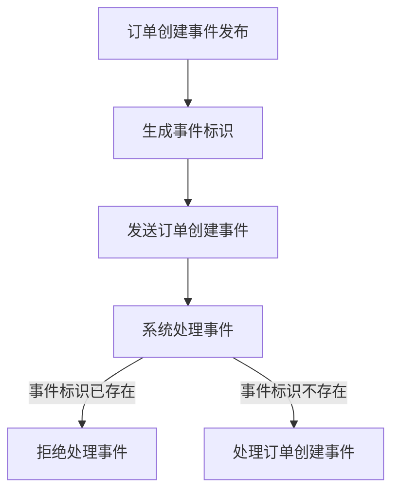

### 5.6 本章小结

本章深入探讨了幂等性设计在微服务架构中的应用，分析了API设计、服务间通信、分布式事务和事件驱动架构等方面的挑战与解决方案。通过理解这些应用场景和解决方案，我们可以设计出更加可靠和高效的微服务架构，确保操作的可重复执行，提高系统的性能和一致性。下一章将探讨幂等性设计与系统容错性的关系，进一步分析如何在复杂的分布式系统中提高系统的容错性。

## 6. 幂等性设计与系统容错性

在分布式系统中，容错性是一个至关重要的特性，它确保系统能够在面临故障时保持稳定运行。幂等性设计在提升系统容错性方面起着关键作用，因为它可以避免因重复操作导致的不一致性和错误。在本章中，我们将探讨幂等性设计与系统容错性的关系，分析如何通过幂等性设计提高系统的容错性，以及幂等性设计在故障恢复和分布式一致性中的作用。

### 6.1 系统容错性概述

系统容错性是指系统在面对各种故障（如硬件故障、软件故障、网络故障等）时，能够保持正常运行的能力。一个高容错性的系统可以在故障发生时自动恢复，从而确保系统的可用性和数据的一致性。

**重要性**：
- **提高可用性**：通过容错性设计，系统能够在故障发生时保持可用，从而减少系统停机时间。
- **保证数据一致性**：在分布式系统中，数据一致性是一个重要挑战。容错性设计可以确保即使在面临故障时，系统也能保持数据的一致性。

### 6.2 幂等性与容错性

幂等性设计在提高系统容错性方面具有显著作用。通过确保操作的可重复执行，幂等性设计可以避免因重复操作导致的不一致性和错误。

**关系**：
- **避免重复执行**：幂等性设计确保操作在多次执行后产生的结果与单次执行相同，从而避免重复操作带来的副作用。
- **提高恢复能力**：在故障发生时，系统可以重试已失败的幂等操作，而不需要担心操作重复执行导致的不一致。

**实例**：

假设在一个分布式电商系统中，用户提交订单的操作是幂等的。当系统面临网络故障时，用户可以重新提交订单。由于订单操作是幂等的，系统可以检测到重复的订单请求，并只执行一次订单操作，从而确保订单数据的一致性。

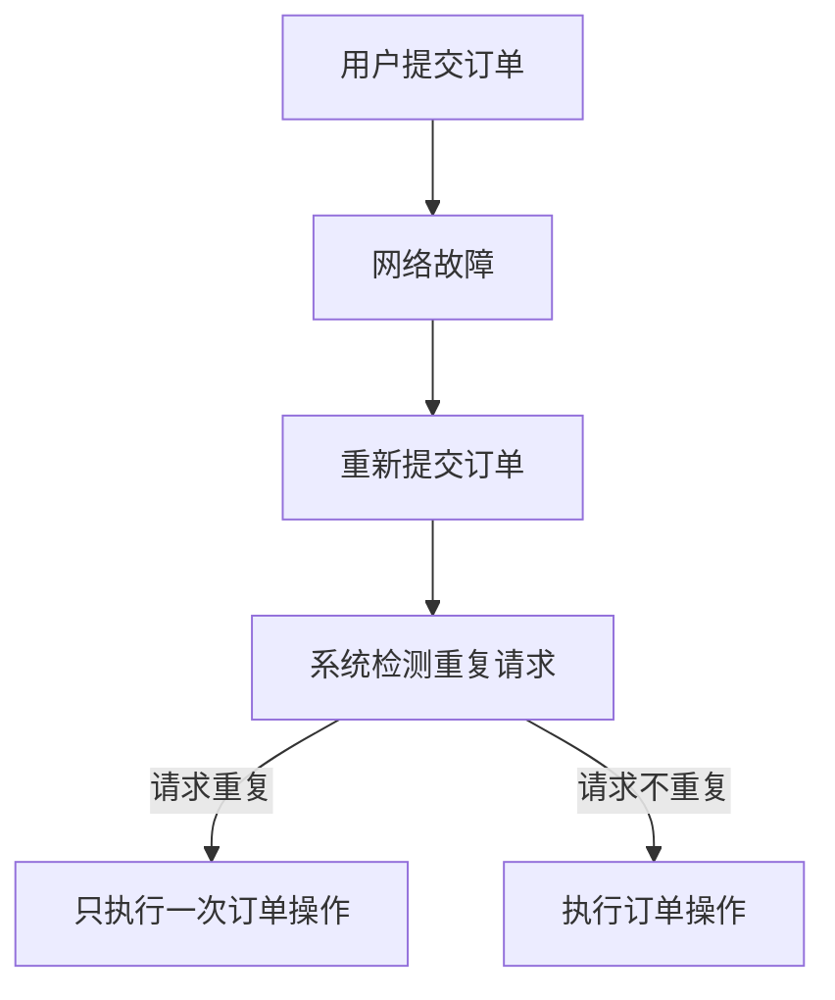

### 6.3 幂等性与故障恢复

幂等性设计在故障恢复中起着关键作用。通过幂等操作，系统可以重试失败的请求，而不担心重复执行导致的数据不一致。

**实现方法**：

1. **重试机制**：在操作失败时，系统可以自动重试操作，直到成功。
2. **幂等性验证**：在重试前，系统应验证操作是否已执行过，以避免重复执行。

**实例**：

假设在一个分布式数据库系统中，更新数据的操作是幂等的。当系统面临网络故障时，客户端可以重试更新操作。在重试前，系统会检查数据版本号，确保更新操作不会被重复执行。

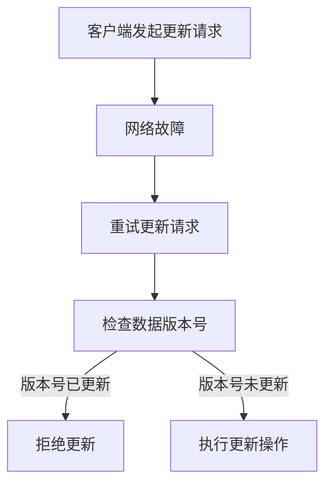

### 6.4 幂等性与分布式一致性

在分布式系统中，一致性是一个重要挑战。幂等性设计有助于实现分布式一致性，因为它可以减少因重复操作导致的数据不一致。

**关系**：
- **幂等性减少冲突**：通过幂等操作，系统可以减少因多次执行相同操作导致的冲突。
- **一致性协议**：幂等性设计可以与分布式一致性协议（如两阶段提交、最终一致性等）结合使用，提高系统的整体一致性。

**实例**：

假设在一个分布式存储系统中，文件上传操作是幂等的。当系统面临网络故障时，客户端可以重试上传操作。由于上传操作是幂等的，系统可以检测到重复的文件上传请求，并只存储一次文件数据，从而确保文件数据的一致性。

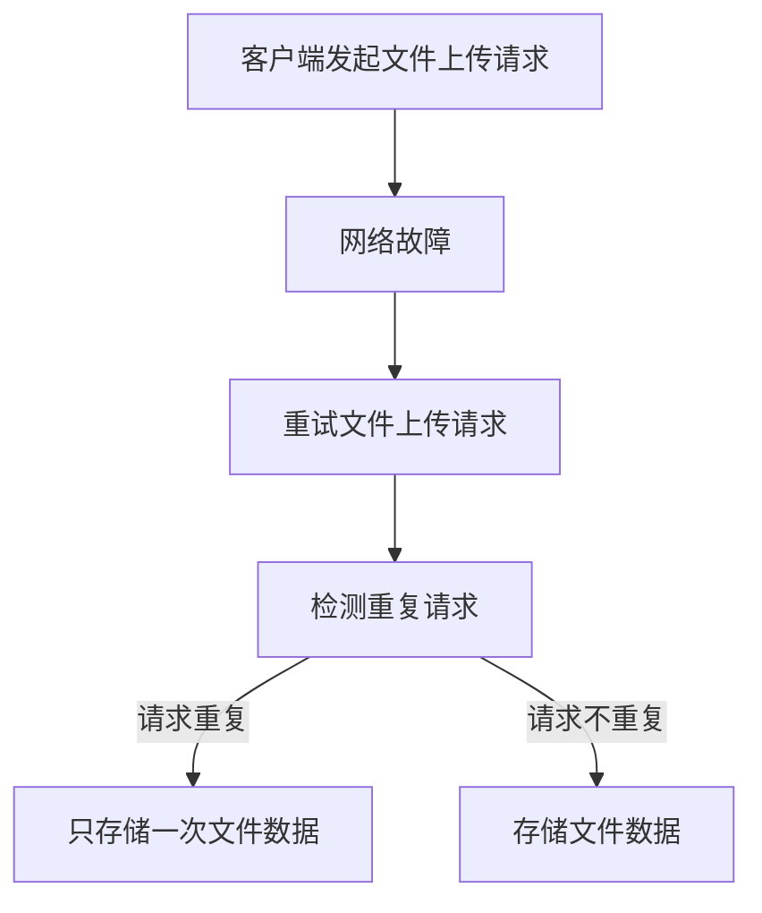

### 6.5 本章小结

本章探讨了幂等性设计与系统容错性的关系，分析了如何通过幂等性设计提高系统的容错性，以及幂等性设计在故障恢复和分布式一致性中的作用。通过理解这些概念和实现方法，我们可以设计出更加可靠和高效的分布式系统，确保在面临故障时系统能够保持稳定运行。

## 7. 最佳实践与总结

### 7.1 最佳实践

在设计分布式系统时，确保操作的幂等性是一项重要的最佳实践。以下是一些关键的最佳实践：

1. **唯一标识**：为每个操作生成唯一的标识符，如操作ID或请求ID，以便在操作失败时能够重试。
2. **去重机制**：在系统设计中实现去重机制，避免重复执行相同的操作。
3. **幂等性验证**：在执行操作前，验证操作是否已经执行过，以避免重复执行。
4. **状态保持**：在操作失败时，保持系统状态，以便在重试时能够从上一次的状态继续执行。
5. **分布式锁**：在关键操作中使用分布式锁，确保操作的独占性，从而避免重复执行。

### 7.2 小结

本文深入探讨了幂等性设计的概念、原理及其在系统设计中的应用。通过对幂等性设计的重要性、基础、实现和应用场景的详细分析，我们了解到：

- 幂等性设计在分布式系统中至关重要，它有助于确保操作的可重复执行，提高系统的可靠性、一致性和容错性。
- 幂等性设计可以通过多种技术实现，包括消息队列、令牌桶、分布式锁和事务等。
- 在分布式服务、数据库、存储、调度和缓存等方面，幂等性设计有助于解决操作重复执行和数据不一致的问题。

### 7.3 注意事项

在设计幂等性系统时，需要注意以下几点：

1. **性能影响**：复杂的幂等性验证可能会影响系统性能，因此在设计时需要进行权衡。
2. **系统扩展性**：系统设计应支持未来的扩展性，以便在系统规模扩大时，幂等性设计仍能有效运行。
3. **一致性保证**：虽然幂等性设计有助于一致性保证，但不应完全依赖幂等性，还需要结合其他一致性协议（如分布式事务）。

### 7.4 拓展阅读

对于希望深入了解幂等性设计的读者，以下是一些推荐的拓展阅读资源：

1. 《Designing Data-Intensive Applications》- Martin Kleppmann
   - 这本书详细讨论了分布式系统的设计原则，包括幂等性设计。
2. 《Distributed Systems: Principles and Models》- George Coulouris, Jean Dollimore, Tim Kindberg, and Gordon Blair
   - 这本书提供了分布式系统的全面概述，包括幂等性设计和一致性模型。
3. 《The Art of Multiprogramming Volume 1》- Maurice Herlihy and Nir Shavit
   - 这本书讨论了并发编程和分布式系统的基本原理，包括幂等性设计的深入探讨。

通过阅读这些资源，读者可以进一步加深对幂等性设计的理解和应用能力。

