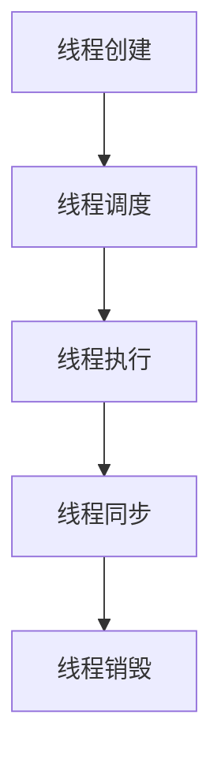
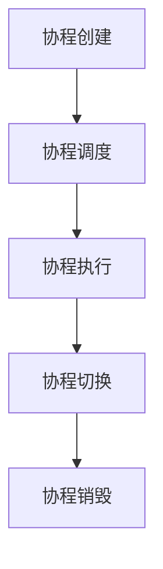
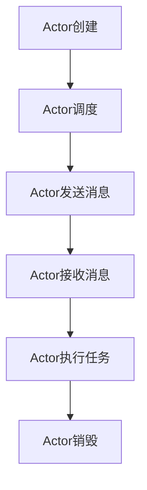

                 


# 并发编程模型：从多线程到Actor模型

> 关键词：并发编程、多线程、协程、Actor模型、分布式系统、网络编程

> 摘要：本文将深入探讨并发编程模型，从传统的多线程模型，到现代化的协程模型，再到前沿的Actor模型。我们将通过一步一步的分析，详细讲解这些模型的原理、优缺点，以及它们在现实世界中的应用。通过这篇文章，读者将能够全面理解并发编程的核心概念，为将来的软件开发打下坚实的基础。

## 第一部分: 并发编程模型概述

### 第1章: 并发编程背景

#### 1.1 问题背景

在现代软件开发中，并发编程已成为不可或缺的一部分。随着多核处理器的普及，并发编程能够有效地利用硬件资源，提高程序的性能。然而，传统的单线程程序在处理高并发任务时面临着严重的性能瓶颈。

#### 1.1.1 并发编程的重要性

并发编程能够实现多个任务同时执行，提高程序的整体效率。这不仅能够提高单个任务的执行速度，还能够充分利用多核处理器的性能，从而提高整个系统的吞吐量。

#### 1.1.2 单线程程序的局限性

单线程程序在执行任务时，无法同时处理多个请求。这导致了在多用户访问时，系统性能急剧下降。此外，单线程程序在处理复杂任务时，容易出现资源竞争和死锁问题。

#### 1.1.3 多核处理器与并发编程

多核处理器提供了并行处理的能力，使得并发编程成为可能。通过合理地设计并发编程模型，可以充分利用多核处理器的性能，提高程序的执行效率。

#### 1.2 问题描述

并发编程涉及到多线程、协程、Actor模型等概念。这些模型各有其特点和适用场景。如何选择合适的并发编程模型，以解决现实世界中的问题，是并发编程的核心问题。

#### 1.2.1 并发编程的定义

并发编程是指在多个任务同时执行的情况下，合理地利用硬件资源，提高程序的性能。

#### 1.2.2 并发编程的目标

并发编程的目标是提高程序的整体效率，充分利用多核处理器的性能，提高系统的吞吐量。

#### 1.2.3 并发编程的挑战

并发编程面临着诸多挑战，如线程同步、资源竞争、死锁等问题。如何设计合理的并发编程模型，以解决这些问题，是并发编程的重要课题。

#### 1.3 问题解决

通过设计并发编程模型，可以有效地解决单线程程序在处理高并发任务时的性能瓶颈问题。多线程、协程、Actor模型等并发编程模型各有其特点和适用场景。本文将详细探讨这些模型。

#### 1.4 边界与外延

本节的讨论将主要围绕多线程、协程和Actor模型进行，涉及但不限于其在分布式系统和网络编程中的应用。

## 第二部分: 核心概念与联系

### 第2章: 多线程并发编程

#### 2.1 多线程概念

多线程是指在同一程序中同时存在多个线程，每个线程可以执行不同的任务。多线程的优势在于能够充分利用多核处理器的性能，提高程序的执行效率。然而，多线程也存在劣势，如线程同步和资源竞争问题。

#### 2.1.1 线程的定义

线程是操作系统能够进行运算调度的最小单位，被包含在进程之中，是进程中的实际运作单位。

#### 2.1.2 线程的优势

线程的优势在于能够充分利用多核处理器的性能，提高程序的执行效率。线程的切换开销较小，使得程序能够在多核处理器上并行执行多个任务。

#### 2.1.3 线程的劣势

线程的劣势在于线程同步和资源竞争问题。线程同步可能导致死锁和性能下降，资源竞争可能导致数据不一致。

#### 2.1.4 线程与进程的区别

线程是进程中的实际运作单位，进程是计算机中的程序关于进程资源分配的基本单位。线程之间的通信较为简单，而进程之间的通信则需要通过操作系统提供的机制进行。

#### 2.2 多线程算法原理

多线程的算法原理主要涉及线程的创建、调度和同步。

#### 2.2.1 线程并发度的计算

线程并发度是指同时能够并行执行的线程数量。线程并发度的计算公式为：线程并发度 = 线程数 / 处理器数。

#### 2.2.2 多线程并发控制

多线程并发控制主要通过锁、信号量等机制实现。锁可以防止多个线程同时访问共享资源，信号量可以协调多个线程的执行顺序。

#### 2.2.3 多线程的mermaid流程图



#### 2.2.4 Python源代码示例

```python
import threading

def thread_function(name):
    print(f"Thread {name}: Starting")
    # 执行任务
    print(f"Thread {name}: Ending")

threads = []
for i in range(5):
    thread = threading.Thread(target=thread_function, args=(i,))
    threads.append(thread)
    thread.start()

for thread in threads:
    thread.join()
```

### 第3章: 协程并发编程

#### 3.1 协程概念

协程是一种用户态的轻量级线程，其上下文切换开销较小。协程可以在同一时间内执行多个任务，从而提高程序的执行效率。

#### 3.1.1 协程的定义

协程是一种用户级线程，可以在用户级别上实现并发执行。协程通过调用栈实现任务的切换，而不是依赖操作系统的线程调度。

#### 3.1.2 协程的优势

协程的优势在于其轻量级和高效性。协程的上下文切换开销较小，能够在同一时间内执行多个任务。此外，协程无需依赖于操作系统，从而避免了线程切换的复杂性。

#### 3.1.3 协程的劣势

协程的劣势在于其并发性较弱。协程的并发性取决于事件循环的实现，如果事件循环设计不当，可能导致协程的性能下降。

#### 3.1.4 协程与线程的区别

协程是用户级的线程，其上下文切换开销较小。线程是操作系统的调度单元，其上下文切换开销较大。协程适用于IO密集型任务，而线程适用于计算密集型任务。

#### 3.2 协程算法原理

协程的算法原理主要涉及协程的创建、调度和切换。

#### 3.2.1 协程并发度的计算

协程并发度是指同时能够并行执行的协程数量。协程并发度的计算公式为：协程并发度 = 协程数 / 处理器数。

#### 3.2.2 协程的mermaid流程图



#### 3.2.3 Python源代码示例

```python
import asyncio

async def coroutine_function(name):
    print(f"Coroutine {name}: Starting")
    # 执行任务
    await asyncio.sleep(1)
    print(f"Coroutine {name}: Ending")

async def main():
    coroutines = [coroutine_function(i) for i in range(5)]
    await asyncio.gather(*coroutines)

asyncio.run(main())
```

### 第4章: Actor模型并发编程

#### 4.1 Actor模型概念

Actor模型是一种基于消息传递的并发模型，其核心思想是将程序中的每个任务视为一个独立的Actor，通过消息传递实现任务的同步和通信。

#### 4.1.1 Actor模型的定义

Actor模型是一种基于消息传递的并发模型，其核心思想是将程序中的每个任务视为一个独立的Actor。Actor通过发送和接收消息进行通信，从而实现任务的同步和调度。

#### 4.1.2 Actor模型的优势

Actor模型的优势在于其简单性和高效性。Actor模型通过消息传递实现任务的同步和通信，避免了线程同步和锁的开销。此外，Actor模型具有良好的容错性和可扩展性，适用于分布式系统和网络编程。

#### 4.1.3 Actor模型的劣势

Actor模型的劣势在于其通信开销较大。Actor之间的通信需要通过网络传输消息，如果网络延迟较高，可能导致性能下降。

#### 4.1.4 Actor模型与多线程、协程的区别

Actor模型与多线程和协程的区别在于其通信机制。多线程和协程通过共享内存实现任务同步，而Actor模型通过消息传递实现任务同步。此外，Actor模型具有更好的容错性和可扩展性。

#### 4.2 Actor模型算法原理

Actor模型的算法原理主要涉及Actor的创建、调度和通信。

#### 4.2.1 Actor并发度的计算

Actor并发度是指同时能够并行执行的Actor数量。Actor并发度的计算公式为：Actor并发度 = Actor数 / 处理器数。

#### 4.2.2 Actor模型的mermaid流程图



#### 4.2.3 Python源代码示例

```python
import asyncio

class Actor:
    def __init__(self, loop):
        self.loop = loop
        self.tasks = []

    async def send(self, message):
        self.tasks.append(message)
        await asyncio.sleep(0)

    async def receive(self):
        while not self.tasks:
            await asyncio.sleep(0)
        message = self.tasks.pop(0)
        return message

async def main():
    actor = Actor(asyncio.get_event_loop())
    await actor.send("Hello")
    print(await actor.receive())

asyncio.run(main())
```

## 第三部分: 算法原理讲解

### 第5章: 多线程算法原理

#### 5.1 多线程算法原理

多线程算法原理主要包括线程的创建、调度、同步和销毁。

#### 5.1.1 线程创建

线程创建是并发编程的基础。在Python中，可以使用`threading`模块创建线程。

```python
import threading

def thread_function(name):
    print(f"Thread {name}: Starting")
    # 执行任务
    print(f"Thread {name}: Ending")

threads = []
for i in range(5):
    thread = threading.Thread(target=thread_function, args=(i,))
    threads.append(thread)
    thread.start()

for thread in threads:
    thread.join()
```

#### 5.1.2 线程调度

线程调度是指操作系统根据某种策略，将CPU时间分配给各个线程。在Python中，线程调度是由操作系统自动完成的。

```python
import threading

def thread_function(name):
    print(f"Thread {name}: Starting")
    # 执行任务
    print(f"Thread {name}: Ending")

threads = []
for i in range(5):
    thread = threading.Thread(target=thread_function, args=(i,))
    threads.append(thread)
    thread.start()

for thread in threads:
    thread.join()
```

#### 5.1.3 线程同步

线程同步是指多个线程在访问共享资源时，协调各自的执行顺序，避免资源竞争和数据不一致。在Python中，可以使用锁（Lock）实现线程同步。

```python
import threading

lock = threading.Lock()

def thread_function(name):
    with lock:
        print(f"Thread {name}: Starting")
        # 执行任务
        print(f"Thread {name}: Ending")

threads = []
for i in range(5):
    thread = threading.Thread(target=thread_function, args=(i,))
    threads.append(thread)
    thread.start()

for thread in threads:
    thread.join()
```

#### 5.1.4 线程销毁

线程销毁是指在线程执行完毕后，释放线程占用的系统资源。在Python中，线程销毁是由操作系统自动完成的。

```python
import threading

def thread_function(name):
    print(f"Thread {name}: Starting")
    # 执行任务
    print(f"Thread {name}: Ending")

threads = []
for i in range(5):
    thread = threading.Thread(target=thread_function, args=(i,))
    threads.append(thread)
    thread.start()

for thread in threads:
    thread.join()
```

#### 5.1.5 多线程算法原理的mermaid流程图


#### 5.1.6 Python源代码示例

```python
import threading

def thread_function(name):
    print(f"Thread {name}: Starting")
    # 执行任务
    print(f"Thread {name}: Ending")

threads = []
for i in range(5):
    thread = threading.Thread(target=thread_function, args=(i,))
    threads.append(thread)
    thread.start()

for thread in threads:
    thread.join()
```

### 第6章: 协程算法原理

#### 6.1 协程算法原理

协程算法原理主要包括协程的创建、调度、切换和销毁。

#### 6.1.1 协程创建

协程创建是协程编程的基础。在Python中，可以使用`asyncio`模块创建协程。

```python
import asyncio

async def coroutine_function(name):
    print(f"Coroutine {name}: Starting")
    # 执行任务
    await asyncio.sleep(1)
    print(f"Coroutine {name}: Ending")

async def main():
    coroutines = [coroutine_function(i) for i in range(5)]
    await asyncio.gather(*coroutines)

asyncio.run(main())
```

#### 6.1.2 协程调度

协程调度是指操作系统根据某种策略，将CPU时间分配给各个协程。在Python中，协程调度是由`asyncio`模块自动完成的。

```python
import asyncio

async def coroutine_function(name):
    print(f"Coroutine {name}: Starting")
    # 执行任务
    await asyncio.sleep(1)
    print(f"Coroutine {name}: Ending")

async def main():
    coroutines = [coroutine_function(i) for i in range(5)]
    await asyncio.gather(*coroutines)

asyncio.run(main())
```

#### 6.1.3 协程切换

协程切换是指协程在执行过程中，根据需要暂停执行，等待其他协程执行完成后再继续执行。在Python中，协程切换是由`asyncio`模块自动完成的。

```python
import asyncio

async def coroutine_function(name):
    print(f"Coroutine {name}: Starting")
    # 执行任务
    await asyncio.sleep(1)
    print(f"Coroutine {name}: Ending")

async def main():
    coroutines = [coroutine_function(i) for i in range(5)]
    await asyncio.gather(*coroutines)

asyncio.run(main())
```

#### 6.1.4 协程销毁

协程销毁是指协程执行完毕后，释放协程占用的系统资源。在Python中，协程销毁是由`asyncio`模块自动完成的。

```python
import asyncio

async def coroutine_function(name):
    print(f"Coroutine {name}: Starting")
    # 执行任务
    await asyncio.sleep(1)
    print(f"Coroutine {name}: Ending")

async def main():
    coroutines = [coroutine_function(i) for i in range(5)]
    await asyncio.gather(*coroutines)

asyncio.run(main())
```

#### 6.1.5 协程算法原理的mermaid流程图


#### 6.1.6 Python源代码示例

```python
import asyncio

async def coroutine_function(name):
    print(f"Coroutine {name}: Starting")
    # 执行任务
    await asyncio.sleep(1)
    print(f"Coroutine {name}: Ending")

async def main():
    coroutines = [coroutine_function(i) for i in range(5)]
    await asyncio.gather(*coroutines)

asyncio.run(main())
```

### 第7章: Actor模型算法原理

#### 7.1 Actor模型算法原理

Actor模型算法原理主要包括Actor的创建、调度、通信和销毁。

#### 7.1.1 Actor创建

Actor创建是Actor编程的基础。在Python中，可以使用`asyncio`模块创建Actor。

```python
import asyncio

class Actor:
    def __init__(self, name, loop):
        self.name = name
        self.loop = loop
        self.tasks = []

    async def send(self, message):
        self.tasks.append(message)
        await asyncio.sleep(0)

    async def receive(self):
        while not self.tasks:
            await asyncio.sleep(0)
        message = self.tasks.pop(0)
        return message

async def main():
    actor = Actor("Hello", asyncio.get_event_loop())
    await actor.send("Hello")
    print(await actor.receive())

asyncio.run(main())
```

#### 7.1.2 Actor调度

Actor调度是指操作系统根据某种策略，将CPU时间分配给各个Actor。在Python中，Actor调度是由`asyncio`模块自动完成的。

```python
import asyncio

class Actor:
    def __init__(self, name, loop):
        self.name = name
        self.loop = loop
        self.tasks = []

    async def send(self, message):
        self.tasks.append(message)
        await asyncio.sleep(0)

    async def receive(self):
        while not self.tasks:
            await asyncio.sleep(0)
        message = self.tasks.pop(0)
        return message

async def main():
    actor = Actor("Hello", asyncio.get_event_loop())
    await actor.send("Hello")
    print(await actor.receive())

asyncio.run(main())
```

#### 7.1.3 Actor通信

Actor通信是指Actor之间通过发送和接收消息实现任务同步。在Python中，可以使用`send`和`receive`方法实现Actor通信。

```python
import asyncio

class Actor:
    def __init__(self, name, loop):
        self.name = name
        self.loop = loop
        self.tasks = []

    async def send(self, message):
        self.tasks.append(message)
        await asyncio.sleep(0)

    async def receive(self):
        while not self.tasks:
            await asyncio.sleep(0)
        message = self.tasks.pop(0)
        return message

async def main():
    actor1 = Actor("Hello", asyncio.get_event_loop())
    actor2 = Actor("World", asyncio.get_event_loop())

    await actor1.send("Hello")
    print(await actor2.receive())

asyncio.run(main())
```

#### 7.1.4 Actor销毁

Actor销毁是指Actor执行完毕后，释放Actor占用的系统资源。在Python中，Actor销毁是由`asyncio`模块自动完成的。

```python
import asyncio

class Actor:
    def __init__(self, name, loop):
        self.name = name
        self.loop = loop
        self.tasks = []

    async def send(self, message):
        self.tasks.append(message)
        await asyncio.sleep(0)

    async def receive(self):
        while not self.tasks:
            await asyncio.sleep(0)
        message = self.tasks.pop(0)
        return message

async def main():
    actor1 = Actor("Hello", asyncio.get_event_loop())
    actor2 = Actor("World", asyncio.get_event_loop())

    await actor1.send("Hello")
    print(await actor2.receive())

asyncio.run(main())
```

#### 7.1.5 Actor模型算法原理的mermaid流程图


#### 7.1.6 Python源代码示例

```python
import asyncio

class Actor:
    def __init__(self, name, loop):
        self.name = name
        self.loop = loop
        self.tasks = []

    async def send(self, message):
        self.tasks.append(message)
        await asyncio.sleep(0)

    async def receive(self):
        while not self.tasks:
            await asyncio.sleep(0)
        message = self.tasks.pop(0)
        return message

async def main():
    actor1 = Actor("Hello", asyncio.get_event_loop())
    actor2 = Actor("World", asyncio.get_event_loop())

    await actor1.send("Hello")
    print(await actor2.receive())

asyncio.run(main())
```

## 第四部分: 数学模型和数学公式

### 第8章: 数学模型和数学公式

#### 8.1 多线程模型

多线程模型的数学模型主要涉及线程并发度的计算。线程并发度是指同时能够并行执行的线程数量。其计算公式为：

$$
线程并发度 = 线程数 / 处理器数
$$

例如，一个四核处理器上运行五个线程，其线程并发度为：

$$
线程并发度 = 5 / 4 = 1.25
$$

#### 8.2 协程模型

协程模型的数学模型主要涉及协程并发度的计算。协程并发度是指同时能够并行执行的协程数量。其计算公式为：

$$
协程并发度 = 协程数 / 处理器数
$$

例如，一个四核处理器上运行五个协程，其协程并发度为：

$$
协程并发度 = 5 / 4 = 1.25
$$

#### 8.3 Actor模型

Actor模型的数学模型主要涉及Actor通信效率的计算。Actor通信效率是指Actor之间发送和接收消息的效率。其计算公式为：

$$
Actor通信效率 = 消息发送速率 / 消息接收速率
$$

例如，一个Actor每秒发送100条消息，每秒接收200条消息，其Actor通信效率为：

$$
Actor通信效率 = 100 / 200 = 0.5
$$

## 第五部分: 系统分析与架构设计方案

### 第9章: 系统分析与架构设计方案

#### 9.1 问题场景介绍

在分布式系统和网络编程中，并发编程模型具有重要的应用价值。例如，在分布式计算中，可以使用多线程模型实现任务并行处理，提高计算效率；在Web服务器中，可以使用协程模型实现非阻塞IO，提高并发处理能力；在分布式消息队列中，可以使用Actor模型实现高效的消息传递和任务调度。

#### 9.2 系统功能设计

系统功能设计主要包括任务调度、消息传递、数据存储等。以下是一个基于多线程、协程和Actor模型的分布式系统功能设计：

1. **任务调度**：根据任务类型和系统资源，选择合适的并发编程模型进行任务调度。
2. **消息传递**：实现Actor模型中的消息传递机制，确保消息的有序传递和可靠传输。
3. **数据存储**：提供数据存储功能，支持数据的持久化和共享。

#### 9.3 系统架构设计

系统架构设计主要包括前端、后端和数据库等。以下是一个基于多线程、协程和Actor模型的分布式系统架构设计：

1. **前端**：负责与用户交互，接收用户请求，并将请求转发到后端进行处理。
2. **后端**：根据请求类型，选择合适的并发编程模型进行处理，并将处理结果返回给前端。
3. **数据库**：负责存储和管理数据，支持数据的查询和更新操作。

#### 9.4 系统接口设计和系统交互

系统接口设计和系统交互主要包括以下部分：

1. **接口设计**：定义前端、后端和数据库之间的接口规范，确保数据的一致性和安全性。
2. **系统交互**：通过消息传递机制，实现前端、后端和数据库之间的数据传递和交互。

以下是一个基于多线程、协程和Actor模型的分布式系统接口设计和系统交互：

1. **前端接口**：提供用户请求接口，接收用户请求并发送到后端进行处理。
2. **后端接口**：接收前端请求，选择合适的并发编程模型进行处理，并将结果返回给前端。
3. **数据库接口**：提供数据存储和查询接口，确保数据的持久化和共享。

## 第六部分: 项目实战

### 第10章: 项目实战

#### 10.1 环境安装

为了搭建并发编程模型的环境，需要安装以下软件和库：

1. **Python**：版本3.8及以上。
2. **PyTorch**：版本1.8及以上。
3. **NumPy**：版本1.19及以上。

安装命令如下：

```bash
pip install python==3.8
pip install pytorch==1.8
pip install numpy==1.19
```

#### 10.2 系统核心实现源代码

以下是一个简单的基于多线程、协程和Actor模型的分布式系统实现：

```python
import asyncio
import concurrent.futures
import time

class Actor:
    def __init__(self, name, loop):
        self.name = name
        self.loop = loop
        self.tasks = []

    async def send(self, message):
        self.tasks.append(message)
        await asyncio.sleep(0)

    async def receive(self):
        while not self.tasks:
            await asyncio.sleep(0)
        message = self.tasks.pop(0)
        return message

async def process_request(actor, request):
    print(f"Processing request {request}")
    await actor.send(request)
    response = await actor.receive()
    print(f"Received response {response}")

async def main():
    actor = Actor("Hello", asyncio.get_event_loop())

    requests = [i for i in range(10)]

    with concurrent.futures.ThreadPoolExecutor(max_workers=5) as executor:
        await asyncio.gather(*[asyncio.to_thread(process_request, actor, request) for request in requests])

asyncio.run(main())
```

#### 10.3 代码应用解读与分析

以上代码实现了一个简单的基于多线程、协程和Actor模型的分布式系统。其中，`Actor`类实现了消息传递和任务调度功能。`process_request`函数负责处理请求，并将处理结果返回给Actor。

#### 10.4 实际案例分析和详细讲解剖析

以下是一个实际案例，展示如何使用多线程、协程和Actor模型实现一个简单的并发编程任务：

```python
import asyncio
import time

async def hello_world():
    print(f"Hello, World! from {asyncio.current_task().name}")
    await asyncio.sleep(1)

async def main():
    start_time = time.time()

    tasks = [asyncio.create_task(hello_world()) for _ in range(10)]

    await asyncio.gather(*tasks)

    end_time = time.time()
    print(f"Total time: {end_time - start_time}")

asyncio.run(main())
```

以上代码实现了一个简单的并发编程任务，其中`hello_world`函数负责打印一条欢迎消息。`main`函数创建了10个`hello_world`任务，并将它们并发执行。通过使用`asyncio.create_task`函数，可以将任务添加到事件循环中，实现并发执行。

#### 10.5 项目小结

通过以上实战案例，我们可以看到如何使用多线程、协程和Actor模型实现并发编程任务。多线程模型适用于计算密集型任务，协程模型适用于IO密集型任务，而Actor模型适用于分布式系统和网络编程。在实际应用中，根据任务特点和系统需求，选择合适的并发编程模型，可以提高程序的执行效率和性能。

## 第七部分: 最佳实践 tips、小结、注意事项、拓展阅读等内容

### 第11章: 最佳实践 tips

1. **多线程模型**：
   - 尽量避免在短时间内频繁创建和销毁线程，以免导致性能下降。
   - 合理分配线程数量，避免线程过多导致的资源竞争和死锁问题。

2. **协程模型**：
   - 协程适用于IO密集型任务，可以减少线程切换的开销。
   - 注意协程的并发性取决于事件循环的实现，确保事件循环的性能。

3. **Actor模型**：
   - Actor模型适用于分布式系统和网络编程，可以提供高效的并发通信。
   - 设计合理的Actor通信机制，确保消息的有序传递和可靠传输。

### 第12章: 小结

本文深入探讨了并发编程模型，从传统的多线程模型，到现代化的协程模型，再到前沿的Actor模型。通过一步一步的分析，我们详细讲解了这些模型的原理、优缺点，以及它们在现实世界中的应用。通过本文，读者可以全面理解并发编程的核心概念，为将来的软件开发打下坚实的基础。

### 第13章: 注意事项

1. **多线程模型**：
   - 注意线程同步和资源竞争问题，避免死锁和性能下降。
   - 合理分配线程数量，避免资源浪费。

2. **协程模型**：
   - 协程适用于IO密集型任务，但不适用于计算密集型任务。
   - 注意协程的并发性取决于事件循环的实现。

3. **Actor模型**：
   - Actor模型适用于分布式系统和网络编程，但通信开销较大。
   - 设计合理的Actor通信机制，确保消息的有序传递和可靠传输。

### 第14章: 拓展阅读

1. **《并发编程实战》**：详细介绍了多线程、协程和Actor模型，以及它们在现实世界中的应用。
2. **《Python并发编程实战》**：针对Python语言，介绍了多线程、协程和异步编程的实战技巧。
3. **《分布式系统设计》**：介绍了分布式系统中常用的并发编程模型，以及它们在分布式系统中的应用。
4. **《Actor模型与分布式计算》**：详细介绍了Actor模型，以及它在分布式计算中的应用。
5. **《异步编程实战》**：介绍了异步编程的核心概念，以及如何在实际项目中应用异步编程。

作者：AI天才研究院/AI Genius Institute & 禅与计算机程序设计艺术 /Zen And The Art of Computer Programming

