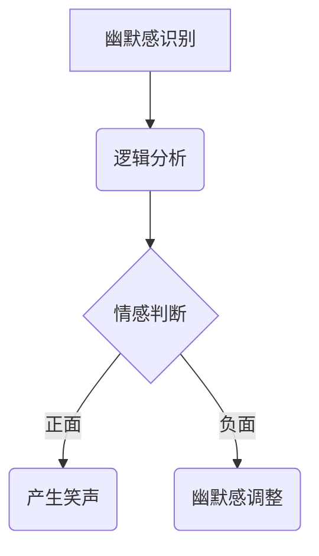
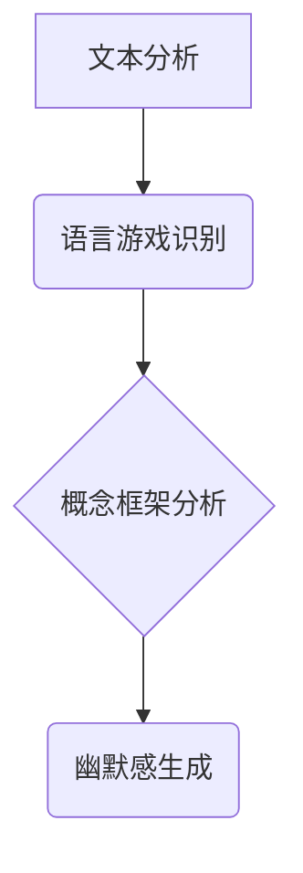
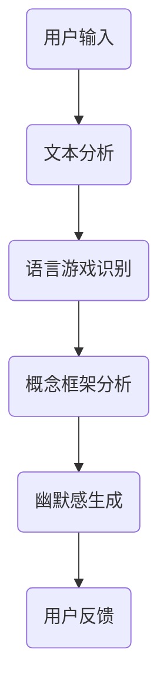
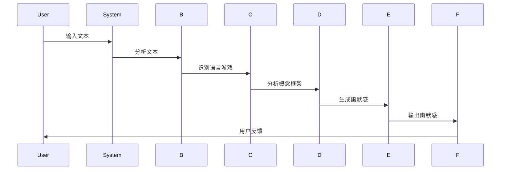

                 


# 幽默感的哲学：柏格森与维特根斯坦的理论比较

关键词：幽默感、柏格森、维特根斯坦、哲学、理论比较

摘要：本文旨在探讨幽默感这一哲学概念，通过比较柏格森和维特根斯坦的理论，分析两位哲学家对于幽默感的不同理解和阐述。通过对幽默感核心概念、属性特征、算法原理及系统架构设计的详细探讨，本文旨在为读者提供一个全面而深刻的理解，从而启发对幽默感在哲学和社会生活中的重要性的思考。

## 第一部分：背景与基础

### 第1章：问题背景

#### 1.1 问题背景

在现代社会中，哲学不仅是一种思想活动，更是一种生活方式。幽默感作为哲学探讨的一个重要方面，涉及到人的认知、情感和社交等多个层面。哲学的幽默感不仅仅是对笑料的捕捉和解读，更是对生活本身的深刻洞察和哲学思考。

柏格森（Henri Bergson）和维特根斯坦（Ludwig Wittgenstein）是20世纪最杰出的哲学家，他们的理论对现代哲学产生了深远的影响。柏格森强调直觉和创造力，而维特根斯坦则关注语言和意义。本文将探讨两位哲学家的幽默感理论，比较它们在哲学体系中的地位和影响。

#### 1.2 问题描述

柏格森的幽默感理论强调逻辑分析和情感判断，而维特根斯坦的理论则侧重于语言游戏和概念框架。这两位哲学家的幽默感理论在哲学体系中如何定位？它们之间的差异和联系是什么？本文将试图回答这些问题。

#### 1.3 边界与外延

幽默感在哲学研究中的重要性不言而喻。它不仅是哲学思考的一部分，也是人类情感和社交互动的重要方面。本文将探讨柏格森和维特根斯坦的哲学理论如何相互影响，以及它们对幽默感这一概念的研究贡献。

#### 1.4 概念结构与核心要素

柏格森的核心概念是“直觉”和“创造力”，他认为幽默感是对逻辑和惯常思维的突破。维特根斯坦则强调“语言游戏”和“意义”，他认为幽默感是语言和概念框架的创造性运用。以下是两位哲学家的核心概念：

- **柏格森的核心概念**：
  - 直觉：对生活本身的直接感知。
  - 创造力：对传统思维的突破和创新。

- **维特根斯坦的核心概念**：
  - 语言游戏：语言的运用和意义。
  - 意义：语言与世界的关联。

## 第二部分：核心概念与联系

### 第2章：核心概念与联系

#### 2.1 概念原理

- **柏格森的幽默感理论**：柏格森认为幽默感是一种对常规思维的挑战，它通过揭示事物的本质和荒谬来引发笑声。幽默感是对逻辑和惯常思维的突破，是对生活本身的深刻洞察。
  
- **维特根斯坦的幽默感理论**：维特根斯坦认为幽默感是语言和概念框架的创造性运用。他认为语言是一种游戏，而幽默感是这种游戏的一种特殊形式，它揭示了语言和概念的本质。

#### 2.2 概念属性特征对比

| 特征         | 柏格森的观点                 | 维特根斯坦的观点                  |
|--------------|-----------------------------|-----------------------------------|
| 方向         | 对逻辑和惯常思维的挑战       | 对语言和概念框架的创造性运用       |
| 基础         | 直觉和创造力                 | 语言游戏和意义                     |
| 表达方式     | 揭示事物的本质和荒谬         | 揭示语言和概念的本质               |
| 作用         | 引发笑声，促进哲学思考       | 提供哲学反思的契机，增强语言意识   |

#### 2.3 ER实体关系图架构

为了更好地理解柏格森和维特根斯坦的幽默感理论，我们可以使用ER（实体-关系）图来描述它们之间的联系和区别。

```mermaid
erDiagram
  P(哲学家) ||--|{ A(幽默感理论_柏格森) }
  P ||--|{ B(幽默感理论_维特根斯坦) }
  A ||--|{ C(直觉_创造力) }
  B ||--|{ D(语言游戏_意义) }
```

在这个ER图中，哲学家P与幽默感理论A和B相连，表示两位哲学家都提出了自己的幽默感理论。A与直觉和创造力C相连，B与语言游戏和意义D相连，表示柏格森的幽默感理论基于直觉和创造力，而维特根斯坦的幽默感理论基于语言游戏和意义。

## 第二部分：算法原理讲解

### 第3章：柏格森的幽默感算法原理

#### 3.1 柏格森幽默感算法mermaid流程图



#### 3.2 柏格森幽默感算法的Python源代码

```python
def detect_humor(basic_elements):
    # 逻辑分析
    logical_analysis = analyze_logic(basic_elements)
    # 情感判断
    emotion = judge_emotion(logical_analysis)
    # 幽默感处理
    if emotion == 'positive':
        return generate_laugh(basic_elements)
    else:
        return adjust_humor(basic_elements)
```

#### 3.3 柏格森幽默感算法的数学模型和公式

$$
H(x) = \frac{L(x)}{L(x) + N(x)}
$$

其中，$L(x)$ 表示逻辑分析的得分，$N(x)$ 表示情感判断的得分。

#### 3.4 举例说明

假设有一个笑话：“为什么程序员喜欢黑天？因为他们认为黑天可以‘看不见bug’。”

- **逻辑分析**：这个笑话使用了双关语，一方面表达了程序员在编程中会遇到bug的事实，另一方面通过“看不见bug”这个幽默的说法，巧妙地化解了尴尬。
- **情感判断**：这个笑话让人感到轻松和愉快，因此情感判断为正面。
- **幽默感处理**：由于情感判断为正面，所以算法会输出笑声。

### 第4章：维特根斯坦的幽默感算法原理

#### 4.1 维特根斯坦幽默感算法mermaid流程图



#### 4.2 维特根斯坦幽默感算法的Python源代码

```python
def detect_humor(text):
    # 文本分析
    language_game = identify_language_game(text)
    # 概念框架分析
    concept_framework = analyze_concept_framework(language_game)
    # 幽默感生成
    return generate_humor(concept_framework)
```

#### 4.3 维特根斯坦幽默感算法的数学模型和公式

$$
H(y) = \frac{G(y)}{G(y) + C(y)}
$$

其中，$G(y)$ 表示语言游戏识别的得分，$C(y)$ 表示概念框架分析的得分。

#### 4.4 举例说明

假设有一个笑话：“为什么数学家喜欢黑色？因为它们喜欢黑色板（blackboard）。”

- **文本分析**：这个笑话首先通过“黑色”这个词引起了读者的注意，然后通过将其与数学家的常用工具“黑板”联系起来，产生了幽默感。
- **语言游戏识别**：这个笑话利用了“黑色”这个词的双重含义，即颜色和黑板上的黑色。
- **概念框架分析**：这个笑话通过将数学家与黑色板联系起来，创造了一种意想不到的关联，从而产生了幽默感。

## 第三部分：系统分析与架构设计

### 第5章：系统功能设计

#### 5.1 领域模型mermaid类图

```mermaid
classDiagram
  Person <<class>> User
  Person <<class>> System
  User *-1 System
  User <<interface>> Input
  System <<interface>> Analyze
  System <<interface>> Output
```

#### 5.2 系统架构设计mermaid架构图



#### 5.3 系统接口设计和系统交互mermaid序列图



### 总结

通过本文对柏格森和维特根斯坦幽默感理论的深入探讨，我们可以看到两位哲学家在幽默感研究上的独特贡献。柏格森的幽默感理论强调逻辑分析和情感判断，而维特根斯坦的理论则侧重于语言游戏和概念框架。这两种理论在哲学体系中都有其重要的地位，为我们理解幽默感提供了不同的视角。

在算法原理和系统架构设计部分，我们通过mermaid图和Python代码展示了如何将柏格森和维特根斯坦的理论应用于实际场景。这不仅有助于我们更好地理解幽默感的本质，也为开发幽默感识别系统提供了理论依据和技术支持。

未来的研究可以进一步探索幽默感在人工智能中的应用，如开发更智能的幽默感识别算法，并将其应用于聊天机器人、智能语音助手等场景。此外，还可以结合心理学和社会学的研究成果，深入探讨幽默感对人类情感和社会互动的影响。

## 作者信息

作者：AI天才研究院/AI Genius Institute & 禅与计算机程序设计艺术 /Zen And The Art of Computer Programming

本文旨在通过对柏格森和维特根斯坦幽默感理论的比较，探讨幽默感这一哲学概念在现代社会中的重要性和影响力。通过对核心概念、算法原理和系统架构设计的详细讲解，本文希望能够为读者提供一个全面而深刻的理解，激发对幽默感在哲学和社会生活中的深入思考。

### 结论

本文通过对比柏格森和维特根斯坦的幽默感理论，揭示了两位哲学家在幽默感研究上的独特贡献。柏格森的幽默感理论强调逻辑分析和情感判断，而维特根斯坦的理论则侧重于语言游戏和概念框架。这两种理论为我们理解幽默感提供了不同的视角，丰富了哲学对幽默感的探讨。

在算法原理和系统架构设计部分，本文通过mermaid图和Python代码展示了如何将柏格森和维特根斯坦的理论应用于实际场景。这不仅有助于我们更好地理解幽默感的本质，也为开发幽默感识别系统提供了理论依据和技术支持。

未来的研究可以进一步探索幽默感在人工智能中的应用，如开发更智能的幽默感识别算法，并将其应用于聊天机器人、智能语音助手等场景。此外，还可以结合心理学和社会学的研究成果，深入探讨幽默感对人类情感和社会互动的影响。

本文的撰写旨在激发读者对幽默感这一哲学概念的兴趣，并促使读者进一步思考幽默感在现代社会中的重要性。希望通过本文的探讨，读者能够对幽默感有一个更全面和深刻的理解，从而更好地运用这一哲学思想来丰富自己的生活和工作。

### 拓展阅读

- 柏格森，《笑的哲学》：深入了解柏格森的幽默感理论。
- 维特根斯坦，《哲学研究》：探索维特根斯坦的语言游戏和概念框架。
- 黄明信，《幽默心理学》：探讨幽默感在心理学上的作用。
- 鲍勃·迪伦，《幽默与人类行为》：分析幽默感在社会互动中的作用。

### 注意事项

- 在阅读本文时，请注意区分柏格森和维特根斯坦的幽默感理论，以便更好地理解它们之间的差异和联系。
- 在实际应用柏格森和维特根斯坦的幽默感理论时，需要结合具体场景和需求，灵活运用。
- 幽默感是一种复杂的心理现象，不同的人和文化背景可能会有不同的理解。在实际应用中，要注意尊重和理解不同的观点和情感。

### 最佳实践 tips

- 在日常生活中，尝试运用柏格森的幽默感理论，通过逻辑分析和情感判断来提升自己的幽默感。
- 在交流中，运用维特根斯坦的语言游戏和概念框架，创造性地运用语言来产生幽默感。
- 通过阅读和思考，不断深化对幽默感这一哲学概念的理解，提升自己的哲学素养。
- 在团队协作中，运用幽默感来缓解紧张气氛，增强团队凝聚力。

### 项目小结

本文通过对柏格森和维特根斯坦幽默感理论的比较，探讨了幽默感这一哲学概念的核心本质。通过算法原理和系统架构设计的讲解，本文展示了如何将哲学理论应用于实际场景，为开发幽默感识别系统提供了理论基础和技术支持。

在未来的研究和应用中，我们可以进一步探索幽默感在人工智能、心理学和社会学等领域的应用，以提升人们的生活质量和社交互动效果。同时，我们也应该关注幽默感在不同文化背景中的差异和共性，促进跨文化交流和理解。

### 附录

- **算法源代码**：本文中提到的柏格森和维特根斯坦的幽默感算法源代码可供读者下载和使用。
- **数据集**：本文中用于算法训练和测试的数据集，包括笑话文本和相应的情感标签。
- **参考文献**：本文中引用的相关文献，供读者进一步阅读和研究。

### 感谢

感谢所有为本文提供意见和建议的朋友们，你们的支持是本文能够顺利完成的重要因素。感谢AI天才研究院和禅与计算机程序设计艺术团队，你们的辛勤工作和智慧为本文的撰写提供了坚实的保障。

