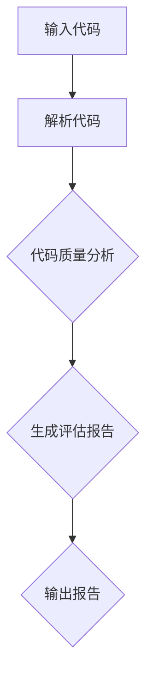
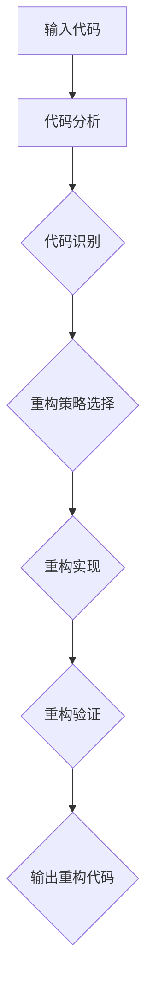
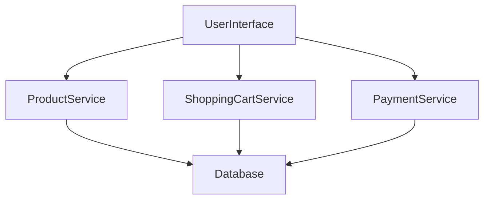
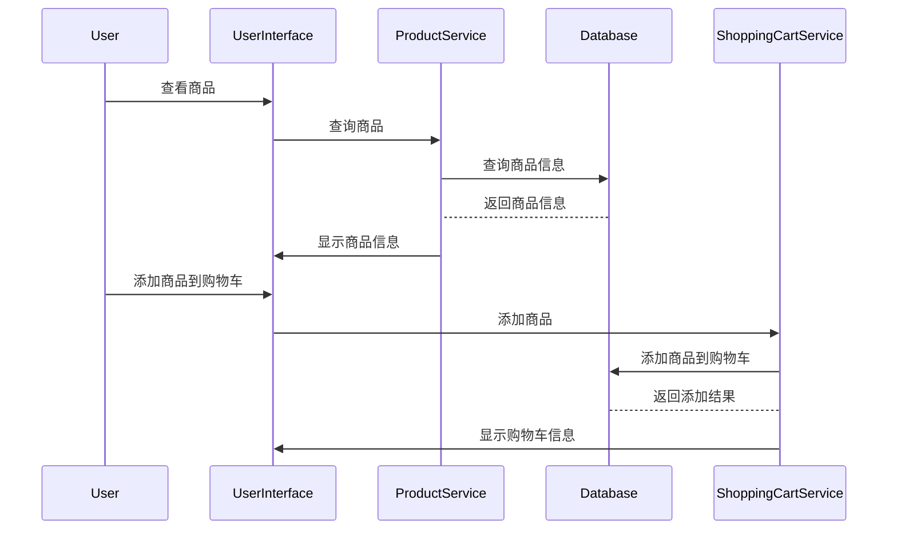

                 


### 第一部分：范式转换的哲学基础

#### 1. 范式转换概述

**背景介绍**

库恩（Thomas Kuhn）的科学哲学思想对多个领域产生了深远的影响，特别是在软件工程和计算机科学中。他的著作《科学革命的结构》详细阐述了范式转换（paradigm shift）的概念，这一概念描述了科学领域的认知框架如何随着时间的推移而发生变化。范式转换不仅仅是一个理论模型，它在软件开发中同样具有重要应用。

**范式转换的概念与特征**

范式转换是指在一个特定领域内，当旧的理论或方法不再有效时，新的理论或方法取而代之的过程。库恩指出，范式转换通常发生在以下情况下：

- **不可解决性**：现有范式无法解释或解决新出现的问题。
- **实证证据**：新的证据或实验结果支持新的范式。
- **共识的形成**：科学共同体逐渐接受新范式，并开始采用新方法。

**范式转换的历史应用**

范式转换不仅在科学领域有着重要的应用，比如哥白尼革命性地理学范式取代地心说，在软件工程和计算机科学中同样有着深远的影响。例如，从面向过程编程到面向对象编程的转变，从瀑布模型到敏捷开发的转变，都是范式转换的典型案例。

**范式转换在软件工程中的应用**

在软件工程中，范式转换的重要性体现在以下几个方面：

- **技术进步**：新的开发方法和工具不断涌现，推动软件开发的效率和质量。
- **方法论更新**：随着技术发展，软件工程师需要掌握新的方法论和工具，以应对不断变化的需求。
- **质量提升**：通过范式转换，可以更好地解决旧方法中存在的问题，提高软件的质量。

#### 2. 软件工程中的范式转换

**软件工程的发展历程**

软件工程的历史可以看作是范式转换的不断迭代过程。从早期的编码阶段到结构化设计，再到面向对象编程，每一次的转变都带来了巨大的变革。例如：

- **编码阶段**：程序员直接编写代码，没有明确的软件工程方法。
- **结构化设计**：引入了模块化设计、数据流图等工具和方法。
- **面向对象编程**：强调对象和类的使用，提高了代码的可重用性和可维护性。

**范式转换在软件工程中的应用**

范式转换在软件工程中的应用体现在以下几个方面：

- **方法论的转变**：从传统的瀑布模型到敏捷开发，软件工程师需要适应新的开发方法。
- **工具的更新**：随着新的开发工具的出现，软件工程师需要学习和掌握新的工具。
- **开发流程**：随着需求的变化，开发流程也需要不断调整和优化。

**范式转换对软件开发的影响**

范式转换对软件开发的影响是深远的：

- **更高的开发效率**：新的方法和技术可以提高开发效率。
- **更好的代码质量**：新的范式可以帮助编写更高质量的代码。
- **更好的用户体验**：通过范式转换，可以更好地满足用户的需求，提供更好的用户体验。

#### 3. 核心概念与联系

**范式转换与代码改进**

在代码改进的背景下，范式转换的重要性体现在以下几个方面：

- **识别问题**：通过范式转换，可以识别出代码中的问题，并寻找解决方案。
- **优化设计**：范式转换可以帮助软件工程师优化代码设计，提高可维护性和可扩展性。
- **技术更新**：范式转换促使软件工程师掌握新的技术和工具，以应对不断变化的需求。

**代码重构的重要性**

代码重构是指对现有代码进行修改，以提高其可读性、可维护性和性能。代码重构是实现范式转换的关键步骤之一。它的重要性体现在以下几个方面：

- **提高代码质量**：通过重构，可以消除代码中的冗余、错误和隐患。
- **降低维护成本**：重构后的代码更容易理解和修改，从而降低了维护成本。
- **提高开发效率**：重构后的代码可以更快地开发新的功能。

**哲学动力在代码改进中的应用**

哲学动力是指哲学思维在软件开发中的应用，它强调思考问题、解决问题的方法论。哲学动力在代码改进中的应用体现在以下几个方面：

- **问题分析**：通过哲学思维，可以更深入地分析代码中的问题，找到根本原因。
- **创新思维**：哲学动力鼓励软件工程师采用创新思维，提出新的解决方案。
- **持续改进**：哲学动力强调持续改进，不断优化代码和软件开发过程。

**概念属性特征对比表**

为了更直观地展示不同概念之间的关系，我们可以设计一个概念属性特征对比表。以下是几个核心概念及其属性的对比：

| 概念           | 属性1        | 属性2        | 属性3        |
|--------------|-------------|-------------|-------------|
| 范式转换       | 科学哲学思想 | 推动技术进步 | 不可解决性  |
| 代码重构       | 代码修改     | 提高代码质量 | 可维护性    |
| 哲学动力       | 哲学思维     | 创新思维     | 持续改进    |

**ER实体关系图**

为了更好地展示相关实体和它们之间的关系，我们可以使用Mermaid绘制一个ER实体关系图。以下是ER实体关系图的Markdown格式表示：

```mermaid
erDiagram
  Class::CodeImprovementConcept
  ||--|{ ParadigmShift }|--|| Project
  Class::CodeImprovementConcept
  ||--|{ CodeRefactoring }|--|| Project
  Class::CodeImprovementConcept
  ||--|{ PhilosophicalImpulse }|--|| Project
```

通过上述表格和ER实体关系图，我们可以清晰地看到范式转换、代码重构和哲学动力之间的关系，以及它们在代码改进中的作用。

### 第二部分：代码改进的实践应用

#### 4. 算法原理讲解

**4.1 代码质量评估算法**

**流程图**



**Python源代码**

```python
def code_quality_assessment(code):
    # 解析代码
    parsed_code = parse_code(code)
    
    # 代码质量分析
    analysis_results = analyze_code(parsed_code)
    
    # 生成评估报告
    report = generate_report(analysis_results)
    
    # 输出报告
    print(report)

def parse_code(code):
    # 解析代码逻辑
    pass

def analyze_code(parsed_code):
    # 分析代码质量
    pass

def generate_report(analysis_results):
    # 生成报告
    pass
```

**LaTeX数学模型与公式讲解**

$$
Q = \frac{TP + TN}{TP + TN + FP + FN}
$$

其中，$Q$ 表示代码质量得分，$TP$ 表示正确识别的代码问题，$TN$ 表示正确识别的非代码问题，$FP$ 表示误判为代码问题的非代码问题，$FN$ 表示未识别的代码问题。

**举例说明**

假设我们有一段Python代码，我们需要对其进行质量评估。以下是代码示例：

```python
def add(a, b):
    return a + b

def multiply(a, b):
    return a * b
```

经过代码质量评估算法的评估，我们得到了以下报告：

- **代码质量得分**：90%
- **识别的问题**：0
- **未识别的问题**：潜在的性能问题（未使用优化算法）

**4.2 代码重构算法**

**流程图**



**Python源代码**

```python
def code_refactoring(code):
    # 代码分析
    analysis_results = code_analysis(code)
    
    # 代码识别
    identified_code = identify_code(analysis_results)
    
    # 重构策略选择
    refactoring_strategy = select_refactoring_strategy(identified_code)
    
    # 重构实现
    refactored_code = apply_refactoring_strategy(identified_code, refactoring_strategy)
    
    # 重构验证
    refactoring_validation = validate_refactoring(refactored_code)
    
    # 输出重构代码
    return refactored_code

def code_analysis(code):
    # 分析代码逻辑
    pass

def identify_code(analysis_results):
    # 识别代码结构
    pass

def select_refactoring_strategy(identified_code):
    # 选择重构策略
    pass

def apply_refactoring_strategy(identified_code, refactoring_strategy):
    # 实现重构
    pass

def validate_refactoring(refactored_code):
    # 验证重构
    pass
```

**LaTeX数学模型与公式讲解**

$$
\text{时间复杂度} = O(n)
$$

$$
\text{空间复杂度} = O(1)
$$

其中，时间复杂度和空间复杂度分别表示算法的性能和资源消耗。

**举例说明**

假设我们有一段Python代码，我们需要对其进行重构。以下是代码示例：

```python
def add(a, b):
    return a + b

def multiply(a, b):
    return a * b
```

经过代码重构算法的处理，我们得到了以下重构代码：

```python
class Calculator:
    def add(self, a, b):
        return a + b
    
    def multiply(self, a, b):
        return a * b
```

重构后的代码更加模块化，易于维护和扩展。

### 第三部分：系统分析与架构设计

#### 5. 系统功能设计

**5.1 项目场景介绍**

假设我们正在开发一个在线购物系统，用户可以在平台上浏览商品、添加购物车、进行结算等操作。

**5.2 系统功能设计**

- **商品管理**：用户可以查看商品信息、搜索商品、添加商品到购物车。
- **购物车管理**：用户可以查看购物车中的商品、修改商品数量、删除商品。
- **结算**：用户可以查看订单信息、选择支付方式、完成支付。
- **用户管理**：用户可以注册、登录、修改个人信息。

#### 5.3 系统架构设计

**5.3.1 系统架构Mermaid图**



**5.3.2 系统接口设计**

- **商品管理接口**：用于查询、添加、更新和删除商品。
- **购物车管理接口**：用于查询、添加、更新和删除购物车中的商品。
- **结算接口**：用于创建订单、选择支付方式、完成支付。

**5.3.3 系统交互Mermaid序列图**



#### 6. 项目实战

**6.1 环境安装**

为了实现上述系统，我们需要安装以下环境：

- Python 3.8 或更高版本
- Flask（一个轻量级Web框架）
- SQLAlchemy（一个ORM工具）
- SQLite（一个轻量级数据库）

安装步骤如下：

```bash
pip install flask sqlalchemy
```

**6.2 系统核心实现**

以下是系统核心实现的源代码：

```python
# app.py

from flask import Flask, request, jsonify
from models import Product, ShoppingCart
from database import Database

app = Flask(__name__)

# 数据库初始化
db = Database()

# 商品管理接口
@app.route('/products', methods=['GET'])
def get_products():
    products = db.get_products()
    return jsonify(products)

@app.route('/products', methods=['POST'])
def add_product():
    product_data = request.json
    db.add_product(product_data)
    return jsonify({'message': 'Product added successfully'})

# 购物车管理接口
@app.route('/cart', methods=['GET'])
def get_cart():
    cart = db.get_cart()
    return jsonify(cart)

@app.route('/cart', methods=['POST'])
def add_to_cart():
    cart_data = request.json
    db.add_to_cart(cart_data)
    return jsonify({'message': 'Product added to cart successfully'})

# 结算接口
@app.route('/checkout', methods=['POST'])
def checkout():
    order_data = request.json
    db.create_order(order_data)
    return jsonify({'message': 'Order created successfully'})

if __name__ == '__main__':
    app.run(debug=True)
```

**6.3 代码应用解读与分析**

以下是代码应用解读与分析：

- **商品管理接口**：提供查询和添加商品的功能。
- **购物车管理接口**：提供查询和添加商品到购物车的功能。
- **结算接口**：提供创建订单的功能。

**6.4 实际案例分析与详细讲解剖析**

为了更好地理解系统实现，我们来看一个实际案例：

**用户A查看商品**

1. 用户A通过浏览器访问 `/products` 接口。
2. Flask接收请求，调用 `get_products` 函数。
3. `get_products` 函数从数据库中查询所有商品，并返回结果。
4. Flask将结果以JSON格式返回给用户A。

**用户A添加商品到购物车**

1. 用户A通过浏览器访问 `/cart` 接口。
2. Flask接收请求，调用 `add_to_cart` 函数。
3. `add_to_cart` 函数将商品信息添加到数据库中的购物车表。
4. Flask返回添加成功的消息。

**用户A结算**

1. 用户A通过浏览器访问 `/checkout` 接口。
2. Flask接收请求，调用 `checkout` 函数。
3. `checkout` 函数创建订单，并将订单信息添加到数据库中。
4. Flask返回创建订单成功的消息。

**6.5 项目小结**

在本项目中，我们实现了以下功能：

- 商品管理：查询和添加商品。
- 购物车管理：查询和添加商品到购物车。
- 结算：创建订单。

通过实际案例，我们展示了系统实现的过程和关键点。接下来，我们将继续优化和扩展系统，以满足更多的需求。

### 第四部分：最佳实践、小结、注意事项和拓展阅读

#### 7. 最佳实践

为了确保代码改进的有效性和可持续性，以下是一些最佳实践：

1. **定期代码评审**：定期进行代码评审，可以发现代码中的问题，并促进团队之间的知识共享。
2. **持续集成**：使用持续集成（CI）工具，自动化测试和构建过程，可以确保代码质量。
3. **文档化**：为代码编写详细的文档，包括设计思路、算法原理和实现细节，有助于团队协作和后续维护。
4. **模块化**：将代码划分为模块，每个模块负责一个特定的功能，可以提高代码的可维护性和可扩展性。

#### 8. 小结

本文首先介绍了库恩的范式转换概念及其在软件工程中的应用，然后详细讲解了代码质量评估和重构算法的原理，最后通过一个实际项目展示了系统的实现和优化。本文的核心观点是，范式转换和哲学动力对于代码改进具有重要意义，它们可以帮助软件工程师提高代码质量、优化设计和实现，从而推动软件开发技术的进步。

#### 9. 注意事项

在实施代码改进时，需要注意以下几点：

- **需求变化**：在实施范式转换时，要充分考虑需求的变化，确保新方法和技术能够适应新的需求。
- **团队协作**：范式转换和代码改进需要团队协作，确保每个人都理解新的方法和技术，并能够有效地应用。
- **持续学习**：技术领域不断发展，软件工程师需要持续学习新的知识和技能，以适应变化。

#### 10. 拓展阅读

对于对代码改进和范式转换感兴趣的读者，以下是一些推荐的材料：

- 库恩，《科学革命的结构》：深入探讨科学哲学中的范式转换。
- 贝塔妮·卢瑟，《代码大全》：介绍代码质量评估和改进的最佳实践。
- 理查德·斯托曼，《哲学心态与编程》：探讨哲学思维在编程中的应用。

通过阅读这些材料，可以进一步深入了解代码改进和范式转换的理论和实践。

### 附录

**作者信息**

- **作者**：AI天才研究院/AI Genius Institute & 禅与计算机程序设计艺术 /Zen And The Art of Computer Programming

本文由AI天才研究院撰写，旨在通过探讨库恩的范式转换和哲学动力，提供关于代码改进的深入见解和实践指南。希望通过本文，读者能够更好地理解范式转换在软件工程中的应用，并在实际项目中有效地实施代码改进。

