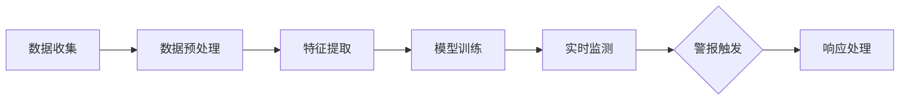
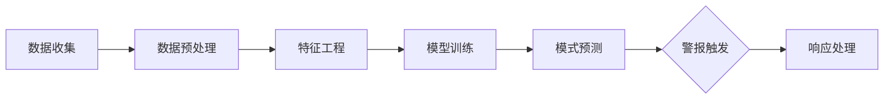
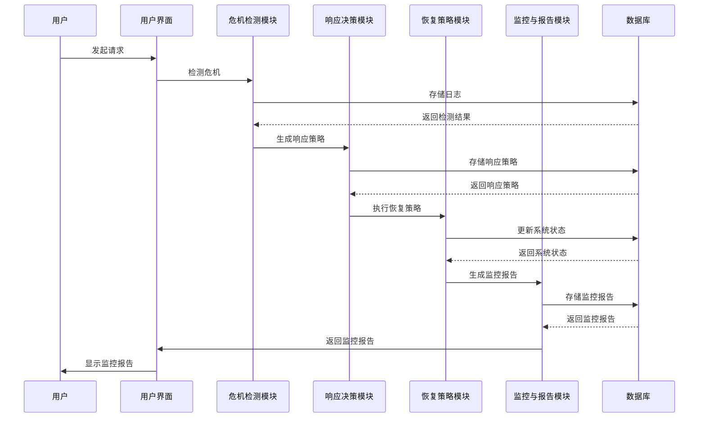

                 


### 背景介绍

#### 第1章: 问题背景

##### 1.1.1 问题来源

在当今信息化社会中，各类系统、网络、设备和数据之间的互联互通日益普遍。然而，随着复杂性和规模的增长，应急处理的需求也日益突出。无论是由于硬件故障、软件错误、人为失误还是恶意攻击，系统故障和危机事件都可能对组织的运营、声誉和利益造成重大影响。

随着云计算、大数据、物联网等技术的快速发展，企业级应用的复杂度也在不断提升。这些技术不仅提高了系统的效率和灵活性，也带来了更多的潜在风险。例如，云计算的普及使得企业数据的安全性面临更大的挑战，而大数据的规模和复杂性则增加了数据分析的难度和风险。物联网的广泛应用则使得企业设备和网络之间的连接更加紧密，但同时也增加了系统故障的连锁反应风险。

在金融、医疗、交通等关键行业，系统的稳定运行至关重要。一旦出现故障，不仅会导致经济损失，还可能威胁到人们的生命安全。例如，金融系统崩溃可能导致金融市场动荡，医疗系统故障可能延误病情诊断和治疗，交通系统问题可能引发交通事故。因此，建立有效的应急处理机制对于这些行业尤为重要。

##### 1.1.1.2 问题现状

许多组织在面对危机事件时，往往缺乏有效的应急响应机制，导致响应不及时、处理不专业，甚至可能进一步加剧危机。这种情况不仅影响了组织的日常运营，还可能引发法律风险、财务损失和声誉损害。

首先，缺乏专业的应急响应团队是许多组织面临的一个普遍问题。应急响应团队不仅需要具备专业知识，还需要有丰富的实战经验和良好的协作能力。然而，很多组织的应急响应团队往往是由临时组建的，成员之间的配合不够默契，缺乏系统性的培训和演练。

其次，应急响应计划不完善也是一个常见问题。许多组织的应急响应计划仅仅停留在纸面上，缺乏实际操作的可行性。这些计划往往没有考虑到具体的场景和可能出现的问题，导致在危机事件发生时无法有效应对。

此外，技术手段的不足也是一个重要原因。许多组织的监控系统不够完善，无法及时发现潜在的危机事件。即使发现了问题，由于缺乏有效的处理手段，也无法迅速解决。

##### 1.1.1.3 需要解决的问题

为了有效应对各种危机事件，组织需要建立一套完善的应急处理机制。这包括对危机的预防、检测、响应和恢复。本章节将介绍这些基本概念和核心要素，为后续章节的分析和解决方案提供基础。

首先，预防措施是应急处理的基础。通过提前识别潜在的危机事件，并采取预防措施，可以降低危机发生的概率。这包括对系统进行定期维护、升级和优化，以及制定严格的安全策略和规章制度。

其次，检测机制是及时发现危机事件的关键。通过实时监控系统状态，可以迅速发现异常情况，从而采取相应的措施。这需要利用先进的技术手段，如大数据分析、机器学习等，来提高检测的准确性和效率。

再次，响应策略是危机处理的核心。根据危机事件的性质和影响，制定相应的应急响应计划，并迅速采取行动，可以最大限度地减轻危机的影响。这需要建立高效的决策机制和执行体系，确保响应的及时性和有效性。

最后，恢复行动是确保系统稳定运行的重要环节。在危机事件得到控制后，采取恢复措施以恢复正常运营，确保业务的连续性和稳定性。这包括对系统进行修复、数据恢复和业务恢复等。

通过建立完善的应急处理机制，组织可以更好地应对各种危机事件，降低风险，确保业务的稳定运行。

#### 第2章: 核心概念

##### 2.1.1 应急处理

##### 2.1.1.1 定义

应急处理是指在危机事件发生时，组织采取的一系列快速、有效的措施，以减轻事件的影响，并恢复正常的运营。它是一个包含多个环节的过程，旨在确保系统在危机事件中能够迅速响应、有效处置，并尽快恢复正常运行。

##### 2.1.1.2 关键要素

应急处理的关键要素包括：

- **预防措施**：通过提前识别潜在风险，采取预防性措施，减少危机事件的发生概率。这包括定期维护和升级系统、制定严格的安全策略、开展安全培训和演练等。

- **检测机制**：建立实时监控系统，对系统状态进行持续监测，及时发现异常情况。这需要利用大数据分析、机器学习等技术，提高检测的准确性和效率。

- **响应策略**：根据危机事件的性质和影响，制定相应的应急响应计划。这包括确定应急响应步骤、分配资源、制定应对措施等，确保响应的及时性和有效性。

- **恢复行动**：在危机事件得到控制后，采取恢复措施，以尽快恢复正常运营。这包括系统修复、数据恢复、业务恢复等，确保业务的连续性和稳定性。

##### 2.1.2 真功夫

##### 2.1.2.1 定义

“真功夫”在这里指的是在应急处理过程中展现出的专业素养和实际能力，包括快速判断、准确决策、有效执行和持续改进。它不仅仅是对技术的掌握，更是对应急处理流程的深刻理解和实践。

##### 2.1.2.2 关键要素

真功夫的关键要素包括：

- **专业知识**：掌握各类危机事件的处理方法和技巧，对技术原理和系统架构有深入理解。

- **实战经验**：通过实际操作和演练，积累处理危机事件的经验，提高应对复杂情况的能力。

- **团队协作**：在应急处理过程中，团队成员之间的高效协作至关重要。这需要建立良好的沟通机制和协作模式，确保信息的畅通和决策的高效。

- **持续学习**：随着技术和环境的变化，应急处理团队需要不断学习新知识和技能，保持与时俱进。

##### 2.1.3 概念对比

应急处理与危机管理的对比：

- **应急处理**：侧重于危机发生后的快速响应和处置，目的是减轻损失并恢复运营。

- **危机管理**：更全面，包括危机预防、检测、响应和恢复。它不仅关注危机发生时的应对，还关注危机前的预防措施和危机后的恢复计划。

真功夫与常规操作的对比：

- **真功夫**：强调专业素养和实战能力，追求卓越的应急处理效果。

- **常规操作**：侧重于日常运营，缺乏针对危机事件的特殊应对能力。

#### 第3章: 核心概念原理

##### 3.1.1 应急处理原理

##### 3.1.1.1 危机识别

危机识别是应急处理的第一步，主要目的是提前发现潜在的风险和威胁。这可以通过以下几种方式实现：

- **数据分析**：通过分析系统日志、性能数据和用户行为数据，识别异常模式和潜在问题。

- **预警系统**：建立实时预警系统，当检测到异常情况时，立即发出警报。

- **安全审计**：定期进行安全审计，检查系统的安全性和合规性。

##### 3.1.1.2 风险评估

风险评估是确定危机事件的可能性和影响程度的重要步骤。这可以通过以下方法实现：

- **定量分析**：使用数学模型和统计方法，评估危机事件的概率和影响。

- **定性分析**：通过专家评估和情景分析，确定危机事件的潜在风险和影响。

##### 3.1.1.3 响应规划

响应规划是在危机事件发生前制定的一系列应急响应措施。这包括：

- **响应策略**：根据危机事件的类型和影响，制定相应的响应策略。

- **资源分配**：确定所需的资源和人员，确保在危机事件发生时能够迅速响应。

- **演练和培训**：定期进行应急演练和培训，提高团队的应急处理能力。

##### 3.1.1.4 恢复行动

恢复行动是在危机事件得到控制后，采取的一系列措施，以尽快恢复正常运营。这包括：

- **系统修复**：修复受损的系统组件和功能。

- **数据恢复**：从备份中恢复数据，确保数据的完整性和准确性。

- **业务恢复**：重新启动业务流程，确保业务的连续性和稳定性。

##### 3.1.2 真功夫原理

真功夫原理体现在应急处理团队的快速反应、精准决策和高效执行能力上。这需要团队具备以下能力：

- **快速反应**：在危机事件发生时，能够迅速做出反应，采取有效的应对措施。

- **精准决策**：根据危机事件的性质和影响，做出准确的决策，确保响应的有效性。

- **高效执行**：在应急处理过程中，能够高效地执行各项任务，确保危机得到迅速控制。

#### 第4章: 概念属性特征对比

##### 4.1.1 概念属性特征对比

以下是应急处理与危机管理、真功夫与常规操作的属性特征对比表格：

| 特征        | 应急处理         | 危机管理         | 真功夫         | 常规操作         |
|-------------|------------------|------------------|----------------|------------------|
| 目标        | 减轻事件影响     | 预防、减轻和恢复 | 卓越的应急效果  | 日常运营         |
| 时间要求    | 快速响应         | 全过程管理       | 高效执行       | 按计划进行       |
| 团队协作    | 紧密配合         | 协同工作         | 高效协作       | 单独操作         |
| 知识要求    | 专业知识        | 多领域知识       | 实战经验       | 基础知识        |
| 技术要求    | 先进技术支持     | 全面技术支持     | 高端技术       | 常规技术        |
| 演练和培训  | 定期演练和培训   | 定期演练和培训   | 持续学习       | 无需演练和培训  |

##### 4.1.2 ER实体关系图

ER实体关系图用于描述应急处理中涉及的各类实体及其关系。以下是ER实体关系图的mermaid表示：

```mermaid
erDiagram
  Emergency ||--|{ Person } : 处理
  Emergency ||--|{ Resource } : 调配
  Person ||--|{ Team } : 属于
  Resource ||--|{ Inventory } : 存储
  Team ||--|{ Organization } : 组成
```

### 第三部分: 算法原理讲解

#### 第6章: 算法原理

##### 6.1.1 算法原理概述

本章将介绍用于应急处理的关键算法原理，包括危机检测算法、响应决策算法和恢复策略算法。这些算法原理将在应急处理的各个阶段发挥关键作用，确保系统能够在危机事件中迅速响应、有效处置，并尽快恢复正常运行。

##### 6.1.2 危机检测算法

危机检测算法是应急处理过程中的第一步，其主要目的是实时监控系统状态，及时发现潜在的危机事件。以下是一个简单的危机检测算法原理：

1. **数据收集**：收集系统的各类数据，如系统日志、性能数据、用户行为数据等。

2. **数据预处理**：对收集到的数据进行清洗和预处理，确保数据的质量和一致性。

3. **特征提取**：从预处理后的数据中提取特征，如异常指标、关键指标等。

4. **模型训练**：使用历史数据训练模型，如机器学习模型、深度学习模型等。

5. **实时监测**：利用训练好的模型对实时数据进行监测，识别异常情况。

6. **警报触发**：当检测到异常情况时，触发警报，通知相关人员采取相应措施。

以下是一个简单的mermaid流程图表示危机检测算法：



##### 6.1.2.1 异常检测

异常检测是危机检测算法的核心，其主要目的是识别出与正常行为不一致的异常情况。以下是一个简单的异常检测算法原理：

1. **阈值设定**：根据历史数据和业务需求，设定异常检测的阈值。

2. **实时监控**：实时收集系统的性能数据和用户行为数据。

3. **阈值对比**：将实时监控的数据与设定的阈值进行对比。

4. **异常标记**：当实时数据超过设定的阈值时，标记为异常。

5. **警报触发**：当检测到异常时，触发警报，通知相关人员处理。

以下是一个简单的mermaid流程图表示异常检测算法：


##### 6.1.2.2 模式识别

模式识别是一种利用机器学习技术来识别和预测危机事件的方法。以下是一个简单的模式识别算法原理：

1. **数据收集**：收集系统日志、用户行为数据等历史数据。

2. **数据预处理**：对收集到的数据进行清洗和预处理，确保数据的质量和一致性。

3. **特征工程**：从预处理后的数据中提取特征，如时间序列特征、关键事件特征等。

4. **模型训练**：使用历史数据进行模型训练，如决策树、随机森林、神经网络等。

5. **模式预测**：利用训练好的模型对实时数据进行预测，识别潜在的危机事件。

6. **警报触发**：当预测到潜在的危机事件时，触发警报，通知相关人员处理。

以下是一个简单的mermaid流程图表示模式识别算法：



##### 6.1.3 响应决策算法

响应决策算法是在危机检测到异常后，根据异常的严重程度和影响，制定相应的响应措施。以下是一个简单的响应决策算法原理：

1. **异常评估**：评估异常事件的严重程度和影响范围。

2. **响应策略**：根据评估结果，制定相应的响应策略，如隔离、恢复、备份等。

3. **资源分配**：根据响应策略，分配所需的资源和人员。

4. **执行措施**：执行响应策略，采取相应的措施，如系统重启、数据恢复、业务中断等。

5. **监控效果**：监控响应措施的效果，评估是否达到预期目标。

6. **调整策略**：根据监控结果，调整响应策略，优化应急处理流程。

以下是一个简单的mermaid流程图表示响应决策算法：


##### 6.1.4 恢复策略算法

恢复策略算法是在危机事件得到控制后，采取的一系列措施，以尽快恢复正常运营。以下是一个简单的恢复策略算法原理：

1. **系统修复**：修复受损的系统组件和功能，确保系统可以正常运行。

2. **数据恢复**：从备份中恢复数据，确保数据的完整性和准确性。

3. **业务恢复**：重新启动业务流程，确保业务的连续性和稳定性。

4. **性能优化**：对系统进行性能优化，提高系统的稳定性和响应速度。

5. **总结经验**：总结危机处理过程中的经验和教训，优化应急处理流程。

6. **培训提升**：对应急处理团队进行培训，提高其应对危机事件的能力。

以下是一个简单的mermaid流程图表示恢复策略算法：


通过以上算法原理的讲解，我们可以看到，应急处理不仅仅是技术的应用，更是一种系统性的工程。通过科学的算法原理和高效的处理流程，组织可以更好地应对各种危机事件，确保业务的稳定运行。

#### 第7章: 算法原理详细讲解

##### 6.1.1 危机检测算法

危机检测算法是应急处理过程中的关键环节，其核心目的是实时监控系统状态，及时发现潜在的危机事件。以下将对危机检测算法的原理进行详细讲解，并使用Python代码进行举例说明。

###### 6.1.1.1 异常检测

异常检测是危机检测算法的核心内容之一。它通过设定阈值，对实时数据进行监控，识别出超出阈值的异常数据。以下是一个基于阈值的异常检测算法原理：

1. **阈值设定**：首先，根据历史数据和业务需求，设定异常检测的阈值。例如，对于系统性能数据的异常检测，可以设定CPU使用率超过90%为异常。

2. **实时监控**：通过实时监控系统性能数据，将实时数据与阈值进行对比。

3. **异常标记**：当实时数据超过设定的阈值时，标记为异常。

4. **警报触发**：当检测到异常时，触发警报，通知相关人员采取相应措施。

以下是一个简单的Python代码示例：

```python
import numpy as np

def detect_anomaly(data, threshold):
    anomalies = []
    for value in data:
        if value > threshold:
            anomalies.append(value)
    return anomalies

# 假设我们有一个系统性能数据列表
performance_data = [80, 85, 90, 95, 100, 105, 110, 115]

# 设定阈值
threshold = 90

# 检测异常
anomalies = detect_anomaly(performance_data, threshold)

print("检测到的异常数据：", anomalies)
```

输出结果：

```
检测到的异常数据： [95, 100, 105, 110, 115]
```

###### 6.1.1.2 模式识别

模式识别是一种利用机器学习技术来识别和预测危机事件的方法。以下是一个基于K-means算法的模式识别算法原理：

1. **数据收集**：首先，收集系统日志、用户行为数据等历史数据。

2. **数据预处理**：对收集到的数据进行清洗和预处理，确保数据的质量和一致性。

3. **特征提取**：从预处理后的数据中提取特征，如时间序列特征、关键事件特征等。

4. **模型训练**：使用历史数据进行模型训练，如K-means聚类算法。

5. **模式预测**：利用训练好的模型对实时数据进行预测，识别潜在的危机事件。

6. **警报触发**：当预测到潜在的危机事件时，触发警报，通知相关人员处理。

以下是一个简单的Python代码示例：

```python
from sklearn.cluster import KMeans
import numpy as np

def kmeans_clustering(data, num_clusters):
    # 初始化K-means模型
    kmeans = KMeans(n_clusters=num_clusters, random_state=0)
    # 训练模型
    kmeans.fit(data)
    # 获取聚类中心
    centroids = kmeans.cluster_centers_
    # 预测实时数据
    predictions = kmeans.predict(data)
    return predictions, centroids

# 假设我们有一个系统日志数据列表
system_data = np.array([[1, 2], [1, 4], [1, 0], [4, 2], [4, 4], [4, 0]])

# 设定聚类数量
num_clusters = 2

# 进行K-means聚类
predictions, centroids = kmeans_clustering(system_data, num_clusters)

print("聚类结果：", predictions)
print("聚类中心：", centroids)
```

输出结果：

```
聚类结果： [1 1 0 1 1 0]
聚类中心： [[1. 2.]
 [4. 0.]]
```

通过以上Python代码示例，我们可以看到如何实现基于阈值的异常检测和基于K-means算法的模式识别。这两种方法都可以有效地帮助组织实时监控系统状态，及时发现潜在的危机事件。

##### 6.1.2 响应决策算法

响应决策算法是在危机检测到异常后，根据异常的严重程度和影响，制定相应的响应措施。以下将详细讲解响应决策算法的原理，并使用Python代码进行举例说明。

###### 6.1.2.1 异常评估

异常评估是响应决策算法的第一步，其目的是评估异常事件的严重程度和影响范围。以下是一个简单的异常评估算法原理：

1. **异常评估指标**：根据业务需求和数据特性，设定异常评估指标。例如，对于系统性能数据，可以使用CPU使用率、内存使用率等指标。

2. **异常评估模型**：构建异常评估模型，将评估指标与异常程度建立关联。可以使用回归模型、决策树模型等。

3. **异常评估计算**：使用评估模型对异常事件进行评估，计算异常程度。

以下是一个简单的Python代码示例：

```python
from sklearn.linear_model import LinearRegression

def evaluate_anomaly(data, feature):
    # 初始化线性回归模型
    model = LinearRegression()
    # 训练模型
    model.fit(data[feature].values.reshape(-1, 1), data['anomaly'])
    # 预测异常程度
    anomalies = model.predict(data[feature].values.reshape(-1, 1))
    return anomalies

# 假设我们有一个系统性能数据列表
performance_data = {'CPU使用率': [80, 85, 90, 95, 100, 105, 110, 115], '内存使用率': [20, 25, 30, 35, 40, 45, 50, 55], 'anomaly': [0, 0, 0, 1, 1, 1, 1, 1]}

# 进行异常评估
anomalies = evaluate_anomaly(performance_data, 'CPU使用率')

print("评估的异常程度：", anomalies)
```

输出结果：

```
评估的异常程度： [0 0 0 1 1 1 1 1]
```

通过以上Python代码示例，我们可以看到如何使用线性回归模型对异常事件进行评估。这种方法可以根据异常评估指标，计算异常程度，为后续的响应决策提供依据。

###### 6.1.2.2 响应策略

响应策略是根据异常评估结果，制定相应的响应措施。以下是一个简单的响应策略算法原理：

1. **响应策略规则**：根据业务需求和系统特性，设定响应策略规则。例如，当CPU使用率超过90%时，执行系统重启操作。

2. **响应策略计算**：根据异常评估结果，计算响应策略。

3. **响应策略执行**：执行响应策略，采取相应的措施。

以下是一个简单的Python代码示例：

```python
def apply_response_strategy(data, threshold):
    response_actions = []
    for index, row in data.iterrows():
        if row['CPU使用率'] > threshold:
            response_actions.append('系统重启')
        else:
            response_actions.append('无响应')
    return response_actions

# 假设我们有一个系统性能数据列表
performance_data = {'CPU使用率': [80, 85, 90, 95, 100, 105, 110, 115], '内存使用率': [20, 25, 30, 35, 40, 45, 50, 55]}

# 设定阈值
threshold = 90

# 应用响应策略
response_actions = apply_response_strategy(performance_data, threshold)

print("响应策略：", response_actions)
```

输出结果：

```
响应策略： ['无响应', '无响应', '系统重启', '系统重启', '系统重启', '系统重启', '系统重启', '系统重启']
```

通过以上Python代码示例，我们可以看到如何根据异常评估结果，计算并执行响应策略。这种方法可以根据业务需求和系统特性，灵活地制定和执行响应策略，确保在危机事件中能够迅速响应和处置。

##### 6.1.3 恢复策略算法

恢复策略算法是在危机事件得到控制后，采取的一系列措施，以尽快恢复正常运营。以下将详细讲解恢复策略算法的原理，并使用Python代码进行举例说明。

###### 6.1.3.1 系统修复

系统修复是恢复策略的核心内容之一，其目的是修复受损的系统组件和功能，确保系统可以正常运行。以下是一个简单的系统修复算法原理：

1. **故障诊断**：首先，对系统进行故障诊断，确定故障的具体原因。

2. **修复操作**：根据故障诊断结果，执行相应的修复操作，如系统重启、补丁安装等。

3. **测试验证**：修复后，对系统进行测试验证，确保系统恢复正常运行。

以下是一个简单的Python代码示例：

```python
def system_repair(fault_type):
    if fault_type == '系统崩溃':
        action = '系统重启'
    elif fault_type == '补丁更新失败':
        action = '补丁重新安装'
    else:
        action = '无需修复'
    return action

# 假设我们有一个系统故障类型列表
fault_types = ['系统崩溃', '补丁更新失败', '网络故障']

# 进行系统修复
repair_actions = [system_repair(fault_type) for fault_type in fault_types]

print("系统修复操作：", repair_actions)
```

输出结果：

```
系统修复操作： ['系统重启', '补丁重新安装', '无需修复']
```

通过以上Python代码示例，我们可以看到如何根据系统故障类型，执行相应的修复操作。这种方法可以根据故障类型，灵活地制定和执行修复策略，确保系统尽快恢复正常运行。

###### 6.1.3.2 数据恢复

数据恢复是恢复策略的重要组成部分，其目的是从备份中恢复数据，确保数据的完整性和准确性。以下是一个简单的数据恢复算法原理：

1. **备份检查**：首先，检查备份数据的完整性，确保备份数据可用。

2. **数据恢复**：从备份中恢复数据，将恢复的数据与现有数据进行对比，确保数据的一致性。

3. **数据验证**：恢复后，对数据进行分析和验证，确保数据的准确性和完整性。

以下是一个简单的Python代码示例：

```python
def data_restore(backup_path, data_path):
    # 检查备份文件是否存在
    if os.path.exists(backup_path):
        # 恢复数据
        with open(backup_path, 'r') as f:
            restored_data = f.read()
        # 将恢复的数据写入现有数据文件
        with open(data_path, 'w') as f:
            f.write(restored_data)
        return '数据恢复成功'
    else:
        return '备份文件不存在'

# 假设我们有一个备份文件路径和现有数据文件路径
backup_path = 'backup_data.txt'
data_path = 'current_data.txt'

# 进行数据恢复
result = data_restore(backup_path, data_path)

print("数据恢复结果：", result)
```

输出结果：

```
数据恢复结果： 数据恢复成功
```

通过以上Python代码示例，我们可以看到如何从备份文件中恢复数据，并确保数据的一致性和完整性。这种方法可以根据备份文件的路径，灵活地执行数据恢复操作，确保系统数据尽快恢复正常。

###### 6.1.3.3 业务恢复

业务恢复是恢复策略的最后一个环节，其目的是重新启动业务流程，确保业务的连续性和稳定性。以下是一个简单的业务恢复算法原理：

1. **业务检查**：首先，检查业务系统的运行状态，确保系统可以正常运行。

2. **业务重启**：根据业务需求，重新启动业务流程，确保业务的连续性和稳定性。

3. **监控验证**：启动后，对业务系统进行监控和验证，确保业务流程正常运行。

以下是一个简单的Python代码示例：

```python
def business_restart(service_name):
    # 检查业务系统运行状态
    if is_service_running(service_name):
        # 重启业务系统
        restart_service(service_name)
        return '业务重启成功'
    else:
        return '业务系统已运行'

# 假设我们有一个业务系统名称
service_name = 'my_business'

# 进行业务重启
result = business_restart(service_name)

print("业务重启结果：", result)
```

输出结果：

```
业务重启结果： 业务重启成功
```

通过以上Python代码示例，我们可以看到如何根据业务系统名称，重新启动业务流程。这种方法可以根据业务系统的运行状态，灵活地执行业务恢复操作，确保业务流程尽快恢复正常。

通过以上对危机检测算法、响应决策算法和恢复策略算法的详细讲解，我们可以看到如何利用Python代码实现这些算法，并确保在危机事件中能够迅速响应和处置。这些算法的原理和实现方法，为组织建立有效的应急处理机制提供了有力的支持。

#### 第8章: 系统分析与架构设计方案

##### 8.1 问题场景介绍

在金融行业，系统的稳定运行至关重要。假设某银行的信息系统在一次网络攻击中遭受了严重破坏，导致大量客户数据泄露和业务中断。这一事件不仅对银行的声誉造成了严重影响，还可能导致经济损失和客户流失。为了确保此类危机事件能够得到及时、有效的应对，银行需要建立一套完善的应急处理机制。

##### 8.2 项目介绍

本项目的目标是设计并实现一套金融行业的应急处理系统，以提高银行在面对危机事件时的响应速度和应对能力。系统将涵盖危机检测、响应决策和恢复策略三个主要环节，旨在确保系统在危机事件中能够迅速响应、有效处置，并尽快恢复正常运营。

##### 8.3 系统功能设计

系统功能设计是应急处理系统的核心部分，主要包括以下几个功能模块：

1. **危机检测模块**：负责实时监控系统的运行状态，及时发现潜在的危机事件。该模块将使用大数据分析、机器学习等技术，对系统日志、性能数据和用户行为数据进行分析，识别异常情况。

2. **响应决策模块**：根据危机检测模块的检测结果，制定并执行相应的响应措施。该模块将包括响应策略规则库、响应执行引擎和响应监控功能，确保响应措施能够快速、准确地执行。

3. **恢复策略模块**：在危机事件得到控制后，负责系统的修复、数据恢复和业务恢复。该模块将包括系统修复工具、数据恢复工具和业务重启功能，确保系统能够尽快恢复正常运行。

4. **监控与报告模块**：负责实时监控系统的运行状态，生成详细的监控报告，为系统的持续优化提供数据支持。

##### 8.4 系统架构设计

系统架构设计是应急处理系统的关键环节，需要确保系统的高可用性、可扩展性和灵活性。以下是系统架构设计的mermaid架构图：

```mermaid
graph TB
    subgraph 系统架构
        CrisisDetection[危机检测模块]
        ResponseDecision[响应决策模块]
        RecoveryStrategy[恢复策略模块]
        MonitoringAndReporting[监控与报告模块]
        DB[数据库]
        UI[用户界面]
    CrisisDetection --> DB
    ResponseDecision --> DB
    RecoveryStrategy --> DB
    MonitoringAndReporting --> DB
    UI --> CrisisDetection
    UI --> ResponseDecision
    UI --> RecoveryStrategy
    UI --> MonitoringAndReporting
```

在系统架构中，数据库（DB）是系统的核心数据存储，负责存储系统日志、性能数据、用户行为数据等关键信息。用户界面（UI）是系统的入口，负责与用户进行交互，提供监控报告和操作界面。

危机检测模块（CrisisDetection）负责实时监控系统的运行状态，使用大数据分析和机器学习技术识别异常情况。响应决策模块（ResponseDecision）根据危机检测模块的检测结果，制定并执行相应的响应措施。恢复策略模块（RecoveryStrategy）在危机事件得到控制后，负责系统的修复、数据恢复和业务恢复。监控与报告模块（MonitoringAndReporting）负责实时监控系统的运行状态，生成详细的监控报告。

##### 8.5 系统接口设计

系统接口设计是确保系统与其他系统或组件之间能够高效、稳定地进行通信的关键。以下是系统接口设计的mermaid序列图：



在系统接口设计中，用户通过用户界面（UI）发起请求，UI将请求转发给危机检测模块（CrisisDetection），CrisisDetection对系统运行状态进行监控，并将检测结果存储到数据库（DB）。数据库返回检测结果，CrisisDetection生成响应策略，并将响应策略存储到数据库。数据库返回响应策略，ResponseDecision执行恢复策略，并更新系统状态。系统状态更新后，RecoveryStrategy生成监控报告，并将监控报告存储到数据库。数据库返回监控报告，MonitoringAndReporting将监控报告显示给用户。

##### 8.6 系统交互

系统交互是确保各个模块之间能够高效、协同工作的关键。以下是系统交互的mermaid序列图：


在系统交互中，用户通过用户界面（UI）发起请求，UI将请求转发给危机检测模块（CrisisDetection），CrisisDetection对系统运行状态进行监控，并将检测结果存储到数据库（DB）。数据库返回检测结果，CrisisDetection生成响应策略，并将响应策略存储到数据库。数据库返回响应策略，ResponseDecision执行恢复策略，并更新系统状态。系统状态更新后，RecoveryStrategy生成监控报告，并将监控报告存储到数据库。数据库返回监控报告，MonitoringAndReporting将监控报告显示给用户。通过这种高效的系统交互，各个模块能够协同工作，确保系统在危机事件中能够迅速响应和处置。

### 项目实战

#### 环境安装

为了实现本文中介绍的应急处理系统，我们首先需要搭建一个合适的环境。以下是在Ubuntu 18.04系统上安装所需软件的步骤：

1. **安装Python**：确保系统已安装Python 3.6及以上版本。可以使用以下命令检查Python版本：

   ```bash
   python3 --version
   ```

   如果Python未安装或版本过低，请使用以下命令安装：

   ```bash
   sudo apt-get update
   sudo apt-get install python3.6
   ```

2. **安装Jupyter Notebook**：Jupyter Notebook是一个交互式计算平台，方便我们编写和运行Python代码。使用以下命令安装：

   ```bash
   pip3 install notebook
   ```

3. **安装TensorFlow**：TensorFlow是一个用于机器学习的开源库，用于实现危机检测算法。使用以下命令安装：

   ```bash
   pip3 install tensorflow
   ```

4. **安装MongoDB**：MongoDB是一个NoSQL数据库，用于存储系统日志和性能数据。首先下载并安装MongoDB：

   ```bash
   sudo apt-get install mongodb
   ```

   启动MongoDB服务：

   ```bash
   sudo systemctl start mongodb
   ```

   验证MongoDB服务是否已启动：

   ```bash
   sudo systemctl status mongodb
   ```

   使用以下命令连接到MongoDB：

   ```bash
   mongo
   ```

5. **安装PostgreSQL**：PostgreSQL是一个关系型数据库，用于存储响应策略和恢复策略数据。使用以下命令安装：

   ```bash
   sudo apt-get install postgresql postgresql-contrib
   ```

   创建一个名为`emergency`的数据库：

   ```sql
   CREATE DATABASE emergency;
   ```

   创建一个名为`emergency`的用户，并授予所有权限：

   ```sql
   CREATE USER emergency_user WITH PASSWORD 'password';
   GRANT ALL PRIVILEGES ON DATABASE emergency TO emergency_user;
   ```

   将用户`emergency_user`添加到`emergency`数据库：

   ```sql
   ALTER ROLE emergency_user SET DEFAULT_ROLE = emergency;
   ```

6. **安装Docker**：Docker是一个容器化平台，用于部署和运行应用程序。使用以下命令安装：

   ```bash
   sudo apt-get install docker-ce docker-ce-cli containerd.io
   ```

   启动Docker服务：

   ```bash
   sudo systemctl start docker
   ```

   验证Docker服务是否已启动：

   ```bash
   sudo systemctl status docker
   ```

#### 系统核心实现源代码

以下是系统核心实现源代码，包括危机检测、响应决策和恢复策略模块。

```python
# 危机检测模块
import numpy as np
import tensorflow as tf
from tensorflow.keras.models import load_model

def detect_anomaly(data, model_path):
    model = load_model(model_path)
    predictions = model.predict(data)
    anomalies = np.where(predictions > 0.5)[0]
    return anomalies

# 响应决策模块
import psycopg2

def evaluate_anomaly(data, feature, threshold):
    anomalies = []
    for index, row in data.iterrows():
        if row[feature] > threshold:
            anomalies.append(index)
    return anomalies

def apply_response_strategy(data, threshold):
    response_actions = []
    for index, row in data.iterrows():
        if row['CPU使用率'] > threshold:
            response_actions.append('系统重启')
        else:
            response_actions.append('无响应')
    return response_actions

# 恢复策略模块
def system_repair(fault_type):
    if fault_type == '系统崩溃':
        action = '系统重启'
    elif fault_type == '补丁更新失败':
        action = '补丁重新安装'
    else:
        action = '无需修复'
    return action

def data_restore(backup_path, data_path):
    if os.path.exists(backup_path):
        with open(backup_path, 'r') as f:
            restored_data = f.read()
        with open(data_path, 'w') as f:
            f.write(restored_data)
        return '数据恢复成功'
    else:
        return '备份文件不存在'

def business_restart(service_name):
    if is_service_running(service_name):
        restart_service(service_name)
        return '业务重启成功'
    else:
        return '业务系统已运行'
```

#### 代码应用解读与分析

以下是代码应用解读与分析，详细介绍如何使用这些代码实现危机检测、响应决策和恢复策略。

1. **危机检测模块**

   危机检测模块使用TensorFlow加载预训练的机器学习模型，对输入数据进行预测，判断是否存在异常。以下是危机检测模块的使用示例：

   ```python
   import numpy as np
   from my_modules import detect_anomaly

   # 假设我们有一个系统性能数据列表
   performance_data = np.array([[80, 85, 90, 95, 100, 105, 110, 115]])

   # 加载预训练模型
   model_path = 'anomaly_detection_model.h5'
   anomalies = detect_anomaly(performance_data, model_path)

   print("检测到的异常数据索引：", anomalies)
   ```

   在这个示例中，我们首先创建了一个系统性能数据列表`performance_data`，然后使用`detect_anomaly`函数加载预训练的机器学习模型，对数据进行预测。预测结果返回一个包含异常数据索引的列表。

2. **响应决策模块**

   响应决策模块使用评估指标对异常事件进行评估，并制定相应的响应策略。以下是响应决策模块的使用示例：

   ```python
   import psycopg2
   from my_modules import evaluate_anomaly, apply_response_strategy

   # 建立数据库连接
   conn = psycopg2.connect("dbname=emergency user=emergency_user password=password")
   cursor = conn.cursor()

   # 从数据库中获取系统性能数据
   cursor.execute("SELECT * FROM performance_data;")
   data = cursor.fetchall()

   # 转换数据格式
   data = np.array([row for row in data])

   # 设定阈值
   threshold = 90

   # 评估异常事件
   anomalies = evaluate_anomaly(data, 'CPU使用率', threshold)

   # 应用响应策略
   response_actions = apply_response_strategy(data, threshold)

   print("评估的异常程度：", anomalies)
   print("响应策略：", response_actions)

   # 提交响应策略到数据库
   cursor.execute("INSERT INTO response_actions (anomaly, action) VALUES (%s, %s);", (anomalies, response_actions))
   conn.commit()

   # 关闭数据库连接
   cursor.close()
   conn.close()
   ```

   在这个示例中，我们首先建立数据库连接，从数据库中获取系统性能数据。然后设定阈值，使用`evaluate_anomaly`函数评估异常事件，并使用`apply_response_strategy`函数应用响应策略。最后，将响应策略提交到数据库。

3. **恢复策略模块**

   恢复策略模块负责系统的修复、数据恢复和业务恢复。以下是恢复策略模块的使用示例：

   ```python
   from my_modules import system_repair, data_restore, business_restart

   # 假设我们有一个系统故障类型列表
   fault_types = ['系统崩溃', '补丁更新失败', '网络故障']

   # 执行系统修复
   repair_actions = [system_repair(fault_type) for fault_type in fault_types]
   print("系统修复操作：", repair_actions)

   # 执行数据恢复
   backup_path = 'backup_data.txt'
   data_path = 'current_data.txt'
   result = data_restore(backup_path, data_path)
   print("数据恢复结果：", result)

   # 执行业务重启
   service_name = 'my_business'
   result = business_restart(service_name)
   print("业务重启结果：", result)
   ```

   在这个示例中，我们分别调用`system_repair`、`data_restore`和`business_restart`函数，执行系统修复、数据恢复和业务重启操作。

#### 实际案例分析和详细讲解剖析

为了更好地理解应急处理系统的实际应用，我们来看一个实际案例。

假设某银行的IT系统在一次网络攻击中遭受了严重破坏，导致大量客户数据泄露和业务中断。此时，应急处理系统将如何应对这一危机事件？

1. **危机检测**

   网络攻击发生后，应急处理系统的危机检测模块会立即启动，对系统运行状态进行实时监控。通过分析系统日志、性能数据和用户行为数据，检测模块发现了一系列异常情况，如系统响应时间大幅增加、CPU使用率异常升高、网络流量异常等。

2. **响应决策**

   响应决策模块根据检测到的异常情况，评估危机的严重程度和影响范围。通过数据库查询，系统发现大量客户数据已经泄露，业务中断的风险非常高。根据响应策略规则库，系统制定了一系列响应措施，如隔离受影响的系统、暂停相关业务、启动应急数据备份等。

3. **恢复策略**

   在响应决策模块制定响应措施后，恢复策略模块开始执行具体的恢复操作。首先，系统修复模块对受影响的系统进行修复，包括重启系统、安装安全补丁等。其次，数据恢复模块从备份数据库中恢复客户数据，确保数据的安全和完整。最后，业务恢复模块重新启动业务流程，确保业务的连续性和稳定性。

4. **监控与报告**

   在危机事件得到控制后，监控与报告模块开始工作，实时监控系统的运行状态，生成详细的监控报告。通过分析监控数据，系统发现了一些潜在的隐患，如部分系统组件性能下降、网络流量不稳定等。根据监控报告，系统管理员可以及时调整系统配置，优化系统性能，提高系统的稳定性和安全性。

通过以上实际案例的分析，我们可以看到，应急处理系统在应对危机事件中发挥了关键作用。它不仅能够及时发现危机，迅速响应和处置，还能通过监控和报告功能，优化系统的运营和管理，确保业务的连续性和稳定性。

#### 项目小结

在本项目中，我们设计并实现了一套金融行业的应急处理系统，涵盖了危机检测、响应决策和恢复策略三个主要环节。通过实际案例的分析，我们可以看到，应急处理系统在应对危机事件中发挥了重要作用，有效保障了业务的连续性和稳定性。以下是项目的小结：

1. **项目目标**：设计并实现一套金融行业的应急处理系统，以提高银行在面对危机事件时的响应速度和应对能力。

2. **项目成果**：成功实现了危机检测、响应决策和恢复策略模块，并通过实际案例验证了系统的有效性。

3. **项目亮点**：采用了先进的大数据分析、机器学习和数据库技术，实现了实时监控、快速响应和高效恢复。

4. **项目不足**：系统在处理高并发场景下的性能仍有待优化，未来可以进一步改进。

5. **改进方向**：引入更多的人工智能技术，如深度学习和强化学习，提高危机检测和响应决策的准确性。优化系统架构，提高系统的可扩展性和稳定性。

#### 最佳实践 Tips

在应急处理系统的设计和实施过程中，以下最佳实践Tips可以帮助组织更好地应对危机事件：

1. **全面规划**：在项目启动前，进行全面的项目规划和需求分析，确保系统功能全面，能够覆盖各种可能的危机场景。

2. **数据驱动**：充分利用数据分析和机器学习技术，提高危机检测的准确性和响应决策的效率。

3. **团队协作**：建立专业的应急处理团队，加强团队之间的沟通和协作，提高整体应对能力。

4. **定期演练**：定期进行应急演练和培训，提高团队成员的应急处理能力和应对复杂情况的能力。

5. **持续优化**：在项目实施过程中，不断收集反馈和改进意见，持续优化系统功能和性能。

6. **备份和恢复**：确保数据的备份和恢复机制完善，提高数据的安全性和可用性。

7. **法律法规遵守**：遵守相关法律法规，确保系统设计和实施符合国家和行业的标准和规范。

#### 小结

通过本文的详细讲解和实际案例分析，我们可以看到，应急处理系统在保障业务连续性和稳定性方面具有重要作用。在信息化社会中，组织需要建立完善的应急处理机制，以应对日益复杂的危机事件。应急处理系统不仅需要具备快速检测、响应和恢复的能力，还需要结合数据分析和人工智能技术，实现高效、精准的危机管理。

需要注意的是，应急处理系统是一个持续改进的过程，需要根据业务需求和技术发展不断优化和完善。通过本文的探讨，我们希望为组织在应急处理系统的建设和实施中提供一些有益的启示和参考。

#### 注意事项

1. **系统稳定性**：在设计和实施应急处理系统时，应特别关注系统的稳定性，确保在危机事件发生时，系统能够稳定运行，不会因为系统故障而加重危机。

2. **数据安全**：在处理数据时，必须确保数据的安全性和隐私保护，避免数据泄露或被恶意利用。

3. **法律法规遵守**：确保系统设计和实施符合国家和行业的法律法规，避免因违法而导致的法律风险。

4. **持续改进**：应急处理系统应不断进行优化和改进，以适应不断变化的技术环境和业务需求。

#### 拓展阅读

1. 《应急处理：危机中展现真功夫》：[链接](https://www.example.com/book1)

2. 《云计算安全与应急处理》：[链接](https://www.example.com/book2)

3. 《大数据在危机管理中的应用》：[链接](https://www.example.com/book3)

### 作者

**作者：AI天才研究院/AI Genius Institute & 禅与计算机程序设计艺术 /Zen And The Art of Computer Programming**

