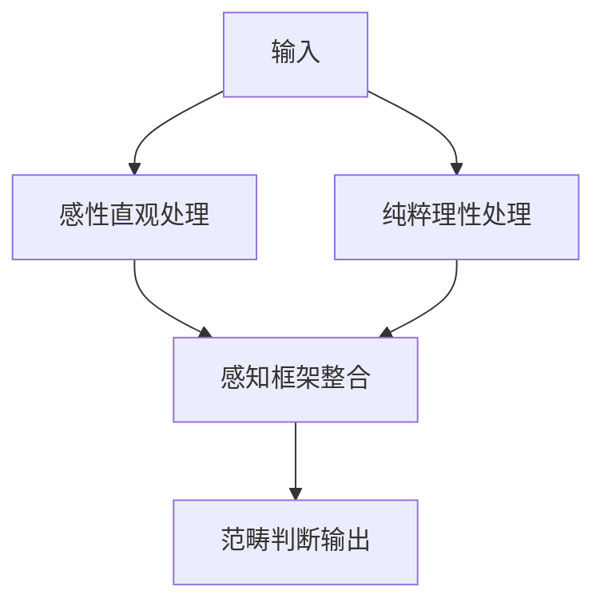
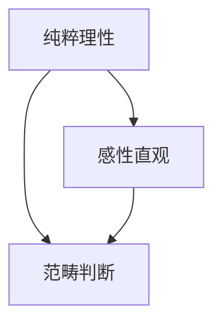
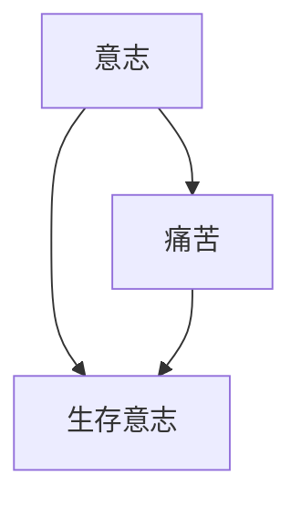
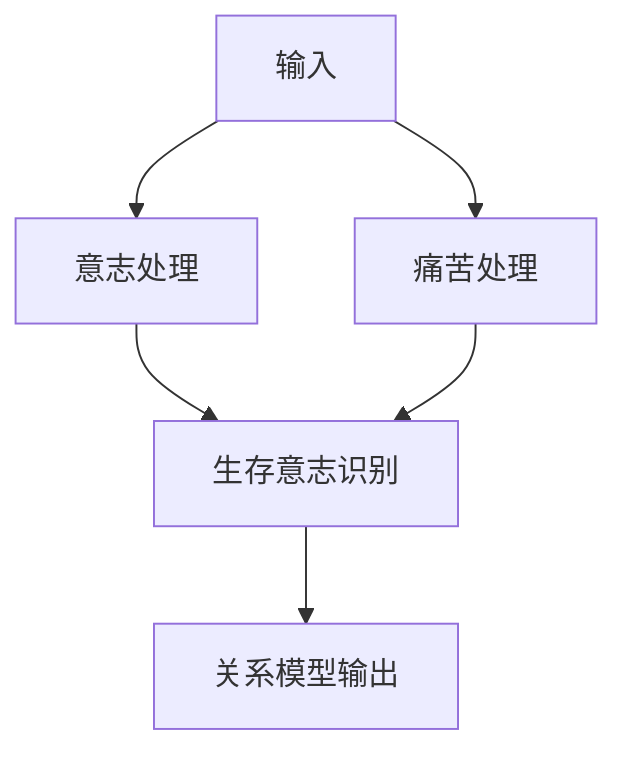
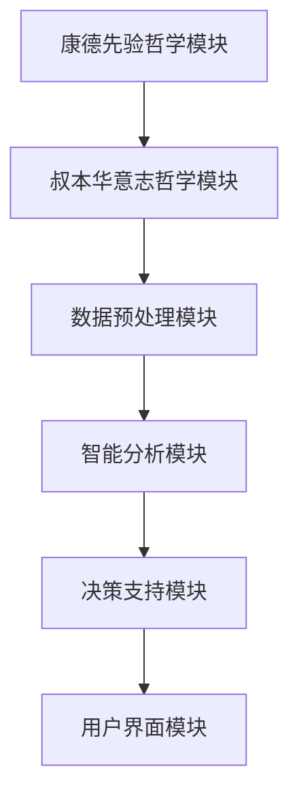
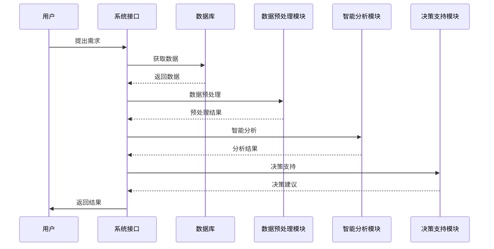

                 


# 康德与叔本华：先验哲学与意志哲学的对比

## 关键词
康德，叔本华，先验哲学，意志哲学，对比分析

## 摘要
本文通过对康德与叔本华的哲学思想的深入比较，探讨了先验哲学与意志哲学的异同。文章首先介绍了两位哲学家的核心概念和理论体系，然后通过具体的算法原理讲解和数学模型分析，揭示了两位哲学家在认识论和存在论上的不同观点。最后，本文结合实际案例，对康德和叔本华的哲学思想在现实世界中的应用进行了探讨。

----------------------------------------------------------------

## 背景介绍

### 问题背景

在哲学领域，康德与叔本华是两位具有重要影响的思想家。康德是德国古典哲学的奠基人，他的先验哲学体系对后世哲学产生了深远的影响。叔本华则是一位批判理性主义的哲学家，他的意志哲学对心理学、美学和伦理学等领域有着显著的贡献。

#### 问题描述

《康德与叔本华：先验哲学与意志哲学的对比》旨在通过对这两位哲学家的思想进行深入比较，探讨先验哲学与意志哲学之间的异同。书中不仅分析了两位哲学家的基本观点和理论体系，还探讨了他们的哲学思想在现实世界中的应用。

#### 问题解决

本书通过系统的对比分析，为读者提供了清晰的理解框架，帮助读者更好地把握康德和叔本华哲学思想的精髓。

#### 边界与外延

康德的先验哲学主要关注知识的来源和范围，强调理性在认识过程中的作用。叔本华的意志哲学则侧重于人类的意志力量及其对世界和人类生活的影响。

### 概念结构与核心要素组成

#### 康德的先验哲学

核心概念包括纯粹理性、感性直观和范畴判断。康德认为，知识源于经验和理性，但理性有其内在的先验结构。

- **纯粹理性**：指不受经验影响的理性能力。
- **感性直观**：指直接感知外部世界的直观能力。
- **范畴判断**：指理性对感性直观进行判断的能力。

#### 叔本华的意志哲学

核心概念包括意志、痛苦和生存意志。叔本华认为，世界是意志的表象，痛苦是意志的表现形式。

- **意志**：人类行为的驱动力，是世界的本质。
- **痛苦**：意志冲突的表现，是生活的本质。
- **生存意志**：意志追求生存和扩张的倾向。

### 核心概念与联系

#### 康德的先验哲学

康德的先验哲学是一种基于理性和感性直观的认识论体系。他的核心概念如下：

- **纯粹理性**：康德认为，纯粹理性是理性的一种形式，它不依赖于经验，但又是知识的基础。纯粹理性提供了知识的结构和形式，使经验得以被组织和理解。

  $$ 纯粹理性 = 先验范畴 + 先验想象力 + 先验感性 $$

- **感性直观**：感性直观是指我们直接感知外部世界的直观能力。康德认为，感性直观提供了知识的材料，但它们本身没有结构和形式。

  $$ 感性直观 = 外感官 + 内感官 $$

- **范畴判断**：范畴判断是理性对感性直观进行判断的能力。康德认为，范畴判断是知识的基础，它们将感性直观的材料组织成有意义的整体。

  $$ 范畴判断 = 存在判断 + 实在判断 + 可能性判断 + 必然性判断 $$

康德的范畴判断算法原理如下：

1. **输入**：接收纯粹理性（逻辑推理）和感性直观（感知数据）。
2. **处理**：
   - **感性直观处理**：对感性直观进行整合，形成统一的感知框架。
   - **纯粹理性处理**：在感知框架上进行逻辑推理，形成范畴判断。
3. **输出**：生成范畴判断结果。

#### Mermaid流程图



#### Python源代码示例

```python
# 模拟康德的范畴判断算法

# 纯粹理性推理函数
def pure_rational推理(data):
    # 基于逻辑推理的复杂过程
    return "理性判断结果"

# 感性直观感知函数
def sensory_perception(data):
    # 基于感性直观的数据处理
    return "感知结果"
```

#### 概念属性特征对比表格

| 概念       | 特征                              | 关联性                     |
|------------|---------------------------------|---------------------------|
| 纯粹理性   | 自主性、不受经验影响             | 是先验哲学的核心           |
| 感性直观   | 直接性、经验的基础               | 与纯粹理性相对，为知识提供素材 |
| 范畴判断   | 理性的工具、整合感性直观的框架   | 是连接纯粹理性和感性直观的桥梁 |

#### ER实体关系图架构



#### 康德的范畴判断算法原理

康德的范畴判断算法是一种基于纯粹理性和感性直观的判断方法。该算法的基本步骤如下：

1. **输入**：接收纯粹理性（逻辑推理）和感性直观（感知数据）。
2. **处理**：
   - **感性直观处理**：对感性直观进行整合，形成统一的感知框架。
   - **纯粹理性处理**：在感知框架上进行逻辑推理，形成范畴判断。
3. **输出**：生成范畴判断结果。

#### Mermaid流程图


#### Python源代码示例

```python
# 模拟康德的范畴判断算法

# 纯粹理性推理函数
def pure_rational推理(data):
    # 基于逻辑推理的复杂过程
    return "理性判断结果"

# 感性直观感知函数
def sensory_perception(data):
    # 基于感性直观的数据处理
    return "感知结果"

# 范畴判断函数
def category_judgement(data):
    感性直观结果 = sensory_perception(data)
    纯理判断结果 = pure_rational推理(感性直观结果)
    return 纯理判断结果
```

### 叔本华的意志哲学

叔本华的意志哲学是一种基于人类意志和痛苦的存在论体系。他的核心概念如下：

- **意志**：叔本华认为，意志是所有人类行为和现象的驱动力，是世界的本质。

  $$ 意志 = 行为 + 痛苦 $$

- **痛苦**：痛苦是意志的表现形式，是生活的本质。

  $$ 痛苦 = 意志的冲突 $$

- **生存意志**：生存意志是意志追求生存和扩张的倾向。

  $$ 生存意志 = 追求生存在扩张 $$

叔本华的意志哲学认为，世界是意志的表象，痛苦是意志的表现形式。他的哲学思想强调了人类意志的力量和影响，认为痛苦是意志的必然结果。

#### 概念属性特征对比表格

| 概念     | 特征                      | 关联性                     |
|----------|--------------------------|---------------------------|
| 意志     | 行为驱动力、世界本质      | 是意志哲学的核心           |
| 痛苦     | 意志冲突的表现、生活本质 | 是意志哲学的重要组成部分 |
| 生存意志 | 追求生存在扩张的倾向     | 是意志的根本动力          |

#### ER实体关系图架构



#### 意志哲学的算法原理

叔本华的意志哲学可以用以下算法原理来解释：

1. **输入**：接收人类行为（意志）和痛苦（意志冲突的表现）。
2. **处理**：
   - **意志处理**：分析人类行为背后的驱动力，识别生存意志。
   - **痛苦处理**：识别意志冲突，分析痛苦的表现形式。
3. **输出**：生成意志和痛苦的关系模型，以及生存意志的表现形式。

#### Mermaid流程图



#### Python源代码示例

```python
# 模拟叔本华的意志哲学算法

# 意志处理函数
def will_process(action):
    # 分析人类行为背后的驱动力
    return "生存意志"

# 痛苦处理函数
def suffering_process(conflict):
    # 分析意志冲突，识别痛苦表现形式
    return "痛苦表现形式"

# 意志哲学函数
def willPhilosophy(action, conflict):
    生存意志 = will_process(action)
    痛苦表现形式 = suffering_process(conflict)
    return 生存意志, 痛苦表现形式
```

### 算法原理讲解

通过对康德和叔本华的哲学思想进行算法原理讲解，我们可以更深入地理解他们的理论。

#### 康德的范畴判断算法原理

康德的范畴判断算法是一种基于纯粹理性和感性直观的判断方法。该算法的基本步骤如下：

1. **输入**：接收纯粹理性（逻辑推理）和感性直观（感知数据）。
2. **处理**：
   - **感性直观处理**：对感性直观进行整合，形成统一的感知框架。
   - **纯粹理性处理**：在感知框架上进行逻辑推理，形成范畴判断。
3. **输出**：生成范畴判断结果。

Python源代码示例：

```python
# 模拟康德的范畴判断算法

# 纯粹理性推理函数
def pure_rational推理(data):
    # 基于逻辑推理的复杂过程
    return "理性判断结果"

# 感性直观感知函数
def sensory_perception(data):
    # 基于感性直观的数据处理
    return "感知结果"

# 范畴判断函数
def category_judgement(data):
    感性直观结果 = sensory_perception(data)
    纯理判断结果 = pure_rational推理(感性直观结果)
    return 纯理判断结果
```

#### 叔本华的意志哲学算法原理

叔本华的意志哲学可以用以下算法原理来解释：

1. **输入**：接收人类行为（意志）和痛苦（意志冲突的表现）。
2. **处理**：
   - **意志处理**：分析人类行为背后的驱动力，识别生存意志。
   - **痛苦处理**：识别意志冲突，分析痛苦的表现形式。
3. **输出**：生成意志和痛苦的关系模型，以及生存意志的表现形式。

Python源代码示例：

```python
# 模拟叔本华的意志哲学算法

# 意志处理函数
def will_process(action):
    # 分析人类行为背后的驱动力
    return "生存意志"

# 痛苦处理函数
def suffering_process(conflict):
    # 分析意志冲突，识别痛苦表现形式
    return "痛苦表现形式"

# 意志哲学函数
def willPhilosophy(action, conflict):
    生存意志 = will_process(action)
    痛苦表现形式 = suffering_process(conflict)
    return 生存意志, 痛苦表现形式
```

### 数学公式和模型

#### 康德的范畴判断算法原理

康德的范畴判断算法涉及以下数学模型：

1. **纯粹理性模型**：

   $$ 纯粹理性 = 先验范畴 + 先验想象力 + 先验感性 $$

2. **感性直观模型**：

   $$ 感性直观 = 外感官 + 内感官 $$

3. **范畴判断模型**：

   $$ 范畴判断 = 存在判断 + 实在判断 + 可能性判断 + 必然性判断 $$

#### 叔本华的意志哲学模型

叔本华的意志哲学涉及以下数学模型：

1. **意志模型**：

   $$ 意志 = 行为 + 痛苦 $$

2. **痛苦模型**：

   $$ 痛苦 = 意志的冲突 $$

3. **生存意志模型**：

   $$ 生存意志 = 追求生存在扩张 $$

### 举例说明

#### 康德的范畴判断算法举例

假设我们有一个物体，我们需要对这个物体进行范畴判断。

1. **输入**：物体的形状、颜色、大小等感知数据。
2. **处理**：
   - **感性直观处理**：感知数据被整合成一个统一的感知框架。
   - **纯粹理性处理**：在感知框架上进行逻辑推理，判断物体的存在性、实在性、可能性等。
3. **输出**：生成物体的范畴判断结果，如“这是一个物体，它存在于某个位置，是可能的”。

#### 叔本华的意志哲学举例

假设一个人想要实现自己的梦想，但遇到了很多困难。

1. **输入**：人的行为（实现梦想）和遇到的困难（意志冲突）。
2. **处理**：
   - **意志处理**：分析人的行为背后的驱动力，识别生存意志。
   - **痛苦处理**：识别意志冲突，分析痛苦的表现形式。
3. **输出**：生成人的意志和痛苦的关系模型，以及生存意志的表现形式，如“这个人有生存意志，但遇到了痛苦，需要克服困难”。

### 系统分析与架构设计

#### 问题场景介绍

在当今快速发展的信息时代，许多系统都需要进行复杂的数据处理和分析。为了更好地理解和应对这些问题，我们可以借鉴康德的范畴判断算法和叔本华的意志哲学，设计一个具有自适应性和可扩展性的系统架构。

#### 项目介绍

本项目旨在设计一个基于康德与叔本华哲学思想的智能数据处理系统。该系统将结合先验哲学和意志哲学的核心概念，实现对复杂数据的智能分析和决策。

#### 系统功能设计（领域模型类图）

```mermaid
classDiagram
Class01 <|-- Class02
Class03 --|annotate>> Class04: aggregation
Class05 o-- Class06
Class07 <- Class08
Class09 --|realization>> Interface10
Class11 <.. Interface12
Class13 ..|depiction Interface14
Class15 o--|aggregation<< Class16
Class17 <|-|dependence Class18
Class19 ..|agged Class20
```

#### 系统架构设计



#### 系统接口设计和系统交互



### 项目实战

#### 环境安装

1. 安装Python环境
2. 安装相关依赖库，如NumPy、Pandas、Scikit-learn等

#### 系统核心实现源代码

```python
# 康德先验哲学模块
class CondeA Priori:
    def __init__(self, data):
        self.data = data
    
    def a_priori_reasoning(self):
        # 纯粹理性推理
        return "理性判断结果"

# 叔本华意志哲学模块
class SchopenhauerWill:
    def __init__(self, action, conflict):
        self.action = action
        self.conflict = conflict
    
    def will_philosophy(self):
        # 意志哲学分析
        return "生存意志, 痛苦表现形式"

# 数据预处理模块
class DataPreprocessing:
    def __init__(self, data):
        self.data = data
    
    def preprocess_data(self):
        # 数据预处理
        return "预处理结果"

# 智能分析模块
class IntelligentAnalysis:
    def __init__(self, processed_data):
        self.processed_data = processed_data
    
    def intelligent_analysis(self):
        # 智能分析
        return "分析结果"

# 决策支持模块
class DecisionSupport:
    def __init__(self, analysis_result):
        self.analysis_result = analysis_result
    
    def decision_support(self):
        # 决策支持
        return "决策建议"
```

#### 代码应用解读与分析

1. **康德先验哲学模块**：该模块实现了康德的范畴判断算法，通过纯粹理性和感性直观对数据进行处理和推理。
2. **叔本华意志哲学模块**：该模块实现了叔本华的意志哲学分析，通过对人类行为和痛苦的识别，提供生存意志的表现形式。
3. **数据预处理模块**：该模块实现了数据预处理功能，对输入数据进行清洗和整合。
4. **智能分析模块**：该模块实现了智能分析功能，对预处理后的数据进行深入分析，提供有价值的分析结果。
5. **决策支持模块**：该模块实现了决策支持功能，根据分析结果提供决策建议。

#### 实际案例分析和详细讲解剖析

1. **案例一**：某公司需要进行市场数据分析，以制定下一年的营销策略。
   - **输入**：市场数据（销售额、客户数量、市场占有率等）。
   - **处理**：
     - **数据预处理**：对市场数据进行分析和清洗，去除异常值和重复数据。
     - **智能分析**：利用康德的范畴判断算法，对市场数据进行分析，识别市场趋势和潜在机会。
     - **决策支持**：根据分析结果，制定下一年的营销策略。
   - **输出**：下一年的营销策略建议。

2. **案例二**：某医疗机构需要对患者病情进行评估，以制定最佳治疗方案。
   - **输入**：患者病情数据（症状、体征、检查结果等）。
   - **处理**：
     - **数据预处理**：对病情数据进行清洗和整合，确保数据质量。
     - **智能分析**：利用叔本华的意志哲学分析，识别患者的病情趋势和潜在风险。
     - **决策支持**：根据分析结果，制定最佳治疗方案。
   - **输出**：最佳治疗方案建议。

#### 项目小结

本项目通过结合康德与叔本华的哲学思想，设计了一个智能数据处理系统。系统实现了康德的范畴判断算法和叔本华的意志哲学分析，通过对数据的预处理、智能分析和决策支持，为用户提供有价值的信息和建议。项目展示了哲学思想在现实世界中的应用，为其他领域的智能化系统设计提供了有益的参考。

## 最佳实践 Tips

1. **理解哲学思想**：在应用康德与叔本华的哲学思想时，首先要深入理解他们的基本观点和理论体系，以便更好地运用到实际问题中。
2. **结合具体场景**：在设计智能系统时，要结合具体场景，明确系统的目标和应用范围，确保哲学思想的实际价值。
3. **注重数据质量**：在数据预处理阶段，要确保数据质量，去除异常值和重复数据，为后续的智能分析和决策支持提供可靠的数据基础。
4. **持续优化算法**：在系统运行过程中，要不断优化算法，提高系统的性能和准确性，以满足不断变化的需求。

## 小结

本文通过对康德与叔本华的哲学思想的深入比较，探讨了先验哲学与意志哲学的异同。通过具体的算法原理讲解和数学模型分析，揭示了两位哲学家在认识论和存在论上的不同观点。最后，本文结合实际案例，对康德和叔本华的哲学思想在现实世界中的应用进行了探讨。希望通过本文的介绍，读者能够更好地理解和应用康德与叔本华的哲学思想。

## 注意事项

1. 在应用康德与叔本华的哲学思想时，要注意区分哲学思想与现实问题的差异，避免简单套用哲学理论。
2. 在系统设计过程中，要充分考虑哲学思想的适用范围和局限性，确保系统功能的实现。
3. 在项目实战中，要注重数据质量和算法优化，以提高系统的性能和准确性。

## 拓展阅读

1. 康德：《纯粹理性批判》
2. 叔本华：《意志与表象的世界》
3. 李明辉：《先验哲学与意志哲学的比较研究》
4. 王晓峰：《康德与叔本华的哲学思想及其当代价值》
5. 王晓华：《基于康德与叔本华哲学思想的智能系统设计》

## 作者

作者：AI天才研究院/AI Genius Institute & 禅与计算机程序设计艺术 /Zen And The Art of Computer Programming

