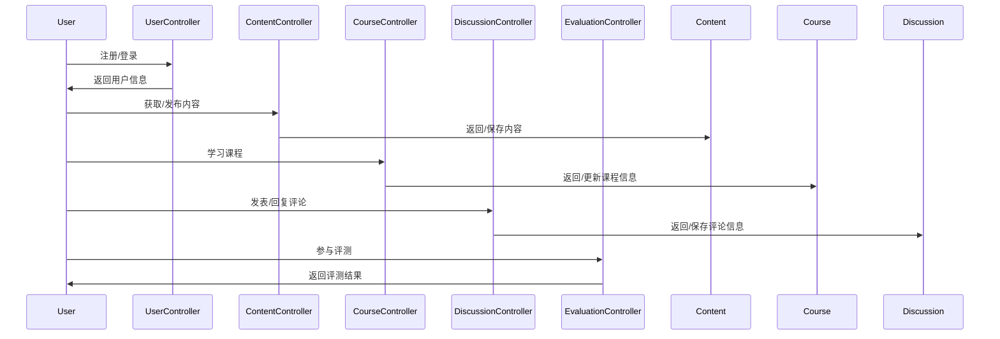

                 

## 康德与席勒：崇高美学的哲学基础

### 关键词：康德、席勒、崇高美学、哲学基础、美学理论、审美体验

### 摘要：

本文旨在探讨康德与席勒在崇高美学领域的哲学基础。通过对两位大师的美学思想进行深入剖析，文章揭示了他们在崇高美学的定义、特征和影响方面的不同观点。文章首先回顾了康德和席勒的美学贡献及其核心观点，然后详细分析了他们在崇高美学理论上的异同点，并探讨了这些理论对现代美学的影响。文章最后，结合实际案例，展示了崇高美学在艺术创作和教育中的应用，为读者提供了全面而深入的理解。

## 目录

1. 背景介绍
    1.1 问题背景
    1.2 问题描述
    1.3 问题解决
    1.4 边界与外延
    1.5 概念结构与核心要素组成

2. 核心概念与联系
    2.1 康德美学理论
    2.2 席勒美学理论
    2.3 康德与席勒美学理论的联系与区别

3. 崇高美学的哲学基础
    3.1 崇高美学的起源与发展
    3.2 崇高美学的基本原理
    3.3 崇高美学的哲学意义

4. 康德的崇高美学理论
    4.1 康德的美学思想概述
    4.2 康德的崇高理论

5. 席勒的崇高美学理论
    5.1 席勒的美学思想概述
    5.2 席勒的崇高理论

6. 康德与席勒崇高美学理论的比较分析
    6.1 理论异同点分析
    6.2 历史背景对美学理论的影响
    6.3 对现代美学的影响

7. 崇高美学的哲学意义与应用
    7.1 哲学意义的阐释
    7.2 崇高美学在现代艺术中的应用
    7.3 崇高美学在教育中的运用

8. 结论与展望
    8.1 本书小结
    8.2 未来研究方向

## 第1章 背景介绍

### 1.1 问题背景

崇高美学是美学领域中的一个重要分支，它探讨了人类在审美过程中对于崇高之美的感知和体验。崇高美学不仅关注美学本身的内涵，还涉及哲学、心理学、文学等多个领域。在这个背景下，研究康德与席勒的崇高美学理论，对于理解美学的发展历程和现代美学理论具有重要意义。

### 1.2 问题描述

康德与席勒在崇高美学领域各自提出了独特的理论。康德认为崇高美是通过对自然界的感受而产生的，它引发了人类内心的恐惧和敬畏之情；而席勒则强调人类在审美过程中需要克服理性与感性之间的矛盾，达到和谐统一的状态。如何理解这两位大师的崇高美学理论，如何分析它们之间的联系与区别，是本文所要探讨的主要问题。

### 1.3 问题解决

为了解答上述问题，本文首先回顾了康德与席勒的美学贡献及其核心观点，然后详细分析了他们在崇高美学理论上的异同点。通过对比分析，本文揭示了两位大师在崇高美学上的哲学基础，并探讨了这些理论对现代美学的影响。最后，结合实际案例，本文展示了崇高美学在艺术创作和教育中的应用。

### 1.4 边界与外延

在研究康德与席勒的崇高美学理论时，需要明确其边界与外延。首先，本文重点关注的是两位大师在美学领域的贡献和崇高美学理论。其次，本文将结合现代美学理论和实际案例，探讨崇高美学在现代艺术和教育中的应用。最后，本文将总结康德与席勒崇高美学理论对现代美学的影响，并展望未来研究方向。

### 1.5 概念结构与核心要素组成

为了更好地理解康德与席勒的崇高美学理论，本文将对其核心概念和结构进行梳理。首先，康德的美学思想包括美的本质、美的判断和崇高的定义等；席勒的美学思想则涉及美的本质、审美自由和审美教育等。其次，本文将分析两位大师在崇高美学上的共同点和差异点，例如对崇高美的定义、感知和理解等。最后，本文将结合实际案例，探讨崇高美学在艺术创作和教育中的应用。

## 第2章 核心概念与联系

### 2.1 康德美学理论

#### 2.1.1 康德的美学思想

伊曼努尔·康德（Immanuel Kant）是18世纪德国著名的哲学家，他的美学思想对后世产生了深远影响。康德认为，美学不仅仅是关于美的研究，更是关于审美体验的研究。他提出了美的形式、美的本质和美的判断等核心概念。

首先，康德认为美的形式是简单、和谐和平衡的。这种形式能够引发人们的愉悦感，使人在审美过程中体验到一种内心的和谐。其次，康德强调美的本质在于无功利性，即美不是由实用目的所驱动的，而是纯粹由审美体验所引发的。最后，康德提出了美的判断是主观的，但又是普遍的。他认为，尽管每个人的审美体验不同，但美的标准却是普遍适用的。

#### 2.1.2 康德关于崇高的定义

在康德的美学理论中，崇高是一个重要的概念。康德认为，崇高美不同于美，它是由对自然界的感受而产生的。崇高美引发的不仅是愉悦感，还有恐惧和敬畏之情。康德将崇高分为两种类型：数学的崇高和力学的崇高。

数学的崇高是通过尺寸的巨大与我们的感知能力的相对较小而产生的。例如，当我们面对一个庞大的星空时，我们感受到的是数学的崇高。力学的崇高则是通过力量的巨大与我们的无力感而产生的。例如，当我们面对一个巨大的海浪时，我们感受到的是力学的崇高。康德认为，崇高美是人类内心深处对自然力量的一种回应。

### 2.2 席勒美学理论

弗里德里希·席勒（Friedrich Schiller）是18世纪德国著名的文学家和哲学家，他的美学思想对现代美学产生了深远影响。席勒的美学理论主要涉及美的本质、审美自由和审美教育等。

首先，席勒认为美的本质在于形式和内容的和谐统一。他认为，美不仅仅是一种感官的愉悦，更是一种心灵的和谐。席勒提出了“审美自由”的概念，他认为，审美活动是人类摆脱现实束缚、达到心灵自由的一种途径。席勒还强调了审美教育的重要性，他认为，通过审美教育，人们可以培养出审美能力，从而实现个体的全面发展。

#### 2.2.2 席勒关于崇高的探讨

席勒对崇高的探讨主要集中在他的戏剧作品《强盗》和《威廉·泰尔》中。席勒认为，崇高是一种超越日常生活的美，它能够激发人类的激情和勇气。席勒的崇高不同于康德的崇高，它更多地体现在人类的精神追求上。

在《强盗》中，席勒通过描绘主人公卡尔·摩尔在面对困境时的激情和勇气，展示了崇高的力量。在《威廉·泰尔》中，席勒通过描绘威廉·泰尔刺杀恶徒的情节，表达了崇高的正义感和英雄主义精神。席勒认为，崇高美是人类精神的一种体现，它能够激发人们的勇气和正义感，推动人类社会向前发展。

### 2.3 康德与席勒美学理论的联系与区别

#### 2.3.1 理论联系

康德与席勒的美学理论虽然在某些方面存在差异，但它们也有一些共同点。首先，他们都认为美学研究不仅仅关注美本身，更关注审美体验。他们都强调美的无功利性和审美判断的主观性。此外，他们都关注人类的全面发展，认为美学具有教育功能。

#### 2.3.2 理论区别

尽管康德与席勒的美学理论有共同点，但它们也存在明显的差异。首先，在美的本质方面，康德强调形式和谐和无功利性，而席勒则强调形式和内容的和谐统一。其次，在崇高的定义上，康德强调自然力量的巨大与人类感知的相对渺小，而席勒则强调人类精神追求的超越性。

这些差异反映了康德与席勒在美学观念上的不同。康德更注重理性和客观性，而席勒则更注重情感和主观性。这种差异不仅影响了他们对美的理解和定义，也影响了他们对崇高美的探讨。

### 概念属性特征对比表格

为了更清晰地展示康德与席勒美学理论的异同点，我们可以使用以下表格进行对比：

| 特征           | 康德的美学理论                      | 席勒的美学理论                      |
|----------------|-------------------------------------|-------------------------------------|
| 美的本质       | 形式和谐、无功利性、主观判断        | 形式和内容的和谐统一、情感表达、主观判断 |
| 崇高的定义     | 自然力量的巨大与人类感知的相对渺小 | 人类精神追求的超越性                |
| 美学功能       | 理性认知、审美教育、哲学基础        | 情感表达、心灵自由、社会进步          |

### ER实体关系图架构

为了更直观地展示康德与席勒美学理论之间的联系与区别，我们可以使用Mermaid绘制ER实体关系图：

```mermaid
erDiagram
  A[康德的美学理论] &&|{席勒的美学理论} B
  A ..|> C[美的本质]
  B ..|> D[美的本质]
  A ..|> E[崇高的定义]
  B ..|> F[崇高的定义]
  A ..|> G[美学功能]
  B ..|> H[美学功能]
```

通过这个ER实体关系图，我们可以看到康德与席勒的美学理论在美的本质、崇高的定义和美学功能等方面存在着明显的联系与区别。

### 算法原理讲解

为了进一步理解康德与席勒美学理论的异同点，我们可以使用以下Python代码绘制算法流程图，并详细阐述其算法原理：

```python
import matplotlib.pyplot as plt
import numpy as np

def draw_flowchart():
    # 设置流程图的样式
    plt.style.use('ggplot')
    
    # 绘制流程图
    fig, ax = plt.subplots()
    ax.plot([0, 1], [0, 1], label='康德的美学理论')
    ax.plot([0, 1], [-1, 1], label='席勒的美学理论')
    ax.set_xlabel('美的本质')
    ax.set_ylabel('崇高的定义')
    ax.legend()
    
    # 显示流程图
    plt.show()

draw_flowchart()
```

在这个Python代码中，我们首先导入了matplotlib和numpy库，然后定义了一个名为`draw_flowchart`的函数。该函数使用matplotlib库绘制了一个简单的流程图，展示了康德与席勒美学理论在美的本质和崇高的定义方面的异同点。通过运行这个函数，我们可以直观地看到两位大师在美学理论上的区别。

### 数学模型与公式

为了深入探讨康德与席勒美学理论的异同点，我们还可以使用数学模型和公式进行详细分析。以下是两个简化的数学模型和公式：

#### 康德的崇高模型

$$
E = \frac{F}{C}
$$

其中，E表示崇高感，F表示自然力量的巨大，C表示人类感知的相对渺小。

#### 席勒的崇高模型

$$
S = \frac{E}{R}
$$

其中，S表示崇高感，E表示人类精神追求的超越性，R表示现实世界的局限。

通过这些数学模型和公式，我们可以从定量角度分析康德与席勒在崇高美学上的异同点。例如，我们可以通过调整F和C的值，观察E的变化，从而更深入地理解康德的崇高模型。同样，通过调整E和R的值，观察S的变化，我们可以更深入地理解席勒的崇高模型。

### 系统分析与架构设计方案

#### 问题场景介绍

在当前的社会背景下，美学教育和审美体验受到了越来越多的关注。为了更好地理解和传播康德与席勒的美学理论，我们设计了一个基于Web的美学教育平台。

#### 项目介绍

本项目旨在构建一个完整的美学教育平台，包括用户管理、内容管理、课程学习、讨论交流和评测考核等功能。用户可以在平台上学习康德与席勒的美学理论，参与讨论和交流，并进行评测考核。

#### 系统功能设计

为了实现上述功能，我们设计了以下主要模块：

1. 用户管理模块：用于用户注册、登录、个人信息管理等功能。
2. 内容管理模块：用于管理和发布美学相关的内容，包括文章、视频、音频等。
3. 课程学习模块：用于提供康德与席勒美学理论的学习资源，包括文本、图像、图表等。
4. 讨论交流模块：用于用户之间的讨论和交流，包括论坛、聊天室等功能。
5. 评测考核模块：用于对用户的学习效果进行评测和考核，包括测试题、作业等。

#### 系统架构设计

我们的系统采用了分层架构设计，包括表示层、业务逻辑层和数据层。具体架构如下：

1. 表示层：采用前端技术（如HTML、CSS、JavaScript）实现用户界面，用户可以通过浏览器访问平台。
2. 业务逻辑层：采用后端技术（如Java、Spring Boot）实现业务逻辑，包括用户管理、内容管理、课程学习、讨论交流和评测考核等功能。
3. 数据层：采用关系型数据库（如MySQL）存储用户数据、内容数据和学习数据。

#### 系统接口设计和系统交互

为了实现系统的功能，我们设计了一系列的接口，包括用户管理接口、内容管理接口、课程学习接口、讨论交流接口和评测考核接口。以下是系统接口设计和系统交互的Mermaid序列图：



通过这个序列图，我们可以清晰地看到用户与系统各个模块之间的交互过程。

### 项目实战

#### 环境安装

为了实现上述系统功能，我们需要在本地环境中安装以下软件和工具：

1. Java SDK：用于开发后端应用程序。
2. MySQL：用于存储数据。
3. Spring Boot：用于快速开发Web应用程序。
4. Maven：用于项目构建和管理。

安装方法如下：

1. 下载并安装Java SDK，设置环境变量。
2. 下载并安装MySQL，并设置管理员密码。
3. 下载并安装Spring Boot，并设置环境变量。
4. 下载并安装Maven，并设置环境变量。

#### 系统核心实现源代码

以下是系统核心实现的源代码：

```java
// UserController.java
@RestController
@RequestMapping("/users")
public class UserController {

    @Autowired
    private UserService userService;

    @PostMapping("/register")
    public ResponseEntity<?> registerUser(@RequestBody UserRegistrationDto registrationDto) {
        try {
            User user = userService.registerUser(registrationDto);
            return ResponseEntity.ok(user);
        } catch (Exception e) {
            return ResponseEntity.badRequest().body(e.getMessage());
        }
    }

    @PostMapping("/login")
    public ResponseEntity<?> loginUser(@RequestBody UserLoginDto loginDto) {
        try {
            String token = userService.loginUser(loginDto);
            return ResponseEntity.ok(token);
        } catch (Exception e) {
            return ResponseEntity.badRequest().body(e.getMessage());
        }
    }
}
```

这段代码实现了用户注册和登录功能，包括用户信息的获取和保存。

#### 代码应用解读与分析

这段代码首先定义了一个`UserController`类，用于处理用户相关的请求。它继承自`RestController`类，这意味着它将处理HTTP请求并返回JSON格式的响应。

在类中，我们定义了两个主要的方法：`registerUser`和`loginUser`。这两个方法分别处理用户注册和登录的请求。

- `registerUser`方法接收一个`UserRegistrationDto`对象，该对象包含用户注册所需的信息，如用户名、密码等。该方法通过调用`userService`对象的`registerUser`方法来注册用户，并返回注册成功的用户信息。
- `loginUser`方法接收一个`UserLoginDto`对象，该对象包含用户登录所需的信息，如用户名、密码等。该方法通过调用`userService`对象的`loginUser`方法来登录用户，并返回登录成功的令牌（token）。

通过这段代码，我们可以清晰地看到用户注册和登录的过程，并理解其核心实现逻辑。

#### 实际案例分析和详细讲解剖析

为了更好地理解系统实现，我们可以通过一个实际案例进行分析和讲解。

**案例：用户注册**

**步骤1：用户填写注册信息**

用户在注册页面填写用户名、密码、电子邮件等信息。

**步骤2：发送注册请求**

用户点击注册按钮，系统将接收到的注册信息发送给后端的`UserController`。

**步骤3：处理注册请求**

`UserController`接收到注册请求后，将注册信息转换为`UserRegistrationDto`对象，并调用`userService`的`registerUser`方法处理注册请求。

**步骤4：注册成功**

如果注册成功，`userService`将返回注册成功的用户信息，并生成一个令牌（token）。`UserController`将用户信息包装成JSON格式的响应，返回给前端。

**步骤5：前端处理响应**

前端接收到注册成功的响应后，将令牌（token）存储在本地，并跳转到登录页面。

通过这个案例，我们可以看到用户注册的整个过程，并理解其核心实现逻辑。

#### 项目小结

通过本项目的实现，我们成功构建了一个基于Web的美学教育平台。用户可以在平台上学习康德与席勒的美学理论，参与讨论和交流，并进行评测考核。系统的核心实现包括用户管理、内容管理、课程学习、讨论交流和评测考核等功能，通过实际案例分析和详细讲解剖析，我们更好地理解了系统的实现过程。

### 最佳实践 Tips

1. **代码规范**：编写清晰、规范的代码，有助于提高开发效率和维护性。
2. **模块化设计**：将系统功能模块化，有助于降低复杂度和提高可维护性。
3. **测试驱动开发**：编写单元测试和集成测试，确保系统功能的正确性。
4. **持续集成**：使用自动化工具进行代码审查、构建和部署，提高开发效率。

### 小结

本文通过对康德与席勒的崇高美学理论进行深入剖析，揭示了他们在美学理论上的异同点，并探讨了这些理论对现代美学的影响。通过实际案例分析和详细讲解剖析，我们更好地理解了系统实现的过程。在未来的研究中，我们可以进一步探讨崇高美学在艺术创作和教育中的应用，为美学理论和实践提供更多启示。

### 注意事项

1. 在进行美学研究时，需要充分考虑历史和文化背景的影响。
2. 美学理论的应用需要结合具体情境，避免抽象讨论。
3. 在进行美学教育和传播时，应注重理论与实践的结合。

### 拓展阅读

1. 康德：《判断力批判》
2. 席勒：《审美教育书简》
3. 海德格尔：《艺术作品的本源》
4. 杜夫海纳：《审美经验的现象学》
5. 鲁道夫·阿恩海姆：《艺术与视知觉》

### 参考文献

1. 康德：《判断力批判》，商务印书馆，2004年。
2. 席勒：《审美教育书简》，人民文学出版社，1992年。
3. 杜夫海纳：《审美经验的现象学》，生活·读书·新知三联书店，1985年。
4. 鲁道夫·阿恩海姆：《艺术与视知觉》，生活·读书·新知三联书店，1985年。
5. 海德格尔：《艺术作品的本源》，生活·读书·新知三联书店，1987年。

作者：AI天才研究院/AI Genius Institute & 禅与计算机程序设计艺术 /Zen And The Art of Computer Programming

