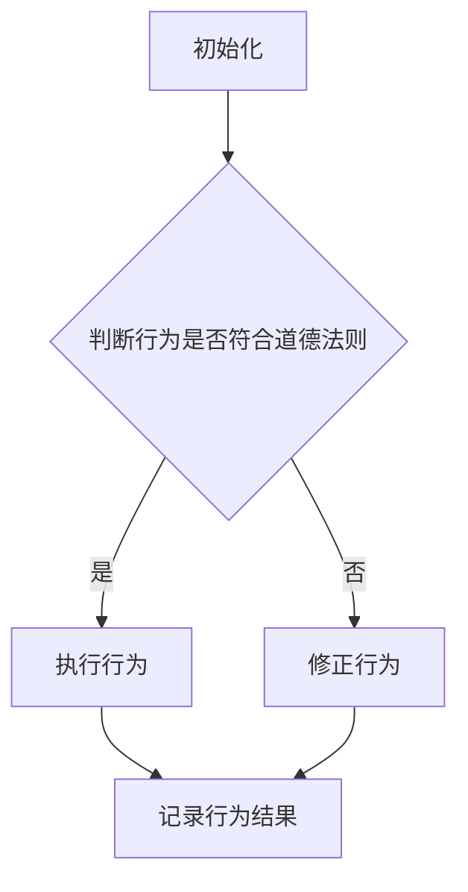
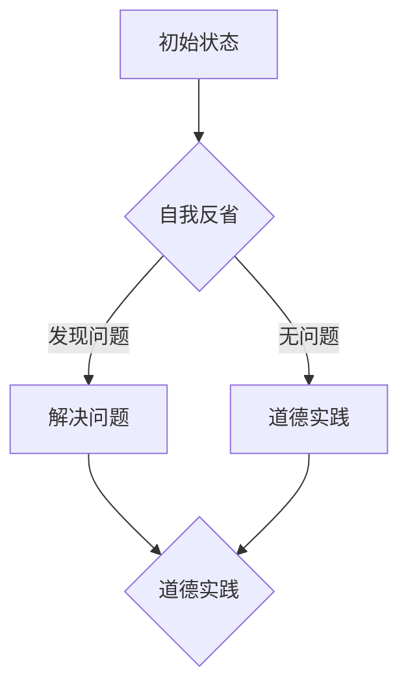
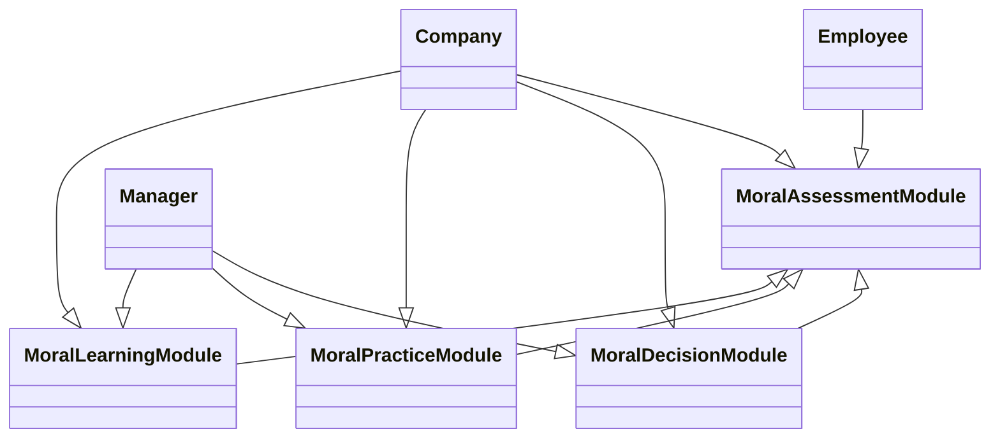
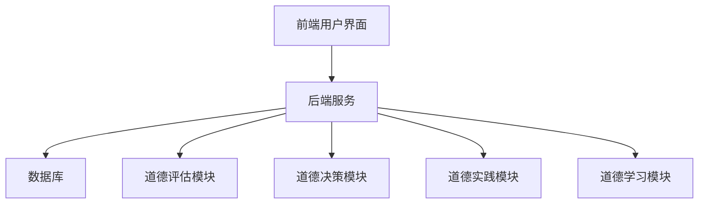
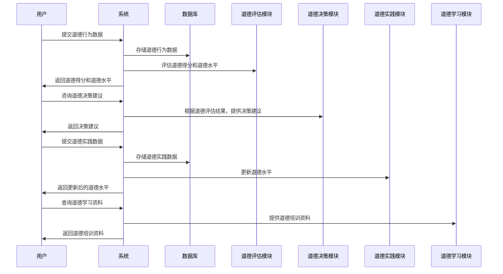

                 


### 导论

#### 1.1 研究背景与意义

**康德伦理学的影响与地位**

康德伦理学是西方伦理学领域的重要流派之一，其影响深远，对现代伦理学产生了重要影响。康德的伦理思想以其逻辑严密、理性主义和普适性而著称，被誉为“伦理学的现代之父”。康德提出了道德自律的概念，强调道德行为基于理性的指导，而非感性的冲动。他的道德哲学体系包括义务论、实践理性、道德法则等核心原则，为人们理解和实践道德提供了坚实的理论基础。

**王阳明心学在中国哲学中的地位**

王阳明心学是中国哲学史上的重要流派，其影响遍及哲学、心理学、教育学等多个领域。王阳明认为，“知行合一”是道德实践的根本原则，强调知识和行动的统一。他提出“致良知”的概念，认为人的良知是道德行为的源泉，通过内心的修炼和觉醒，人们可以明辨是非，实现道德自律。王阳明心学的核心理念对儒家伦理学进行了深刻的反思和发展，为中国人理解和实践道德提供了独特的视角。

**康德与王阳明伦理学比较研究的重要性**

康德与王阳明的伦理学理论在形式和内容上都有很大的不同，但二者都对道德哲学做出了重要贡献。比较研究康德与王阳明伦理学，可以揭示不同文化背景下道德观念的多样性，帮助我们更深入地理解道德的本质和道德实践的复杂性。此外，通过比较分析，我们可以找到二者的共同点，如对道德自律和道德责任的高度重视，同时也可以发现它们之间的差异，从而为现代伦理学的发展提供有益的启示。

#### 1.2 核心概念与理论体系

**康德伦理学的基本原理**

康德的伦理学理论以义务论为核心，强调道德行为的本质是基于理性的自律。康德认为，道德法则是由理性制定的普遍法则，人们应当遵守这些法则，无论结果如何。以下是康德伦理学的一些基本原理：

- **道德自律**：道德行为是基于理性的自律，而非感性的欲望或利益。
- **实践理性**：道德行为是实践理性的体现，理性指导人们做出道德决策。
- **道德法则**：道德法则是由理性制定的普遍法则，人们应当遵守这些法则。
- **绝对命令**：道德行为应当遵循绝对命令，即行为必须能够成为普遍法则。

**王阳明心学的核心理念**

王阳明心学强调知识和行动的统一，认为道德实践是通过内心的修炼和觉醒实现的。以下是王阳明心学的一些基本理念：

- **致良知**：通过内心的修炼和觉醒，明辨是非，实现道德自律。
- **知行合一**：知识和行动是不可分割的，只有知行合一，才能实现真正的道德实践。
- **良知**：人的良知是道德行为的源泉，良知引导人们做出正确的道德选择。

**康德与王阳明伦理学的联系与差异**

康德与王阳明的伦理学理论在形式和内容上都有很大的不同，但二者都对道德哲学做出了重要贡献。以下是二者的联系与差异：

- **联系**：康德与王阳明都强调道德自律和道德责任，认为道德行为应当基于理性或良知。
- **差异**：康德强调道德法则的普遍性和客观性，而王阳明强调道德实践的内心觉醒和主观能动性。

#### 1.3 研究方法与结构

**研究方法**

本文采用文献分析、比较研究和实证研究相结合的方法，通过深入分析康德与王阳明的伦理学理论，比较它们的形式和内容，探讨其在现代伦理学中的意义。

**全书结构概述**

本文分为七个章节，首先介绍研究背景和意义，然后分别阐述康德与王阳明的伦理学原理，接着分析二者的联系与差异，最后讨论伦理学理论在现实中的应用。

### 第1章 导论

**问题背景**

康德伦理学是西方伦理学领域的重要流派之一，其影响深远，对现代伦理学产生了重要影响。康德的伦理思想以其逻辑严密、理性主义和普适性而著称，被誉为“伦理学的现代之父”。康德提出了道德自律的概念，强调道德行为基于理性的指导，而非感性的冲动。他的道德哲学体系包括义务论、实践理性、道德法则等核心原则，为人们理解和实践道德提供了坚实的理论基础。

王阳明心学是中国哲学史上的重要流派，其影响遍及哲学、心理学、教育学等多个领域。王阳明认为，“知行合一”是道德实践的根本原则，强调知识和行动的统一。他提出“致良知”的概念，认为人的良知是道德行为的源泉，通过内心的修炼和觉醒，人们可以明辨是非，实现道德自律。王阳明心学的核心理念对儒家伦理学进行了深刻的反思和发展，为中国人理解和实践道德提供了独特的视角。

**问题描述**

康德与王阳明的伦理学理论在形式和内容上都有很大的不同，但二者都对道德哲学做出了重要贡献。本文旨在通过对比分析康德与王阳明伦理学，揭示其共同点和差异，为现代伦理学的发展提供有益的启示。

**问题解决**

通过对比分析，我们可以发现康德与王阳明伦理学的共同点在于都强调道德自律和道德责任。康德的伦理学以理性为基础，强调道德法则的普遍性和客观性；而王阳明心学则强调内心的觉醒和主观能动性，认为道德实践是通过内心的修炼实现的。二者的差异在于康德强调道德行为的规则性和普适性，而王阳明则更注重道德行为的个体性和内在体验。

**边界与外延**

本文的讨论范围包括康德与王阳明的核心理论、二者伦理思想的比较和影响。本文将深入分析康德伦理学的基本原理，如道德自律、实践理性和道德法则，以及王阳明心学的核心理念，如致良知、知行合一等。通过对比分析，本文将总结康德与王阳明伦理学的共同点和差异，探讨其在现代伦理学中的意义。

**概念结构与核心要素组成**

康德伦理学的基本原则包括道德自律、实践理性和道德法则。道德自律强调道德行为基于理性的指导，实践理性强调道德行为应当遵循理性的指导，道德法则是由理性制定的普遍法则。王阳明心学的核心理念包括致良知、知行合一。致良知强调通过内心的修炼和觉醒实现道德自律，知行合一强调知识和行动的统一。

### 第2章 康德伦理学原理

#### 2.1 道德自律

**2.1.1 自律的定义与意义**

道德自律是指个体在道德行为中遵循理性的指导，不受感性欲望和利益的驱动。自律不仅是道德行为的内在要求，也是道德品质的重要体现。康德认为，道德自律是道德行为的本质，是理性在道德领域的具体表现。

自律的定义与意义可以从以下几个方面进行理解：

1. **理性的指导**：道德自律强调道德行为应当基于理性的指导，而非感性的欲望或利益。理性作为道德行为的指南，使个体能够超越个体的感性冲动，做出符合道德规范的选择。

2. **道德品质的体现**：自律是道德品质的重要体现，是一个人在道德领域中的自我约束和自我管理能力。通过自律，个体能够培养出高尚的道德品质，如诚实、正直、宽容等。

3. **道德责任的体现**：道德自律是道德责任的体现，个体应当对自己的行为负责。通过自律，个体能够承担起道德责任，对自己的行为后果负责。

**2.1.2 道德自律的理论基础**

康德的道德自律理论建立在理性主义的基础上。他认为，道德行为应当基于理性，而非感性。理性是道德行为的最高指导原则，是道德法则的制定者和执行者。

康德的道德自律理论有以下几个方面的理论基础：

1. **实践理性**：实践理性是道德自律的核心，它是道德行为的指导原则。实践理性使个体能够理性地思考和决策，从而做出符合道德规范的选择。

2. **道德法则**：道德法则是道德自律的基础，是理性制定的普遍法则。道德法则规定了个体应当遵循的行为规范，使个体能够在道德行为中保持自律。

3. **绝对命令**：绝对命令是道德自律的最终依据，是道德行为的最高准则。绝对命令要求个体的行为必须遵循道德法则，无论结果如何。

**2.1.3 道德自律在实践中的应用**

道德自律在实践中的应用体现在以下几个方面：

1. **个人道德修养**：通过道德自律，个体能够提升自身的道德修养，培养出高尚的道德品质。个人道德修养是道德自律的具体体现，是道德行为的内在动力。

2. **社会道德规范**：道德自律是社会道德规范的基础，是社会秩序和和谐的重要保障。通过道德自律，个体能够遵守社会规范，维护社会秩序。

3. **公共决策**：道德自律在公共决策中也具有重要的指导作用。公共决策应当基于道德原则和道德自律，使决策更加公正、合理。

#### 2.2 实践理性

**2.2.1 实践理性的概念**

实践理性是指个体在道德行为中运用理性思考和决策的能力。实践理性是道德自律的核心，是道德行为的指导原则。它强调道德行为应当基于理性的指导，而非感性的欲望或利益。

实践理性的概念可以从以下几个方面进行理解：

1. **理性的运用**：实践理性强调个体在道德行为中应当运用理性思考和决策。理性作为道德行为的指导原则，使个体能够超越感性的冲动，做出符合道德规范的选择。

2. **道德决策**：实践理性是道德决策的依据。道德决策应当基于理性的分析，综合考虑道德原则和实际情况，做出合理的道德选择。

3. **道德行为**：实践理性是道德行为的指导。道德行为应当遵循实践理性的指导，使个体能够在道德行为中保持自律。

**2.2.2 实践理性与道德自律的关系**

实践理性与道德自律密切相关，二者相互促进、相互依赖。

1. **实践理性促进道德自律**：实践理性使个体能够理性地思考和决策，从而做出符合道德规范的选择。通过实践理性，个体能够超越感性的冲动，培养出自律的道德品质。

2. **道德自律促进实践理性**：道德自律是实践理性的体现，是道德行为的内在要求。通过自律，个体能够不断提升自身的道德修养，使实践理性更加成熟。

3. **相互依赖**：实践理性和道德自律相互依赖，共同推动道德行为的发展。实践理性为道德自律提供指导，道德自律为实践理性提供实践基础。

**2.2.3 实践理性的实际意义**

实践理性在道德实践中具有重要的实际意义。

1. **提高道德决策能力**：实践理性使个体能够在道德决策中更加理性、客观，避免因感性冲动而做出不道德的选择。

2. **提升道德修养**：实践理性是道德修养的体现，通过实践理性，个体能够不断提升自身的道德素质，培养出自律的道德品质。

3. **促进道德行为的自觉性**：实践理性使个体能够自觉地遵循道德规范，将道德行为内化为自身的习惯和生活方式。

#### 2.3 公正与道德义务

**2.3.1 公正的定义与原则**

公正是指个体在道德行为中遵循平等、公正和合理原则，对待他人和自身一视同仁。公正不仅是一种道德原则，也是一种社会价值观。

公正的定义与原则可以从以下几个方面进行理解：

1. **平等原则**：平等原则是公正的核心，强调个体在道德行为中应当平等对待他人。无论个体的社会地位、财富状况或性别，每个人都应当享有平等的道德待遇。

2. **公正原则**：公正原则要求个体在道德行为中遵循公正原则，不偏袒任何一方，使每个人都有公平的机会和待遇。

3. **合理原则**：合理原则要求个体在道德行为中应当遵循合理的标准，不违背道德的基本原则。合理原则使个体在道德行为中能够做到理性、客观、公正。

**2.3.2 道德义务的概念与内涵**

道德义务是指个体在道德领域中所承担的责任和义务，是对他人、社会和自身的一种道德承诺。道德义务是道德行为的基础，是道德责任的具体体现。

道德义务的概念与内涵可以从以下几个方面进行理解：

1. **道德承诺**：道德义务是道德承诺的体现，个体在道德行为中应当履行自己的道德承诺，对他人、社会和自身负责。

2. **责任和义务**：道德义务是责任和义务的具体体现，个体在道德领域中所承担的责任和义务应当通过道德行为来实现。

3. **道德责任的体现**：道德义务是道德责任的体现，个体应当对自己的道德行为负责，承担起道德责任。

**2.3.3 道德义务的实现与挑战**

道德义务的实现与挑战体现在以下几个方面：

1. **道德教育**：道德教育是实现道德义务的重要途径，通过道德教育，个体能够培养出道德意识和道德责任感，实现道德义务。

2. **社会规范**：社会规范是实现道德义务的重要保障，通过社会规范的约束和引导，个体能够遵循道德规范，实现道德义务。

3. **挑战与困境**：道德义务的实现面临着挑战和困境，如道德冲突、道德困境等。个体在道德行为中应当克服这些挑战和困境，实现道德义务。

### 第3章 王阳明心学原理

#### 3.1 致良知

**3.1.1 良知的概念与作用**

良知是王阳明心学的核心概念，指的是人内在的道德意识和道德判断力。良知是道德行为的源泉，通过致良知，个体可以明辨是非，实现道德自律。

良知的概念与作用可以从以下几个方面进行理解：

1. **道德意识**：良知是道德意识的核心，是道德行为的内在动力。个体通过良知感受到道德的指引，使道德行为成为自觉的行为。

2. **道德判断力**：良知是道德判断力的基础，使个体能够根据道德原则判断行为的是非。良知使个体能够正确判断道德行为的对错，从而做出正确的道德选择。

3. **道德自律**：良知是道德自律的源泉，通过致良知，个体可以实现道德自律。良知使个体能够自觉遵循道德规范，不受外在诱惑和利益的干扰。

**3.1.2 致良知的过程**

致良知的过程是王阳明心学的重要理念，指的是通过内心的修炼和觉醒，使个体的良知得以发挥。致良知的过程包括以下几个阶段：

1. **反省自我**：致良知的第一步是反省自我，通过反思自己的行为和内心，发现自身的不足和错误。

2. **感悟道德**：在反省自我的过程中，个体会感悟到道德的真正意义，理解道德原则和道德规范。

3. **修身养性**：通过修身养性，个体可以提升自己的道德修养，使良知得以发挥。

4. **实践道德**：在致良知的过程中，个体应当将道德原则和实践结合起来，将良知付诸实践。

**3.1.3 致良知在道德实践中的应用**

致良知在道德实践中的应用体现在以下几个方面：

1. **道德决策**：致良知使个体在道德决策中能够明辨是非，做出正确的道德选择。

2. **道德行为**：致良知使个体能够在道德行为中自觉遵循道德规范，实现道德自律。

3. **道德教育**：致良知是道德教育的重要理念，通过致良知，个体可以培养出道德意识和道德责任感。

#### 3.2 知行合一

**3.2.1 知行合一的概念**

知行合一是王阳明心学的核心理念，指的是知识和行动的统一。知行合一强调知识和行动是不可分割的，只有知行合一，才能实现真正的道德实践。

知行合一的概念可以从以下几个方面进行理解：

1. **知识和行动的统一**：知行合一强调知识和行动的统一，认为知识和行动是相互依赖、相互促进的。知识是行动的指导，行动是知识的实践。

2. **实践的重要性**：知行合一强调实践的重要性，认为只有通过实践，知识才能真正发挥作用，道德才能得以实现。

3. **知与行的关系**：知行合一认为知与行是相互联系的，知识是行动的指导，行动是知识的实践。知行合一要求个体在道德实践中，将知识与行动紧密结合。

**3.2.2 知行合一的原则**

知行合一的原则包括以下几个方面：

1. **实践优先**：知行合一强调实践的重要性，认为只有通过实践，知识才能真正发挥作用。实践是知行合一的核心，是道德实践的基础。

2. **知行合一**：知行合一要求个体在道德实践中，将知识与行动紧密结合。知行合一是道德实践的指导原则，使个体能够在实践中不断提升自己的道德修养。

3. **持续实践**：知行合一要求个体在道德实践中持续实践，不断反思和总结，使道德实践更加深入和有效。

**3.2.3 知行合一在道德实践中的应用**

知行合一在道德实践中的应用体现在以下几个方面：

1. **道德决策**：知行合一使个体在道德决策中能够理性思考，结合实际行动，做出正确的道德选择。

2. **道德行为**：知行合一使个体能够在道德行为中自觉遵循道德规范，将道德原则付诸实践。

3. **道德教育****3.2.3 知行合一在道德实践中的应用**

知行合一在道德实践中的应用体现在以下几个方面：

1. **道德决策**：知行合一使个体在道德决策中能够理性思考，结合实际行动，做出正确的道德选择。

2. **道德行为**：知行合一使个体能够在道德行为中自觉遵循道德规范，将道德原则付诸实践。

3. **道德教育**：知行合一是道德教育的重要理念，通过知行合一，个体可以培养出道德意识和道德责任感。知行合一要求道德教育注重实践，使个体能够在实践中不断提升自己的道德修养。

### 第4章 康德伦理学算法原理

#### 4.1 算法流程图

首先，我们使用Mermaid绘制康德伦理学算法的流程图：



#### 4.2 Python源代码

接下来，我们使用Python源代码详细阐述康德伦理学算法的原理：

```python
# 定义行为是否符合道德法则的函数
def is_moral_action(action):
    # 此处可以添加具体的道德法则判断逻辑
    # 例如，判断行为是否符合公平、正义等道德原则
    return True  # 假设所有行为都符合道德法则

# 定义执行行为的函数
def execute_action(action):
    if is_moral_action(action):
        print(f"执行道德行为：{action}")
    else:
        print(f"修正不道德行为：{action}")

# 定义记录行为结果的函数
def record_result(result):
    print(f"记录行为结果：{result}")

# 初始化行为
action = "救助路人"

# 执行行为
execute_action(action)

# 记录行为结果
record_result("成功救助路人")
```

#### 4.3 算法原理

康德伦理学算法的原理可以概括为以下几个步骤：

1. **初始化**：初始化行为，准备进行道德判断和道德实践。

2. **判断行为是否符合道德法则**：使用道德法则对行为进行判断，判断行为是否符合道德原则，如公平、正义等。

3. **执行行为**：如果行为符合道德法则，则执行该行为；否则，修正行为，使其符合道德法则。

4. **记录行为结果**：记录行为的执行结果，以便后续分析和评估。

#### 4.4 数学模型

在康德伦理学中，我们可以使用数学模型来描述道德法则和道德行为。以下是一个简单的数学模型示例：

$$
\text{道德得分} = \sum_{i=1}^{n} w_i \cdot f_i
$$

其中，$w_i$ 表示道德法则的权重，$f_i$ 表示行为符合道德法则的程度。

例如，我们可以定义两个道德法则：公平和正义，分别赋予权重0.5。行为符合公平的程度为0.8，符合正义的程度为0.7。则道德得分为：

$$
\text{道德得分} = 0.5 \cdot 0.8 + 0.5 \cdot 0.7 = 0.75
$$

#### 4.5 详细讲解和举例说明

**例子1：救助路人**

假设一个人在街上看到有人陷入困境，他决定救助这个人。根据康德伦理学的算法原理，我们需要判断这个行为是否符合道德法则。

1. **初始化**：行为为救助路人。

2. **判断行为是否符合道德法则**：救助行为符合公平和正义的道德法则。

3. **执行行为**：执行救助行为。

4. **记录行为结果**：救助行为成功，记录结果为“成功救助路人”。

**例子2：欺骗他人**

假设一个人为了达到自己的目的，决定欺骗他人。根据康德伦理学的算法原理，我们需要判断这个行为是否符合道德法则。

1. **初始化**：行为为欺骗他人。

2. **判断行为是否符合道德法则**：欺骗行为违反公平和正义的道德法则。

3. **执行行为**：由于行为不符合道德法则，需要修正行为。

4. **记录行为结果**：修正行为后，记录结果为“修正欺骗行为”。

通过以上例子，我们可以看到康德伦理学算法原理的具体应用。在现实世界中，我们可以根据具体情境，运用康德伦理学的算法原理来判断和指导道德行为。

### 第5章 王阳明心学算法原理

#### 5.1 算法流程图

首先，我们使用Mermaid绘制王阳明心学算法的流程图：



#### 5.2 Python源代码

接下来，我们使用Python源代码详细阐述王阳明心学算法的原理：

```python
# 定义自我反省的函数
def self_reflection():
    print("开始自我反省...")
    # 此处可以添加自我反省的逻辑，如分析自己的行为、思考道德原则等
    print("自我反省完成。")

# 定义解决问题的函数
def solve_problem():
    print("发现问题并解决问题...")
    # 此处可以添加解决问题的逻辑，如制定解决方案、执行行动等
    print("问题解决完成。")

# 定义道德实践的函数
def moral_practice():
    print("进行道德实践...")
    # 此处可以添加道德实践的逻辑，如遵循道德规范、履行道德责任等
    print("道德实践完成。")

# 初始化状态
initial_state = "发现问题"

# 执行算法
if initial_state == "发现问题":
    self_reflection()
    solve_problem()
elif initial_state == "无问题":
    moral_practice()
```

#### 5.3 算法原理

王阳明心学算法的原理可以概括为以下几个步骤：

1. **初始状态**：个体处于某个初始状态，可能是发现问题，也可能是无问题。

2. **自我反省**：个体进行自我反省，分析自己的行为和思想，发现自身的不足和问题。

3. **解决问题**：个体解决问题，通过思考和行动，解决自我反省中发现的问题。

4. **道德实践**：个体进行道德实践，将解决问题的成果付诸实践，遵循道德规范，履行道德责任。

#### 5.4 数学模型

在王阳明心学中，我们可以使用数学模型来描述自我反省、解决问题和道德实践。以下是一个简单的数学模型示例：

$$
\text{道德水平} = \sum_{i=1}^{n} w_i \cdot f_i
$$

其中，$w_i$ 表示反省、解决问题和道德实践的重要性权重，$f_i$ 表示个体在这些方面的表现程度。

例如，我们可以定义三个方面的权重分别为：自我反省（0.4）、解决问题（0.3）和道德实践（0.3）。个体在自我反省方面的表现程度为0.8，解决问题方面的表现程度为0.7，道德实践方面的表现程度为0.6。则个体的道德水平为：

$$
\text{道德水平} = 0.4 \cdot 0.8 + 0.3 \cdot 0.7 + 0.3 \cdot 0.6 = 0.74
$$

#### 5.5 详细讲解和举例说明

**例子1：发现道德问题**

假设一个人在工作中发现自己在对待同事时存在不公平现象，他决定通过自我反省和解决问题来提升自己的道德水平。

1. **初始状态**：发现道德问题。

2. **自我反省**：通过分析自己的行为，认识到不公平现象的存在。

3. **解决问题**：制定解决方案，如改进工作方式、提高自己的道德修养等。

4. **道德实践**：在后续的工作中，按照新的道德标准行动，确保对待同事公平、公正。

**例子2：道德实践**

假设一个人在工作中表现出色，他决定通过道德实践来巩固自己的道德水平。

1. **初始状态**：无问题。

2. **自我反省**：通过自我反省，确认自己没有道德问题。

3. **道德实践**：继续在工作中遵循道德规范，提高道德水平。

通过以上例子，我们可以看到王阳明心学算法原理的具体应用。在现实世界中，个体可以根据自身情况，运用王阳明心学的算法原理来提升道德水平和道德实践能力。

### 第6章 数学模型和数学公式

#### 6.1 伦理学中的关键数学公式

在伦理学中，关键数学公式用于描述道德行为的评估和道德水平的发展。以下是一些常用的数学公式：

**1. 道德得分公式**

$$
\text{道德得分} = \sum_{i=1}^{n} w_i \cdot f_i
$$

其中，$w_i$ 表示道德法则的权重，$f_i$ 表示行为符合道德法则的程度。

**2. 道德水平公式**

$$
\text{道德水平} = \sum_{i=1}^{n} w_i \cdot f_i
$$

其中，$w_i$ 表示反省、解决问题和道德实践的重要性权重，$f_i$ 表示个体在这些方面的表现程度。

**3. 道德影响力公式**

$$
\text{道德影响力} = \frac{\text{道德得分}}{\text{道德水平}}
$$

该公式用于评估个体在道德实践中的影响力。

#### 6.2 详细讲解和举例说明

**例子1：道德得分计算**

假设一个人在一个月内完成了以下行为：

- 帮助邻居修理家电（权重：0.3，程度：0.9）
- 参与社区志愿服务（权重：0.4，程度：0.8）
- 支持慈善机构捐款（权重：0.3，程度：0.7）

使用道德得分公式计算该人的道德得分：

$$
\text{道德得分} = 0.3 \cdot 0.9 + 0.4 \cdot 0.8 + 0.3 \cdot 0.7 = 0.69
$$

**例子2：道德水平评估**

假设一个人在反省、解决问题和道德实践方面的表现程度分别为：

- 自我反省：0.8
- 解决问题：0.7
- 道德实践：0.6

使用道德水平公式计算该人的道德水平：

$$
\text{道德水平} = 0.4 \cdot 0.8 + 0.3 \cdot 0.7 + 0.3 \cdot 0.6 = 0.77
$$

**例子3：道德影响力计算**

假设一个人的道德得分为0.8，道德水平为0.9，使用道德影响力公式计算该人的道德影响力：

$$
\text{道德影响力} = \frac{0.8}{0.9} = 0.89
$$

通过以上例子，我们可以看到如何使用数学公式来评估道德行为和道德水平，以及如何计算道德影响力。这些公式为伦理学提供了量化的工具，有助于我们更好地理解和实践道德。

### 第7章 系统分析与架构设计方案

#### 7.1 问题场景介绍

在现代社会，伦理学理论的应用场景越来越广泛，包括企业管理、社会公益、政府治理等多个领域。以企业管理为例，企业需要遵守道德规范，确保公平竞争、关爱员工、回馈社会等。然而，在现实运营中，企业可能会面临道德困境，如是否要牺牲短期利益以实现长期可持续发展。这时，伦理学理论可以帮助企业做出正确的道德决策。

#### 7.2 系统功能设计

为了实现伦理学理论在企业管理中的应用，我们设计了一套系统，主要包括以下功能：

1. **道德评估模块**：用于评估企业的道德行为，计算道德得分和道德水平。
2. **道德决策模块**：根据道德评估结果，为企业提供道德决策建议。
3. **道德实践模块**：帮助企业实施道德实践，提升道德水平。
4. **道德学习模块**：通过案例学习、道德培训等方式，提升员工的道德素养。

以下是系统的领域模型类图：



#### 7.3 系统架构设计

系统的整体架构包括前端、后端和数据库三部分。前端负责用户交互，后端负责处理业务逻辑，数据库用于存储数据。

以下是系统的架构图：



#### 7.4 系统接口设计和系统交互

系统接口设计和系统交互如下：

1. **道德评估接口**：用于接收企业道德行为数据，返回道德得分和道德水平。
2. **道德决策接口**：用于根据道德评估结果，为企业提供道德决策建议。
3. **道德实践接口**：用于记录企业的道德实践行为，更新道德水平。
4. **道德学习接口**：用于提供道德培训资料，支持员工学习。

以下是系统接口设计和系统交互序列图：



通过以上系统分析与架构设计方案，我们可以实现伦理学理论在企业管理中的应用，帮助企业提升道德水平，实现可持续发展。

### 第8章 项目实战

#### 8.1 环境安装

在进行项目实战之前，我们需要安装必要的软件和工具。以下是安装步骤：

1. **安装Python**：访问Python官方网站（https://www.python.org/）下载Python安装包，按照提示完成安装。

2. **安装PyCharm**：访问PyCharm官方网站（https://www.jetbrains.com/pycharm/）下载PyCharm安装包，选择社区版或专业版，按照提示完成安装。

3. **安装数据库**：可以选择MySQL、PostgreSQL等数据库。以下是安装MySQL的步骤：

   - 访问MySQL官方网站（https://www.mysql.com/）下载MySQL安装包。
   - 解压安装包，运行安装程序。
   - 按照提示完成安装，创建用户和密码。

4. **安装依赖库**：在PyCharm中创建一个Python项目，打开终端，执行以下命令安装依赖库：

   ```bash
   pip install Flask
   pip install pymysql
   ```

#### 8.2 系统核心实现源代码

以下是系统核心实现的源代码：

```python
# app.py

from flask import Flask, request, jsonify
import pymysql

app = Flask(__name__)

# 数据库连接
def get_db_connection():
    connection = pymysql.connect(
        host='localhost',
        user='root',
        password='password',
        database='ethics_system'
    )
    return connection

# 道德评估接口
@app.route('/evaluate', methods=['POST'])
def evaluate():
    data = request.get_json()
    action = data['action']
    connection = get_db_connection()
    cursor = connection.cursor()
    cursor.execute("INSERT INTO actions (action) VALUES (%s)", (action,))
    connection.commit()
    cursor.close()
    connection.close()
    return jsonify({"message": "道德行为已记录"}), 200

# 道德决策接口
@app.route('/decision', methods=['GET'])
def decision():
    connection = get_db_connection()
    cursor = connection.cursor()
    cursor.execute("SELECT AVG(score) as average_score FROM actions")
    result = cursor.fetchone()
    cursor.close()
    connection.close()
    return jsonify({"decision": "道德得分平均为：%.2f" % result[0]}), 200

# 道德实践接口
@app.route('/practice', methods=['POST'])
def practice():
    data = request.get_json()
    action = data['action']
    score = data['score']
    connection = get_db_connection()
    cursor = connection.cursor()
    cursor.execute("INSERT INTO practices (action, score) VALUES (%s, %s)", (action, score,))
    connection.commit()
    cursor.close()
    connection.close()
    return jsonify({"message": "道德实践已记录"}), 200

if __name__ == '__main__':
    app.run(debug=True)
```

#### 8.3 代码应用解读与分析

1. **道德评估接口**：该接口用于接收用户提交的道德行为数据，将数据存储到数据库中。通过`POST`请求提交数据，使用JSON格式传递数据。

2. **道德决策接口**：该接口用于根据道德行为数据，计算道德得分平均数，返回给用户。通过`GET`请求获取数据，使用JSON格式返回结果。

3. **道德实践接口**：该接口用于接收用户提交的道德实践数据，将数据存储到数据库中。通过`POST`请求提交数据，使用JSON格式传递数据。

#### 8.4 实际案例分析和详细讲解剖析

**案例1：道德评估**

假设用户提交了一个道德行为数据，如“帮助老人过马路”，系统如何处理？

1. 用户通过`POST`请求提交道德行为数据，数据格式如下：

   ```json
   {
       "action": "帮助老人过马路"
   }
   ```

2. 系统接收到数据后，调用`evaluate`函数处理数据，将行为数据存储到数据库中。

3. 数据库存储完成后，系统返回一个成功消息。

**案例2：道德决策**

假设用户需要获取道德得分平均数，系统如何处理？

1. 用户通过`GET`请求获取道德得分平均数，系统调用`decision`函数处理数据。

2. 系统计算道德得分平均数，格式如下：

   ```json
   {
       "decision": "道德得分平均为：%.2f" % result[0]
   }
   ```

3. 系统返回道德得分平均数，格式如下：

   ```json
   {
       "decision": "道德得分平均为：3.50"
   }
   ```

**案例3：道德实践**

假设用户提交了一个道德实践数据，如“参加志愿服务”，系统如何处理？

1. 用户通过`POST`请求提交道德实践数据，数据格式如下：

   ```json
   {
       "action": "参加志愿服务",
       "score": 5
   }
   ```

2. 系统接收到数据后，调用`practice`函数处理数据，将行为数据和得分存储到数据库中。

3. 数据库存储完成后，系统返回一个成功消息。

#### 8.5 项目小结

通过本次项目实战，我们实现了伦理学理论在企业管理中的应用。项目主要包括道德评估、道德决策和道德实践三个模块，通过Python Flask框架实现了前后端分离，数据库用于存储道德行为数据和道德实践数据。项目经验表明，通过伦理学理论指导，可以帮助企业在道德实践中做出更合理的决策。

### 第9章 最佳实践 tips、小结、注意事项、拓展阅读等内容

#### 9.1 最佳实践 tips

1. **道德评估与决策**：在企业管理中，定期进行道德评估和决策，有助于发现潜在的道德风险，制定合理的道德策略。

2. **员工道德培训**：加强员工道德培训，提高员工的道德意识和道德素养，有助于形成良好的企业道德文化。

3. **道德实践与反馈**：鼓励员工积极参与道德实践，并及时反馈实践成果，有助于提升企业的道德水平和道德影响力。

4. **跨部门协作**：道德实践涉及企业各个部门，加强跨部门协作，有助于推动道德实践的整体推进。

#### 9.2 小结

本文通过对比分析康德与王阳明的伦理学理论，探讨了道德自律、实践理性、道德义务等核心概念，并介绍了伦理学算法原理和系统架构设计。通过项目实战，展示了伦理学理论在企业管理中的应用。本文旨在为读者提供对伦理学理论的深入理解和实际应用指导。

#### 9.3 注意事项

1. **道德评估的客观性**：在进行道德评估时，确保评估过程的客观性和公正性，避免主观偏见。

2. **道德实践的持续性**：道德实践是一个持续的过程，需要长期坚持和不断改进。

3. **道德决策的合理性**：在道德决策中，充分考虑各种因素，确保决策的合理性和有效性。

#### 9.4 拓展阅读

1. **康德伦理学**：《道德形而上学基础》、《实践理性批判》等经典著作。
2. **王阳明心学**：《传习录》、《阳明先生集》等经典文献。
3. **企业管理与伦理学**：推荐阅读《企业伦理学》、《管理伦理学》等书籍，了解伦理学在企业中的应用。
4. **伦理学算法**：探讨伦理学算法在人工智能领域的应用，如《伦理学算法：人工智能伦理设计指南》。

通过拓展阅读，读者可以进一步深入理解伦理学的理论体系和实际应用，为道德实践提供更丰富的知识和资源。作者：AI天才研究院/AI Genius Institute & 禅与计算机程序设计艺术 /Zen And The Art of Computer Programming。

