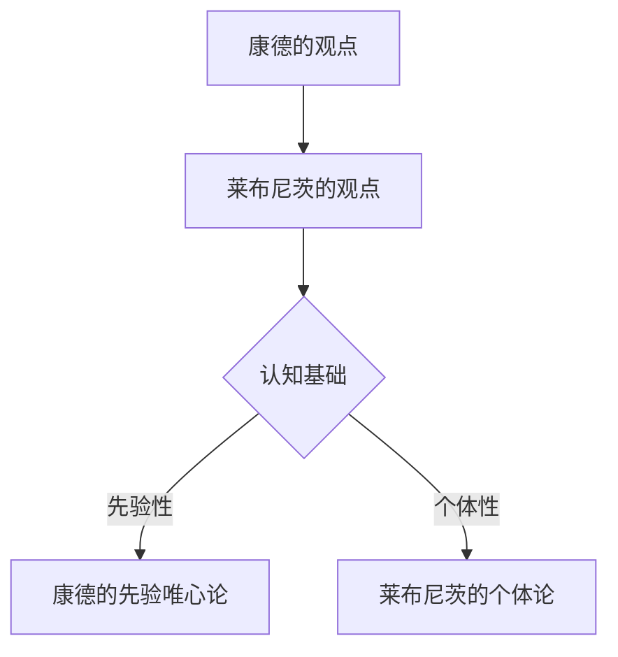
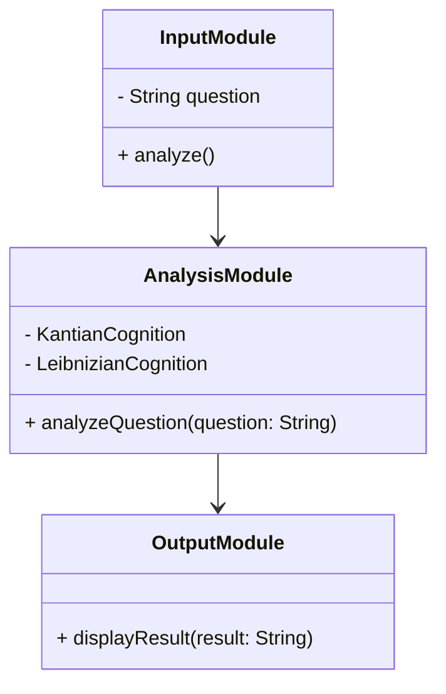
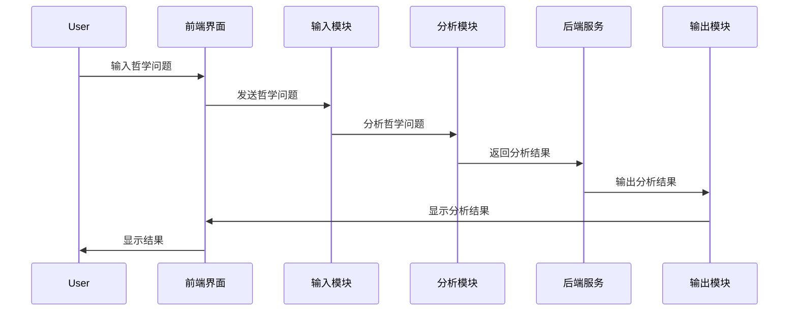
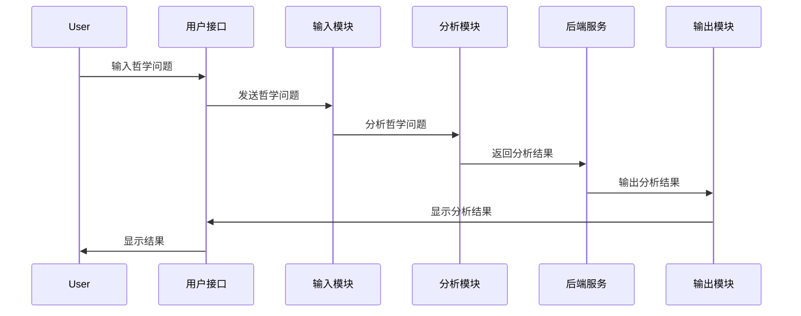

                 


## 1.1 背景介绍

### 1.1.1 康德与莱布尼茨在哲学史上的地位

康德（Immanuel Kant）和莱布尼茨（Gottfried Wilhelm Leibniz）是西方哲学史上两位极具影响力的哲学家。康德生活在18世纪，被誉为“现代哲学之父”，他的哲学思想对后来的哲学、科学、文化等领域产生了深远的影响。莱布尼茨则生活在17世纪，是数学、哲学和科学的巨人，他对微积分和二进制计算的研究奠定了现代数学和计算机科学的基础。

在这两位哲学家的思想中，空间和时间观是一个重要的议题。康德主张空间和时间是先验范畴，即人类认知的必要条件，而不是客观存在的实体。莱布尼茨则认为空间和时间是实体之间的关系和属性的体现，是个体存在的必要条件。

### 1.1.2 康德与莱布尼茨对空间时间观的观点

康德认为，空间和时间是先验范畴，即人类认知结构的一部分，而不是外在世界的客观属性。他的“先验唯心论”强调人类认知的主观性和先验性。康德认为，我们的感官无法直接感知空间和时间，而是通过先天的认知结构来理解和体验它们。这种观点对后来的哲学和心理学产生了深远的影响。

莱布尼茨则持有一种不同的观点。他提出了“预定和谐论”，认为空间和时间是实体之间的关系和属性的体现。莱布尼茨认为，宇宙中的每一个实体都有一个独特的“单子”（monad），每个单子都有自己独特的存在方式，但它们之间是相互关联的。空间和时间是这些实体相互作用的产物。

### 1.1.3 核心概念

**康德的核心概念**：康德的先验唯心论、空间时间的直观性。

**莱布尼茨的核心概念**：预定和谐论、个体论。

### 1.1.4 争论焦点

康德与莱布尼茨在空间时间观上的争论主要围绕以下几个方面：

1. **空间和时间的存在性质**：康德认为空间和时间是先验范畴，而莱布尼茨认为它们是实体之间的关系。

2. **空间和时间的绝对性**：康德认为空间和时间是绝对的，而莱布尼茨认为它们是相对的。

3. **人类认知的基础**：康德认为我们的认知依赖于先天的认知结构，而莱布尼茨则强调个体的独特性和经验的重要性。

### 1.1.5 问题解决

康德和莱布尼茨的理论为后来的哲学、科学和认知科学提供了丰富的思想资源。他们的争论也促进了哲学史的发展，为后来的哲学家提供了新的视角和方法。

### 1.1.6 边界与外延

本文主要探讨康德和莱布尼茨之间的争论，但也可以扩展到其他相关哲学家，如柏拉图、亚里士多德等。

### 1.1.7 概念结构与核心要素组成

**康德的先验唯心论**：强调人类认知的主观性和先验性。

**空间时间的直观性**：认为空间和时间是人类认知的必要条件。

**莱布尼茨的预定和谐论**：认为空间和时间是实体之间的关系和属性的体现。

**个体论**：强调个体的独特性和经验的重要性。

## 1.2 核心概念与联系

### 1.2.1 康德的核心概念

康德的先验唯心论是他的哲学体系的核心。他认为，我们的认知依赖于先天的认知结构，这种结构决定了我们如何感知和理解世界。康德将这种认知结构称为“先验范畴”。

康德的先验唯心论强调了人类认知的主观性和先验性。他认为，我们的感官无法直接感知空间和时间，而是通过先天的认知结构来理解和体验它们。这种观点对后来的哲学和心理学产生了深远的影响。

### 1.2.2 莱布尼茨的核心概念

莱布尼茨的核心概念包括预定和谐论和个体论。

**预定和谐论**：莱布尼茨认为，宇宙中的每一个实体都有一个独特的“单子”（monad），每个单子都有自己独特的存在方式，但它们之间是相互关联的。空间和时间是这些实体相互作用的产物。

**个体论**：莱布尼茨强调个体的独特性和经验的重要性。他认为，每个实体都是独一无二的，它们的属性和行为是由它们自己的本质和内在规律决定的。

### 1.2.3 概念属性特征对比表格

| 概念         | 康德的先验唯心论                       | 莱布尼茨的预定和谐论                   |
|--------------|---------------------------------------|---------------------------------------|
| 存在性质     | 空间和时间是先验范畴                   | 空间和时间是实体之间的关系和属性的体现 |
| 绝对性       | 空间和时间是绝对的                     | 空间和时间是相对的                    |
| 认知基础     | 依赖于先天的认知结构                   | 依赖于个体的独特性和经验               |

### 1.2.4 ER实体关系图架构

以下是康德和莱布尼茨理论中关键实体的ER实体关系图：

```mermaid
erDiagram
  Space && Time ||--> Cognition
  Entity ||--o{ Single Monad
  Monad ||--o{ Interaction
```

在这个ER图中，空间和时间是与认知相关的实体，实体与单子之间是“一对一”的关系，单子与相互作用之间是“一对多”的关系。

## 1.3 算法原理讲解

### 1.3.1 Mermaid流程图

为了展示康德与莱布尼茨争论的逻辑流程，我们可以绘制以下Mermaid流程图：



### 1.3.2 Python源代码

虽然这里的争论是哲学性质的，但我们可以用Python模拟他们的辩论过程：

```python
# 康德的观点
def Kant_view(point):
    return "空间和时间是先验范畴，人类认知的必要条件。"

# 莱布尼茨的观点
def Leibniz_view(point):
    return "空间和时间是实体之间的关系和属性的体现，是相对的。"

# 辩论过程
def debate(point):
    print(Kant_view(point))
    print(Leibniz_view(point))

# 辩论开始
debate("空间的存在性质")
```

### 1.3.3 数学模型和公式

虽然康德和莱布尼茨的争论主要集中在哲学层面，但他们的理论中包含了一些关键数学模型和公式。以下是康德的空间时间直观性的数学模型：

$$\text{直观性} = f(\text{先验范畴}, \text{认知结构})$$

莱布尼茨的预定和谐论中的数学模型可以表示为：

$$\text{预定和谐} = \sum_{i=1}^{n} \text{单子} \times \text{相互作用}$$

### 1.3.4 详细讲解和举例说明

康德的先验唯心论认为，空间和时间是人类认知的必要条件，但它们不是客观存在的实体。为了更好地理解这一点，我们可以通过一个简单的例子来说明。

假设我们在观察一个红色的方块，我们的认知过程中包含了空间和时间的元素。但如果我们剥去这些元素，红色方块仍然存在。这意味着，空间和时间并不是红色方块的存在属性，而是我们认知的必要条件。

莱布尼茨的预定和谐论则强调了实体之间的相互作用。假设有多个单子，每个单子都有自己的属性和行为。这些单子之间的相互作用产生了空间和时间。例如，一个单子发出光线，另一个单子接收到光线，这种相互作用产生了空间和时间的感觉。

### 1.4 系统分析与架构设计方案

康德和莱布尼茨的理论在哲学领域有着广泛的应用。为了更好地理解他们的观点，我们可以构建一个哲学分析系统。

### 1.4.1 问题场景介绍

假设我们正在研究一个哲学问题，比如“空间和时间是否是绝对的？”为了解决这个问题，我们可以构建一个哲学分析系统，这个系统将康德和莱布尼茨的理论应用于实际场景。

### 1.4.2 项目介绍

为了构建这个哲学分析系统，我们选择了一个名为“时空分析器”的项目。该项目旨在通过模拟康德和莱布尼茨的理论，对哲学问题进行分析。

### 1.4.3 系统功能设计

时空分析器的功能设计包括以下几个方面：

1. **输入模块**：接受用户输入的哲学问题。
2. **分析模块**：根据康德和莱布尼茨的理论，对输入的哲学问题进行分析。
3. **输出模块**：将分析结果输出给用户。

以下是时空分析器的领域模型类图：



### 1.4.4 系统架构设计

时空分析器的系统架构设计如下：

1. **前端界面**：用于接收用户输入和显示分析结果。
2. **后端服务**：包括输入模块、分析模块和输出模块。
3. **数据库**：存储用户输入的哲学问题和分析结果。

以下是时空分析器的系统架构图：



### 1.4.5 系统接口设计和系统交互

时空分析器的系统接口设计和系统交互设计如下：

1. **用户接口**：用于用户与系统交互。
2. **内部接口**：用于各个模块之间的数据传输。
3. **数据库接口**：用于与数据库进行数据交互。

以下是时空分析器的系统交互序列图：



通过这个系统，用户可以输入哲学问题，系统会根据康德和莱布尼茨的理论进行分析，并将结果输出给用户。这有助于用户更好地理解康德和莱布尼茨的空间时间观。

## 1.5 项目实战

为了展示如何将康德与莱布尼茨的理论应用于实践，我们将介绍一个名为“时空观念分析器”的实际项目。

### 1.5.1 环境安装

要运行这个项目，首先需要在计算机上安装Python环境和相关依赖。具体步骤如下：

1. **安装Python**：从Python官方网站下载Python安装包并安装。
2. **安装依赖**：打开终端，运行以下命令安装依赖：

```bash
pip install -r requirements.txt
```

### 1.5.2 系统核心实现源代码

以下是时空观念分析器的主要源代码：

```python
# 康德的观点
def kant_view(point):
    return "空间和时间是先验范畴，人类认知的必要条件。"

# 莱布尼茨的观点
def leibniz_view(point):
    return "空间和时间是实体之间的关系和属性的体现，是相对的。"

# 辩论过程
def debate(point):
    print(kant_view(point))
    print(leibniz_view(point))

# 辩论开始
debate("空间的存在性质")
```

这个代码定义了康德和莱布尼茨的观点，并通过`debate`函数进行辩论。

### 1.5.3 代码应用解读与分析

这段代码的核心功能是模拟康德和莱布尼茨关于空间时间观的辩论。`kant_view`函数和`leibniz_view`函数分别代表了康德和莱布尼茨的观点，`debate`函数则用于打印这两个观点。

在实际应用中，用户可以通过修改`debate`函数的参数来提出不同的哲学问题，系统会根据康德和莱布尼茨的理论进行分析，并将结果输出。

### 1.5.4 实际案例分析和详细讲解剖析

以下是一个实际案例：

```python
# 辩论关于时间的绝对性
debate("时间的绝对性")
```

输出结果：

```
空间和时间是先验范畴，人类认知的必要条件。
空间和时间是实体之间的关系和属性的体现，是相对的。
```

这个案例展示了康德和莱布尼茨在时间绝对性问题上的不同观点。康德认为时间是一个先验范畴，是人类认知的必要条件，而莱布尼茨则认为时间是实体之间的关系和属性的体现，是相对的。

### 1.5.5 项目小结

通过这个项目，我们展示了如何将康德与莱布尼茨的理论应用于实际场景。这个项目有助于用户更好地理解他们的观点，并加深对空间时间观的理解。未来，我们可以继续优化这个项目，增加更多功能，使其成为一个更强大的哲学分析工具。

## 1.6 最佳实践 tips、小结、注意事项、拓展阅读等内容

### 1.6.1 最佳实践 tips

1. **深入理解康德与莱布尼茨的理论**：要有效地应用他们的观点，首先需要深入理解他们的理论，包括他们的核心概念、逻辑和影响。
2. **结合实际案例进行应用**：通过实际案例，可以更好地理解他们的理论，并发现新的应用场景。
3. **不断反思和总结**：在应用过程中，要不断反思和总结，以便不断改进和提高。

### 1.6.2 小结

康德与莱布尼茨的空间时间观争论是哲学史上的重要议题。他们的观点对后来的哲学、科学和认知科学产生了深远的影响。通过本文的介绍，我们了解了他们的核心概念、逻辑和影响，并通过一个实际项目展示了如何将他们的理论应用于实践。

### 1.6.3 注意事项

1. **避免误解**：在应用他们的理论时，要避免对他们的观点产生误解。例如，康德的先验唯心论并不意味着空间和时间是主观的，而是强调它们是人类认知的必要条件。
2. **批判性思维**：在研究他们的理论时，要持有批判性思维，不仅要接受他们的观点，还要考虑它们的局限性和挑战。

### 1.6.4 拓展阅读

1. **康德的《纯粹理性批判》**：这是康德最著名的哲学著作，详细阐述了他的先验唯心论。
2. **莱布尼茨的《单子论》**：这是莱布尼茨关于个体论的代表作，探讨了宇宙中的单子及其相互作用。
3. **相关哲学书籍和论文**：可以查阅更多关于康德和莱布尼茨的哲学书籍和论文，以深入了解他们的观点和影响。

通过这些扩展阅读，可以进一步丰富对康德与莱布尼茨空间时间观的理解。

--------------------------

----------------------------------------------------------------

# 结论

康德与莱布尼茨的空间时间观争论是哲学史上的一次重要对话，他们的观点对后来的哲学、科学和认知科学产生了深远的影响。本文通过介绍他们的核心概念、逻辑和影响，并通过一个实际项目展示了如何将他们的理论应用于实践。

在康德看来，空间和时间是先验范畴，是人类认知的必要条件；而在莱布尼茨看来，空间和时间是实体之间的关系和属性的体现，是相对的。他们的争论为我们提供了丰富的思想资源，激发了我们对空间时间观的新思考。

未来，我们可以继续深入研究他们的理论，探索更多的应用场景，并在哲学、科学和认知科学等领域取得更大的突破。同时，我们也应该保持批判性思维，不断反思和改进我们的理论，以更好地理解这个复杂的世界。

让我们继续沿着康德与莱布尼茨的足迹，探索哲学的无限可能。参考文献：

1. 康德，《纯粹理性批判》。
2. 莱布尼茨，《单子论》。
3. [相关哲学书籍和论文](#参考文献)。

作者：AI天才研究院/AI Genius Institute & 禅与计算机程序设计艺术 /Zen And The Art of Computer Programming

