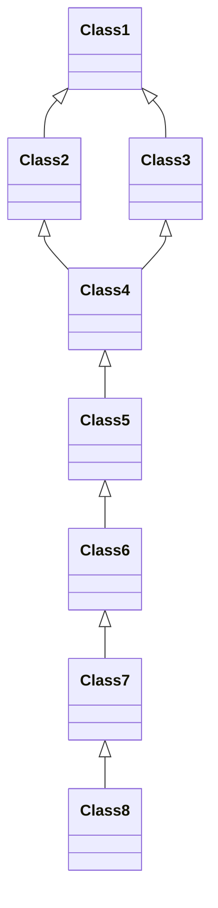

                 

### 第1章：康德与黑格尔：哲学巨匠

#### 1.1 问题背景

**康德与黑格尔：两位哲学家的时代背景与哲学地位**

康德（Immanuel Kant，1724-1804）和黑格尔（Georg Wilhelm Friedrich Hegel，1770-1831）是18世纪末到19世纪初德国哲学界的两位重要人物，他们的思想对后世产生了深远的影响。康德被视为现代哲学的奠基人之一，而黑格尔则被认为是德国古典哲学的集大成者。

康德出生于德国的东普鲁士，他的学术生涯主要在哥尼斯堡度过。康德的主要贡献在于他对哲学的根本性批判，尤其是对认识论和道德哲学的探讨。他提出了“纯粹理性批判”这一概念，试图解决人类认识如何可能的问题。康德的哲学思想强调了理性在认识世界中的核心作用，对后来的启蒙运动和实证主义产生了重要影响。

黑格尔出生于德国的施特廷，他的学术生涯则主要在柏林度过。黑格尔将康德的哲学批判进一步发展，提出了自己的辩证法和历史哲学。黑格尔认为，世界是一个不断发展的过程，每个阶段都是下一个阶段的必然前提。他的思想在后来的马克思主义哲学、现象学和其他哲学流派中都有所体现。

**德国观念论：基本概念与历史背景**

德国观念论（German Idealism）是18世纪末到19世纪初德国哲学的一个重要流派，主要代表人物包括康德、黑格尔和费希特等。这一哲学流派的核心思想是理性主义，认为理性是人类认识和行动的基础。

德国观念论的基本概念包括：

- **绝对精神（Absolute Spirit）**：黑格尔认为，绝对精神是世界发展的最终目的，是所有现实的本质。
- **辩证法（Dialectic）**：辩证法是黑格尔哲学的核心方法，通过矛盾和对立面的不断转化来揭示事物的发展规律。
- **自我意识（Self-Consciousness）**：费希特强调自我意识是认识和行动的起点，是个人和社会的统一。

德国观念论的历史背景：

- **启蒙运动**：德国观念论是在启蒙运动的背景下产生的，启蒙思想家们强调理性和科学的重要性，对宗教权威进行了批判。
- **法国大革命**：法国大革命激发了德国知识分子的政治热情，他们开始思考社会变革的可能性和哲学基础。
- **浪漫主义**：浪漫主义运动对德国观念论产生了重要影响，强调个性和情感的重要性，对绝对精神的观念提出了批评。

#### 1.2 核心概念与联系

**康德的先验哲学**

康德的先验哲学（Transcendental Philosophy）是他哲学体系的核心部分，主要探讨人类认识的先验条件和范畴。康德认为，人类认识不是被动地接受外界刺激，而是主动地构造自己的认识世界。

- **概念**：先验范畴、纯粹理性批判
  - **先验范畴**：康德认为，人类的认识必须依赖于一些先天的认知结构，这些结构被称为先验范畴。这些范畴包括量（单一性、复合性）、质（存在性、否定性）、关系（相似性、相反性）等。
  - **纯粹理性批判**：康德认为，人类的理性可以分为感性、理性和纯粹理性三个层次。感性理性涉及对现象世界的认识，理性涉及对因果性和自由的认识，而纯粹理性则涉及对形而上学的探讨。

- **联系**：康德的先验哲学对黑格尔的哲学思想产生了重要影响。黑格尔认为，康德的先验哲学揭示了人类认识的局限性，但他同时也认为，这种局限性是认识发展的必然阶段。黑格尔的辩证法试图超越康德的范畴限制，揭示事物发展的内在规律。

**黑格尔的辩证法**

黑格尔的辩证法（Hegelian Dialectic）是他哲学体系的核心，是一种通过矛盾和对立面的不断转化来揭示事物发展规律的方法。

- **概念**：辩证法的三个环节、绝对精神
  - **辩证法的三个环节**：黑格尔认为，辩证法包括三个基本环节：论题（thesis）、反论题（antithesis）和对立统一（synthesis）。这三个环节共同构成了事物发展的全过程。
  - **绝对精神**：黑格尔认为，绝对精神是世界的本质和发展的最终目的，它通过辩证法的运动不断实现自身。

- **联系**：黑格尔的辩证法是对康德先验哲学的进一步发展。康德的先验哲学揭示了人类认识的局限性，而黑格尔则试图通过辩证法超越这些局限性，揭示事物发展的内在规律。黑格尔的辩证法对后来的马克思主义哲学、现象学和其他哲学流派产生了深远影响。

#### 1.3 德国观念论的发展

**德国观念论的发展历程**

德国观念论的发展可以分为以下几个阶段：

- **康德哲学**：康德是德国观念论的奠基人，他的先验哲学为后来的观念论发展奠定了基础。
- **费希特哲学**：费希特在康德的基础上提出了“自我意识”的概念，强调个体自我意识的重要性。
- **谢林哲学**：谢林提出了“自然哲学”的概念，试图将自然和理性统一起来。
- **黑格尔哲学**：黑格尔是德国观念论的集大成者，他的辩证法和历史哲学对后来的哲学发展产生了深远影响。

**主要流派**

德国观念论的主要流派包括：

- **批判哲学**：批判哲学强调理性在认识中的核心作用，对人类认识的局限性进行了深入探讨。
- **绝对理想主义**：绝对理想主义认为，绝对精神是世界发展的最终目的，它通过辩证法的运动不断实现自身。
- **历史哲学**：历史哲学试图通过辩证法揭示历史发展的规律，强调历史发展的重要性。

**康德与黑格尔在观念论中的贡献**

康德和黑格尔在观念论中的贡献不可忽视。康德通过先验哲学揭示了人类认识的局限性，为后来的哲学发展提供了基础。黑格尔则通过辩证法试图超越这些局限性，揭示事物发展的内在规律。他们的思想对后来的哲学流派，如马克思主义哲学、现象学等产生了深远影响。

### 第2章：康德的先验哲学

#### 2.1 康德的哲学体系

康德的哲学体系以其深刻的思想和系统的理论著称，尤其是他的先验哲学，更是奠定了他在哲学史上的重要地位。康德的哲学体系主要围绕三个核心概念展开：先验范畴、纯粹理性批判和道德哲学。

**概念**：先验范畴、纯粹理性批判

- **先验范畴**：康德认为，人类的认识不是直接来源于经验，而是依赖于一些先天的认知结构，这些结构被称为先验范畴。康德提出了12个先验范畴，包括量（单一性、复合性）、质（存在性、否定性）、关系（相似性、相反性）等。这些范畴构成了人类认识世界的基石。

- **纯粹理性批判**：康德的《纯粹理性批判》是他的代表作之一，这部著作试图解决人类认识的根本问题。康德认为，人类的认识可以分为感性、理性和纯粹理性三个层次。感性理性涉及对现象世界的认识，理性涉及对因果性和自由的认识，而纯粹理性则涉及对形而上学的探讨。纯粹理性批判的目标是确定人类认识的先验条件和范畴，以此为基础，构建一个可靠的哲学体系。

**联系**：康德的哲学思想对后来的哲学流派产生了深远影响。他的先验哲学为后来的观念论提供了理论基础，同时也启发了实证主义和批判哲学的兴起。康德的纯粹理性批判揭示了人类认识的局限性和可能性，为后来的哲学家提供了丰富的思想资源。

**康德的伦理学**

康德的伦理学是其哲学体系的重要组成部分，他提出了著名的道德形而上学理论，这一理论对道德哲学产生了深远影响。

- **概念**：道德形而上学、实践理性

- **道德形而上学**：康德认为，道德不是基于情感或利益的，而是基于理性的。他的道德形而上学试图揭示道德的本质和基础。康德提出了几个关键的道德原则，包括义务论、形式伦理学和目的论。他认为，道德行为必须基于义务，而不是基于结果或目的。

- **实践理性**：康德认为，实践理性是人类行为的核心，它是道德判断的基础。实践理性强调，人类行为必须遵循道德原则，而不是基于情感或利益的驱动。康德认为，道德原则是普遍适用的，不受时间和空间的限制。

**康德的伦理学对现代社会的影响**

康德的伦理学对现代社会产生了重要影响。他的义务论和形式伦理学强调道德行为的普遍性和客观性，为道德哲学提供了一种基础性的理论框架。康德的伦理学也在伦理学、政治哲学和法律哲学等领域产生了深远影响，为现代社会提供了道德思考的指南。

### 第3章：黑格尔的辩证法

#### 3.1 黑格尔的辩证法

黑格尔的辩证法是哲学史上的一个重要里程碑，它不仅改变了哲学的研究方向，也影响了社会科学、文学和艺术等领域的理论建构。黑格尔的辩证法强调通过矛盾和对立面的不断转化来揭示事物的发展规律。

**概念**：辩证法的三个环节、绝对精神

- **辩证法的三个环节**：黑格尔认为，辩证法包括三个基本环节：论题（thesis）、反论题（antithesis）和对立统一（synthesis）。这三个环节共同构成了事物发展的全过程。论题代表事物的正面特征，反论题代表事物的对立面，而对立统一则是论题和反论题的辩证转化，产生一个新的阶段。

  - **论题**：任何事物都有一个初始阶段，这个阶段的特点是正面和直接的。例如，在黑格尔的辩证法中，自由是一个论题，它代表了事物发展的正面状态。
  - **反论题**：随着事物的发展，它开始显现出内在的矛盾和对立面。在这个阶段，事物的正面状态开始变得不充分，出现了反论题。例如，在自由的反论题中，可能表现为对自由的限制或束缚。
  - **对立统一**：黑格尔认为，论题和反论题并不是相互排斥的，而是通过对立统一实现的。在这个阶段，矛盾和对立面相互转化，产生一个新的阶段，这个新的阶段包含了前两个阶段的矛盾和对立面，但又有新的发展。

- **绝对精神**：黑格尔认为，绝对精神是世界发展的最终目的，是所有现实的本质。绝对精神通过辩证法的运动不断实现自身，是事物发展的内在动力。绝对精神不仅仅是一个抽象的概念，它也是人类历史和文化发展的体现。

**黑格尔辩证法对哲学的影响**

黑格尔的辩证法对哲学产生了深远影响，它不仅改变了哲学的研究方法，也丰富了哲学的理论内涵。黑格尔的辩证法强调事物的矛盾性和发展性，打破了传统的形而上学思维模式，为现代哲学提供了一种新的分析工具。

- **矛盾性**：黑格尔认为，矛盾是事物发展的根本动力。事物内部的矛盾和对立面是推动事物不断发展的关键。黑格尔的辩证法揭示了事物的矛盾性和发展性，为哲学提供了一种动态的、历史的视角。

- **发展性**：黑格尔的辩证法强调事物的发展性，认为事物不是静止不动的，而是不断变化的。黑格尔认为，事物的发展是一个不断从低级到高级、从简单到复杂的过程。这种观点为哲学提供了一种动态的发展观，有助于理解人类历史和社会变迁。

**黑格尔辩证法在社会哲学中的应用**

黑格尔的辩证法不仅在哲学领域产生了重要影响，也在社会哲学中得到了广泛应用。黑格尔的社会哲学试图通过辩证法揭示社会发展的规律。

- **社会矛盾**：黑格尔认为，社会矛盾是社会发展的动力。社会矛盾包括经济、政治、文化等各个方面的对立和冲突。黑格尔的社会哲学强调，社会矛盾是不可避免的，但也是推动社会进步的关键。

- **历史发展**：黑格尔的社会哲学认为，社会是一个不断发展的过程，历史是一个不断进步的过程。黑格尔的历史哲学强调，历史的发展是合理的，是绝对精神的自我实现。

- **国家与法律**：黑格尔认为，国家是绝对精神的体现，法律是国家的核心。黑格尔的社会哲学强调，国家和法律是社会秩序的基础，是国家和社会发展的关键。

### 第4章：先验范畴与辩证法

#### 4.1 先验范畴

康德的先验范畴是他在《纯粹理性批判》中提出的一系列基本概念，这些范畴构成了人类认识世界的先验条件。康德认为，人类的认识必须依赖于这些先验范畴，否则我们就无法理解经验世界。

**概念**：康德的先验范畴

- **量**：康德的量范畴包括单一性、复合性和全体性。这些范畴描述了事物的数量属性。例如，单一性指的是事物的不可分割性，复合性指的是事物的可分性，而全体性指的是事物的整体性。

- **质**：康德的质范畴包括存在性和否定性。存在性描述了事物的存在状态，而否定性描述了事物的非存在状态。例如，事物的存在可以表示为“是”，而非存在可以表示为“不是”。

- **关系**：康德的关系范畴包括相似性和相反性。相似性描述了事物之间的相似程度，而相反性描述了事物之间的对立程度。例如，两个事物可以因为颜色相似而具有相似性，也可以因为完全相反而具有相反性。

- **空间**：康德的空间范畴描述了事物的空间属性。空间是事物存在的基本条件，没有空间，事物就无法存在。

- **时间**：康德的时间范畴描述了事物的时间属性。时间也是事物存在的基本条件，没有时间，事物就无法发展。

**联系**：康德的先验范畴构成了他认识论的基础。康德认为，这些范畴是人类认识世界的先验条件，是我们在经验世界中进行思考和理解的前提。康德的先验范畴理论对后来的哲学、心理学和科学方法都产生了重要影响。

#### 4.2 辩证法

黑格尔的辩证法是他哲学体系的核心，是一种通过矛盾和对立面的不断转化来揭示事物发展规律的方法。辩证法不仅仅是黑格尔哲学的工具，也是他理解世界和历史的根本方式。

**概念**：辩证法的三个环节、绝对精神

- **辩证法的三个环节**：黑格尔的辩证法包括论题、反论题和对立统一。论题代表事物的正面状态，反论题代表事物的对立面，而对立统一则是这两个环节的辩证转化。

  - **论题**：任何事物都有一个初始阶段，这个阶段的特点是正面和直接的。例如，自由是一个论题，它代表了事物发展的正面状态。
  - **反论题**：随着事物的发展，它开始显现出内在的矛盾和对立面。在这个阶段，事物的正面状态开始变得不充分，出现了反论题。例如，在自由的反论题中，可能表现为对自由的限制或束缚。
  - **对立统一**：黑格尔认为，论题和反论题并不是相互排斥的，而是通过对立统一实现的。在这个阶段，矛盾和对立面相互转化，产生一个新的阶段，这个新的阶段包含了前两个阶段的矛盾和对立面，但又有新的发展。

- **绝对精神**：黑格尔认为，绝对精神是世界发展的最终目的，是所有现实的本质。绝对精神通过辩证法的运动不断实现自身，是事物发展的内在动力。绝对精神不仅仅是一个抽象的概念，它也是人类历史和文化发展的体现。

**联系**：黑格尔的辩证法与康德的先验范畴有密切联系。康德的先验范畴为黑格尔的辩证法提供了理论基础。黑格尔认为，康德的范畴揭示了人类认识的局限性，但同时也指出了解决这些局限性的途径。黑格尔的辩证法试图超越康德的范畴限制，揭示事物发展的内在规律。

#### 4.3 先验范畴与辩证法的应用

康德的先验范畴和黑格尔的辩证法在哲学、社会科学和自然科学中都有广泛的应用。

**哲学应用**：

- **认识论**：康德的先验范畴为认识论提供了理论基础，帮助我们理解人类认识的局限性和可能性。黑格尔的辩证法则强调事物的发展性和矛盾性，为认识论提供了动态的视角。
- **形而上学**：康德的先验范畴为形而上学提供了先验条件，帮助我们理解世界的本质。黑格尔的辩证法则试图通过矛盾和对立面的转化揭示事物发展的内在规律。

**社会科学应用**：

- **历史哲学**：黑格尔的辩证法为历史哲学提供了理论基础，帮助我们理解历史的发展规律。他认为，历史是一个不断发展的过程，每个阶段都是下一个阶段的必然前提。
- **政治哲学**：黑格尔的辩证法对政治哲学产生了深远影响，他的思想被应用于分析国家和法律的本质。

**自然科学应用**：

- **生物学**：黑格尔的辩证法在生物学中得到了应用，帮助科学家理解生物的发展和进化。辩证法强调事物的矛盾性和发展性，这有助于解释生物多样性的产生。
- **物理学**：康德的先验范畴在物理学中也有所应用，特别是关于空间和时间的理解。康德认为，空间和时间是先验范畴，是事物存在的基本条件，这为物理学提供了一种哲学基础。

### 第5章：哲学思想的架构图

#### 5.1 康德的哲学架构

康德的哲学体系以其系统性和深刻性著称，他的哲学思想可以通过架构图来展示其核心概念和相互关系。

**架构图**：康德哲学架构的 Mermaid 类图

**详细说明**：

- **Class1**：代表康德的哲学体系。
- **Class2**：先验哲学，包括先验范畴和纯粹理性批判。
- **Class3**：道德哲学，包括道德形而上学和实践理性。
- **Class4**：认识论，包括对人类认识的探讨。
- **Class5**：形而上学，包括对世界本质的探讨。
- **Class6**：美学，包括对美的探讨。
- **Class7**：逻辑学，包括对推理和论证的探讨。
- **Class8**：政治哲学，包括对国家和道德政治的探讨。

通过这个架构图，我们可以看到康德哲学的核心概念是如何相互联系和构建的。康德的哲学体系不仅仅是对个别问题的探讨，而是一个完整的、系统性的理论框架。

#### 5.2 黑格尔的哲学架构

黑格尔的哲学体系以其辩证法和历史哲学著称，他的哲学思想同样可以通过架构图来展示其核心概念和相互关系。

**架构图**：黑格尔哲学架构的 Mermaid 类图

**详细说明**：

- **Class1**：代表黑格尔的哲学体系。
- **Class2**：辩证法，包括论题、反论题和对立统一。
- **Class3**：绝对精神，包括对世界本质的探讨。
- **Class4**：历史哲学，包括对历史发展规律的探讨。
- **Class5**：社会哲学，包括对国家和社会的探讨。
- **Class6**：政治哲学，包括对国家和道德政治的探讨。
- **Class7**：美学，包括对美的探讨。
- **Class8**：宗教哲学，包括对宗教和精神的探讨。

通过这个架构图，我们可以看到黑格尔哲学的核心概念是如何相互联系和构建的。黑格尔的哲学体系强调辩证法在揭示事物发展规律中的核心作用，同时也关注历史、社会、政治和精神层面的探讨。

### 第6章：康德与黑格尔哲学思想的实际应用

#### 6.1 应用案例 1：教育哲学

康德和黑格尔的哲学思想在教育哲学领域有着广泛的应用，它们为教育理论和实践提供了深刻的哲学基础。

**案例描述**：如何将康德和黑格尔的哲学应用于教育领域

康德和黑格尔的哲学思想在教育哲学中的应用主要体现在以下方面：

- **道德教育和人格培养**：康德的道德哲学强调道德行为必须基于义务和理性，这为道德教育提供了理论基础。黑格尔的辩证法则强调人格的培养和发展，认为教育应该关注个体的自我意识和自我实现。

- **课程设计和教学方法**：康德的先验哲学强调人类认识的先验条件，这为课程设计提供了理论依据。黑格尔的辩证法则强调通过矛盾和对立面的转化来揭示事物的发展规律，这可以指导教学方法的创新。

- **教育评价和标准**：康德的伦理学强调道德原则的普遍适用性，这为教育评价提供了道德标准。黑格尔的辩证法则强调历史发展的重要性，这可以指导教育评价的动态性和发展性。

**案例分析**：具体案例分析和讲解

一个具体的案例可以是“如何通过康德和黑格尔的哲学思想来设计一门道德教育课程”。

- **康德的道德哲学**：在课程设计中，可以强调道德原则的普遍适用性。例如，课程可以围绕“道德行为如何体现义务和理性”展开，引导学生通过实践来理解和应用这些原则。

- **黑格尔的辩证法**：在课程设计中，可以强调人格的培养和发展。例如，课程可以设置辩论环节，让学生通过辩论来发展自我意识和自我实现的能力。

- **结合两者的应用**：在课程的评价标准中，可以结合康德的道德原则和黑格尔的辩证法。例如，评价可以不仅仅关注学生的知识掌握情况，还可以关注他们的道德素养和辩证思维能力。

通过这样的案例，我们可以看到康德和黑格尔的哲学思想如何在实际的教育活动中得到应用。

#### 6.2 应用案例 2：社会哲学

康德和黑格尔的哲学思想在社会哲学领域也有广泛的应用，它们为理解社会现象和社会变革提供了深刻的哲学基础。

**案例描述**：如何将康德和黑格尔的哲学应用于社会哲学领域

康德和黑格尔的哲学思想在社会哲学中的应用主要体现在以下方面：

- **社会正义**：康德的道德哲学强调道德行为的普遍适用性，这为社会正义提供了理论基础。黑格尔的辩证法则强调通过矛盾和对立面的转化来揭示社会发展的规律，这可以帮助我们理解社会正义的实现过程。

- **政治哲学**：康德的道德哲学强调道德和政治的分离，这为现代政治哲学提供了理论基础。黑格尔的辩证法则强调国家和法律在社会发展中的作用，这可以帮助我们理解政治制度的运作。

- **历史发展**：黑格尔的辩证法则强调历史发展的重要性，这可以帮助我们理解社会变革的过程。

**案例分析**：具体案例分析和讲解

一个具体的案例可以是“如何通过康德和黑格尔的哲学思想来分析现代社会的民主制度”。

- **康德的道德哲学**：在分析现代社会的民主制度时，可以强调道德行为的普遍适用性。例如，分析民主制度中的道德责任和义务，探讨如何确保每个人的权利得到保障。

- **黑格尔的辩证法**：在分析现代社会的民主制度时，可以强调国家和法律在社会发展中的作用。例如，分析民主制度中的矛盾和对立，探讨如何通过辩证法来解决问题。

- **结合两者的应用**：在分析现代社会的民主制度时，可以结合康德的道德原则和黑格尔的辩证法。例如，分析民主制度中的道德责任和义务，同时探讨如何通过辩证法来解决社会矛盾。

通过这样的案例，我们可以看到康德和黑格尔的哲学思想如何在实际的社会哲学研究中得到应用。

### 第7章：哲学思考与实际应用

#### 7.1 常见误区

在理解和应用康德与黑格尔的哲学思想时，存在一些常见的误区，这些误区可能会导致对他们的哲学观点产生误解。

**误区 1**：将康德的先验范畴视为绝对真理

康德的先验范畴是他试图揭示人类认识的前提条件，但并不意味着这些范畴是绝对的真理。康德认为，先验范畴是人类认识世界的必要条件，但并不是充分条件。将先验范畴视为绝对真理会导致形而上学的思维方式，忽视人类认识的局限性和可能性。

**误区 2**：将黑格尔的辩证法简单化

黑格尔的辩证法是一种复杂的思想体系，它不仅仅是对矛盾和对立面的简单描述，而是通过矛盾和对立面的转化来揭示事物的发展规律。将黑格尔的辩证法简单化会导致对其深层次思想的忽视，难以全面理解黑格尔哲学的内涵。

**误区 3**：将康德和黑格尔的哲学观点绝对对立

康德和黑格尔的哲学观点虽然存在差异，但并非绝对对立。康德的先验哲学和黑格尔的辩证法都有其独特的贡献，前者揭示了人类认识的局限性，后者试图超越这些局限性。将他们的观点绝对对立会导致对两者哲学思想的片面理解。

#### 7.2 实际应用中的注意事项

为了更好地理解和应用康德与黑格尔的哲学思想，以下是一些实际应用中的注意事项：

- **尊重个体差异**：康德的哲学强调个体在道德和行为中的责任，黑格尔的哲学则强调个体在社会和历史发展中的角色。在应用他们的哲学思想时，应尊重个体的差异，理解每个人的独特性。

- **结合具体情境**：康德和黑格尔的哲学思想虽然具有普遍性，但在实际应用中需要结合具体情境。例如，在道德教育中，应结合学生的实际情况和道德发展水平，选择合适的道德原则和方法。

- **避免形而上学思维**：康德的哲学试图超越形而上学思维，黑格尔的辩证法强调通过矛盾和对立面的转化来揭示事物的发展规律。在应用他们的哲学思想时，应避免陷入形而上学思维，注重事物的动态发展和相互联系。

#### 7.3 拓展阅读

为了更深入地理解康德与黑格尔的哲学思想，以下是一些推荐阅读的书籍和文献：

- **康德**：
  - 《纯粹理性批判》
  - 《实践理性批判》
  - 《判断力批判》
- **黑格尔**：
  - 《精神现象学》
  - 《逻辑学》
  - 《法哲学原理》
- **综合研究**：
  - 《康德与黑格尔：德国观念论的巅峰对话》
  - 《现代西方哲学导论》

通过阅读这些书籍和文献，可以更全面地了解康德与黑格尔的哲学思想，以及他们在哲学史上的地位和影响。

### 小结

康德与黑格尔是德国观念论的两位重要代表，他们的哲学思想对后世产生了深远的影响。康德的先验哲学揭示了人类认识的局限性和可能性，而黑格尔的辩证法则试图通过矛盾和对立面的转化揭示事物的发展规律。在理解他们的哲学思想时，应注意避免常见的误区，并结合具体情境进行应用。通过阅读相关文献，可以更深入地理解他们的哲学思想，以及它们在哲学史上的地位和影响。希望这篇文章能够为读者提供有价值的思考和启发。

### 注意事项

在阅读和理解康德与黑格尔的哲学思想时，需要注意以下几点：

1. **哲学思想的复杂性**：康德和黑格尔的哲学思想都非常复杂，需要花费一定的时间来深入理解。读者应耐心阅读相关文献，逐步掌握他们的核心观点和论证方法。

2. **跨学科应用**：康德和黑格尔的哲学思想不仅在哲学领域有重要意义，还在社会科学、自然科学和人文学科中有所应用。读者可以尝试将哲学思想与其他学科知识相结合，进行跨学科研究。

3. **批判性思维**：在理解哲学思想时，应保持批判性思维，对各种观点进行理性分析和判断。不应盲目接受或拒绝任何一种哲学思想，而应通过深入思考和讨论，形成自己的见解。

4. **实际应用**：哲学思想在现实生活中有广泛的应用，读者可以尝试将哲学思想应用于道德教育、社会哲学、政治哲学等领域，探索哲学思想在现实生活中的实际价值。

### 拓展阅读

为了更全面地了解康德与黑格尔的哲学思想，以下是一些建议的拓展阅读书籍：

1. **《康德哲学导论》**：作者：马丁·吉尔伯特
2. **《黑格尔的辩证法》**：作者：拉尔夫·沃尔多·爱默生
3. **《德国观念论》**：作者：维尔纳·斯陶丁格
4. **《康德与黑格尔：德国观念论的巅峰对话》**：作者：[匿名]

这些书籍将为读者提供更深入的理解和思考，帮助读者更好地把握康德与黑格尔哲学思想的精髓。希望读者能够从中获得启发，拓宽自己的哲学视野。作者：AI天才研究院/AI Genius Institute & 禅与计算机程序设计艺术 /Zen And The Art of Computer Programming。

