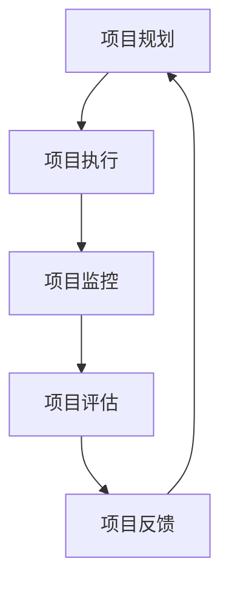
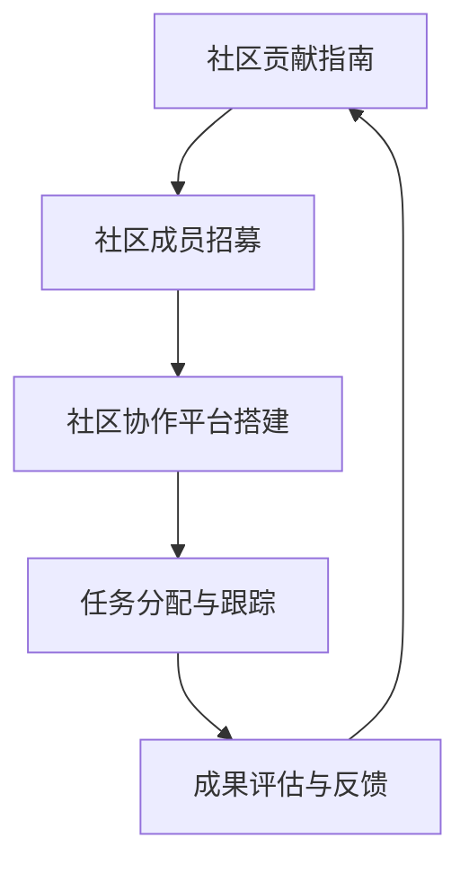
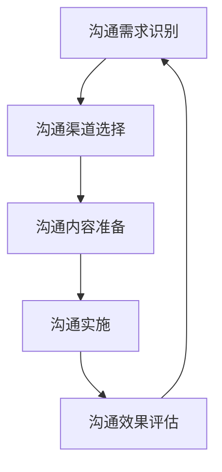
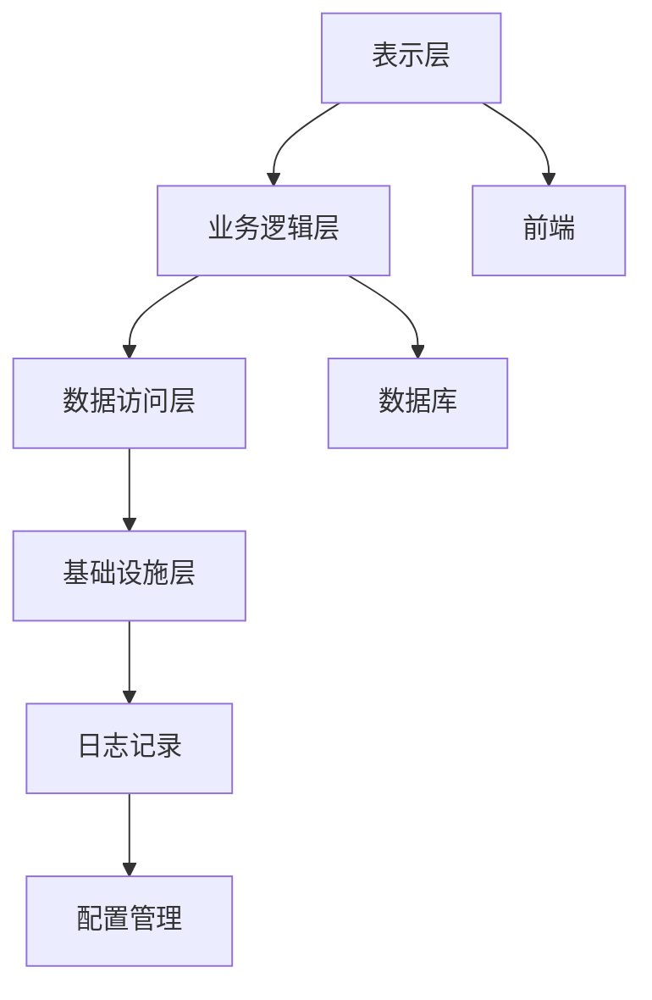
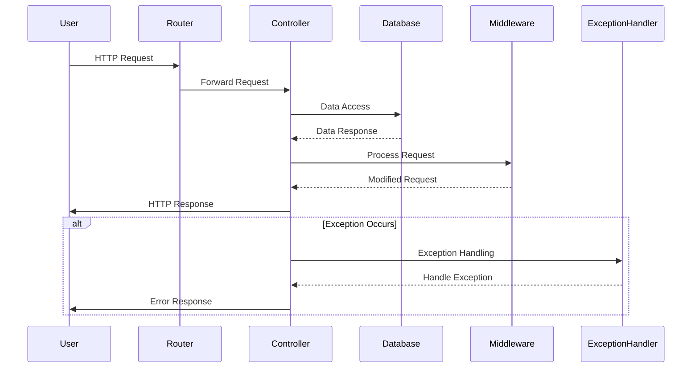

                 

### 文章标题

# 开源项目管理：利用社区力量加速发展

## 文章关键词

- 开源项目
- 项目管理
- 社区力量
- 生命周期
- 治理结构
- 沟通合作
- 可持续发展

## 文章摘要

本文深入探讨了开源项目管理的重要性和挑战，以及如何利用社区力量来加速开源项目的发展。通过分析开源项目的背景、核心概念、关键流程和成功案例，本文提供了实用的策略和方法，帮助开源项目管理者更有效地构建和维护社区，实现项目的可持续发展。

## 背景介绍

### 核心概念术语说明

- **开源项目**：指那些遵循某种开放许可证（如GPL、Apache License等）的软件项目，允许用户自由使用、修改和分发。
- **项目管理**：在特定资源约束下，通过计划、执行、监控和调整，达成项目目标和预期成果的过程。
- **社区力量**：指开源项目背后的开发者、用户和其他利益相关者的协作与贡献。

### 问题背景

开源项目在现代软件开发中扮演着越来越重要的角色。它们不仅提供了大量的创新技术和解决方案，还促进了技术的共享和进步。然而，开源项目面临的挑战也是巨大的，包括如何有效地管理项目、维护社区活力以及确保项目的长期可持续发展。

### 问题描述

开源项目管理涉及多个方面，如项目的规划、执行、监控和评估。管理者需要协调项目参与者、管理项目资源、处理社区反馈，并确保项目按照预期发展。然而，这些任务的复杂性使得开源项目管理者常常感到压力和困惑。

### 问题解决

为了解决开源项目管理的挑战，本文提出了以下策略：

1. **明确项目目标和治理结构**：确保所有参与者对项目的目标和期望有共同的理解，并建立合理的治理机制。
2. **建立有效的沟通渠道**：保持社区成员之间的良好沟通，确保信息畅通无阻。
3. **激发社区参与**：通过提供清晰的任务和贡献指南，鼓励社区成员参与项目开发。
4. **持续评估和改进**：定期评估项目的进展，并根据反馈进行调整，以适应项目的变化需求。

### 边界与外延

- **边界**：本文主要关注开源软件项目的管理，但不限于特定领域或技术。
- **外延**：开源项目管理的方法和策略同样适用于其他类型的开源项目，如硬件、文档等。

### 概念结构与核心要素组成

**开源项目管理** 的核心概念结构包括以下几个要素：

1. **项目目标**：明确项目的愿景和目标，确保所有参与者都明确项目的方向。
2. **治理结构**：定义项目的决策流程和组织结构，确保项目运作的有序性。
3. **沟通渠道**：建立有效的沟通机制，确保信息传递的及时性和准确性。
4. **社区参与**：鼓励和支持社区成员的参与，提高项目的协作效率。
5. **持续改进**：基于反馈和评估结果，持续改进项目管理和开发流程。

## 核心概念与联系

### 核心概念原理

开源项目管理的核心概念主要包括项目目标、治理结构、沟通渠道、社区参与和持续改进。这些概念共同构成了开源项目管理的理论基础，并指导项目管理者在实际操作中做出正确的决策。

#### 概念属性特征对比表格

| 概念       | 定义                                                         | 属性特征                                           |
|------------|--------------------------------------------------------------|----------------------------------------------------|
| 项目目标   | 项目期望达成的成果和方向                                     | 明确性、可行性、持续性                           |
| 治理结构   | 项目决策和管理流程的组织架构                                 | 权威性、透明性、灵活性                           |
| 沟通渠道   | 项目参与者之间的信息交流机制                                 | 及时性、准确性、多样性                           |
| 社区参与   | 项目由社区成员共同参与开发和维护                             | 激励性、包容性、可持续性                         |
| 持续改进   | 项目根据评估结果不断调整和优化                               | 反馈机制、灵活应变、创新驱动                     |

### ER实体关系图架构

```mermaid
erDiagram
    Project ||--|{ Participant }| Participant : manages
    Project ||--|{ CommunicationChannel }| CommunicationChannel : uses
    Project ||--|{ GovernanceStructure }| GovernanceStructure : follows
    Project ||--|{ CommunityInvolvement }| CommunityInvolvement : encourages
    Project ||--|{ ContinuousImprovement }| ContinuousImprovement : applies
```

该ER图展示了开源项目管理中的关键实体及其关系。项目作为核心实体，与参与者、沟通渠道、治理结构、社区参与和持续改进之间存在直接的关联。这些实体共同构成了开源项目管理的整体框架。

### 算法原理讲解

开源项目管理的算法原理主要涉及如何有效地管理项目生命周期、协调社区参与、处理沟通和反馈等任务。以下是几个关键的算法原理：

#### 1. 项目生命周期管理算法



项目生命周期管理算法是一个循环过程，包括项目规划、执行、监控、评估和反馈。通过这个循环，项目管理者可以持续优化项目管理和开发流程。

#### 2. 社区参与管理算法



社区参与管理算法的目标是激发社区成员的参与热情，确保项目任务的高效完成。通过贡献指南、成员招募、平台搭建、任务分配和成果评估，项目管理者可以建立一个活跃的社区。

#### 3. 沟通管理算法



沟通管理算法关注沟通的需求识别、渠道选择、内容准备、实施和效果评估。通过有效的沟通管理，项目管理者可以确保信息传递的及时性和准确性。

### 数学模型和公式

开源项目管理的算法原理可以用以下数学模型和公式来描述：

1. **项目进度评估模型**：

   $$ P(t) = f(C, M, T) $$

   其中，$P(t)$表示项目进度，$C$表示社区参与度，$M$表示沟通效果，$T$表示时间。该模型表明项目进度受到社区参与度、沟通效果和时间的综合影响。

2. **社区参与激励模型**：

   $$ I = f(R, A, P) $$

   其中，$I$表示社区参与激励，$R$表示资源投入，$A$表示贡献认可度，$P$表示项目目标达成度。该模型表明社区参与激励取决于资源投入、贡献认可度和项目目标达成度。

### 通俗易懂地举例说明

假设我们正在开发一个开源的Web框架项目。根据项目生命周期管理算法，我们首先进行项目规划，明确项目的目标、需求和里程碑。然后，通过社区参与管理算法，我们发布社区贡献指南，招募开发者和测试者，搭建协作平台，分配任务并跟踪进度。同时，通过沟通管理算法，我们确保所有参与者都能及时获取项目信息，交流问题和反馈。在项目监控和评估阶段，我们根据反馈结果调整项目计划和资源分配，以确保项目按计划推进。

通过这些算法原理和数学模型，我们可以更科学地管理开源项目，提高项目效率和成功率。

## 系统分析与架构设计方案

### 问题场景介绍

在现代软件开发中，开源项目因其灵活性和社区支持而越来越受欢迎。然而，要确保这些项目能够顺利发展，需要建立一个高效的系统架构和完善的开发流程。本文将探讨一个典型的开源Web框架项目的系统架构设计，包括项目介绍、系统功能设计、系统架构设计和系统接口设计。

### 项目介绍

我们以一个开源Web框架项目为例，该项目名为“OpenWeb”。OpenWeb旨在为开发者提供一个高效、灵活且易于扩展的Web开发框架，支持多种编程语言和数据库。项目的目标是通过开放源代码、社区参与和持续改进，吸引更多的开发者加入，共同推动项目的进步。

### 系统功能设计

系统功能设计是项目开发的第一步，我们需要明确OpenWeb的核心功能模块。以下是OpenWeb的主要功能模块：

1. **路由管理**：处理HTTP请求，将请求路由到相应的控制器。
2. **控制器**：处理业务逻辑，接收请求并返回响应。
3. **视图层**：生成动态HTML页面，将数据展示给用户。
4. **数据库交互**：提供数据库操作接口，实现数据的增删改查。
5. **中间件**：处理跨模块的请求，如认证、日志记录等。
6. **异常处理**：捕获并处理异常，提供友好的错误提示。

### 系统架构设计

OpenWeb的系统架构采用分层架构，主要包括以下几层：

1. **表示层**：负责与用户交互，展示前端界面。
2. **业务逻辑层**：处理业务逻辑，实现具体的业务功能。
3. **数据访问层**：与数据库交互，实现数据的持久化。
4. **基础设施层**：提供基础服务，如日志记录、配置管理等。

以下是OpenWeb的系统架构图：



### 系统接口设计

系统接口设计是确保各模块之间能够无缝协作的关键。以下是OpenWeb的主要接口设计：

1. **路由接口**：定义路由规则，将HTTP请求映射到相应的控制器。
2. **控制器接口**：定义控制器类，处理业务逻辑并返回响应。
3. **数据库接口**：定义数据库操作接口，实现数据的增删改查。
4. **中间件接口**：定义中间件类，处理跨模块的请求。
5. **异常处理接口**：定义异常处理类，捕获并处理异常。

### 系统交互mermaid序列图



该序列图展示了用户请求如何通过路由器、控制器、数据库、中间件和异常处理器等组件进行传递和处理。

### 实际案例分析和详细讲解剖析

为了更好地理解OpenWeb项目的系统架构和接口设计，我们将通过一个实际案例进行分析。假设我们有一个简单的用户注册功能，用户可以通过Web界面输入用户名、密码和邮箱，系统需要完成以下任务：

1. 验证用户输入的有效性。
2. 将用户信息存储到数据库。
3. 向用户邮箱发送激活邮件。
4. 显示注册成功或失败的消息。

以下是实现用户注册功能的核心代码：

#### 1. 验证用户输入的有效性

```python
def validate_input(username, password, email):
    if not username or not password or not email:
        raise ValueError("输入不能为空")
    if not re.match(r"[^@]+@[^@]+\.[^@]+", email):
        raise ValueError("邮箱格式错误")
    if len(password) < 8:
        raise ValueError("密码长度不够")
```

#### 2. 将用户信息存储到数据库

```python
def store_user_in_database(username, password, email):
    hashed_password = hash_password(password)
    database.execute("INSERT INTO users (username, password, email) VALUES (%s, %s, %s)", (username, hashed_password, email))
```

#### 3. 向用户邮箱发送激活邮件

```python
def send_activation_email(email, activation_code):
    subject = "OpenWeb用户激活邮件"
    message = f"您的激活码为：{activation_code}"
    send_email(email, subject, message)
```

#### 4. 显示注册成功或失败的消息

```python
@app.route('/register', methods=['POST'])
def register():
    try:
        username = request.form['username']
        password = request.form['password']
        email = request.form['email']
        validate_input(username, password, email)
        store_user_in_database(username, password, email)
        send_activation_email(email, generate_activation_code())
        return "注册成功，请检查邮箱激活"
    except ValueError as e:
        return f"注册失败：{str(e)}"
```

通过以上代码，我们可以看到用户注册功能是如何实现的。首先，前端通过表单接收用户输入的数据，然后后端进行输入验证、数据存储和邮件发送。如果一切顺利，用户将看到注册成功的消息，并收到激活邮件。

### 项目小结

通过本文的案例分析，我们详细介绍了开源Web框架项目OpenWeb的系统架构设计和核心功能实现。系统架构设计采用分层架构，确保各模块之间的松耦合和易于维护；接口设计则保证了模块之间的有效通信。通过实际案例，我们展示了用户注册功能的核心代码实现，说明了系统架构和接口设计在实际开发中的应用。

在开源项目中，系统架构设计和接口设计至关重要。它们不仅决定了项目的扩展性和可维护性，还影响了项目的开发效率和用户体验。因此，项目管理者需要仔细规划系统架构，并设计清晰的接口，以确保项目的成功。

## 最佳实践 Tips

在开源项目管理中，遵循一些最佳实践可以显著提高项目的成功率和社区参与度。以下是一些值得注意的Tips：

1. **明确项目目标和愿景**：确保所有参与者对项目的目标和愿景有清晰的理解，这有助于统一大家的努力方向。

2. **建立良好的治理结构**：选择合适的治理模型（如BDFL、委员会制等），确保项目的决策流程透明、公正和高效。

3. **制定详尽的贡献指南**：为社区成员提供清晰的贡献指南，包括代码贡献、文档撰写和测试等，鼓励他们积极参与项目。

4. **定期发布更新和文档**：定期发布项目更新和文档，保持社区成员对项目的关注和参与。

5. **利用自动化工具**：使用自动化工具（如CI/CD、自动化测试等）提高开发效率，确保代码质量和项目进度。

6. **积极回应社区反馈**：及时回应社区成员的反馈和问题，建立良好的沟通渠道，增强社区成员的参与感和归属感。

7. **举办社区活动**：定期举办线上或线下的社区活动，如Meetup、黑客松等，加强社区成员之间的联系和交流。

8. **奖励优秀贡献者**：对为项目做出突出贡献的社区成员给予适当的奖励和认可，激励他们继续为项目贡献。

9. **持续优化开发流程**：根据社区反馈和项目进展，不断优化开发流程和工具，提高项目的可维护性和可扩展性。

10. **关注项目可持续性**：确保项目有足够的资源和支持，制定可持续发展的策略，确保项目能够长期稳定发展。

## 小结

本文详细探讨了开源项目管理的重要性和挑战，以及如何利用社区力量来加速开源项目的发展。通过分析开源项目的核心概念、关键流程和成功案例，本文提出了实用的策略和方法，帮助开源项目管理者更有效地构建和维护社区，实现项目的可持续发展。

开源项目管理不仅需要明确项目目标和治理结构，还需要建立有效的沟通渠道，激发社区参与，并持续优化和改进项目流程。通过遵循最佳实践，开源项目管理者可以更好地应对挑战，推动项目成功。

开源项目的发展离不开社区的共同努力。只有通过良好的项目管理，才能确保项目能够持续发展，为社区和整个行业带来更大的价值。让我们携手合作，共同推动开源项目的进步和发展。

## 注意事项

在开源项目管理过程中，需要注意以下几个方面，以确保项目的成功和社区的活跃：

1. **项目目标要明确**：确保项目目标和愿景清晰明确，这有助于项目参与者统一目标和努力方向。
2. **治理结构要合理**：根据项目的规模和需求，选择合适的治理模型，如BDFL、委员会制等，确保决策流程透明、公正和高效。
3. **社区参与要积极**：鼓励社区成员参与项目开发、测试和文档撰写，提供清晰的贡献指南，建立良好的沟通渠道。
4. **持续更新和文档**：定期发布项目更新和文档，保持社区成员对项目的关注和参与。
5. **自动化工具要充分利用**：使用自动化工具（如CI/CD、自动化测试等）提高开发效率，确保代码质量和项目进度。
6. **关注社区反馈**：及时回应社区成员的反馈和问题，建立良好的沟通渠道，增强社区成员的参与感和归属感。
7. **奖励贡献者**：对为项目做出突出贡献的社区成员给予适当的奖励和认可，激励他们继续为项目贡献。
8. **优化开发流程**：根据社区反馈和项目进展，不断优化开发流程和工具，提高项目的可维护性和可扩展性。
9. **关注项目可持续性**：确保项目有足够的资源和支持，制定可持续发展的策略，确保项目能够长期稳定发展。

通过遵循这些注意事项，开源项目管理者可以更好地应对项目管理中的挑战，推动项目成功。

## 拓展阅读

为了更深入地了解开源项目管理，以下是几本推荐的专业书籍和论文：

1. **《开源软件项目管理：成功案例与最佳实践》**：这本书详细介绍了开源软件项目的管理方法和最佳实践，包括项目规划、团队协作、沟通管理等方面。
2. **《社区驱动型项目》**：本书探讨了社区驱动型项目的组织、管理和激励机制，提供了丰富的案例和策略。
3. **《开源创新》**：这本书分析了开源创新模式及其对商业和社会的影响，探讨了开源项目在推动技术进步方面的作用。
4. **《开源社区的治理：规则、流程和实践》**：本书介绍了开源社区治理的核心原则和实践方法，包括决策流程、组织结构和社区规范等。
5. **论文《开源软件项目的成功因素分析》**：该论文通过实证研究分析了开源软件项目的成功因素，包括团队规模、社区参与度、项目组织结构等。
6. **论文《开源项目的持续发展策略研究》**：该论文从可持续发展的角度出发，提出了开源项目的持续发展策略，包括资源管理、风险管理等方面。

通过阅读这些书籍和论文，您将能够更深入地了解开源项目管理的理论和实践，为您的开源项目提供有价值的参考。

