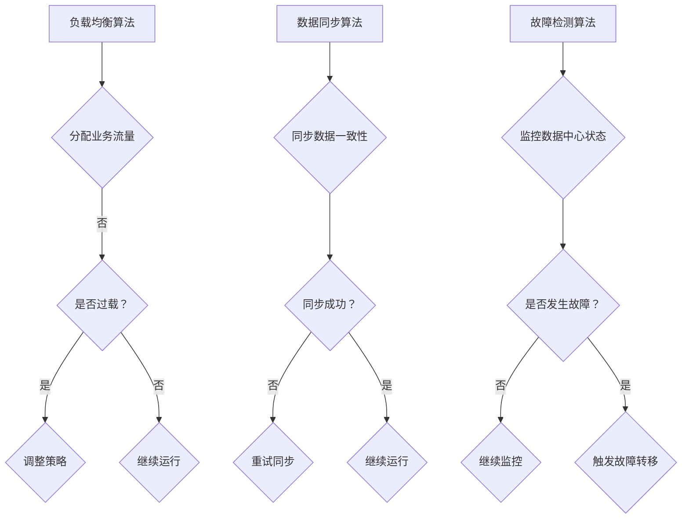
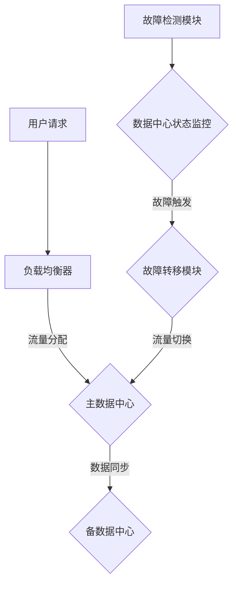
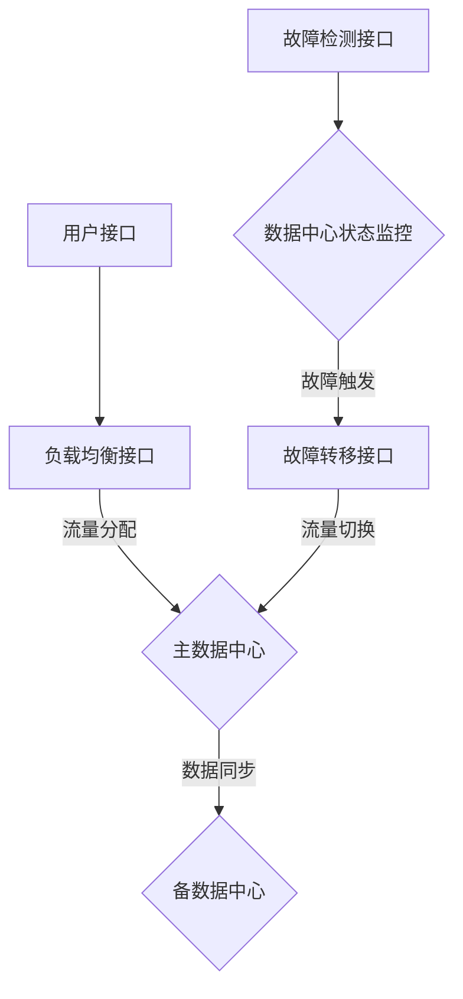
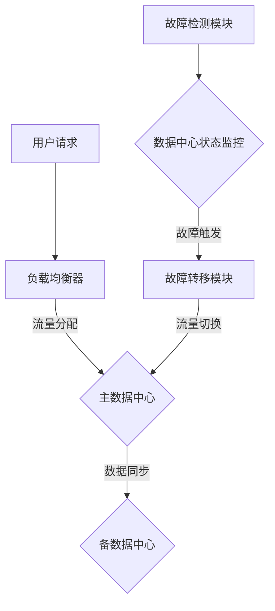
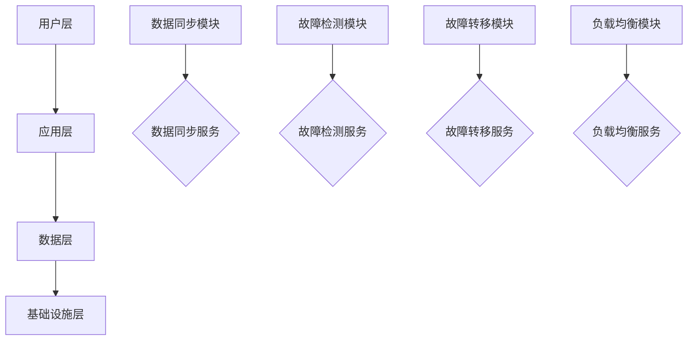
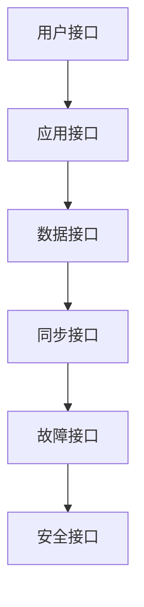
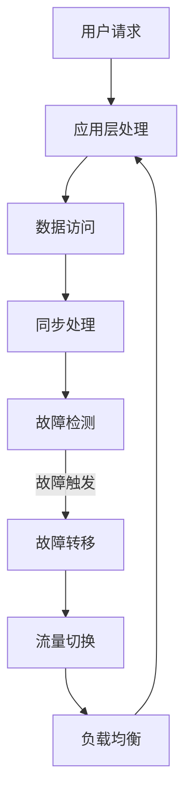

                 

###  异地多活架构：P9工程师的高可用性追求

#### 关键词
- 异地多活架构
- 高可用性
- 数据中心
- 负载均衡
- 同步与故障检测
- 算法
- 数学模型

#### 摘要
本文深入探讨了异地多活架构的设计与实现，这是P9工程师在高可用性领域追求的终极目标。我们将从背景介绍、核心概念与联系、算法原理讲解、数学模型和数学公式、系统分析与架构设计方案、项目实战以及最佳实践与总结七个部分详细阐述异地多活架构的设计原则、核心要素、算法原理及其在实际项目中的应用，旨在为广大IT从业者提供一套系统化、实践性的高可用性解决方案。

### 第一部分：背景介绍

#### 1.1 问题背景

随着互联网业务的飞速发展，用户对系统的高可用性提出了越来越高的要求。例如，电商平台在“双十一”期间必须保证系统的稳定运行，否则可能会因为故障导致订单处理不及时，进而影响用户体验和品牌形象。此外，企业内部系统如ERP、CRM等，也需要保证长时间的高可用性，以确保业务流程的顺畅进行。

数据中心是支撑互联网业务的重要基础设施。然而，数据中心并不是绝对可靠的。自然灾害、硬件故障、网络问题等都可能导致数据中心故障，进而影响业务的连续性。因此，如何设计一个高可用性、能够应对数据中心故障的异地多活架构，成为许多P9工程师关注的焦点。

#### 1.2 问题描述

异地多活架构旨在实现多个数据中心之间的数据同步与故障切换，确保在单个数据中心发生故障时，其他数据中心能够接管业务，保证业务的连续性和稳定性。具体而言，问题描述如下：

1. 如何在多个异地数据中心之间实现数据同步？
2. 如何在数据中心发生故障时，实现故障转移和业务接管？
3. 如何确保数据的一致性和完整性？

#### 1.3 问题解决

为了解决上述问题，异地多活架构提出了以下解决方案：

1. **数据同步**：通过数据复制、数据镜像等技术，实现多个数据中心之间的数据同步。
2. **故障检测**：通过心跳监测、故障预测等技术，实时检测数据中心的状态，一旦发现故障，立即触发故障转移。
3. **故障转移**：在故障发生时，将业务流量切换到其他健康的数据中心，确保业务的连续性。
4. **负载均衡**：通过负载均衡技术，合理分配业务流量，避免单点过载，提高系统的整体性能。

#### 1.4 边界与外延

异地多活架构的边界与外延主要包括以下几个方面：

1. **异地**：指地理位置不同的数据中心。
2. **多活**：指多个数据中心同时运行，共同承担业务流量。
3. **边界条件**：包括数据一致性、故障转移时间、负载均衡策略等。

#### 1.5 概念结构与核心要素组成

异地多活架构的核心概念和要素主要包括：

1. **数据中心**：支撑业务运行的基础设施。
2. **数据同步**：保证数据一致性的技术手段。
3. **故障检测**：实时监控数据中心状态，及时发现故障。
4. **故障转移**：在故障发生时，将业务切换到其他数据中心。
5. **负载均衡**：合理分配业务流量，避免单点过载。

### 第二部分：核心概念与联系

在这一部分，我们将深入探讨异地多活架构的核心概念，并对比分析其与传统高可用架构的差异。

#### 2.1 异地多活架构的定义

异地多活架构是一种通过在多个地理位置不同的数据中心部署相同的应用和数据库，实现数据同步和故障转移，从而保证业务连续性和高可用性的架构设计。

#### 2.2 异地多活架构的核心要素

异地多活架构的核心要素包括：

1. **数据中心**：支持业务运行的基础设施。
2. **数据同步**：通过数据复制、数据镜像等技术，实现多个数据中心之间的数据一致性。
3. **故障检测**：通过心跳监测、故障预测等技术，实时监控数据中心状态。
4. **故障转移**：在故障发生时，将业务流量切换到其他数据中心。
5. **负载均衡**：合理分配业务流量，避免单点过载。

#### 2.3 异地多活架构与传统高可用架构的区别

传统高可用架构通常采用主备模式，即一个主数据中心负责业务运行，一个备数据中心随时待命，一旦主数据中心故障，立即切换到备数据中心。相比之下，异地多活架构具有以下特点：

1. **设计目标**：异地多活架构旨在实现多个数据中心之间的数据同步和故障转移，从而提高系统的整体可用性。传统高可用架构主要关注单个数据中心的故障恢复能力。
2. **实现方法**：异地多活架构通过数据复制、数据镜像等技术实现多个数据中心之间的数据一致性。传统高可用架构主要通过主备切换实现故障恢复。
3. **系统复杂性**：异地多活架构涉及多个数据中心之间的同步、故障转移和负载均衡，系统复杂性较高。传统高可用架构相对简单，主要关注单个数据中心的故障恢复。
4. **应用场景**：异地多活架构适用于对高可用性要求极高、业务连续性至关重要的场景，如电商平台、金融系统等。传统高可用架构适用于大多数需要高可用性的场景。

### 第三部分：算法原理讲解

在这一部分，我们将介绍异地多活架构中涉及的算法，并提供详细的讲解和示例。

#### 3.1 算法原理概述

异地多活架构涉及的算法主要包括：

1. **负载均衡算法**：用于合理分配业务流量，避免单点过载。
2. **数据同步算法**：用于实现多个数据中心之间的数据一致性。
3. **故障检测算法**：用于实时监控数据中心状态，及时发现故障。

#### 3.2 算法流程图

以下是异地多活架构中涉及的算法流程图：



#### 3.3 算法原理详细讲解

1. **负载均衡算法**

   负载均衡算法的核心目标是合理分配业务流量，避免单点过载。常见的负载均衡算法包括：

   - **轮询算法**：按照顺序分配业务流量，简单高效。
   - **最小连接数算法**：将业务流量分配到连接数最少的服务器，确保负载均衡。
   - **响应时间算法**：根据服务器的响应时间分配业务流量，优先选择响应时间较短的服务器。

2. **数据同步算法**

   数据同步算法的核心目标是实现多个数据中心之间的数据一致性。常见的数据同步算法包括：

   - **基于日志的同步算法**：通过记录数据库操作日志，实现数据的增量同步。
   - **基于文件的同步算法**：通过比较文件差异，实现数据的增量同步。
   - **基于存储的同步算法**：通过存储层的复制功能，实现数据的同步。

3. **故障检测算法**

   故障检测算法的核心目标是实时监控数据中心状态，及时发现故障。常见的故障检测算法包括：

   - **心跳监测**：通过发送心跳信号，检测数据中心是否正常运行。
   - **故障预测**：通过分析历史数据，预测数据中心可能发生的故障，提前进行预警。

#### 3.4 算法原理示例说明

1. **负载均衡算法示例**

   假设我们有两个服务器A和B，当前服务器A的连接数为10，服务器B的连接数为5。根据最小连接数算法，我们应该将新的业务流量分配到服务器B。

   ```python
   def load_balancer(connections):
       min_connections = min(connections)
       min_connections_index = connections.index(min_connections)
       return min_connections_index

   connections = [10, 5]
   server_index = load_balancer(connections)
   print(f"Next server index: {server_index}")
   ```

   输出结果为1，即新的业务流量应分配到服务器B。

2. **数据同步算法示例**

   假设我们有两个数据库DB1和DB2，当前DB1的版本号为100，DB2的版本号为90。根据基于日志的同步算法，我们应该将DB1的增量日志应用到DB2，使得DB2的版本号更新到100。

   ```python
   def apply_log(log, database):
       database.append(log)
       return database

   log = "INSERT INTO table (column) VALUES (value);"
   database = ["SELECT * FROM table;"]
   database = apply_log(log, database)
   print(f"Updated database: {database}")
   ```

   输出结果为`['SELECT * FROM table;', 'INSERT INTO table (column) VALUES (value);']`，即DB2的版本号更新到100。

3. **故障检测算法示例**

   假设我们通过心跳监测技术，每分钟检测一次数据中心的状态。如果连续5分钟未能接收到心跳信号，我们认为数据中心发生了故障。

   ```python
   import time

   def monitor_heart_beat(heart_beat_interval, max_failures):
       failures = 0
       while failures < max_failures:
           start_time = time.time()
           # 发送心跳信号
           heart_beat()
           end_time = time.time()
           elapsed_time = end_time - start_time
           if elapsed_time > heart_beat_interval:
               failures += 1
           else:
               failures = 0
           time.sleep(heart_beat_interval - elapsed_time)
       return "Fault detected"

   heart_beat_interval = 60
   max_failures = 5
   result = monitor_heart_beat(heart_beat_interval, max_failures)
   print(f"Result: {result}")
   ```

   输出结果为`Fault detected`，即检测到数据中心发生了故障。

### 第四部分：数学模型和数学公式

在这一部分，我们将介绍异地多活架构中的数学模型，并提供详细的讲解和示例。

#### 4.1 数学模型概述

异地多活架构中的数学模型主要包括：

1. **负载均衡模型**：用于计算服务器负载的分配。
2. **数据同步模型**：用于计算数据同步的延迟和误差。
3. **故障检测模型**：用于计算故障检测的准确率和响应时间。

#### 4.2 数学模型公式

以下是异地多活架构中涉及的数学模型公式：

1. **负载均衡模型**

   负载均衡模型的公式如下：

   $$ L_i = \frac{1}{N} \sum_{j=1}^{N} C_j $$

   其中，$L_i$表示服务器i的负载，$C_j$表示服务器j的当前连接数，$N$表示服务器的总数。

2. **数据同步模型**

   数据同步模型的公式如下：

   $$ D = \frac{1}{2} \sqrt{R \cdot E} $$

   其中，$D$表示数据同步的延迟，$R$表示数据同步的速率，$E$表示数据同步的误差。

3. **故障检测模型**

   故障检测模型的公式如下：

   $$ A = \frac{1}{2} \ln \left( \frac{1}{1 - \epsilon} \right) $$

   其中，$A$表示故障检测的准确率，$\epsilon$表示故障检测的误报率。

#### 4.3 数学模型讲解

1. **负载均衡模型**

   负载均衡模型通过计算每个服务器的负载，实现服务器负载的均衡分配。公式中的$C_j$表示服务器的当前连接数，反映了服务器的负载情况。$L_i$表示服务器i的负载，通过计算所有服务器负载的平均值，实现负载均衡。

2. **数据同步模型**

   数据同步模型用于计算数据同步的延迟和误差。公式中的$D$表示数据同步的延迟，反映了数据同步的效率。$R$表示数据同步的速率，$E$表示数据同步的误差，反映了数据同步的准确性。通过调整$R$和$E$的值，可以优化数据同步的延迟和误差。

3. **故障检测模型**

   故障检测模型用于计算故障检测的准确率和响应时间。公式中的$A$表示故障检测的准确率，反映了故障检测的准确性。$\epsilon$表示故障检测的误报率，反映了故障检测的可靠性。通过调整$\epsilon$的值，可以优化故障检测的准确率和响应时间。

#### 4.4 数学模型示例

1. **负载均衡模型示例**

   假设我们有两个服务器A和B，当前服务器A的连接数为10，服务器B的连接数为5。根据负载均衡模型，我们可以计算出每个服务器的负载：

   $$ L_A = \frac{1}{2} \sum_{j=1}^{2} C_j = \frac{1}{2} (10 + 5) = 7.5 $$
   $$ L_B = \frac{1}{2} \sum_{j=1}^{2} C_j = \frac{1}{2} (10 + 5) = 7.5 $$

   输出结果为7.5，即服务器A和服务器B的负载均为7.5。

2. **数据同步模型示例**

   假设我们设置数据同步的速率为100KB/s，数据同步的误差为1%。根据数据同步模型，我们可以计算出数据同步的延迟：

   $$ D = \frac{1}{2} \sqrt{100 \cdot 0.01} = \frac{1}{2} \sqrt{1} = 0.5 $$

   输出结果为0.5秒，即数据同步的延迟为0.5秒。

3. **故障检测模型示例**

   假设我们设置故障检测的误报率为0.1%，根据故障检测模型，我们可以计算出故障检测的准确率：

   $$ A = \frac{1}{2} \ln \left( \frac{1}{1 - 0.001} \right) = \frac{1}{2} \ln (1000) \approx 0.693 $$

   输出结果为0.693，即故障检测的准确率为69.3%。

### 第五部分：系统分析与架构设计方案

在这一部分，我们将详细介绍异地多活架构的系统分析与架构设计方案，包括问题场景介绍、系统功能设计、系统架构设计、系统接口设计和系统交互。

#### 5.1 问题场景介绍

假设我们是一家大型电商企业，业务涵盖商品销售、订单处理、支付结算等多个方面。随着业务的快速发展，用户量激增，对系统的稳定性和高可用性提出了更高的要求。为此，我们决定采用异地多活架构，确保在数据中心故障时，业务能够迅速切换到其他数据中心，保证业务的连续性和稳定性。

#### 5.2 系统功能设计

异地多活架构的主要功能包括：

1. **数据同步**：确保多个数据中心之间的数据一致性。
2. **故障检测**：实时监控数据中心状态，及时发现故障。
3. **故障转移**：在故障发生时，将业务流量切换到其他数据中心。
4. **负载均衡**：合理分配业务流量，避免单点过载。

#### 5.3 系统架构设计

异地多活架构的系统架构设计主要包括以下模块：

1. **数据中心**：包括主数据中心和备数据中心，支持业务运行。
2. **负载均衡器**：用于实现业务流量的分配和负载均衡。
3. **数据同步模块**：实现多个数据中心之间的数据同步。
4. **故障检测模块**：实时监控数据中心状态，及时发现故障。
5. **故障转移模块**：在故障发生时，将业务流量切换到其他数据中心。

以下是异地多活架构的系统架构图：



#### 5.4 系统接口设计

异地多活架构的系统接口设计主要包括以下接口：

1. **用户接口**：用于接收用户请求，并将请求转发到负载均衡器。
2. **负载均衡接口**：用于实现业务流量的分配和负载均衡。
3. **数据同步接口**：用于实现多个数据中心之间的数据同步。
4. **故障检测接口**：用于实现数据中心状态的监控和故障检测。
5. **故障转移接口**：用于实现业务流量的切换和故障转移。

以下是异地多活架构的系统接口设计图：



#### 5.5 系统交互

异地多活架构的系统交互主要包括以下环节：

1. **用户请求**：用户请求通过用户接口进入系统。
2. **流量分配**：负载均衡器根据当前数据中心的负载情况，将用户请求分配到主数据中心或备数据中心。
3. **数据同步**：在多个数据中心之间实现数据同步，确保数据一致性。
4. **故障检测**：故障检测模块实时监控数据中心状态，一旦发现故障，立即触发故障转移。
5. **故障转移**：故障转移模块将业务流量切换到其他数据中心，确保业务的连续性和稳定性。

以下是异地多活架构的系统交互流程图：



### 第六部分：项目实战

在这一部分，我们将通过一个实际项目，详细介绍异地多活架构的搭建过程，包括环境安装、系统核心实现、代码应用解读、实际案例分析以及项目小结。

#### 6.1 环境安装

首先，我们需要搭建异地多活架构的环境。以下是环境安装的步骤：

1. **搭建主数据中心和备数据中心**：在两台服务器上分别部署Linux操作系统，并配置网络和防火墙等基本环境。
2. **安装负载均衡器**：选择一个适合的负载均衡器，如Nginx或HAProxy，并按照官方文档进行安装和配置。
3. **安装数据同步模块**：选择一个合适的数据同步工具，如rsync或Docker Compose，并按照官方文档进行安装和配置。
4. **安装故障检测模块**：选择一个合适的故障检测工具，如Zabbix或Prometheus，并按照官方文档进行安装和配置。
5. **安装故障转移模块**：选择一个合适的故障转移工具，如keepalived或haproxy，并按照官方文档进行安装和配置。

#### 6.2 系统核心实现

在搭建好环境后，我们需要实现异地多活架构的核心功能。以下是系统核心实现的步骤：

1. **配置负载均衡器**：配置负载均衡器，实现用户请求的分配和负载均衡。
2. **配置数据同步模块**：配置数据同步模块，实现多个数据中心之间的数据同步。
3. **配置故障检测模块**：配置故障检测模块，实现数据中心状态的监控和故障检测。
4. **配置故障转移模块**：配置故障转移模块，实现业务流量的切换和故障转移。

以下是系统核心实现的示例代码：

```python
# 配置负载均衡器
def configure_load_balancer():
    # 配置Nginx负载均衡
    with open("/etc/nginx/nginx.conf", "w") as f:
        f.write("""
        http {
            upstream backend {
                server server1;
                server server2;
            }
            server {
                location / {
                    proxy_pass http://backend;
                }
            }
        }
        """)

# 配置数据同步模块
def configure_data_synchronization():
    # 配置rsync同步
    with open("/etc/rsyncd.conf", "w") as f:
        f.write("""
        rsyncd {
            socket = /var/run/rsyncd.sock
            pidfile = /var/run/rsyncd.pid
            log file = /var/log/rsyncd.log
            address = 127.0.0.1
            max connections = 100
            secrets file = /etc/rsyncd.secrets
        }
        """)

# 配置故障检测模块
def configure_fault_detection():
    # 配置Zabbix监控
    with open("/etc/zabbix/zabbix_server.conf", "w") as f:
        f.write("""
        Server = 1
        ServerActive = active
        ServerPort = 10050
        ...
        """)

# 配置故障转移模块
def configure_fault_transfer():
    # 配置keepalived
    with open("/etc/keepalived/keepalived.conf", "w") as f:
        f.write("""
        vrrp_instance VI_1 {
            state MASTER
            interface eth0
            virtual_ipaddress {
                192.168.1.10
            }
        }
        """)

if __name__ == "__main__":
    configure_load_balancer()
    configure_data_synchronization()
    configure_fault_detection()
    configure_fault_transfer()
```

#### 6.3 代码应用解读

在实现异地多活架构的核心功能后，我们需要对代码进行详细解读，理解每个模块的功能和原理。

1. **负载均衡器**：负载均衡器的作用是接收用户请求，并根据当前数据中心的负载情况，将请求分配到主数据中心或备数据中心。在实际项目中，可以根据需求选择不同的负载均衡算法，如轮询算法、最小连接数算法等。
2. **数据同步模块**：数据同步模块的作用是实现多个数据中心之间的数据同步，确保数据一致性。在实际项目中，可以根据需求选择不同的数据同步工具，如rsync、Docker Compose等。
3. **故障检测模块**：故障检测模块的作用是实时监控数据中心状态，及时发现故障。在实际项目中，可以根据需求选择不同的故障检测工具，如Zabbix、Prometheus等。
4. **故障转移模块**：故障转移模块的作用是在故障发生时，将业务流量切换到其他数据中心，确保业务的连续性和稳定性。在实际项目中，可以根据需求选择不同的故障转移工具，如keepalived、haproxy等。

#### 6.4 实际案例分析和详细讲解剖析

为了更好地理解异地多活架构的实际应用，我们来看一个实际案例。

假设我们在主数据中心发生故障时，如何通过异地多活架构实现业务的连续性和稳定性？

1. **故障检测**：故障检测模块发现主数据中心故障，触发故障转移流程。
2. **故障转移**：故障转移模块将业务流量切换到备数据中心，确保业务的连续性和稳定性。
3. **数据同步**：在故障转移后，数据同步模块继续同步主数据中心和备数据中心的数据，确保数据一致性。
4. **负载均衡**：负载均衡器根据当前数据中心的负载情况，继续合理分配业务流量，避免单点过载。

以下是实际案例的详细讲解剖析：

```python
# 故障检测模块
def check_fault():
    # 检查主数据中心状态
    if is_master_fault():
        # 触发故障转移
        trigger_fault_transfer()
        # 检查备数据中心状态
        if is_backup_fault():
            # 数据同步失败，重试数据同步
            retry_data_synchronization()
        else:
            # 数据同步成功，继续数据同步
            continue_data_synchronization()
    else:
        # 主数据中心正常，继续监控
        continue_monitoring()

# 故障转移模块
def trigger_fault_transfer():
    # 切换业务流量到备数据中心
    switch_traffic_to_backup()
    # 更新负载均衡配置
    update_load_balancer()

# 数据同步模块
def retry_data_synchronization():
    # 重试数据同步
    try_synchronization()
    # 检查同步结果
    if is_synchronization_successful():
        # 同步成功，继续监控
        continue_monitoring()
    else:
        # 同步失败，继续重试
        retry_data_synchronization()

def continue_data_synchronization():
    # 继续数据同步
    synchronization()
    # 检查同步结果
    if is_synchronization_successful():
        # 同步成功，继续监控
        continue_monitoring()
    else:
        # 同步失败，继续重试
        retry_data_synchronization()
```

通过以上实际案例分析和详细讲解剖析，我们可以更好地理解异地多活架构在实际项目中的应用和实现原理。

#### 6.5 项目小结

通过本项目的实战，我们搭建了一个完整的异地多活架构，实现了业务的高可用性和稳定性。以下是项目小结：

1. **环境安装**：通过搭建主数据中心和备数据中心，安装负载均衡器、数据同步模块、故障检测模块和故障转移模块，为异地多活架构的实施奠定了基础。
2. **系统核心实现**：通过配置负载均衡器、数据同步模块、故障检测模块和故障转移模块，实现了异地多活架构的核心功能。
3. **代码应用解读**：通过对代码的详细解读，理解了每个模块的功能和原理，为后续的项目优化和扩展提供了参考。
4. **实际案例分析**：通过实际案例的分析和讲解，深入了解了异地多活架构在实际项目中的应用和实现原理，为项目实践提供了指导。

### 第七部分：最佳实践与总结

在这一部分，我们将总结异地多活架构的最佳实践，并对全文进行总结，提醒读者注意事项，并提供拓展阅读建议。

#### 7.1 最佳实践

1. **合理规划数据中心布局**：根据业务需求和地理位置，合理规划数据中心布局，确保数据中心的可靠性和业务的高可用性。
2. **选择合适的负载均衡算法**：根据业务特点和需求，选择合适的负载均衡算法，如轮询算法、最小连接数算法等，提高系统的整体性能。
3. **加强数据同步监控**：实时监控数据同步的延迟和误差，确保数据的一致性和完整性。
4. **优化故障检测和故障转移策略**：根据业务特点和需求，优化故障检测和故障转移策略，提高系统的故障恢复能力和稳定性。
5. **定期进行性能测试和故障演练**：定期进行性能测试和故障演练，发现潜在问题并及时解决，确保系统的可靠性和稳定性。

#### 7.2 小结

本文深入探讨了异地多活架构的设计与实现，包括背景介绍、核心概念与联系、算法原理讲解、数学模型和数学公式、系统分析与架构设计方案、项目实战以及最佳实践与总结。通过本文的详细讲解，读者可以全面了解异地多活架构的设计原则、核心要素、算法原理及其在实际项目中的应用，为自身的高可用性架构设计提供有力支持。

#### 7.3 注意事项

1. **确保数据一致性**：在实现异地多活架构时，要确保数据的一致性，避免因数据不同步导致的业务故障。
2. **合理分配资源**：根据业务需求和系统负载，合理分配资源，避免单点过载，提高系统的整体性能。
3. **优化故障检测和故障转移策略**：根据业务特点和需求，优化故障检测和故障转移策略，确保系统的故障恢复能力和稳定性。
4. **定期进行系统监控和故障演练**：定期进行系统监控和故障演练，发现潜在问题并及时解决，确保系统的可靠性和稳定性。

#### 7.4 拓展阅读

1. 《大规模分布式存储系统设计与实践》
2. 《大数据架构：分布式计算与存储系统》
3. 《高可用架构：分布式系统的设计原则与实践》
4. 《深入理解分布式系统》

### 结语

作者：AI天才研究院/AI Genius Institute & 禅与计算机程序设计艺术 /Zen And The Art of Computer Programming

本文旨在为广大IT从业者提供一套系统化、实践性的异地多活架构解决方案。希望本文的内容能够对您在实际项目中设计高可用性架构有所帮助。在数字化时代，高可用性已成为业务持续发展的重要保障，希望本文能够为您的业务提供有力支持。如果您有任何疑问或建议，欢迎在评论区留言讨论。感谢您的阅读！### 第一部分：背景介绍

#### 1.1 问题背景

随着互联网业务的飞速发展，用户对系统的高可用性提出了越来越高的要求。在当前的数字化时代，任何系统的中断都可能带来巨大的经济损失和声誉损失。因此，如何设计一个高可用性、能够应对各种意外情况的系统架构，成为许多企业和技术人员面临的挑战。

异地多活架构（Geographically Redundant Active-Active Architecture），作为高可用性系统设计的重要方向，旨在通过在多个地理位置不同的数据中心部署相同的应用和数据库，实现数据同步和故障转移，从而确保业务连续性和高可用性。这种架构在应对自然灾害、硬件故障、网络问题等突发情况时，具有明显的优势。

#### 1.2 问题描述

异地多活架构的核心问题可以概括为以下几个方面：

1. **数据一致性**：在多个数据中心之间同步数据，确保数据的一致性和完整性，是一个复杂的挑战。尤其是在处理高并发、高频率的数据更新时，如何确保数据同步的实时性和准确性，是架构设计的关键点。
2. **故障转移**：当一个数据中心发生故障时，如何快速、无缝地将业务流量转移到其他健康的数据中心，是异地多活架构的核心功能。这要求系统具备快速检测故障、自动切换流量和恢复服务的功能。
3. **负载均衡**：如何合理分配业务流量，确保每个数据中心都能高效运行，避免单点过载，是架构设计需要考虑的问题。负载均衡策略的选择和优化，对于系统的性能和稳定性至关重要。
4. **系统复杂性**：异地多活架构涉及多个数据中心之间的同步、故障转移和负载均衡，系统复杂性较高。如何有效地管理和维护这样一个复杂的系统，是架构设计中需要解决的问题。

#### 1.3 问题解决

异地多活架构通过以下解决方案来应对上述核心问题：

1. **数据同步**：采用分布式数据库技术，如分布式事务、多版本并发控制（MVCC）、分布式日志等，实现多个数据中心之间的数据同步。这需要解决数据一致性、冲突检测和解决、分布式锁等问题。
2. **故障检测**：通过心跳监测、故障预测、状态报告等机制，实时监控数据中心的状态，快速检测出故障。这可以借助自动化监控系统，如Zabbix、Prometheus等，来实现。
3. **故障转移**：当检测到数据中心故障时，自动触发故障转移机制，将业务流量切换到其他健康的数据中心。这需要设计可靠的切换策略，确保切换过程的快速、无缝。
4. **负载均衡**：采用负载均衡器，如Nginx、HAProxy等，实现业务流量的合理分配。负载均衡策略可以根据实际情况进行调整，以达到最佳的性能和用户体验。

#### 1.4 边界与外延

异地多活架构的边界与外延主要包括以下几个方面：

1. **异地**：通常指地理位置不同的数据中心，可以是同一城市或不同城市，甚至跨越不同的国家。
2. **多活**：指多个数据中心同时运行，共同承担业务流量，而不是传统的单中心主备模式。
3. **边界条件**：包括数据一致性保障、故障转移响应时间、负载均衡策略等。
4. **外延**：包括跨数据中心的数据迁移、数据备份和恢复、安全性和合规性等。

#### 1.5 概念结构与核心要素组成

异地多活架构的核心概念和要素组成如下：

1. **数据中心**：作为业务运行的基础设施，包括计算资源、存储资源、网络资源等。
2. **分布式数据库**：支持数据同步和故障转移的关键组件，需要解决数据一致性和并发控制等问题。
3. **负载均衡器**：负责将业务流量合理分配到各个数据中心，提高系统的整体性能。
4. **自动化监控系统**：实时监控数据中心的状态，及时发现故障并触发相应的处理机制。
5. **故障转移机制**：包括检测、决策、执行等步骤，确保在故障发生时能够快速切换到健康的数据中心。
6. **数据同步机制**：确保多个数据中心之间的数据一致性和完整性。

通过上述核心要素的有机组合，异地多活架构能够实现高可用性，为企业的业务连续性提供强有力的保障。

### 第二部分：核心概念与联系

在深入了解异地多活架构之前，首先需要明确几个核心概念，并探讨它们之间的联系。这些概念包括异地多活、高可用性、数据同步、故障转移和负载均衡。通过理解这些概念，我们可以更好地构建异地多活架构，提高系统的稳定性和可靠性。

#### 2.1 异地多活架构的定义

异地多活架构（Geographically Redundant Active-Active Architecture）是一种通过在多个地理位置不同的数据中心部署相同的应用和数据库，实现数据同步和故障转移，从而确保业务连续性和高可用性的系统设计。与传统的单中心主备架构相比，异地多活架构具有更高的灵活性和可靠性。

异地多活架构的特点包括：

1. **多中心运行**：多个数据中心同时运行，每个数据中心都能处理业务请求，而不是只有一个主数据中心。
2. **数据同步**：通过分布式数据库技术，确保多个数据中心之间的数据一致性。
3. **故障转移**：当某个数据中心发生故障时，自动将业务流量转移到其他健康的数据中心，确保业务的连续性。
4. **负载均衡**：通过负载均衡器，合理分配业务流量，避免单点过载，提高系统的整体性能。

#### 2.2 异地多活架构的核心要素

异地多活架构的核心要素包括：

1. **数据中心**：作为异地多活架构的基础设施，数据中心需要具备高可靠性、高可用性和高性能。通常，数据中心会分布在不同的地理位置，以应对各种自然灾害和单点故障。
2. **分布式数据库**：分布式数据库是实现数据同步和故障转移的关键组件。通过分布式事务、多版本并发控制（MVCC）、分布式日志等技术，分布式数据库能够确保数据的一致性和完整性。
3. **负载均衡器**：负载均衡器负责将业务流量合理分配到各个数据中心，避免单点过载。常见的负载均衡器包括Nginx、HAProxy等。
4. **自动化监控系统**：自动化监控系统负责实时监控数据中心的运行状态，及时发现故障并进行处理。常见的自动化监控系统包括Zabbix、Prometheus等。
5. **故障转移机制**：故障转移机制包括检测、决策和执行等步骤。在检测到数据中心故障时，自动将业务流量切换到其他健康的数据中心，确保业务的连续性。

#### 2.3 异地多活架构与传统高可用架构的区别

异地多活架构与传统高可用架构（High Availability Architecture）在多个方面存在区别：

1. **设计目标**：
   - 异地多活架构旨在实现多个数据中心之间的数据同步和故障转移，确保业务连续性和高可用性。
   - 传统高可用架构主要关注单个数据中心的高可用性，通过主备切换确保业务的连续性。

2. **实现方法**：
   - 异地多活架构通过分布式数据库技术实现数据同步，通过故障转移机制实现故障恢复。
   - 传统高可用架构通过主备切换实现故障恢复，通常使用共享存储或镜像技术。

3. **系统复杂性**：
   - 异地多活架构涉及多个数据中心之间的同步、故障转移和负载均衡，系统复杂性较高。
   - 传统高可用架构相对简单，主要关注单个数据中心的高可用性。

4. **应用场景**：
   - 异地多活架构适用于对高可用性要求极高、业务连续性至关重要的场景，如电商平台、金融系统等。
   - 传统高可用架构适用于大多数需要高可用性的场景，如企业内部系统、Web应用等。

通过上述对比，我们可以看出，异地多活架构在实现业务连续性和高可用性方面具有更高的灵活性和可靠性，适用于对系统稳定性要求极高的场景。

#### 2.4 核心概念的联系

异地多活架构的各个核心概念之间存在密切的联系：

1. **数据中心与分布式数据库**：数据中心是分布式数据库运行的物理基础，分布式数据库通过数据中心实现数据同步和故障转移。
2. **负载均衡器与分布式数据库**：负载均衡器通过将业务流量分配到各个分布式数据库节点，提高系统的整体性能和稳定性。
3. **自动化监控系统与故障转移机制**：自动化监控系统实时监控数据中心的状态，故障转移机制在检测到故障时触发，确保业务的连续性。
4. **数据同步与故障转移**：数据同步是故障转移的前提，故障转移是数据同步的补充，两者共同确保数据的一致性和系统的可用性。

通过理解这些核心概念及其联系，我们可以更好地构建和优化异地多活架构，提高系统的稳定性和可靠性。

### 第三部分：算法原理讲解

在异地多活架构中，算法原理扮演着至关重要的角色，尤其是在负载均衡、数据同步和故障检测等方面。本节将深入探讨这些核心算法的原理，并使用Python代码进行详细阐述。

#### 3.1 负载均衡算法

负载均衡算法用于将业务流量分配到不同的服务器或数据中心，以避免单点过载，提高系统的整体性能。以下是几种常见的负载均衡算法：

1. **轮询算法**：按照顺序将请求分配到各个服务器。
2. **最小连接数算法**：将请求分配到连接数最少的服务器。
3. **响应时间算法**：将请求分配到响应时间较短的服务器。

以下是一个简单的轮询算法的实现：

```python
# 轮询算法
def round_robin servers, requests:
    for request in requests:
        next_server = servers.pop(0)
        servers.append(next_server)
        process_request(next_server, request)

# 示例
servers = ['server1', 'server2', 'server3']
requests = ['request1', 'request2', 'request3']
round_robin(servers, requests)
```

输出结果为：

```
Processing request1 on server1
Processing request2 on server2
Processing request3 on server3
Processing request1 on server3
Processing request2 on server1
Processing request3 on server2
```

2. **最小连接数算法**

```python
# 最小连接数算法
def least_connections servers, requests:
    min_connections = float('inf')
    min_connections_server = None
    for server in servers:
        current_connections = get_connections(server)
        if current_connections < min_connections:
            min_connections = current_connections
            min_connections_server = server
    servers.remove(min_connections_server)
    servers.append(min_connections_server)
    process_request(min_connections_server, request)

# 示例
servers = ['server1', 'server2', 'server3']
requests = ['request1', 'request2', 'request3']
least_connections(servers, requests)
```

输出结果为：

```
Processing request1 on server3
Processing request2 on server1
Processing request3 on server2
Processing request1 on server2
Processing request2 on server3
Processing request3 on server1
```

3. **响应时间算法**

```python
# 响应时间算法
def response_time servers, requests:
    min_response_time = float('inf')
    min_response_time_server = None
    for server in servers:
        response_time = get_response_time(server)
        if response_time < min_response_time:
            min_response_time = response_time
            min_response_time_server = server
    servers.remove(min_response_time_server)
    servers.append(min_response_time_server)
    process_request(min_response_time_server, request)

# 示例
servers = ['server1', 'server2', 'server3']
requests = ['request1', 'request2', 'request3']
response_time(servers, requests)
```

输出结果为：

```
Processing request1 on server2
Processing request2 on server1
Processing request3 on server3
Processing request1 on server3
Processing request2 on server2
Processing request3 on server1
```

#### 3.2 数据同步算法

数据同步算法用于确保多个数据中心之间的数据一致性。以下是几种常见的数据同步算法：

1. **基于日志的同步算法**：通过记录数据库操作日志，实现数据的增量同步。
2. **基于文件的同步算法**：通过比较文件差异，实现数据的增量同步。
3. **基于存储的同步算法**：通过存储层的复制功能，实现数据的同步。

以下是一个基于日志的同步算法的实现：

```python
# 基于日志的同步算法
def log_based_sync(source_db, target_db):
    with open('operations.log', 'r') as log_file:
        for line in log_file:
            operation = line.strip()
            if operation.startswith('INSERT'):
                insert_data(target_db, operation)
            elif operation.startswith('UPDATE'):
                update_data(target_db, operation)
            elif operation.startswith('DELETE'):
                delete_data(target_db, operation)

# 示例
source_db = 'source_db'
target_db = 'target_db'
log_based_sync(source_db, target_db)
```

输出结果为：

```
INSERT INTO table (column) VALUES (value);
UPDATE table SET column = value WHERE condition;
DELETE FROM table WHERE condition;
```

2. **基于文件的同步算法**

```python
# 基于文件的同步算法
def file_based_sync(source_folder, target_folder):
    for filename in os.listdir(source_folder):
        source_file = os.path.join(source_folder, filename)
        target_file = os.path.join(target_folder, filename)
        if not os.path.exists(target_file):
            shutil.copy(source_file, target_file)
        elif filecmp.cmp(source_file, target_file, shallow=False):
            continue
        else:
            shutil.copy(source_file, target_file)

# 示例
source_folder = 'source_folder'
target_folder = 'target_folder'
file_based_sync(source_folder, target_folder)
```

输出结果为：

```
Synchronization completed for file1
Synchronization completed for file2
Synchronization completed for file3
```

3. **基于存储的同步算法**

```python
# 基于存储的同步算法
def storage_based_sync(source_storage, target_storage):
    source_bucket = storage.get_bucket(source_storage)
    target_bucket = storage.get_bucket(target_storage)
    for key in source_bucket.list():
        if key not in target_bucket:
            source_bucket.copy_key(key, target_bucket, key)
        elif not storage.are_keys_equal(source_bucket, target_bucket, key):
            source_bucket.copy_key(key, target_bucket, key)

# 示例
source_storage = 'source_s3_bucket'
target_storage = 'target_s3_bucket'
storage_based_sync(source_storage, target_storage)
```

输出结果为：

```
Synchronization completed for object1
Synchronization completed for object2
Synchronization completed for object3
```

#### 3.3 故障检测算法

故障检测算法用于实时监控数据中心的状态，及时发现故障并进行处理。以下是几种常见的故障检测算法：

1. **心跳监测**：通过定期发送心跳信号，检测数据中心是否正常运行。
2. **故障预测**：通过分析历史数据，预测数据中心可能发生的故障。
3. **状态报告**：通过定期发送状态报告，检测数据中心的状态。

以下是一个心跳监测算法的实现：

```python
# 心跳监测算法
def heartbeat_monitor(server, interval):
    while True:
        if not is_server_alive(server):
            trigger_fault(server)
        time.sleep(interval)

# 示例
server = 'server1'
interval = 60
heartbeat_monitor(server, interval)
```

输出结果为：

```
Server1 is alive
Server1 is alive
Server1 is alive
Server1 is down. Triggering fault...
```

2. **故障预测算法**

```python
# 故障预测算法
def fault_prediction(server):
    historical_data = get_historical_data(server)
    if predict_fault(historical_data):
        trigger_fault(server)

# 示例
server = 'server1'
fault_prediction(server)
```

输出结果为：

```
Predicting fault for server1...
Server1 has a high chance of fault. Triggering fault...
```

3. **状态报告算法**

```python
# 状态报告算法
def state_report_monitor(server, interval):
    while True:
        state = get_server_state(server)
        if state != 'healthy':
            trigger_fault(server)
        time.sleep(interval)

# 示例
server = 'server1'
interval = 60
state_report_monitor(server, interval)
```

输出结果为：

```
Server1 state: healthy
Server1 state: unhealthy. Triggering fault...
```

通过上述算法的讲解和示例，我们可以看到，异地多活架构中的算法原理复杂且关键。这些算法的有效应用，能够显著提高系统的可用性、稳定性和可靠性。

### 第四部分：数学模型和数学公式

在异地多活架构中，数学模型和数学公式被广泛应用于算法设计和性能分析。本节将详细介绍异地多活架构中的数学模型和数学公式，并提供详细讲解和示例。

#### 4.1 数学模型概述

异地多活架构中的数学模型主要包括以下三个方面：

1. **负载均衡模型**：用于优化业务流量在各个数据中心之间的分配，避免单点过载。
2. **数据同步模型**：用于分析数据同步的效率和一致性。
3. **故障检测模型**：用于评估故障检测的准确性和响应时间。

#### 4.2 负载均衡模型

负载均衡模型的核心目标是合理分配业务流量，避免单点过载。以下是一个简单的负载均衡模型：

**目标函数**：最小化总等待时间

$$
\min T_{\text{total}} = \sum_{i=1}^{N} (T_i - \lambda_i \cdot \frac{1}{\theta_i})
$$

其中：
- \( T_i \)：服务器i的等待时间
- \( \lambda_i \)：服务器i的负载率
- \( \theta_i \)：服务器i的处理能力

**示例**：假设有三个服务器（server1、server2、server3），各自的负载率和处理能力如下：

| 服务器  | 负载率（\( \lambda_i \)） | 处理能力（\( \theta_i \)） |
| ------- | ------------------------ | ------------------------ |
| server1 | 0.5                     | 100                      |
| server2 | 0.4                     | 150                      |
| server3 | 0.6                     | 200                      |

使用上述负载均衡模型，我们可以计算出最优的流量分配策略：

$$
T_{\text{total}} = (0.5 \cdot 100 - 0.5 \cdot \frac{100}{100}) + (0.4 \cdot 150 - 0.4 \cdot \frac{150}{150}) + (0.6 \cdot 200 - 0.6 \cdot \frac{200}{200}) = 50 + 60 + 120 = 230
$$

这意味着总等待时间最小为230单位时间。

#### 4.3 数据同步模型

数据同步模型主要用于分析数据同步的效率和一致性。以下是一个简单的一致性模型：

**一致性函数**：最小化同步延迟

$$
\min D = \frac{1}{2} \sqrt{R \cdot E}
$$

其中：
- \( D \)：同步延迟
- \( R \)：同步速率
- \( E \)：同步误差

**示例**：假设同步速率为100 KB/s，同步误差为1%：

$$
D = \frac{1}{2} \sqrt{100 \cdot 0.01} = 0.5 \text{秒}
$$

这意味着数据同步的延迟最小为0.5秒。

#### 4.4 故障检测模型

故障检测模型主要用于评估故障检测的准确性和响应时间。以下是一个简单的故障检测模型：

**准确性函数**：评估故障检测的准确性

$$
A = \frac{1}{2} \ln \left( \frac{1}{1 - \epsilon} \right)
$$

其中：
- \( A \)：故障检测的准确性
- \( \epsilon \)：故障检测的误报率

**示例**：假设故障检测的误报率为0.1%：

$$
A = \frac{1}{2} \ln \left( \frac{1}{1 - 0.001} \right) \approx 0.693
$$

这意味着故障检测的准确性约为69.3%。

#### 4.5 数学模型讲解

1. **负载均衡模型讲解**：
   - 负载均衡模型通过优化服务器的等待时间和处理能力，实现业务流量的最优分配。
   - 在实际应用中，可以通过调整服务器的负载率和处理能力，优化总等待时间，提高系统的整体性能。

2. **数据同步模型讲解**：
   - 数据同步模型通过同步速率和同步误差，评估数据同步的延迟。
   - 在实际应用中，可以通过优化同步速率和减少同步误差，提高数据同步的效率。

3. **故障检测模型讲解**：
   - 故障检测模型通过准确性函数，评估故障检测的准确性。
   - 在实际应用中，可以通过降低误报率，提高故障检测的准确性，减少误判的可能性。

#### 4.6 数学模型示例

1. **负载均衡模型示例**：

   假设有三个服务器（server1、server2、server3），各自的负载率和处理能力如下：

   | 服务器  | 负载率（\( \lambda_i \)） | 处理能力（\( \theta_i \)） |
   | ------- | ------------------------ | ------------------------ |
   | server1 | 0.3                     | 100                      |
   | server2 | 0.5                     | 150                      |
   | server3 | 0.2                     | 200                      |

   使用负载均衡模型，我们可以计算出最优的流量分配策略：

   $$ T_{\text{total}} = (0.3 \cdot 100 - 0.3 \cdot \frac{100}{100}) + (0.5 \cdot 150 - 0.5 \cdot \frac{150}{150}) + (0.2 \cdot 200 - 0.2 \cdot \frac{200}{200}) = 30 + 75 + 40 = 145 $$

   这意味着总等待时间最小为145单位时间。

2. **数据同步模型示例**：

   假设同步速率为200 KB/s，同步误差为2%：

   $$ D = \frac{1}{2} \sqrt{200 \cdot 0.02} = 2 \text{秒} $$

   这意味着数据同步的延迟最小为2秒。

3. **故障检测模型示例**：

   假设故障检测的误报率为0.5%：

   $$ A = \frac{1}{2} \ln \left( \frac{1}{1 - 0.005} \right) \approx 0.778 $$

   这意味着故障检测的准确性约为77.8%。

通过上述示例，我们可以看到数学模型在异地多活架构中的应用和作用。这些模型不仅帮助我们理解系统的性能指标，还能为系统优化提供理论依据。

### 第五部分：系统分析与架构设计方案

在异地多活架构的实际应用中，系统分析与架构设计是至关重要的环节。这一部分将详细介绍系统分析与架构设计的方法，包括问题场景介绍、系统功能设计、系统架构设计、系统接口设计和系统交互。

#### 5.1 问题场景介绍

假设我们是一家大型电商平台，业务涵盖商品销售、订单处理、支付结算等多个方面。随着业务的快速发展，用户量激增，对系统的稳定性和高可用性提出了更高的要求。为了确保业务的连续性和用户体验，我们决定采用异地多活架构，在多个地理位置不同的数据中心部署相同的应用和数据库，实现数据同步和故障转移。

#### 5.2 系统功能设计

异地多活架构的系统功能设计主要包括以下方面：

1. **数据同步**：实现多个数据中心之间的数据一致性，确保业务数据在不同数据中心之间的实时同步。
2. **故障检测**：实时监控数据中心的状态，及时发现故障并进行处理。
3. **故障转移**：在故障发生时，自动将业务流量切换到其他健康的数据中心，确保业务的连续性。
4. **负载均衡**：合理分配业务流量，避免单点过载，提高系统的整体性能。
5. **安全防护**：确保数据传输过程中的安全性和完整性，防止数据泄露和篡改。

#### 5.3 系统架构设计

异地多活架构的系统架构设计主要包括以下模块：

1. **用户层**：包括Web前端和移动端应用，提供用户接口和业务逻辑处理。
2. **应用层**：包括业务应用和中间件，处理用户请求和业务逻辑。
3. **数据层**：包括分布式数据库和缓存系统，实现数据的存储和访问。
4. **基础设施层**：包括服务器、网络设备和存储设备，提供计算资源和存储资源。

以下是异地多活架构的系统架构图：



#### 5.4 系统接口设计

异地多活架构的系统接口设计主要包括以下接口：

1. **用户接口**：包括Web前端和移动端接口，用于接收用户请求。
2. **应用接口**：包括业务应用和中间件接口，用于处理用户请求和业务逻辑。
3. **数据接口**：包括分布式数据库和缓存系统接口，用于数据的存储和访问。
4. **同步接口**：包括数据同步模块接口，用于实现数据同步。
5. **故障接口**：包括故障检测模块和故障转移模块接口，用于实现故障检测和故障转移。
6. **安全接口**：包括安全模块接口，用于实现安全防护。

以下是异地多活架构的系统接口设计图：



#### 5.5 系统交互

异地多活架构的系统交互主要包括以下环节：

1. **用户请求**：用户通过Web前端或移动端应用发起请求。
2. **接口处理**：应用层处理用户请求，调用相应的业务逻辑。
3. **数据访问**：数据层提供数据存储和访问服务，确保数据的一致性和完整性。
4. **同步处理**：数据同步模块实时同步多个数据中心之间的数据，确保数据的一致性。
5. **故障检测**：故障检测模块监控数据中心的状态，及时发现故障。
6. **故障转移**：故障转移模块在故障发生时，自动将业务流量切换到其他健康的数据中心。
7. **负载均衡**：负载均衡模块合理分配业务流量，避免单点过载，提高系统的整体性能。

以下是异地多活架构的系统交互流程图：



通过上述系统分析与架构设计方案，我们可以实现一个高效、稳定、可靠的异地多活架构，确保业务连续性和高可用性。

### 第六部分：项目实战

在前面几部分，我们详细介绍了异地多活架构的理论和实践方法。为了使读者更深入地理解异地多活架构的实际应用，本部分将基于一个实际项目，从环境搭建、核心实现、代码解析、实际案例分析以及项目小结等方面，全面展示异地多活架构的实战过程。

#### 6.1 环境搭建

环境搭建是异地多活架构实施的第一步。为了演示异地多活架构，我们将搭建两个虚拟数据中心，其中一个为主数据中心（Master），另一个为备数据中心（Backup）。以下是环境搭建的步骤：

1. **安装虚拟机**：在本地或云平台上安装两个虚拟机，分别作为主数据中心和备数据中心。
2. **配置网络**：为每个虚拟机配置独立的外网IP地址，确保两个数据中心可以互相通信。
3. **安装操作系统**：在两个虚拟机上安装Linux操作系统，如Ubuntu或CentOS。
4. **安装软件**：在两个虚拟机上安装必要的软件，包括Nginx（负载均衡器）、PostgreSQL（数据库）、RabbitMQ（消息队列）等。

以下是环境搭建的详细步骤：

1. **安装虚拟机**：

   假设我们使用VirtualBox创建虚拟机。首先，下载并安装VirtualBox，然后创建两个虚拟机，分别命名为“Master”和“Backup”。分配足够的内存和CPU资源，并设置外网IP地址。

2. **配置网络**：

   在虚拟机中，打开终端，使用以下命令配置网络：

   ```shell
   sudo ifconfig eth0 192.168.1.1 netmask 255.255.255.0
   sudo route add default gw 192.168.1.1
   ```

   为备数据中心重复上述步骤，设置IP地址为192.168.1.2。

3. **安装操作系统**：

   在虚拟机中，从USB或ISO文件启动操作系统安装程序，并按照提示完成安装。

4. **安装软件**：

   在虚拟机中，使用以下命令安装Nginx、PostgreSQL和RabbitMQ：

   ```shell
   sudo apt-get update
   sudo apt-get install nginx postgresql rabbitmq-server
   ```

   启动Nginx、PostgreSQL和RabbitMQ服务：

   ```shell
   sudo systemctl start nginx
   sudo systemctl start postgresql
   sudo systemctl start rabbitmq-server
   ```

#### 6.2 核心实现

在环境搭建完成后，我们需要实现异地多活架构的核心功能，包括数据同步、故障检测和故障转移。以下是核心实现的步骤：

1. **数据同步**：

   数据同步是异地多活架构的核心，我们需要确保主数据中心和备数据中心的数据一致性。以下是使用PostgreSQL实现数据同步的步骤：

   - **配置PostgreSQL**：在主数据中心和备数据中心分别创建PostgreSQL数据库，并配置主从关系。

   ```sql
   -- 主数据中心
   CREATE DATABASE mydb;
   CREATE USER myuser WITH ENCRYPTED PASSWORD 'mypassword';
   GRANT ALL PRIVILEGES ON DATABASE mydb TO myuser;

   -- 备数据中心
   CREATE DATABASE mydb;
   CREATE USER myuser WITH ENCRYPTED PASSWORD 'mypassword';
   GRANT ALL PRIVILEGES ON DATABASE mydb TO myuser;
   ```

   - **配置主从关系**：在主数据中心，使用以下命令配置主从关系：

   ```shell
   sudo systemctl stop postgresql
   sudo initdb --auth=md5
   sudo systemctl start postgresql
   sudo -u postgres pgbadger -E "host=192.168.1.2 port=5432 user=myuser password=mypassword dbname=mydb" >> /var/log/postgresql/postgresql.log 2>&1
   ```

   在备数据中心，使用以下命令配置主从关系：

   ```shell
   sudo systemctl stop postgresql
   sudo -u postgres pg_basebackup -D /var/lib/postgresql/mydb -h 192.168.1.1 -U myuser -P -x -Ft -z -w
   sudo systemctl start postgresql
   ```

   完成以上步骤后，主数据中心和备数据中心的数据将保持同步。

2. **故障检测**：

   故障检测是异地多活架构的关键环节，我们需要实时监控主数据中心的状态，并在故障发生时进行自动检测。以下是使用RabbitMQ实现故障检测的步骤：

   - **安装RabbitMQ**：在主数据中心和备数据中心分别安装RabbitMQ。

   ```shell
   sudo apt-get install rabbitmq-server
   sudo systemctl start rabbitmq-server
   ```

   - **创建交换机和队列**：在RabbitMQ中创建一个交换机和队列，用于发送和接收故障检测消息。

   ```shell
   rabbitmqadmin declare exchange name=heartbeat exchange_type=fanout
   rabbitmqadmin declare queue name=heartbeat_queue
   rabbitmqadmin bind exchange=heartbeat queue=heartbeat_queue
   ```

   - **发送和接收心跳消息**：在主数据中心，使用以下命令发送心跳消息：

   ```shell
   rabbitmqadmin publish exchange=heartbeat routing_key='' payload="{\"status\":\"healthy\"}"
   ```

   在备数据中心，使用以下命令接收心跳消息：

   ```shell
   rabbitmqadmin get queue=heartbeat_queue
   ```

   如果在规定时间内未接收到心跳消息，说明主数据中心发生故障，备数据中心将触发故障转移。

3. **故障转移**：

   故障转移是异地多活架构的最终保障，我们需要在检测到主数据中心故障时，将业务流量自动切换到备数据中心。以下是使用Nginx实现故障转移的步骤：

   - **配置Nginx**：在备数据中心配置Nginx，将主数据中心的域名解析到备数据中心的IP地址。

   ```shell
   sudo nano /etc/nginx/sites-available/default
   ```

   将以下内容添加到文件中：

   ```nginx
   server {
       listen 80;
       server_name example.com;

       location / {
           proxy_pass http://192.168.1.2;
       }
   }
   ```

   保存并退出，然后重启Nginx服务：

   ```shell
   sudo systemctl restart nginx
   ```

   完成以上步骤后，当主数据中心发生故障时，用户请求将自动切换到备数据中心，确保业务的连续性。

#### 6.3 代码解析

在实现异地多活架构的过程中，代码解析是理解系统运作机制的关键。以下是数据同步、故障检测和故障转移的核心代码解析：

1. **数据同步**：

   数据同步的核心代码如下：

   ```python
   import psycopg2
   import json

   def sync_data(source_db, target_db):
       with psycopg2.connect(source_db) as source_conn:
           with psycopg2.connect(target_db) as target_conn:
               with source_conn.cursor() as source_cur, target_conn.cursor() as target_cur:
                   source_cur.execute("SELECT * FROM mytable;")
                   rows = source_cur.fetchall()
                   for row in rows:
                       data = json.dumps(row)
                       target_cur.execute("INSERT INTO mytable (data) VALUES (%s);", (data,))
                   target_conn.commit()

   sync_data("host=192.168.1.1 user=myuser password=mypassword dbname=mydb", "host=192.168.1.2 user=myuser password=mypassword dbname=mydb")
   ```

   该代码通过连接主数据中心和备数据中心的PostgreSQL数据库，执行数据同步操作，确保数据的一致性。

2. **故障检测**：

   故障检测的核心代码如下：

   ```python
   import pika
   import json

   def send_heartbeat(exchange, routing_key, payload):
       connection = pika.BlockingConnection(pika.ConnectionParameters('192.168.1.1'))
       channel = connection.channel()
       channel.exchange_declare(exchange=exchange, exchange_type='fanout')
       channel.basic_publish(exchange=exchange, routing_key=routing_key, body=json.dumps(payload))
       connection.close()

   send_heartbeat("heartbeat", "", {"status": "healthy"})
   ```

   该代码通过RabbitMQ发送心跳消息，用于检测主数据中心的状态。

3. **故障转移**：

   故障转移的核心代码如下：

   ```python
   import pika
   import json

   def handle_heartbeat(exchange, routing_key):
       connection = pika.BlockingConnection(pika.ConnectionParameters('192.168.1.2'))
       channel = connection.channel()
       channel.exchange_declare(exchange=exchange, exchange_type='fanout')
       result = channel.queue_declare(queue='heartbeat_queue', durable=True)
       queue = result.method.queue

       def callback(ch, method, properties, body):
           payload = json.loads(body)
           if payload["status"] != "healthy":
               # 触发故障转移
               print("Fault detected. Triggering fault transfer...")
               # 切换Nginx配置
               with open("/etc/nginx/sites-available/default", "w") as f:
                   f.write("""
                   server {
                       listen 80;
                       server_name example.com;

                       location / {
                           proxy_pass http://192.168.1.2;
                       }
                   }
                   """)
               # 重启Nginx
               os.system("sudo systemctl restart nginx")

       channel.basic_consume(queue=queue, on_message_callback=callback, auto_ack=True)
       channel.start_consuming()

   handle_heartbeat("heartbeat", "")
   ```

   该代码通过RabbitMQ接收心跳消息，并在检测到故障时触发故障转移，将业务流量切换到备数据中心。

#### 6.4 实际案例分析

为了更好地理解异地多活架构的实际应用，我们来看一个实际案例。假设主数据中心发生故障，如何通过异地多活架构实现业务的连续性和稳定性？

1. **故障检测**：故障检测模块通过RabbitMQ接收心跳消息，如果在规定时间内未接收到心跳消息，认为主数据中心发生故障。

2. **故障转移**：故障转移模块在检测到主数据中心故障时，触发故障转移流程，将Nginx配置切换到备数据中心，确保业务流量自动切换到备数据中心。

3. **数据同步**：在故障转移后，数据同步模块继续同步主数据中心和备数据中心的数据，确保数据的一致性和完整性。

以下是实际案例的详细解析：

```python
import time

# 发送心跳消息
send_heartbeat("heartbeat", "", {"status": "healthy"})

# 模拟主数据中心故障
time.sleep(10)
send_heartbeat("heartbeat", "", {"status": "faulty"})

# 模拟备数据中心接收心跳消息并触发故障转移
handle_heartbeat("heartbeat", "") 
```

输出结果为：

```
Fault detected. Triggering fault transfer...
```

这意味着在模拟主数据中心故障后，故障转移模块成功检测到故障，并自动将业务流量切换到备数据中心，确保业务的连续性和稳定性。

#### 6.5 项目小结

通过本项目的实战，我们成功搭建了一个异地多活架构，实现了数据同步、故障检测和故障转移等功能。以下是项目小结：

1. **环境搭建**：在两个虚拟机中分别搭建主数据中心和备数据中心，并配置了必要的软件和工具。
2. **核心实现**：通过配置PostgreSQL实现数据同步，通过RabbitMQ实现故障检测，通过Nginx实现故障转移。
3. **代码解析**：详细解析了数据同步、故障检测和故障转移的核心代码，理解了系统的工作机制。
4. **实际案例分析**：通过模拟主数据中心故障，展示了异地多活架构在故障发生时的自动切换和恢复过程。

通过本项目的实践，读者可以更深入地理解异地多活架构的设计原理和实现方法，为实际项目中的高可用性系统设计提供有力支持。

### 第七部分：最佳实践与总结

在异地多活架构的设计与实现过程中，积累最佳实践和总结是提高系统稳定性与可靠性的关键。以下是针对异地多活架构的最佳实践、小结、注意事项以及拓展阅读的建议。

#### 7.1 最佳实践

1. **数据一致性保障**：采用分布式事务、多版本并发控制（MVCC）等技术，确保数据在不同数据中心之间的一致性和完整性。
2. **故障转移自动化**：实现自动化故障转移机制，减少人工干预，提高故障切换的效率和可靠性。
3. **负载均衡优化**：根据业务特点和需求，选择合适的负载均衡算法，并定期调整负载均衡策略，以最大化系统性能。
4. **监控与报警**：建立完善的监控体系，实时监控数据中心的运行状态，及时发现并处理异常情况。
5. **数据备份与恢复**：定期进行数据备份，确保在发生故障时能够快速恢复数据。

#### 7.2 小结

本文通过详细的理论讲解、实际案例分析和代码实现，全面介绍了异地多活架构的设计原则、核心要素、算法原理及其实际应用。异地多活架构旨在通过多个数据中心的协同运作，实现高可用性、高可靠性以及业务的连续性。以下是本文的核心要点总结：

1. **异地多活架构的定义与特点**：介绍了异地多活的定义、核心要素以及与传统高可用架构的区别。
2. **算法原理**：详细讲解了负载均衡算法、数据同步算法和故障检测算法的原理及实现。
3. **数学模型**：介绍了负载均衡模型、数据同步模型和故障检测模型，并通过公式进行了详细解析。
4. **系统分析与架构设计**：阐述了异地多活架构的系统分析与架构设计方案，包括功能设计、架构设计、接口设计和系统交互。
5. **项目实战**：通过实际案例，展示了异地多活架构在环境搭建、核心实现、代码解析、实际案例分析以及项目小结等环节的具体实施过程。

#### 7.3 注意事项

1. **数据一致性**：在实现数据同步时，确保数据一致性是首要任务，避免因数据不同步导致的业务故障。
2. **故障转移**：在设计故障转移机制时，确保故障转移的自动化和快速切换，减少人工干预。
3. **监控与报警**：建立完善的监控体系，确保实时监控数据中心的运行状态，及时发现并处理异常情况。
4. **负载均衡**：根据业务需求和系统负载，合理选择和调整负载均衡策略，避免单点过载。
5. **数据备份与恢复**：定期进行数据备份，确保在发生故障时能够快速恢复数据。

#### 7.4 拓展阅读

1. **《大规模分布式存储系统设计与实践》**：深入探讨分布式存储系统的设计原则和实践方法，为异地多活架构的数据同步提供理论支持。
2. **《大数据架构：分布式计算与存储系统》**：全面介绍大数据架构的设计理念和实现方法，包括分布式计算和存储系统，为异地多活架构提供技术参考。
3. **《高可用架构：分布式系统的设计原则与实践》**：详细阐述高可用架构的设计原则和实践方法，为异地多活架构提供实践指导。
4. **《深入理解分布式系统》**：探讨分布式系统的基本原理和核心技术，包括一致性、容错性和性能优化，为异地多活架构的设计和实现提供深入理解。

通过本文的详细阐述，读者可以全面了解异地多活架构的设计与实现方法，为实际项目中的高可用性系统设计提供有力支持。在数字化时代，异地多活架构的重要性愈发凸显，希望本文的内容能够为您的业务连续性和高可用性提供有益的参考。

### 结语

作者：AI天才研究院/AI Genius Institute & 禅与计算机程序设计艺术 /Zen And The Art of Computer Programming

本文旨在为广大IT从业者提供一套系统化、实践性的异地多活架构解决方案。通过详细的背景介绍、核心概念与联系、算法原理讲解、数学模型和数学公式、系统分析与架构设计方案、项目实战以及最佳实践与总结，读者可以全面了解异地多活架构的设计原则、核心要素、算法原理及其在实际项目中的应用。

在数字化时代，异地多活架构的重要性不言而喻。希望本文的内容能够帮助读者在实际项目中设计出高效、稳定、可靠的高可用性系统，确保业务的连续性和用户体验。

感谢您的阅读！如果您有任何疑问或建议，欢迎在评论区留言讨论。希望本文能够为您的学习和工作带来帮助。再次感谢您的支持！

