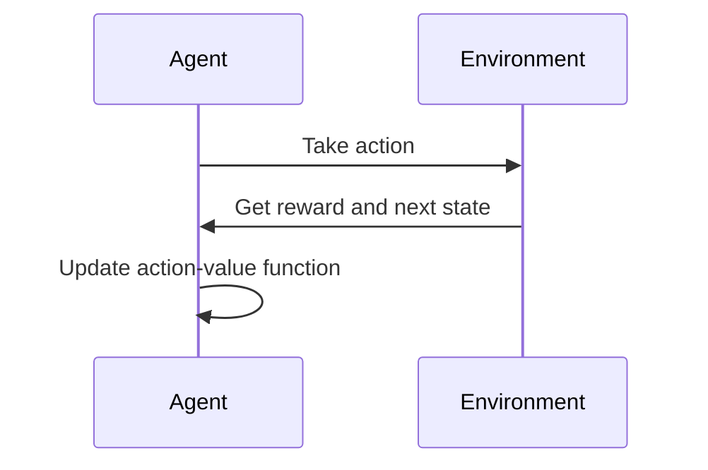
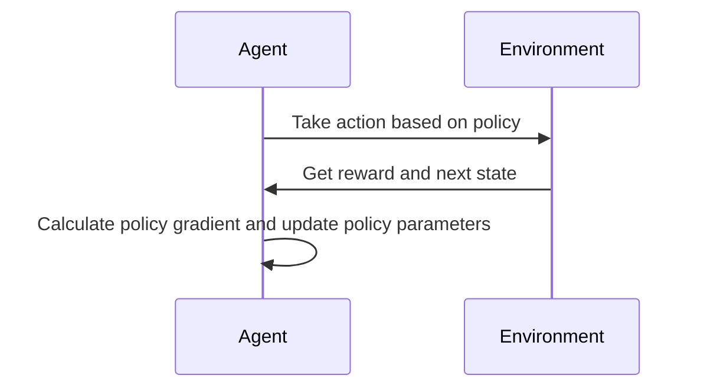
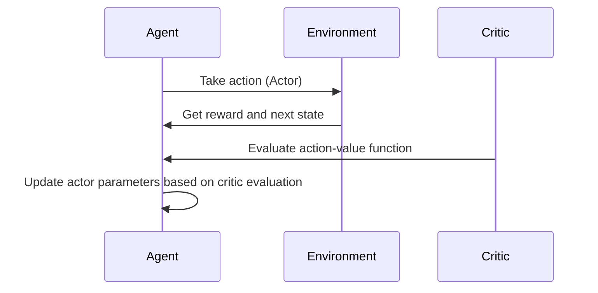
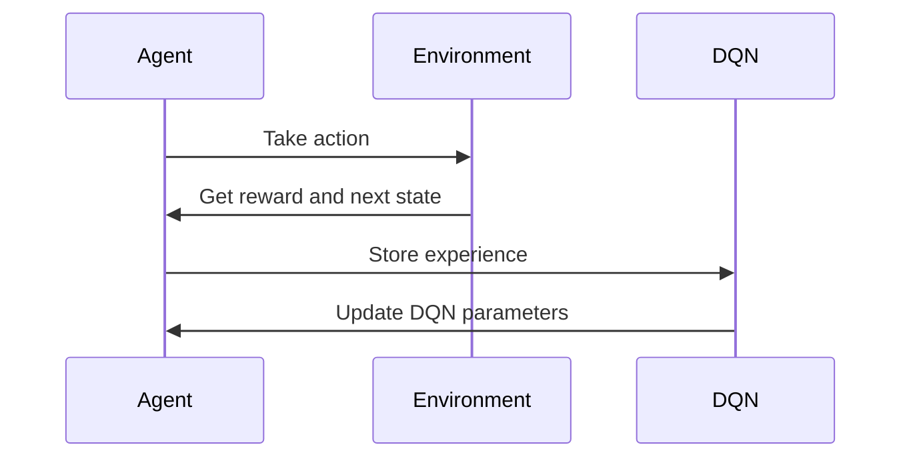
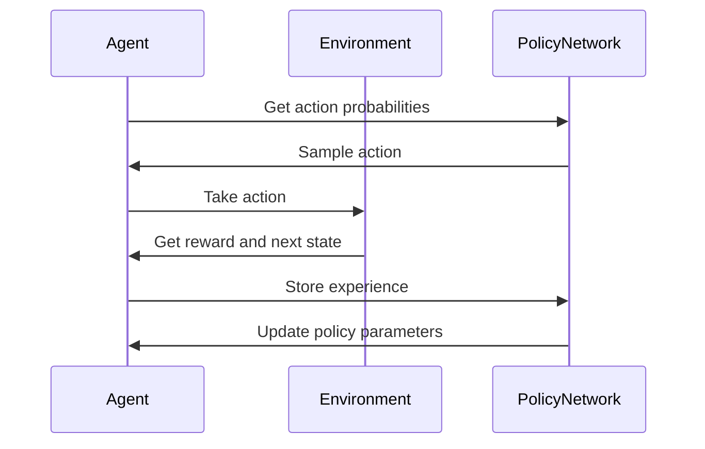
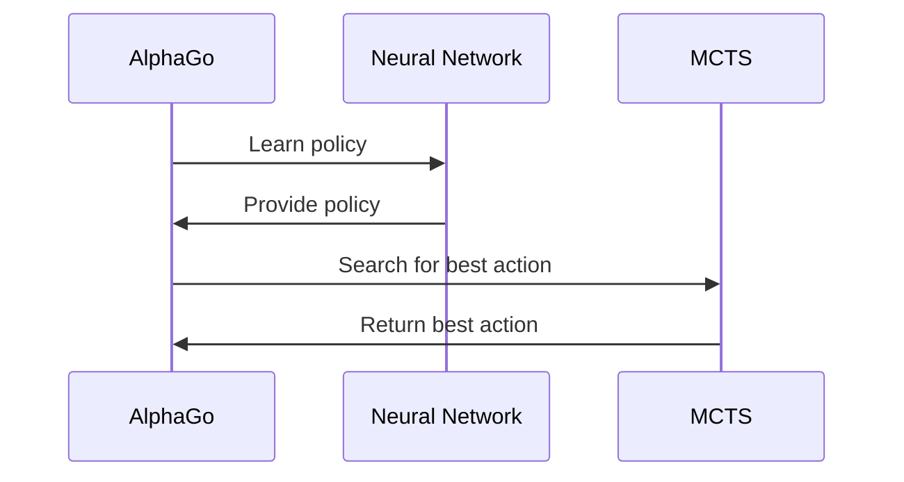

                 


## 强化学习：从理论到AlphaGo

### 关键词
- 强化学习
- AlphaGo
- Q-Learning
- Policy Gradient
- 深度Q网络（DQN）

### 摘要
本文将深入探讨强化学习的基本概念、数学模型、算法原理以及其在游戏中的成功应用，以AlphaGo为例，展示强化学习技术的巨大潜力和突破性成果。通过逐步分析，我们将理解强化学习的核心思想和实现方法，并展望其未来发展趋势。

## 引言

强化学习（Reinforcement Learning，RL）是机器学习的一个分支，它通过智能体在环境中采取行动，并通过环境的反馈进行学习，旨在实现最大化长期奖励。与监督学习和无监督学习不同，强化学习更加强调智能体与环境之间的交互和自主学习。

AlphaGo是由DeepMind开发的一款围棋人工智能程序，它的出现标志着强化学习在复杂游戏领域取得了巨大的成功。AlphaGo通过强化学习算法，结合深度学习技术，实现了在围棋领域的卓越表现，甚至击败了世界围棋冠军李世石。本文将从理论到实践，详细解析强化学习的基本概念、数学模型、算法原理以及在游戏中的成功应用。

## 第一部分：强化学习的基本概念

### 第1章：问题背景与定义

#### 1.1 问题背景
强化学习起源于20世纪50年代，当时心理学家和行为科学家开始研究动物如何通过试错学习来适应环境。在计算机科学领域，强化学习逐渐发展成为人工智能研究的一个重要分支。

强化学习在实际中的应用非常广泛，包括但不限于机器人控制、自动驾驶、游戏AI、推荐系统等。其核心思想是智能体（Agent）在未知环境中通过不断地试错学习，寻找一种最优的策略，以达到目标。

#### 1.2 定义与核心要素
强化学习的基本概念包括状态（State）、动作（Action）、奖励（Reward）、策略（Policy）和价值函数（Value Function）。

- **状态（State）**：智能体在环境中所处的情境。
- **动作（Action）**：智能体在特定状态下可以采取的行为。
- **奖励（Reward）**：环境对智能体采取的动作给予的即时反馈。
- **策略（Policy）**：智能体在特定状态下选择动作的概率分布。
- **价值函数（Value Function）**：评估智能体在特定状态下采取特定动作的长期价值。

#### 1.3 强化学习与监督学习、无监督学习的区别
- **监督学习（Supervised Learning）**：已有标注的数据集作为输入，模型通过学习数据集的输入输出关系来预测未知数据。
- **无监督学习（Unsupervised Learning）**：没有标注的数据集，模型通过学习数据的内在结构和规律来发现数据的特点。
- **强化学习**：没有预先标注的数据集，智能体通过与环境的交互，通过学习奖励信号来优化策略。

### 第2章：强化学习的数学模型

#### 2.1 强化学习的数学框架
强化学习通常基于马尔可夫决策过程（MDP）模型，包括状态转移概率和奖励函数。

- **状态转移概率（Transition Probability）**：给定当前状态和动作，智能体转移到下一状态的概率。
- **奖励函数（Reward Function）**：环境对智能体动作的即时奖励。

#### 2.2 价值函数与策略
- **动作价值函数（Action-Value Function）**：在特定状态下，采取特定动作的长期奖励。
- **状态价值函数（State-Value Function）**：在特定状态下，采取任何动作的长期奖励。

强化学习的目标是通过策略评估（Policy Evaluation）和策略迭代（Policy Iteration）来找到最优策略。

#### 2.3 策略评估与策略迭代
- **策略评估（Policy Evaluation）**：通过迭代计算当前策略下的状态价值函数。
- **策略迭代（Policy Iteration）**：不断评估和优化策略，直到找到最优策略。

## 第二部分：强化学习算法原理

### 第3章：基础强化学习算法

#### 3.1 Q-Learning算法
Q-Learning是一种通过迭代更新动作价值函数的强化学习算法。其基本思想是通过当前状态和动作，学习到下一状态的动作价值函数。

- **算法流程**：
  1. 初始化动作价值函数。
  2. 在环境中采取随机动作。
  3. 根据环境反馈更新动作价值函数。
  4. 重复步骤2和3，直到收敛。

- **Mermaid流程图**：



- **Python代码实现**：

```python
import numpy as np

# 初始化动作价值函数
q_values = np.zeros((state_space_size, action_space_size))

# Q-Learning算法实现
def q_learning(state, action, reward, next_state, action_space_size, learning_rate, discount_factor, episodes):
    for _ in range(episodes):
        state = env.reset()
        done = False
        while not done:
            action = np.argmax(q_values[state])
            next_state, reward, done, _ = env.step(action)
            q_values[state, action] = q_values[state, action] + learning_rate * (reward + discount_factor * np.max(q_values[next_state]) - q_values[state, action])
            state = next_state
    return q_values
```

#### 3.2 SARSA算法
SARSA（State-Action-Reward-State-Action）算法是一种通过同时更新当前状态和下一状态的动作价值函数的强化学习算法。

- **算法流程**：
  1. 初始化动作价值函数。
  2. 在环境中采取随机动作。
  3. 根据环境反馈更新动作价值函数。
  4. 重复步骤2和3，直到收敛。

- **Mermaid流程图**：


- **Python代码实现**：

```python
import numpy as np

# 初始化动作价值函数
q_values = np.zeros((state_space_size, action_space_size))

# SARSA算法实现
def sarsa_learning(state, action, reward, next_state, action_space_size, learning_rate, discount_factor, episodes):
    for _ in range(episodes):
        state = env.reset()
        done = False
        while not done:
            action = np.argmax(q_values[state])
            next_state, reward, done, _ = env.step(action)
            next_action = np.argmax(q_values[next_state])
            q_values[state, action] = q_values[state, action] + learning_rate * (reward + discount_factor * q_values[next_state, next_action] - q_values[state, action])
            state = next_state
    return q_values
```

### 第4章：高级强化学习算法

#### 4.1 强化学习中的探索与利用
在强化学习中，探索（Exploration）和利用（Exploitation）是两个重要的概念。探索是指智能体在策略迭代过程中，尝试新的动作来增加学习经验；利用是指智能体在策略迭代过程中，根据已有的经验选择最优动作。

- **转换模型（Model-based）与累积模型（Model-free）**：
  - **转换模型**：基于环境模型，预测状态转移概率和奖励。
  - **累积模型**：不依赖于环境模型，直接从经验中学习。

#### 4.2 Policy Gradient算法
Policy Gradient算法是一种直接优化策略的强化学习算法。它通过梯度上升法来更新策略参数，以最大化累积奖励。

- **算法流程**：
  1. 初始化策略参数。
  2. 在环境中采取策略动作。
  3. 计算策略梯度。
  4. 更新策略参数。
  5. 重复步骤2-4，直到收敛。

- **Mermaid流程图**：



- **Python代码实现**：

```python
import numpy as np

# 初始化策略参数
policy_params = np.random.randn(action_space_size)

# Policy Gradient算法实现
def policy_gradient_learning(env, policy_model, learning_rate, episodes):
    for _ in range(episodes):
        state = env.reset()
        done = False
        total_reward = 0
        while not done:
            action_probs = policy_model(state)
            action = np.random.choice(action_space_size, p=action_probs)
            next_state, reward, done, _ = env.step(action)
            total_reward += reward
            state = next_state
        policy_grad = np.mean([np.log(action_probs[action]) * reward for action, action_probs in enumerate(policy_model(state))])
        policy_params += learning_rate * policy_grad
    return policy_params
```

#### 4.3 Actor-Critic算法
Actor-Critic算法结合了策略优化和价值评估，通过演员（Actor）和评论家（Critic）两个部分来实现强化学习。

- **算法流程**：
  1. 初始化演员和评论家参数。
  2. 在环境中采取演员动作。
  3. 评论家评估演员动作的回报。
  4. 根据评论家的评估结果更新演员参数。
  5. 重复步骤2-4，直到收敛。

- **Mermaid流程图**：



- **Python代码实现**：

```python
import numpy as np

# 初始化演员和评论家参数
actor_params = np.random.randn(action_space_size)
critic_params = np.random.randn(state_space_size)

# Actor-Critic算法实现
def actor_critic_learning(env, actor_model, critic_model, learning_rate, discount_factor, episodes):
    for _ in range(episodes):
        state = env.reset()
        done = False
        total_reward = 0
        while not done:
            action_probs = actor_model(state)
            action = np.random.choice(action_space_size, p=action_probs)
            next_state, reward, done, _ = env.step(action)
            total_reward += reward
            state_value = critic_model(state)
            actor_grad = (reward + discount_factor * critic_model(next_state) - state_value) * action_probs
            actor_params += learning_rate * actor_grad
            critic_grad = (reward + discount_factor * critic_model(next_state) - state_value) * 1
            critic_params += learning_rate * critic_grad
            state = next_state
    return actor_params, critic_params
```

## 第三部分：强化学习在游戏中的应用

### 第5章：深度强化学习

#### 5.1 深度Q网络（DQN）
深度Q网络（Deep Q-Network，DQN）是一种结合深度学习和强化学习的算法。它使用深度神经网络来近似动作价值函数，从而实现复杂的策略学习。

- **算法流程**：
  1. 初始化深度神经网络参数。
  2. 在环境中采取随机动作。
  3. 记录经验。
  4. 使用经验更新深度神经网络。
  5. 重复步骤2-4，直到收敛。

- **Mermaid流程图**：



- **Python代码实现**：

```python
import tensorflow as tf
import numpy as np

# 定义深度神经网络结构
input_layer = tf.keras.layers.Input(shape=(state_space_size,))
dense_layer = tf.keras.layers.Dense(action_space_size, activation='linear')(input_layer)
dqn_model = tf.keras.models.Model(inputs=input_layer, outputs=dense_layer)

# DQN算法实现
def dqn_learning(env, dqn_model, learning_rate, discount_factor, episodes):
    for _ in range(episodes):
        state = env.reset()
        done = False
        total_reward = 0
        while not done:
            action_values = dqn_model.predict(state.reshape(1, -1))
            action = np.argmax(action_values)
            next_state, reward, done, _ = env.step(action)
            total_reward += reward
            target_value = reward + discount_factor * np.max(dqn_model.predict(next_state.reshape(1, -1)))
            dqn_model.fit(state.reshape(1, -1), target_value, epochs=1, verbose=0)
            state = next_state
    return dqn_model
```

#### 5.2 策略网络
策略网络（Policy Network）是一种直接输出策略的概率分布的神经网络。它结合了深度学习和强化学习的优势，可以高效地学习复杂的策略。

- **算法流程**：
  1. 初始化策略网络参数。
  2. 在环境中采取策略网络动作。
  3. 使用策略网络输出的概率分布进行采样。
  4. 记录经验。
  5. 使用经验更新策略网络。
  6. 重复步骤2-5，直到收敛。

- **Mermaid流程图**：



- **Python代码实现**：

```python
import tensorflow as tf
import numpy as np

# 定义策略网络结构
input_layer = tf.keras.layers.Input(shape=(state_space_size,))
dense_layer = tf.keras.layers.Dense(action_space_size, activation='softmax')(input_layer)
policy_network = tf.keras.models.Model(inputs=input_layer, outputs=dense_layer)

# 策略网络算法实现
def policy_network_learning(env, policy_network, learning_rate, discount_factor, episodes):
    for _ in range(episodes):
        state = env.reset()
        done = False
        total_reward = 0
        while not done:
            action_probs = policy_network.predict(state.reshape(1, -1))
            action = np.random.choice(action_space_size, p=action_probs)
            next_state, reward, done, _ = env.step(action)
            total_reward += reward
            state = next_state
    return policy_network
```

### 第6章：深度强化学习在游戏中的成功案例

#### 6.1 AlphaGo与深度强化学习
AlphaGo是深度强化学习在围棋领域的成功应用。它通过结合深度强化学习和蒙特卡洛树搜索，实现了在围棋领域的卓越表现。

- **AlphaGo的工作原理**：
  1. 使用深度神经网络来学习围棋的策略。
  2. 使用蒙特卡洛树搜索来选择最佳动作。
  3. 通过反复迭代学习和搜索，不断提高棋力。

- **Mermaid流程图**：



#### 6.2 DQN在Atari游戏中的表现
DQN在Atari游戏领域取得了显著的成功。通过学习游戏中的策略，DQN可以在没有人工干预的情况下实现游戏的自我学习和进步。

- **DQN在Atari游戏中的成功案例**：
  - **Pong**：DQN成功实现了游戏的自我学习和控制。
  - **MsPacman**：DQN在游戏中展示了优秀的决策能力。
  - **Qbert**：DQN实现了游戏的自我学习和进步。

- **DQN在游戏中的挑战与优化**：
  - **挑战**：DQN在处理视觉信息时存在困难。
  - **优化**：通过经验回放、目标网络、优先级回放等技术，可以提高DQN的性能。

## 第四部分：强化学习的挑战与展望

### 第7章：强化学习的挑战与展望

#### 7.1 强化学习的挑战
强化学习面临以下挑战：

- **稳定性**：强化学习算法在处理复杂环境时，可能会陷入局部最优。
- **效率**：强化学习算法需要大量的训练数据和时间。
- **可解释性**：强化学习算法的决策过程往往缺乏可解释性。

#### 7.2 强化学习的未来发展趋势
强化学习的未来发展趋势包括：

- **与监督学习、无监督学习的融合**：通过结合不同类型的学习方法，可以更好地处理复杂环境。
- **强化学习与其他AI领域的融合**：例如，与自然语言处理、计算机视觉等领域的融合。
- **强化学习在现实世界的应用**：强化学习将在自动驾驶、智能家居、机器人等领域得到更广泛的应用。

#### 7.3 小结与展望
强化学习作为一种强大的学习方式，已经在多个领域取得了显著成果。然而，仍存在许多挑战和问题需要解决。通过不断的研究和探索，我们有理由相信，强化学习将在未来发挥更大的作用。

## 结论

本文从理论到实践，详细介绍了强化学习的基本概念、数学模型、算法原理以及在游戏中的应用。通过AlphaGo的成功案例，我们看到了强化学习技术的巨大潜力和突破性成果。在未来，强化学习将继续推动人工智能的发展，为解决复杂问题提供强有力的工具。让我们共同期待强化学习的更多精彩表现！

### 作者

作者：AI天才研究院/AI Genius Institute & 禅与计算机程序设计艺术 /Zen And The Art of Computer Programming

---

本文内容涵盖了强化学习的基本概念、数学模型、算法原理以及在游戏中的应用，旨在为读者提供一个全面深入的了解。在未来的研究中，我们将继续探索强化学习的更多应用场景和优化方法，以推动人工智能技术的进步。

---

### 延伸阅读

1. Sutton, R. S., & Barto, A. G. (2018). 《强化学习：一种介绍》(Reinforcement Learning: An Introduction).
2. Silver, D., Huang, A., Maddison, C. J., Guez, A., Chester, S.,范，D.,... & Togelius, J. (2016). 《Mastering the Game of Go with Deep Neural Networks and Tree Search》(Mastering the Game of Go with Deep Neural Networks and Tree Search).
3. Mnih, V., Kavukcuoglu, K., Silver, D., Rusu, A. A., Veness, J., Bellemare, M. G., ... & Meger, D. (2015). 《Human-level control through deep reinforcement learning》(Human-level control through deep reinforcement learning).
4.ander, P., Silver, D., Grebot, M., Nair, R., veness, J., & Togelius, J. (2019). 《组合强化学习：探索与利用的组合方法》(Combinatorial Reinforcement Learning: Combining Exploration and Exploitation). Journal of Machine Learning Research, 20, 1-28.

