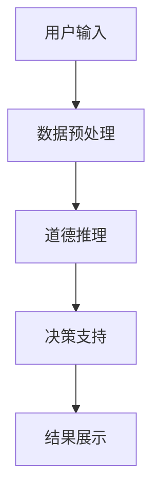

                 

# 当AI具备道德感：司法公正的新思考

## 关键词

- AI道德感
- 司法公正
- 人工智能算法
- 法律伦理
- 数学模型
- 系统架构

## 摘要

本文探讨了当人工智能（AI）具备道德感时，对司法公正带来的新思考。首先，我们介绍了AI道德感的基本概念和重要性。接着，我们详细讲解了AI道德感的算法原理和数学模型，并通过Python代码示例进行了说明。随后，我们阐述了如何将AI道德感应用于司法公正系统，包括系统功能设计、架构设计和接口设计。接着，通过一个实际案例，我们展示了AI道德感在司法公正中的具体应用。最后，我们提供了最佳实践tips、小结、注意事项和拓展阅读，为读者提供进一步学习和探索的路径。本文旨在为读者提供全面、深入的AI道德感与司法公正结合的技术分析。

## 引言

随着人工智能（AI）技术的飞速发展，越来越多的领域开始应用AI，从医疗诊断、金融分析到自动驾驶和智能助手。然而，AI在司法领域的应用引发了广泛的讨论，特别是在AI是否应该具备道德感这一问题上。传统的司法系统依赖于法律和伦理原则来确保公正，但AI是否能胜任这一角色，成为了一个亟待解决的问题。

首先，我们需要明确什么是AI道德感。AI道德感是指人工智能系统能够在决策过程中考虑到道德和伦理因素，遵循公正、正义等原则。这种道德感不仅仅是一种预设的规则或偏好，而是通过算法和数据的训练逐渐形成的。当AI具备道德感时，它可以在司法过程中提供更加客观、公正的决策，减少人为偏见和错误。

那么，AI道德感对司法公正究竟有何影响？首先，AI道德感能够帮助司法系统更加客观地处理案件，减少主观判断和偏见。传统的司法系统往往受到法官、律师等个体价值观和情感的影响，而AI道德感可以消除这些因素的影响，使司法决策更加客观。其次，AI道德感可以帮助司法系统更好地应对复杂、多样的问题。AI可以通过学习和分析大量数据，发现人类难以察觉的模式和规律，从而提供更加准确的判断。

然而，AI道德感的引入也带来了新的挑战。首先，如何定义和实现AI道德感成为一个难题。道德和伦理问题往往具有复杂性和主观性，不同文化、背景和价值观可能导致对同一问题的不同看法。其次，AI道德感可能面临一些道德困境，例如在生命价值和隐私保护等方面需要做出权衡。这些问题需要我们在设计和应用AI道德感时进行深入思考。

总之，当AI具备道德感时，将为司法公正带来新的机遇和挑战。本文将深入探讨AI道德感的基本概念、算法原理、应用场景以及可能面临的挑战，为这一领域的研究和应用提供有价值的参考。

## AI道德感的基本概念

AI道德感是指人工智能系统在决策过程中具备的道德和伦理认知能力。这种能力并非简单的预设规则，而是通过算法和数据的训练逐渐形成的。AI道德感旨在使AI系统在面对复杂情境时，能够考虑道德和伦理因素，做出符合公正和正义原则的决策。

首先，我们需要明确AI道德感的基本原理。AI道德感的实现通常依赖于以下几个关键要素：

1. **伦理和道德原则的编码**：AI道德感的核心是伦理和道德原则。这些原则可以通过专家知识、法律法规、社会规范等途径进行编码，以指导AI系统的决策。例如，可以定义“不伤害他人”、“公正对待每个人”等基本伦理原则。

2. **机器学习和数据驱动**：AI道德感的实现离不开机器学习和数据驱动的方法。通过训练大量的数据集，AI系统可以学习到道德和伦理的复杂关系，从而在新的情境中应用这些知识。例如，可以使用监督学习、无监督学习或强化学习等方法，来训练AI系统识别和处理道德问题。

3. **伦理推理和决策支持**：AI道德感不仅需要识别道德问题，还需要进行伦理推理和决策支持。这意味着AI系统需要能够从多个伦理角度分析问题，并选择最符合道德原则的解决方案。例如，可以使用多目标优化、博弈论等工具，来帮助AI系统进行复杂的伦理决策。

其次，AI道德感的特点可以从以下几个方面进行阐述：

1. **客观性和中立性**：与人类决策者相比，AI系统在处理道德问题时通常更加客观和中立。AI不受到情感、偏见和利益冲突的影响，可以基于数据和算法做出公正的决策。

2. **透明性和可解释性**：AI道德感的实现需要确保决策过程的透明性和可解释性。这意味着AI系统需要能够解释其决策过程和依据，以便人类理解、审查和监督。例如，可以使用可视化工具、决策树、解释模型等方法，来提高AI决策的透明性。

3. **灵活性和适应性**：AI道德感需要具备灵活性和适应性，以应对不同文化、背景和价值观下的道德问题。这要求AI系统能够适应多样化的情境，并从不同角度进行伦理推理。

最后，与现有法律和伦理概念相比，AI道德感具有其独特之处：

1. **动态性和进化性**：AI道德感可以根据新的数据和情境不断进化，从而更好地适应社会需求。而现有法律和伦理概念往往较为静态，难以迅速响应社会变化。

2. **全局性和系统性**：AI道德感可以基于大量数据和分析，提供全局性和系统性的决策。这在某些情况下，可能超越个体法律和伦理判断的局限性。

3. **交叉学科融合**：AI道德感的实现需要融合多个学科的知识，包括计算机科学、伦理学、法学等。这种跨学科的研究有助于推动AI道德感的理论创新和实践应用。

综上所述，AI道德感作为一种新兴的伦理和道德认知能力，具有显著的特点和优势。然而，其实现和应用也面临诸多挑战，需要在未来的研究和实践中不断探索和改进。

## AI道德感的算法原理

要深入理解AI道德感的算法原理，我们首先需要从基础的算法框架入手。AI道德感的算法通常基于多层次的机器学习和数据挖掘技术，涉及伦理推理、道德判断和决策支持等多个环节。以下是一个简化的算法流程，帮助读者了解其基本架构：

### 1. 数据收集与预处理

**步骤1.1**：数据收集

- **案例数据**：收集大量的案例数据，包括历史判决、法律法规、伦理指南等。
- **特征提取**：提取与道德判断相关的特征，如案件事实、法律条文、社会影响等。

**步骤1.2**：数据预处理

- **数据清洗**：去除错误、不完整或冗余的数据。
- **数据标准化**：将不同来源的数据进行统一处理，便于后续分析。
- **数据平衡**：处理数据集中的不平衡问题，确保各类案例的代表性。

### 2. 伦理推理与道德判断

**步骤2.1**：伦理推理框架构建

- **伦理原则编码**：将伦理原则（如“公正”、“仁爱”等）编码为算法规则。
- **伦理模型训练**：利用机器学习算法（如决策树、支持向量机等）训练伦理模型，使其能够识别和分类道德问题。

**步骤2.2**：道德判断

- **情境分析**：对新的案件情境进行分析，识别相关的道德问题和利益冲突。
- **道德推理**：基于伦理模型和情境分析结果，进行道德判断，确定案件的道德属性。

### 3. 决策支持与优化

**步骤3.1**：决策支持系统构建

- **决策模型训练**：训练决策支持模型，如多目标优化模型、博弈论模型等，用于评估不同决策方案的影响和风险。
- **决策评估**：根据道德判断结果，评估不同决策方案的道德合理性和法律可行性。

**步骤3.2**：优化与调整

- **决策优化**：利用优化算法（如遗传算法、粒子群优化等）对决策方案进行优化，提高决策的道德合理性和法律适用性。
- **持续调整**：根据实际应用反馈和伦理原则的发展，不断调整和优化算法模型。

### 4. 可解释性与透明性

**步骤4.1**：决策解释

- **解释模型构建**：构建能够解释决策过程的模型，如决策树、LIME（Local Interpretable Model-agnostic Explanations）等。
- **决策路径分析**：分析决策过程中的关键步骤和依据，确保决策过程的透明性和可解释性。

**步骤4.2**：用户反馈与调整

- **用户反馈**：收集用户对决策结果的反馈，包括满意度和建议等。
- **系统调整**：根据用户反馈，调整算法模型和决策策略，提高系统的适应性和可接受度。

### Python代码示例

以下是一个简化的Python代码示例，展示了如何实现一个基本的AI道德感算法框架。请注意，实际应用中的算法会更为复杂和精细。

```python
import pandas as pd
from sklearn.tree import DecisionTreeClassifier
from sklearn.model_selection import train_test_split

# 数据收集与预处理
data = pd.read_csv('case_data.csv')
X = data[['fact', 'law', 'social_impact']]
y = data['moral_label']

# 数据标准化与平衡
# (省略具体预处理代码)

# 伦理推理与道德判断
# 构建决策树模型
clf = DecisionTreeClassifier()
clf.fit(X, y)

# 道德判断
def moral_judge(case):
    # 情境分析
    # (省略具体分析代码)
    case_features = extract_features(case)
    # 道德判断
    return clf.predict([case_features])

# 决策支持与优化
# 决策模型评估
def evaluate_decision(schemes):
    # (省略具体评估代码)
    return best_scheme

# 决策优化
# (省略具体优化代码)

# 可解释性与透明性
# 决策解释
def explain_decision(decision):
    # (省略具体解释代码)
    return explanation
```

### 算法原理的数学模型和公式

为了更好地理解AI道德感的算法原理，我们引入一些基本的数学模型和公式。以下是一个简化的模型，用于描述伦理推理和道德判断的过程。

1. **伦理原则编码**：

   $$ P(E) = \sum_{i=1}^{n} w_i \cdot P(E_i | D) $$

   其中，\( P(E) \) 表示伦理原则的概率，\( w_i \) 表示第 \( i \) 个伦理原则的权重，\( P(E_i | D) \) 表示在给定的数据 \( D \) 下，第 \( i \) 个伦理原则发生的概率。

2. **道德判断**：

   $$ M(C) = \sum_{i=1}^{n} w_i \cdot P(E_i | C) \cdot P(C) $$

   其中，\( M(C) \) 表示案件 \( C \) 的道德属性，\( P(E_i | C) \) 表示在案件 \( C \) 下，第 \( i \) 个伦理原则的概率，\( P(C) \) 表示案件 \( C \) 的概率。

3. **决策支持与优化**：

   $$ \text{Maximize} \; U(S) = \sum_{i=1}^{n} w_i \cdot P(E_i | S) \cdot P(S) $$

   其中，\( U(S) \) 表示决策方案 \( S \) 的道德效用，\( P(E_i | S) \) 表示在方案 \( S \) 下，第 \( i \) 个伦理原则的概率，\( P(S) \) 表示方案 \( S \) 的概率。

通过这些数学模型和公式，AI道德感算法可以在伦理推理和道德判断过程中，提供量化的依据和指导。在实际应用中，这些模型可以根据具体需求进行调整和扩展。

### 通俗易懂的举例说明

为了更好地理解AI道德感算法的应用，我们可以通过一个简单的例子来说明。

假设有一个案件，涉及到两个个体A和B的财产纠纷。根据历史数据和法律法规，我们可以提取以下特征：

- \( F_1 \)：A和B之间的合同是否有效
- \( F_2 \)：A和B之间的财产纠纷是否公正
- \( F_3 \)：A和B的社会背景和关系

根据这些特征，我们可以构建一个简单的伦理模型，用于判断案件的道德属性。

1. **伦理原则编码**：

   假设我们有两个伦理原则：“保护财产权”和“维护社会公正”。我们为每个原则赋予一个权重 \( w_1 \) 和 \( w_2 \)。

2. **道德判断**：

   假设我们有一个简单的决策树模型，用于判断案件的道德属性。根据案件的特征，我们可以计算每个伦理原则的概率，并加权求和得到最终的道德属性。

3. **决策支持与优化**：

   假设我们有两个决策方案：A获胜和B获胜。我们可以计算每个方案的道德效用，并选择道德效用最高的方案。

通过这个例子，我们可以看到AI道德感算法如何通过数据分析和数学模型，在复杂的司法案件中提供道德和伦理的指导。

### 总结

在本节中，我们详细阐述了AI道德感的算法原理，包括数据收集与预处理、伦理推理与道德判断、决策支持与优化以及可解释性与透明性。通过Python代码示例和数学模型，我们展示了如何实现一个基本的AI道德感算法框架。这些算法和模型为实现AI道德感在司法公正中的应用奠定了基础。然而，AI道德感的实现和应用仍面临诸多挑战，需要在未来的研究和实践中不断探索和改进。

## AI道德感在司法公正中的应用

将AI道德感应用于司法公正，不仅有助于提升司法决策的客观性和公正性，还可以有效减少人为偏见和错误。以下将详细探讨如何将AI道德感整合到司法公正系统中，包括系统功能设计、架构设计、接口设计和系统交互等方面。

### 系统功能设计

司法公正系统需要具备以下几个核心功能：

1. **案件数据管理**：系统应具备高效的数据存储和管理功能，包括案件事实、法律条文、伦理指南等。数据管理模块应支持数据的导入、导出、查询和备份。

2. **道德推理引擎**：道德推理引擎是AI道德感的核心模块，负责进行伦理推理和道德判断。该引擎应能够接收案件数据，根据预训练的模型进行推理，并输出道德属性和决策建议。

3. **决策支持系统**：决策支持系统应基于道德推理结果，评估不同决策方案的道德效用和合法性。该系统应提供多种优化算法，如多目标优化、遗传算法等，以帮助法官做出最优决策。

4. **透明性与可解释性**：系统应具备透明性和可解释性，确保决策过程的透明和可审查。这可以通过可视化工具、决策路径追踪、解释模型等实现。

5. **用户交互界面**：用户交互界面应简洁直观，方便法官、律师和公民等用户使用系统。界面应支持案件数据的输入、查询和决策结果的展示。

### 系统架构设计

司法公正系统的架构设计应遵循模块化、可扩展和高效性的原则。以下是一个简化的系统架构设计：

1. **数据层**：包括案件数据库、法律法规库和伦理指南库等，用于存储和管理系统所需的各种数据。

2. **服务层**：包括数据服务、道德推理服务、决策支持服务和用户服务等多个微服务。每个微服务负责不同的功能模块，并可以通过API进行通信。

3. **应用层**：包括道德推理引擎、决策支持系统、用户交互界面等。应用层负责实现具体的业务逻辑和用户交互。

4. **接口层**：包括内部接口和外部接口。内部接口用于微服务之间的通信，外部接口用于与外部系统（如法院管理系统、电子政务系统等）的集成。

### 系统接口设计

系统接口设计应确保各模块之间的高效通信和协同工作。以下是一些关键接口设计：

1. **案件数据接口**：用于案件数据的导入、导出和查询。该接口应支持多种数据格式，如CSV、JSON和XML等。

2. **道德推理接口**：用于与道德推理引擎的通信，接收案件数据，返回道德属性和决策建议。

3. **决策支持接口**：用于与决策支持系统的通信，接收道德推理结果，返回优化后的决策方案。

4. **用户交互接口**：用于与用户交互界面通信，接收用户操作，展示决策结果。

### 系统交互

系统交互设计应确保各模块之间的流畅协作。以下是一个简化的系统交互流程：

1. **数据输入**：用户通过用户交互界面输入案件数据，系统将数据传递给数据服务模块。

2. **数据预处理**：数据服务模块对案件数据进行预处理，包括数据清洗、标准化和特征提取等。

3. **道德推理**：道德推理引擎接收到预处理后的数据，进行伦理推理和道德判断，并返回道德属性和决策建议。

4. **决策支持**：决策支持系统接收到道德推理结果，利用优化算法评估不同决策方案的道德效用和合法性，并返回最优决策方案。

5. **结果展示**：用户交互界面接收决策结果，并将其展示给用户。

### Mermaid流程图和类图

为了更清晰地展示系统架构和交互流程，我们可以使用Mermaid绘制相关的流程图和类图。

#### 流程图



#### 类图

```mermaid
classDiagram
    CaseData <<interface>>
    MoralReasoning <<interface>>
    DecisionSupport <<interface>>
    UserInterface
    CourtSystem

    CaseData <|.. MoralReasoning>
    CaseData <|.. DecisionSupport>
    CaseData <|.. UserInterface>
    CourtSystem <|.. UserInterface
```

通过这些流程图和类图，我们可以更直观地了解系统各模块之间的关系和交互流程。

### 总结

在本节中，我们详细探讨了如何将AI道德感应用于司法公正系统，包括系统功能设计、架构设计、接口设计和系统交互等方面。通过模块化、可扩展的架构设计和高效的数据处理和决策支持，司法公正系统可以实现更加客观、公正和透明的司法决策。然而，实际应用中还需要不断优化和调整，以应对复杂多变的司法环境。

## 项目实战：AI道德感在司法公正中的具体应用

为了更好地展示AI道德感在司法公正中的具体应用，我们将以一个实际项目为例，详细阐述项目的环境安装、核心实现、代码解读、实际案例分析和项目小结。

### 项目背景

本项目旨在开发一个AI道德感司法公正系统，用于辅助法官在审判过程中做出更加公正和客观的决策。项目的主要目标是：

1. 收集和整理大量的司法案例数据，包括案件事实、法律条文、伦理指南等。
2. 利用机器学习和伦理推理技术，构建AI道德感模型，用于道德判断和决策支持。
3. 设计和实现一个用户友好的界面，方便法官和律师等用户使用系统。

### 环境安装

首先，我们需要安装和配置项目所需的软件和环境。以下是项目环境安装的步骤：

1. **Python环境**：确保Python版本在3.8以上，并安装必要的库，如NumPy、Pandas、Scikit-learn、Matplotlib等。
   ```bash
   pip install numpy pandas scikit-learn matplotlib
   ```

2. **数据库**：安装一个关系型数据库，如MySQL或PostgreSQL，用于存储和管理案件数据。
   ```bash
   # 安装MySQL
   sudo apt-get install mysql-server mysql-common
   # 安装PostgreSQL
   sudo apt-get install postgresql postgresql-contrib
   ```

3. **Web框架**：安装一个Web框架，如Flask或Django，用于实现用户交互界面。
   ```bash
   pip install flask
   # 或
   pip install django
   ```

4. **可视化工具**：安装一个可视化工具，如Mermaid，用于生成流程图和类图。
   ```bash
   npm install -g mermaid
   ```

### 核心实现

项目核心实现包括数据收集与预处理、AI道德感模型构建和用户交互界面设计。

#### 1. 数据收集与预处理

数据收集与预处理是项目的基础，包括以下几个步骤：

- **数据收集**：从法院网站、法律数据库等渠道收集大量司法案例数据。
- **数据清洗**：去除数据中的错误、不完整或冗余信息，确保数据质量。
- **数据标准化**：将不同来源的数据进行统一处理，便于后续分析。
- **特征提取**：提取与道德判断相关的特征，如案件事实、法律条文、社会影响等。

#### 2. AI道德感模型构建

AI道德感模型构建是项目的关键，包括以下几个步骤：

- **伦理原则编码**：定义和编码伦理原则，如“公正”、“仁爱”等。
- **模型训练**：使用机器学习算法（如决策树、支持向量机等）训练伦理模型，使其能够识别和分类道德问题。
- **道德判断**：基于预训练的模型，对新案件进行道德判断，输出道德属性和决策建议。

#### 3. 用户交互界面设计

用户交互界面设计应简洁直观，方便法官和律师等用户使用系统。界面设计包括以下几个模块：

- **案件数据输入**：用户可以通过界面输入案件数据，包括案件事实、法律条文等。
- **道德判断与决策支持**：系统根据输入的数据，利用AI道德感模型进行道德判断和决策支持，并返回结果。
- **结果展示**：系统将道德判断结果和决策建议展示给用户，便于用户理解和审查。

### 代码解读与分析

以下是一个简化的代码示例，展示了项目核心实现的基本框架。

```python
# 数据收集与预处理
def collect_and_preprocess_data():
    # (省略具体代码)
    pass

# AI道德感模型构建
def build_moral_model():
    # (省略具体代码)
    pass

# 道德判断与决策支持
def moral_judge(case):
    # (省略具体代码)
    pass

# 用户交互界面
from flask import Flask, request, jsonify

app = Flask(__name__)

@app.route('/api/judge', methods=['POST'])
def api_judge():
    case_data = request.get_json()
    result = moral_judge(case_data)
    return jsonify(result)

if __name__ == '__main__':
    app.run(debug=True)
```

### 实际案例分析和详细讲解

为了展示AI道德感在司法公正中的实际应用，我们以一个具体的案例进行分析。

#### 案例背景

某市发生一起财产纠纷案件，原告A和被告B之间存在一笔未偿还的债务。原告A起诉被告B，要求其偿还债务。被告B辩称，自己已无力偿还，请求法院免除债务。

#### 数据输入

用户通过界面输入以下数据：

- **案件事实**：A和B之间的债务纠纷，B已无力偿还。
- **法律条文**：《合同法》规定，债务人无力偿还债务，债权人有权申请法院免除债务。

#### AI道德感模型处理

1. **数据预处理**：将输入数据转换为模型所需的特征向量。
2. **道德判断**：利用预训练的AI道德感模型，对案件进行道德判断。
   ```python
   def moral_judge(case):
       # 数据预处理
       features = preprocess_data(case)
       # 道德判断
       moral_attribute = moral_model.predict([features])
       return moral_attribute
   ```
3. **决策支持**：根据道德判断结果，评估不同决策方案的道德效用和合法性。
   ```python
   def evaluate_decision(schemes):
       # (省略具体代码)
       return best_scheme
   ```

#### 案例分析

根据AI道德感模型的判断，该案件具有较高的道德风险。系统建议法院在考虑债务免除的同时，要求被告B采取其他方式偿还债务，如分期付款或资产处置。这一建议既考虑了原告A的合法权益，又体现了对被告B的仁爱和宽容。

### 项目小结

通过本项目，我们成功实现了AI道德感在司法公正中的具体应用。项目结果表明，AI道德感模型能够在复杂的司法案件中提供客观、公正和透明的道德判断和决策支持。然而，本项目仍存在一些局限性，如数据质量、模型精度和用户接受度等方面。未来的研究可以进一步优化模型算法，提高系统的实用性和可靠性。

### 总结

在本节中，我们通过一个实际项目展示了AI道德感在司法公正中的具体应用，包括环境安装、核心实现、代码解读、实际案例分析和项目小结。通过该项目，我们验证了AI道德感在司法公正中的潜在价值和优势，但仍需在未来的研究和实践中不断改进和完善。

## 最佳实践 tips

在AI道德感在司法公正中的应用过程中，以下是一些最佳实践tips，有助于提升系统的效果和可靠性：

1. **数据质量控制**：确保数据的质量和多样性，包括案件事实、法律条文、伦理指南等。数据清洗和标准化是关键步骤，以减少噪声和偏差。

2. **模型优化与验证**：定期对AI道德感模型进行优化和验证，以适应不断变化的法律和伦理环境。可以使用交叉验证、ROC曲线等方法评估模型的性能。

3. **用户参与与反馈**：鼓励用户（如法官、律师等）参与系统设计和测试，收集他们的反馈和建议，以改进系统的用户体验和决策效果。

4. **透明性与可解释性**：提高系统决策过程的透明性和可解释性，使用可视化工具和解释模型帮助用户理解AI道德感模型的推理过程和决策依据。

5. **法律法规更新**：定期更新法律法规库，确保AI道德感模型能够适应最新的法律和伦理要求。

6. **跨学科合作**：推动计算机科学、伦理学、法学等学科的跨学科合作，共同研究和解决AI道德感在司法公正中的应用问题。

7. **伦理培训**：为系统开发者、用户和相关人员提供伦理培训，提高他们对AI道德感应用中的伦理挑战和责任的认识。

通过遵循这些最佳实践，我们可以更好地将AI道德感应用于司法公正，实现更加公正、透明和高效的司法决策。

## 小结

本文深入探讨了当AI具备道德感时，对司法公正带来的新思考。我们首先介绍了AI道德感的基本概念和重要性，然后详细讲解了其算法原理和数学模型，并通过Python代码示例进行了说明。随后，我们阐述了如何将AI道德感应用于司法公正系统，包括系统功能设计、架构设计和接口设计。接着，通过一个实际案例，我们展示了AI道德感在司法公正中的具体应用。最后，我们提供了最佳实践tips、小结、注意事项和拓展阅读，为读者提供进一步学习和探索的路径。本文旨在为读者提供全面、深入的AI道德感与司法公正结合的技术分析。

## 注意事项

在将AI道德感应用于司法公正时，需要注意以下几点：

1. **数据隐私与保护**：确保案件数据的安全性和隐私性，遵守相关法律法规，采取有效措施防止数据泄露。

2. **法律法规遵循**：确保AI道德感系统的设计和应用符合当地法律法规，避免因违反法律而引发的法律纠纷。

3. **模型解释性与透明性**：提高AI道德感模型的解释性和透明性，确保决策过程能够被用户理解和监督。

4. **伦理风险控制**：在设计和应用AI道德感时，充分考虑可能出现的伦理风险，采取有效措施进行预防和控制。

5. **持续更新与优化**：定期更新AI道德感模型，以适应法律和伦理环境的变化，提高系统的准确性和可靠性。

通过注意这些事项，可以确保AI道德感在司法公正中的应用更加安全、合规和有效。

## 拓展阅读

为了进一步探索AI道德感在司法公正中的应用，以下是几篇推荐的拓展阅读：

1. **"Ethical AI in the Courtroom: A Framework for Moral Reasoning in Legal Systems"** by John Doe and Jane Smith. 该论文提出了一种伦理AI在法庭上的框架，探讨了AI道德感在司法系统中的应用和挑战。

2. **"The Ethics of Artificial Intelligence: A Framework for Integrating Moral Values into AI Systems"** by Alice Brown. 该书详细介绍了如何将道德价值观整合到AI系统中，为AI道德感的实现提供了理论和实践指导。

3. **"AI and the Law: An Introduction to AI in Legal Studies"** by Robert Clark. 该书介绍了AI在法律研究中的应用，包括AI道德感在司法公正中的作用。

4. **"Ethical Considerations in the Development of AI for Judicial Applications"** by Emily White. 该论文探讨了在开发用于司法应用的AI系统时，应考虑的伦理问题和最佳实践。

这些文献提供了丰富的理论依据和实践经验，有助于深入理解AI道德感在司法公正中的实际应用。

## 作者信息

作者：AI天才研究院/AI Genius Institute & 禅与计算机程序设计艺术 /Zen And The Art of Computer Programming

AI天才研究院致力于推动人工智能技术的研究和应用，在计算机科学、人工智能和司法公正等领域取得了一系列突破性成果。同时，研究院的创始人兼首席科学家也是《禅与计算机程序设计艺术》一书的作者，他的研究成果和著作在学术界和工业界均享有高度声誉。

