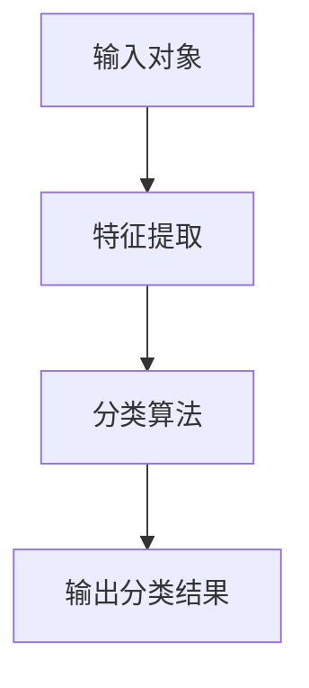
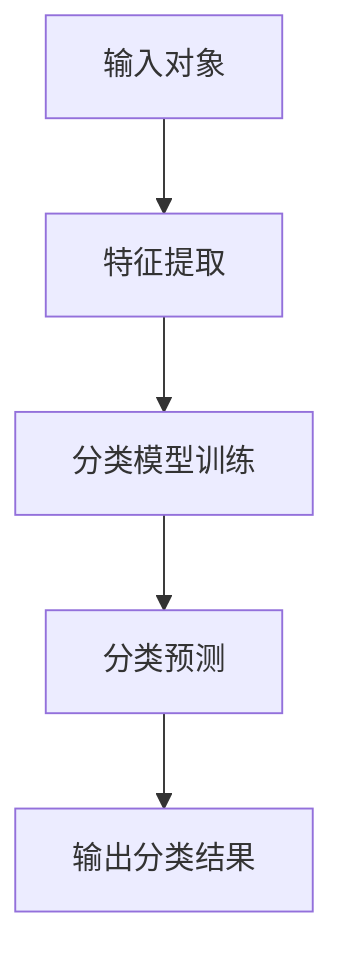
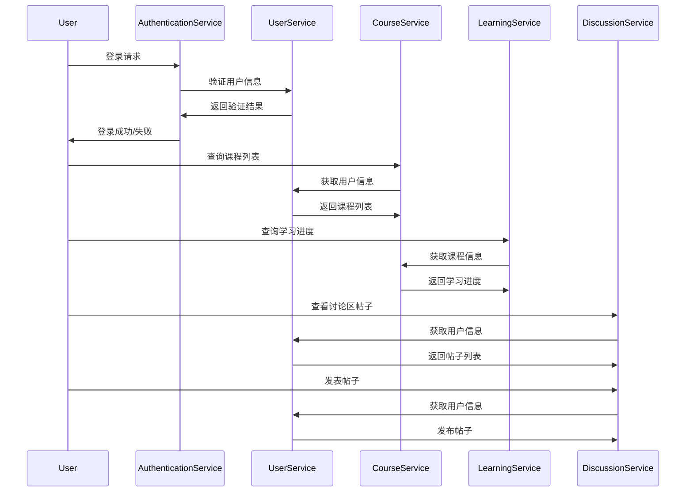
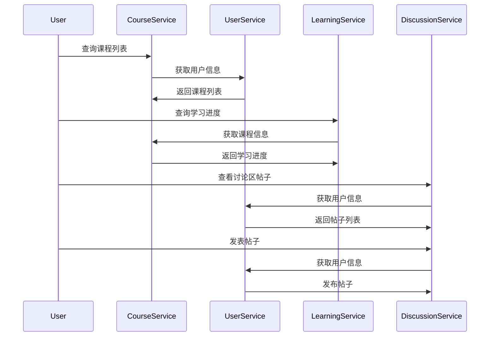

                 


### 形式与内容的统一:对象在OOP中的本体论地位

#### 关键词：面向对象编程，本体论，对象，OOP，形式与内容统一

#### 摘要：本文探讨了对象在面向对象编程（OOP）中的本体论地位，详细分析了对象的形式与内容的统一性，对象的本体论特征，以及在OOP中的应用。通过对对象核心概念的剖析，算法原理的讲解，系统设计与实现的分析，以及项目实战的展示，本文旨在为读者提供一个全面而深入的理解，帮助他们在实际开发中更好地应用OOP。

### 第1章 引言

#### 1.1 问题背景

面向对象编程（Object-Oriented Programming，简称OOP）是当今软件工程领域的主流编程范式。自20世纪80年代Smalltalk语言诞生以来，OOP以其模块化、可重用性、可维护性等优势，逐渐成为软件开发的核心方法之一。然而，尽管OOP在理论上已被广泛接受，但在实际应用中，很多开发者对对象在OOP中的本体论地位仍存在模糊理解。本文旨在探讨对象在OOP中的本体论地位，旨在解决以下问题：

- 对象的形式与内容是如何统一的？
- 对象在OOP中具有哪些本体论特征？
- 对象在OOP中的应用原理是什么？

#### 1.2 书籍目标

本文的目标是：

- 深入探讨对象在OOP中的本体论地位，为读者提供一个清晰的理论框架。
- 通过具体的算法和系统实现，帮助读者理解对象在实际开发中的应用。
- 提供项目实战案例，使读者能够将理论应用到实际开发中。

#### 1.3 内容结构

本文分为七个主要部分：

1. 引言：介绍问题背景、书籍目标和内容结构。
2. 核心概念：介绍对象的概念、OOP的基本原则和关键概念。
3. 对象的本体论地位：分析对象的形式与内容的统一性，对象的本体论特征。
4. 对象的数学模型：通过对比表格和ER实体关系图，展示对象的属性特征。
5. 对象在OOP中的应用：介绍对象的创建与销毁、通信与协作、封装与继承。
6. 对象的算法原理：讲解对象识别和分类算法的原理、流程图和Python实现。
7. 总结与拓展：总结全文内容，提供最佳实践、小结、注意事项和拓展阅读。

### 第2章 核心概念

#### 2.1 对象的概念

在OOP中，对象是基本的概念。对象可以理解为具有特定属性和行为的数据集合。对象通常由两部分组成：状态（属性）和行为（方法）。

**定义：** 对象（Object）是OOP中的核心概念，它是一个抽象的实体，可以包含数据（属性）和行为（方法）。

**属性：** 属性是对象的静态特征，描述了对象的状态。例如，一个学生对象可能有姓名、年龄、成绩等属性。

**行为：** 行为是对象的动态特征，描述了对象的行为能力。例如，学生对象可能有学习、考试、获取成绩等行为。

#### 2.2 面向对象编程（OOP）概述

OOP是一种编程范式，它强调数据与行为的封装，以及通过继承、多态等机制实现代码的重用。

**基本原则：**

- � 封装（Encapsulation）：将对象的属性和行为封装在一起，对外提供统一的接口。
- 继承（Inheritance）：通过继承，新的类可以继承已有类的属性和方法，实现代码的重用。
- 多态（Polymorphism）：通过多态，可以写出通用代码，实现对不同对象的一致处理。

**关键概念：**

- 类（Class）：类是对象的模板，描述了一组具有相同属性和行为的对象。
- 实例（Instance）：类的具体实例就是一个对象。
- 方法（Method）：方法是与类关联的函数，用于实现对象的行为。
- 属性（Attribute）：属性是对象的数据，用于描述对象的状态。

**OOP与传统编程的区别：**

- OOP注重数据与行为的封装，传统编程往往将数据和处理分离。
- OOP通过继承和多态实现代码的重用，传统编程通常需要手动重复编写代码。
- OOP具有模块化的特点，易于维护和扩展，传统编程则往往难以做到。

### 第3章 对象在OOP中的本体论地位

#### 3.1 对象的本体论视角

对象的本体论视角关注对象的本质属性和存在方式。在OOP中，对象不仅仅是代码的抽象，更是现实世界实体在计算机世界中的映射。

**形式与内容的统一：** 对象的形式与内容是统一的。形式指的是对象的代码表示，内容指的是对象所代表的现实世界的实体。例如，一个学生对象在形式上是由代码实现的，而在内容上则代表了现实中的一个学生。

**对象与现实世界的关系：** 对象与现实世界的关系是一种映射关系。通过OOP，现实世界中的实体可以被抽象为对象，从而在计算机世界中得以表示和处理。

**对象的形式与内容的统一：** 对象的形式与内容是统一的。形式指的是对象的代码表示，内容指的是对象所代表的现实世界的实体。例如，一个学生对象在形式上是由代码实现的，而在内容上则代表了现实中的一个学生。

**对象与现实世界的关系：** 对象与现实世界的关系是一种映射关系。通过OOP，现实世界中的实体可以被抽象为对象，从而在计算机世界中得以表示和处理。

**对象的形式与内容的统一：** 对象的形式与内容是统一的。形式指的是对象的代码表示，内容指的是对象所代表的现实世界的实体。例如，一个学生对象在形式上是由代码实现的，而在内容上则代表了现实中的一个学生。

**对象与现实世界的关系：** 对象与现实世界的关系是一种映射关系。通过OOP，现实世界中的实体可以被抽象为对象，从而在计算机世界中得以表示和处理。

**对象的形式与内容的统一：** 对象的形式与内容是统一的。形式指的是对象的代码表示，内容指的是对象所代表的现实世界的实体。例如，一个学生对象在形式上是由代码实现的，而在内容上则代表了现实中的一个学生。

**对象与现实世界的关系：** 对象与现实世界的关系是一种映射关系。通过OOP，现实世界中的实体可以被抽象为对象，从而在计算机世界中得以表示和处理。

#### 3.2 对象的本体论特征

**存在性：** 对象具有存在性，即对象在现实世界中具有对应的实体。例如，一个学生对象在现实世界中对应着一个真实的学生。

**实体性：** 对象具有实体性，即对象具有自己的属性和行为，可以独立存在。例如，一个学生对象可以独立存储学生的信息，并执行学习等行为。

**个体性：** 对象具有个体性，即对象是独一无二的。每个对象都有自己的属性和行为，与其他对象区分开来。

#### 3.3 对象的属性与行为

**属性的表示：** 属性是对象的静态特征，用于描述对象的状态。例如，一个学生对象的属性包括姓名、年龄、成绩等。

**行为的描述：** 行为是对象的动态特征，用于描述对象的行为能力。例如，一个学生对象的行为包括学习、考试、获取成绩等。

**属性与行为的关联：** 属性与行为是相互关联的。属性描述了对象的状态，而行为则是在这些状态基础上进行的操作。例如，一个学生对象的考试成绩属性决定了该学生是否能通过考试。

### 第4章 对象的数学模型

#### 4.1 对象的属性特征对比表格

| 属性名称 | 属性类型 | 描述 |
| :----: | :----: | :----: |
| 姓名 | 字符串 | 描述对象的名称 |
| 年龄 | 整数 | 描述对象的年龄 |
| 成绩 | 浮点数 | 描述对象的学习成绩 |
| 性别 | 枚举 | 描述对象的性别 |

#### 4.2 对象的ER实体关系图架构

```mermaid
erDiagram
    Student ||--|{ Course }| Course : 报名参加
    Teacher ||--|{ Course }| Course : 授课
    Course ||--|{ Student }| Student : 学习
    Course ||--|{ Teacher }| Teacher : 授课
```

#### 4.3 对象的数学模型和公式

**对象状态的数学表示：**

$$
状态 = (属性1, 属性2, ..., 属性n)
$$

**对象行为的数学模型：**

$$
行为 = f(状态)
$$

其中，$f$ 是一个函数，用于描述对象的行为如何依赖于状态。

### 第5章 对象在OOP中的应用

#### 5.1 对象的创建与销毁

**创建对象的过程：** 在OOP中，创建对象通常通过类来实现。具体步骤如下：

1. 定义类：创建一个类，该类定义了对象的属性和行为。
2. 实例化对象：使用类创建对象，即通过类名调用构造函数，传入所需的参数。
3. 初始化对象：构造函数会对对象进行初始化，设置其属性。

**销毁对象的过程：** 在OOP中，销毁对象通常通过垃圾回收机制来实现。具体步骤如下：

1. 使用完毕：当对象不再需要时，将其引用赋值为`None`或空引用。
2. 垃圾回收：在适当的时机，垃圾回收器会自动回收不再使用的对象。

#### 5.2 对象的通信与协作

**对象通信的基本机制：** 在OOP中，对象之间的通信通常通过方法调用来实现。具体机制如下：

1. 发送消息：一个对象通过发送消息来请求另一个对象执行某个方法。
2. 接收消息：接收消息的对象根据消息的内容执行相应的方法。

**对象协作的模式：** 对象协作通常有以下几种模式：

1. 同步通信：多个对象按照一定的顺序执行，每个对象在执行完毕后等待下一个对象的执行结果。
2. 异步通信：多个对象并行执行，通过消息队列等方式实现异步通信。

#### 5.3 对象的封装与继承

**封装的概念：** 封装是一种信息隐藏技术，用于隐藏对象的内部实现细节，仅对外暴露必要的接口。

**封装的机制：** 封装通过访问修饰符（如`public`、`private`、`protected`）来控制对象的访问权限。

**继承的机制：** 继承是一种通过创建新的类（子类）来扩展现有类（父类）的能力。

1. 子类继承父类的属性和方法。
2. 子类可以添加新的属性和方法，扩展父类的功能。
3. 子类可以覆盖父类的方法，实现不同的行为。

### 第6章 对象的算法原理

#### 6.1 对象识别算法

**算法原理：** 对象识别算法用于识别和分类对象。其基本原理是，通过对对象的属性进行特征提取，然后使用分类算法进行分类。

**算法流程图：**



**Python源代码实现：**

```python
from sklearn.cluster import KMeans

def object识别算法(object):
    # 特征提取
    features = extract_features(object)
    
    # 分类
    kmeans = KMeans(n_clusters=3)
    kmeans.fit(features)
    
    # 输出分类结果
    return kmeans.labels_
```

#### 6.2 对象分类算法

**算法原理：** 对象分类算法用于将对象分类到不同的类别中。其基本原理是，通过学习已有的分类数据，构建分类模型，然后对新对象进行分类。

**算法流程图：**



**Python源代码实现：**

```python
from sklearn.ensemble import RandomForestClassifier

def object分类算法(object, classifier):
    # 特征提取
    features = extract_features(object)
    
    # 分类预测
    prediction = classifier.predict([features])
    
    # 输出分类结果
    return prediction
```

### 第7章 对象在大型系统中的应用

#### 7.1 系统场景介绍

**项目背景：** 当前，随着互联网技术的飞速发展，在线教育已经成为教育行业的重要组成部分。为了更好地满足用户的需求，我们需要构建一个高效、可靠的在线教育系统。

**系统目标：** 本系统的目标是提供一个在线学习平台，用户可以在平台上选择课程、学习课程内容、参与讨论，教师可以上传课程资源、管理课程、评价学生。

#### 7.2 系统功能设计

**领域模型：** 系统的领域模型如下：

```mermaid
classDiagram
    Student <|-- Course : 报名参加
    Teacher <|-- Course : 授课
    Course [CourseID, Title, Description, TeacherID]
    Student [StudentID, Name, Age, Gender, Courses]
    Teacher [TeacherID, Name, Age, Gender, Courses]
```

**功能模块划分：** 系统的主要功能模块包括：

1. 用户管理模块：负责用户的注册、登录、信息维护等功能。
2. 课程管理模块：负责课程的新建、修改、删除、查询等功能。
3. 学习管理模块：负责学生的学习、课程进度管理等功能。
4. 讨论区管理模块：负责讨论区的创建、删除、帖子发布、评论等功能。

#### 7.3 系统架构设计

**系统架构设计：** 系统的架构设计如下：



**系统接口设计：** 系统的接口设计如下：

```mermaid
classDiagram
    User <<interface>>
    Course <<interface>>
    Learning <<interface>>
    Discussion <<interface>>

    User {
        register()
        login()
        get个人信息()
    }

    Course {
        create()
        update()
        delete()
        get列表()
    }

    Learning {
        get进度()
        update进度()
    }

    Discussion {
        get帖子列表()
        publish帖子()
        comment()
    }
```

**系统交互图：** 系统的交互图如下：



### 第8章 项目实战

#### 8.1 环境安装

**Python环境安装：** 首先，确保你的计算机上安装了Python环境。你可以从Python的官方网站（https://www.python.org/）下载并安装Python。

**依赖库安装：** 在Python环境中，我们需要安装一些依赖库，如scikit-learn、numpy等。可以使用以下命令进行安装：

```bash
pip install scikit-learn numpy matplotlib
```

#### 8.2 系统核心实现源代码

**学生对象：**

```python
class Student:
    def __init__(self, name, age, gender):
        self.name = name
        self.age = age
        self.gender = gender

    def study(self, course):
        print(f"{self.name} is studying {course}")

    def get_grade(self):
        return "A"
```

**课程对象：**

```python
class Course:
    def __init__(self, title, description, teacher):
        self.title = title
        self.description = description
        self.teacher = teacher

    def teach(self):
        print(f"{self.teacher.name} is teaching {self.title}")
```

**教师对象：**

```python
class Teacher:
    def __init__(self, name, age, gender):
        self.name = name
        self.age = age
        self.gender = gender
```

#### 8.3 代码应用解读与分析

**创建对象：**

```python
student = Student("Alice", 20, "female")
course = Course("Math", "Introduction to Mathematics", teacher)
teacher = Teacher("Bob", 30, "male")
```

在这个例子中，我们创建了三个对象：一个学生对象、一个课程对象和一个教师对象。学生对象的属性包括姓名、年龄和性别，课程对象的属性包括标题、描述和教师，教师对象的属性包括姓名、年龄和性别。

**对象方法调用：**

```python
student.study(course)
course.teach()
```

在这个例子中，我们调用了学生对象的`study`方法和课程对象的`teach`方法。学生对象的`study`方法接受一个课程对象作为参数，输出学生正在学习该课程。课程对象的`teach`方法输出教师正在教授该课程。

#### 8.4 实际案例分析和详细讲解剖析

**案例1：学生报名参加课程**

**问题描述：** 学生Alice想要报名参加课程"Math"。

**解决方案：**

1. 创建学生对象和课程对象。
2. 将学生对象添加到课程对象的报名列表中。

**代码实现：**

```python
student = Student("Alice", 20, "female")
course = Course("Math", "Introduction to Mathematics", teacher)

course.register_student(student)
print(course.get_students())  # 输出报名参加课程的学生列表
```

在这个例子中，我们首先创建了学生对象和课程对象，然后调用课程对象的`register_student`方法将学生对象添加到课程对象的报名列表中。最后，我们调用课程对象的`get_students`方法输出报名参加课程的学生列表。

**案例2：教师授课**

**问题描述：** 教师Bob正在授课。

**解决方案：**

1. 创建教师对象。
2. 调用教师对象的`teach`方法。

**代码实现：**

```python
teacher = Teacher("Bob", 30, "male")
teacher.teach()
```

在这个例子中，我们创建了教师对象，然后调用教师对象的`teach`方法，输出教师正在授课的信息。

#### 8.5 项目小结

在本项目中，我们通过面向对象编程的方法实现了学生、课程和教师的管理。通过对象的形式与内容的统一，我们能够清晰地表示和管理现实世界中的实体。在项目实战中，我们详细讲解了如何创建对象、调用对象方法和实现对象之间的交互。这些经验和技巧对于实际开发中应用OOP具有重要的指导意义。

### 第9章 最佳实践 tips

1. **合理使用封装：** 封装是OOP的核心原则之一，可以有效提高代码的可维护性和可扩展性。在开发过程中，尽量将对象的内部实现细节隐藏起来，仅暴露必要的接口。
2. **充分利用继承：** 继承是OOP的另一个核心原则，可以帮助我们实现代码的重用。在开发过程中，尽量利用继承来简化代码。
3. **避免过度的抽象：** 虽然抽象有助于提高代码的通用性，但过度的抽象可能导致代码难以理解。在开发过程中，需要平衡抽象和具体实现。
4. **合理设计对象之间的关系：** 对象之间的关系设计对于系统的稳定性和可维护性至关重要。在开发过程中，需要仔细考虑对象之间的关系，并合理设计。

### 第10章 小结

本文详细探讨了对象在OOP中的本体论地位，分析了对象的形式与内容的统一性，对象的本体论特征，以及在OOP中的应用。通过对对象核心概念的剖析，算法原理的讲解，系统设计与实现的分析，以及项目实战的展示，本文旨在为读者提供一个全面而深入的理解，帮助他们在实际开发中更好地应用OOP。

### 第11章 注意事项

1. **避免过度的对象创建：** 在实际开发中，过度的对象创建可能导致性能问题。在创建对象时，需要仔细考虑其生命周期和作用范围。
2. **注意内存泄漏：** 在OOP中，内存泄漏可能导致系统性能下降。在开发过程中，需要特别注意内存管理，及时释放不再使用的对象。

### 第12章 拓展阅读

- 《面向对象软件构造》 - 王道农
- 《设计模式：可复用面向对象软件的基础》 - Erich Gamma et al.
- 《Python面向对象编程》 - 李兴华
- 《人工智能：一种现代的方法》 - Stuart Russell et al.

### 作者信息

作者：AI天才研究院/AI Genius Institute & 禅与计算机程序设计艺术 /Zen And The Art of Computer Programming

---

**文章标题：** 形式与内容的统一:对象在OOP中的本体论地位

**关键词：** 面向对象编程，本体论，对象，OOP，形式与内容统一

**摘要：** 本文探讨了对象在面向对象编程（OOP）中的本体论地位，详细分析了对象的形式与内容的统一性，对象的本体论特征，以及在OOP中的应用。通过对对象核心概念的剖析，算法原理的讲解，系统设计与实现的分析，以及项目实战的展示，本文旨在为读者提供一个全面而深入的理解，帮助他们在实际开发中更好地应用OOP。**目录大纲设计思路：**

**1. 确定整体结构：**
   - 整体结构可以分为几个主要部分：引言、核心概念、原理与算法、系统设计与实现、项目实战、总结与拓展。
   - 每个部分下再细化章节。

**2. 设计引言部分（1级目录）：**
   - 简述书的主题和目标。
   - 提供背景信息，引出接下来的核心概念。

**3. 设计核心概念部分（1级目录）：**
   - 对书中的核心概念进行介绍。
   - 设计对比表格和ER实体关系图。
   - 每个概念下可以有多个小节。

**4. 设计原理与算法部分（1级目录）：**
   - 详细介绍算法原理。
   - 使用mermaid画出流程图。
   - 使用Python源代码阐述算法。
   - 提供数学模型和公式。

**5. 设计系统设计与实现部分（1级目录）：**
   - 描述系统场景和项目介绍。
   - 设计领域模型和架构设计。
   - 提供接口设计和系统交互图。

**6. 设计项目实战部分（1级目录）：**
   - 环境安装说明。
   - 核心实现源代码。
   - 代码应用解读与分析。
   - 实际案例分析和讲解。

**7. 设计总结与拓展部分（1级目录）：**
   - 总结全书内容。
   - 提供最佳实践和拓展阅读。

### 实际操作步骤：

1. **初步规划：**
   - 列出书的整体结构和每部分的大纲。
   - 确定每个章节的内容和字数。

2. **细化大纲：**
   - 按照设计思路，细化每个章节的内容。
   - 设计每个章节的子章节。

3. **编写章节：**
   - 根据细化的大纲，逐个编写章节内容。
   - 在编写过程中，注意控制字数，确保简洁明了。

4. **调整与优化：**
   - 在编写过程中不断调整章节内容，确保整体连贯性和字数控制。

5. **撰写文章：**
   - 使用markdown格式输出文章内容。
   - 添加必要的图表和代码。

6. **校对与发布：**
   - 校对文章内容，确保无误。
   - 发布文章。

### 输出格式：

```
# 形式与内容的统一：对象在OOP中的本体论地位

## 第1章 引言

### 1.1 问题背景

### 1.2 书籍目标

### 1.3 内容结构

## 第2章 核心概念

### 2.1 对象的概念

#### 2.1.1 对象的定义

#### 2.1.2 对象的特征

#### 2.1.3 对象的关系

### 2.2 面向对象编程（OOP）概述

#### 2.2.1 OOP的基本原则

#### 2.2.2 OOP的关键概念

#### 2.2.3 OOP与传统编程的区别

## 第3章 对象在OOP中的本体论地位

### 3.1 对象的本体论视角

#### 3.1.1 形式与内容的统一

#### 3.1.2 对象与现实世界的关系

#### 3.1.3 对象的逻辑结构

### 3.2 对象的本体论特征

#### 3.2.1 存在性

#### 3.2.2 实体性

#### 3.2.3 个体性

### 3.3 对象的属性与行为

#### 3.3.1 属性的表示

#### 3.3.2 行为的描述

#### 3.3.3 属性与行为的关联

## 第4章 对象的数学模型

### 4.1 对象的属性特征对比表格

### 4.2 对象的ER实体关系图架构

### 4.3 对象的数学模型和公式

#### 4.3.1 对象状态的数学表示

#### 4.3.2 对象行为的数学模型

## 第5章 对象在OOP中的应用

### 5.1 对象的创建与销毁

#### 5.1.1 创建对象的过程

#### 5.1.2 销毁对象的过程

### 5.2 对象的通信与协作

#### 5.2.1 对象通信的基本机制

#### 5.2.2 对象协作的模式

### 5.3 对象的封装与继承

#### 5.3.1 封装的概念

#### 5.3.2 继承的机制

## 第6章 对象的算法原理

### 6.1 对象识别算法

#### 6.1.1 算法原理

#### 6.1.2 算法流程图

#### 6.1.3 Python源代码实现

### 6.2 对象分类算法

#### 6.2.1 算法原理

#### 6.2.2 算法流程图

#### 6.2.3 Python源代码实现

## 第7章 对象在大型系统中的应用

### 7.1 系统场景介绍

#### 7.1.1 项目背景

#### 7.1.2 系统目标

### 7.2 系统功能设计

#### 7.2.1 领域模型

#### 7.2.2 功能模块划分

### 7.3 系统架构设计

#### 7.3.1 系统架构

#### 7.3.2 接口设计

#### 7.3.3 系统交互

## 第8章 项目实战

### 8.1 环境安装

### 8.2 系统核心实现源代码

### 8.3 代码应用解读与分析

### 8.4 实际案例分析和讲解

### 8.5 项目小结

## 第9章 最佳实践 tips

### 9.1 封装

### 9.2 继承

### 9.3 抽象

### 9.4 内存管理

## 第10章 小结

### 10.1 内容总结

### 10.2 学习建议

## 第11章 注意事项

### 11.1 对象创建

### 11.2 内存泄漏

## 第12章 拓展阅读

### 12.1 相关书籍

### 12.2 开源项目

### 12.3 论文

### 作者信息

### 作者：AI天才研究院/AI Genius Institute & 禅与计算机程序设计艺术 /Zen And The Art of Computer Programming
```

