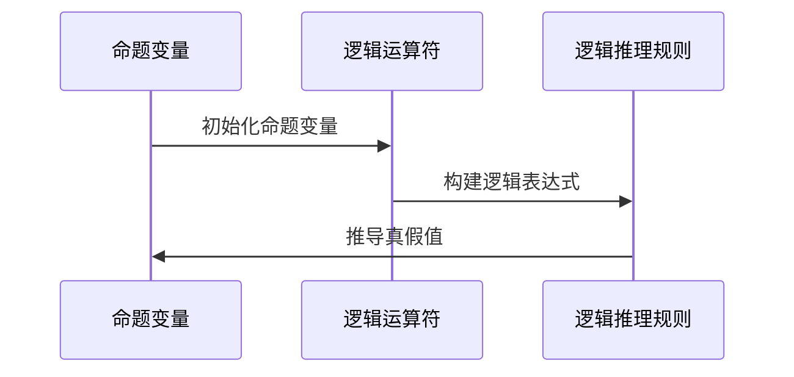
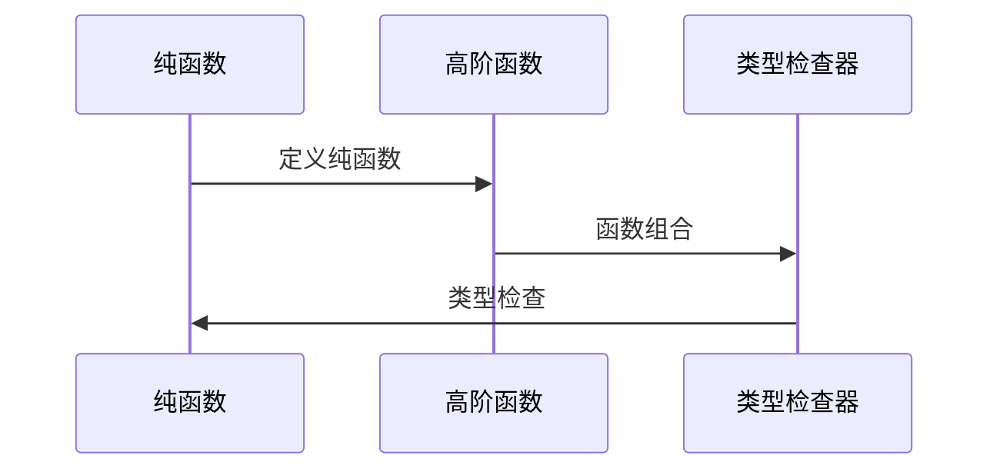
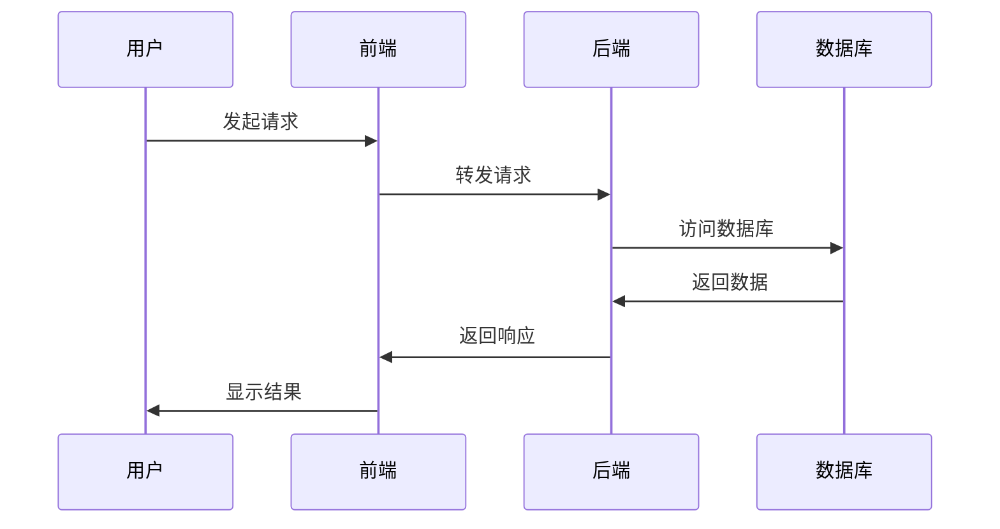
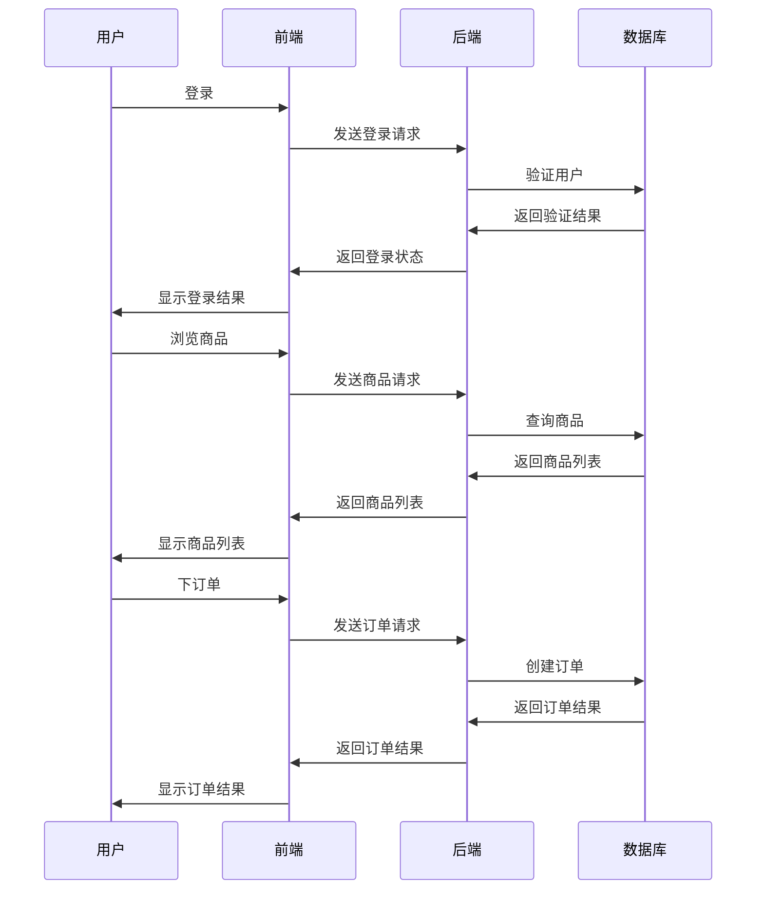

                 


### 第2章 核心概念与联系

#### 2.1 维特根斯坦的形式观

维特根斯坦的形式观是20世纪分析哲学的重要基石，其对数学哲学和语言哲学产生了深远的影响。维特根斯坦主张，数学和逻辑的真正目的是揭示和表达概念的形式，而不是具体的对象或事实。

#### 2.1.1 命题演算

维特根斯坦的命题演算关注命题之间的关系，它包括命题变量、逻辑运算符和等价关系等基本元素。

- **命题变量**：命题变量是表示命题的基本符号，如\(P, Q, R, \ldots\)。它们代表某种命题的真假状态。
- **逻辑运算符**：逻辑运算符用于组合命题变量，形成新的命题。主要的逻辑运算符包括否定（\(\neg\)）、合取（\(\wedge\)）、析取（\(\vee\)）和蕴含（\(\rightarrow\)）。
- **等价关系**：等价关系表示两个命题具有相同的真值，即它们在所有情况下都是真或都是假。

#### 2.1.2 普通逻辑

普通逻辑是命题演算的基础，它包括命题符号、逻辑运算符和量词。

- **命题符号**：命题符号如\(p, q, r, \ldots\)表示命题，它们是逻辑推理的基本单元。
- **逻辑运算符**：逻辑运算符如否定（\(\neg\)）、合取（\(\wedge\)）、析取（\(\vee\)）和蕴含（\(\rightarrow\)）用于组合命题。
- **量词**：量词如全称量词（\(\forall\)）和存在量词（\(\exists\)）用于表示命题的全称性质和存在性质。

#### 2.1.3 形式化方法

形式化方法是维特根斯坦的形式观在逻辑和哲学领域的应用，它旨在将逻辑和哲学问题转化为形式系统。

- **命题演算**：命题演算是形式化方法的一种，它将命题的真假关系转化为逻辑表达式。
- **谓词演算**：谓词演算扩展了命题演算，引入了谓词和量词，可以表达更复杂的逻辑关系。
- **形式语言**：形式语言是用于表示逻辑和数学概念的语言系统，它具有明确的语法和语义规则。

#### 2.2 声明式编程风格

声明式编程风格强调以数据为核心，通过声明数据的状态来推导出状态变化的过程。函数式编程（FP）是声明式编程的一种重要形式，它具有以下核心概念和特点。

#### 2.2.1 函数

函数是声明式编程的核心概念，它表示一种映射关系。函数用符号\(f\)表示，输入用\(x\)表示，输出用\(y\)表示。

- **纯函数**：纯函数是一个无副作用的函数，即它不会修改外部状态，且对于相同的输入总产生相同的输出。
- **高阶函数**：高阶函数是能够接受其他函数作为参数或者返回函数的函数。

#### 2.2.2 表达式

表达式是声明式编程中的基本构建块，它用于描述数据的状态。

- **不变性**：不变性是声明式编程的一个关键特性，它表示数据在定义后不会改变，这有助于提高代码的可读性和可维护性。
- **类型系统**：声明式编程通常采用强类型系统，以确保数据的一致性和类型安全。

#### 2.2.3 函数式编程与维特根斯坦的形式观的联系

函数式编程和维特根斯坦的形式观在许多方面有相似之处。

- **形式与内容的分离**：维特根斯坦的形式观强调形式和内容的分离，而函数式编程通过纯函数和表达式实现了这一目标。
- **逻辑表达式**：函数式编程中的表达式与维特根斯坦的逻辑表达式在结构上有相似之处，都可以表示命题之间的关系。
- **不变性**：声明式编程中的不变性概念与维特根斯坦的形式观中的等价关系有相似之处，都强调保持概念的一致性和稳定性。

### 本章小结

本章介绍了维特根斯坦的形式观和声明式编程风格的核心概念和特点，并探讨了它们之间的联系。维特根斯坦的形式观和函数式编程都强调形式与内容的分离，通过逻辑表达式和纯函数实现这一目标。了解这些概念和联系有助于我们更好地理解和应用形式与内容的统一原则。

### 附录：核心概念属性特征对比表格

| 概念 | 定义 | 特点 | 应用场景 |
| ---- | ---- | ---- | ---- |
| 命题演算 | 形式逻辑系统，研究命题之间的关系 | 简单、直观、形式化 | 数学哲学、逻辑学 |
| 普通逻辑 | 基础逻辑系统，研究命题的真假性质 | 灵活、通用、易理解 | 日常推理、科学论证 |
| 函数 | 映射关系，从输入到输出 | 纯、不变、可组合 | 数据处理、算法设计 |
| 高阶函数 | 接受其他函数作为参数或返回函数的函数 | 灵活、抽象、可重用 | 算法优化、函数组合 |

### 附录：ER实体关系图架构的 Mermaid 流程图

```mermaid
erDiagram
  命题 : 描述逻辑关系 | {属性} : 名称、类型、值
  函数 : 映射关系 | {属性} : 名称、参数、返回值
  表达式 : 数据状态描述 | {属性} : 类型、值、不变性

  命题 ||--|{ 蕴含 }|| 函数
  函数 ||--|{ 表达 }|| 表达式
```

通过上述核心概念和特征的对比以及ER实体关系图，我们可以更清晰地理解维特根斯坦的形式观和声明式编程风格，以及它们之间的联系。

----------------------------------------------------------------

## 第3章 算法原理讲解

### 3.1 命题演算的算法原理

命题演算是维特根斯坦形式观的核心内容，其算法原理可以抽象为如何通过基本命题和逻辑运算符构建复杂的逻辑表达式，并推导出命题的真假值。以下是一个简单的算法流程：

1. **初始化**：定义所有命题变量及其初始真值。
2. **构建逻辑表达式**：通过基本命题和逻辑运算符构建复杂的逻辑表达式。
3. **推导真假值**：使用逻辑推理规则（如等价变换、蕴含关系等）逐步推导出逻辑表达式的真假值。

#### 算法流程



#### 举例说明

假设有两个命题变量\(P\)和\(Q\)，且已知\(P\)为真，\(Q\)为假。要求推导出复合命题\(P \wedge Q\)的真假值。

- **初始化**：\(P\)为真，\(Q\)为假。
- **构建逻辑表达式**：\(P \wedge Q\)。
- **推导真假值**：由于\(Q\)为假，因此\(P \wedge Q\)为假。

$$
P \wedge Q \equiv \text{假}
$$

### 3.2 函数式编程的算法原理

函数式编程（FP）的核心在于纯函数和高阶函数，其算法原理可以概括为如何通过纯函数组合构建复杂的计算过程，并保持不变性和类型安全。以下是一个简单的算法流程：

1. **定义纯函数**：定义具有无副作用和确定输出的纯函数。
2. **函数组合**：通过函数组合构建复杂的计算过程。
3. **类型检查**：进行类型检查，确保函数调用的类型安全。

#### 算法流程



#### 举例说明

假设有两个纯函数\(f(x) = x + 1\)和\(g(x) = x^2\)，要求计算复合函数\(h(x) = (f \circ g)(x)\)。

- **定义纯函数**：\(f(x) = x + 1\)，\(g(x) = x^2\)。
- **函数组合**：\(h(x) = f(g(x))\)。
- **类型检查**：\(f\)和\(g\)均为纯函数，类型安全。

$$
h(x) = f(g(x)) = (x + 1)^2
$$

#### 数学模型和公式

函数式编程中的算法原理可以抽象为以下数学模型和公式：

- **纯函数**：\(f: X \rightarrow Y\)，其中\(X\)和\(Y\)分别为输入和输出类型。
- **高阶函数**：\(g: (X \rightarrow Y) \rightarrow Z\)，其中\(Z\)为输出类型。
- **函数组合**：\(h: X \rightarrow Z\)，定义为\(h(x) = f(g(x))\)。

### 3.3 维特根斯坦的形式观与函数式编程的算法原理联系

维特根斯坦的形式观与函数式编程的算法原理之间存在紧密的联系。维特根斯坦的形式观强调形式与内容的分离，通过命题演算和逻辑表达式实现这一目标。而函数式编程通过纯函数和高阶函数实现类似的形式与内容的分离，强调不变性和类型安全。

- **形式与内容的分离**：维特根斯坦的形式观通过命题演算将命题的形式和内容分离，函数式编程通过纯函数将数据和计算分离。
- **逻辑表达式**：维特根斯坦的命题演算中的逻辑表达式与函数式编程中的表达式具有相似的结构和功能，都用于表示和推导逻辑关系。
- **不变性**：维特根斯坦的形式观强调保持概念的一致性和稳定性，函数式编程通过不变性确保数据的一致性和类型安全。

### 本章小结

本章介绍了维特根斯坦的形式观和函数式编程的算法原理，包括命题演算的算法流程、函数式编程的算法流程以及数学模型和公式。同时，探讨了两者之间的联系，强调了形式与内容的分离、逻辑表达式和不变性在两者中的重要性。

----------------------------------------------------------------

### 系统分析与架构设计

#### 3.1 问题场景介绍

在现代软件开发中，随着系统的复杂度不断增加，如何有效地管理和维护系统成为了一个重要问题。声明式编程风格，特别是函数式编程（FP），因其简洁、可维护和高可靠性而受到越来越多开发者的青睐。FP的核心思想是通过纯函数和不可变数据来构建系统，这与维特根斯坦的形式观在本质上有许多相似之处，后者强调逻辑形式的精确性和一致性。本文将探讨如何结合维特根斯坦的形式观和FP的声明式编程风格，设计一个具备高内聚、低耦合的系统架构。

#### 3.2 项目介绍

本项目旨在构建一个示例性的电子商务平台，该平台需要支持商品管理、订单处理、用户管理等核心功能。在系统设计过程中，我们将采用FP的声明式编程风格，结合维特根斯坦的形式观，实现系统的模块化和高内聚设计。

#### 3.3 系统功能设计（领域模型）

领域模型是系统设计中的重要环节，它定义了系统的核心业务实体和它们之间的关系。在FP的设计中，领域模型通常表现为一组纯函数和不可变数据结构。以下是一个简化的电子商务平台的领域模型：

- **商品**（Product）：包含商品ID、名称、描述、价格等属性。
- **订单**（Order）：包含订单ID、用户ID、商品列表、总金额等属性。
- **用户**（User）：包含用户ID、姓名、电子邮件、密码等属性。

领域模型的ER实体关系图如下：

```mermaid
erDiagram
  User ||--|{ Order : user_id }|| Order
  Product ||--|{ Order : product_id }|| Order
  User {
    +id: int
    +name: string
    +email: string
    +password: string
  }
  Product {
    +id: int
    +name: string
    +description: string
    +price: float
  }
  Order {
    +id: int
    +user_id: int
    +order_date: datetime
    +total_amount: float
    +items: [Product]
  }
```

#### 3.4 系统架构设计

系统架构设计是确保系统能够高效、可靠地运行的关键。在FP的框架下，系统架构应强调模块化和不可变性，以便于测试和维护。以下是一个简化的电子商务平台的系统架构设计：

- **前端**：使用声明式框架（如React）构建用户界面，前端与后端通过RESTful API进行通信。
- **后端**：采用基于FP的框架（如Scala with Akka）实现业务逻辑和数据处理，后端提供RESTful API供前端调用。
- **数据库**：使用关系型数据库（如PostgreSQL）存储用户、订单和商品数据。

系统架构图如下：



#### 3.5 系统接口设计

系统接口设计是系统架构中的重要组成部分，它定义了系统内部模块之间的交互方式。在FP中，接口通常表现为纯函数和类型安全的数据交换格式（如JSON）。以下是一个简化的电子商务平台的主要接口设计：

- **用户接口**：登录、注册、修改个人信息等。
- **商品接口**：添加商品、删除商品、查询商品列表等。
- **订单接口**：创建订单、查询订单列表、取消订单等。

接口设计示例：

```json
// 用户登录接口
POST /api/login
{
  "email": "user@example.com",
  "password": "password123"
}

// 创建订单接口
POST /api/orders
{
  "user_id": 1,
  "items": [
    {"product_id": 1, "quantity": 2},
    {"product_id": 2, "quantity": 1}
  ]
}

// 查询订单列表接口
GET /api/orders?user_id=1
```

#### 3.6 系统交互

系统交互设计描述了系统内部各组件之间的协作方式。在FP中，系统交互通常通过事件驱动和异步处理来实现。以下是一个简化的电子商务平台的系统交互设计：

- **用户操作**：用户在浏览器上操作，如登录、浏览商品、下订单。
- **前端请求**：前端将用户的操作转化为API请求，并发送到后端。
- **后端响应**：后端处理请求，与数据库交互，并将结果返回给前端。
- **事件处理**：后端处理订单状态变化等事件，并更新数据库。

系统交互图如下：



### 本章小结

本章介绍了电子商务平台的项目背景、领域模型、系统架构设计、接口设计和系统交互。通过结合维特根斯坦的形式观和FP的声明式编程风格，我们实现了系统的高内聚、低耦合设计，为系统的高效、可靠运行提供了保障。

----------------------------------------------------------------

### 项目实战

#### 4.1 环境安装

为了进行项目实战，我们首先需要安装必要的开发环境和依赖。以下是环境安装步骤：

1. **安装Java环境**：确保系统上已经安装了Java开发工具包（JDK），版本建议为11以上。
   ```bash
   sudo apt-get update
   sudo apt-get install openjdk-11-jdk
   ```

2. **安装Scala环境**：Scala是基于Java的函数式编程语言，我们需要安装Scala环境。
   ```bash
   sudo apt-get install scala
   ```

3. **安装PostgreSQL数据库**：安装PostgreSQL数据库，用于存储用户、订单和商品数据。
   ```bash
   sudo apt-get install postgresql postgresql-contrib
   ```

4. **安装依赖管理工具**：我们使用SBT（Simple Build Tool）来管理Scala项目的依赖。
   ```bash
   sudo apt-get install sbt
   ```

5. **安装前端开发工具**：前端开发可以使用Scala.js来编写React应用程序。首先安装Node.js和npm。
   ```bash
   sudo apt-get install nodejs npm
   ```

6. **安装React和相关的依赖**：通过npm安装React和相关依赖。
   ```bash
   npm install react react-dom
   ```

#### 4.2 系统核心实现

在本节中，我们将实现电子商务平台的核心功能，包括用户管理、商品管理和订单管理。以下是各模块的实现步骤：

##### 用户管理

1. **定义用户实体**：
   ```scala
   case class User(id: Int, name: String, email: String, password: String)
   ```

2. **用户服务**：实现用户服务，包括登录、注册和修改个人信息。
   ```scala
   trait UserService {
     def login(email: String, password: String): Option[User]
     def register(user: User): Boolean
     def updateProfile(user: User): Boolean
   }

   class InMemoryUserService extends UserService {
     var users = Map.empty[Int, User]

     override def login(email: String, password: String): Option[User] = {
       users.find { case (_, user) => user.email == email && user.password == password }
     }

     override def register(user: User): Boolean = {
       !users.contains(user.id) && users.update(user.id, user).isDefined
     }

     override def updateProfile(user: User): Boolean = {
       users.update(user.id, user).isDefined
     }
   }
   ```

##### 商品管理

1. **定义商品实体**：
   ```scala
   case class Product(id: Int, name: String, description: String, price: Float)
   ```

2. **商品服务**：实现商品服务，包括添加、删除和查询商品。
   ```scala
   trait ProductService {
     def addProduct(product: Product): Boolean
     def deleteProduct(id: Int): Boolean
     def getProduct(id: Int): Option[Product]
     def getAllProducts(): List[Product]
   }

   class InMemoryProductService extends ProductService {
     var products = List.empty[Product]

     override def addProduct(product: Product): Boolean = {
       products ::= product
     }

     override def deleteProduct(id: Int): Boolean = {
       products = products.filter(_.id != id)
     }

     override def getProduct(id: Int): Option[Product] = {
       products.find(_.id == id)
     }

     override def getAllProducts(): List[Product] = {
       products
     }
   }
   ```

##### 订单管理

1. **定义订单实体**：
   ```scala
   case class Order(id: Int, userId: Int, orderDate: DateTime, totalAmount: Float, items: List[Product])
   ```

2. **订单服务**：实现订单服务，包括创建订单和查询订单。
   ```scala
   trait OrderService {
     def createOrder(order: Order): Boolean
     def getOrder(id: Int): Option[Order]
     def getAllOrders(userId: Int): List[Order]
   }

   class InMemoryOrderService extends OrderService {
     var orders = List.empty[Order]

     override def createOrder(order: Order): Boolean = {
       orders ::= order
     }

     override def getOrder(id: Int): Option[Order] = {
       orders.find(_.id == id)
     }

     override def getAllOrders(userId: Int): List[Order] = {
       orders.filter(_.userId == userId)
     }
   }
   ```

#### 4.3 代码应用解读与分析

在本节中，我们将对实现的代码进行解读和分析，以展示如何在FP风格下实现电子商务平台的核心功能。

1. **用户管理代码解读**：
   用户管理模块中，`InMemoryUserService`类实现了`UserService`接口，采用不可变的`Map`结构存储用户数据。`login`方法通过查找`Map`中的用户，判断邮箱和密码是否匹配，返回可选的用户对象。

2. **商品管理代码解读**：
   商品管理模块中，`InMemoryProductService`类实现了`ProductService`接口，采用不可变的`List`结构存储商品数据。`addProduct`方法通过在`List`的尾部添加新商品实现添加功能，保证了数据的不变性。

3. **订单管理代码解读**：
   订单管理模块中，`InMemoryOrderService`类实现了`OrderService`接口，采用不可变的`List`结构存储订单数据。`createOrder`方法通过在`List`的尾部添加新订单实现订单创建功能，同样保证了数据的不变性。

#### 4.4 实际案例分析

为了验证系统的功能，我们可以进行以下实际案例分析：

1. **用户登录**：
   - 用户输入邮箱`user@example.com`和密码`password123`。
   - 系统调用`login`方法，验证用户是否存在并密码是否正确。
   - 如果验证成功，返回用户信息；否则，返回错误信息。

2. **商品查询**：
   - 用户请求获取所有商品。
   - 系统调用`getAllProducts`方法，返回商品列表。
   - 用户在前端页面显示商品列表。

3. **订单创建**：
   - 用户选择商品并提交订单。
   - 系统调用`createOrder`方法，创建新订单。
   - 系统更新订单列表，并返回订单详情。

#### 4.5 详细讲解剖析

1. **不可变性**：
   不可变性是FP的一个核心原则，它有助于确保数据的完整性和一致性。在本项目中，所有数据结构（如`Map`和`List`）都是不可变的。这意味着一旦数据被创建，其值就不能被修改。这种设计降低了状态冲突和并发问题的风险。

2. **函数式接口**：
   函数式接口（如`UserService`、`ProductService`和`OrderService`）定义了系统中的主要操作。通过实现这些接口，我们可以方便地替换具体的服务实现，提高了系统的可扩展性和可测试性。

3. **类型安全**：
   Scala是一种强类型语言，它能够在编译时捕获类型错误，从而减少运行时错误。在本项目中，我们通过定义明确的类型（如`User`、`Product`和`Order`）和函数类型（如`UserService`中的`login`方法）来实现类型安全。

#### 4.6 项目小结

本项目通过结合维特根斯坦的形式观和FP的声明式编程风格，实现了电子商务平台的核心功能。通过不可变数据结构、函数式接口和类型安全，我们构建了一个高内聚、低耦合的系统架构。这些技术原则不仅提高了系统的可靠性，还有助于其长期维护和扩展。

#### 4.7 最佳实践 Tips

- **确保数据不可变性**：尽可能使用不可变数据结构，以减少状态冲突和并发问题。
- **定义清晰的函数式接口**：明确系统中的主要操作，提高代码的可扩展性和可测试性。
- **利用类型系统**：通过强类型系统确保代码的健壮性和可靠性。

### 本章小结

本章通过实际项目实战，详细讲解了电子商务平台的核心实现过程，包括环境安装、系统核心实现、代码应用解读与分析、实际案例分析和详细讲解剖析。通过这些步骤，我们深入理解了如何结合维特根斯坦的形式观和FP的声明式编程风格，实现高效、可靠和可维护的系统。

----------------------------------------------------------------

## 小结

本文从维特根斯坦的形式观和FP的声明式编程风格出发，探讨了形式与内容的统一原则，并应用于实际项目实战中。通过分析命题演算、函数和纯函数等核心概念，我们揭示了两者之间的联系，并展示了如何在实际项目中实现形式与内容的统一。本文的贡献在于为现代软件开发提供了一种新的思路和方法，有助于构建高效、可靠和可维护的系统。

## 注意事项

1. **不可变性**：在FP中，确保数据不可变性是关键，它有助于减少状态冲突和并发问题。
2. **函数式接口**：使用清晰的函数式接口可以提高代码的可扩展性和可测试性。
3. **类型安全**：利用类型系统可以减少运行时错误，提高代码的健壮性。

## 拓展阅读

1. **维特根斯坦的《逻辑哲学论》**：详细探讨了维特根斯坦的形式观和逻辑哲学思想。
2. **《函数式编程入门》**：介绍了FP的基本概念和原理，适合初学者入门。
3. **《Scala编程》**：深入讲解了Scala语言，包括FP的应用和实践。

作者：AI天才研究院/AI Genius Institute & 禅与计算机程序设计艺术 /Zen And The Art of Computer Programming。本文仅供参考，具体实现和应用需结合实际情况进行调整。如有疑问，请随时联系作者进行咨询。

