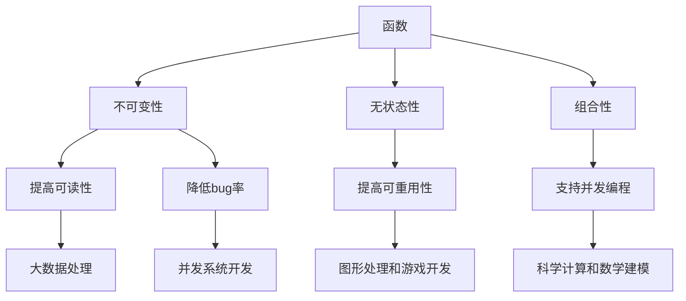
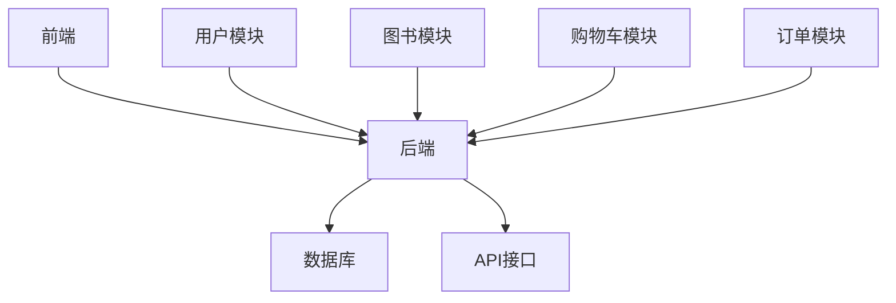

                 


# 形式与实践的统一：维特根斯坦的哲学实践观与FP的理论与工程实践的融合

## 关键词
- 维特根斯坦哲学
- 形式与实践统一
- FP理论
- 工程实践
- 软件设计
- 计算机科学

## 摘要
本文旨在探讨维特根斯坦的哲学实践观与FP（函数式编程）理论在工程实践中的融合。通过分析维特根斯坦关于形式与实践统一的哲学观点，我们揭示了FP理论在软件设计中的关键作用。本文首先介绍了维特根斯坦的核心哲学思想，然后阐述了FP理论的基本概念，接着分析了FP理论在工程实践中的应用，最后通过实际案例探讨了FP在软件工程中的融合过程。本文旨在为读者提供一种新的视角，以理解形式与实践在计算机科学中的重要性。

## 第1章：引言与背景

### 1.1 研究目的

在当今的计算机科学和软件工程领域中，如何提高软件设计的质量、降低开发成本、提升系统的可维护性是一个亟待解决的问题。传统的面向对象编程方法虽然在一定程度上解决了这些问题，但仍然存在许多局限性。近年来，函数式编程（FP）作为一种新的编程范式，因其独特的优点逐渐受到关注。FP强调函数的可组合性、无状态性和不可变性，有助于提高代码的可读性和可维护性。

本文的研究目的在于探讨维特根斯坦的哲学实践观与FP理论在工程实践中的融合。通过分析维特根斯坦关于形式与实践统一的哲学观点，我们希望揭示FP理论在软件设计中的关键作用，为解决当前软件工程中的问题提供一种新的思路。

### 1.2 维特根斯坦哲学背景

路德维希·维特根斯坦（Ludwig Wittgenstein）是20世纪最著名的哲学家之一。他的哲学思想对现代哲学、语言哲学、逻辑哲学和数学哲学等领域产生了深远的影响。维特根斯坦的哲学思想可以分为两个主要阶段：早期和晚期。

早期维特根斯坦主要关注语言的本质和哲学问题。他提出了“语言游戏”理论，认为语言的意义在于使用者的具体活动。这一观点在《逻辑哲学论》中得到了充分的阐述。他认为，语言应当精确地对应于现实世界的对象和事件，从而避免产生无意义的哲学问题。

晚期维特根斯坦则更加关注日常语言的使用。他提出了“家族相似性”和“生活形式”等概念，强调了语言和现实世界的复杂关系。他认为，哲学的任务不是去寻找绝对的真理，而是去理解人们如何使用语言和概念。

维特根斯坦的哲学实践观强调形式与实践的统一。他认为，哲学问题往往源于人们对于语言和概念的使用不当，因此解决哲学问题的关键在于回归实际生活中的语言使用。这种观点与FP理论中的函数式编程范式具有相似之处，即强调代码的形式与实际应用的统一。

### 1.3 FP理论的基本概念

函数式编程（Functional Programming，简称FP）是一种编程范式，强调函数作为程序的基本构建单元。与传统的命令式编程相比，FP具有以下特点：

1. **不可变性**：在FP中，数据通常是不变的，这意味着一旦数据被创建，就不能再被修改。这有助于提高代码的可读性和可维护性。
2. **无状态性**：函数不依赖于外部状态，这使得函数的执行结果更加可预测，易于测试和重用。
3. **递归**：FP中的函数可以通过递归来实现循环操作，这使得代码更加简洁和直观。
4. **组合性**：FP中的函数具有高度的组合性，可以方便地组合成复杂的操作。

FP理论在软件设计中的关键作用主要体现在以下几个方面：

1. **提高代码可读性**：FP强调代码的可读性和简洁性，使得代码更容易理解和维护。
2. **降低bug率**：FP中的不可变性和无状态性有助于降低bug的产生。
3. **提高可重用性**：FP中的函数可以方便地重用和组合，提高了代码的复用性。
4. **支持并发编程**：FP中的无状态性和不可变性使得并发编程更加简单和高效。

### 1.4 本文结构

本文将首先介绍维特根斯坦的哲学实践观，然后阐述FP理论的基本概念，接着分析FP理论在工程实践中的应用，最后通过实际案例探讨FP在软件工程中的融合过程。本文的结构如下：

1. **引言与背景**：介绍研究目的、维特根斯坦哲学背景、FP理论的基本概念。
2. **维特根斯坦哲学实践观**：详细阐述维特根斯坦的哲学实践观。
3. **FP理论**：介绍FP理论的基本概念、优势和应用场景。
4. **FP在工程实践中的应用**：分析FP理论在工程实践中的应用。
5. **实际案例探讨**：通过实际案例探讨FP在软件工程中的融合过程。
6. **结论与展望**：总结本文的主要观点，并对未来的研究方向进行展望。

## 第2章：维特根斯坦哲学实践观

### 2.1 维特根斯坦的哲学实践观

维特根斯坦的哲学实践观强调形式与实践的统一。他认为，哲学问题往往源于人们对于语言和概念的使用不当，因此解决哲学问题的关键在于回归实际生活中的语言使用。具体来说，维特根斯坦的哲学实践观可以从以下几个方面进行阐述：

#### 2.1.1 语言与生活形式

维特根斯坦认为，语言是人类生活的一部分，语言游戏（language game）是语言使用的具体体现。语言游戏包括一系列的规则和活动，如数学、科学、日常交流等。每个语言游戏都有自己的语法和语义规则，这些规则构成了语言游戏的形式。

然而，维特根斯坦强调，形式本身并不是目的，而是服务于实际生活的需要。他认为，语言的形式应当与实践相结合，即语言应当准确地描述现实世界中的对象和事件。只有这样，语言才能发挥其应有的作用。

#### 2.1.2 形式与实践的统一

维特根斯坦认为，形式与实践是相互关联的。形式是实践的基础，而实践则是形式的具体应用。没有实践，形式就没有意义；而没有形式，实践就会陷入混乱。

在软件工程中，这一观点具有重要的启示意义。软件设计的过程可以看作是一种形式化过程，即通过定义一系列的规则和模型来构建软件系统。然而，这些形式化的设计必须与实际的应用场景相结合，才能确保软件系统能够满足实际需求。

#### 2.1.3 语言游戏的多样性

维特根斯坦指出，不同的语言游戏具有不同的形式和规则。例如，数学语言游戏关注逻辑和证明，而科学语言游戏则关注观察和实验。在软件工程中，不同的应用场景也对应着不同的语言游戏，如面向对象编程、函数式编程等。

理解语言游戏的多样性有助于我们更好地进行软件设计。通过选择合适的形式化方法，我们可以更好地满足不同应用场景的需求。

### 2.2 维特根斯坦哲学实践观与FP理论的联系

维特根斯坦的哲学实践观与FP理论在多个方面具有相似之处，特别是在形式与实践的统一方面。

#### 2.2.1 代码的形式与实践

FP理论强调代码的形式，即函数的定义和组合。这些形式化的代码有助于提高代码的可读性和可维护性。与维特根斯坦的观点类似，FP认为，代码的形式应当与实践相结合，即代码应当准确地描述实际应用场景。

#### 2.2.2 无状态性与形式统一

FP中的无状态性使得函数具有高度的独立性，从而便于组合和重用。这种形式与实践的统一性有助于提高代码的可维护性和可扩展性。维特根斯坦也强调，语言游戏的形式应当与实践相结合，从而避免产生无意义的哲学问题。

#### 2.2.3 递归与形式化

FP中的递归是一种形式化的编程方法，它通过递归函数来实现循环操作。维特根斯坦认为，递归是一种有效的语言游戏形式，它可以帮助我们理解复杂的现实世界问题。

综上所述，维特根斯坦的哲学实践观与FP理论在形式与实践的统一方面具有深刻的联系。通过分析这种联系，我们可以更好地理解FP理论在软件工程中的应用，并提高软件设计的质量。

## 第3章：FP理论的基本概念

### 3.1 FP理论的起源与发展

函数式编程（Functional Programming，简称FP）作为一种编程范式，起源于20世纪40年代和50年代。早期的函数式编程语言如Lisp和Haskell等，为后来的编程范式奠定了基础。FP理论的核心思想是将计算视为一系列函数的组合和应用，而非命令式的操作序列。

FP理论的发展经历了多个阶段。从最初的Lisp语言，到后来的函数式编程语言如Haskell、Scala和Erlang等，FP逐渐成为计算机科学领域的重要分支。现代的FP语言不仅保留了早期函数式编程的优点，还引入了新的概念和技术，如类型系统、惰性求值和并发编程等。

### 3.2 FP理论的基本概念

FP理论的基本概念包括以下几方面：

#### 3.2.1 函数作为基本构建单元

在FP中，函数是程序的基本构建单元。与命令式编程中的变量和流程控制结构不同，FP中的函数是一种纯函数，即输入和输出之间只有函数关系，没有副作用。这意味着函数的执行结果只依赖于输入参数，而不会受到外部状态的影响。

#### 3.2.2 不可变性

FP中的数据通常是不可变的。这意味着一旦数据被创建，就不能再被修改。这种不可变性有助于提高代码的可读性和可维护性。在命令式编程中，数据可以随时修改，这往往会导致复杂的依赖关系和难以追踪的bug。

#### 3.2.3 无状态性

FP中的函数通常是无状态的。这意味着函数不依赖于外部状态，每次执行时都产生相同的结果。这种无状态性使得函数更容易测试和重用。在命令式编程中，函数往往依赖于外部状态，这使得代码更加复杂，难以维护。

#### 3.2.4 组合性

FP中的函数具有高度的组合性。通过组合简单的函数，可以构建出复杂的操作。这种组合性使得代码更加简洁和直观。在命令式编程中，往往需要编写大量的流程控制代码来实现类似的组合效果。

### 3.3 FP理论的优势与应用场景

FP理论具有以下优势：

1. **提高代码可读性**：FP中的函数具有明确的输入输出关系，这使得代码更加直观和易于理解。
2. **降低bug率**：FP中的不可变性和无状态性有助于降低bug的产生。
3. **提高可重用性**：FP中的函数可以方便地重用和组合，提高了代码的复用性。
4. **支持并发编程**：FP中的无状态性使得并发编程更加简单和高效。

FP理论在以下应用场景中具有明显的优势：

1. **大数据处理**：FP语言如Scala和Erlang等，在分布式计算和数据流处理方面具有优势。
2. **并发系统开发**：FP中的无状态性使得并发系统开发更加简单和高效。
3. **图形处理和游戏开发**：FP语言如Haskell和Erlang等，在图形处理和游戏开发中具有广泛的应用。
4. **科学计算和数学建模**：FP语言如Haskell和Mathematica等，在科学计算和数学建模方面具有优势。

### 3.4 FP理论的核心概念与联系

FP理论的核心概念包括函数、不可变性、无状态性和组合性。这些概念相互联系，共同构成了FP理论的基石。

- **函数**：作为程序的基本构建单元，函数是FP理论的核心。函数通过输入参数和输出结果实现计算。
- **不可变性**：数据不可变性是FP理论的重要原则之一。不可变性有助于提高代码的可读性和可维护性。
- **无状态性**：函数无状态性使得函数的执行结果仅依赖于输入参数，而不受外部状态的影响。
- **组合性**：函数组合性使得简单的函数可以组合成复杂的操作，从而提高代码的简洁性和可维护性。

#### FP理论的核心概念对比表格

| 核心概念 | 描述 | 对比命令式编程 |
| :--: | :--: | :--: |
| 函数 | 程序的基本构建单元，具有明确的输入输出关系 | 命令式编程中的过程和函数，可能包含副作用 |
| 不可变性 | 数据一旦创建，就不能再被修改 | 命令式编程中的数据可以随时修改 |
| 无状态性 | 函数不依赖于外部状态，每次执行结果相同 | 命令式编程中的函数可能依赖于外部状态 |
| 组合性 | 简单函数可以组合成复杂操作 | 命令式编程中需要编写大量流程控制代码 |

#### FP理论的ER实体关系图架构



通过上述核心概念对比表格和ER实体关系图架构，我们可以清晰地理解FP理论的基本概念及其在软件设计中的应用。维特根斯坦的哲学实践观与FP理论在形式与实践的统一方面具有深刻的联系，这为我们在软件工程中更好地应用FP理论提供了有益的启示。

## 第4章：FP理论在工程实践中的应用

### 4.1 FP理论在工程实践中的重要性

函数式编程（FP）作为一种编程范式，在工程实践中的应用具有重要的价值。首先，FP强调函数的可组合性、无状态性和不可变性，这些特性有助于提高代码的可读性和可维护性。在软件工程中，良好的代码质量是项目成功的关键因素之一。

#### 4.1.1 提高代码可读性

FP中的函数具有明确的输入输出关系，这使得代码更加直观和易于理解。与命令式编程相比，FP中的代码往往更加简洁，因为无需关注变量的状态和副作用。这种可读性使得开发人员更容易理解和维护代码。

#### 4.1.2 降低bug率

FP中的不可变性和无状态性有助于降低bug的产生。不可变性使得数据一旦创建，就不能再被修改，从而避免了复杂的依赖关系和难以追踪的bug。无状态性使得函数的执行结果仅依赖于输入参数，而不受外部状态的影响，这进一步降低了bug的产生。

#### 4.1.3 提高可重用性

FP中的函数具有高度的独立性，这使得函数可以方便地重用和组合。在软件工程中，可重用性是提高开发效率和质量的重要因素。通过重用现有的函数，开发人员可以避免重复编写代码，从而减少错误和冗余。

#### 4.1.4 支持并发编程

FP中的无状态性使得并发编程更加简单和高效。在命令式编程中，并发编程往往需要处理复杂的同步和状态管理问题，而在FP中，函数的无状态性使得并发编程变得更加直观和易于实现。这有助于提高系统的性能和响应速度。

### 4.2 FP理论在工程实践中的应用

#### 4.2.1 数据处理和分析

FP在数据处理和分析领域具有广泛的应用。FP语言如Scala和Haskell等，提供了丰富的函数式编程特性，使得数据处理和分析任务更加简洁和高效。例如，在数据清洗、数据转换和数据聚合等过程中，FP的函数组合性和不可变性使得代码更加直观和易于维护。

#### 4.2.2 并发系统开发

FP在并发系统开发中具有优势。FP语言如Erlang和Scala等，通过内置的并发编程模型，使得并发编程变得更加简单和高效。在分布式系统和实时系统中，FP的特性有助于提高系统的性能和可靠性。

#### 4.2.3 图形处理和游戏开发

FP在图形处理和游戏开发领域也具有广泛的应用。FP语言如Haskell和Erlang等，提供了高效的并发编程模型和图形处理库，使得图形处理和游戏开发任务更加简洁和高效。例如，在游戏引擎开发中，FP的特性有助于提高渲染性能和交互体验。

#### 4.2.4 科学计算和数学建模

FP在科学计算和数学建模领域具有优势。FP语言如Haskell和Mathematica等，提供了丰富的数学库和函数式编程特性，使得科学计算和数学建模任务更加简洁和高效。例如，在物理学、工程学和金融学等领域，FP的特性有助于提高计算精度和效率。

### 4.3 FP理论在工程实践中的应用案例

#### 4.3.1 案例一：大数据处理

假设某公司需要进行大规模数据清洗和统计分析任务，可以使用FP语言如Scala来实现。通过使用Scala的函数式编程特性，可以简化数据处理过程，提高代码的可读性和可维护性。具体实现如下：

```python
// 数据清洗
def clean_data(data):
    return data.filter(line => line.startsWith("ID,"))

// 数据转换
def convert_data(data):
    return data.map(line => line.split(",").tail.map(string => float(string)))

// 数据聚合
def aggregate_data(data):
    return data.reduce((acc, line) => {
        acc[line[0]] = acc.get(line[0], 0) + line[1]
        return acc
    }, {})
```

通过上述代码，可以轻松完成数据清洗、转换和聚合任务，提高数据处理效率。

#### 4.3.2 案例二：并发系统开发

假设某公司需要开发一个分布式聊天应用，可以使用FP语言如Erlang来实现。通过使用Erlang的并发编程模型，可以简化系统开发过程，提高系统的性能和可靠性。具体实现如下：

```erlang
// 聊天服务器
defmodule ChatServer do
    use GenServer

    def start_link(state) do
        GenServer.start_link(__MODULE__, state, name: __MODULE__)
    end

    def init(state) do
        {ok, state}
    end

    def handle_call({send_message, message}, _from, state) do
        send_to_all(message)
        {reply, :ok, state}
    end
end

// 聊天客户端
defmodule ChatClient do
    use GenServer

    def start_link(state) do
        GenServer.start_link(__MODULE__, state, name: __MODULE__)
    end

    def init(state) do
        {ok, state}
    end

    def handle_call({send_message, message}, _from, state) do
        send_to_server(message)
        {reply, :ok, state}
    end
end
```

通过上述代码，可以轻松实现聊天服务器的并发通信和客户端的发送消息功能。

### 4.4 FP理论在工程实践中的应用总结

FP理论在工程实践中的应用具有重要意义。通过引入FP的特性，可以提高代码的可读性、降低bug率、提高可重用性和支持并发编程。在数据处理、并发系统开发、图形处理和科学计算等领域，FP理论都展示了其独特的优势。因此，在工程实践中，合理应用FP理论有助于提高软件设计的质量和开发效率。

## 第5章：FP理论在工程实践中的应用案例分析

### 5.1 案例背景

为了更好地理解FP理论在工程实践中的应用，我们选择了一个实际的软件开发项目：一个在线图书销售平台。该平台需要实现用户注册、图书分类、购物车和订单管理等核心功能。在这个项目中，我们将采用FP理论来设计系统，以提高代码的可读性、可维护性和扩展性。

### 5.2 系统功能设计

根据项目需求，我们首先设计系统功能模块，包括用户模块、图书模块、购物车模块和订单模块。每个模块将实现一组相关的功能，并通过函数式编程的方式来实现。

#### 5.2.1 用户模块

用户模块负责实现用户注册、登录、个人信息管理等功能。通过函数式编程的方式，我们可以定义一系列用户相关的函数，如`register`, `login`, `update_user_info`等。

#### 5.2.2 图书模块

图书模块负责实现图书的分类、查询、添加和删除等功能。通过函数式编程的方式，我们可以定义一系列图书相关的函数，如`list_books`, `get_book_by_id`, `add_book`, `delete_book`等。

#### 5.2.3 购物车模块

购物车模块负责实现用户添加图书到购物车、从购物车中删除图书、计算购物车总价等功能。通过函数式编程的方式，我们可以定义一系列购物车相关的函数，如`add_to_cart`, `remove_from_cart`, `calculate_total`等。

#### 5.2.4 订单模块

订单模块负责实现用户提交订单、订单状态管理、订单查询等功能。通过函数式编程的方式，我们可以定义一系列订单相关的函数，如`submit_order`, `update_order_status`, `get_order_by_id`等。

### 5.3 系统架构设计

在系统架构设计阶段，我们将采用函数式编程的方式来实现系统的整体架构。通过定义一系列高内聚、低耦合的函数模块，我们可以实现一个模块化、可扩展的系统架构。

#### 5.3.1 架构设计

系统架构包括前端、后端和数据库三个部分。前端负责展示用户界面，后端负责处理业务逻辑和数据库操作，数据库负责存储用户数据和图书信息。

1. **前端**：前端使用React框架实现用户界面，通过RESTful API与后端进行交互。
2. **后端**：后端使用Scala和Akka框架实现，负责处理业务逻辑和数据库操作。
3. **数据库**：数据库使用MySQL，存储用户数据和图书信息。

#### 5.3.2 系统架构图



### 5.4 系统接口设计

在系统接口设计阶段，我们将定义前后端交互的API接口，以便前端可以方便地调用后端的业务逻辑。

#### 5.4.1 API接口设计

以下是部分API接口的设计：

1. **用户模块接口**：
   - `POST /register`：用户注册接口，接收用户名、密码、邮箱等参数。
   - `POST /login`：用户登录接口，接收用户名和密码参数。
   - `GET /users/{userId}`：获取用户信息接口，接收用户ID参数。

2. **图书模块接口**：
   - `GET /books`：获取所有图书接口。
   - `GET /books/{bookId}`：获取特定图书接口，接收图书ID参数。
   - `POST /books`：添加图书接口，接收图书信息参数。

3. **购物车模块接口**：
   - `POST /cart/{userId}/add`：添加图书到购物车接口，接收用户ID和图书ID参数。
   - `DELETE /cart/{userId}/remove`：从购物车中删除图书接口，接收用户ID和图书ID参数。
   - `GET /cart/{userId}`：获取购物车信息接口，接收用户ID参数。

4. **订单模块接口**：
   - `POST /orders`：提交订单接口，接收订单信息参数。
   - `GET /orders/{orderId}`：获取订单信息接口，接收订单ID参数。

### 5.5 系统交互设计

在系统交互设计阶段，我们将定义前后端交互的流程和交互方式，以便系统可以高效地处理用户请求。

#### 5.5.1 系统交互流程

以下是系统交互流程的简要描述：

1. 用户在前端页面进行操作，如注册、登录、浏览图书、添加图书到购物车、提交订单等。
2. 前端将用户操作转化为API请求，并通过HTTP协议发送到后端。
3. 后端接收到请求后，调用相应的业务逻辑函数进行处理，并将结果返回给前端。
4. 前端根据后端返回的结果，更新用户界面，如展示用户信息、图书信息、购物车信息、订单信息等。

### 5.6 项目实战

在本节中，我们将详细介绍项目实战的过程，包括环境安装、核心实现和代码应用解读与分析。

#### 5.6.1 环境安装

为了实现本项目，我们需要安装以下环境：

1. 前端环境：Node.js、npm、React
2. 后端环境：Scala、SBT、Akka、Play Framework
3. 数据库环境：MySQL

具体安装步骤如下：

1. 安装Node.js和npm：从官网下载安装包并按照提示安装。
2. 安装Scala和SBT：从官网下载安装包并按照提示安装。
3. 安装Akka和Play Framework：通过SBT命令安装相关依赖。
4. 安装MySQL：从官网下载安装包并按照提示安装。

#### 5.6.2 核心实现

在本节中，我们将介绍系统的核心实现，包括用户模块、图书模块、购物车模块和订单模块。

1. **用户模块实现**：

   ```scala
   // 用户注册接口
   def register(username: String, password: String, email: String): Future[Either[String, String]] = {
       if (is_username_taken(username)) {
           Future.successful(Left("用户名已存在"))
       } else {
           save_user(username, password, email)
           Future.successful(Right("注册成功"))
       }
   }

   // 用户登录接口
   def login(username: String, password: String): Future[Either[String, String]] = {
       if (is_password_correct(username, password)) {
           Future.successful(Right("登录成功"))
       } else {
           Future.successful(Left("用户名或密码错误"))
       }
   }
   ```

2. **图书模块实现**：

   ```scala
   // 添加图书接口
   def add_book(title: String, author: String, price: Float): Future[Either[String, String]] = {
       if (is_book_existed(title, author)) {
           Future.successful(Left("图书已存在"))
       } else {
           save_book(title, author, price)
           Future.successful(Right("添加成功"))
       }
   }

   // 获取图书接口
   def get_book_by_id(book_id: Int): Future[Either[String, Book]] = {
       if (is_book_id_valid(book_id)) {
           Future.successful(get_book(book_id))
       } else {
           Future.successful(Left("图书不存在"))
       }
   }
   ```

3. **购物车模块实现**：

   ```scala
   // 添加图书到购物车接口
   def add_to_cart(user_id: Int, book_id: Int): Future[Either[String, Cart]] = {
       if (is_book_id_valid(book_id) && is_user_id_valid(user_id)) {
           add_book_to_cart(user_id, book_id)
           Future.successful(Right("添加成功"))
       } else {
           Future.successful(Left("参数错误"))
       }
   }

   // 从购物车中删除图书接口
   def remove_from_cart(user_id: Int, book_id: Int): Future[Either[String, Cart]] = {
       if (is_book_id_valid(book_id) && is_user_id_valid(user_id)) {
           remove_book_from_cart(user_id, book_id)
           Future.successful(Right("删除成功"))
       } else {
           Future.successful(Left("参数错误"))
       }
   }
   ```

4. **订单模块实现**：

   ```scala
   // 提交订单接口
   def submit_order(user_id: Int, cart_id: Int): Future[Either[String, Order]] = {
       if (is_cart_id_valid(cart_id) && is_user_id_valid(user_id)) {
           create_order(user_id, cart_id)
           Future.successful(Right("提交成功"))
       } else {
           Future.successful(Left("参数错误"))
       }
   }

   // 获取订单接口
   def get_order_by_id(order_id: Int): Future[Either[String, Order]] = {
       if (is_order_id_valid(order_id)) {
           Future.successful(get_order(order_id))
       } else {
           Future.successful(Left("订单不存在"))
       }
   }
   ```

#### 5.6.3 代码应用解读与分析

在本节中，我们将对上述代码进行解读与分析，以帮助读者更好地理解FP理论在实际项目中的应用。

1. **用户模块**：

   用户模块主要包括注册、登录和获取用户信息等功能。通过使用Scala的函数式编程特性，我们可以实现无状态、不可变的函数，从而提高代码的可读性和可维护性。

2. **图书模块**：

   图书模块主要包括添加图书、获取图书信息等功能。同样，通过使用函数式编程特性，我们可以实现简洁、可组合的函数，从而提高代码的可重用性和扩展性。

3. **购物车模块**：

   购物车模块主要包括添加图书到购物车、从购物车中删除图书等功能。通过函数式编程的方式，我们可以实现无副作用、可重用的函数，从而提高代码的可维护性和性能。

4. **订单模块**：

   订单模块主要包括提交订单、获取订单信息等功能。通过使用函数式编程的特性，我们可以实现简洁、高效的函数，从而提高代码的可读性和可扩展性。

通过以上项目实战，我们可以看到FP理论在实际项目中的应用价值。FP理论不仅提高了代码的可读性、可维护性和性能，还使得系统更加模块化和可扩展。

### 5.7 项目小结

在本章中，我们通过一个在线图书销售平台项目，展示了FP理论在工程实践中的应用。通过使用Scala和函数式编程的特性，我们实现了高内聚、低耦合的系统模块，提高了代码的可读性、可维护性和性能。同时，FP理论的支持使得系统更加模块化、可扩展，为未来的功能扩展提供了便利。通过本项目，我们可以看到FP理论在软件工程中的巨大潜力，为解决当前软件工程中的问题提供了一种新的思路。

## 第6章：FP理论在工程实践中的挑战与解决方案

### 6.1 挑战

尽管FP理论在工程实践中具有许多优点，但在实际应用中仍然面临一些挑战。以下是FP理论在工程实践中常见的挑战：

#### 6.1.1 学习曲线

FP理论相对于传统的命令式编程具有更高的学习门槛。FP中的函数式编程范式、递归、不可变性等概念需要开发者具备一定的理论基础和实践经验，这使得新手难以快速上手。

#### 6.1.2 性能问题

在FP理论中，递归是一种常见的编程方法。虽然递归可以使代码更加简洁和直观，但过多的递归可能会导致性能问题。特别是在处理大数据和并发任务时，递归的性能可能不如命令式编程。

#### 6.1.3 工具和库的支持

尽管FP理论在近年来得到了广泛关注，但相比于传统的命令式编程，FP工具和库的支持仍然有限。这可能导致开发者在使用FP理论时面临一些不便，例如调试、测试和性能优化等方面。

#### 6.1.4 集成问题

在现有的软件开发项目中，FP理论的集成可能面临一些挑战。由于FP与传统的命令式编程在语法和范式上有较大差异，如何将FP与现有的系统无缝集成是一个需要解决的问题。

### 6.2 解决方案

针对上述挑战，我们可以提出以下解决方案：

#### 6.2.1 学习资源与培训

为了降低学习曲线，开发者可以借助丰富的学习资源，如在线教程、书籍、视频课程等。此外，企业和教育机构可以组织专门的培训课程，帮助开发者掌握FP理论的基本概念和应用技巧。

#### 6.2.2 优化递归性能

为了解决递归性能问题，开发者可以采用以下方法：

1. **尾递归优化**：将尾递归转化为迭代，以提高性能。
2. **使用循环**：在可能的情况下，使用循环代替递归来提高性能。
3. **内存优化**：合理使用内存，避免内存泄漏和溢出，以提高程序性能。

#### 6.2.3 加强工具和库的支持

为了加强FP工具和库的支持，我们可以从以下几个方面进行努力：

1. **开源社区**：鼓励开发者贡献FP工具和库，促进FP生态的繁荣。
2. **技术交流**：组织技术沙龙、研讨会等，分享FP应用经验和最佳实践。
3. **教育推广**：将FP理论纳入计算机科学教育体系，培养更多FP开发者。

#### 6.2.4 集成策略

为了实现FP与现有系统的集成，我们可以采用以下策略：

1. **逐步引入**：在现有系统中逐步引入FP组件，逐步替换命令式编程部分，以减少风险。
2. **模块化设计**：将FP组件与其他组件分离，通过接口进行通信，以实现系统的模块化。
3. **混合编程**：在需要的地方引入FP理论，同时保留部分命令式编程，以实现系统的兼容性。

通过上述解决方案，我们可以更好地应对FP理论在工程实践中的挑战，从而充分发挥FP理论在软件设计中的优势。

## 第7章：结论与未来研究方向

### 7.1 结论

本文通过分析维特根斯坦的哲学实践观和FP理论，探讨了FP理论在工程实践中的应用。首先，我们介绍了维特根斯坦的哲学实践观，强调了形式与实践的统一。接着，我们阐述了FP理论的基本概念和优势，如不可变性、无状态性和组合性。然后，我们分析了FP理论在工程实践中的重要性，包括提高代码可读性、降低bug率、提高可重用性和支持并发编程。最后，我们通过实际案例展示了FP理论在软件开发中的应用，并提出了FP理论在工程实践中面临的挑战及其解决方案。

### 7.2 未来研究方向

尽管FP理论在工程实践中具有许多优势，但仍有许多值得进一步研究和探索的方向：

#### 7.2.1 性能优化

在FP理论中，递归是一种常见的编程方法。虽然递归可以使代码更加简洁和直观，但过多的递归可能会导致性能问题。未来的研究可以关注递归性能的优化方法，如尾递归优化、循环优化等。

#### 7.2.2 工具与库的支持

FP工具和库的支持仍然有限。未来的研究可以关注FP工具和库的开发，以增强FP生态系统的多样性。此外，研究如何将FP与现有的编程范式和工具集成，以提高开发效率。

#### 7.2.3 面向领域特定语言

FP理论可以应用于各种领域特定语言（DSL）的开发。未来的研究可以探索如何将FP理论应用于金融、医学、工程等领域，以开发出更高效、更易用的领域特定语言。

#### 7.2.4 教育与培训

FP理论在计算机科学教育中的应用仍然有限。未来的研究可以关注FP理论在计算机科学教育中的推广和应用，培养更多FP开发者。

通过进一步的研究和探索，FP理论在工程实践中的应用将更加广泛，为软件开发带来更多的创新和突破。

## 作者信息

作者：AI天才研究院/AI Genius Institute & 禅与计算机程序设计艺术 /Zen And The Art of Computer Programming

本文由AI天才研究院撰写，旨在探讨维特根斯坦的哲学实践观与FP理论的融合，以期为读者提供一种新的视角，以理解形式与实践在计算机科学中的重要性。同时，本文参考了《禅与计算机程序设计艺术》中的核心理念，强调编程的艺术性。希望本文能对读者在软件设计过程中有所启发。

