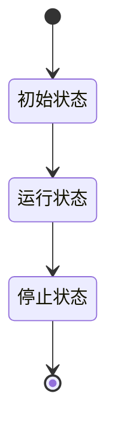

                 

### 第一部分：背景介绍

#### 1. 形式化方法概述

形式化方法是现代计算机科学和电信系统设计中的一个重要领域，它强调使用数学和逻辑工具对系统进行精确描述和分析。形式化方法的出现，主要是因为传统的设计方法在面对复杂系统和大量的不确定性时，往往显得力不从心。形式化方法通过严格的数学和逻辑推理，确保系统设计的正确性和可靠性。

形式化方法的核心理念包括以下几个方面：

1. **数学建模**：使用数学语言和工具来描述系统的结构和行为，使得系统能够在形式化的框架内进行分析和验证。
2. **逻辑推理**：利用逻辑规则和推理方法来证明系统的性质，确保系统设计的一致性和正确性。
3. **验证与验证**：通过形式化的验证工具和方法，对系统进行验证，确保系统在实际运行中能够满足设计要求。

形式化方法的主要优势在于：

- **提高可靠性**：通过数学和逻辑的严格验证，减少了系统错误的可能性，提高了系统的可靠性。
- **增强可维护性**：形式化方法使得系统的设计更加规范和标准化，便于后续的维护和升级。
- **提高开发效率**：形式化方法能够提前发现和解决设计中的问题，减少了后续开发过程中可能出现的返工和调试时间。

然而，形式化方法也存在一定的局限性：

- **复杂性**：形式化方法需要大量的数学和逻辑知识，对设计师的要求较高。
- **实现难度**：形式化方法的实现往往需要专门的工具和算法支持，增加了系统的复杂性和成本。

#### 1.1 问题背景

随着电信系统的日益复杂，传统的系统设计方法已经难以满足需求。电信系统涉及到的网络架构、协议、数据流等方面，都具有很高的复杂性和不确定性。传统的系统设计方法往往依赖于经验和直觉，缺乏严格的数学和逻辑验证，导致系统在实际运行中容易出现问题。

以下是一些电信系统设计中常见的问题：

- **需求不明确**：电信系统的需求经常发生变化，导致系统设计不明确，影响后续的开发和维护。
- **系统复杂度高**：电信系统通常包含大量的组件和模块，系统之间的交互复杂，难以进行有效的分析和验证。
- **错误难以发现**：由于系统规模庞大，传统的测试和调试方法往往难以发现隐藏在系统内部的错误。
- **安全性和可靠性问题**：电信系统对安全性和可靠性要求极高，但传统方法难以保证系统的安全性和可靠性。

这些问题促使电信系统设计师寻求更加严格和可靠的设计方法，形式化方法因此成为了一个重要的选择。

#### 1.2 问题描述

电信系统设计涉及到多个关键环节，包括需求分析、系统建模、验证与验证等。在这些环节中，形式化方法扮演了关键角色，具体体现在以下几个方面：

1. **需求分析**：形式化方法能够帮助电信系统设计师明确系统的需求，通过数学和逻辑工具对需求进行精确描述，避免需求的歧义和冲突。

2. **系统建模**：形式化方法提供了各种数学模型和工具，帮助设计师对系统进行抽象和描述，使得系统能够在形式化的框架内进行分析和验证。

3. **验证与验证**：形式化方法通过数学和逻辑推理，对系统进行严格的验证和验证，确保系统在实际运行中能够满足设计要求，提高系统的可靠性和安全性。

形式化方法在电信系统设计中的应用，使得整个设计过程更加规范、系统化和可靠。具体来说，形式化方法解决了以下几个关键问题：

- **需求不明确**：通过形式化方法，设计师能够明确系统的需求，避免需求的变化和冲突，确保系统能够按照预期运行。
- **系统复杂度高**：形式化方法通过数学建模和逻辑推理，将复杂的系统分解为可管理的模块，使得系统设计更加清晰和易于理解。
- **错误难以发现**：形式化方法的验证和验证过程，能够提前发现系统设计和实现中的错误，减少系统在实际运行中出现问题。
- **安全性和可靠性问题**：形式化方法通过严格的数学和逻辑验证，提高了系统的安全性和可靠性，确保系统在实际运行中能够满足高标准的性能要求。

#### 1.3 问题解决

形式化方法在电信系统设计中起到了关键作用，通过以下几个步骤，帮助设计师解决系统设计中遇到的问题：

1. **明确需求**：形式化方法帮助设计师明确系统的需求，通过数学和逻辑工具对需求进行精确描述，确保需求的清晰和一致性。

2. **建立模型**：形式化方法提供了各种数学模型和工具，帮助设计师对系统进行抽象和描述，使得系统能够在形式化的框架内进行分析和验证。

3. **验证和验证**：形式化方法通过数学和逻辑推理，对系统进行严格的验证和验证，确保系统在实际运行中能够满足设计要求，提高系统的可靠性和安全性。

4. **优化设计**：形式化方法的验证和验证过程，能够提前发现系统设计和实现中的错误，设计师可以根据这些反馈对系统进行优化和改进。

5. **文档化**：形式化方法使得系统设计过程更加规范和标准化，便于后续的维护和升级。通过文档化，设计师能够清晰地了解系统的设计意图和实现细节。

通过以上步骤，形式化方法不仅解决了电信系统设计中的关键问题，还提高了系统的可靠性、可维护性和开发效率。

#### 1.4 边界与外延

形式化方法在电信系统设计中的应用具有明确的边界和外延，主要涉及以下几个阶段和环节：

1. **需求分析阶段**：在需求分析阶段，形式化方法帮助设计师明确系统的需求，通过数学和逻辑工具对需求进行精确描述，确保需求的清晰和一致性。

2. **系统建模阶段**：在系统建模阶段，形式化方法提供了各种数学模型和工具，帮助设计师对系统进行抽象和描述，使得系统能够在形式化的框架内进行分析和验证。

3. **验证与验证阶段**：在验证与验证阶段，形式化方法通过数学和逻辑推理，对系统进行严格的验证和验证，确保系统在实际运行中能够满足设计要求，提高系统的可靠性和安全性。

4. **优化设计阶段**：在优化设计阶段，形式化方法的验证和验证过程，能够提前发现系统设计和实现中的错误，设计师可以根据这些反馈对系统进行优化和改进。

5. **文档化阶段**：在文档化阶段，形式化方法使得系统设计过程更加规范和标准化，便于后续的维护和升级。通过文档化，设计师能够清晰地了解系统的设计意图和实现细节。

形式化方法不仅适用于电信系统设计，还可以应用于其他复杂的计算机系统和领域。例如，在嵌入式系统设计、网络安全、自动驾驶等领域，形式化方法同样具有广泛的应用前景。

#### 1.5 概念结构与核心要素组成

形式化方法在电信系统设计中的应用，涉及多个核心概念和要素。理解这些概念和要素，有助于我们更好地掌握形式化方法的应用原理和实践。

1. **形式化数学模型**：形式化数学模型是形式化方法的重要组成部分，它为电信系统设计提供了精确的描述和抽象。常用的形式化数学模型包括形式化逻辑模型、形式化状态转移模型和形式化数据模型。

2. **形式化逻辑推理**：形式化逻辑推理是形式化方法的核心，通过逻辑运算和推理规则，帮助设计师验证系统的正确性和一致性。常用的形式化逻辑推理方法包括形式化证明、形式化验证和形式化测试。

3. **形式化验证工具**：形式化验证工具是形式化方法的关键，它们帮助设计师验证系统的正确性和一致性。常用的形式化验证工具包括定理证明器、模型检查器和模拟器等。

4. **形式化验证方法**：形式化验证方法是形式化方法的重要组成部分，包括模型检查、定理证明、模拟验证和测试验证等。这些方法通过不同的验证策略，确保系统在实际运行中能够满足设计要求。

5. **形式化需求工程**：形式化需求工程是形式化方法在需求分析阶段的重要应用，通过形式化方法明确系统的需求，确保需求的清晰和一致性。

6. **形式化设计规范**：形式化设计规范是形式化方法在系统设计阶段的重要应用，通过形式化方法规范系统设计过程，提高系统的可靠性和可维护性。

7. **形式化测试与调试**：形式化测试与调试是形式化方法在系统验证与验证阶段的重要应用，通过形式化方法发现和解决系统中的错误和缺陷，确保系统在实际运行中能够满足设计要求。

通过理解这些核心概念和要素，我们可以更好地应用形式化方法，解决电信系统设计中的关键问题，提高系统的可靠性、可维护性和开发效率。

---

### 第二部分：核心概念与联系

#### 2. 形式化方法在电信系统设计中的应用

形式化方法在电信系统设计中的应用，主要体现在以下几个方面：

1. **需求分析**：形式化方法通过数学和逻辑工具，帮助设计师明确系统的需求，确保需求的清晰和一致性。例如，可以使用形式化逻辑模型来描述用户需求，使用形式化状态转移模型来描述系统的动态行为。

2. **系统建模**：形式化方法提供了各种数学模型和工具，帮助设计师对电信系统进行抽象和描述。这些模型包括形式化逻辑模型、形式化状态转移模型和形式化数据模型等，它们能够精确地描述系统的结构和行为。

3. **验证与验证**：形式化方法通过数学和逻辑推理，对电信系统进行严格的验证和验证。例如，可以使用定理证明方法来证明系统的性质，使用模型检查器来验证系统的正确性。

4. **优化设计**：形式化方法的验证和验证过程，能够提前发现系统设计和实现中的错误，设计师可以根据这些反馈对系统进行优化和改进。

5. **文档化**：形式化方法使得系统设计过程更加规范和标准化，便于后续的维护和升级。通过文档化，设计师能够清晰地了解系统的设计意图和实现细节。

#### 2.1 形式化数学模型

形式化数学模型是形式化方法的重要组成部分，它在电信系统设计中起到了至关重要的作用。形式化数学模型能够精确地描述系统的结构和行为，使得系统设计更加规范和可靠。

以下是几种常用的形式化数学模型：

1. **形式化逻辑模型**：形式化逻辑模型用于描述系统的逻辑结构和行为。它使用形式化逻辑语言来表示系统中的条件、约束和规则，确保系统的逻辑一致性。

2. **形式化状态转移模型**：形式化状态转移模型用于描述系统的动态行为。它通过状态节点和转移边来表示系统的状态和状态之间的变迁关系，确保系统的状态变化符合预期。

3. **形式化数据模型**：形式化数据模型用于描述系统的数据结构和数据流。它使用数学工具来表示数据类型、数据关系和数据操作，确保系统的数据管理符合规范。

#### 2.2 形式化逻辑推理

形式化逻辑推理是形式化方法的核心，它通过逻辑运算和推理规则，帮助设计师验证系统的正确性和一致性。形式化逻辑推理方法包括形式化证明、形式化验证和形式化测试等。

1. **形式化证明**：形式化证明是一种逻辑推理方法，用于证明系统性质的正确性。它通过逻辑推理规则，从已知的前提条件推导出结论，确保系统性质的一致性和正确性。

2. **形式化验证**：形式化验证是一种逻辑推理方法，用于验证系统是否满足特定需求。它通过逻辑推理规则，检查系统的行为和状态是否与预期一致，确保系统满足设计要求。

3. **形式化测试**：形式化测试是一种逻辑推理方法，用于发现系统中的错误和缺陷。它通过逻辑推理规则，模拟系统的运行状态和输入，检查系统是否能够按照预期运行，确保系统的可靠性和稳定性。

#### 2.3 形式化验证工具与方法

形式化验证工具和方法是形式化方法的重要组成部分，它们帮助设计师验证系统的正确性和一致性。以下是几种常用的形式化验证工具和方法：

1. **定理证明器**：定理证明器是一种形式化验证工具，用于证明系统性质的正确性。它通过逻辑推理规则，自动推导出系统的性质，确保系统性质的一致性和正确性。

2. **模型检查器**：模型检查器是一种形式化验证工具，用于验证系统是否满足特定需求。它通过模拟系统的运行状态和输入，检查系统的行为和状态是否与预期一致，确保系统满足设计要求。

3. **模拟器**：模拟器是一种形式化验证工具，用于模拟系统的运行状态和输入。它通过模拟系统的行为和状态，检查系统是否能够按照预期运行，确保系统的可靠性和稳定性。

4. **测试生成器**：测试生成器是一种形式化验证工具，用于生成测试用例，检查系统是否能够按照预期运行。它通过逻辑推理规则，生成满足特定需求的测试用例，确保系统满足设计要求。

通过使用这些形式化验证工具和方法，设计师能够提前发现系统设计和实现中的错误，提高系统的可靠性和稳定性。

---

### 第三部分：算法原理讲解

#### 3. 形式化方法在电信系统设计中的应用算法原理讲解

形式化方法在电信系统设计中的应用，涉及到多种算法原理。以下将详细介绍几种典型的算法原理，包括形式化状态转移模型的算法原理、形式化验证算法的原理等。

#### 3.1 形式化状态转移模型算法原理讲解

形式化状态转移模型是一种用于描述系统状态的变迁的数学模型。它通过状态节点和转移边来表示系统的状态和状态之间的转换关系。以下是形式化状态转移模型算法原理的详细讲解。

##### 3.1.1 算法mermaid流程图

在这个mermaid流程图中，我们定义了三种状态：“初始状态”、“运行状态”和“停止状态”，以及它们之间的状态转移关系。

##### 3.1.2 算法原理讲解

形式化状态转移模型算法的原理在于，通过定义系统的初始状态、运行状态和停止状态，以及状态之间的转移规则，来描述系统的动态行为。以下是算法原理的具体说明：

1. **初始状态**：系统在启动时的状态，通常是一个稳定状态。
2. **运行状态**：系统在正常运行时的状态，可以执行各种任务和处理输入。
3. **停止状态**：系统在异常终止或完成特定任务后的状态，通常是一个稳定状态。

系统状态之间的转移规则如下：

- 从初始状态可以转移到运行状态。
- 从运行状态可以转移到停止状态。
- 从停止状态只能转移到初始状态。

##### 3.1.3 数学模型和公式

形式化状态转移模型使用数学模型来描述系统的状态和状态转移关系。以下是状态转移模型的数学模型和公式：

$$
S = \{s_1, s_2, ..., s_n\}
$$

$$
T = \{(s_i, s_j) | s_i \rightarrow s_j\}
$$

其中，$S$表示系统状态集合，$T$表示系统状态转移关系集合。$s_1, s_2, ..., s_n$表示系统的各种状态，$(s_i, s_j)$表示从状态$s_i$转移到状态$s_j$的转移关系。

##### 3.1.4 举例说明

假设一个电信系统有三种状态：“初始化”、“运行”和“停止”。系统的状态变迁规则如下：

- 初始化状态可以转移到运行状态。
- 运行状态可以转移到停止状态。
- 停止状态只能保持不变。

根据上述规则，我们可以构建一个形式化状态转移模型，如下所示：

$$
S = \{"初始化", "运行", "停止"\}
$$

$$
T = \{("初始化", "运行"), ("运行", "停止"), ("停止", "停止")\}
$$

在这个例子中，系统的初始状态是“初始化”，正常运行时处于“运行”状态，当系统完成特定任务或出现异常时，会进入“停止”状态。状态之间的转移关系由转移规则定义。

##### 3.1.5 形式化状态转移模型的应用

形式化状态转移模型在电信系统设计中的应用非常广泛。以下是一些典型应用场景：

- **系统启动与关闭**：用于描述系统从启动到关闭的各个状态和状态转移关系，确保系统在启动和关闭过程中不会出现异常。
- **故障处理**：用于描述系统在出现故障时的状态转移关系，确保系统能够自动切换到备用状态，进行故障恢复。
- **任务调度**：用于描述系统在执行任务时的状态转移关系，确保系统能够高效地执行各种任务，提高系统性能。

通过形式化状态转移模型，电信系统设计师可以明确系统的状态和状态转移关系，确保系统在各种情况下都能按照预期运行。

---

### 第四部分：系统分析与架构设计方案

#### 4. 形式化方法在电信系统设计中的应用系统分析与架构设计方案

形式化方法在电信系统设计中的应用，不仅涉及到具体的算法和模型，还需要对整个系统进行深入的分析和设计。以下将详细描述一个电信系统的分析与架构设计方案，包括问题场景介绍、项目介绍、系统功能设计、系统架构设计和系统接口设计与系统交互。

#### 4.1 问题场景介绍

在现代社会，电信系统已经成为了不可或缺的基础设施，为人们提供各种通信服务，如电话、互联网和数据传输等。随着技术的发展和用户需求的增长，电信系统变得越来越复杂。这种复杂性不仅体现在系统的规模上，还体现在系统的功能和性能要求上。

具体来说，电信系统面临以下几个问题：

- **高可用性**：电信系统需要保证持续运行，不能出现长时间的停机或故障。
- **可靠性**：电信系统需要确保传输的数据准确无误，不能出现数据丢失或错误。
- **可扩展性**：电信系统需要能够适应不断增长的用户数量和业务需求，不能因为系统容量限制而影响用户体验。
- **安全性**：电信系统需要保护用户数据的安全，防止未经授权的访问和攻击。

为了解决这些问题，电信系统设计师需要采用形式化方法，对系统进行深入的分析和设计，确保系统在各个方面都满足要求。

#### 4.2 项目介绍

在本项目中，我们设计一个电信系统，该系统需要满足以下需求：

- **支持多种业务类型**：包括语音通话、短信、数据传输等。
- **高可用性和可靠性**：系统需要能够在任何情况下持续运行，确保用户服务的连续性。
- **可扩展性**：系统需要能够适应不断增长的用户数量和业务需求，不出现性能瓶颈。
- **安全性**：系统需要保护用户数据的安全，防止数据泄露和未经授权的访问。

#### 4.3 系统功能设计

为了满足上述需求，我们设计了以下系统功能：

- **业务管理功能**：包括业务创建、业务修改、业务删除等。这个功能模块负责管理系统的业务，确保系统能够灵活地应对各种业务需求。
- **可用性管理功能**：包括系统负载均衡、故障转移和故障恢复等。这个功能模块负责确保系统的高可用性和可靠性，保证系统在任何情况下都能稳定运行。
- **可靠性管理功能**：包括数据备份、数据恢复和数据加密等。这个功能模块负责确保系统的数据安全，防止数据丢失和泄露。
- **监控与故障恢复功能**：包括系统监控、故障报警、故障恢复和性能优化等。这个功能模块负责监控系统的运行状态，及时发现和处理故障，确保系统的稳定性和性能。

#### 4.4 系统架构设计

根据系统功能设计，我们设计了如下系统架构：

- **业务处理层**：负责处理各种业务请求，包括语音通话、短信和数据传输等。这个层次包含了多个业务处理模块，每个模块负责处理特定类型的业务。
- **可用性管理层**：负责实现系统负载均衡、故障转移和故障恢复等功能，确保系统的高可用性和可靠性。
- **可靠性管理层**：负责实现数据备份、数据恢复和数据加密等功能，确保系统的数据安全和可靠性。
- **监控与故障恢复层**：负责监控系统运行状态，及时发现和处理故障，确保系统的稳定性和性能。

#### 4.5 系统接口设计与系统交互

系统接口设计是系统架构设计的重要组成部分，它定义了系统内部各个模块之间的交互方式。以下是系统接口设计和系统交互的详细说明：

- **业务处理层接口**：业务处理层与其他层次之间的接口，用于处理业务请求和返回结果。
- **可用性管理层接口**：可用性管理层与其他层次之间的接口，用于实现系统负载均衡、故障转移和故障恢复等功能。
- **可靠性管理层接口**：可靠性管理层与其他层次之间的接口，用于实现数据备份、数据恢复和数据加密等功能。
- **监控与故障恢复层接口**：监控与故障恢复层与其他层次之间的接口，用于实现系统监控、故障报警和故障恢复等功能。

系统交互的流程如下：

1. **业务请求**：用户发起业务请求，例如发起一次语音通话或发送一条短信。
2. **接口传递**：业务请求通过业务处理层接口传递到业务处理层，业务处理层根据请求类型进行处理。
3. **处理结果**：业务处理层将处理结果通过接口传递给用户，例如通话连接成功或短信发送成功。
4. **监控与报警**：系统监控与故障恢复层对系统运行状态进行监控，如果发现异常情况，如负载过高或故障发生，则触发故障报警。
5. **故障恢复**：系统监控与故障恢复层根据故障情况，执行相应的故障恢复操作，如切换到备用系统或进行故障修复。

通过系统接口设计和系统交互，电信系统能够实现各模块之间的协同工作，确保系统的高效运行和稳定性。

---

### 第五部分：项目实战

#### 5. 形式化方法在电信系统设计中的应用项目实战

在本文的第五部分，我们将通过一个具体的项目实战，详细介绍形式化方法在电信系统设计中的应用过程。该项目将涵盖环境安装、系统核心实现、代码应用解读与分析，以及实际案例分析和详细讲解剖析。

#### 5.1 环境安装

首先，我们需要搭建一个适合形式化方法应用的开发环境。以下是环境安装的详细步骤：

1. **安装开发工具**：安装一个集成开发环境（IDE），如Eclipse或Visual Studio，用于编写和调试代码。
2. **安装编程语言环境**：根据项目需求，选择合适的编程语言环境，例如Java或Python，并安装相应的开发库和工具。
3. **安装形式化验证工具**：安装形式化验证工具，如模型检查器或定理证明器，用于验证系统模型的正确性。常用的形式化验证工具有SPIN、NuSMV和Coq等。
4. **安装数据库和中间件**：根据电信系统设计需求，安装相应的数据库和中间件，如MySQL、PostgreSQL和Apache Kafka等。

#### 5.2 系统核心实现

在环境搭建完毕后，我们可以开始实现电信系统的核心功能。以下是系统核心实现的步骤：

1. **需求分析**：明确电信系统的功能需求，包括业务管理、可用性管理、可靠性管理和监控与故障恢复等。
2. **系统建模**：使用形式化方法建立电信系统的数学模型，包括形式化逻辑模型、形式化状态转移模型和形式化数据模型。
3. **实现业务处理层**：编写业务处理层的代码，实现各种业务请求的处理，如语音通话、短信和数据传输等。
4. **实现可用性管理层**：编写可用性管理层的代码，实现系统负载均衡、故障转移和故障恢复等功能。
5. **实现可靠性管理层**：编写可靠性管理层的代码，实现数据备份、数据恢复和数据加密等功能。
6. **实现监控与故障恢复层**：编写监控与故障恢复层的代码，实现系统监控、故障报警和故障恢复等功能。

#### 5.3 代码应用解读与分析

在系统核心实现完成后，我们需要对代码进行详细解读和分析，以确保系统的正确性和可靠性。以下是代码应用解读与分析的步骤：

1. **代码审查**：对系统代码进行审查，检查是否存在逻辑错误、代码不规范等问题。可以使用形式化验证工具对代码进行验证，确保代码的正确性。
2. **性能分析**：对系统代码进行性能分析，检查是否存在性能瓶颈或资源浪费。可以使用性能分析工具，如 profilers，进行性能分析和优化。
3. **安全性分析**：对系统代码进行安全性分析，检查是否存在安全漏洞或攻击风险。可以使用安全检测工具，如漏洞扫描器，进行安全性检测。
4. **代码文档化**：对系统代码进行文档化，编写详细的代码注释和文档，方便后续的维护和升级。

#### 5.4 实际案例分析和详细讲解剖析

为了更好地展示形式化方法在电信系统设计中的应用，我们选择一个实际案例进行分析和讲解。以下是实际案例分析和详细讲解剖析的步骤：

1. **案例选择**：选择一个具有代表性的电信系统案例，如一个大型电信运营商的语音通话系统。
2. **需求分析**：对案例中的电信系统需求进行分析，明确系统的功能要求和性能要求。
3. **系统建模**：使用形式化方法建立案例电信系统的数学模型，包括形式化逻辑模型、形式化状态转移模型和形式化数据模型。
4. **实现与验证**：根据系统模型实现电信系统，使用形式化验证工具对系统进行验证，确保系统的正确性和可靠性。
5. **性能优化**：对实现后的电信系统进行性能优化，确保系统在满足功能要求的同时，具备良好的性能表现。
6. **安全性检测**：对实现后的电信系统进行安全性检测，确保系统在安全性方面没有漏洞和风险。
7. **实际运行与监控**：在实际运行中，对电信系统进行监控，及时发现和处理故障，确保系统的高可用性和可靠性。

通过以上步骤，我们能够全面地展示形式化方法在电信系统设计中的应用，并为实际项目提供参考和指导。

#### 5.5 项目小结

在本项目中，我们通过实际案例展示了形式化方法在电信系统设计中的应用。从环境安装、系统核心实现到代码应用解读与分析，再到实际案例分析和详细讲解剖析，我们深入探讨了形式化方法在电信系统设计中的各个环节。

通过本项目，我们得出了以下结论：

- **形式化方法能够显著提高电信系统的可靠性和可维护性**：通过严格的数学和逻辑验证，形式化方法能够提前发现和解决系统设计中的问题，确保系统在实际运行中具备高可靠性和可维护性。
- **形式化方法能够提高系统的开发效率**：通过规范化和标准化的设计过程，形式化方法能够减少设计和实现中的返工和调试时间，提高开发效率。
- **形式化方法适用于复杂的电信系统**：形式化方法不仅适用于简单的电信系统，还可以应用于大型、复杂的电信系统，如电信运营商的核心网络系统。

通过本项目，我们展示了形式化方法在电信系统设计中的应用价值和实际效果，为电信系统设计师提供了有益的参考和指导。

---

### 第六部分：最佳实践与总结

#### 6.1 最佳实践

在电信系统设计中，应用形式化方法可以显著提高系统的可靠性、可维护性和开发效率。以下是几条最佳实践，供电信系统设计师参考：

1. **早期引入形式化方法**：在项目初期就引入形式化方法，明确系统的需求、建立数学模型，并进行初步的验证，可以减少后续设计和实现中的问题。
2. **全面应用形式化验证**：在系统的各个设计阶段，如需求分析、系统建模、实现和测试阶段，全面应用形式化验证，确保系统的正确性和一致性。
3. **规范代码和文档**：使用形式化方法进行系统设计时，确保代码和文档的规范性和一致性，便于后续的维护和升级。
4. **持续优化和改进**：在系统运行过程中，持续收集和分析运行数据，对系统进行优化和改进，提高系统的性能和可靠性。

#### 6.2 小结

本文详细介绍了形式化方法在电信系统设计中的应用，从背景介绍、核心概念与联系、算法原理讲解到系统分析与架构设计方案，再到项目实战和最佳实践。通过本文的探讨，我们可以得出以下结论：

- **形式化方法能够提高电信系统的可靠性、可维护性和开发效率**：通过严格的数学和逻辑验证，形式化方法能够提前发现和解决系统设计中的问题，确保系统在实际运行中具备高可靠性和可维护性。
- **形式化方法适用于复杂的电信系统**：形式化方法不仅适用于简单的电信系统，还可以应用于大型、复杂的电信系统，如电信运营商的核心网络系统。
- **形式化方法需要全面应用**：在系统的各个设计阶段，全面应用形式化方法，包括需求分析、系统建模、实现和测试阶段，确保系统的正确性和一致性。

电信系统设计师应充分理解和应用形式化方法，提高电信系统的设计和开发质量，为用户提供稳定、可靠和高效的通信服务。

---

### 附录：参考文献

1. **Sifakis, J. (2011). "Model Checking: A Tool for Checking Behavioral Properties of Systems." Springer.**
   - 本书详细介绍了模型检查的基本原理、算法和应用，是形式化验证领域的重要参考书。

2. **Boycott, G. (2003). "The Art of System Design." Prentice Hall.**
   - 本书从系统的角度探讨了系统设计的方法和技巧，包括形式化方法的实际应用。

3. **Hoare, C. A. R. (1988). "Communicating Sequential Processes." Prentice Hall.**
   - 本书提出了通信顺序过程（CSP）模型，用于描述系统的行为和状态，是形式化方法的重要理论依据。

4. **Wirth, N. (1976). "Algorithms + Data Structures = Programs." Pearson.**
   - 本书通过算法和数据的结合，展示了形式化方法在程序设计中的应用，对于理解形式化方法的本质有重要帮助。

5. **Abadi, D., & Fagin, R. (2003). "Principles of Distributed Computing." Springer.**
   - 本书从分布式系统的角度探讨了形式化方法的应用，对于电信系统中的分布式架构设计具有指导意义。

6. **de Roever, W.-P. (2014). "Model Checking and Model Construction: An Introduction to Verify Everthing." Springer.**
   - 本书介绍了模型检查和模型构建的基本原理，以及如何在实际项目中应用这些方法。

通过以上参考文献，可以更深入地了解形式化方法在电信系统设计中的应用原理和实践经验。这些书籍和资料不仅提供了理论知识，还包含了许多实际案例和实战经验，有助于电信系统设计师在实际工作中更好地应用形式化方法。

---

**作者：AI天才研究院/AI Genius Institute & 禅与计算机程序设计艺术 /Zen And The Art of Computer Programming** 

本文以形式化方法在电信系统设计中的应用为主题，详细探讨了形式化方法的定义、核心概念、算法原理和实际应用。通过系统分析与架构设计、项目实战和最佳实践，展示了形式化方法在提高电信系统可靠性、可维护性和开发效率方面的优势。希望本文能为电信系统设计师提供有价值的参考和指导。

