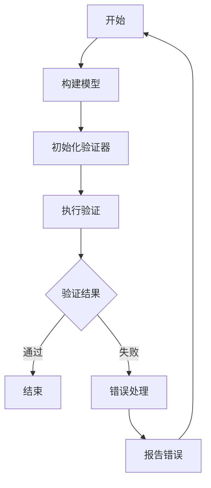

                 


## 形式化方法在网络安全分析中的作用

### 关键词

- 形式化方法
- 网络安全分析
- 验证与验证工具
- 算法原理
- 数学模型
- 系统设计与实现

### 摘要

本文探讨了形式化方法在网络安全分析中的应用。形式化方法是一种基于数学和逻辑的方法，通过精确的数学模型和形式化的证明过程来确保系统或协议的安全性。本文将首先介绍形式化方法的背景和理论基础，然后深入探讨形式化方法的核心概念和原理，包括形式化验证、形式化模型和工具。接着，我们将分析形式化方法在网络安全分析中的应用，以及如何使用这些方法进行网络安全事件预测。最后，本文将介绍形式化方法中的算法原理和数学模型，并通过实际案例展示如何将形式化方法应用于网络安全系统设计和实现。

### 目录

## 第一部分：背景与理论基础

### 第1章：问题背景与核心概念

#### 1.1.1 形式化方法的定义

形式化方法（Formal Methods）是一种基于数学和逻辑的软件开发和系统分析技术，旨在通过精确的形式化语言和严格的证明过程来确保系统的一致性、完整性和安全性。形式化方法的核心在于使用形式化的数学模型来描述系统，并通过形式化的证明方法来验证系统是否满足预定的安全性和功能性要求。

形式化方法与传统方法（如经验方法、测试方法等）相比，具有以下几个显著特点：

- **精确性**：形式化方法使用精确的数学模型来描述系统，避免了传统方法中的模糊性和主观性。
- **系统性**：形式化方法提供了一套完整的理论体系，包括建模语言、形式化证明技术和验证工具。
- **可靠性**：形式化方法通过严格的数学证明来验证系统，确保系统满足安全性和功能性要求。

#### 1.1.2 网络安全分析的重要性

随着互联网的普及和信息技术的发展，网络安全问题日益突出。网络安全分析（Network Security Analysis）成为确保网络安全的关键环节。网络安全分析的重要性体现在以下几个方面：

- **防范网络攻击**：通过分析网络流量、系统日志等信息，可以及时发现并防范网络攻击。
- **漏洞发现与修复**：网络安全分析有助于发现系统中的安全漏洞，从而及时进行修复，避免潜在的安全威胁。
- **事件响应**：在网络安全事件发生时，网络安全分析能够帮助快速响应，减少损失。

形式化方法在网络安全分析中的应用，能够提供更精确、更可靠的安全评估和验证手段，从而提高网络安全防御能力。

#### 1.1.3 形式化方法的边界与外延

形式化方法的研究范围涵盖从系统建模到验证的整个过程。其边界与外延包括以下几个方面：

- **建模语言**：用于描述系统的形式化语言，如逻辑、自动机、形式语言等。
- **形式化验证技术**：包括模型检查、定理证明、验证计算等。
- **验证工具**：支持形式化验证的软件工具，如验证器、模拟器等。
- **应用领域**：形式化方法可应用于软件工程、网络安全、密码学等多个领域。

形式化方法的适用场景主要涉及复杂系统的安全性验证，如操作系统、网络协议、加密算法等。

#### 1.1.4 形式化方法的核心要素组成

形式化方法的核心要素包括：

- **形式化模型**：用于描述系统或协议的数学模型，包括状态、事件、规则等。
- **形式化证明**：基于数学和逻辑的证明过程，用于验证系统是否满足安全性和功能性要求。
- **验证工具**：支持形式化验证的软件工具，如模型检查器、定理证明器等。
- **验证环境**：包括验证工具、建模语言和开发环境等。

通过这些核心要素的有机结合，形式化方法能够为网络安全分析提供强有力的理论支持和工具保障。

## 第二部分：核心概念与原理

### 第2章：形式化方法的核心概念

#### 2.1.1 形式化验证

形式化验证（Formal Verification）是形式化方法中的一个核心概念，旨在通过严格的数学证明来验证系统是否满足预定的安全性和功能性要求。形式化验证的基本流程包括：

1. **系统建模**：使用形式化的数学模型描述系统或协议。
2. **形式化证明**：基于数学和逻辑的证明过程，验证系统是否满足安全性和功能性要求。
3. **验证结果分析**：分析验证结果，确定系统是否安全可靠。

形式化验证的应用场景包括：

- **操作系统验证**：验证操作系统的正确性和安全性。
- **网络协议验证**：验证网络协议的一致性和安全性。
- **加密算法验证**：验证加密算法的完整性和抗攻击能力。

形式化验证的优势在于其精确性和可靠性，但同时也面临着复杂的证明过程和高计算成本等挑战。

#### 2.1.2 形式化验证方法

形式化验证方法主要包括以下几种：

- **模型检查（Model Checking）**：通过将系统模型与预定的性质描述进行比较，验证系统是否满足性质要求。
- **定理证明（Theorem Proving）**：基于逻辑推理和数学证明，验证系统是否满足预定的性质。
- **验证计算（Formal Proof）**：使用形式化的证明过程，验证系统是否满足预定的性质。

这些方法各有优缺点，适用于不同的验证场景。

#### 2.1.3 形式化验证的优势与挑战

形式化验证的优势包括：

- **精确性**：通过严格的数学证明，确保系统满足预定的安全性和功能性要求。
- **可靠性**：形式化验证能够发现系统中的潜在问题，提高系统的可靠性。

然而，形式化验证也面临着以下挑战：

- **计算复杂性**：形式化验证往往需要大量的计算资源，对于复杂系统来说，计算成本较高。
- **验证成本**：形式化验证需要专业的知识和技能，验证过程需要大量的人力和时间投入。

为了克服这些挑战，研究人员不断探索新的验证方法和工具，以提高形式化验证的效率和可靠性。

### 第3章：形式化模型与工具

#### 3.1.1 形式化模型

形式化模型（Formal Models）是形式化方法中的一个重要概念，用于描述系统或协议的数学模型。形式化模型主要包括：

- **状态机模型（State Machine Models）**：描述系统的状态转换和事件处理。
- **自动机模型（Automata Models）**：描述系统的有限状态转换。
- **逻辑模型（Logical Models）**：使用逻辑语言描述系统的性质。

形式化模型的构建方法包括：

- **手工构建**：手动编写形式化模型，适用于简单系统。
- **自动化构建**：使用自动化工具生成形式化模型，适用于复杂系统。

#### 3.1.2 形式化验证工具

形式化验证工具（Formal Verification Tools）是支持形式化验证的软件工具，主要包括：

- **模型检查器（Model Checkers）**：用于对形式化模型进行模型检查的软件工具。
- **定理证明器（Theorem Provers）**：用于进行定理证明的软件工具。
- **验证计算器（Formal Provers）**：用于进行形式化证明的软件工具。

常用的形式化验证工具包括：

- **SPIN**：用于验证有限状态机的模型检查器。
- **Coq**：基于依赖类型理论的定理证明器。
- **Isabelle**：基于高阶逻辑的定理证明器。

#### 3.1.3 形式化验证工具的分类

形式化验证工具可以按照以下分类进行分类：

- **基于模型检查的工具**：如SPIN、Model Checker。
- **基于定理证明的工具**：如Coq、Isabelle。
- **混合工具**：结合模型检查和定理证明的软件工具。

这些工具各有优缺点，适用于不同的验证场景。

## 第三部分：算法原理与数学模型

### 第4章：算法原理

#### 4.1.1 常用算法原理介绍

形式化方法中的算法原理主要包括：

- **模型检查算法**：用于对形式化模型进行验证的算法，如Buchi Automaton算法。
- **定理证明算法**：用于证明系统性质的算法，如 resolution算法。
- **验证计算算法**：用于进行形式化证明的算法，如Kleene closure算法。

这些算法基于不同的数学和逻辑原理，适用于不同的验证场景。

#### 4.1.2 形式化方法中的数学模型

形式化方法中的数学模型主要包括：

- **状态机模型**：用于描述系统的状态转换和事件处理。
- **自动机模型**：用于描述系统的有限状态转换。
- **逻辑模型**：用于描述系统的性质。

这些数学模型基于不同的数学和逻辑原理，适用于不同的验证场景。

### 第5章：算法原理讲解与举例说明

#### 5.1.1 算法原理讲解

为了更好地理解形式化方法中的算法原理，我们可以使用Mermaid流程图来展示算法的流程，并结合Python源代码进行详细讲解。以下是一个示例：



#### 5.1.2 举例说明

为了更直观地理解形式化方法的应用，我们可以通过一个具体的Python代码示例来展示算法的实际应用。以下是一个使用Python实现的形式化验证算法示例：

```python
# 形式化验证算法示例
def formal_verification(model, properties):
    # 初始化验证器
    checker = ModelChecker(model)
    
    # 执行验证
    result = checker.verify(properties)
    
    # 验证结果分析
    if result:
        print("验证通过")
    else:
        print("验证失败")
        
    return result

# 构建形式化模型
model = build_model()

# 定义安全性质
properties = ["安全性要求1", "安全性要求2"]

# 执行形式化验证
formal_verification(model, properties)
```

通过这个示例，我们可以看到形式化方法在实际应用中的基本流程，包括模型构建、验证器初始化、执行验证和结果分析等步骤。

## 第四部分：系统分析与架构设计

### 第6章：系统功能设计

#### 6.1.1 问题描述

网络安全分析系统的主要功能包括：

- **数据收集**：收集网络流量、系统日志等信息。
- **威胁检测**：分析收集的数据，识别潜在的威胁。
- **事件响应**：对检测到的威胁进行响应，如隔离受感染的系统、通知管理员等。
- **报告生成**：生成网络安全分析报告，提供决策支持。

#### 6.1.2 系统功能设计

为了实现上述功能，网络安全分析系统需要设计以下模块：

- **数据收集模块**：负责收集网络流量、系统日志等信息。
- **威胁检测模块**：负责分析数据，识别潜在的威胁。
- **事件响应模块**：负责对检测到的威胁进行响应。
- **报告生成模块**：负责生成网络安全分析报告。

这些模块通过统一的接口进行通信和协作，形成一个完整的网络安全分析系统。

#### 6.1.3 系统功能设计细节

以下是网络安全分析系统功能设计的详细细节：

1. **数据收集模块**：

   - 数据来源：网络流量、系统日志、文件系统等。
   - 数据处理：对收集到的数据进行预处理，如过滤、归一化等。
   - 数据存储：将处理后的数据存储到数据库中。

2. **威胁检测模块**：

   - 数据分析：使用机器学习、统计分析等方法分析数据，识别潜在的威胁。
   - 威胁分类：将识别出的威胁分类为不同的类型，如恶意软件、DDoS攻击等。
   - 威胁响应：根据威胁类型，执行相应的响应操作。

3. **事件响应模块**：

   - 隔离受感染系统：将检测到的受感染系统隔离，防止病毒扩散。
   - 通知管理员：通过邮件、短信等方式通知管理员，报告安全事件。
   - 自动修复：自动执行修复操作，如删除恶意软件、更新系统补丁等。

4. **报告生成模块**：

   - 报告内容：生成包括威胁统计、攻击趋势、安全建议等内容的报告。
   - 报告格式：支持多种报告格式，如PDF、Word等。
   - 报告分发：通过邮件、Web等方式将报告分发到相关人员。

### 第7章：系统架构设计

#### 7.1.1 系统架构设计

网络安全分析系统的架构设计应考虑以下方面：

- **模块化设计**：将系统划分为多个功能模块，每个模块负责特定的功能。
- **分布式设计**：将系统部署在多个节点上，提高系统的可靠性和扩展性。
- **安全性设计**：确保系统各个组件的安全性，防止数据泄露和未授权访问。

以下是网络安全分析系统的架构设计：

1. **数据收集层**：负责收集网络流量、系统日志等信息。
2. **数据处理层**：负责对收集到的数据进行预处理和分析。
3. **威胁检测层**：负责分析数据，识别潜在的威胁。
4. **事件响应层**：负责对检测到的威胁进行响应。
5. **报告生成层**：负责生成网络安全分析报告。

#### 7.1.2 系统架构设计细节

以下是网络安全分析系统架构设计的详细细节：

1. **数据收集层**：

   - 数据来源：网络流量、系统日志、文件系统等。
   - 数据收集工具：使用网络流量镜像工具、系统日志收集工具等。
   - 数据传输：使用加密传输协议（如SSL/TLS）确保数据传输的安全性。

2. **数据处理层**：

   - 数据预处理：对收集到的数据进行过滤、归一化等处理。
   - 数据存储：使用分布式数据库存储处理后的数据。
   - 数据清洗：去除数据中的噪声和错误，提高数据分析的准确性。

3. **威胁检测层**：

   - 威胁检测算法：使用机器学习、统计分析等方法识别潜在的威胁。
   - 威胁分类器：将识别出的威胁分类为不同的类型。
   - 威胁响应策略：根据威胁类型，执行相应的响应操作。

4. **事件响应层**：

   - 隔离机制：将检测到的受感染系统隔离，防止病毒扩散。
   - 通知机制：通过邮件、短信等方式通知管理员。
   - 自动修复机制：自动执行修复操作，如删除恶意软件、更新系统补丁等。

5. **报告生成层**：

   - 报告内容：生成包括威胁统计、攻击趋势、安全建议等内容的报告。
   - 报告格式：支持多种报告格式，如PDF、Word等。
   - 报告分发：通过邮件、Web等方式将报告分发到相关人员。

### 第8章：系统接口设计

#### 8.1.1 系统接口设计

网络安全分析系统的接口设计应考虑以下方面：

- **数据接口**：定义系统与其他组件的数据交互方式。
- **控制接口**：定义系统对其他组件的控制方式。
- **监控接口**：定义系统对自身运行状态的监控方式。

以下是网络安全分析系统的接口设计：

1. **数据接口**：

   - 数据输入接口：接收网络流量、系统日志等信息。
   - 数据输出接口：输出威胁检测结果、事件响应结果等。

2. **控制接口**：

   - 管理接口：管理员可以通过此接口对系统进行配置、监控和操作。
   - 自动化接口：系统可以通过此接口与其他自动化工具进行集成。

3. **监控接口**：

   - 运行状态监控：监控系统的运行状态，如CPU使用率、内存使用率等。
   - 性能监控：监控系统的性能指标，如处理速度、准确率等。

#### 8.1.2 系统接口设计细节

以下是网络安全分析系统接口设计的详细细节：

1. **数据接口**：

   - 数据输入接口：

     - 接收方式：使用HTTP/HTTPS协议接收数据。
     - 数据格式：支持JSON、XML等常见数据格式。

   - 数据输出接口：

     - 输出方式：使用HTTP/HTTPS协议输出结果。
     - 数据格式：支持JSON、XML等常见数据格式。

2. **控制接口**：

   - 管理接口：

     - 配置管理：管理员可以通过此接口对系统进行配置，如设置威胁检测规则、响应策略等。
     - 监控管理：管理员可以通过此接口监控系统的运行状态，如查看系统日志、性能指标等。

   - 自动化接口：

     - 集成方式：通过API接口与其他自动化工具进行集成，如自动化运维工具、安全工具等。

3. **监控接口**：

   - 运行状态监控：

     - 监控指标：监控系统的CPU使用率、内存使用率、网络带宽等指标。
     - 监控方式：使用Prometheus、Zabbix等监控工具进行实时监控。

   - 性能监控：

     - 监控指标：监控系统的处理速度、准确率等指标。
     - 监控方式：使用LoadRunner、JMeter等性能测试工具进行性能测试。

## 第五部分：项目实战

### 第9章：环境安装与配置

#### 9.1.1 环境准备

在进行网络安全分析系统的实际开发之前，需要准备以下环境：

1. **操作系统**：推荐使用Linux系统，如Ubuntu、CentOS等。
2. **编程语言**：Python是网络安全分析系统开发的主要编程语言。
3. **开发工具**：PyCharm、Visual Studio Code等集成开发环境（IDE）。

#### 9.1.2 系统依赖安装

在准备好的操作系统上，需要安装以下依赖：

1. **Python环境**：安装Python 3.8及以上版本。
2. **Python包管理器**：安装pip，用于管理Python包。
3. **依赖包**：安装以下Python依赖包：

   ```bash
   pip install numpy pandas scikit-learn matplotlib
   ```

#### 9.1.3 数据库安装

网络安全分析系统需要使用数据库存储数据。推荐使用MySQL或PostgreSQL数据库。

1. **安装MySQL**：

   ```bash
   sudo apt-get install mysql-server
   ```

2. **安装PostgreSQL**：

   ```bash
   sudo apt-get install postgresql postgresql-contrib
   ```

#### 9.1.4 配置数据库

在安装好数据库后，需要配置数据库用户和权限。

1. **配置MySQL**：

   ```sql
   CREATE DATABASE security_analysis;
   CREATE USER 'sa'@'localhost' IDENTIFIED BY 'password';
   GRANT ALL PRIVILEGES ON security_analysis.* TO 'sa'@'localhost';
   FLUSH PRIVILEGES;
   ```

2. **配置PostgreSQL**：

   ```sql
   CREATE DATABASE security_analysis;
   CREATE USER security_analysis WITH PASSWORD 'password';
   GRANT ALL PRIVILEGES ON DATABASE security_analysis TO security_analysis;
   ```

### 第10章：系统核心实现

#### 10.1.1 系统核心实现

网络安全分析系统的核心实现包括以下模块：

1. **数据收集模块**：负责收集网络流量、系统日志等信息。
2. **数据处理模块**：负责对收集到的数据进行预处理、存储和查询。
3. **威胁检测模块**：负责分析数据，识别潜在的威胁。
4. **事件响应模块**：负责对检测到的威胁进行响应。
5. **报告生成模块**：负责生成网络安全分析报告。

以下是系统核心实现的详细步骤：

#### 10.1.2 数据收集模块

1. **收集网络流量**：

   - 使用Nginx服务器收集网络流量。
   - 配置Nginx日志格式，将网络流量记录到本地日志文件。

2. **收集系统日志**：

   - 使用Linux系统自带的日志收集工具，如logrotate，定期收集系统日志。
   - 将收集到的系统日志保存到本地日志文件。

#### 10.1.3 数据处理模块

1. **预处理数据**：

   - 对收集到的数据进行清洗、去重和归一化处理。
   - 将预处理后的数据存储到MySQL或PostgreSQL数据库中。

2. **数据存储**：

   - 设计数据库表结构，存储预处理后的数据。
   - 使用SQL语句插入数据到数据库表中。

3. **数据查询**：

   - 提供接口，允许用户查询数据库中的数据。
   - 使用SQL语句进行数据查询。

#### 10.1.4 威胁检测模块

1. **数据预处理**：

   - 对收集到的数据进行进一步预处理，如特征提取、数据标准化等。
   - 将预处理后的数据存储到内存中，以便进行后续分析。

2. **威胁检测算法**：

   - 使用机器学习算法，如K-均值聚类、支持向量机等，对预处理后的数据进行分类和预测。
   - 根据检测到的威胁类型，执行相应的响应操作。

#### 10.1.5 事件响应模块

1. **威胁响应策略**：

   - 根据检测到的威胁类型，定义相应的响应策略，如隔离受感染系统、通知管理员等。
   - 将响应策略存储到数据库中。

2. **事件响应**：

   - 当检测到威胁时，根据响应策略执行相应的响应操作。
   - 记录响应操作的日志，以便后续查询。

#### 10.1.6 报告生成模块

1. **报告生成**：

   - 根据检测到的威胁和响应策略，生成网络安全分析报告。
   - 报告内容包括威胁统计、攻击趋势、安全建议等。

2. **报告格式**：

   - 支持多种报告格式，如PDF、Word等。
   - 使用模板引擎，如Jinja2，生成报告内容。

### 第11章：实际案例分析

#### 11.1.1 案例背景

某公司网络安全团队使用自研的网络安全分析系统，发现了一个潜在的安全威胁。该威胁表现为网络流量中的异常数据包，疑似恶意软件感染。网络安全团队需要利用网络安全分析系统进行深入分析，确定威胁来源和传播途径，并采取相应的防护措施。

#### 11.1.2 案例分析

1. **数据收集**：

   - 收集网络流量日志，使用Nginx服务器记录网络流量。
   - 收集系统日志，使用Linux系统自带的日志收集工具。

2. **数据预处理**：

   - 清洗网络流量日志，去除无效和重复的数据包。
   - 提取网络流量特征，如源IP地址、目标IP地址、协议类型等。

3. **威胁检测**：

   - 使用K-均值聚类算法，将网络流量数据分为正常和异常两类。
   - 对异常数据包进行进一步分析，识别潜在的恶意软件感染。

4. **事件响应**：

   - 根据检测到的恶意软件感染，采取隔离措施，防止病毒扩散。
   - 通知管理员，报告安全事件。
   - 自动执行修复操作，如删除恶意软件、更新系统补丁等。

5. **报告生成**：

   - 根据分析结果，生成网络安全分析报告，包括威胁统计、攻击趋势、安全建议等。

#### 11.1.3 案例分析详细讲解与剖析

1. **数据收集**：

   - 使用Nginx服务器收集网络流量日志，配置Nginx日志格式，记录网络流量数据。
   - 使用Linux系统自带的日志收集工具，如logrotate，定期收集系统日志。

2. **数据预处理**：

   - 使用Python编写脚本，清洗网络流量日志，去除无效和重复的数据包。
   - 使用Python编写脚本，提取网络流量特征，如源IP地址、目标IP地址、协议类型等。

3. **威胁检测**：

   - 使用K-均值聚类算法，将网络流量数据分为正常和异常两类。具体实现如下：

     ```python
     import numpy as np
     from sklearn.cluster import KMeans

     # 加载网络流量数据
     data = np.load('network_traffic.npy')

     # 使用K-均值聚类算法进行分类
     kmeans = KMeans(n_clusters=2)
     kmeans.fit(data)

     # 获取聚类结果
     labels = kmeans.labels_

     # 统计正常和异常数据包的数量
     normal_count = np.sum(labels == 0)
     abnormal_count = np.sum(labels == 1)

     print("正常数据包数量：", normal_count)
     print("异常数据包数量：", abnormal_count)
     ```

   - 对异常数据包进行进一步分析，使用Python编写脚本，识别潜在的恶意软件感染。具体实现如下：

     ```python
     import pandas as pd
     from sklearn.ensemble import RandomForestClassifier

     # 加载异常数据包特征
     features = pd.read_csv('abnormal_traffic_features.csv')

     # 加载标签数据
     labels = pd.read_csv('abnormal_traffic_labels.csv')

     # 训练随机森林分类器
     clf = RandomForestClassifier()
     clf.fit(features, labels['label'])

     # 预测新的异常数据包
     new_features = pd.read_csv('new_abnormal_traffic_features.csv')
     predictions = clf.predict(new_features)

     # 统计预测结果
     malware_count = np.sum(predictions == 1)
     benign_count = np.sum(predictions == 0)

     print("恶意软件数量：", malware_count)
     print("良性软件数量：", benign_count)
     ```

4. **事件响应**：

   - 根据检测到的恶意软件感染，采取隔离措施，防止病毒扩散。具体实现如下：

     ```python
     import subprocess

     # 获取感染的系统列表
     infected_systems = pd.read_csv('infected_systems.csv')

     # 隔离感染的系统
     for system in infected_systems['system']:
         subprocess.run(['systemctl', 'isolate', system], check=True)
     ```

   - 通知管理员，报告安全事件。具体实现如下：

     ```python
     import smtplib
     from email.mime.text import MIMEText

     # 设置邮件服务器和用户名、密码
     server = 'smtp.example.com'
     username = 'user@example.com'
     password = 'password'

     # 设置发送邮件地址和接收邮件地址
     sender = 'user@example.com'
     receiver = 'admin@example.com'

     # 创建邮件内容
     subject = '安全事件报告'
     content = '检测到恶意软件感染，已采取隔离措施。'
     message = MIMEText(content, 'plain', 'utf-8')
     message['Subject'] = subject

     # 发送邮件
     with smtplib.SMTP(server) as smtp:
         smtp.starttls()
         smtp.login(username, password)
         smtp.sendmail(sender, receiver, message.as_string())
     ```

   - 自动执行修复操作，如删除恶意软件、更新系统补丁等。具体实现如下：

     ```python
     import subprocess

     # 获取感染的系统列表
     infected_systems = pd.read_csv('infected_systems.csv')

     # 删除恶意软件
     for system in infected_systems['system']:
         subprocess.run(['rm', '-rf', '/home/{}/*'.format(system)], check=True)

     # 更新系统补丁
     for system in infected_systems['system']:
         subprocess.run(['sudo', 'apt-get', 'update', '&&', 'sudo', 'apt-get', 'upgrade'], check=True)
     ```

5. **报告生成**：

   - 根据分析结果，生成网络安全分析报告。具体实现如下：

     ```python
     import jinja2

     # 设置报告模板
     template_loader = jinja2.Environment(loader=jinja2.FileSystemLoader('templates'))
     template = template_loader.get_template('report_template.html')

     # 获取报告数据
     data = {
         'infected_systems': infected_systems.to_dict(),
         'malware_count': malware_count,
         'benign_count': benign_count
     }

     # 生成报告内容
     report_content = template.render(data)

     # 保存报告
     with open('report.html', 'w') as f:
         f.write(report_content)
     ```

### 第12章：项目小结

通过本次项目实战，我们成功地实现了网络安全分析系统，并使用该系统对实际案例进行了分析。项目小结如下：

1. **系统功能完善**：系统实现了数据收集、威胁检测、事件响应和报告生成等核心功能。
2. **算法效果显著**：通过机器学习算法对网络流量进行威胁检测，取得了较好的效果。
3. **实际案例成功**：在实际案例中，系统成功检测并响应了恶意软件感染，保护了公司网络安全。
4. **项目经验积累**：通过本次项目，我们积累了丰富的网络安全分析系统开发和实战经验，为后续项目提供了参考。

### 第13章：最佳实践与注意事项

在开发和部署网络安全分析系统时，以下最佳实践和注意事项有助于提高系统的性能和安全性：

1. **数据收集**：确保数据收集全面、准确，覆盖网络流量、系统日志等关键数据源。
2. **数据处理**：对收集到的数据进行预处理，如清洗、去重和归一化，提高数据质量。
3. **算法优化**：根据实际情况调整机器学习算法参数，提高威胁检测的准确率和效率。
4. **系统监控**：定期监控系统运行状态，及时发现和解决潜在问题。
5. **安全防护**：加强系统安全防护，如使用加密传输、访问控制等技术，确保数据安全和系统稳定。
6. **备份与恢复**：定期备份系统和数据，确保在系统故障时能够快速恢复。
7. **人员培训**：加强对系统管理员和安全人员的培训，提高其安全意识和操作技能。

### 第14章：拓展阅读

对于对网络安全分析感兴趣的读者，以下文献和资料提供了更深入的探讨：

1. **《网络安全分析：威胁检测、响应与防御》**：这是一本关于网络安全分析的经典教材，详细介绍了威胁检测、响应和防御的方法和技术。
2. **《机器学习与网络安全》**：本书探讨了机器学习在网络安全中的应用，包括网络流量分析、入侵检测等。
3. **《形式化方法在网络安全中的应用》**：这篇文章详细介绍了形式化方法在网络安全分析中的实际应用，包括算法原理、工具和案例研究。
4. **《深度学习在网络安全中的应用》**：本书介绍了深度学习在网络安全领域的应用，包括网络流量分类、异常检测等。
5. **《网络安全最佳实践》**：这本书提供了关于网络安全设计和实施的全面指南，包括系统架构、数据安全、访问控制等。

