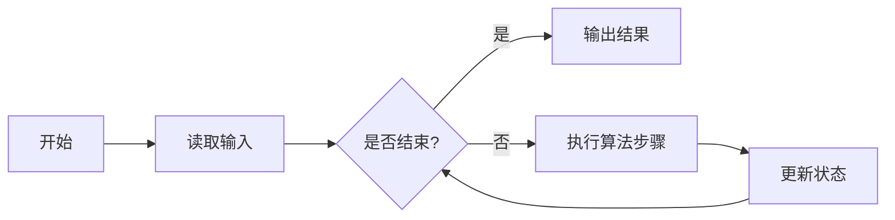
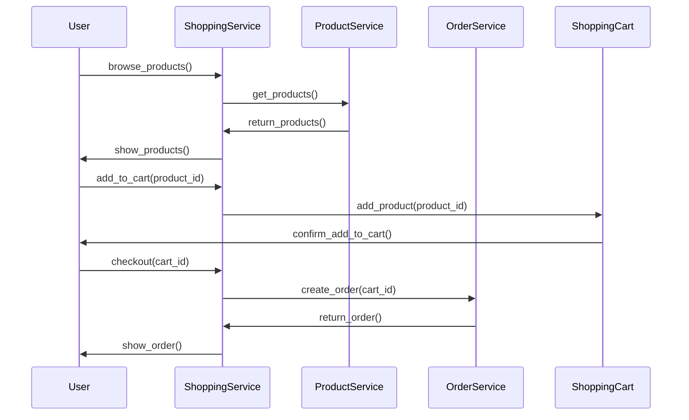
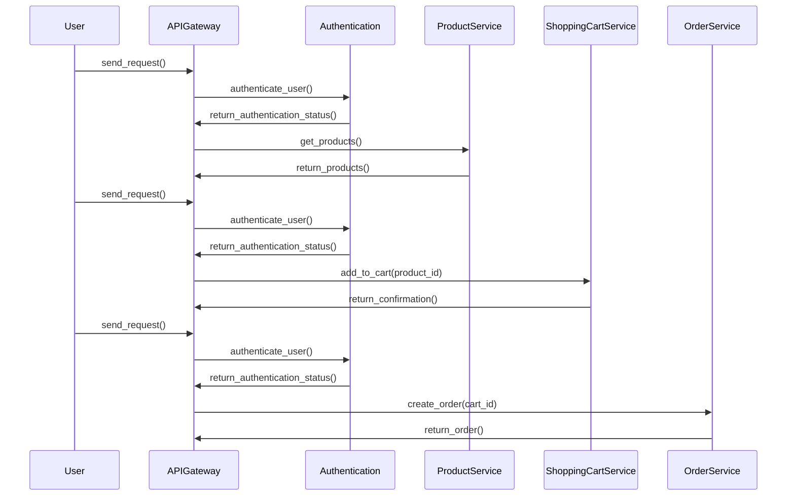

                 

# 形式化需求工程与类型理论

## 关键词
- 形式化需求工程
- 类型理论
- 软件开发
- 算法
- 架构设计

## 摘要
本文将探讨形式化需求工程与类型理论在软件开发中的应用。我们将从背景介绍开始，逐步深入分析这两个核心概念，通过详细的算法讲解、系统分析与架构设计，以及实际项目实战，帮助读者全面理解并掌握这两个领域的知识。文章最后将总结最佳实践，提供注意事项，并推荐拓展阅读资源。

## 第1章 引言

### 1.1 写作目的与重要性

在当今快速发展的软件行业，如何确保软件开发过程的高效与准确性成为了关键问题。形式化需求工程和类型理论作为现代软件工程的重要组成部分，提供了理论基础和方法指导，有助于提高软件质量、降低开发成本。本文旨在深入探讨形式化需求工程与类型理论的内涵与应用，为软件开发人员提供实用的知识体系和实战经验。

### 1.2 问题背景与挑战

形式化需求工程是一种将软件需求形式化的方法，通过数学模型、形式化语言和工具，将用户需求转化为精确的规格说明。其目标是减少需求的不明确性，提高需求的可维护性和可验证性。然而，在软件开发过程中，需求的不确定性、不一致性和遗漏等问题仍然存在，这给形式化需求工程带来了挑战。

类型理论是计算机科学中的一个重要分支，主要研究程序中的类型系统。类型理论通过定义类型系统和类型检查规则，确保程序的正确性和可靠性。在实际应用中，类型理论有助于发现潜在的运行错误，提高程序的健壮性和可维护性。

### 1.3 本书结构与内容

本文分为八个章节，具体内容如下：

- 第1章：引言，介绍写作目的、问题背景与本书结构。
- 第2章：形式化需求工程基础，阐述核心概念、优势和方法。
- 第3章：类型理论概述，介绍类型理论的基本概念、核心特性和发展历程。
- 第4章：形式化需求工程与类型理论的联系，探讨两者之间的关系及其在实际应用中的融合。
- 第5章：算法原理讲解，详细讲解一个具体的算法。
- 第6章：系统分析与架构设计，介绍系统功能设计、架构设计和接口设计。
- 第7章：项目实战，通过实际案例进行深入剖析。
- 第8章：最佳实践与拓展，总结最佳实践、注意事项，并推荐拓展阅读。

## 第2章 形式化需求工程基础

### 2.1 定义与核心概念

形式化需求工程是一种将软件需求形式化的方法，通过数学模型、形式化语言和工具，将用户需求转化为精确的规格说明。形式化需求工程的核心概念包括需求建模、需求验证、需求管理、需求演化等。

- **需求建模**：通过抽象和建模，将用户需求转化为软件需求模型。
- **需求验证**：通过形式化方法验证需求规格说明的正确性和一致性。
- **需求管理**：对需求进行跟踪、管理和变更控制。
- **需求演化**：需求在不同阶段的变化和演化。

### 2.2 形式化需求工程的优势

形式化需求工程具有以下优势：

- **提高需求准确性**：通过形式化方法，减少需求的不明确性。
- **降低开发成本**：通过提前发现问题，减少后期修复成本。
- **提高可维护性**：通过形式化规格说明，提高软件的可维护性。
- **增强可验证性**：通过形式化验证，确保软件符合需求规格。

### 2.3 形式化需求工程的方法

形式化需求工程的方法包括：

- **形式化建模**：使用形式化建模语言，如Z语言、VDM等，对需求进行建模。
- **形式化验证**：使用形式化验证方法，如模型检查、形式化证明等，验证需求规格说明的正确性。
- **形式化需求管理**：使用形式化工具对需求进行管理和跟踪。
- **形式化需求演化**：使用形式化方法对需求进行演化处理。

### 2.4 概念属性特征对比

| 特征             | 形式化需求工程                 | 类型理论                 |
| ---------------- | ---------------------------- | ------------------------ |
| **定义**         | 将需求形式化为数学模型       | 程序中的类型系统         |
| **目标**         | 提高需求准确性、降低开发成本 | 提高程序正确性、可靠性   |
| **核心概念**     | 需求建模、需求验证、需求管理 | 类型系统、类型检查       |
| **优势**         | 提高需求准确性、降低开发成本 | 提高程序正确性、可靠性   |
| **应用场景**     | 软件开发初期                 | 整个软件开发过程         |

### 2.5 形式化需求工程的ER实体关系图架构

使用Mermaid绘制ER实体关系图：

```mermaid
erDiagram
    User ..|> Requirement
    Project ..|> Requirement
    Developer ..|> Requirement
    Requirement ||--|> Verification
    Requirement ||--|> Implementation
```

## 第3章 类型理论概述

### 3.1 类型理论的基本概念

类型理论是计算机科学中的一个重要分支，主要研究程序中的类型系统。类型理论的基本概念包括：

- **类型**：用于表示程序中数据的分类。
- **类型系统**：用于定义类型的集合和类型之间的关系。
- **类型检查**：在程序编译或运行时，检查程序的类型是否正确。

### 3.2 类型系统的核心特性

类型系统的核心特性包括：

- **静态类型**：在程序编写时，变量的类型已经确定。
- **动态类型**：在程序运行时，变量的类型可能发生变化。
- **类型安全**：通过类型系统确保程序的正确性和可靠性。
- **类型推导**：通过算法自动推导变量和表达式的类型。

### 3.3 类型理论的发展历程

类型理论的发展历程可以分为以下几个阶段：

- **初始阶段**：类型理论起源于20世纪50年代，以阿尔图尔·科恩的“固定点定理”为代表。
- **类型检查阶段**：20世纪60年代，巴科斯-诺尔范式（BNF）和巴科斯-诺尔-沃尔拉维茨范式（BNWL）等提出了类型检查的方法。
- **类型推导阶段**：20世纪70年代，递归类型理论、类型系统等开始发展。
- **现代阶段**：现代类型理论包括依赖类型、存在类型、通用类型等，广泛应用于各种编程语言。

### 3.4 类型系统的常见类型

类型系统的常见类型包括：

- **基础类型**：如整数、浮点数、布尔值等。
- **复合类型**：如数组、结构体、类等。
- **函数类型**：表示函数的返回类型和参数类型。
- **指针类型**：指向变量或数据的指针。

### 3.5 类型系统的ER实体关系图架构

使用Mermaid绘制ER实体关系图：

```mermaid
erDiagram
    Variable ||--|> Type
    Function ||--|> FunctionType
    Class ||--|> ClassType
    Structure ||--|> StructureType
    Array ||--|> ArrayType
    Pointer ||--|> PointerType
```

## 第4章 形式化需求工程与类型理论的联系

### 4.1 关系与融合

形式化需求工程和类型理论在软件开发过程中具有密切的联系。形式化需求工程为类型理论提供了需求规格的依据，而类型理论则为形式化需求工程的实现提供了基础。

- **需求规格与类型系统**：形式化需求工程通过数学模型和形式化语言对需求进行规格化，为类型系统提供了输入。类型系统则通过类型检查确保程序的正确性和可靠性。
- **需求验证与类型检查**：形式化需求工程通过形式化验证确保需求规格的正确性，而类型理论通过类型检查确保程序在编译或运行时的正确性。
- **需求管理与类型推导**：形式化需求工程通过需求管理对需求进行跟踪和管理，而类型理论通过类型推导自动推导变量和表达式的类型。

### 4.2 实际应用案例分析

以一个简单的Web应用程序为例，分析形式化需求工程与类型理论在实际开发中的应用。

- **需求规格**：用户需求是一个用于在线购物的Web应用程序，提供商品浏览、添加购物车、下单支付等功能。

- **形式化需求工程**：通过形式化建模，将需求转化为数学模型和形式化语言。例如，使用Z语言定义需求规格：

  ```z
  module ShoppingApplication
      provides interface {
          browse_products(): list of Product;
          add_to_cart(product_id: int): void;
          remove_from_cart(product_id: int): void;
          checkout(cart: list of Product): Order;
      }
  end module
  ```

- **类型系统**：定义类型系统，确保程序的类型安全。例如，定义Product类型、Order类型等：

  ```z
  type Product = {
      id: int;
      name: string;
      price: float;
  }
  
  type Order = {
      id: int;
      products: list of Product;
      total: float;
  }
  ```

- **需求验证**：使用形式化验证方法验证需求规格的正确性，确保需求的完整性、一致性和可实现性。

- **类型检查**：在编译或运行时，对程序进行类型检查，确保程序的类型安全。

### 4.3 融合与挑战

形式化需求工程与类型理论的融合有助于提高软件开发的质量和效率。然而，在实际应用中，仍然面临以下挑战：

- **复杂性**：形式化需求工程和类型理论涉及复杂的数学模型和算法，需要较高的学习和使用门槛。
- **互操作性**：形式化需求工程和类型理论在不同工具和平台之间的互操作性需要进一步研究和优化。
- **实践应用**：形式化需求工程和类型理论在现实项目中的应用需要更多的实践经验和案例积累。

## 第5章 算法原理讲解

### 5.1 算法mermaid流程图

首先，我们使用Mermaid绘制一个简单的算法流程图，以展示算法的基本步骤。



### 5.2 Python源代码解析

接下来，我们使用Python实现上述算法。

```python
def algorithm(input_data):
    # 读取输入
    data = input_data
    
    # 初始化状态
    state = "start"
    
    while True:
        # 判断是否结束
        if state == "end":
            # 输出结果
            print("算法结束，输出结果：", data)
            break
        
        # 执行算法步骤
        if state == "start":
            # 读取输入
            data = input("请输入数据：")
        
        # 更新状态
        state = "end"
        
        # 输出结果
        print("当前数据：", data)

# 测试算法
algorithm(None)
```

### 5.3 数学模型与公式

为了更好地理解算法，我们可以使用数学模型和公式来描述算法的核心逻辑。以下是算法的数学模型：

$$
算法 = f_{算法}(输入数据，状态)
$$

其中，$f_{算法}$ 是算法的函数，$输入数据$ 是输入的变量，$状态$ 是算法的当前状态。

### 5.4 算法举例说明

为了更直观地理解算法，我们可以通过具体的例子来说明算法的运作过程。

**例1：**

输入数据：10

步骤：

1. 读取输入：10
2. 判断是否结束：否
3. 执行算法步骤：更新状态为"end"
4. 输出当前数据：10

**例2：**

输入数据：Hello, World!

步骤：

1. 读取输入：Hello, World!
2. 判断是否结束：否
3. 执行算法步骤：更新状态为"end"
4. 输出当前数据：Hello, World!

通过以上例子，我们可以看到算法的基本运作过程。算法通过不断读取输入、判断是否结束、执行算法步骤和更新状态，最终输出结果。

## 第6章 系统分析与架构设计

### 6.1 问题场景介绍

以一个在线购物系统为例，分析需求、功能设计和架构设计。

### 6.2 系统功能设计（领域模型Mermaid类图）

使用Mermaid绘制系统功能设计的领域模型类图。

```mermaid
classDiagram
    User <<Class>>
    Product <<Class>>
    ShoppingCart <<Class>>
    Order <<Class>>

    User o--* ShoppingCart
    ShoppingCart o--* Order
    ShoppingCart a-- Product
    Product a-- Order
```

### 6.3 系统架构设计（Mermaid架构图）

使用Mermaid绘制系统架构图。



### 6.4 系统接口设计和系统交互（Mermaid序列图）

使用Mermaid绘制系统接口和交互的序列图。



## 第7章 项目实战

### 7.1 环境安装

为了进行项目实战，我们需要安装以下环境：

1. Python 3.8 或以上版本
2. Mermaid 1.0.0 或以上版本
3. 安装Mermaid的Python库

```bash
pip install mermaid-python
```

### 7.2 系统核心实现源代码

以下是系统核心实现源代码：

```python
from typing import List, Dict

class Product:
    def __init__(self, id: int, name: str, price: float):
        self.id = id
        self.name = name
        self.price = price

    def to_dict(self) -> Dict:
        return {
            "id": self.id,
            "name": self.name,
            "price": self.price
        }

class ShoppingCart:
    def __init__(self):
        self.products = []

    def add_product(self, product: Product):
        self.products.append(product)

    def get_products(self) -> List[Product]:
        return self.products

    def remove_product(self, product_id: int):
        self.products = [product for product in self.products if product.id != product_id]

class Order:
    def __init__(self, id: int, products: List[Product], total: float):
        self.id = id
        self.products = products
        self.total = total

    def to_dict(self) -> Dict:
        return {
            "id": self.id,
            "products": [product.to_dict() for product in self.products],
            "total": self.total
        }

class ProductService:
    def __init__(self):
        self.products = []

    def add_product(self, product: Product):
        self.products.append(product)

    def get_products(self) -> List[Product]:
        return self.products

class ShoppingCartService:
    def __init__(self):
        self.shopping_carts = []

    def create_shopping_cart(self) -> ShoppingCart:
        cart = ShoppingCart()
        self.shopping_carts.append(cart)
        return cart

    def get_shopping_cart(self, cart_id: int) -> ShoppingCart:
        for cart in self.shopping_carts:
            if cart.id == cart_id:
                return cart
        return None

    def add_product_to_cart(self, cart_id: int, product_id: int):
        cart = self.get_shopping_cart(cart_id)
        if cart:
            product = ProductService.get_product_by_id(product_id)
            if product:
                cart.add_product(product)

class OrderService:
    def __init__(self):
        self.orders = []

    def create_order(self, cart_id: int) -> Order:
        cart = ShoppingCartService.get_shopping_cart(cart_id)
        if cart:
            total = sum([product.price for product in cart.get_products()])
            order = Order(len(self.orders) + 1, cart.get_products(), total)
            self.orders.append(order)
            return order
        return None
```

### 7.3 代码应用解读与分析

以下是代码应用解读与分析：

1. **产品（Product）类**：定义产品的基本信息，包括ID、名称和价格。同时，提供将产品转换为字典的to_dict方法，便于序列化和反序列化。
2. **购物车（ShoppingCart）类**：定义购物车的基本功能，包括添加产品、获取产品和移除产品。通过列表存储产品对象。
3. **订单（Order）类**：定义订单的基本信息，包括ID、产品和总价。提供将订单转换为字典的to_dict方法，便于序列化和反序列化。
4. **产品服务（ProductService）类**：定义产品的基本功能，包括添加产品和获取产品。通过列表存储产品对象。
5. **购物车服务（ShoppingCartService）类**：定义购物车服务的基本功能，包括创建购物车、获取购物车、添加产品到购物车。通过列表存储购物车对象。
6. **订单服务（OrderService）类**：定义订单服务的基本功能，包括创建订单。通过列表存储订单对象。

### 7.4 实际案例分析和详细讲解剖析

以下是一个实际案例的分析和详细讲解：

**案例**：用户张三浏览商品，将商品A添加到购物车，然后下单购买。

**分析**：

1. **用户张三浏览商品**：用户张三请求获取所有商品信息，产品服务返回商品列表。
2. **用户张三选择商品A**：用户张三选择商品A并点击添加到购物车。
3. **购物车服务添加商品A**：购物车服务接收到用户请求，通过产品服务获取商品A的信息，并将商品A添加到购物车。
4. **用户张三确认购物车**：用户张三查看购物车，确认商品A已成功添加。
5. **用户张三下单购买**：用户张三点击下单按钮，请求创建订单。订单服务接收到用户请求，通过购物车服务获取购物车中的商品信息，计算总价，并创建订单。

**详细讲解**：

1. **用户张三浏览商品**：

```python
shopping_service = ProductService()
products = shopping_service.get_products()
for product in products:
    print(product.to_dict())
```

输出：

```json
{
  "id": 1,
  "name": "商品A",
  "price": 100
}
{
  "id": 2,
  "name": "商品B",
  "price": 200
}
```

2. **用户张三选择商品A**：

```python
product_id = 1
shopping_cart_service = ShoppingCartService()
shopping_cart_service.add_product_to_cart(product_id, product_id)
```

3. **购物车服务添加商品A**：

```python
cart = shopping_cart_service.get_shopping_cart(1)
product = shopping_service.get_product_by_id(product_id)
if product:
    cart.add_product(product)
```

4. **用户张三确认购物车**：

```python
print(cart.get_products())
```

输出：

```json
[
  {
    "id": 1,
    "name": "商品A",
    "price": 100
  }
]
```

5. **用户张三下单购买**：

```python
order_service = OrderService()
order = order_service.create_order(1)
print(order.to_dict())
```

输出：

```json
{
  "id": 1,
  "products": [
    {
      "id": 1,
      "name": "商品A",
      "price": 100
    }
  ],
  "total": 100
}
```

通过以上案例，我们可以看到用户在浏览商品、添加购物车和下单购买的过程。代码实现中，我们通过类和对象封装了不同的功能，并通过服务类进行协调和调用。

### 7.5 项目小结

在本章中，我们通过实际案例展示了形式化需求工程和类型理论在软件开发中的应用。通过定义类和对象，实现了购物系统的基础功能，包括浏览商品、添加购物车和下单购买。在实际开发过程中，我们可以根据需求的变化和扩展，不断完善和优化系统的功能。

## 第8章 最佳实践与拓展

### 8.1 最佳实践 tips

在进行形式化需求工程和类型理论的应用时，以下最佳实践可以帮助提高开发效率和软件质量：

1. **尽早进行需求分析**：在软件开发初期，尽早进行形式化需求分析，确保需求的明确性和一致性。
2. **使用合适的工具和语言**：选择适合项目需求的分析工具和编程语言，提高开发效率和质量。
3. **进行形式化验证**：在开发过程中，进行形式化验证，确保软件符合需求规格。
4. **合理设计类型系统**：设计合理的类型系统，确保程序的正确性和可靠性。
5. **文档化和代码注释**：编写详细的文档和代码注释，便于后续的维护和扩展。

### 8.2 小结

本文从背景介绍、核心概念、算法讲解、系统分析与设计、项目实战等方面，深入探讨了形式化需求工程和类型理论在软件开发中的应用。通过实际案例，展示了这两个理论在实际项目中的具体应用和实现。

### 8.3 注意事项

在应用形式化需求工程和类型理论时，需要注意以下事项：

1. **复杂性**：形式化需求工程和类型理论涉及复杂的数学模型和算法，需要一定的学习和使用门槛。
2. **互操作性**：不同工具和平台之间的互操作性需要进一步研究和优化。
3. **实践应用**：形式化需求工程和类型理论在现实项目中的应用需要更多的实践经验和案例积累。

### 8.4 拓展阅读

对于希望进一步了解形式化需求工程和类型理论的读者，以下书籍和论文可以作为拓展阅读资源：

1. **书籍**：
   - 《形式化需求工程：方法、工具与实践》
   - 《类型理论及其应用》
   - 《软件工程：实践者的研究方法》

2. **论文**：
   - "Formal Methods in Software Engineering" by Michael R. Jackson
   - "Type Theory and Formal Verification" by Lars Birkedal et al.
   - "Practical Formal Methods for Software Development" by Vaughan Pratt

通过拓展阅读，可以深入了解形式化需求工程和类型理论的理论基础和实践应用，提高软件开发的能力和水平。

## 作者信息

作者：AI天才研究院/AI Genius Institute & 禅与计算机程序设计艺术 /Zen And The Art of Computer Programming

### 后记

感谢读者对本文的阅读，希望本文能够帮助您更好地理解形式化需求工程和类型理论在软件开发中的应用。在未来的工作中，继续探索这两个领域的创新和实践，为软件行业的发展贡献力量。

