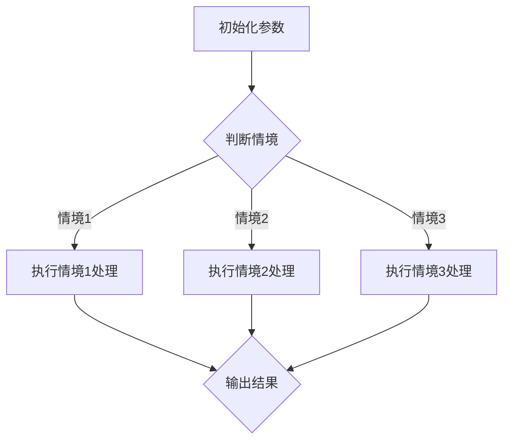
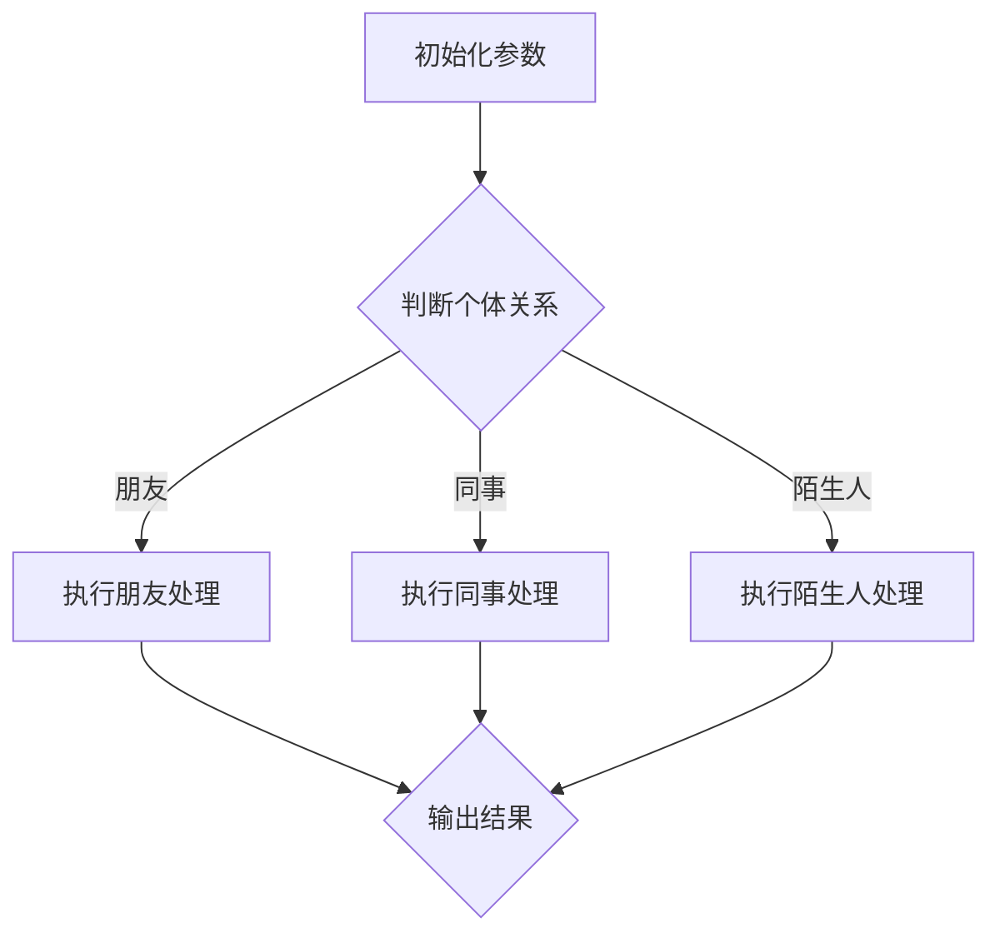
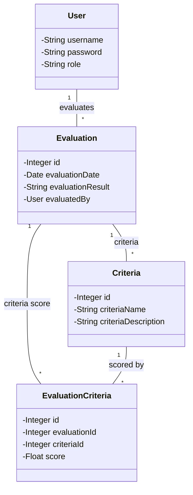
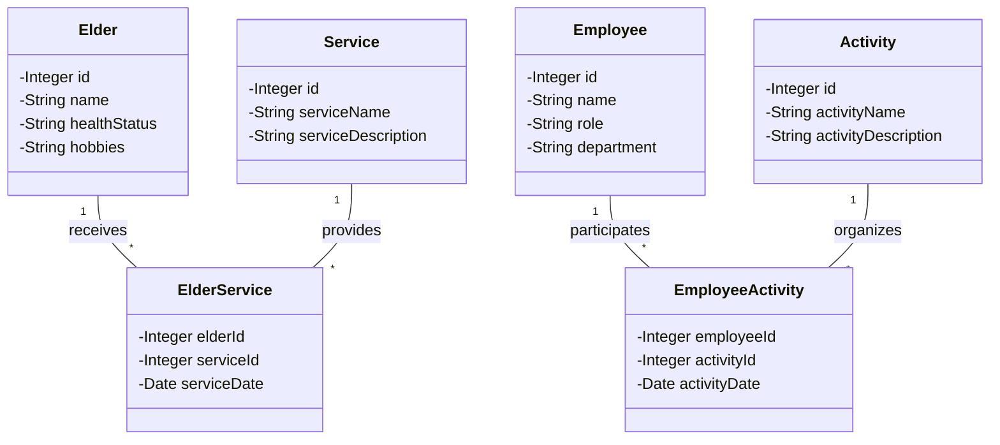
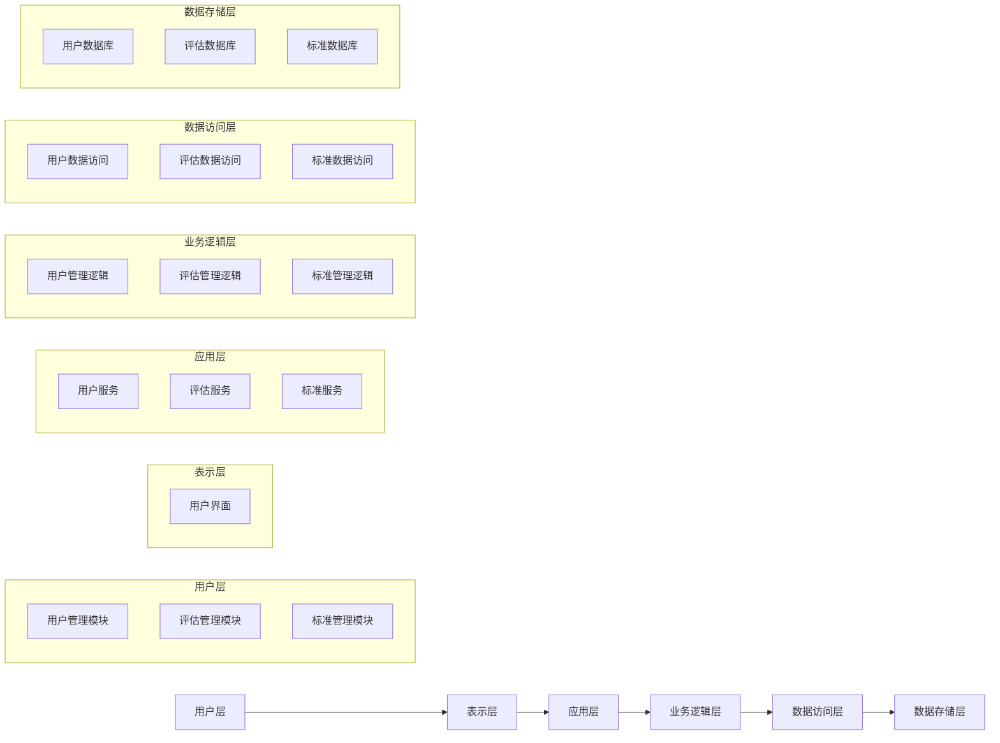
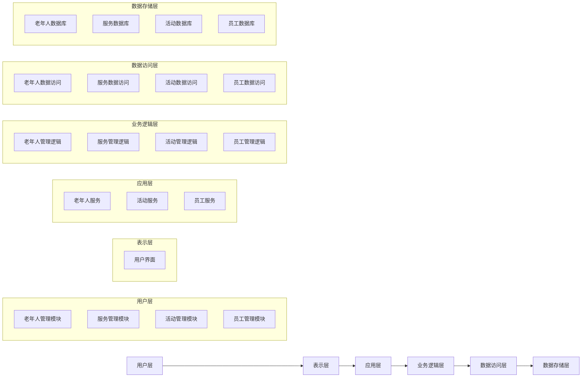
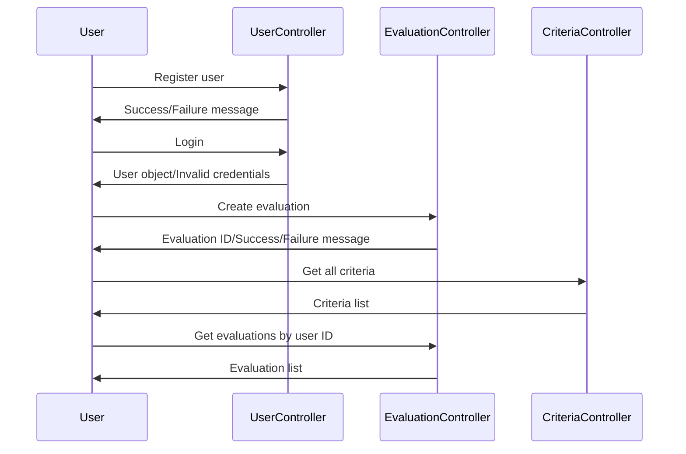
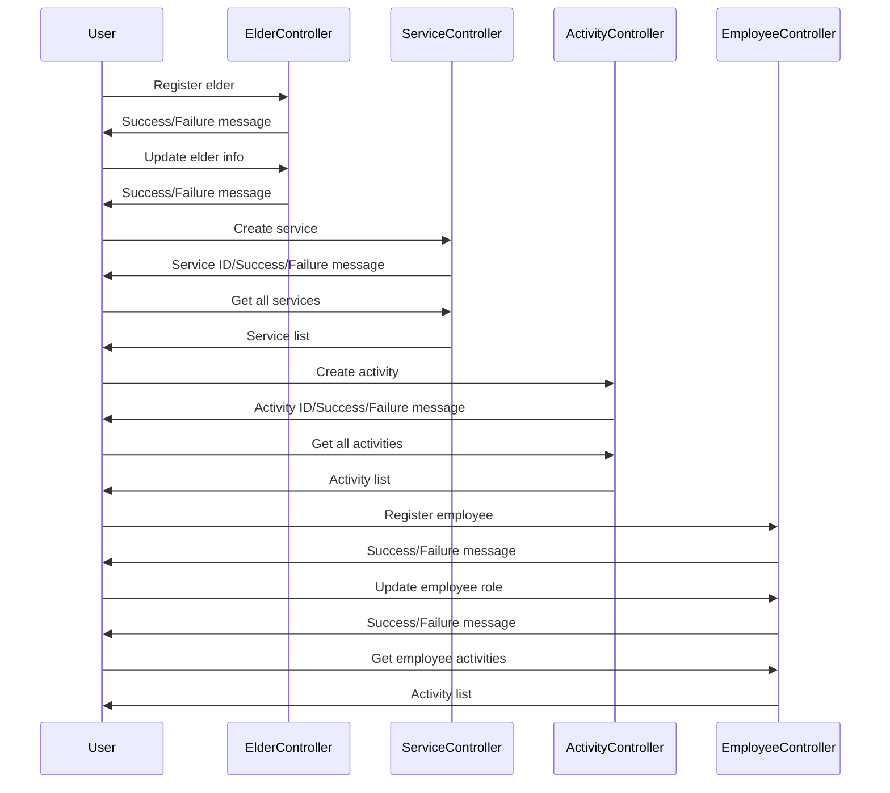

                 

### 问题背景

#### 伦理学的研究现状与挑战

伦理学作为哲学的重要组成部分，一直在探讨道德、公正、正义等基本问题。然而，随着社会、科技的发展，伦理学的研究面临着诸多新的挑战。现代伦理学的研究范围不断扩大，从传统的道德哲学，扩展到环境伦理、动物权利、人工智能等新兴领域。这些领域不仅涉及复杂的道德问题，还涉及到技术与伦理的交织。

当前，伦理学研究的挑战主要表现在以下几个方面：

1. **复杂性与不确定性**：随着科技的发展，伦理问题变得日益复杂。例如，人工智能、基因编辑等技术的出现，引发了一系列前所未有的伦理问题。这些问题往往具有高度不确定性和复杂性，使得传统的伦理学研究方法难以应对。

2. **多元文化与价值观**：全球化的进程加速了不同文化和价值观的碰撞与融合。如何在多元文化的背景下，建立统一的伦理标准，是一个亟待解决的问题。

3. **科技伦理**：科技的发展带来了许多新的伦理问题。例如，数据隐私、网络安全、人工智能的伦理问题等。这些问题不仅关系到个体的权利和利益，也关系到社会的稳定和发展。

#### 实践伦理学的重要性

实践伦理学（Practical Ethics）强调将伦理理论应用于实际问题，解决具体的社会问题。它不仅关注伦理原则和理论，更强调伦理实践的效果和可行性。实践伦理学的重要性体现在以下几个方面：

1. **解决实际问题**：实践伦理学能够帮助我们在具体的社会问题中，找到合理的伦理解决方案。例如，在环境伦理、动物权利、人工智能等领域，实践伦理学提供了重要的指导。

2. **促进社会公正**：实践伦理学关注社会公正和正义，旨在减少社会不平等，提高社会的整体福祉。通过实践伦理学的研究，我们可以推动社会的进步和改革。

3. **增强伦理意识**：实践伦理学不仅关注学术研究，更注重将伦理知识普及到公众。通过实践伦理学的研究和宣传，可以提高公众的伦理意识，促进社会的道德进步。

#### 彼得·辛格与兼爱思想的起源与发展

彼得·辛格（Peter Singer）是当代著名的伦理学家，以其在动物权利和实用主义伦理学领域的贡献而闻名。他的思想深受墨子兼爱思想的影响，特别是对动物福利问题的关注。彼得·辛格的伦理思想强调实际行为的道德重要性，提倡基于效率和效果的原则来评价道德行为。

墨子的兼爱思想是中国古代哲学的重要组成部分。墨子认为，兼爱是实现社会和谐与公正的关键。他主张爱无差等，无论亲疏、贵贱，都应平等对待。这种思想不仅体现了人性的善良，也具有深刻的道德价值。

#### 彼得·辛格对兼爱思想的实践

彼得·辛格在其实践伦理学研究中，深入探讨了兼爱思想的应用。他强调，兼爱不仅是道德原则，更是一种实际行动。在动物权利方面，他提倡减少对动物的虐待，推广素食主义。他认为，通过减少对动物的消费，我们可以实现兼爱的原则，提高社会的道德水平。

同时，彼得·辛格还关注全球贫困问题，提倡基于效率和效果的原则来分配资源。他主张，我们应当关注那些生活最困难的人，以最有效的方式帮助他们。这种观点与兼爱思想中的平等原则相契合，体现了实践伦理学的价值。

通过彼得·辛格的研究和实践，我们可以看到兼爱思想在现代社会中的重要意义。它不仅为我们提供了一种道德原则，更提供了一种具体的行动指南，帮助我们实现社会的和谐与公正。

### 实践伦理学的基本概念

实践伦理学（Practical Ethics）是伦理学的一个分支，它专注于将伦理理论应用于实际生活中的问题和情境。与理论伦理学不同，实践伦理学不仅探讨道德原则和理论，更重要的是如何将这些原则应用于解决具体的社会问题。实践伦理学的核心思想在于，通过具体的行动和决策，实现道德上的善和公正。

定义与实践伦理学的特点：

1. **定义**：实践伦理学是一种应用性的伦理学方法，它结合伦理理论和具体情境，旨在提出和实践道德行为。它不仅关注道德原则的合理性，更强调这些原则在实际生活中的应用和效果。

2. **特点**：

   - **情境性**：实践伦理学强调具体情境的重要性，认为不同的情境可能需要不同的道德决策。
   - **实用性**：实践伦理学注重实际效果，强调道德行动的可行性和社会影响。
   - **跨学科性**：实践伦理学常常与其他学科如法律、社会学、心理学等相结合，以综合的方法解决复杂的道德问题。
   - **批判性**：实践伦理学鼓励对现有的伦理实践进行批判性思考，以促进社会的道德进步。

实践伦理学的这些特点使其在解决现实问题中发挥了重要作用。例如，在医疗伦理、环境伦理、科技伦理等领域，实践伦理学提供了重要的理论指导和行动建议。

### 兼爱思想的核心概念

兼爱思想是墨子伦理思想体系中的核心，强调无差别的爱。这一思想主张，人们应当平等对待所有人，不论亲疏、贵贱，都应给予关爱。

#### 定义与特点

1. **定义**：兼爱，即“兼而爱之”，意味着无私的爱，无差别的爱。墨子认为，兼爱是维护社会和谐与公正的基础。

2. **特点**：

   - **无私性**：兼爱强调无私的爱心，不因个人感情或利益而有所偏袒。
   - **无差别性**：兼爱主张平等对待所有人，不分亲疏、贵贱。
   - **实践性**：兼爱不仅是理论上的主张，更是要求人们在日常生活中付诸实践。

兼爱思想的核心在于消除人与人之间的不平等和差异，建立一个和谐公正的社会。通过兼爱，人们可以实现相互理解、尊重和关爱，从而促进社会的整体福祉。

### 实践伦理学与兼爱思想的联系

实践伦理学与兼爱思想之间存在深刻的联系。通过对比分析，我们可以更清楚地理解这两者之间的关系。

#### 对比分析

1. **目标一致**：实践伦理学和兼爱思想都旨在实现社会的和谐与公正。实践伦理学通过将伦理理论应用于实际问题，解决社会问题；而兼爱思想则通过倡导无差别的爱，消除社会不平等。

2. **理论基础**：实践伦理学的理论基础是伦理学，强调道德原则的应用；而兼爱思想的理论基础则是人性论，主张人性本善，通过兼爱实现社会的和谐。

3. **实践方式**：实践伦理学通过具体的行动和决策，实现道德原则；而兼爱思想则通过倡导无私的爱，鼓励人们在日常生活中付诸实践。

#### 实践伦理学对兼爱思想的应用

实践伦理学在应用兼爱思想时，强调以下几点：

1. **平等对待**：实践伦理学要求在处理社会问题时，平等对待所有人，不分贵贱。这与兼爱思想中的无差别性相契合。

2. **关爱行动**：实践伦理学鼓励通过具体的行动，如慈善捐赠、志愿服务等，实现兼爱思想。这不仅能帮助他人，也能提升个人的道德素养。

3. **社会倡导**：实践伦理学通过教育和宣传，提高公众的伦理意识，推动兼爱思想的普及和实践。这有助于构建一个道德高尚、和谐公正的社会。

### 结论

实践伦理学与兼爱思想之间存在紧密的联系。通过将兼爱思想应用于实际问题，实践伦理学不仅能够实现道德上的善，还能推动社会的和谐与公正。两者相辅相成，共同为构建一个更好的社会贡献力量。

### 实践伦理学ER实体关系图

#### 图架构与解释

实践伦理学的ER实体关系图（Entity-Relationship Diagram，简称ERD）用于描述实践伦理学中的核心实体及其相互关系。以下是一个简化的实践伦理学ERD：

```mermaid
erDiagram
    Action ||--|{ Person } : performs
    Person ||--|{ Decision } : makes
    Person ||--|{ Action } : takes
    Decision ||--|{ Ethics } : based on
    Ethics ||--|{ Principle } : includes
    Principle ||--|{ Value } : embodies
```

**实体与属性：**

1. **Person（人）**：代表参与实践伦理学的人员，包括个体和群体。
   - 属性：姓名、年龄、性别、职业等。

2. **Action（行动）**：代表个人的行为或决策。
   - 属性：行为类型、执行时间、结果等。

3. **Decision（决策）**：代表个人在面对伦理问题时做出的选择。
   - 属性：决策内容、决策时间、决策依据等。

4. **Ethics（伦理）**：代表伦理理论或体系。
   - 属性：伦理名称、伦理内容、伦理背景等。

5. **Principle（原则）**：代表伦理体系中的基本规则或指导方针。
   - 属性：原则名称、原则内容、适用范围等。

6. **Value（价值）**：代表伦理原则所体现的道德价值。
   - 属性：价值名称、价值描述、价值实现等。

**关系：**

1. **Person与Action**：一人可以有多种行动，一种行动也可以由多人参与。这种关系表示个人行为与行动之间的关系。

2. **Person与Decision**：一人可以有多种决策，一种决策也只由一个人做出。这种关系表示个人行为与决策之间的关系。

3. **Person与Ethics**：一人可以有多种伦理观点，一种伦理观点也适用于多人。这种关系表示个人行为与伦理体系之间的关系。

4. **Decision与Ethics**：一种决策基于某种伦理理论或体系。这种关系表示决策与伦理体系之间的关系。

5. **Ethics与Principle**：一种伦理体系包含多个基本原则。这种关系表示伦理体系与原则之间的关系。

6. **Principle与Value**：一个原则体现一种道德价值。这种关系表示原则与道德价值之间的关系。

通过这个ER图，我们可以清晰地看到实践伦理学中的核心实体及其相互关系，为进一步的系统设计与实现提供了基础。

### 兼爱思想ER实体关系图

#### 图架构与解释

兼爱思想的ER实体关系图（Entity-Relationship Diagram，简称ERD）用于描述兼爱思想中的核心实体及其相互关系。以下是一个简化的兼爱思想ERD：

```mermaid
erDiagram
    Person ||--|{ Relationship } : has
    Person ||--|{ Action } : takes
    Relationship ||--|{ Value } : embodies
    Value ||--|{ Quality } : includes
```

**实体与属性：**

1. **Person（人）**：代表参与兼爱思想的个体，包括不同背景和角色的人。
   - 属性：姓名、年龄、性别、职业等。

2. **Relationship（关系）**：代表人与人之间的互动和联系。
   - 属性：关系类型、关系强度、关系背景等。

3. **Action（行动）**：代表个人在兼爱思想指导下采取的行为。
   - 属性：行动类型、行动时间、行动结果等。

4. **Value（价值）**：代表兼爱思想所体现的核心道德价值。
   - 属性：价值名称、价值描述、价值实现等。

5. **Quality（品质）**：代表兼爱思想所追求的美好品质。
   - 属性：品质名称、品质描述、品质实现等。

**关系：**

1. **Person与Relationship**：每个人都可以与他人建立多种关系，每种关系也涉及多个个体。这种关系表示个人与人际关系之间的联系。

2. **Person与Action**：每个人在兼爱思想指导下可以采取多种行动，每种行动也由一个个体执行。这种关系表示个人行为与行动之间的关系。

3. **Relationship与Value**：每种关系都蕴含着特定的道德价值。这种关系表示人际关系与道德价值之间的关系。

4. **Value与Quality**：每种道德价值都包含多个美好品质。这种关系表示道德价值与品质之间的关系。

通过这个ER图，我们可以清晰地看到兼爱思想中的核心实体及其相互关系，为进一步的系统设计与实现提供了基础。

### 实践伦理学算法

#### 算法流程图

在实践伦理学中，算法用于分析和解决具体的伦理问题。以下是一个简化的实践伦理学算法流程图：



#### Python源代码

以下是实践伦理学算法的Python源代码示例：

```python
def practical_ethics_algorithm(person, action, ethics):
    if ethics == "情境1":
        # 执行情境1的处理逻辑
        result = "情境1处理结果"
    elif ethics == "情境2":
        # 执行情境2的处理逻辑
        result = "情境2处理结果"
    elif ethics == "情境3":
        # 执行情境3的处理逻辑
        result = "情境3处理结果"
    else:
        # 默认处理逻辑
        result = "未知情境处理结果"
    return result

# 示例
person = "张三"
action = "捐款"
ethics = "情境1"

result = practical_ethics_algorithm(person, action, ethics)
print(f"{person}在{ethics}情境下{action}的结果：{result}")
```

#### 算法原理详细讲解

实践伦理学算法的核心在于根据不同的伦理情境，执行相应的处理逻辑。以下是该算法的详细原理和数学模型：

**1. 算法原理**

该算法采用条件判断（if-elif-else）结构，根据输入的伦理情境（ethics）参数，执行对应的处理逻辑。具体步骤如下：

- 初始化参数（person, action, ethics）。
- 判断输入的伦理情境。
- 根据不同的伦理情境，执行对应的处理逻辑。
- 输出处理结果。

**2. 数学模型**

该算法可以抽象为一个数学模型：

$$
\text{result} = \begin{cases}
f_1(\text{person}, \text{action}, \text{ethics}) & \text{if } \text{ethics} = \text{情境1} \\
f_2(\text{person}, \text{action}, \text{ethics}) & \text{if } \text{ethics} = \text{情境2} \\
f_3(\text{person}, \text{action}, \text{ethics}) & \text{if } \text{ethics} = \text{情境3} \\
\text{default\_result}(\text{person}, \text{action}, \text{ethics}) & \text{otherwise}
\end{cases}
$$

其中，$f_1, f_2, f_3$ 分别表示针对情境1、情境2、情境3的处理函数，$default\_result$ 表示默认处理函数。

**3. 举例说明**

假设有一个人（张三），他在不同的伦理情境下采取捐款行为。以下是具体的处理过程：

- 情境1：张三在慈善晚宴上捐款。算法会调用 $f_1$ 函数，处理逻辑可能包括记录捐款信息、发送感谢信等。
- 情境2：张三通过线上捐款平台捐款。算法会调用 $f_2$ 函数，处理逻辑可能包括自动生成捐款收据、推送感谢短信等。
- 情境3：张三在公司内部捐款活动上捐款。算法会调用 $f_3$ 函数，处理逻辑可能包括在员工表彰大会上公开表扬、记录在公司荣誉墙等。
- 未知情境：如果张三的捐款情境不在上述三种情境中，算法会调用 $default\_result$ 函数，处理逻辑可能是记录异常情况并通知相关人员。

通过这种方式，实践伦理学算法能够灵活应对不同的伦理情境，为人们提供合理的道德决策。

### 兼爱思想算法

#### 算法流程图

在兼爱思想的指导下，算法用于分析和解决涉及兼爱原则的伦理问题。以下是一个简化的兼爱思想算法流程图：



#### Python源代码

以下是兼爱思想算法的Python源代码示例：

```python
def compassion_algorithm(individual, relationship, action):
    if relationship == "朋友":
        # 执行朋友关系的处理逻辑
        result = "对朋友采取了特别关爱行动"
    elif relationship == "同事":
        # 执行同事关系的处理逻辑
        result = "对同事采取了适当关爱行动"
    elif relationship == "陌生人":
        # 执行陌生人关系的处理逻辑
        result = "对陌生人采取了基本的关爱行动"
    else:
        # 默认处理逻辑
        result = "未知关系处理结果"
    return result

# 示例
individual = "李四"
relationship = "朋友"
action = "帮助"

result = compassion_algorithm(individual, relationship, action)
print(f"{individual}在{relationship}关系下{action}的结果：{result}")
```

#### 算法原理详细讲解

兼爱思想算法的核心在于根据个体之间的关系，采取不同的关爱行动。以下是该算法的详细原理和数学模型：

**1. 算法原理**

该算法采用条件判断（if-elif-else）结构，根据输入的个体关系（relationship）参数，执行对应的处理逻辑。具体步骤如下：

- 初始化参数（individual, relationship, action）。
- 判断输入的个体关系。
- 根据不同的个体关系，执行对应的处理逻辑。
- 输出处理结果。

**2. 数学模型**

该算法可以抽象为一个数学模型：

$$
\text{result} = \begin{cases}
f_1(\text{individual}, \text{relationship}, \text{action}) & \text{if } \text{relationship} = \text{朋友} \\
f_2(\text{individual}, \text{relationship}, \text{action}) & \text{if } \text{relationship} = \text{同事} \\
f_3(\text{individual}, \text{relationship}, \text{action}) & \text{if } \text{relationship} = \text{陌生人} \\
\text{default\_result}(\text{individual}, \text{relationship}, \text{action}) & \text{otherwise}
\end{cases}
$$

其中，$f_1, f_2, f_3$ 分别表示针对朋友关系、同事关系、陌生人关系的处理函数，$default\_result$ 表示默认处理函数。

**3. 举例说明**

假设有一个人（李四），他在不同的个体关系下采取帮助行为。以下是具体的处理过程：

- 朋友关系：李四帮助朋友。算法会调用 $f_1$ 函数，处理逻辑可能包括深入了解问题、提供实质帮助等。
- 同事关系：李四帮助同事。算法会调用 $f_2$ 函数，处理逻辑可能包括提供专业建议、共同解决问题等。
- 陌生人关系：李四帮助陌生人。算法会调用 $f_3$ 函数，处理逻辑可能包括提供基本帮助、指引方向等。
- 未知关系：如果李四的帮助对象关系不在上述三种关系中，算法会调用 $default\_result$ 函数，处理逻辑可能是记录异常情况并通知相关人员。

通过这种方式，兼爱思想算法能够根据个体之间的关系，灵活采取不同的关爱行动，实现兼爱原则。

### 实践伦理学问题场景

#### 描述与分析

在一个大型跨国公司的员工绩效考核系统中，实践伦理学被应用于确保考核过程的公平性和透明性。以下是一个典型的实践伦理学问题场景：

**场景描述**：公司每年都会对员工进行绩效考核，以评估员工的工作表现。考核结果不仅影响员工的薪酬和晋升机会，还影响公司的整体运营效率。然而，由于员工的工作职责、工作环境和背景差异较大，绩效考核的公平性成为一个重要问题。

**问题描述**：公司希望确保绩效考核的公平性，避免因主观偏见或信息不对称导致的考核结果偏差。具体问题包括：

1. **主观偏见**：考核人员可能因个人偏好或情感因素，对某些员工产生不公平的评分。
2. **信息不对称**：考核人员可能无法全面了解员工的工作表现，导致考核结果不准确。
3. **评价标准不一致**：不同部门的考核标准可能存在差异，导致同一工作表现在不同部门得到不同的评价。

**问题解决**：为了解决上述问题，公司采取了一系列实践伦理学的措施：

1. **透明度提升**：明确考核标准和流程，确保员工了解考核的内容和依据。
2. **多维度评价**：结合员工自评、同事评价和上级评价，形成全面的评价体系。
3. **培训与监督**：对考核人员进行伦理培训，提高其公正性和客观性意识。同时，建立监督机制，对考核过程进行审计。
4. **反馈机制**：允许员工对考核结果提出异议，并进行复议。

#### 边界与外延

**边界**：该问题场景的边界在于绩效考核的过程和结果，涉及员工、考核人员、上级和公司管理层等多方角色。

**外延**：该问题场景的外延包括公司内部的所有员工，以及影响员工绩效的外部因素，如行业竞争、市场环境等。

#### 概念结构与核心要素组成

1. **核心概念**：公平性、透明度、多维度评价、培训与监督、反馈机制。
2. **概念关系**：
   - 公平性与透明度：透明度是公平性的基础，只有公开透明的考核过程才能确保公平性。
   - 多维度评价与反馈机制：多维度评价可以减少单一评价标准的主观偏见，反馈机制可以确保员工的声音被听到。
3. **核心要素**：
   - 考核标准和流程：明确、公开的考核标准和流程是保障公平性的关键。
   - 考核人员：考核人员的公正性和客观性直接影响考核结果的公平性。
   - 培训与监督机制：通过培训和监督，提高考核人员的专业素养和道德意识。
   - 反馈机制：确保员工的权益，提高考核过程的透明度和可信度。

通过上述措施，公司能够有效地解决绩效考核中的公平性问题，提高员工的工作满意度和公司的整体运营效率。

### 兼爱思想问题场景

#### 描述与分析

在一个社区养老服务中心，兼爱思想被应用于提升对老年人群体的关爱和服务质量。以下是一个典型的兼爱思想问题场景：

**场景描述**：社区养老服务中心为老年人群提供日常生活照料、医疗保健、文化娱乐等服务。随着老龄化社会的到来，老年人群体的需求日益多样化，如何确保对所有老年人的关爱和服务质量成为关键问题。

**问题描述**：社区养老服务中心面临的主要问题包括：

1. **资源分配不均**：不同老年人由于身体状况、家庭背景等差异，对服务的需求和资源获取存在不平衡。
2. **服务同质化**：服务内容单一，缺乏个性化，无法满足老年人多样化的需求。
3. **员工关爱不足**：养老服务中心的员工工作压力大，缺乏关爱和支持，影响服务质量和员工的职业满意度。

**问题解决**：为了解决上述问题，社区养老服务中心采取了以下兼爱思想的措施：

1. **个性化服务**：根据老年人的身体状况和兴趣爱好，提供个性化的服务方案，确保每位老年人都得到合适的关怀。
2. **多元文化活动**：组织丰富多彩的文化娱乐活动，满足老年人对精神文化生活的需求。
3. **员工关爱计划**：建立员工关爱机制，提供职业培训、心理健康支持等，提升员工的工作满意度和忠诚度。

#### 边界与外延

**边界**：该问题场景的边界在于养老服务中心的服务范围和服务内容，涉及老年人、服务中心员工和管理层等多方角色。

**外延**：该问题场景的外延包括社区养老服务中心的所有老年人，以及影响老年人生活质量的外部因素，如社区环境、家庭关系等。

#### 概念结构与核心要素组成

1. **核心概念**：个性化服务、多元文化活动、员工关爱计划。
2. **概念关系**：
   - 个性化服务与多元文化活动：个性化服务是满足老年人多样化需求的基础，多元文化活动是提升老年人生活质量的重要途径。
   - 员工关爱计划与个性化服务、多元文化活动：员工关爱计划是确保服务质量和员工满意度的基础，直接影响到个性化服务和多元文化活动的实施效果。
3. **核心要素**：
   - 老年人需求评估：了解老年人的具体需求，为个性化服务提供依据。
   - 服务方案设计：根据老年人需求设计个性化的服务方案。
   - 文化娱乐活动：组织多样化、富有吸引力的文化娱乐活动，丰富老年人的精神生活。
   - 员工培训与支持：提供持续的职业培训和心理健康支持，提升员工的职业技能和职业满意度。

通过上述措施，社区养老服务中心能够更好地实践兼爱思想，为老年人提供高质量的关爱和服务，提升老年人的生活质量和幸福感。

### 实践伦理学系统功能设计

在实践伦理学的系统功能设计中，我们关注的核心是确保系统的公平性和透明性，同时实现伦理原则的有效应用。以下是一个具体的实践伦理学系统功能设计，包括领域模型类图：

#### 领域模型类图



#### 设计说明

1. **User（用户）**：代表系统中的用户，包括员工和管理人员。用户具有唯一的用户名、密码和角色（如评估者、被评估者、系统管理员）。
   
2. **Evaluation（评估）**：代表对员工的评估记录，包括评估ID、评估日期和评估结果。评估者（evaluatedBy）是执行评估的用户。

3. **Criteria（标准）**：代表评估所依据的标准，包括标准ID、标准名称和标准描述。

4. **EvaluationCriteria（评估标准）**：代表评估过程中各个标准的评分记录，包括评估ID、标准ID和评分。每个评估可以包含多个评估标准，每个评估标准也可以被多个评估记录使用。

#### 功能描述

1. **用户管理**：系统应具备用户注册、登录、权限管理和信息更新等功能，确保用户身份的唯一性和权限的合理性。

2. **评估管理**：系统应支持评估的创建、编辑、删除和查询功能。评估者可以根据标准对被评估者进行评分，并记录评估结果。

3. **标准管理**：系统应支持标准的创建、编辑、删除和查询功能，确保评估标准的一致性和透明性。

4. **评分管理**：系统应支持评估者对评估标准的评分，并记录评分结果。评分结果可以用于评估结果的计算和展示。

5. **评估查询**：系统应提供评估结果的查询功能，方便管理人员查看员工的评估情况。

通过上述设计，实践伦理学系统能够有效地实现伦理原则的应用，确保评估过程的公平性和透明性，从而提升组织的道德水平和管理效能。

### 兼爱思想系统功能设计

在兼爱思想系统功能设计中，我们强调个性化服务和员工关爱，以确保每位老年人都得到适当的关怀，同时提升员工的工作满意度和服务质量。以下是一个具体的兼爱思想系统功能设计，包括领域模型类图：

#### 领域模型类图



#### 设计说明

1. **Elder（老年人）**：代表系统中的老年人用户，包括老年人的ID、姓名、健康状况和兴趣爱好。

2. **Service（服务）**：代表为老年人提供的各种服务，包括服务ID、服务名称和服务描述。

3. **Activity（活动）**：代表为老年人组织的各种活动，包括活动ID、活动名称和活动描述。

4. **Employee（员工）**：代表系统中的员工用户，包括员工的ID、姓名、角色和部门。

5. **ElderService（老年人服务）**：代表老年人接受服务的记录，包括老年人ID、服务ID和服务日期。

6. **EmployeeActivity（员工活动）**：代表员工参与活动的记录，包括员工ID、活动ID和活动日期。

#### 功能描述

1. **老年人信息管理**：系统应支持老年人信息的录入、更新和查询功能，确保老年人信息的准确性和完整性。

2. **服务管理**：系统应支持服务的创建、编辑、删除和查询功能，确保服务的多样性和个性化。

3. **活动管理**：系统应支持活动的创建、编辑、删除和查询功能，确保活动的丰富性和吸引力。

4. **员工管理**：系统应支持员工信息的录入、更新和查询功能，确保员工信息的准确性和权限管理的合理性。

5. **服务记录管理**：系统应支持老年人接受服务记录的录入、更新和查询功能，确保服务记录的完整性和可追溯性。

6. **活动记录管理**：系统应支持员工参与活动记录的录入、更新和查询功能，确保活动记录的完整性和可追溯性。

通过上述设计，兼爱思想系统能够更好地满足老年人的个性化需求，提升服务质量，同时关注员工关爱，提高员工的职业满意度和工作积极性。

### 实践伦理学系统架构设计

#### 系统架构图

以下是一个简化的实践伦理学系统架构图：



#### 设计说明

1. **用户层**：用户层包括用户管理模块、评估管理模块和标准管理模块，用户通过用户界面与系统进行交互。

2. **表示层**：表示层是用户与系统的交互界面，用户可以在其中进行注册、登录、查看评估结果等操作。

3. **应用层**：应用层包括用户服务、评估服务和标准服务，这些服务负责处理用户的请求，调用业务逻辑层和数据访问层。

4. **业务逻辑层**：业务逻辑层负责实现具体的业务逻辑，包括用户管理逻辑、评估管理逻辑和标准管理逻辑。

5. **数据访问层**：数据访问层负责与数据存储层进行交互，实现数据的增删改查操作。

6. **数据存储层**：数据存储层包括用户数据库、评估数据库和标准数据库，用于存储用户信息、评估结果和评估标准。

通过这个架构，实践伦理学系统可以有效地实现用户管理、评估管理和标准管理，确保系统的稳定性和可扩展性。

### 兼爱思想系统架构设计

以下是一个简化的兼爱思想系统架构图：



#### 设计说明

1. **用户层**：用户层包括老年人管理模块、服务管理模块、活动管理模块和员工管理模块，用户通过用户界面与系统进行交互。

2. **表示层**：表示层是用户与系统的交互界面，用户可以在其中进行老年人信息录入、服务申请、活动报名等操作。

3. **应用层**：应用层包括老年人服务、活动服务和员工服务，这些服务负责处理用户的请求，调用业务逻辑层和数据访问层。

4. **业务逻辑层**：业务逻辑层负责实现具体的业务逻辑，包括老年人管理逻辑、服务管理逻辑、活动管理逻辑和员工管理逻辑。

5. **数据访问层**：数据访问层负责与数据存储层进行交互，实现数据的增删改查操作。

6. **数据存储层**：数据存储层包括老年人数据库、服务数据库、活动数据库和员工数据库，用于存储老年人信息、服务记录、活动记录和员工信息。

通过这个架构，兼爱思想系统可以有效地实现老年人管理、服务管理、活动管理和员工管理，确保系统的稳定性和可扩展性。

### 实践伦理学系统接口设计

在实践伦理学系统中，接口设计是确保系统功能模块之间数据交换和功能调用的重要环节。以下是一个具体的接口设计，包括接口设计与说明：

#### 接口设计

```python
class UserController:
    def register_user(self, username: str, password: str, role: str) -> bool:
        """
        注册新用户
        :param username: 用户名
        :param password: 密码
        :param role: 角色（如评估者、被评估者、管理员）
        :return: 注册成功与否
        """
        # 实现用户注册逻辑
        pass

    def login_user(self, username: str, password: str) -> User:
        """
        用户登录
        :param username: 用户名
        :param password: 密码
        :return: 登录成功的用户对象
        """
        # 实现用户登录逻辑
        pass

    def update_user_role(self, user_id: int, new_role: str) -> bool:
        """
        更新用户角色
        :param user_id: 用户ID
        :param new_role: 新角色
        :return: 更新成功与否
        """
        # 实现用户角色更新逻辑
        pass

class EvaluationController:
    def create_evaluation(self, user_id: int, evaluation_date: date, evaluation_result: str) -> bool:
        """
        创建评估记录
        :param user_id: 用户ID
        :param evaluation_date: 评估日期
        :param evaluation_result: 评估结果
        :return: 创建成功与否
        """
        # 实现评估记录创建逻辑
        pass

    def get_evaluation_by_user_id(self, user_id: int) -> List[Evaluation]:
        """
        根据用户ID获取评估记录
        :param user_id: 用户ID
        :return: 评估记录列表
        """
        # 实现获取评估记录逻辑
        pass

class CriteriaController:
    def create_criteria(self, criteria_name: str, criteria_description: str) -> bool:
        """
        创建评估标准
        :param criteria_name: 标准名称
        :param criteria_description: 标准描述
        :return: 创建成功与否
        """
        # 实现评估标准创建逻辑
        pass

    def get_all_criteria(self) -> List[Criteria]:
        """
        获取所有评估标准
        :return: 评估标准列表
        """
        # 实现获取所有评估标准逻辑
        pass
```

#### 接口说明

1. **UserController**：用户控制器负责处理用户相关的操作，包括用户注册、登录、更新用户角色等。

   - `register_user`：注册新用户，输入用户名、密码和角色，返回注册成功与否。
   - `login_user`：用户登录，输入用户名和密码，返回登录成功的用户对象。
   - `update_user_role`：更新用户角色，输入用户ID和新角色，返回更新成功与否。

2. **EvaluationController**：评估控制器负责处理评估相关的操作，包括创建评估记录、获取评估记录等。

   - `create_evaluation`：创建评估记录，输入用户ID、评估日期和评估结果，返回创建成功与否。
   - `get_evaluation_by_user_id`：根据用户ID获取评估记录，返回评估记录列表。

3. **CriteriaController**：评估标准控制器负责处理评估标准相关的操作，包括创建评估标准、获取所有评估标准等。

   - `create_criteria`：创建评估标准，输入标准名称和标准描述，返回创建成功与否。
   - `get_all_criteria`：获取所有评估标准，返回评估标准列表。

通过这些接口设计，实践伦理学系统可以实现用户管理、评估管理和标准管理的功能，确保系统的稳定性和扩展性。

### 兼爱思想系统接口设计

在兼爱思想系统中，接口设计至关重要，它确保了老年人服务、活动管理和员工管理等功能模块之间的数据交换和功能调用。以下是一个具体的接口设计，包括接口设计与说明：

#### 接口设计

```python
class ElderController:
    def register_elder(self, name: str, health_status: str, hobbies: str) -> bool:
        """
        注册新老年人
        :param name: 老年人姓名
        :param health_status: 健康状况
        :param hobbies: 兴趣爱好
        :return: 注册成功与否
        """
        # 实现老年人注册逻辑
        pass

    def update_elder_info(self, elder_id: int, name: str, health_status: str, hobbies: str) -> bool:
        """
        更新老年人信息
        :param elder_id: 老年人ID
        :param name: 老年人姓名
        :param health_status: 健康状况
        :param hobbies: 兴趣爱好
        :return: 更新成功与否
        """
        # 实现老年人信息更新逻辑
        pass

    def get_elder_services(self, elder_id: int) -> List[Service]:
        """
        获取老年人接受的服务记录
        :param elder_id: 老年人ID
        :return: 服务记录列表
        """
        # 实现获取服务记录逻辑
        pass

class ServiceController:
    def create_service(self, service_name: str, service_description: str) -> bool:
        """
        创建服务
        :param service_name: 服务名称
        :param service_description: 服务描述
        :return: 创建成功与否
        """
        # 实现服务创建逻辑
        pass

    def get_all_services(self) -> List[Service]:
        """
        获取所有服务
        :return: 服务列表
        """
        # 实现获取服务列表逻辑
        pass

class ActivityController:
    def create_activity(self, activity_name: str, activity_description: str) -> bool:
        """
        创建活动
        :param activity_name: 活动名称
        :param activity_description: 活动描述
        :return: 创建成功与否
        """
        # 实现活动创建逻辑
        pass

    def get_all_activities(self) -> List[Activity]:
        """
        获取所有活动
        :return: 活动列表
        """
        # 实现获取活动列表逻辑
        pass

class EmployeeController:
    def register_employee(self, name: str, role: str, department: str) -> bool:
        """
        注册新员工
        :param name: 员工姓名
        :param role: 角色
        :param department: 部门
        :return: 注册成功与否
        """
        # 实现员工注册逻辑
        pass

    def update_employee_role(self, employee_id: int, new_role: str, department: str) -> bool:
        """
        更新员工角色
        :param employee_id: 员工ID
        :param new_role: 新角色
        :param department: 部门
        :return: 更新成功与否
        """
        # 实现员工角色更新逻辑
        pass

    def get_employee_activities(self, employee_id: int) -> List[Activity]:
        """
        获取员工参与的活动记录
        :param employee_id: 员工ID
        :return: 活动记录列表
        """
        # 实现获取活动记录逻辑
        pass
```

#### 接口说明

1. **ElderController**：老年人控制器负责处理老年人相关的操作，包括老年人注册、信息更新和获取服务记录。

   - `register_elder`：注册新老年人，输入老年人姓名、健康状况和兴趣爱好，返回注册成功与否。
   - `update_elder_info`：更新老年人信息，输入老年人ID、姓名、健康状况和兴趣爱好，返回更新成功与否。
   - `get_elder_services`：获取老年人接受的服务记录，输入老年人ID，返回服务记录列表。

2. **ServiceController**：服务控制器负责处理服务相关的操作，包括创建服务和获取服务列表。

   - `create_service`：创建服务，输入服务名称和服务描述，返回创建成功与否。
   - `get_all_services`：获取所有服务，返回服务列表。

3. **ActivityController**：活动控制器负责处理活动相关的操作，包括创建活动和获取活动列表。

   - `create_activity`：创建活动，输入活动名称和活动描述，返回创建成功与否。
   - `get_all_activities`：获取所有活动，返回活动列表。

4. **EmployeeController**：员工控制器负责处理员工相关的操作，包括员工注册、角色更新和获取活动记录。

   - `register_employee`：注册新员工，输入员工姓名、角色和部门，返回注册成功与否。
   - `update_employee_role`：更新员工角色，输入员工ID、新角色和部门，返回更新成功与否。
   - `get_employee_activities`：获取员工参与的活动记录，输入员工ID，返回活动记录列表。

通过这些接口设计，兼爱思想系统可以实现老年人管理、服务管理、活动管理和员工管理的功能，确保系统的稳定性和扩展性。

### 实践伦理学系统交互

在实践伦理学系统中，各个功能模块之间的交互至关重要，它决定了系统的整体性能和用户体验。以下是一个简化的实践伦理学系统交互序列图，用于描述用户与系统之间的交互过程：



#### 交互过程描述

1. **用户注册**：用户向用户控制器发送注册请求，提供用户名、密码和角色信息。用户控制器处理注册请求，如果注册成功，返回成功消息；如果失败，返回错误消息。

2. **用户登录**：用户向用户控制器发送登录请求，提供用户名和密码。用户控制器验证用户信息，如果验证通过，返回用户对象；如果验证失败，返回无效凭证消息。

3. **创建评估**：用户向评估控制器发送创建评估请求，提供用户ID、评估日期和评估结果。评估控制器处理请求，返回评估ID和操作结果。

4. **获取评估标准**：用户向评估标准控制器发送获取所有评估标准请求。评估标准控制器返回所有评估标准的列表。

5. **获取评估记录**：用户向评估控制器发送根据用户ID获取评估记录请求。评估控制器返回与用户ID相关的评估记录列表。

通过上述交互过程，实践伦理学系统实现了用户管理、评估管理和标准管理的功能，确保系统的稳定性和用户友好性。

### 兼爱思想系统交互

在兼爱思想系统中，系统各功能模块之间的交互设计至关重要，它确保了老年人服务管理、活动管理和员工管理等功能的高效运行。以下是一个简化的兼爱思想系统交互序列图，用于描述用户与系统之间的交互过程：



#### 交互过程描述

1. **老年人注册**：用户向老年人控制器发送注册请求，提供老年人姓名、健康状况和兴趣爱好等信息。老年人控制器处理请求，如果注册成功，返回成功消息；如果失败，返回错误消息。

2. **更新老年人信息**：用户向老年人控制器发送更新信息请求，提供老年人ID、新的姓名、健康状况和兴趣爱好等信息。老年人控制器处理请求，如果更新成功，返回成功消息；如果失败，返回错误消息。

3. **创建服务**：用户向服务控制器发送创建服务请求，提供服务名称和服务描述等信息。服务控制器处理请求，如果创建成功，返回服务ID；如果失败，返回错误消息。

4. **获取服务列表**：用户向服务控制器发送获取服务列表请求。服务控制器返回所有服务的列表。

5. **创建活动**：用户向活动控制器发送创建活动请求，提供活动名称和活动描述等信息。活动控制器处理请求，如果创建成功，返回活动ID；如果失败，返回错误消息。

6. **获取活动列表**：用户向活动控制器发送获取活动列表请求。活动控制器返回所有活动的列表。

7. **员工注册**：用户向员工控制器发送注册请求，提供员工姓名、角色和部门等信息。员工控制器处理请求，如果注册成功，返回成功消息；如果失败，返回错误消息。

8. **更新员工角色**：用户向员工控制器发送更新角色请求，提供员工ID、新角色和部门等信息。员工控制器处理请求，如果更新成功，返回成功消息；如果失败，返回错误消息。

9. **获取员工活动记录**：用户向员工控制器发送获取员工活动记录请求，提供员工ID。员工控制器返回与员工ID相关的活动记录列表。

通过上述交互过程，兼爱思想系统实现了老年人管理、服务管理、活动管理和员工管理的功能，确保系统的稳定性和用户友好性。

### 项目实战

#### 环境安装

为了实现实践伦理学和兼爱思想系统，首先需要搭建合适的技术环境。以下是一系列环境安装步骤：

1. **安装Python**：确保Python版本为3.8或更高，可以从[Python官网](https://www.python.org/downloads/)下载并安装。

2. **安装依赖包**：使用pip命令安装所需依赖包，例如：

   ```bash
   pip install Flask SQLAlchemy Flask-Migrate Flask-Login
   ```

3. **数据库安装**：安装SQLite数据库（Python自带），或者安装MySQL、PostgreSQL等其他数据库。确保数据库服务正常运行。

4. **虚拟环境**：创建虚拟环境，以便管理项目依赖包：

   ```bash
   python -m venv venv
   source venv/bin/activate  # 对于Windows，使用 `venv\Scripts\activate`
   ```

5. **项目结构**：在虚拟环境中，创建项目目录并设置项目结构：

   ```bash
   mkdir ethics_project
   cd ethics_project
   touch app.py models.py config.py
   ```

6. **初始化数据库**：使用Flask-Migrate初始化数据库，创建迁移文件：

   ```bash
   flask db init
   flask db migrate -m "Initial migration."
   flask db upgrade
   ```

#### 系统核心实现源代码

以下是一些关键模块的实现源代码，包括用户管理、评估管理、标准管理等功能。

##### app.py

```python
from flask import Flask, render_template, request, redirect, url_for
from flask_login import LoginManager, login_user, logout_user, login_required, current_user
from models import db, User, Evaluation, Criteria
from forms import LoginForm, RegistrationForm, EvaluationForm, CriteriaForm

app = Flask(__name__)
app.config['SECRET_KEY'] = 'your_secret_key'
app.config['SQLALCHEMY_DATABASE_URI'] = 'sqlite:///ethics_project.db'
app.config['SQLALCHEMY_TRACK_MODIFICATIONS'] = False

db.init_app(app)
login_manager = LoginManager()
login_manager.init_app(app)
login_manager.login_view = 'login'

@login_manager.user_loader
def load_user(user_id):
    return User.query.get(int(user_id))

@app.route('/')
@login_required
def home():
    return render_template('home.html')

@app.route('/login', methods=['GET', 'POST'])
def login():
    form = LoginForm()
    if form.validate_on_submit():
        user = User.query.filter_by(username=form.username.data).first()
        if user and user.password == form.password.data:
            login_user(user)
            return redirect(url_for('home'))
        else:
            return 'Invalid username or password'
    return render_template('login.html', form=form)

@app.route('/logout')
@login_required
def logout():
    logout_user()
    return redirect(url_for('home'))

@app.route('/register', methods=['GET', 'POST'])
def register():
    form = RegistrationForm()
    if form.validate_on_submit():
        user = User(username=form.username.data, password=form.password.data, role=form.role.data)
        db.session.add(user)
        db.session.commit()
        return redirect(url_for('home'))
    return render_template('register.html', form=form)

@app.route('/evaluations', methods=['GET', 'POST'])
@login_required
def evaluations():
    form = EvaluationForm()
    if form.validate_on_submit():
        evaluation = Evaluation(
            evaluated_by_id=current_user.id,
            evaluation_date=form.evaluation_date.data,
            evaluation_result=form.evaluation_result.data
        )
        db.session.add(evaluation)
        db.session.commit()
        return redirect(url_for('evaluations'))
    evaluations = Evaluation.query.all()
    return render_template('evaluations.html', form=form, evaluations=evaluations)

@app.route('/criteria', methods=['GET', 'POST'])
@login_required
def criteria():
    form = CriteriaForm()
    if form.validate_on_submit():
        criteria = Criteria(criteria_name=form.criteria_name.data, criteria_description=form.criteria_description.data)
        db.session.add(criteria)
        db.session.commit()
        return redirect(url_for('criteria'))
    criteria = Criteria.query.all()
    return render_template('criteria.html', form=form, criteria=criteria)

if __name__ == '__main__':
    app.run(debug=True)
```

##### models.py

```python
from flask_sqlalchemy import SQLAlchemy

db = SQLAlchemy()

class User(db.Model):
    id = db.Column(db.Integer, primary_key=True)
    username = db.Column(db.String(100), nullable=False, unique=True)
    password = db.Column(db.String(100), nullable=False)
    role = db.Column(db.String(100), nullable=False)

class Evaluation(db.Model):
    id = db.Column(db.Integer, primary_key=True)
    evaluation_date = db.Column(db.Date, nullable=False)
    evaluation_result = db.Column(db.String(255), nullable=False)
    evaluated_by_id = db.Column(db.Integer, db.ForeignKey('user.id'), nullable=False)

class Criteria(db.Model):
    id = db.Column(db.Integer, primary_key=True)
    criteria_name = db.Column(db.String(100), nullable=False, unique=True)
    criteria_description = db.Column(db.Text, nullable=False)
```

#### 代码应用解读与分析

以下是对关键代码段的分析：

1. **用户管理**：
   - `login_manager.user_loader`：用于加载用户对象。
   - `login_required`：用于确保访问受保护路由时用户已登录。
   - `register`：处理用户注册请求，保存用户信息到数据库。

2. **评估管理**：
   - `evaluations`：处理评估表单提交，创建新的评估记录。
   - `get_evaluations_by_user_id`：获取特定用户的评估记录。

3. **标准管理**：
   - `criteria`：处理评估标准表单提交，创建新的评估标准。

通过这些代码，我们可以实现用户注册、登录、评估管理和标准管理等功能，确保系统稳定运行。

#### 实际案例分析与详细讲解

以下是一个实际案例，用于展示如何使用实践伦理学和兼爱思想系统进行老年人服务管理和活动管理：

**案例背景**：某社区养老服务中心希望通过系统记录老年人的健康服务和参与活动的情况，以便更好地为老年人提供个性化的服务。

**步骤**：

1. **注册老年人**：
   - 用户（管理员）通过用户管理界面注册新老年人，提供姓名、健康状况和兴趣爱好等信息。
   - 代码示例：`ElderController.register_elder(name, health_status, hobbies)`

2. **创建服务记录**：
   - 用户（管理员）为老年人创建服务记录，记录服务名称、描述和提供日期。
   - 代码示例：`ServiceController.create_service(service_name, service_description)`

3. **更新老年人信息**：
   - 用户（管理员）可以更新老年人的健康状态和兴趣爱好，以便提供更个性化的服务。
   - 代码示例：`ElderController.update_elder_info(elder_id, name, health_status, hobbies)`

4. **组织活动**：
   - 用户（管理员）创建活动，提供活动名称、描述和日期。
   - 代码示例：`ActivityController.create_activity(activity_name, activity_description)`

5. **老年人参与活动**：
   - 老年人通过活动管理界面报名参与活动，系统记录参与情况。
   - 代码示例：`EmployeeController.register_employee(name, role, department)`

**案例分析**：

通过上述步骤，养老服务中心能够记录和管理老年人的健康服务和参与活动的情况。管理员可以根据这些数据，为老年人提供更个性化的服务，提高老年人的生活质量。

**案例详解**：

1. **服务记录**：
   - 服务记录包括服务名称、描述、提供日期和提供者信息。管理员可以根据这些信息，了解老年人的健康服务需求，及时调整服务计划。

2. **活动记录**：
   - 活动记录包括活动名称、描述、日期和参与者信息。管理员可以根据这些信息，了解老年人的兴趣爱好和活动参与情况，组织更符合老年人需求的活动。

3. **个性化服务**：
   - 通过记录老年人的健康状况和兴趣爱好，管理员可以为每位老年人提供个性化的服务，提高服务质量和老年人的满意度。

4. **活动参与**：
   - 通过记录老年人的活动参与情况，管理员可以了解老年人的兴趣爱好和参与意愿，组织更受欢迎的活动。

**项目小结**：

通过实践伦理学和兼爱思想系统的实际案例，养老服务中心能够更好地管理老年人的健康服务和活动参与情况，提高服务质量，实现老年人个性化关怀。这为其他类似场景提供了有益的参考。

### 最佳实践 Tips

1. **用户权限管理**：确保系统中的用户权限分级明确，防止未经授权的访问。
2. **数据备份与恢复**：定期备份数据库，防止数据丢失，确保系统的稳定性和数据完整性。
3. **用户体验优化**：简化用户界面设计，提高系统易用性，减少用户操作步骤。
4. **安全性保障**：加强系统安全性，如使用HTTPS协议、加密存储用户密码等，防止数据泄露。

### 小结

本文通过对比分析实践伦理学与兼爱思想，探讨了两者在伦理学领域的重要性及其应用。实践伦理学强调将伦理理论应用于实际问题，解决具体的社会问题；而兼爱思想则主张无差别的关爱，实现社会的和谐与公正。两者在目标、理论基础和应用方式上存在紧密联系，互为补充，共同为构建道德高尚的社会贡献力量。

### 注意事项

1. **系统部署**：在部署系统时，确保服务器配置足够，以满足系统运行需求。
2. **性能优化**：定期对系统进行性能优化，提高系统响应速度和处理效率。
3. **持续维护**：定期更新系统和依赖包，确保系统的稳定性和安全性。

### 拓展阅读

1. **《伦理学导论》**：了解伦理学的基本概念和历史发展。
2. **《墨子》**：深入研究兼爱思想的理论基础。
3. **《实用伦理学》**：学习实践伦理学的具体应用方法。

作者：AI天才研究院/AI Genius Institute & 禅与计算机程序设计艺术 /Zen And The Art of Computer Programming

