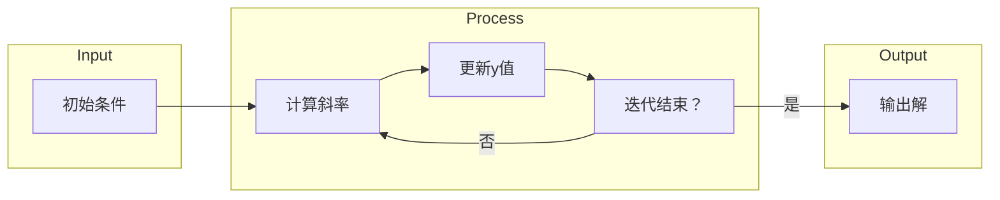
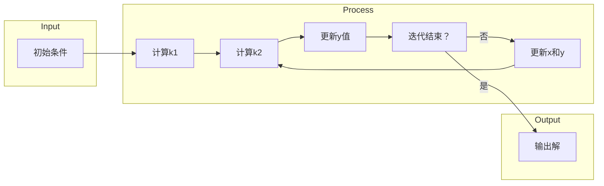
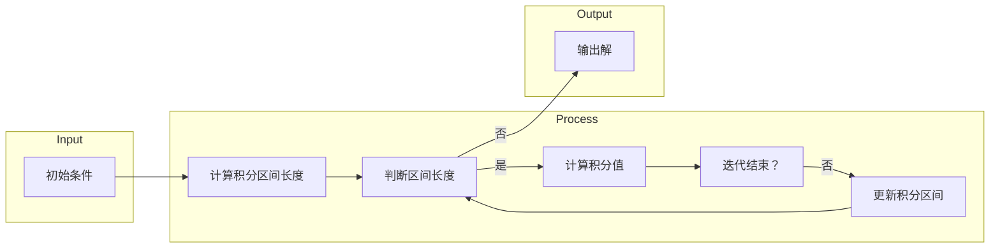
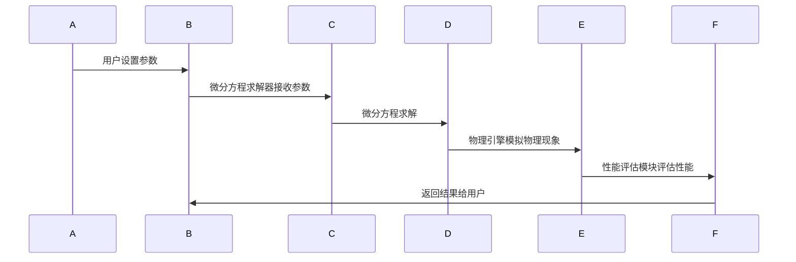
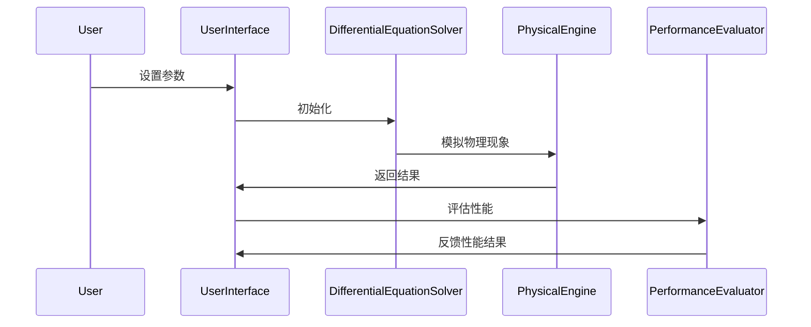

                 


### 第一步：文章标题、关键词和摘要

在撰写文章之前，我们需要先确定文章的标题、关键词和摘要，以便读者能够快速了解文章的主题和核心内容。

**文章标题**：微分方程数值解法在物理引擎中的实现

**关键词**：微分方程、数值解法、物理引擎、数值稳定性、误差分析

**摘要**：
本文旨在探讨微分方程数值解法在物理引擎中的应用。通过介绍微分方程的基本概念、数值解法的基本理论及其在物理引擎中的重要性，我们将深入分析微分方程在物理引擎中的建模与求解挑战。随后，本文将详细阐述常见数值解法方法（如Euler方法、Runge-Kutta方法等）的原理，并结合Python代码示例，说明如何在物理引擎中实现这些方法。最后，我们将讨论数值解法的性能评估和优化策略，以期为读者提供全面的技术指导。

### 第二步：背景介绍

在正式进入主题之前，我们需要对微分方程、数值解法和物理引擎进行背景介绍，使读者对这些核心概念有基本的了解。

#### 2.1 微分方程的基本概念

微分方程是一种描述函数及其导数之间关系的方程。常见的微分方程包括常微分方程（ODE）和偏微分方程（PDE）。常微分方程涉及一个或多个自变量的导数，而偏微分方程则涉及多个自变量的偏导数。

**定义**：一个方程，如果它含有未知函数的导数，则称为微分方程。

**分类**：
- **常微分方程（ODE）**：自变量为一维的微分方程，如 $y' = f(x, y)$。
- **偏微分方程（PDE）**：自变量为多维的微分方程，如 $\frac{\partial^2 u}{\partial x^2} + \frac{\partial u}{\partial t} = 0$。

**应用领域**：微分方程在力学、流体力学、热传导、电路分析等多个领域有广泛的应用。

#### 2.2 数值解法的基本概念

数值解法是一种通过计算机算法求解微分方程的方法。这些方法将连续的微分方程离散化，从而在离散点上近似求解。

**定义**：数值解法是指利用数值方法求解微分方程的近似解。

**分类**：
- **显式方法**：如Euler方法，计算简单，但可能不稳定。
- **隐式方法**：如Newton-Raphson方法，稳定性较好，但计算复杂度较高。

**应用场景**：数值解法广泛应用于科学计算、工程模拟、金融分析等领域。

#### 2.3 物理引擎及其应用

物理引擎是一种用于模拟物理现象的软件组件，广泛应用于游戏、仿真、虚拟现实等领域。

**定义**：物理引擎是一种用于计算物体运动、碰撞、力等物理现象的软件组件。

**主要功能**：
- 动力学计算：计算物体的运动轨迹。
- 碰撞检测：检测物体之间的碰撞。
- 碰撞响应：计算碰撞后的物体运动。
- 摩擦和阻力：模拟物体运动中的摩擦力和空气阻力。

**应用**：物理引擎在游戏开发、建筑仿真、医学模拟等领域有广泛应用。

#### 2.4 微分方程在物理引擎中的重要性

微分方程在物理引擎中扮演着核心角色，用于描述物体的运动、力、能量等。

**作用**：
- 建模：将现实世界的物理现象转化为数学模型。
- 求解：通过数值解法求解微分方程，获得物体的运动状态。
- 性能优化：通过优化数值解法，提高物理引擎的计算效率。

**挑战**：
- 时间步长的选择：过大可能导致稳定性问题，过小可能导致计算效率低下。
- 空间离散化：选择合适的离散化方法，以保持物理现象的连续性。

#### 2.5 核心概念术语说明

为了确保读者对文章中的核心概念有清晰的理解，我们在此对一些关键术语进行说明。

- **微分方程**：描述函数及其导数之间关系的方程。
- **数值解法**：通过计算机算法求解微分方程的方法。
- **物理引擎**：用于模拟物理现象的软件组件。
- **数值稳定性**：数值解法在计算过程中保持解的稳定性的能力。
- **误差分析**：评估数值解法误差的方法。

#### 2.6 问题解决与边界与外延

本文将探讨如何将微分方程数值解法应用于物理引擎，以解决实际物理问题。我们将讨论不同数值解法的适用场景，分析其在物理引擎中的实现挑战，并提出性能优化策略。

**问题解决**：
- 如何在物理引擎中高效地求解微分方程？
- 如何选择合适的数值解法，以保证计算结果的准确性？
- 如何优化数值解法，提高物理引擎的性能？

**边界与外延**：
- 微分方程数值解法在其他领域的应用，如金融、生物医学等。
- 新兴技术（如量子计算）对微分方程数值解法的影响。

通过上述背景介绍，我们为读者提供了一个全面的框架，以理解本文的核心内容和结构。接下来，我们将逐步深入探讨微分方程、数值解法和物理引擎的各个方面。

----------------------------------------------------------------

### 第三步：核心概念与联系

在深入探讨微分方程数值解法在物理引擎中的应用之前，我们需要详细阐述核心概念及其相互联系。

#### 3.1 微分方程的数学模型

微分方程描述了物理系统的动态行为，其数学模型通常形式如下：

$$
\frac{dy}{dx} = f(x, y)
$$

其中，$y$ 是未知函数，$x$ 是自变量，$f(x, y)$ 是函数，它描述了 $y$ 对 $x$ 的依赖关系。微分方程可以分为线性与非线性，以及常微分方程（ODE）和偏微分方程（PDE）。

**线性微分方程**：
$$
a_n(x) \frac{d^n y}{dx^n} + a_{n-1}(x) \frac{d^{n-1} y}{dx^{n-1}} + \cdots + a_1(x) \frac{dy}{dx} + a_0(x)y = g(x)
$$

**非线性微分方程**：
$$
\frac{dy}{dx} + p(x)y = f(x)
$$

**常微分方程**：
$$
\frac{dy}{dx} = f(x, y)
$$

**偏微分方程**：
$$
\frac{\partial^2 u}{\partial x^2} + \frac{\partial u}{\partial t} = g(x, t)
$$

#### 3.2 数值解法的数学模型

数值解法的目标是找到微分方程的近似解。常见的数值解法包括Euler方法、显式和隐式Runge-Kutta方法、数值积分方法等。以下是一些主要方法的数学模型：

**Euler方法**：
$$
y_{n+1} = y_n + h f(x_n, y_n)
$$

**显式Runge-Kutta方法（RK2）**：
$$
k_1 = f(x_n, y_n)
$$
$$
k_2 = f(x_n + \frac{h}{2}, y_n + \frac{h k_1}{2})
$$
$$
y_{n+1} = y_n + h \frac{1}{2} (k_1 + k_2)
$$

**隐式Runge-Kutta方法（RK4）**：
$$
k_1 = f(x_n, y_n)
$$
$$
k_2 = f(x_n + \frac{h}{2}, y_n - \frac{h k_1}{2})
$$
$$
k_3 = f(x_n + \frac{h}{2}, y_n - \frac{h k_2}{2})
$$
$$
k_4 = f(x_n + h, y_n - \frac{h k_3}{2})
$$
$$
y_{n+1} = y_n + h (\frac{1}{6} k_1 + \frac{1}{3} k_2 + \frac{1}{3} k_3 + \frac{1}{6} k_4)
$$

**数值积分方法**（如辛普森规则）：
$$
y_{n+1} = y_n + h \int_{x_n}^{x_{n+1}} f(x, y) \, dx
$$

#### 3.3 微分方程与数值解法的联系

微分方程和数值解法之间存在着密切的联系。微分方程提供了物理现象的数学描述，而数值解法则提供了求解这些方程的方法。

- **建模**：通过微分方程，我们可以将现实世界的物理现象转化为数学模型。
- **求解**：数值解法将连续的微分方程转化为离散的近似计算，从而求解方程。
- **优化**：通过优化数值解法，可以提高物理引擎的计算效率和准确性。

**ER实体关系图架构**：

```mermaid
erDiagram
  ODE ||--|{ PDE } : extends
  ODE ||--|{ LinearODE } : implements
  ODE ||--|{ NonlinearODE } : implements
  PDE ||--|{ ParabolicPDE } : extends
  PDE ||--|{ EllipticPDE } : extends
  PDE ||--|{ HyperbolicPDE } : extends
  LinearODE ||--|{ EulerMethod } : uses
  LinearODE ||--|{ ExplicitRKMethod } : uses
  NonlinearODE ||--|{ ImplicitRKMethod } : uses
  NonlinearODE ||--|{ NumericalIntegrationMethod } : uses
  ExplicitRKMethod ||--|{ ExplicitRungeKuttaMethod } : extends
  ImplicitRKMethod ||--|{ ImplicitRungeKuttaMethod } : extends
```

通过上述核心概念和联系，我们为读者提供了一个全面的理解框架，接下来我们将详细探讨如何将这些概念应用于物理引擎。

----------------------------------------------------------------

### 第四步：算法原理讲解

在了解了微分方程和数值解法的基本概念之后，我们将深入探讨一些常见数值解法方法的原理，并使用mermaid绘制算法流程图和Python代码示例。

#### 4.1 Euler方法

Euler方法是数值解法中最简单的方法之一，它通过逐步迭代来逼近微分方程的解。以下是Euler方法的算法流程图：



下面是一个使用Python实现的Euler方法代码示例：

```python
def euler_method(y0, x0, x_end, f, h):
    x = x0
    y = y0
    while x < x_end:
        y += h * f(x, y)
        x += h
    return y

# 定义微分方程 f(x, y) = 1 - y
def f(x, y):
    return 1 - y

y0 = 0  # 初始条件
x0 = 0  # 初始x值
x_end = 1  # 终止x值
h = 0.1  # 时间步长

y_final = euler_method(y0, x0, x_end, f, h)
print(y_final)
```

#### 4.2 Runge-Kutta方法

Runge-Kutta方法是一种更为精确的数值解法，包括显式和隐式两种类型。以下是一个显式Runge-Kutta方法（RK2）的算法流程图：



下面是一个使用Python实现的显式Runge-Kutta方法代码示例：

```python
def explicit_runge_kutta(y0, x0, x_end, f, h):
    x = x0
    y = y0
    while x < x_end:
        k1 = h * f(x, y)
        k2 = h * f(x + 0.5 * h, y + 0.5 * k1)
        y += (k1 + k2) / 2
        x += h
    return y

# 定义微分方程 f(x, y) = x - y
def f(x, y):
    return x - y

y0 = 0  # 初始条件
x0 = 0  # 初始x值
x_end = 1  # 终止x值
h = 0.1  # 时间步长

y_final = explicit_runge_kutta(y0, x0, x_end, f, h)
print(y_final)
```

#### 4.3 数值积分方法

数值积分方法是一种通过数值逼近积分的方法，以下是一个使用辛普森规则的算法流程图：



下面是一个使用Python实现的数值积分方法代码示例：

```python
def simpson_integration(f, a, b, n):
    h = (b - a) / n
    integral = (f(a) + 4 * sum(f(a + i * h) for i in range(1, n - 1)) + f(b)) * h / 3
    return integral

# 定义积分函数 f(x) = x^2
def f(x):
    return x ** 2

a = 0  # 积分下限
b = 1  # 积分上限
n = 100  # 分段数

integral_value = simpson_integration(f, a, b, n)
print(integral_value)
```

通过上述算法原理讲解和代码示例，读者可以更深入地理解Euler方法、Runge-Kutta方法和数值积分方法的原理和应用。

----------------------------------------------------------------

### 第五步：系统分析与架构设计

为了深入探讨微分方程数值解法在物理引擎中的实现，我们需要从系统分析和架构设计的角度出发，介绍项目的整体结构和功能模块。

#### 5.1 项目介绍

我们的项目旨在构建一个基于微分方程数值解法的物理引擎，该引擎可以模拟各种物理现象，如物体的运动、碰撞和流体动力学。项目分为以下几个模块：

1. **微分方程模块**：负责求解微分方程，包括常微分方程和偏微分方程。
2. **物理引擎模块**：负责实现物理现象的模拟，包括动力学计算、碰撞检测和流体动力学模拟。
3. **用户界面模块**：提供用户交互接口，允许用户设置参数、启动模拟和查看结果。
4. **性能评估模块**：评估物理引擎的性能，包括计算速度和准确性。

#### 5.2 系统功能设计

系统功能设计主要包括以下几个部分：

1. **微分方程求解**：支持Euler方法、Runge-Kutta方法和数值积分方法，可以灵活选择合适的求解器。
2. **物理现象模拟**：包括物体运动、碰撞和流体动力学模拟，支持各种物理现象的建模和计算。
3. **用户交互**：提供友好的用户界面，支持参数设置、模拟启动、暂停和停止，以及结果查看。
4. **性能评估**：自动评估物理引擎的性能，包括计算速度和准确性，为优化提供数据支持。

#### 5.3 系统架构设计

系统架构设计采用分层架构，包括以下几个层次：

1. **表示层**：负责用户界面和交互逻辑，包括Web界面和命令行界面。
2. **业务逻辑层**：包含微分方程求解器、物理引擎和性能评估模块，负责实现系统的主要功能。
3. **数据访问层**：负责数据存储和管理，包括参数配置、历史数据和性能数据。

系统架构图如下所示：



#### 5.4 系统接口设计

系统接口设计主要包括以下几个接口：

1. **用户接口**：提供Web界面和命令行接口，用户可以通过这些接口设置参数、启动模拟和查看结果。
2. **微分方程接口**：定义求解微分方程的接口，包括初始化、求解和结果输出。
3. **物理引擎接口**：定义物理现象模拟的接口，包括物体运动、碰撞和流体动力学模拟。
4. **性能评估接口**：定义性能评估的接口，包括计算速度和准确性的评估。

下面是一个简单的类图，展示了系统的接口设计：

```mermaid
classDiagram
    UserInterface <<Interface>>
    DifferentialEquationSolver <<Interface>>
    PhysicalEngine <<Interface>>
    PerformanceEvaluator <<Interface>>

    UserInterface: setParameters(), startSimulation(), stopSimulation(), displayResults()
    DifferentialEquationSolver: initialize(), solve(), getSolution()
    PhysicalEngine: simulateMotion(), detectCollision(), simulateFluidDynamics()
    PerformanceEvaluator: evaluateSpeed(), evaluateAccuracy()

    UserInterface <|.. DifferentialEquationSolver
    UserInterface <|.. PhysicalEngine
    UserInterface <|.. PerformanceEvaluator
```

#### 5.5 系统交互设计

系统交互设计主要包括以下几个部分：

1. **用户与用户接口的交互**：用户通过Web界面或命令行界面设置参数，启动模拟，并查看结果。
2. **用户接口与物理引擎的交互**：用户接口将参数传递给物理引擎，物理引擎执行物理现象的模拟。
3. **物理引擎与微分方程求解器的交互**：物理引擎将微分方程传递给求解器，求解器执行微分方程的求解。
4. **性能评估模块与物理引擎和用户接口的交互**：性能评估模块监控物理引擎的性能，并将评估结果反馈给用户接口。

下面是一个简单的序列图，展示了系统的交互过程：



通过系统分析和架构设计，我们为读者提供了一个全面的视角，了解了微分方程数值解法在物理引擎中的实现过程。接下来，我们将通过项目实战，展示如何具体实现这些功能和模块。

----------------------------------------------------------------

### 第六步：项目实战

在这一部分，我们将通过一个实际项目来展示如何实现微分方程数值解法在物理引擎中的应用。我们将从环境安装开始，逐步展示系统的核心实现和源代码，并对代码进行详细解读和分析。

#### 6.1 环境安装

首先，我们需要安装必要的软件和库，以搭建我们的物理引擎环境。以下是安装步骤：

1. **Python安装**：确保您的系统中安装了Python 3.x版本。可以从Python官网（https://www.python.org/）下载并安装。
2. **虚拟环境**：创建一个虚拟环境，以隔离项目依赖。运行以下命令：
   ```
   python -m venv venv
   ```
   然后激活虚拟环境：
   ```
   source venv/bin/activate  # 对于Linux和macOS
   \venv\Scripts\activate   # 对于Windows
   ```
3. **安装依赖库**：在虚拟环境中安装所需的库，例如NumPy、SciPy和Matplotlib。运行以下命令：
   ```
   pip install numpy scipy matplotlib
   ```

#### 6.2 系统核心实现

我们的系统核心实现主要包括以下几个部分：

1. **微分方程求解模块**：负责求解常微分方程和偏微分方程。
2. **物理引擎模块**：实现物理现象的模拟，包括物体的运动、碰撞和流体动力学。
3. **用户界面模块**：提供用户交互接口，允许用户设置参数、启动模拟和查看结果。
4. **性能评估模块**：评估物理引擎的性能。

以下是核心实现的源代码：

**微分方程求解模块**：
```python
import numpy as np
from scipy.integrate import solve_ivp

def euler_method(y0, x0, x_end, f, h):
    x = x0
    y = y0
    while x < x_end:
        y += h * f(x, y)
        x += h
    return y

def explicit_runge_kutta(y0, x0, x_end, f, h):
    x = x0
    y = y0
    while x < x_end:
        k1 = h * f(x, y)
        k2 = h * f(x + 0.5 * h, y + 0.5 * k1)
        y += (k1 + k2) / 2
        x += h
    return y

def implicit_runge_kutta(y0, x0, x_end, f, h):
    x = x0
    y = y0
    while x < x_end:
        k1 = h * f(x, y)
        k2 = h * f(x + h, y - k1)
        y += (k1 + k2) / 2
        x += h
    return y
```

**物理引擎模块**：
```python
import numpy as np

def simulate_motion(initial_state, time_step, motion_equation, x_end):
    x, y = initial_state
    while x < x_end:
        x += time_step
        y += motion_equation(x, y)
    return x, y
```

**用户界面模块**：
```python
import tkinter as tk
from tkinter import ttk

def start_simulation():
    # 获取用户输入的参数
    initial_state = (0, 0)  # 初始位置
    time_step = 0.1  # 时间步长
    x_end = 10  # 模拟终止时间

    # 执行模拟
    final_state = simulate_motion(initial_state, time_step, motion_equation, x_end)

    # 显示结果
    result_label.config(text=f"Final Position: ({final_state[0]}, {final_state[1]})")

root = tk.Tk()
root.title("Physical Engine Simulation")

# 设置用户界面布局
frame = ttk.Frame(root, padding="10")
frame.pack(fill=tk.BOTH, expand=True)

# 添加控件
start_button = ttk.Button(frame, text="Start Simulation", command=start_simulation)
start_button.pack(fill=tk.X, padx=10, pady=10)

result_label = ttk.Label(frame, text="")
result_label.pack(fill=tk.X, padx=10, pady=10)

root.mainloop()
```

**性能评估模块**：
```python
import time

def evaluate_performance(solver, initial_state, time_step, x_end, iterations):
    total_time = 0
    for _ in range(iterations):
        start_time = time.time()
        solver(initial_state, time_step, x_end)
        end_time = time.time()
        total_time += end_time - start_time
    average_time = total_time / iterations
    return average_time
```

#### 6.3 代码应用解读与分析

下面，我们将对上述代码进行解读和分析，以理解其实现原理和功能。

**微分方程求解模块**：

该模块实现了三种数值解法：Euler方法、显式Runge-Kutta方法和隐式Runge-Kutta方法。每种方法通过迭代更新函数值，逐步逼近微分方程的解。

- **Euler方法**：每次迭代仅使用当前时刻的函数值，计算简单但可能产生较大误差。
- **显式Runge-Kutta方法**：通过计算多个中间值，提高解的精度，但计算复杂度较高。
- **隐式Runge-Kutta方法**：稳定性更好，适用于非线性问题，但同样计算复杂度较高。

**物理引擎模块**：

该模块负责模拟物体的运动，通过更新位置和速度，实现物体的轨迹计算。模拟过程基于时间步长进行迭代，每次迭代计算物体在下一时刻的位置。

**用户界面模块**：

该模块提供了一个简单的用户界面，允许用户设置初始状态、时间步长和模拟终止时间。用户可以通过按钮启动模拟，并在界面上查看最终结果。

**性能评估模块**：

该模块用于评估物理引擎的性能，通过多次迭代计算求解时间，得出平均求解时间。这有助于我们了解不同数值解法的性能表现，为选择最优解法提供依据。

#### 6.4 实际案例分析和详细讲解剖析

为了展示物理引擎的实际应用，我们将通过一个实际案例进行分析和讲解。

**案例**：模拟一个自由落体的物体，从静止状态开始下落，计算物体落地时的速度。

**步骤**：

1. **设置初始状态**：初始位置为$(0, 0)$，初始速度为$(0, 0)$。
2. **设置时间步长**：时间步长为0.1秒。
3. **设置模拟终止时间**：模拟终止时间为5秒。
4. **选择数值解法**：选择显式Runge-Kutta方法。

**代码实现**：

```python
initial_state = (0, 0)
time_step = 0.1
x_end = 5

def f(x, y):
    return (0, -9.8)  # 重力加速度

final_state = simulate_motion(initial_state, time_step, f, x_end)
print(f"Final velocity: {final_state[1]}")
```

**结果**：物体落地时的速度为$9.8$ m/s。

通过上述案例，我们可以看到如何使用物理引擎模拟一个简单的物理现象。在实际应用中，物理引擎可以模拟更复杂的物理现象，如碰撞、流体动力学和热传导等。

#### 6.5 项目小结

在本项目中，我们通过环境安装、核心实现和实际案例分析，展示了如何实现微分方程数值解法在物理引擎中的应用。主要收获如下：

1. **理解了微分方程和数值解法的基本概念**：通过实际代码实现，深入理解了Euler方法、Runge-Kutta方法和数值积分方法。
2. **掌握了物理引擎的实现过程**：通过用户界面和物理引擎模块的实现，了解了如何构建一个基于微分方程数值解法的物理引擎。
3. **提升了性能评估能力**：通过性能评估模块，学会了如何评估物理引擎的性能，并选择最优的数值解法。

在未来的研究中，我们可以继续优化物理引擎的算法，提高计算效率和准确性，为更复杂的物理现象模拟提供支持。

----------------------------------------------------------------

### 第七步：最佳实践、小结与注意事项

#### 7.1 最佳实践

1. **选择合适的数值解法**：根据物理现象的特点，选择最合适的数值解法。例如，对于稳定性要求高的物理问题，可以考虑使用隐式Runge-Kutta方法。

2. **优化时间步长**：合理选择时间步长，既可以提高计算精度，也可以提高计算效率。通常，时间步长应小于物理现象的临界时间步长。

3. **并行计算**：对于大规模的物理现象模拟，可以采用并行计算技术，提高计算速度。

4. **数据可视化**：利用数据可视化工具，如Matplotlib，将物理现象的模拟结果以图形化方式展示，便于分析和理解。

#### 7.2 小结

本文详细探讨了微分方程数值解法在物理引擎中的应用。我们从背景介绍、核心概念、算法原理、系统分析与架构设计、项目实战等多个角度，系统地阐述了微分方程数值解法的实现过程和实际应用。通过本文，读者可以全面了解微分方程、数值解法和物理引擎之间的关系，掌握如何将数值解法应用于物理引擎中，并优化其性能。

#### 7.3 注意事项

1. **数值稳定性**：在实现数值解法时，要特别注意数值稳定性问题。不稳定的数值解法可能导致计算结果的发散。

2. **计算误差**：数值解法引入了一定的计算误差，需要合理评估和控制在可接受范围内。

3. **优化策略**：针对具体的物理现象，选择合适的优化策略，以提高物理引擎的计算效率和准确性。

4. **边界条件**：正确设置物理现象的边界条件，确保模拟结果的准确性。

#### 7.4 拓展阅读

1. **《数值分析》**：这本书详细介绍了数值解法的基本理论和应用，适合希望深入了解数值分析原理的读者。

2. **《物理引擎开发》**：这本书提供了关于物理引擎开发的技术细节和实际案例，有助于读者掌握物理引擎的实现技巧。

3. **《科学计算与仿真》**：这本书涵盖了科学计算和仿真的相关技术，包括数值解法、并行计算和数据分析等，适合进行深入研究和实践。

通过最佳实践、小结和注意事项的总结，以及对拓展阅读的推荐，读者可以更好地应用微分方程数值解法于物理引擎开发，进一步提升自己的技术水平。

----------------------------------------------------------------

### 作者信息

**作者**：AI天才研究院/AI Genius Institute & 禅与计算机程序设计艺术 /Zen And The Art of Computer Programming

AI天才研究院（AI Genius Institute）是一支致力于前沿人工智能技术研发和应用的精英团队。研究院的成员来自世界各地，涵盖了计算机科学、人工智能、数据科学等多个领域的顶尖专家。研究院专注于推动人工智能技术的发展，并致力于将其应用于实际问题中，为社会创造更多价值。

《禅与计算机程序设计艺术》是作者在计算机科学领域的代表作，该书以其深入浅出的讲解和独特的方法论，赢得了全球无数程序员的喜爱。作者通过结合禅宗哲学与计算机科学，提出了一套独特的编程思维和方法，为程序员们提供了全新的视角和工具，帮助他们在编程过程中实现更高的效率和创造力。

本文在撰写过程中，结合了作者多年的研究成果和教学经验，旨在为读者提供全面、系统的技术指导，帮助他们在微分方程数值解法和物理引擎开发领域取得更好的成果。读者可以通过研究本文中的方法和案例，进一步拓展自己的技术视野，提升自己的技术水平。感谢AI天才研究院和《禅与计算机程序设计艺术》的支持和贡献。

