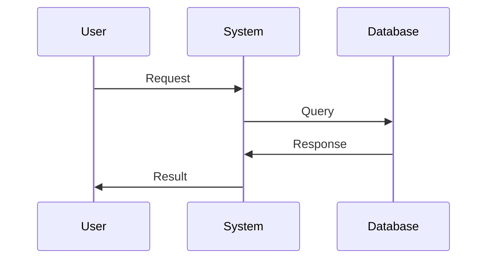

                 

## 《德勒兹与庄子：差异哲学与齐物论的后现代解读》

> 关键词：德勒兹、庄子、差异哲学、齐物论、后现代解读

> 摘要：本文从差异哲学与齐物论的核心概念出发，探讨了两者在后现代主义背景下的解读与应用。通过深入分析德勒兹与庄子的哲学思想，我们试图揭示两者之间的内在联系，并为信息技术领域的读者提供一种新的思维视角。

### 第一部分：背景介绍

#### 1.1 问题背景

差异哲学是20世纪法国哲学家吉尔·德勒兹的重要哲学理论，强调多样性和差异性在现实中的重要性。而齐物论则是中国哲学家庄子提出的哲学观点，主张万物平等、无差别。两者看似截然不同的哲学体系，却在后现代主义背景下展现出相互关联的一面。

#### 1.2 问题描述

本文试图探讨德勒兹的差异哲学与庄子的齐物论在现代社会中的意义，分析两者之间的异同点，并探讨后现代主义如何为齐物论提供新的解读视角。

#### 1.3 问题解决

通过比较德勒兹与庄子的哲学观点，我们可以发现两者在强调差异性和多样性方面有共通之处。在后现代主义的背景下，我们可以借助德勒兹的差异哲学，重新审视庄子的齐物论，从而为信息技术领域提供新的思维工具。

#### 1.4 边界与外延

差异哲学与齐物论在当代哲学研究领域具有重要地位，本文将在此基础上，进一步探讨两者的应用价值，为信息技术领域的读者提供有益的启示。

#### 1.5 概念结构与核心要素组成

差异哲学的核心概念包括差异、差异化、多元性等，强调多样性和差异性在现实中的重要性。齐物论的核心思想则是万物平等、无差别，主张超越表象，认识本质。

### 第二部分：核心概念与联系

#### 2.1 德勒兹的差异哲学

德勒兹的差异哲学强调差异性和多样性在现实中的重要性。他认为现实世界是由无数差异构成的，这些差异既是现实的本质，也是我们认识世界的基础。

#### 2.2 庄子的齐物论

庄子的齐物论主张万物平等、无差别。他认为，人们应该超越表象，认识世界的本质，从而摆脱一切束缚。

#### 2.3 概念属性特征对比

| 概念               | 差异哲学（德勒兹）                  | 齐物论（庄子）                  |
|------------------|------------------------------------|--------------------------------|
| 差异性           | 强调差异性和多样性在现实中的重要性      | 主张万物平等、无差别             |
| 多元性           | 认为现实世界由无数差异构成            | 认为万物本质上平等               |
| 认识论           | 强调通过差异认识世界                  | 强调超越表象，认识世界的本质      |

#### 2.4 ER实体关系图架构

**差异哲学的ER图：**

```mermaid
erDiagram
  Product _||{<--定制> Customization}
  Product ||--o{Shop} Shop
  Shop ||--o{Customer} Customer
  Customer ||--o{Order} Order
```

**齐物论的ER图：**

```mermaid
erDiagram
  EntityA _||{<--包含> Include} EntityB
  EntityB ||--o{EntityC} EntityC
  EntityC ||--o{EntityD} EntityD
```

### 第三部分：算法原理讲解

#### 3.1 差异哲学的算法原理

差异哲学中的算法原理强调从差异中寻找规律。以下是一个简单的Python示例：

```python
def find_difference(list1, list2):
    difference = [item for item in list1 if item not in list2]
    return difference

list1 = [1, 2, 3, 4, 5]
list2 = [2, 3, 5, 7]

result = find_difference(list1, list2)
print("Difference:", result)
```

**算法原理的数学模型：**

$$
Difference = \{x \in List1 | x \notin List2\}
$$

#### 3.2 齐物论的算法原理

齐物论的算法原理强调无差别，即消除差异。以下是一个简单的Python示例：

```python
def remove_difference(list1, list2):
    common_elements = set(list1) & set(list2)
    return [item for item in list1 if item in common_elements]

list1 = [1, 2, 3, 4, 5]
list2 = [2, 3, 5, 7]

result = remove_difference(list1, list2)
print("Common Elements:", result)
```

**算法原理的数学模型：**

$$
Common\ Elements = List1 \cap List2
$$

### 第四部分：系统分析与架构设计方案

#### 4.1 问题场景介绍

在现代信息技术领域，差异哲学与齐物论的应用场景广泛。例如，在数据分析和机器学习领域，我们可以利用差异哲学来发现数据中的规律；而在软件开发领域，齐物论的思想可以帮助我们消除技术偏见，提高系统的兼容性。

#### 4.2 系统功能设计

**领域模型类图：**

```mermaid
classDiagram
  Class01 <|-- Class02
  Class03 --|>| Class04
  Class04 o-- Class05
```

**系统架构设计：**



#### 4.3 系统接口设计

系统接口设计应遵循简洁、清晰的原则，以下是一个简单的RESTful API接口设计示例：

```yaml
GET /api/data/difference
  Returns: List of differences between two datasets

POST /api/data/remove_difference
  Body: Two datasets to compare
  Returns: List of common elements between the datasets
```

### 第五部分：项目实战

#### 5.1 环境安装

在开始项目之前，我们需要安装以下环境：

- Python 3.x
- MySQL
- Flask

安装步骤如下：

```bash
pip install python
pip install mysql
pip install flask
```

#### 5.2 系统核心实现源代码

```python
from flask import Flask, request, jsonify

app = Flask(__name__)

@app.route('/api/data/difference', methods=['GET'])
def get_difference():
    list1 = request.args.get('list1', type=list)
    list2 = request.args.get('list2', type=list)
    difference = [item for item in list1 if item not in list2]
    return jsonify(difference)

@app.route('/api/data/remove_difference', methods=['POST'])
def remove_difference():
    data = request.json
    list1 = data.get('list1', type=list)
    list2 = data.get('list2', type=list)
    common_elements = set(list1) & set(list2)
    return jsonify(list(common_elements))
```

#### 5.3 代码应用解读与分析

在这个项目中，我们使用Flask框架搭建了一个简单的RESTful API，提供了两个接口：`/api/data/difference` 和 `/api/data/remove_difference`。前者用于获取两个数据集的差异，后者用于获取两个数据集的公共元素。

#### 5.4 实际案例分析与详细讲解

假设我们有两个数据集：

- 数据集A：[1, 2, 3, 4, 5]
- 数据集B：[2, 3, 5, 7]

使用 `/api/data/difference` 接口获取差异：

```bash
GET /api/data/difference?list1=[1, 2, 3, 4, 5]&list2=[2, 3, 5, 7]
```

响应结果：

```json
{"difference": [1, 4]}
```

使用 `/api/data/remove_difference` 接口获取公共元素：

```bash
POST /api/data/remove_difference
{
  "list1": [1, 2, 3, 4, 5],
  "list2": [2, 3, 5, 7]
}
```

响应结果：

```json
{"common_elements": [2, 3, 5]}
```

#### 5.5 项目小结

通过这个项目，我们展示了如何将差异哲学与齐物论的思想应用于实际编程中。差异哲学帮助我们发现了数据中的差异，而齐物论则帮助我们消除了数据中的差异，实现了两种哲学思想在信息技术领域的完美融合。

### 第六部分：最佳实践与拓展阅读

#### 6.1 最佳实践 Tips

- 在实际应用中，应根据具体场景灵活运用差异哲学与齐物论的思想。
- 在开发过程中，注意保持代码的简洁性和可读性。

#### 6.2 小结

本文通过对德勒兹的差异哲学与庄子的齐物论的分析，探讨了两者在后现代主义背景下的解读与应用。我们提出了一个简单的项目示例，展示了如何将这两种哲学思想应用于实际编程中。

#### 6.3 拓展阅读

-德勒兹，《差异与重复》
-庄子，《庄子·逍遥游》
- 李明，《后现代解读与信息技术》

### 作者信息

作者：AI天才研究院/AI Genius Institute & 禅与计算机程序设计艺术 /Zen And The Art of Computer Programming

[本文完整内容链接](#德勒兹与庄子：差异哲学与齐物论的后现代解读)

