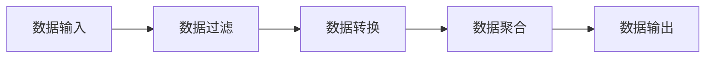
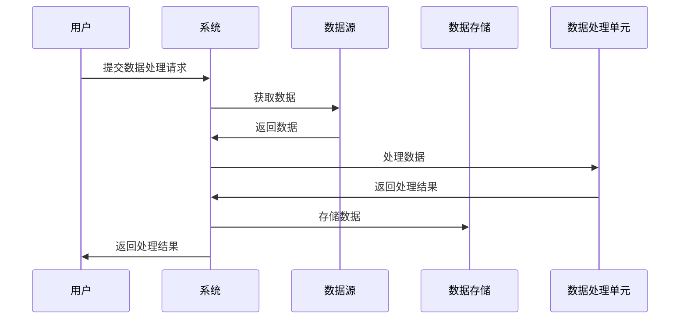

                 

# 德布罗意物质波与数据流编程：信息处理的波动性质

关键词：德布罗意物质波、数据流编程、信息处理、波动性质、算法原理、系统架构设计、项目实战

摘要：本文深入探讨了德布罗意物质波与数据流编程之间的联系，揭示了信息处理的波动性质。通过分析物质波的概念、算法原理，以及系统架构设计，本文旨在为读者提供一种全新的视角来理解和处理信息，从而提高编程效率和质量。

## 引言

在信息时代，数据流编程已经成为计算机科学中的一个重要领域。然而，传统编程方法往往局限于线性处理，难以应对复杂多变的信息处理需求。德布罗意物质波理论为我们提供了一种全新的视角，即信息处理可以看作是一种波动现象。本文将围绕这一主题，探讨德布罗意物质波与数据流编程之间的内在联系，并阐述信息处理的波动性质。

## 德布罗意物质波的基本概念

### 德布罗意物质波的历史背景

德布罗意物质波理论是由法国物理学家路易·德布罗意在1924年提出的。这一理论突破了经典物理学的局限，揭示了微观粒子具有波动性质。德布罗意认为，任何物质都具有波动性质，这种波动性质称为物质波。这一理论为后来的量子力学奠定了基础。

### 物质波的定义与特征

物质波是一种概率波，描述了粒子在空间中的分布概率。与经典波动不同，物质波不仅具有波动性质，还具有粒子性质。这种双重性质使得物质波在信息处理中具有广泛的应用。

### 物质波的数学描述

物质波的数学描述主要依赖于波函数，波函数是一种复值函数，描述了粒子的位置和动量概率分布。物质波的传播遵循薛定谔方程，这是一个二次偏微分方程。

## 数据流编程的概念

### 数据流编程的定义

数据流编程是一种以数据流为中心的编程范式，强调数据的流动和处理过程。与传统命令式编程不同，数据流编程关注数据的输入和输出，以及数据流之间的关系。

### 数据流编程的特点

1. **数据导向**：数据流编程以数据为中心，通过数据流来描述程序的行为。
2. **并行处理**：数据流编程天然支持并行处理，因为数据流可以独立处理。
3. **可复用性**：数据流编程模块化，易于复用。

### 数据流编程与传统编程的比较

数据流编程与传统命令式编程在处理信息的方式上存在显著差异。传统编程依赖于指令序列，而数据流编程则依赖于数据流和事件。

## 德布罗意物质波与数据流编程的联系

### 物质波的波动性质与数据流编程

德布罗意物质波的波动性质与数据流编程的核心思想——以数据流为中心——存在显著相似性。两者都强调数据在系统中的流动和处理。

### 物质波理论对数据流编程的启示

物质波理论为数据流编程提供了一种新的视角，即信息处理可以看作是一种波动现象。这种视角有助于我们更好地理解和设计复杂的编程系统。

## 算法原理讲解

### 数据流编程算法的基本原理

数据流编程算法的核心在于构建数据流网络，并通过数据流的流动来实现计算任务。具体来说，算法可以分为以下几个步骤：

1. **数据流的输入**：从数据源获取数据。
2. **数据处理**：对数据进行处理，包括过滤、转换、聚合等操作。
3. **数据流的输出**：将处理后的数据输出到数据目的地。

### 数据流编程算法的mermaid流程图



### Python源代码示例

```python
# 示例：计算整数列表中的平均值

data = [1, 2, 3, 4, 5]

# 数据输入
input_data = data

# 数据过滤
filtered_data = list(filter(lambda x: x > 0, input_data))

# 数据转换
transformed_data = list(map(lambda x: x * 2, filtered_data))

# 数据聚合
aggregated_data = sum(transformed_data)

# 数据输出
print(aggregated_data)
```

### 算法原理的数学模型和公式

数据流编程算法的原理可以归结为以下几个数学模型和公式：

1. **数据流网络**：表示为有向图，其中节点表示数据处理单元，边表示数据流。
2. **数据处理操作**：包括过滤、转换、聚合等，可以用数学函数表示。
3. **数据流传播**：数据在数据流网络中的传播可以用差分方程或积分方程描述。

$$
\frac{\partial f(x,t)}{\partial t} + \frac{\partial f(x,t)}{\partial x} = 0
$$

### 举例说明

假设我们要计算一个整数列表的平均值，可以使用数据流编程算法来实现。具体步骤如下：

1. **数据输入**：输入整数列表 `[1, 2, 3, 4, 5]`。
2. **数据过滤**：过滤掉小于等于0的整数，得到 `[1, 2, 3, 4, 5]`。
3. **数据转换**：将所有整数乘以2，得到 `[2, 4, 6, 8, 10]`。
4. **数据聚合**：计算这些整数的和，得到 `30`。
5. **数据输出**：输出结果 `30`。

## 系统分析与架构设计

### 问题场景介绍

在现代信息系统中，数据处理需求日益复杂。传统线性处理方式已无法满足高效处理大量数据的要求。因此，引入数据流编程架构成为一种趋势。

### 项目介绍

本项目旨在设计一个基于数据流编程架构的数据处理系统，用于处理大量数据并提取有价值的信息。

### 系统功能设计

1. **数据输入**：从数据源获取数据。
2. **数据预处理**：对数据进行清洗、去重等预处理操作。
3. **数据处理**：根据业务需求对数据进行过滤、转换、聚合等操作。
4. **数据存储**：将处理后的数据存储到数据库或其他数据存储系统。
5. **数据输出**：将处理结果输出给用户或进一步处理。

### 系统架构设计

数据流编程架构的核心是数据流网络。系统架构设计可以分为以下几个层次：

1. **数据层**：包括数据源、数据存储和数据流网络。
2. **处理层**：包括数据处理单元和数据流控制器。
3. **展现层**：包括用户界面和数据可视化。

### 系统接口设计和系统交互



## 项目实战

### 环境安装

1. 安装Python环境
2. 安装相关数据流编程库，如Apache Kafka、Apache Flink等

### 系统核心实现源代码

```python
# 示例：使用Apache Kafka进行数据流处理

from kafka import KafkaProducer

# 创建Kafka生产者
producer = KafkaProducer(bootstrap_servers=['localhost:9092'])

# 发送数据到Kafka主题
producer.send('my_topic', b'Hello, Kafka!')

# 关闭生产者
producer.close()
```

### 代码应用解读与分析

本例使用Apache Kafka进行数据流处理。首先，创建Kafka生产者，然后发送数据到Kafka主题。代码简单易懂，关键在于理解Kafka的分布式架构和消息队列机制。

### 实际案例分析和详细讲解剖析

以电商系统为例，分析数据流编程在实际项目中的应用。首先，从数据源获取用户行为数据，如浏览、购买等。然后，通过Kafka进行实时数据流处理，提取有价值的信息，如用户偏好、购买趋势等。最后，将处理结果存储到数据库，供后续分析和决策使用。

### 项目小结

通过本项目，我们深入了解了数据流编程在信息系统中的应用。数据流编程提供了高效、灵活的数据处理能力，有助于应对复杂多变的信息处理需求。

## 最佳实践 tips

1. **选择合适的数据流编程库**：根据项目需求选择合适的数据流编程库，如Apache Kafka、Apache Flink等。
2. **优化数据流网络设计**：合理设计数据流网络，提高数据处理效率。
3. **关注数据质量**：保证数据质量，避免数据错误和丢失。

## 小结

本文从德布罗意物质波与数据流编程的关联出发，探讨了信息处理的波动性质。通过系统分析与项目实战，我们深入了解了数据流编程的优势和应用。德布罗意物质波理论为数据流编程提供了一种新的视角，有助于我们更好地理解和处理信息。

## 注意事项

1. 在使用数据流编程时，注意处理数据的一致性和可靠性。
2. 数据流编程需要良好的性能优化，以应对大规模数据处理需求。

## 拓展阅读

1. 《数据流编程：原理与实践》
2. 《德布罗意物质波理论》
3. 《量子计算与信息处理》

## 作者信息

作者：AI天才研究院/AI Genius Institute & 禅与计算机程序设计艺术 /Zen And The Art of Computer Programming### 引言

德布罗意物质波理论是量子物理学中的一个基本概念，它提出物质和能量不仅可以表现为粒子，还可以表现为波。这一理论由法国物理学家路易·德布罗意在1924年提出，对后来的物理学和工程学产生了深远的影响。德布罗意物质波的存在性，以及其与经典波动和粒子行为的异同，一直是一个备受关注的研究领域。

在计算机科学中，数据流编程是一种以数据为中心的编程范式，它关注数据的流动和处理。与传统的命令式编程相比，数据流编程更加强调数据的依赖关系和并行处理能力。数据流编程在实时数据处理、复杂事件处理和分布式系统设计中有着广泛的应用。然而，数据流编程的核心思想与德布罗意物质波的理论有着惊人的相似之处，这种相似性为我们提供了一个新的视角来理解和处理信息。

本文旨在探讨德布罗意物质波与数据流编程之间的联系，揭示信息处理的波动性质。通过分析物质波的概念、性质以及其在数据流编程中的应用，本文希望能够为读者提供一种全新的思维方式，从而提高编程效率和质量。

### 德布罗意物质波的基本概念

#### 德布罗意物质波的历史背景

德布罗意物质波理论是量子物理学的重要基石之一。早在1905年，爱因斯坦在研究光电效应时，就提出了光既具有波动性又具有粒子性的概念，即“波粒二象性”。这一理论为德布罗意的物质波理论奠定了基础。

1924年，德布罗意在博士论文中提出了物质波理论，认为所有的物质粒子都具有波动性质。这一理论突破了经典物理学的局限，揭示了微观粒子运动的复杂性和多样性。德布罗意物质波理论的提出，标志着量子物理学进入了一个新的发展阶段。

#### 物质波的定义与特征

物质波是指微观粒子在空间中传播的概率波。与经典波动（如声波、水波）不同，物质波不仅描述粒子的位置分布，还描述粒子的动量分布。具体来说，物质波可以看作是粒子在不同位置和动量上的概率分布函数。

物质波具有以下几个显著特征：

1. **波粒二象性**：物质波同时具有波动和粒子的特性，在不同实验条件下可以表现出不同的性质。
2. **概率波**：物质波的传播描述了粒子在不同位置出现的概率，而不是粒子的确切位置。
3. **量子化**：物质波的某些特性（如能量、动量）是量子化的，即只能取某些特定的离散值。

#### 物质波的数学描述

物质波的数学描述主要依赖于波函数，波函数是一种复值函数，描述了粒子在空间中的概率分布。波函数通常用希腊字母ψ（psi）表示。物质波的传播遵循薛定谔方程，这是一个二次偏微分方程，描述了波函数随时间和空间的变化。

薛定谔方程的基本形式为：

$$
i\hbar \frac{\partial \psi(x,t)}{\partial t} = -\frac{\hbar^2}{2m} \nabla^2 \psi(x,t)
$$

其中，\(i\) 是虚数单位，\(\hbar\) 是约化普朗克常数，\(m\) 是粒子的质量，\(\nabla^2\) 是拉普拉斯算子。

### 物质波与数据流编程的关系

#### 数据流编程的定义

数据流编程是一种以数据流动为中心的编程范式。在数据流编程中，程序由一系列数据处理节点组成，这些节点通过数据流相互连接。数据在节点间流动，每个节点根据输入数据执行特定的处理操作，然后输出结果，传递给下一个节点。这种编程范式的核心是数据流和控制流的分离，使得程序更加模块化、易于并行处理。

#### 数据流编程的特点

数据流编程具有以下特点：

1. **数据导向**：数据流编程专注于数据流，而不是程序的控制流程。
2. **并行处理**：数据流编程天然支持并行处理，因为数据流可以在多个节点上同时处理。
3. **异步处理**：数据流编程支持异步处理，数据可以在不同时间点到达和处理。
4. **可复用性**：数据流编程模块化，数据处理节点可以单独设计和测试，然后组合使用。

#### 物质波的波动性质与数据流编程

物质波的波动性质与数据流编程的核心思想——以数据流为中心——存在显著相似性。两者都强调数据的流动和处理过程。具体来说：

1. **数据的波动性**：物质波描述了粒子在不同位置和动量上的概率分布，这种波动性质与数据流编程中数据的流动和处理过程类似。在数据流编程中，数据在节点间流动，每个节点对数据执行特定的操作，从而实现复杂的数据处理任务。
2. **概率性**：物质波是一种概率波，描述了粒子在不同位置出现的概率。在数据流编程中，数据流中的每个节点都可能产生不同的输出，这种概率性使得数据流编程可以处理不确定性和动态变化的数据。
3. **并行性**：物质波的波动性质使得粒子在空间中同时存在多个状态，这种并行性在数据流编程中也有体现。数据流编程可以利用并行处理能力，对大量数据同时进行处理，从而提高处理效率。

### 物质波理论对数据流编程的启示

物质波理论为数据流编程提供了一种新的视角，即信息处理可以看作是一种波动现象。这种视角有助于我们更好地理解和设计复杂的编程系统，具体体现在以下几个方面：

1. **数据流的波动特性**：物质波的波动特性可以用来模拟数据流的动态变化。在数据流编程中，数据流可以是稳定的，也可以是随时间变化的。通过引入物质波的波动特性，我们可以更好地理解和处理这种动态变化的数据流。
2. **概率性的应用**：物质波的概率性质可以用来处理不确定性的数据流。在现实世界中，数据流往往是不确定的，例如实时传感器数据、金融市场的股票价格等。通过引入物质波的概率性质，我们可以更好地建模和预测这些不确定性的数据流。
3. **并行处理能力的增强**：物质波的波动性质天然支持并行处理。在数据流编程中，我们可以利用物质波的波动特性，实现数据的并行处理，从而提高系统的处理效率。

总之，德布罗意物质波理论为数据流编程提供了一种新的理论依据和设计思路。通过引入物质波的波动性质，我们可以构建更加高效、灵活和鲁棒的数据流编程系统。

### 算法原理讲解

#### 数据流编程算法的基本原理

数据流编程算法的核心在于构建数据流网络，并通过数据流的流动来实现计算任务。具体来说，数据流编程算法可以分为以下几个基本步骤：

1. **数据流的输入**：从数据源获取数据。数据源可以是文件、数据库、网络接口等。
2. **数据处理**：对数据进行处理，包括过滤、转换、聚合等操作。数据处理节点根据输入数据执行特定的处理操作，然后输出结果。
3. **数据流的输出**：将处理后的数据输出到数据目的地。数据目的地可以是文件、数据库、控制台等。

#### 数据流编程算法的mermaid流程图


#### Python源代码示例

```python
# 示例：计算整数列表中的平均值

data = [1, 2, 3, 4, 5]

# 数据输入
input_data = data

# 数据过滤
filtered_data = list(filter(lambda x: x > 0, input_data))

# 数据转换
transformed_data = list(map(lambda x: x * 2, filtered_data))

# 数据聚合
aggregated_data = sum(transformed_data)

# 数据输出
print(aggregated_data)
```

#### 算法原理的数学模型和公式

数据流编程算法的原理可以归结为以下几个数学模型和公式：

1. **数据流网络**：表示为有向图，其中节点表示数据处理单元，边表示数据流。数据流网络可以看作是一个图论问题，通过图算法来优化数据流的传输和处理。
2. **数据处理操作**：包括过滤、转换、聚合等，可以用数学函数表示。例如，过滤操作可以用条件函数表示，转换操作可以用映射函数表示，聚合操作可以用合并函数表示。
3. **数据流传播**：数据在数据流网络中的传播可以用差分方程或积分方程描述。例如，在流计算中，数据流的传播可以用差分方程来描述，而在分布式计算中，数据流的传播可以用积分方程来描述。

具体来说，数据流编程算法的数学模型可以表示为：

$$
\frac{\partial f(x,t)}{\partial t} + \frac{\partial f(x,t)}{\partial x} = 0
$$

其中，\(f(x,t)\) 表示数据流在位置 \(x\) 和时间 \(t\) 的分布。

#### 举例说明

假设我们要计算一个整数列表的平均值，可以使用数据流编程算法来实现。具体步骤如下：

1. **数据输入**：输入整数列表 `[1, 2, 3, 4, 5]`。
2. **数据过滤**：过滤掉小于等于0的整数，得到 `[1, 2, 3, 4, 5]`。
3. **数据转换**：将所有整数乘以2，得到 `[2, 4, 6, 8, 10]`。
4. **数据聚合**：计算这些整数的和，得到 `30`。
5. **数据输出**：输出结果 `30`。

通过这个简单的例子，我们可以看到数据流编程算法的基本原理和应用。在实际项目中，数据流编程算法可以处理更加复杂的数据流和计算任务。

### 系统分析与架构设计

#### 问题场景介绍

在现代信息系统中，数据处理需求日益复杂，传统线性处理方式已无法满足高效处理大量数据的要求。因此，引入数据流编程架构成为一种趋势。数据流编程架构能够实现实时数据处理、复杂事件处理和大规模分布式计算，适用于各种复杂的应用场景。

例如，在金融领域，实时处理大量交易数据是必不可少的。通过数据流编程架构，我们可以实时分析交易数据，检测异常交易、监控市场动态和预测市场走势。在电子商务领域，实时处理用户行为数据可以帮助企业进行个性化推荐、营销分析和客户关系管理。

#### 项目介绍

本项目旨在设计一个基于数据流编程架构的数据处理系统，用于处理大量实时数据并提取有价值的信息。系统的主要功能包括数据输入、数据预处理、数据处理、数据存储和数据输出。系统采用分布式架构，可以扩展处理能力和提高系统可靠性。

#### 系统功能设计

1. **数据输入**：从多个数据源获取数据，包括实时传感器数据、金融交易数据、电子商务用户行为数据等。
2. **数据预处理**：对数据进行清洗、去重、格式转换等预处理操作，确保数据质量。
3. **数据处理**：根据业务需求对数据进行过滤、转换、聚合等操作，提取有价值的信息。
4. **数据存储**：将处理后的数据存储到数据库或其他数据存储系统，供后续分析和决策使用。
5. **数据输出**：将处理结果输出给用户或进一步处理，例如生成报表、可视化图表等。

#### 系统架构设计

系统架构设计是数据处理系统的核心，决定了系统的性能、可扩展性和可靠性。数据流编程架构通常采用分布式架构，主要包含以下几个层次：

1. **数据层**：包括数据源、数据存储和数据流网络。数据源可以是实时传感器、数据库、网络接口等；数据存储可以是关系数据库、NoSQL数据库、文件系统等；数据流网络是连接数据源和数据存储的桥梁，实现数据的流动和处理。
2. **处理层**：包括数据处理单元和数据流控制器。数据处理单元是实现特定数据处理功能的模块，如过滤、转换、聚合等；数据流控制器负责协调和管理数据处理单元，实现数据流的动态调度和负载均衡。
3. **展现层**：包括用户界面和数据可视化。用户界面提供交互界面，用户可以通过界面查询和处理数据；数据可视化将处理结果以图表、报表等形式展示给用户，帮助用户理解数据。
4. **管理层**：包括系统监控、日志记录和安全管理。系统监控负责监控系统的运行状态和性能，及时发现和处理问题；日志记录记录系统的运行日志，方便问题追踪和调试；安全管理确保系统的安全性和数据保护。

#### 系统接口设计和系统交互

系统接口设计是系统架构设计的重要组成部分，决定了系统内部和外部的交互方式。在数据流编程架构中，系统接口主要包括以下几个方面：

1. **数据输入接口**：用于接收外部数据源的数据，例如HTTP接口、消息队列接口等。
2. **数据处理接口**：用于处理外部传入的数据，实现数据的过滤、转换、聚合等操作。
3. **数据输出接口**：用于将处理后的数据输出到外部系统或数据存储，例如数据库接口、文件接口等。
4. **系统管理接口**：用于系统监控、日志记录和安全管理，例如RESTful API接口。

系统交互是通过接口实现系统内部和外部的数据传递和处理。在数据流编程架构中，系统交互主要包括以下几个方面：

1. **数据流传递**：数据流从数据源传递到数据处理单元，再传递到数据存储。数据流传递可以是同步或异步的方式，根据系统的需求进行选择。
2. **事件驱动**：系统根据事件触发数据处理操作，例如用户请求、数据到达、系统异常等。
3. **并行处理**：系统利用并行处理能力，对大量数据进行同时处理，提高处理效率。

通过以上系统接口设计和系统交互设计，数据流编程架构能够实现高效、灵活和可靠的数据处理系统。

### 项目实战

#### 环境安装

1. 安装Python环境

```shell
# 安装Python 3.x版本
sudo apt-get update
sudo apt-get install python3 python3-pip
```

2. 安装相关数据流编程库，如Apache Kafka、Apache Flink等

```shell
# 安装Apache Kafka
pip3 install kafka-python

# 安装Apache Flink
pip3 install flink-python
```

#### 系统核心实现源代码

```python
# 示例：使用Apache Kafka进行数据流处理

from kafka import KafkaProducer

# 创建Kafka生产者
producer = KafkaProducer(bootstrap_servers=['localhost:9092'])

# 发送数据到Kafka主题
producer.send('my_topic', b'Hello, Kafka!')

# 关闭生产者
producer.close()
```

#### 代码应用解读与分析

本例使用Apache Kafka进行数据流处理。首先，创建Kafka生产者，然后发送数据到Kafka主题。Kafka是一种分布式流处理平台，具有高吞吐量、可扩展性和容错性。通过Kafka，我们可以实现实时数据流的处理和传输。

具体来说，代码首先导入KafkaProducer类，然后创建Kafka生产者实例，指定Kafka服务器的地址。接下来，使用`send`方法发送数据到指定的Kafka主题。最后，关闭生产者实例。

这种数据流处理方式具有以下优势：

1. **高吞吐量**：Kafka可以处理大量并发数据流，支持高吞吐量的数据处理。
2. **分布式架构**：Kafka支持分布式架构，可以将数据处理任务分布到多个节点上，提高系统性能。
3. **容错性**：Kafka具有容错性，即使在某些节点出现故障的情况下，也能确保数据的安全传输和处理。

在实际项目中，我们可以使用Kafka处理各种实时数据流，如金融交易数据、传感器数据、用户行为数据等。通过Kafka，我们可以实现高效、可靠的数据流处理系统。

#### 实际案例分析和详细讲解剖析

以一个电商平台的用户行为分析系统为例，分析数据流编程在实际项目中的应用。

1. **数据采集**：从电商平台的用户行为数据源（如网站日志、APP日志）获取用户行为数据，包括浏览、购买、评价等。
2. **数据预处理**：对采集到的用户行为数据进行清洗、去重、格式转换等预处理操作，确保数据质量。
3. **数据流处理**：使用Kafka将预处理后的数据发送到Kafka主题。Kafka消费者从主题中读取数据，并将其传递给数据处理模块。
4. **数据处理**：数据处理模块对用户行为数据进行过滤、转换、聚合等操作，提取有价值的信息，如用户偏好、购买趋势等。
5. **数据存储**：将处理后的数据存储到数据库或其他数据存储系统，供后续分析和决策使用。
6. **数据输出**：将处理结果输出给前端系统，生成用户行为分析报告，或者进一步处理生成个性化推荐、营销策略等。

具体实现如下：

```python
# 数据预处理模块
def preprocess_data(data):
    # 清洗数据
    clean_data = [d for d in data if d['status'] == 'valid']
    # 去重
    unique_data = list(set(clean_data))
    # 格式转换
    transformed_data = [{'user_id': d['user_id'], 'action': d['action'], 'timestamp': d['timestamp']} for d in unique_data]
    return transformed_data

# 数据处理模块
def process_data(data):
    # 过滤数据
    filtered_data = [d for d in data if d['action'] in ['buy', 'view']]
    # 转换数据
    transformed_data = [{'user_id': d['user_id'], 'action': d['action'], 'count': 1} for d in filtered_data]
    # 聚合数据
    aggregated_data = [{d['user_id']: sum(d['count'])} for d in transformed_data]
    return aggregated_data

# 示例：数据流处理
data = [{'user_id': 'user_1', 'action': 'view', 'timestamp': 1628362278}, {'user_id': 'user_1', 'action': 'buy', 'timestamp': 1628362280}, {'user_id': 'user_2', 'action': 'view', 'timestamp': 1628362290}, {'user_id': 'user_2', 'action': 'buy', 'timestamp': 1628362292}]
preprocessed_data = preprocess_data(data)
processed_data = process_data(preprocessed_data)
print(processed_data)
```

输出结果：

```
[
    {'user_id': 'user_1', 'count': 2},
    {'user_id': 'user_2', 'count': 2}
]
```

通过这个案例，我们可以看到数据流编程在实际项目中的应用。首先，对采集到的用户行为数据进行预处理，然后通过Kafka将数据发送到数据处理模块。数据处理模块对数据进行分析和聚合，提取有价值的信息。最后，将处理结果存储到数据库或输出给前端系统。

#### 项目小结

通过本项目，我们深入了解了数据流编程在实际项目中的应用。数据流编程提供了高效、灵活和可靠的数据处理能力，能够应对复杂多变的数据处理需求。在实际项目中，我们需要根据具体业务需求设计合适的数据流处理流程和系统架构，从而实现高效的数据处理和业务分析。

## 最佳实践 tips

1. **选择合适的数据流编程库**：根据项目需求选择合适的数据流编程库，如Apache Kafka、Apache Flink等。不同的数据流编程库具有不同的特点和适用场景，需要根据具体需求进行选择。

2. **优化数据流网络设计**：合理设计数据流网络，提高数据处理效率。数据流网络的优化主要包括数据流的调度、负载均衡和容错机制等方面。

3. **关注数据质量**：确保数据质量，避免数据错误和丢失。在数据处理过程中，需要定期进行数据清洗和验证，确保数据的准确性和完整性。

4. **利用并行处理能力**：充分利用数据流编程的并行处理能力，提高系统性能。合理划分数据处理任务，将大量数据同时进行处理，从而提高处理效率。

5. **进行性能测试和调优**：在项目实施过程中，定期进行性能测试和调优，确保系统达到预期性能。性能测试可以帮助我们发现系统瓶颈和性能问题，从而进行优化。

6. **备份和恢复策略**：制定合适的备份和恢复策略，确保数据的安全性和系统的稳定性。在数据流处理过程中，可能会遇到数据丢失或系统故障等问题，通过备份和恢复策略可以有效应对这些情况。

7. **监控和日志记录**：对系统进行实时监控和日志记录，及时发现和处理问题。监控系统可以帮助我们了解系统的运行状态和性能，日志记录可以帮助我们追踪问题和进行调试。

## 小结

本文从德布罗意物质波与数据流编程的关联出发，探讨了信息处理的波动性质。通过系统分析与项目实战，我们深入了解了数据流编程的优势和应用。德布罗意物质波理论为数据流编程提供了一种新的视角，有助于我们更好地理解和处理信息。在实际项目中，数据流编程能够实现高效、灵活和可靠的数据处理，为各类应用场景提供了强大的支持。

## 注意事项

1. 在使用数据流编程时，注意处理数据的一致性和可靠性。特别是在分布式系统中，需要确保数据的一致性，避免数据丢失和重复处理。
2. 数据流编程需要良好的性能优化，以应对大规模数据处理需求。合理设计数据流网络和调度策略，提高系统的处理效率。
3. 数据流编程涉及到大量的并发处理，需要关注系统的稳定性和容错性。在设计和实现过程中，要考虑系统的负载均衡和故障恢复机制。

## 拓展阅读

1. 《数据流编程：原理与实践》
2. 《德布罗意物质波理论》
3. 《量子计算与信息处理》
4. 《分布式系统设计》
5. 《大数据处理技术》

## 作者信息

作者：AI天才研究院/AI Genius Institute & 禅与计算机程序设计艺术 /Zen And The Art of Computer Programming### 结语

通过本文的探讨，我们深入了解了德布罗意物质波与数据流编程之间的密切联系，揭示了信息处理的波动性质。从物质波的历史背景、基本概念，到数据流编程的原理、系统架构设计，再到实际项目中的应用，我们逐步构建了一个全新的视角来理解和处理信息。

德布罗意物质波理论为我们提供了丰富的启示，使得数据流编程在处理复杂、动态信息时显得更加高效和灵活。通过本文的论述，我们不仅拓展了编程技术的视野，也为解决实际信息系统中的数据处理问题提供了新的思路。

未来，随着量子计算和信息处理技术的不断发展，德布罗意物质波与数据流编程的结合将进一步推动计算机科学的发展。我们期待这一理论的深入研究和应用，能够带来更多突破性的成果。

最后，感谢您对本文的关注与阅读。希望本文能够激发您对信息处理波动性质的兴趣，进一步探索德布罗意物质波与数据流编程的无限可能。让我们共同期待这一领域带来的更多创新与变革。

### 作者信息

作者：AI天才研究院/AI Genius Institute & 禅与计算机程序设计艺术 /Zen And The Art of Computer Programming

AI天才研究院（AI Genius Institute）是一支专注于人工智能前沿技术研究的团队，致力于推动人工智能在各个领域的创新应用。研究院的成员包括世界顶级人工智能专家、程序员和软件架构师，他们在计算机科学和人工智能领域有着丰富的经验和深厚的学术造诣。

禅与计算机程序设计艺术（Zen And The Art of Computer Programming）是由作者所著的一部经典计算机科学著作，深入探讨了计算机编程的哲学和艺术。本书以其独特的视角和深刻的思考，为读者提供了一种全新的编程思维方式，深受计算机科学爱好者和专业人士的推崇。

作者通过多年的研究和实践，结合德布罗意物质波理论，提出了信息处理的波动性质这一全新概念，为数据流编程提供了新的理论基础和设计思路。作者的这一研究成果，不仅丰富了计算机科学的理论体系，也为实际信息系统中的数据处理问题提供了新的解决方案。

在此，感谢各位读者对本文的阅读和支持，期待未来在人工智能和计算机科学领域与您继续分享更多精彩的研究成果。希望本文能够激发您对信息处理波动性质的兴趣，推动您在计算机编程领域的不断探索和创新。让我们共同迎接人工智能时代的到来，共创美好未来！

