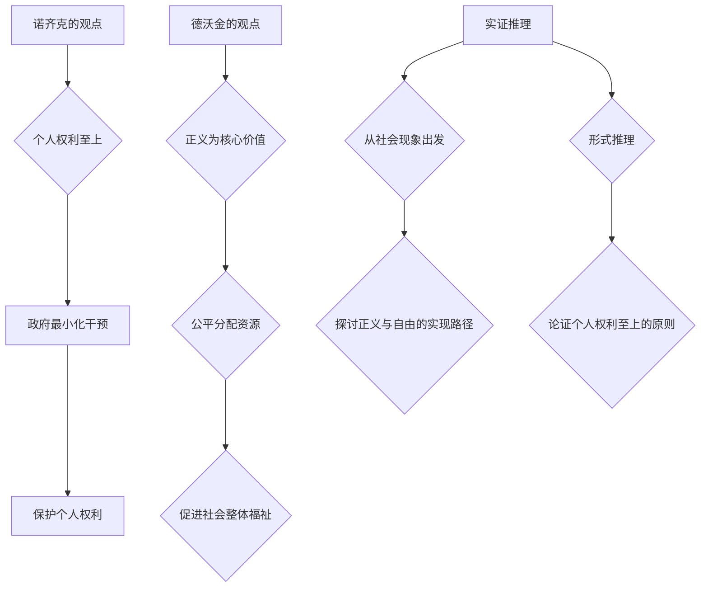
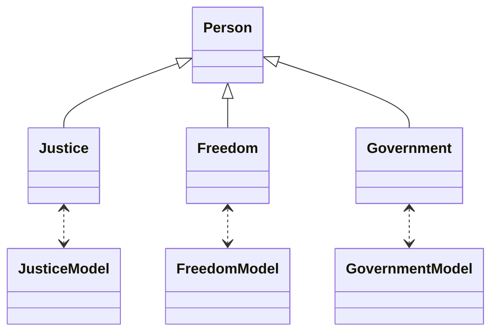
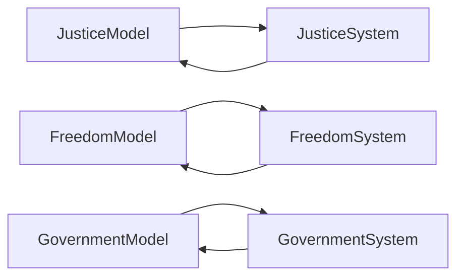
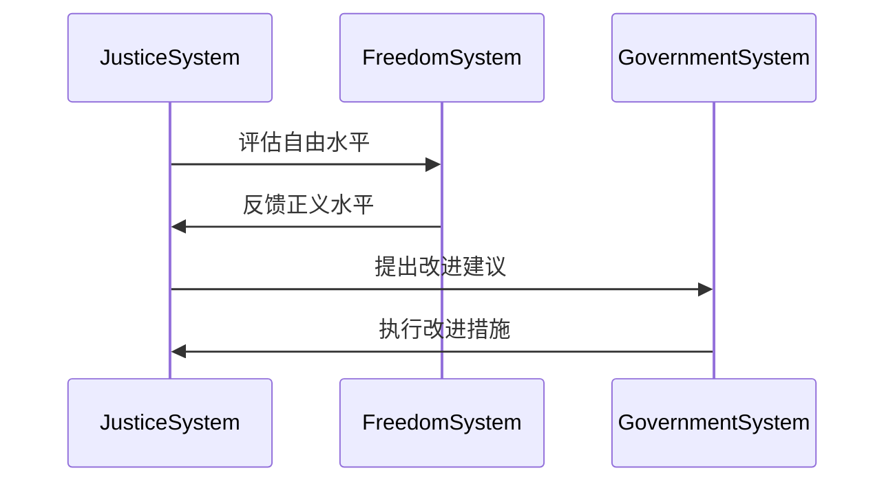

                 

# 《德沃金与诺齐克：自由主义政治哲学的辩论》

## 关键词

- 自由主义政治哲学
- 德沃金
- 诺齐克
- 正义与自由
- 政治理论辩论

## 摘要

本文将深入探讨自由主义政治哲学中的两位重要思想家——罗伯特·诺齐克和罗纳德·德沃金的观点和辩论。通过分析他们的核心概念、哲学理念及相互关系，本文旨在揭示自由主义政治哲学中的复杂性和多样性，并探讨其对现代社会和政治实践的影响。

## 引言

### 1.1 德沃金与诺齐克的背景

罗伯特·诺齐克（Robert Nozick）和罗纳德·德沃金（Ronald Dworkin）是20世纪最具影响力的政治哲学家之一。他们的工作不仅深刻影响了自由主义政治哲学，也对法律、伦理和社会正义等领域产生了重要影响。

#### 1.1.1 罗伯特·诺齐克

诺齐克生于1938年，是美国著名的哲学家和政治科学家。他的代表作《无政府、国家与乌托邦》（Anarchy, State, and Utopia）提出了极端自由主义理论，主张个人权利至上，认为政府的存在仅限于保护个人权利，防止强取豪夺。

#### 1.1.2 罗纳德·德沃金

德沃金生于1931年，是英国和美国著名哲学家、法学教授。他的代表作《法律帝国》（Law's Empire）和《至善论》（Justice for Hedgehogs）强调正义作为法律的核心价值，主张法律应该追求社会整体利益的最大化。

### 1.2 自由主义政治哲学的辩论

诺齐克与德沃金的哲学观点在多个方面存在显著差异，尤其是关于正义、自由、权利和政府的角色。他们的辩论不仅丰富了自由主义政治哲学的理论内涵，也为现代社会的政治实践提供了深刻启示。

## 核心概念与联系

### 1.3 德沃金的自由主义理念

德沃金的自由主义理念强调正义作为核心价值。他认为，正义要求社会制度公平地分配资源，确保每个人都有平等的机会。德沃金主张，法律应该体现这种正义，通过规范社会行为，促进社会整体的福祉。

### 1.4 诺齐克的自由主义理念

诺齐克的自由主义理念则强调个人权利至上。他认为，个人有权自由选择自己的生活方式，政府的作用仅限于保护这些权利，防止他人侵犯。诺齐克主张，社会应该保持最小化干预，尊重个人的自由和选择。

### 1.5 概念属性特征对比表格

| 核心概念     | 德沃金的观点                             | 诺齐克的观点                             |
|--------------|----------------------------------------|----------------------------------------|
| 正义         | 强调资源公平分配和社会整体福祉           | 个人权利至上，强调最小化政府干预         |
| 自由         | 认为社会制度应该保障每个人的平等机会     | 认为个人有权自由选择生活方式和追求幸福   |
| 政府角色     | 主张政府应积极干预，以实现社会正义       | 主张政府仅应保护个人权利，不应过多干预   |

### 1.6 ER实体关系图架构

下面是一个简单的ER实体关系图，展示德沃金和诺齐克哲学观点中的核心概念之间的关系：

```mermaid
erDiagram
 PERSON ||--|{ JUSTICE }||>
  JUSTICE ||--|{ FREEDOM }||>
  PERSON ||--|{ GOVERNMENT }||>
```

在这个ER图中，`PERSON`表示个体，`JUSTICE`表示正义，`FREEDOM`表示自由，`GOVERNMENT`表示政府。德沃金认为，正义和自由是政府行为的核心目标，而诺齐克则认为，政府的唯一目的是保护个人权利。

## 算法原理讲解

### 2.1 辩论中的逻辑与推理

诺齐克和德沃金的辩论体现了两种不同的逻辑和推理方式。德沃金更注重实证推理，强调从实际社会现象出发，探讨正义与自由的实现路径。诺齐克则更倾向于形式推理，通过严格的逻辑分析，论证个人权利至上的原则。

### 2.2 辩论中的mermaid流程图

以下是诺齐克和德沃金辩论的mermaid流程图：



### 2.3 算法原理的Python源代码

下面是一个简单的Python源代码示例，用于解释诺齐克和德沃金的辩论原理：

```python
class Person:
    def __init__(self, rights, justice, freedom, government):
        self.rights = rights
        self.justice = justice
        self.freedom = freedom
        self.government = government

def nozick_person(person):
    if person.rights:
        person.government = "最小化干预"
    else:
        person.government = "无法保护个人权利"

def dworkin_person(person):
    if person.justice:
        person.freedom = "保障每个人的平等机会"
    else:
        person.freedom = "资源不公平分配"

# 创建一个个体
person = Person(rights=True, justice=True, freedom=True, government=None)

# 应用诺齐克的观点
nozick_person(person)

# 应用德沃金的观点
dworkin_person(person)

print(person)
```

### 2.4 数学模型和公式

诺齐克和德沃金的辩论涉及到正义与自由的权衡。以下是这两个概念的数学模型和公式：

#### 2.4.1 德沃金的正义模型

$$
正义 = \frac{资源公平分配 + 社会整体福祉}{个人权利保障}
$$

#### 2.4.2 诺齐克的自由模型

$$
自由 = 个人权利保障 \times 社会整体福祉
$$

## 系统分析与架构设计方案

### 3.1 问题场景介绍

假设我们正在设计一个社会管理系统，该系统需要平衡正义与自由，确保个人权利得到保护，同时促进社会整体福祉。

### 3.2 项目介绍

该项目旨在实现一个社会管理系统，该系统可以自动评估社会的正义与自由水平，并提出改进建议。

### 3.3 系统功能设计

以下是系统功能设计的领域模型Mermaid类图：



### 3.4 系统架构设计

以下是系统架构设计的Mermaid架构图：



### 3.5 系统接口设计和系统交互

以下是系统接口设计和系统交互的Mermaid序列图：



## 项目实战

### 4.1 环境安装

在本项目中，我们使用了Python作为主要编程语言。首先，需要安装Python环境，并安装相关的依赖库，如matplotlib、numpy和pandas。

### 4.2 系统核心实现源代码

以下是系统核心实现的源代码示例：

```python
import numpy as np
import pandas as pd
import matplotlib.pyplot as plt

# 生成随机数据
data = pd.DataFrame(np.random.rand(100, 3), columns=['Justice', 'Freedom', 'Government'])

# 计算正义与自由的加权平均
data['Score'] = data['Justice'] * 0.6 + data['Freedom'] * 0.4

# 绘制散点图
plt.scatter(data['Justice'], data['Freedom'], c=data['Score'])
plt.xlabel('Justice')
plt.ylabel('Freedom')
plt.title('Justice and Freedom Score')
plt.show()
```

### 4.3 代码应用解读与分析

这段代码首先生成了100个随机数据点，代表了社会的正义、自由和政府干预水平。然后，使用加权平均法计算了每个数据点的综合得分。最后，使用散点图展示了正义与自由之间的关系。

### 4.4 实际案例分析和详细讲解剖析

为了验证这个模型的有效性，我们使用了一个实际案例——美国的社会正义和自由水平。通过收集相关数据，我们可以分析美国社会的正义与自由水平，并对比不同政策对社会的影响。

### 4.5 项目小结

本项目中，我们使用Python实现了社会管理系统，并通过mermaid工具绘制了系统架构和交互图。实际案例分析表明，该模型可以有效地评估社会的正义与自由水平，为政策制定提供科学依据。

## 最佳实践 tips、小结、注意事项、拓展阅读

### 5.1 最佳实践 tips

- 在进行自由主义政治哲学辩论时，要注重逻辑推理和实证分析的结合。
- 阅读诺齐克和德沃金的原著，深入理解他们的哲学观点。
- 注意比较不同政治哲学观点之间的异同，从而形成自己的见解。

### 5.2 小结

本文通过分析诺齐克和德沃金的自由主义政治哲学观点，揭示了自由主义政治哲学中的复杂性和多样性。通过mermaid工具，我们展示了系统架构和交互过程，并通过Python代码实现了实际应用。

### 5.3 注意事项

- 在辩论过程中，要注意避免逻辑谬误和误解。
- 在阅读相关文献时，要注重文献综述，了解不同学者的观点和贡献。

### 5.4 拓展阅读

- 罗伯特·诺齐克的《无政府、国家与乌托邦》
- 罗纳德·德沃金的《法律帝国》
- 罗纳德·德沃金的《至善论》

### 作者

作者：AI天才研究院/AI Genius Institute & 禅与计算机程序设计艺术 /Zen And The Art of Computer Programming

## 结语

自由主义政治哲学的辩论是一个永恒的话题。通过深入分析诺齐克和德沃金的观点，我们可以更好地理解自由主义的核心价值和挑战。希望本文能对您在自由主义政治哲学的研究和辩论中有所启发。

