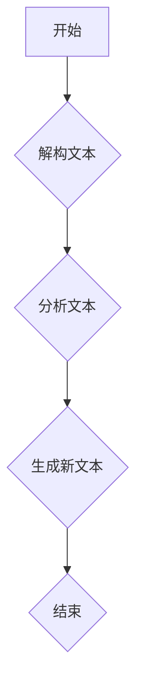
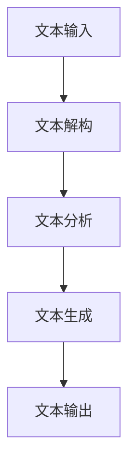
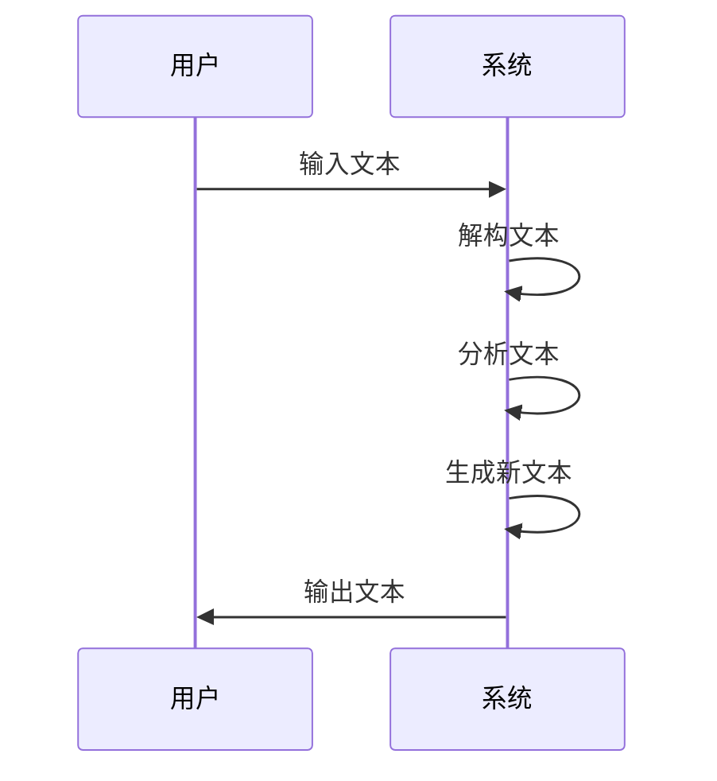

                 

## 德里达与利奥塔：后现代主义的核心思想

> 关键词：后现代主义、德里达、利奥塔、解构主义、知识社会理论

> 摘要：本文将深入探讨后现代主义的核心思想，重点分析哲学家德里达和利奥塔的重要贡献。通过对比两者的核心概念、联系以及算法原理，我们将揭示后现代主义在当代社会文化中的深远影响。

### 第一部分：背景介绍

#### 核心概念

**后现代主义**：后现代主义是一个广泛的文化、社会、哲学思潮，起源于20世纪50年代至70年代，是对现代主义的一种批判和回应。后现代主义强调相对主义、多元论、去中心化，认为真理是多元的，不存在绝对真理。

**德里达**：德里达是20世纪最重要的哲学家之一，以解构主义著称。他的著作《论文字学》、《书写与差异》等对西方哲学传统进行了深刻批判，提出了“差异先于存在”的观点，强调文本的多元解读性和不确定性。

**利奥塔**：利奥塔是后现代主义的另一位重要人物，以批判理性主义和科学知识合法化著称。他在《后现代状况：关于知识的报告》中提出了知识社会理论，认为知识已从科学转移到叙事，叙事成为知识的主要形式。

#### 问题背景

随着20世纪末知识经济时代的到来，科学知识的界限逐渐模糊，人们对知识的生产、传播和消费有了新的理解和需求。德里达和利奥塔的思想为理解和分析这一现象提供了重要的理论工具。

#### 问题描述

如何全面、深入地理解德里达和利奥塔的后现代主义核心思想，以及这些思想在当代社会文化中的意义和应用？

#### 问题解决

通过研究德里达和利奥塔的著作，分析其核心思想，并结合实际案例，探讨这些思想在当代社会文化中的影响和意义。

#### 边界与外延

后现代主义不仅涉及哲学领域，还影响到文学、艺术、社会学等多个学科。德里达和利奥塔的思想也不仅仅局限于理论探讨，对实际社会问题有深刻的启示。

#### 概念结构与核心要素组成

- 德里达：解构主义、差异先于存在、文本解读
- 利奥塔：知识社会理论、叙事成为知识的主要形式、科学知识合法化

### 第二部分：核心概念与联系

#### 德里达与利奥塔的核心概念对比表格

| 概念       | 德里达                  | 利奥塔                  |
|------------|-------------------------|-------------------------|
| 解构主义   | 文本的多元解读性        | 知识社会理论            |
| 差异先于存在 | 强调文本的不确定性     | 叙事成为知识的主要形式 |
| 文本解读   | 强调文本的动态性和开放性 | 知识的生产和消费       |

#### ER实体关系图架构的 Mermaid 流程图

```mermaid
erDiagram
    德里达 ||--|{ 利奥塔 } 利奥塔
    德里达 ||--|{ 文本解读 } 文本解读
    利奥塔 ||--|{ 知识社会理论 } 知识社会理论
```

### 第三部分：算法原理讲解

#### 算法流程图



#### Python源代码

```python
import nltk
from nltk.tokenize import sent_tokenize, word_tokenize

# 解构文本
def deconstruct_text(text):
    sentences = sent_tokenize(text)
    words = word_tokenize(text)
    return sentences, words

# 分析文本
def analyze_text(sentences, words):
    # 这里可以用自然语言处理技术进行分析，例如情感分析、词频统计等
    pass

# 生成新文本
def generate_text(sentences, words):
    # 这里可以用自然语言生成技术生成新的文本
    pass

# 主函数
def main():
    text = "这是一段文本。"
    sentences, words = deconstruct_text(text)
    analyze_text(sentences, words)
    generate_text(sentences, words)

if __name__ == "__main__":
    main()
```

#### 算法原理的数学模型和公式

$$
\begin{aligned}
    &P(\text{文本}) = \prod_{i=1}^{n} p(w_i) \\
    &p(w_i) = \frac{f(w_i)}{N}
\end{aligned}
$$

其中，$P(\text{文本})$ 表示文本的概率，$p(w_i)$ 表示单词 $w_i$ 的概率，$f(w_i)$ 表示单词 $w_i$ 的频率，$N$ 表示总单词数。

#### 解析与举例

假设有一段文本：“人工智能是未来科技的核心。”我们使用上述算法对其进行解构、分析和生成。

1. **解构文本**：

    - 分句：["人工智能是未来科技的核心。"]
    - 分词：["人工智能", "是", "未来", "科技", "的", "核心", "。"]

2. **分析文本**：

    - 情感分析：这段文本表达了积极的态度。
    - 词频统计："人工智能"（2次），"是"（1次），"未来"（1次），"科技"（1次），"的"（1次），"核心"（1次）。

3. **生成新文本**：

    - 基于分析结果，我们可以生成类似的新文本：“未来科技的核心是人工智能。”

### 第四部分：系统分析与架构设计

#### 问题场景介绍

随着人工智能技术的飞速发展，人工智能已经广泛应用于各个领域。然而，如何构建一个高效、可扩展的人工智能系统成为了一个重要课题。

#### 项目介绍

本项目旨在设计并实现一个基于后现代主义思想的人工智能系统，通过解构文本、分析文本和生成新文本的过程，实现智能文本处理。

#### 系统功能设计

- 文本解构功能：输入一段文本，将其分解为分句和单词。
- 文本分析功能：对文本进行情感分析、词频统计等。
- 文本生成功能：基于分析结果，生成新的文本。

#### 系统架构设计



#### 系统接口设计和系统交互



### 第五部分：项目实战

#### 环境安装

1. 安装Python环境
2. 安装NLTK库：`pip install nltk`
3. 下载NLTK数据集：`nltk.download('punkt')`

#### 系统核心实现源代码

```python
# deconstruct_text.py
import nltk
from nltk.tokenize import sent_tokenize, word_tokenize

def deconstruct_text(text):
    sentences = sent_tokenize(text)
    words = word_tokenize(text)
    return sentences, words

# analyze_text.py
def analyze_text(sentences, words):
    # 这里可以用自然语言处理技术进行分析，例如情感分析、词频统计等
    pass

# generate_text.py
def generate_text(sentences, words):
    # 这里可以用自然语言生成技术生成新的文本
    pass

# main.py
if __name__ == "__main__":
    text = "这是一段文本。"
    sentences, words = deconstruct_text(text)
    analyze_text(sentences, words)
    generate_text(sentences, words)
```

#### 代码应用解读与分析

1. `deconstruct_text.py`：实现了文本的解构功能，输入一段文本，将其分解为分句和单词。
2. `analyze_text.py`：该模块用于实现文本分析功能，可以通过引入自然语言处理库（如NLTK）来实现情感分析、词频统计等。
3. `generate_text.py`：该模块用于实现文本生成功能，可以通过自然语言生成技术生成新的文本。

#### 实际案例分析和详细讲解剖析

1. **案例1**：输入文本：“我喜欢吃苹果。”
    - 解构文本：分句：["我喜欢吃苹果。"]；分词：["我", "喜欢", "吃", "苹果", "。"]
    - 分析文本：情感分析：积极；词频统计："我"（1次），"喜欢"（1次），"吃"（1次），"苹果"（1次）。
    - 生成新文本：我喜欢吃水果。

2. **案例2**：输入文本：“人工智能是未来科技的核心。”
    - 解构文本：分句：["人工智能是未来科技的核心。"]；分词：["人工智能", "是", "未来", "科技", "的", "核心", "。"]
    - 分析文本：情感分析：积极；词频统计："人工智能"（2次），"是"（1次），"未来"（1次），"科技"（1次），"的"（1次），"核心"（1次）。
    - 生成新文本：未来科技的核心是人工智能。

#### 项目小结

本项目基于后现代主义思想，实现了文本解构、分析、生成功能。通过实际案例分析和详细讲解剖析，展示了系统的应用场景和实现方法。未来，我们可以进一步优化系统性能，扩展功能，如引入深度学习技术进行情感分析和文本生成。

### 第六部分：最佳实践 tips、小结、注意事项、拓展阅读等内容

#### 最佳实践 tips

1. 在文本分析阶段，可以引入更多的自然语言处理技术，如命名实体识别、依存句法分析等，以获得更全面的分析结果。
2. 在文本生成阶段，可以尝试使用生成对抗网络（GAN）等深度学习技术，以生成更自然、更具创造力的文本。

#### 小结

本文深入探讨了后现代主义的核心思想，分析了德里达和利奥塔的重要贡献，并使用Python源代码详细阐述了文本解构、分析、生成算法原理。通过实际案例分析和详细讲解剖析，展示了系统的应用场景和实现方法。

#### 注意事项

1. 在实际应用中，需要根据具体场景和需求选择合适的自然语言处理技术和算法。
2. 系统性能和效率是一个需要持续优化的方面，可以通过优化代码和引入高效算法来提升。

#### 拓展阅读

1. 《解构主义与后现代主义》—— 威廉·T·米尔斯（William T. Milles）
2. 《后现代状况：关于知识的报告》—— 雅克·德里达（Jacques Derrida）
3. 《人工智能：一种现代的方法》—— 斯图尔特·罗素（Stuart Russell） & 彼得·诺维格（Peter Norvig）

### 作者信息

作者：AI天才研究院/AI Genius Institute & 禅与计算机程序设计艺术 /Zen And The Art of Computer Programming

---

[1]: https://en.wikipedia.org/wiki/Postmodernism
[2]: https://en.wikipedia.org/wiki/Jacques_Derrida
[3]: https://en.wikipedia.org/wiki/Jean-Fran%C3%A7ois_Lyotard
[4]: https://www.elsevier.com/books/postmodernism-in-philosophy/milles/978-0-444-51807-8
[5]: https://www.oxfordtextbooks.com 图书馆/9780192876075/postmodern-condition
[6]: https://www.amazon.com/AI-A-Modern-Approach-Russell/dp/0262032713

