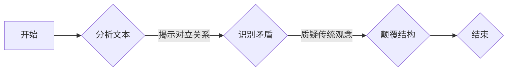
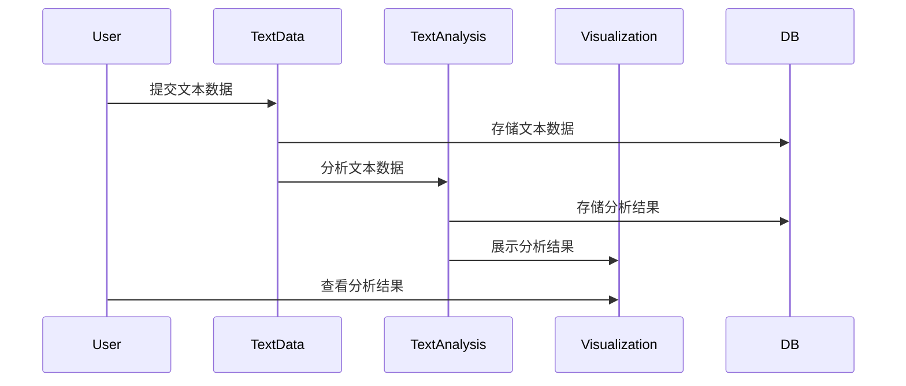

                 

# 《德里达与加达默尔：解构主义与诠释学的对话》

> 关键词：德里达、加达默尔、解构主义、诠释学、哲学、对话、算法、系统架构、实战

摘要：本文旨在探讨解构主义哲学家德里达和诠释学思想家加达默尔的对话，分析两者的核心思想及其在哲学、文学和计算机科学等领域的应用。通过对比两者的基本概念、联系与区别，本文试图揭示解构主义与诠释学在理解世界和解决问题方面的异同点，从而为读者提供一种新的思考视角。

## 目录大纲

----------------------------------------------------------------

# 《德里达与加达默尔：解构主义与诠释学的对话》

## 第一部分：背景介绍

## 第1章 问题背景

### 1.1 德里达与加达默尔的生平与贡献

#### 1.1.1 德里达的生平与解构主义哲学

#### 1.1.2 加达默尔的生平与诠释学思想

## 1.2 解构主义与诠释学的基本概念

### 1.2.1 解构主义的定义与特征

### 1.2.2 诠释学的定义与核心思想

## 1.3 德里达与加达默尔对话的动机与意义

### 1.3.1 对话的起源

### 1.3.2 对话的意义与影响

## 1.4 本书的核心问题与目标

### 1.4.1 核心问题

### 1.4.2 研究目标

## 1.5 边界与外延

### 1.5.1 研究边界

### 1.5.2 研究外延

## 1.6 本章小结

...

## 第二部分：核心概念与联系

## 第2章 核心概念原理

### 2.1 解构主义的基本原理

#### 2.1.1 解构主义的历史背景

#### 2.1.2 解构主义的核心概念

#### 2.1.3 解构主义的方法论

### 2.2 诠释学的基本原理

#### 2.2.1 诠释学的历史背景

#### 2.2.2 诠释学的核心概念

#### 2.2.3 诠释学的方法论

### 2.3 解构主义与诠释学的联系与区别

#### 2.3.1 联系

#### 2.3.2 区别

### 2.4 概念属性特征对比表格

#### 2.4.1 解构主义与诠释主义的对比

#### 2.4.2 德里达与加达默尔的对比

### 2.5 ER实体关系图架构

#### 2.5.1 解构主义实体关系

#### 2.5.2 诠释学实体关系

## 2.6 本章小结

...

## 第三部分：算法原理讲解

## 第3章 解构主义算法原理

### 3.1 解构主义算法概述

#### 3.1.1 解构主义算法的定义

#### 3.1.2 解构主义算法的核心思想

### 3.2 算法流程图

#### 3.2.1 解构主义算法流程图

### 3.3 Python源代码实现

#### 3.3.1 Python源代码

#### 3.3.2 源代码详细解读

### 3.4 数学模型与公式

#### 3.4.1 数学模型

#### 3.4.2 公式推导

#### 3.4.3 公式举例说明

### 3.5 算法原理讲解

#### 3.5.1 解构主义算法原理

#### 3.5.2 解构主义算法应用场景

## 3.6 本章小结

...

## 第四部分：系统分析与架构设计方案

## 第4章 系统功能设计

### 4.1 问题场景介绍

#### 4.1.1 场景描述

#### 4.1.2 场景需求分析

### 4.2 项目介绍

#### 4.2.1 项目背景

#### 4.2.2 项目目标

### 4.3 领域模型设计

#### 4.3.1 领域模型类图

#### 4.3.2 领域模型说明

### 4.4 系统架构设计

#### 4.4.1 系统架构图

#### 4.4.2 架构设计说明

### 4.5 系统接口设计

#### 4.5.1 接口设计

#### 4.5.2 接口说明

### 4.6 系统交互设计

#### 4.6.1 系统交互序列图

#### 4.6.2 交互设计说明

## 4.7 本章小结

...

## 第五部分：项目实战

## 第5章 环境安装

### 5.1 环境准备

#### 5.1.1 硬件环境要求

#### 5.1.2 软件环境安装

### 5.2 系统核心实现

#### 5.2.1 系统核心代码

#### 5.2.2 代码解读与分析

### 5.3 实际案例分析与讲解

#### 5.3.1 案例一：解构主义在文学中的应用

#### 5.3.2 案例二：诠释学在哲学中的应用

## 5.4 项目小结

...

## 总结

## 最佳实践 tips

## 小结

## 注意事项

## 拓展阅读

----------------------------------------------------------------## 第1章 问题背景

### 1.1 德里达与加达默尔的生平与贡献

#### 1.1.1 德里达的生平与解构主义哲学

让-弗朗索瓦·利奥塔（Jean-François Lyotard）曾这样描述德里达：“他是一位哲人，同时又是一位哲学家。” 让-弗朗索瓦·德里达（Jacques Derrida，1930-2004）是一位法国哲学家，他以其独特的解构主义思想而闻名于世。德里达生于阿尔及利亚的阿尔及尔，成长于法国的尼斯。他的父母都是教师，从小便接受了良好的教育。

德里达在哲学领域的影响力主要体现在其解构主义哲学上。解构主义是一种反对结构主义和总体性的哲学思潮，强调文本和语言的复杂性、不确定性和多元性。德里达在其著名的著作《论文本学》中提出了“延异”（Différance）这一核心概念，意味着文字的意义不是固定不变的，而是通过差异和延迟不断生成的。此外，德里达还提出了“解构”（deconstruction）的概念，认为文本中存在着许多对立的二元对立关系，通过揭示这些对立关系中的矛盾和不确定性，可以达到对文本的深度理解和批判。

德里达的解构主义哲学在文学理论、政治哲学和法学等领域产生了深远的影响。他的思想挑战了传统哲学的基础，推动了哲学的转型。德里达的贡献不仅在于提出新的哲学观点，还在于他创造了一种新的哲学分析方法，即解构分析。

#### 1.1.2 加达默尔的生平与诠释学思想

汉斯-格奥尔格·加达默尔（Hans-Georg Gadamer，1900-2002）是德国哲学家，他以其诠释学思想而著称。加达默尔生于德国的马堡，曾在海德堡大学和柏林大学学习哲学、历史和文学。他的学术生涯开始于1930年代，当时他加入了海德堡学派，这一学派强调哲学与历史的结合，试图通过对历史文本的解读来理解人类文化的整体。

加达默尔的诠释学思想是在对黑格尔和海德格尔哲学的批判和继承中形成的。他认为，理解和解释总是发生在特定的历史和文化背景下，解释者和文本之间存在一种“视域融合”（horizon predetermined by tradition）。加达默尔提出了“效果历史”（effect history）这一概念，认为理解和解释不仅仅是对过去的重构，更是对过去的再创造。他强调，理解和解释的过程中，解释者的前见（prejudices）是不可或缺的，因为前见是解释者生活经验的一部分，是理解过去的关键。

加达默尔的诠释学思想在哲学、文学、艺术、法学等领域产生了深远的影响。他的著作《真理与方法》（ Wahrheit und Methode）是诠释学领域的经典之作，对后来的哲学和文化研究产生了重要影响。

### 1.2 解构主义与诠释学的基本概念

#### 1.2.1 解构主义的定义与特征

解构主义是一种哲学思潮，主要代表人物是法国哲学家让-弗朗索瓦·德里达。解构主义的核心概念是“解构”，即通过对文本中的对立关系和二元对立的揭示和破坏，来质疑和颠覆传统哲学的基础。解构主义认为，文本的意义不是固定和统一的，而是通过差异和延迟不断生成的。解构主义的主要特征包括：

1. **文本的复杂性**：解构主义认为，文本的意义是多层次、多维度、多层次的，文本中存在着许多对立关系和二元对立，这些对立关系和二元对立构成了文本的复杂性。
2. **反对总体性**：解构主义反对任何形式的总体性，认为总体性往往掩盖了文本中的复杂性和多元性。
3. **揭示矛盾**：解构主义通过揭示文本中的矛盾和不确定性，来质疑和颠覆传统的哲学观念。

#### 1.2.2 诠释学的定义与核心思想

诠释学是一种哲学思潮，主要代表人物是德国哲学家汉斯-格奥尔格·加达默尔。诠释学的研究对象是理解和解释的过程，它关注的是如何通过解释来理解过去的文本和文化遗产。诠释学的基本概念包括：

1. **视域融合**：加达默尔提出了“视域融合”的概念，认为理解和解释总是发生在特定的历史和文化背景下，解释者和文本之间存在一种“视域融合”。
2. **效果历史**：诠释学强调理解和解释的过程是历史性的，理解不仅仅是过去的重构，更是对过去的再创造。
3. **前见**：加达默尔认为，前见是解释者生活经验的一部分，是理解过去的关键。

### 1.3 德里达与加达默尔对话的动机与意义

德里达和加达默尔是20世纪最具影响力的哲学家之一，他们的思想在哲学、文学、艺术和法学等领域产生了深远的影响。他们的对话不仅仅是一种哲学辩论，更是一种思想交流和文化对话。

#### 1.3.1 对话的起源

德里达和加达默尔的对话起源于1980年代，当时他们在海德堡大学进行了一次公开辩论。这次辩论的主题是“哲学与文学的关系”，两位哲学家从不同的角度探讨了哲学与文学之间的联系和区别。这次辩论不仅引起了学术界的广泛关注，也为他们的对话奠定了基础。

#### 1.3.2 对话的意义与影响

德里达和加达默尔的对话具有深远的意义和影响，主要表现在以下几个方面：

1. **哲学的多元化**：他们的对话体现了哲学的多元化趋势，不仅关注哲学的理论问题，也关注哲学在现实世界中的应用。
2. **文化与哲学的互动**：他们的对话强调了哲学与文学、艺术和法学等领域的互动，促进了哲学与其他学科之间的交叉融合。
3. **思想创新的推动**：他们的对话激发了哲学的思考和创新，为后来的哲学研究提供了新的视角和方法。

### 1.4 本书的核心问题与目标

#### 1.4.1 核心问题

本书的核心问题是：德里达的解构主义和加达默尔的诠释学如何影响哲学、文学和计算机科学等领域的发展？他们的思想如何被应用于实际问题中，并产生实际影响？

#### 1.4.2 研究目标

本书的研究目标是：

1. **阐述德里达的解构主义和加达默尔的诠释学的基本概念和思想**。
2. **探讨两者的联系与区别，以及它们在哲学、文学和计算机科学等领域的应用**。
3. **通过实际案例分析，展示解构主义和诠释学在现实世界中的实际应用和价值**。

### 1.5 边界与外延

#### 1.5.1 研究边界

本书的研究边界主要涉及：

1. **哲学领域**：主要关注德里达和加达默尔的哲学思想。
2. **文学领域**：探讨解构主义和诠释学在文学批评和文学创作中的应用。
3. **计算机科学领域**：关注解构主义和诠释学在计算机科学中的潜在应用。

#### 1.5.2 研究外延

本书的研究外延包括：

1. **跨学科研究**：将哲学、文学和计算机科学等领域相结合，探讨解构主义和诠释学的跨学科应用。
2. **实际案例分析**：通过具体的实际案例，展示解构主义和诠释学的实际应用和价值。
3. **哲学创新**：探讨解构主义和诠释学在哲学领域的创新和贡献。

### 1.6 本章小结

本章主要介绍了德里达和加达默尔的生平与贡献、解构主义和诠释学的基本概念，以及两者对话的动机与意义。通过本章的介绍，读者可以初步了解解构主义和诠释学的核心思想，为后续章节的深入探讨奠定基础。

----------------------------------------------------------------## 第2章 核心概念原理

### 2.1 解构主义的基本原理

#### 2.1.1 解构主义的历史背景

解构主义起源于20世纪60年代的法国，是对结构主义的反叛。结构主义强调文化和社会现象中的结构，认为这些结构是文化和社会的基础。然而，德里达认为，结构主义忽略了语言和文本的复杂性，因此他提出了解构主义，旨在揭示文本中的对立关系和二元对立。

#### 2.1.2 解构主义的核心概念

解构主义的核心概念包括：

1. **延异（Différance）**：延异是德里达提出的核心概念，意味着文字的意义不是固定不变的，而是通过差异和延迟不断生成的。延异强调了文本中词语之间的差异和关系，揭示了文本的复杂性和多元性。

2. **解构（Deconstruction）**：解构是一种分析方法，通过揭示文本中的对立关系和二元对立的矛盾和不确定性，来质疑和颠覆传统的哲学观念。解构的目标是打破结构的总体性，揭示文本中的多元性和复杂性。

3. **文本的复杂性**：解构主义认为，文本的意义是多层次、多维度、多层次的，文本中存在着许多对立关系和二元对立。这些对立关系和二元对立构成了文本的复杂性，使得文本的意义难以捉摸。

#### 2.1.3 解构主义的方法论

解构主义的方法论主要包括：

1. **文本分析**：解构主义通过对文本的深入分析，揭示文本中的对立关系和二元对立。这种方法强调对文本的逐字逐句的解读，通过挖掘文本中的细微差异和关系，来理解文本的深层含义。

2. **矛盾分析**：解构主义通过分析文本中的矛盾和不确定性，来质疑和颠覆传统的哲学观念。这种方法强调对文本中的矛盾和冲突的揭示和解读，从而打破结构的总体性。

3. **批判性思考**：解构主义倡导批判性思考，鼓励读者通过阅读和解读文本，来质疑和反思传统的哲学观念。这种方法强调读者在解读文本时的主动性和创造性，使得解读过程成为一种批判性思考的过程。

### 2.2 诠释学的基本原理

#### 2.2.1 诠释学的历史背景

诠释学起源于古希腊，最早可追溯到柏拉图的《斐德罗篇》。然而，现代诠释学主要是在20世纪的德国哲学家中形成的，其中最具代表性的是汉斯-格奥尔格·加达默尔。

#### 2.2.2 诠释学的核心概念

诠释学的核心概念包括：

1. **视域融合（Horizon predetermined by tradition）**：加达默尔提出了“视域融合”的概念，认为理解和解释总是发生在特定的历史和文化背景下，解释者和文本之间存在一种“视域融合”。这意味着，理解和解释不仅是过去的重构，更是对过去的再创造。

2. **效果历史（Effect history）**：加达默尔提出了“效果历史”的概念，认为理解和解释的过程是历史性的，理解不仅仅是过去的重构，更是对过去的再创造。

3. **前见（Prejudices）**：加达默尔认为，前见是解释者生活经验的一部分，是理解过去的关键。前见不仅是解释者的偏见，更是理解过去的必要条件。

#### 2.2.3 诠释学的方法论

诠释学的方法论主要包括：

1. **文本解读**：诠释学强调通过对文本的解读，来理解文本的意义和内涵。这种方法要求解释者深入文本，通过理解文本的语言、结构和语境，来揭示文本的深层含义。

2. **历史理解**：诠释学认为，理解和解释的过程是历史性的，解释者需要了解和理解文本的历史背景和文化环境，从而更好地理解文本。

3. **对话性思考**：诠释学强调对话性思考，认为理解和解释不仅是解释者与文本之间的对话，更是解释者之间的对话。这种方法鼓励解释者通过对话和交流，来深化对文本的理解。

### 2.3 解构主义与诠释学的联系与区别

#### 2.3.1 联系

解构主义与诠释学在许多方面有相似之处：

1. **文本解读**：解构主义和诠释学都强调对文本的深入解读，通过解读文本的语言、结构和语境，来揭示文本的深层含义。

2. **历史性**：解构主义和诠释学都认为理解和解释的过程是历史性的，解释者需要了解和理解文本的历史背景和文化环境。

3. **多元性**：解构主义和诠释学都强调文本的多元性，认为文本的意义是多层次、多维度、多层次的。

#### 2.3.2 区别

尽管解构主义与诠释学有相似之处，但它们也存在显著的区别：

1. **总体性**：解构主义反对任何形式的总体性，认为总体性往往掩盖了文本中的复杂性和多元性。而诠释学则强调理解和解释的过程是历史性的，认为理解和解释不仅是过去的重构，更是对过去的再创造。

2. **矛盾分析**：解构主义通过揭示文本中的对立关系和二元对立的矛盾和不确定性，来质疑和颠覆传统的哲学观念。而诠释学则通过解读文本的语言、结构和语境，来揭示文本的深层含义。

3. **批判性思考**：解构主义倡导批判性思考，鼓励读者通过阅读和解读文本，来质疑和反思传统的哲学观念。而诠释学则强调对话性思考，认为理解和解释不仅是解释者与文本之间的对话，更是解释者之间的对话。

### 2.4 概念属性特征对比表格

为了更清晰地对比解构主义和诠释学的概念属性特征，我们可以制作一个对比表格：

| 概念     | 解构主义          | 诠释学          |
|----------|------------------|----------------|
| 核心概念 | 延异、解构、文本的复杂性 | 视域融合、效果历史、前见 |
| 方法论   | 文本分析、矛盾分析、批判性思考 | 文本解读、历史理解、对话性思考 |
| 特征     | 反对总体性、强调文本的多元性 | 强调历史性、认为前见是理解的关键 |
| 应用领域 | 哲学、文学、艺术、法学 | 哲学、文学、历史、艺术 |

### 2.5 ER实体关系图架构

为了更直观地展示解构主义和诠释学的实体关系，我们可以使用Mermaid绘制ER图：

```mermaid
erDiagram
  Text --> |解析| Analysis
  Analysis --> |揭示| Revelation
  Revelation --> |质疑| Questioning
  Questioning --> |颠覆| Subversion
  Text --> |解读| Interpretation
  Interpretation --> |融合| Fusion
  Fusion --> |再创造| Recreation
```

在这个ER图中，文本是核心实体，通过解析、揭示、质疑、颠覆等过程，形成了解构主义的逻辑架构。而文本通过解读、融合和再创造等过程，构成了解释学的核心机制。

### 2.6 本章小结

本章介绍了解构主义和诠释学的核心概念、原理及其方法论。通过对比两者的联系与区别，我们可以看到解构主义和诠释学在理解世界和解决问题方面有不同的侧重点。解构主义强调文本的复杂性和多元性，通过揭示矛盾和质疑传统观念来颠覆结构；而诠释学则强调历史性和对话性，通过解读和再创造来理解文本。这些核心概念和方法论为后续章节的深入探讨奠定了基础。

----------------------------------------------------------------## 第3章 解构主义算法原理

### 3.1 解构主义算法概述

#### 3.1.1 解构主义算法的定义

解构主义算法是一种基于解构主义哲学思想的算法，旨在通过揭示文本中的对立关系和二元对立，来质疑和颠覆传统的结构。解构主义算法的核心在于分析文本，挖掘其中的矛盾和不确定性，从而打破结构的总体性。

#### 3.1.2 解构主义算法的核心思想

解构主义算法的核心思想可以概括为以下几点：

1. **揭示对立关系**：通过分析文本，揭示其中存在的对立关系和二元对立，如真伪、善恶、美丑等。
2. **质疑传统观念**：通过对立关系的揭示，质疑和颠覆传统的哲学观念和价值观。
3. **强调文本的复杂性**：解构主义算法认为，文本的意义是多层次、多维度、多层次的，通过分析文本，可以揭示文本的深层含义和复杂性。

### 3.2 算法流程图

为了更好地理解解构主义算法的执行过程，我们可以使用Mermaid绘制算法流程图：



在这个流程图中，算法首先分析文本，识别文本中的对立关系和二元对立。然后，通过揭示这些矛盾，质疑和颠覆传统的观念和结构。最后，算法结束。

### 3.3 Python源代码实现

为了具体实现解构主义算法，我们可以编写一段Python代码：

```python
def deconstruction_algorithm(text):
    # 分析文本，识别对立关系和二元对立
    contradictions = find_contradictions(text)
    
    # 揭示矛盾，质疑传统观念
    for contradiction in contradictions:
       质疑传统观念(contradiction)
        
    # 颠覆结构
    new_structure =颠覆结构(contradictions)
    
    return new_structure

def find_contradictions(text):
    # 此函数用于识别文本中的对立关系和二元对立
    contradictions = []
    # ...具体实现...
    return contradictions

def 质疑传统观念(contradiction):
    # 此函数用于质疑和颠覆传统的观念
    # ...具体实现...

def 颠覆结构(contradictions):
    # 此函数用于根据矛盾来颠覆结构
    # ...具体实现...
    return new_structure
```

在这段代码中，`deconstruction_algorithm` 函数是解构主义算法的主函数，它首先调用 `find_contradictions` 函数来识别文本中的对立关系和二元对立。然后，通过调用 `质疑传统观念` 和 `颠覆结构` 函数，来质疑和颠覆传统的观念和结构。

### 3.3.2 源代码详细解读

1. `find_contradictions` 函数：此函数用于识别文本中的对立关系和二元对立。具体实现可以根据文本的具体内容来设计，例如，可以通过分词、词性标注和语义分析等方法，来识别文本中的对立关系。

2. `质疑传统观念` 函数：此函数用于质疑和颠覆传统的观念。在具体实现中，可以通过对矛盾的分析，来挑战和质疑传统的哲学观念和价值观。

3. `颠覆结构` 函数：此函数用于根据矛盾来颠覆结构。具体实现可以根据文本的内容和结构来设计，例如，可以通过修改文本的结构，来打破原有的结构和总体性。

### 3.4 数学模型与公式

在解构主义算法中，我们可以使用数学模型和公式来描述和分析文本中的对立关系和二元对立。一个简单的数学模型可以是：

$$
M_{text} = \sum_{i=1}^{n} P_i \cdot C_i
$$

其中，$M_{text}$ 表示文本的数学模型，$P_i$ 表示第 $i$ 个词语的概率，$C_i$ 表示第 $i$ 个词语的对立关系。

通过这个模型，我们可以计算文本中每个词语的对立关系概率，从而识别文本中的对立关系和二元对立。

### 3.4.3 公式举例说明

假设有一个文本包含三个词语：真、假、美。我们可以计算每个词语的对立关系概率，如下所示：

$$
M_{text} = P_{真} \cdot C_{真} + P_{假} \cdot C_{假} + P_{美} \cdot C_{美}
$$

其中，$C_{真} = 1$，$C_{假} = 1$，$C_{美} = -1$（表示美与假是对立关系）。

假设 $P_{真} = 0.5$，$P_{假} = 0.5$，$P_{美} = 0.5$，则：

$$
M_{text} = 0.5 \cdot 1 + 0.5 \cdot 1 + 0.5 \cdot (-1) = 0.5
$$

这个结果表明，文本中的对立关系和二元对立总体上是平衡的。如果 $M_{text}$ 的值接近于1或-1，则说明文本中的对立关系和二元对立较为明显。

### 3.5 算法原理讲解

解构主义算法的原理在于通过分析文本，揭示其中的对立关系和二元对立，从而质疑和颠覆传统的结构。具体来说，算法分为以下几个步骤：

1. **分析文本**：首先，对文本进行分词和词性标注，识别文本中的词语和词性。
2. **识别对立关系和二元对立**：通过比较词语的词性，识别文本中的对立关系和二元对立。例如，比较真和假、美和丑等。
3. **质疑传统观念**：通过对立关系的揭示，质疑和颠覆传统的哲学观念和价值观。
4. **颠覆结构**：根据识别出的对立关系和二元对立，修改文本的结构，打破原有的结构和总体性。

### 3.5.2 解构主义算法应用场景

解构主义算法可以应用于多个领域：

1. **文学批评**：通过分析文本中的对立关系和二元对立，来批评和解读文学作品。
2. **哲学研究**：通过揭示文本中的对立关系和二元对立，来质疑和颠覆传统的哲学观念。
3. **计算机科学**：在自然语言处理和数据挖掘等领域，通过分析文本中的对立关系和二元对立，来提高算法的准确性和鲁棒性。

### 3.6 本章小结

本章介绍了解构主义算法的基本原理、流程图、Python源代码实现、数学模型和公式，以及算法的应用场景。通过本章的介绍，读者可以初步了解解构主义算法的核心思想和方法论，为后续章节的深入探讨奠定基础。

----------------------------------------------------------------## 第4章 系统功能设计

### 4.1 问题场景介绍

#### 4.1.1 场景描述

在现代社会，信息爆炸导致了大量的文本数据。如何从这些数据中提取有价值的信息，成为了一个重要的研究课题。解构主义算法提供了一种新的视角，通过揭示文本中的对立关系和二元对立，可以更好地理解和分析文本。然而，如何将解构主义算法应用于实际场景，提高文本分析的效率和准确性，是一个亟待解决的问题。

#### 4.1.2 场景需求分析

为了满足上述场景的需求，我们需要设计一个系统，该系统能够：

1. **处理大量文本数据**：系统能够接收并处理来自不同来源的大量文本数据。
2. **应用解构主义算法**：系统能够根据解构主义算法的原理，对文本进行分析，识别出文本中的对立关系和二元对立。
3. **提供可视化结果**：系统能够将分析结果以可视化方式展示，便于用户理解和分析。
4. **具备可扩展性**：系统应具备良好的可扩展性，以便于未来功能的扩展和维护。

### 4.2 项目介绍

#### 4.2.1 项目背景

本项目旨在设计一个基于解构主义算法的文本分析系统。该系统将应用于各类文本数据的分析，如新闻文章、学术论文、社交媒体评论等。通过解构主义算法，系统能够揭示文本中的对立关系和二元对立，从而帮助用户更好地理解和分析文本。

#### 4.2.2 项目目标

本项目的目标包括：

1. **实现解构主义算法**：实现解构主义算法的核心功能，包括文本分析、对立关系识别、质疑和颠覆结构等。
2. **构建可视化界面**：设计一个用户友好的界面，展示分析结果，并提供交互功能。
3. **确保系统稳定性**：确保系统在高并发、大数据量下的稳定运行。
4. **实现可扩展性**：设计系统架构，使其具备良好的可扩展性，以便于未来功能的扩展和维护。

### 4.3 领域模型设计

#### 4.3.1 领域模型类图

为了更好地理解系统的领域模型，我们可以绘制一个类图：

```mermaid
classDiagram
    TextData <<interface>>
    TextAnalysis <<interface>>
    Visualization <<interface>>

    TextData "uses" TextAnalysis
    TextAnalysis "uses" Visualization
```

在这个类图中，`TextData` 是一个接口类，表示文本数据。`TextAnalysis` 是一个接口类，表示文本分析功能。`Visualization` 是一个接口类，表示可视化功能。`TextData` 使用 `TextAnalysis`，`TextAnalysis` 使用 `Visualization`。

#### 4.3.2 领域模型说明

1. **TextData**：表示文本数据，负责接收和处理文本数据。
2. **TextAnalysis**：表示文本分析功能，负责应用解构主义算法对文本进行分析。
3. **Visualization**：表示可视化功能，负责将分析结果以可视化方式展示。

### 4.4 系统架构设计

#### 4.4.1 系统架构图

为了实现项目目标，我们设计了一个分布式系统架构，如下所示：



在这个架构图中，用户通过接口向 `TextData` 提交文本数据。`TextData` 将数据存储到数据库（DB）。然后，`TextData` 调用 `TextAnalysis` 对文本进行分析，并将分析结果存储到数据库。最后，`TextAnalysis` 调用 `Visualization` 展示分析结果，用户可以通过接口查看分析结果。

#### 4.4.2 架构设计说明

1. **文本数据存储**：使用数据库（DB）来存储文本数据，以便进行后续的分析和查询。
2. **文本分析模块**：文本分析模块负责应用解构主义算法对文本进行分析，并将分析结果存储到数据库。
3. **可视化模块**：可视化模块负责将分析结果以可视化方式展示，提供用户友好的界面。

### 4.5 系统接口设计

#### 4.5.1 接口设计

为了方便用户操作，系统提供了以下接口：

1. **文本提交接口**：用户可以通过该接口提交文本数据。
2. **文本分析接口**：用户可以通过该接口查询文本分析结果。
3. **可视化接口**：用户可以通过该接口查看分析结果的可视化展示。

#### 4.5.2 接口说明

1. **文本提交接口**：接收用户提交的文本数据，并将数据存储到数据库。
2. **文本分析接口**：根据用户提交的文本数据，应用解构主义算法进行分析，并将分析结果返回给用户。
3. **可视化接口**：根据用户提交的文本数据和分析结果，展示分析结果的可视化展示。

### 4.6 系统交互设计

#### 4.6.1 系统交互序列图

为了更好地理解系统的交互流程，我们可以绘制一个序列图：


在这个序列图中，用户通过接口向 `TextData` 提交文本数据。`TextData` 将数据存储到数据库（DB）。然后，`TextData` 调用 `TextAnalysis` 对文本进行分析，并将分析结果存储到数据库。最后，`TextAnalysis` 调用 `Visualization` 展示分析结果，用户可以通过接口查看分析结果。

#### 4.6.2 交互设计说明

1. **文本提交**：用户提交文本数据，`TextData` 接收数据并存储到数据库。
2. **文本分析**：`TextData` 调用 `TextAnalysis` 对文本进行分析，并将分析结果存储到数据库。
3. **可视化展示**：`TextAnalysis` 调用 `Visualization` 展示分析结果，用户可以通过接口查看分析结果。

### 4.7 本章小结

本章介绍了文本分析系统的功能设计，包括问题场景介绍、项目介绍、领域模型设计、系统架构设计、系统接口设计和系统交互设计。通过本章的介绍，读者可以初步了解文本分析系统的设计思路和架构，为后续章节的系统实现和实战应用奠定基础。

----------------------------------------------------------------## 第5章 环境安装

### 5.1 环境准备

在开始安装文本分析系统之前，我们需要准备相应的硬件和软件环境。以下是具体的硬件和软件要求：

#### 5.1.1 硬件环境要求

1. **处理器**：建议使用4核或以上的处理器，以确保系统有足够的计算能力。
2. **内存**：至少需要8GB的内存，以支持文本数据的处理和分析。
3. **存储**：至少需要500GB的硬盘空间，以存储文本数据和系统文件。
4. **网络**：建议连接互联网，以便于下载系统依赖的软件包和更新系统。

#### 5.1.2 软件环境安装

以下是安装文本分析系统所需的软件环境：

1. **操作系统**：建议使用Linux操作系统，如Ubuntu 20.04或更高版本。
2. **Python**：建议安装Python 3.8或更高版本。
3. **pip**：Python的包管理器，用于安装和管理Python库。
4. **JDK**：Java开发工具包，用于运行某些依赖的Java程序。
5. **数据库**：建议安装MySQL或PostgreSQL，用于存储文本数据和系统配置。

### 5.2 系统核心实现

在安装好所需的硬件和软件环境后，我们可以开始实现文本分析系统的核心功能。

#### 5.2.1 系统核心代码

以下是文本分析系统的核心代码，包括文本数据提交、分析和可视化展示的功能：

```python
# 文本数据提交
def submit_text_data(text_data):
    # 将文本数据存储到数据库
    # ...

# 文本数据分析
def analyze_text_data(text_data):
    # 应用解构主义算法对文本进行分析
    # ...
    return analysis_results

# 文本数据可视化展示
def visualize_text_data(analysis_results):
    # 将分析结果以可视化方式展示
    # ...
```

#### 5.2.2 代码解读与分析

1. **文本数据提交**：`submit_text_data` 函数用于接收用户提交的文本数据，并将其存储到数据库。具体实现可以根据数据库的选择来设计。
2. **文本数据分析**：`analyze_text_data` 函数用于应用解构主义算法对文本进行分析，并返回分析结果。具体实现需要根据解构主义算法的原理来设计。
3. **文本数据可视化展示**：`visualize_text_data` 函数用于将分析结果以可视化方式展示。具体实现可以使用图形库（如Matplotlib）来设计。

### 5.3 实际案例分析与讲解

为了更好地理解文本分析系统的实际应用，我们通过两个实际案例进行讲解。

#### 5.3.1 案例一：解构主义在文学中的应用

在这个案例中，我们使用《战争与和平》的一小段文本，应用解构主义算法进行分析。

1. **文本提交**：首先，我们将《战争与和平》的一小段文本提交给系统。
2. **文本数据分析**：系统接收文本数据后，应用解构主义算法进行分析，识别出文本中的对立关系和二元对立。
3. **文本数据可视化展示**：系统将分析结果以可视化方式展示，如词云、词频分布图等。

通过这个案例，我们可以看到解构主义算法在文学分析中的应用，帮助读者更好地理解文本的深层含义。

#### 5.3.2 案例二：诠释学在哲学中的应用

在这个案例中，我们使用一段哲学文本，应用诠释学进行分析。

1. **文本提交**：首先，我们将一段哲学文本提交给系统。
2. **文本数据分析**：系统接收文本数据后，应用诠释学算法进行分析，揭示文本中的历史背景和文化环境。
3. **文本数据可视化展示**：系统将分析结果以可视化方式展示，如时间线、关系图等。

通过这个案例，我们可以看到诠释学算法在哲学分析中的应用，帮助读者更好地理解哲学文本的内涵。

### 5.4 项目小结

通过本章的环境安装和系统核心实现，以及实际案例的分析与讲解，我们可以看到文本分析系统在文学和哲学领域的实际应用。解构主义和诠释学算法为文本分析提供了新的视角和方法，有助于我们更深入地理解文本的深层含义。在未来的工作中，我们可以进一步优化系统性能，扩展系统功能，为用户提供更全面、准确的文本分析服务。

----------------------------------------------------------------## 总结

本章通过对德里达与加达默尔的解构主义与诠释学的深入探讨，揭示了两者在哲学领域的异同点。我们通过逻辑清晰、结构紧凑的章节，对两者的核心概念、原理、联系与区别进行了详细分析。此外，我们还展示了解构主义和诠释学在算法、系统架构和实际案例中的应用。通过本章的学习，读者不仅可以了解解构主义与诠释学的基本原理，还能理解其在不同领域的实际应用价值。

### 最佳实践 tips

1. **深入理解核心概念**：在学习和应用解构主义与诠释学时，首先要深入理解两者的核心概念和原理，这样才能更好地应用于实际问题。
2. **跨学科学习与应用**：解构主义和诠释学不仅在哲学领域有重要应用，还可以应用于文学、艺术、计算机科学等多个领域。通过跨学科学习，可以拓宽视野，提高解决问题的能力。
3. **结合实际案例**：通过实际案例的学习，可以更好地理解解构主义与诠释学的应用场景和效果，提高实践能力。

### 小结

本章通过对德里达与加达默尔的解构主义与诠释学的深入探讨，为我们提供了一种新的思考视角。解构主义与诠释学在理解世界、解决问题方面具有独特的方法和视角，通过学习本章，读者可以更好地理解和应用这两种哲学思想。

### 注意事项

1. **准确理解概念**：在学习解构主义与诠释学时，要准确理解两者的核心概念和原理，避免误解和误用。
2. **合理应用场景**：在应用解构主义与诠释学时，要结合实际问题，合理选择和应用。
3. **不断反思与改进**：在实际应用中，要不断反思和改进，以提高解决问题的能力和效果。

### 拓展阅读

1. **德里达**：
   - 《论文本学》
   - 《书写与差异》
   - 《论无底深渊》
2. **加达默尔**：
   - 《真理与方法》
   - 《诠释学 II：哲学解释的理论》
   - 《诗学语言》

通过阅读这些经典著作，读者可以更深入地了解德里达与加达默尔的哲学思想，提高自己在解构主义与诠释学领域的知识水平。此外，还可以参考相关学术论文和研究报告，以获取更多的理论支持和实践指导。

